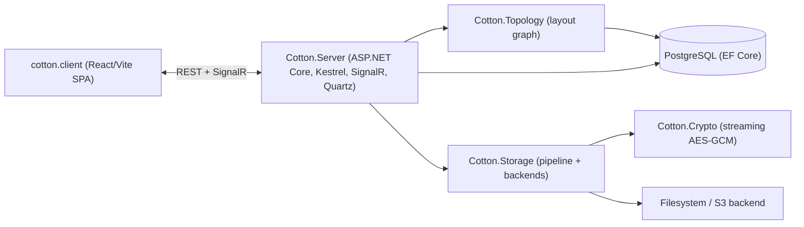

[](LICENSE)
[](https://github.com/bvdcode/cotton/actions)
[](https://www.codefactor.io/repository/github/bvdcode/cotton)
[](https://github.com/bvdcode/cotton/releases)
[](https://hub.docker.com/r/bvdcode/cotton)

<div align="center">

# Cotton Cloud

### Self-hosted file cloud for fast, predictable day-to-day storage

A storage server with desktop/mobile clients, content-addressed files, streaming AES-GCM encryption, and a clean UI for real use.

<p>
  <a href="#quick-start"></a>
  <a href="https://play.google.com/apps/testing/dev.cottoncloud.app"></a>
  <a href="https://github.com/bvdcode/cotton-mobile/releases/latest/download/CottonCloud-Android.apk"></a>
  <a href="https://github.com/bvdcode/cotton-sync-client/releases/latest/download/CottonSync-Windows-Setup.exe"></a>
  <a href="https://github.com/bvdcode/cotton-sync-client/releases/latest/download/CottonSync-Linux.deb"></a>
</p>

<p>
  <a href="https://app.cottoncloud.dev/login?demo=true"><strong>Live demo</strong></a>
  &nbsp;&middot;&nbsp;
  <a href="https://github.com/bvdcode/cotton/discussions/3">Using Cotton? Say hi</a>
</p>

</div>


---

## What Is Cotton?

Cotton Cloud is a self-hosted file cloud designed to stay fast, storage-efficient, and predictable as your dataset grows. It is built around its own **content-addressed storage engine**, **streaming AES-GCM encryption**, and a git-like model that separates **content** ("what" a file is) from **layout** ("where" it appears) — which keeps navigation, restore, sharing, and background maintenance practical instead of fragile.

The server is one cohesive **ASP.NET Core + EF Core** runtime on **Kestrel**: web engine, storage pipeline, crypto core, compression, and most preview/image processing run in managed .NET. External process tooling is deliberately narrow — **FFmpeg/ffprobe** for audio/video preview frames, and **f3d/Xvfb** for 3D model thumbnails. The frontend is a **React/TypeScript/Vite** SPA.

Cotton is an actively developing, beta-stage open-source project. The core is deliberate and cohesive, but like any storage system it still needs broader real-world mileage. Treat it as a normal maturity curve.

> **Looking for the deep dive?** Full, code-verified technical documentation lives in **[docs/technical/](docs/technical/)** (28 sections, architecture diagrams, endpoint reference, data model, crypto, security). This README is the overview.

---

## What Happens To A File In Cotton?

Upload → chunked + hashed → compressed + encrypted → previewable → shareable → seekable → restorable → integrity-checked → reclaim-safe.

A file should not become an opaque blob you are afraid to touch once it enters the system.

---

## Why Cotton Is Different

- **Predictable end-to-end.** One design philosophy runs from HTTP handling to storage layout, so behavior under load, cleanup, sharing, and recovery stays consistent rather than incidental.
- **Content vs. layout split.** Cotton models trees explicitly and addresses content by SHA-256 hash, so navigation stays fast on large trees and the same content can be referenced from many places with zero duplication.
- **Throughput is a product requirement.** Parallel chunk upload, missing-chunk retry, and sustained large-transfer behavior are in the main path — uploads aim to run near the server's real ceiling for the whole transfer, not just spike early.
- **Big files aren't a special crisis path.** A tiny file and a multi-GB file go through the same chunk + manifest model; size mostly changes chunk count and duration.
- **Large media stays usable without a full download.** Range reads, seeking, and preview/frame extraction work directly from chunked, encrypted storage — including S3-backed — without reassembling the whole object.
- **Compression and encryption are inline.** Data is compressed before encryption in the main pipeline, so storage savings happen during the transfer, not in a later maintenance pass.
- **Cleanup is cautious.** Unreferenced data is scheduled, re-checked, and only then reclaimed; if it becomes live again before deletion, the reclaim is cancelled. Ingest also coordinates with GC so delete and re-upload don't race.
- **Integrity is active.** Manifest hashes are recomputed in the background, storage consistency is checked against the real backend, and failures raise admin notifications.
- **Real-time and operational polish are built in.** File/folder/preview/notification updates push over SignalR; first-run setup is a guided wizard with email modes, password reset, email verification, and explicit timezone selection.

### Compared to a more typical self-hosted stack

| Area | Cotton | More typical self-hosted stack |
| --- | --- | --- |
| Web runtime | ASP.NET Core on **Kestrel**, single app process with a built-in SignalR path ([TechEmpower](https://www.techempower.com/benchmarks/#section=data-r23)) | Often PHP + Apache or Nginx + FPM, with Redis and separate workers added on |
| Storage model | Content-addressed chunks + manifests + explicit layout graph | Often path-centric metadata over a conventional filesystem view |
| Large media access | Seekable `Range` reads and preview extraction from chunked encrypted storage without full reassembly | More often optimized around whole-file reads, temp files, or less direct preview paths |
| Compression & encryption | Inline in the main storage pipeline | More often absent, optional, or handled outside the main ingest path |
| Restore & cleanup | Snapshot/reference model with reclaim checks designed to coexist with rollback | Cleanup and restore are more likely to need careful operator coordination |

### What the design buys you

| Design choice | Practical outcome |
| --- | --- |
| Layout graph separated from content storage | Fast listing, navigation, and reference-based snapshots without string-path surgery |
| Content-addressed chunks and manifests | Deduplication, safe reuse, idempotent uploads, and restore that doesn't re-copy data |
| Pipeline ordered compression → crypto → backend | Efficient storage and encryption without offline repack jobs or giant temp files |
| Seekable stream assembly over chunked storage | Range reads, media scrubbing, and poster extraction without full-file reassembly |
| Chunk-first upload protocol | Interrupted uploads recover cleanly; retries only send what the server still needs |
| Background manifest hashing + storage consistency | Upload mismatches and missing data become visible operator events, not silent corruption |
| Virtualized large-directory UI over structural metadata | Folder browsing stays immediate on large trees |

---

## Feature Highlights

- **Storage:** content-addressed chunks + manifests, deduplication, inline compression, streaming AES-GCM encryption, filesystem or S3-compatible backends.
- **Large files & media:** stream, seek, and partially download without reassembly; previews for images, SVG, HEIC, PDF, text, audio, video, and 3D models (STL/OBJ/3MF); adaptive HLS for video.
- **Uploads:** browser chunk-first uploads (hashing in a Web Worker, parallel chunks, missing-chunk retry) and a streaming **WebDAV** path for clients like rclone (PROPFIND exposes `quota-used-bytes`/`quota-available-bytes`).
- **Versions, sharing & archives:** file version history (inspect/restore/prune), expiring share links with share pages and previews, native OS/browser share, and stored-ZIP folder downloads (ZIP64, UTF-8 names, known content length).
- **Accounts & auth:** password + TOTP, passkeys/WebAuthn, OIDC SSO, session inspection (device/IP/location) with per-session revocation, public/demo instances with per-browser credentials, default quotas, and a default onboarding template folder.
- **Operations:** guided setup wizard, Cloud Cotton Mail gateway or custom SMTP, password reset and email verification, built-in notifications, background jobs, an admin security checkup, and database backup with auto-restore.

---

## Small Details That Matter

- Audio playback supports time-synced lyrics (karaoke-style) from a sidecar `.lrc` file, and preview extraction pulls embedded cover art from audio tracks (including MP3) and attached cover art from containers like MKV.
- Share links can be bulk-invalidated, expire automatically, and are cleaned up in the background; sharing uses the Web Share API where available with a clipboard fallback.
- Admins can configure a default template folder whose contents are copied into each new account — handy for demos, onboarding files, or starter media.
- WebDAV token reset takes effect immediately (auth-cache versioning), and failed WebDAV token attempts notify the account.
- Preferences changed in one active client propagate to others in near real time over SignalR.
- UI localization ships 12 frontend locales (cs, de, en, es, fr, it, nl, pl, pt, ru, uk, zh) with CI parity checks; backend notifications cover English and Russian.

---

## Performance

- **High, memory-bound crypto headroom.** Measurements in this repo (on typical dev hardware — Intel 13th Gen, DDR5 4200) put decrypt around **9–10 GB/s** and encrypt around **14–16+ GB/s**, scaling into memory-bandwidth limits rather than becoming the first bottleneck. That headroom is why encryption stays a default, not something to disable for speed.
- **Inline compression + dedup.** Compression runs before encryption, and content identity is established independently of encrypted bytes, so dedup keeps working with crypto fully enabled.
- **Thin on the hot path.** The streaming pipeline reuses buffers (`ArrayPool`, bounded `System.IO.Pipelines`) to stay light in RAM during sustained large transfers.
- **Partial reads are first-class.** Range requests, media seeking, and preview extraction are designed into the storage engine.
- **Benchmarks use real production code.** The suite exercises the real compression/crypto processors, filesystem backend, and full pipeline. Reviewed baselines live under [performance/baselines](performance/baselines); see [src/Cotton.Benchmark/README.md](src/Cotton.Benchmark/README.md).

---

## Reliability & Safety

- **Restore-friendly delete.** Unreferenced chunks/manifests are scheduled, re-checked before deletion, and left alone if they become live again. Ingest waits out an in-flight GC of the same chunk instead of racing it.
- **Active integrity.** Manifest hashes are recomputed after upload (mismatch → notification), and storage consistency is re-checked against the real backend in the background (missing/unreadable data → user/admin notification).
- **Database integrity signatures.** Protected rows (users, passkeys, refresh/download/share tokens, server settings, nodes, node files, manifests, manifest chunks, chunks) are signed with key material derived from the master key and verified at read boundaries; strict releases refuse unsigned or mismatched protected rows.
- **Storage pressure guard.** On filesystem backends, crossing the configured free-space reserve returns HTTP 507 and raises a throttled admin notification instead of running the disk to zero.
- **Logical quotas.** Per-user quotas are cached and upload-aware, checked before visible file creation/update and WebDAV PUT.
- **Load-aware maintenance.** Background jobs (previews, manifest hashing, token/temp cleanup, consistency checks, backups) pace themselves around active uploads and quiet-hour windows.

> Cotton's reclaim model is already cautious and restore-friendly. More advanced generational compaction is on the roadmap; the shipped behavior is "don't reclaim first and ask questions later."

---

## Quick Start

Requires **Docker** and **Postgres**.

1. Start Postgres:

```bash
docker run -d --name cotton-pg \
  -e POSTGRES_PASSWORD=postgres \
  -p 5432:5432 \
  postgres:latest
```

2. Run Cotton:

```bash
docker run -d --name cotton \
  -p 8080:8080 \
  -v /data/cotton:/app/files \
  -e COTTON_PG_HOST="host.docker.internal" \
  -e COTTON_PG_PORT="5432" \
  -e COTTON_PG_DATABASE="cotton_dev" \
  -e COTTON_PG_USERNAME="postgres" \
  -e COTTON_PG_PASSWORD="postgres" \
  bvdcode/cotton:latest
```

On first startup without `COTTON_MASTER_KEY`, Cotton serves a small unlock page at `http://localhost:8080/unlock`. In production, the first unlock also requires the bootstrap token printed in the container logs; it is only needed while the encrypted master-key sentinel does not exist. Enter a 32-character master key there, or generate one in the page and store it safely: losing it can make encrypted data unrecoverable. The `/app/files` volume must stay persistent because it stores both chunks and the encrypted master-key sentinel.

For non-interactive startup, pass the key through the environment:

```bash
export COTTON_MASTER_KEY="$(openssl rand -base64 24)"
docker run -d --name cotton \
  -p 8080:8080 \
  -v /data/cotton:/app/files \
  -e COTTON_PG_HOST="host.docker.internal" \
  -e COTTON_PG_PORT="5432" \
  -e COTTON_PG_DATABASE="cotton_dev" \
  -e COTTON_PG_USERNAME="postgres" \
  -e COTTON_PG_PASSWORD="postgres" \
  -e COTTON_MASTER_KEY="$COTTON_MASTER_KEY" \
  bvdcode/cotton:latest
```

After unlock the app applies EF migrations automatically, serves the UI at `http://localhost:8080`, and walks you through the in-browser setup wizard.

The official image uses a staged non-root migration: the entrypoint starts as root only long enough to prepare `/app/files`, verifies the runtime user can write to the storage temp dir, repairs ownership if not, then runs as the .NET `app` user. Operators who pre-manage volume permissions can set `COTTON_PERMISSION_FIX=never` (or `always` to force a full ownership pass). The expected runtime owner is the image `APP_UID` (currently `1654`), so a manual bind-mount migration is `chown -R 1654:1654 /data/cotton`.

For the build/CI details (multi-stage Dockerfile, GitHub Actions, SixLabors license handling) and operator runbook, see **[docs/technical/27-deployment-operations.md](docs/technical/27-deployment-operations.md)** and **[docs/technical/02-solution-layout.md](docs/technical/02-solution-layout.md)**.

---

## Master Key & Deployment Security

Cotton's server-side master key protects storage-level encrypted data and database backup artifacts. The recommended default for new instances is to start **without** `COTTON_MASTER_KEY`, open `/unlock`, generate or enter the key in the browser, and keep it outside the container. In that mode the key is held only by the running process after unlock.

This is not meant to make normal self-hosting scary. If you run Cotton for yourself or your family, control the host, and prefer unattended restarts, using `COTTON_MASTER_KEY` in your deployment environment is a reasonable choice. Cotton clears the variable from its own process after deriving the runtime encryption settings, but Docker/orchestration can still retain it in deployment metadata or expose it to newly exec'd processes. Choose the mode that matches your threat model.

- **Simple trusted home server:** use `COTTON_MASTER_KEY` if unattended restarts matter more than keeping the key out of deployment metadata.
- **Exposed/self-hosted instances:** omit `COTTON_MASTER_KEY`, unlock in the browser after restarts, and store the generated key in a password manager or offline backup.
- **Lost-key warning:** if the key is lost and no recovery path exists, encrypted Cotton data can become unrecoverable.

Cotton also exposes an admin-only security diagnostics page (`/admin/security`) backed by:

```http
GET /api/v1/server/security/status
```

It reports process/container hardening signals — writable OS temp, .NET diagnostics state, Linux dumpability, effective UID, `no-new-privileges`, seccomp mode, `CAP_SYS_PTRACE`, read-only rootfs, Docker socket exposure, likely host PID namespace, core dump settings, AppArmor/SELinux confinement, whether the key came from env or browser unlock, public/demo mode, database-integrity signature coverage, and how many admins still lack 2FA — and turns them into a 0–10 score with human-readable threat vectors. It is intentionally an operator check, not a public healthcheck.

### Paranoia Mode

The official image runs Cotton as the non-root .NET `app` user (after its volume-permission entrypoint), disables .NET diagnostics, and requests `PR_SET_DUMPABLE=0` by default:

```env
DOTNET_EnableDiagnostics=0
COMPlus_EnableDiagnostics=0
COTTON_PROCESS_HARDENING=true
```

A stricter Docker Compose service can add host/container hardening without changing Cotton itself:

```yaml
services:
  cotton:
    image: bvdcode/cotton:latest
    read_only: true
    cap_drop:
      - ALL
    security_opt:
      - "no-new-privileges:true"
    pids_limit: 256
    ulimits:
      core: 0
    tmpfs:
      - /tmp
    environment:
      DOTNET_EnableDiagnostics: "0"
      COMPlus_EnableDiagnostics: "0"
      COTTON_PROCESS_HARDENING: "true"
```

With `read_only: true`, `/tmp` must remain writable because database dump/restore, S3 upload spooling, and preview tooling use the OS temp directory. `tmpfs: ["/tmp"]` is the simple Compose option; binding a fast writable disk at `/tmp` is valid too.

Extra hardening (custom seccomp/AppArmor, encrypted swap, `kernel.yama.ptrace_scope`, TPM/HSM/KMS, a separate key-agent) can be valuable but is expert territory and can break volume permissions, previews, or restore if applied blindly. The honest boundary: if an attacker can execute code inside the Cotton process, software flags cannot fully hide the in-memory key — these settings mostly protect against accidental dumps, diagnostics surfaces, and over-privileged neighbors.

See **[docs/technical/22-security-hardening.md](docs/technical/22-security-hardening.md)** and **[docs/technical/08-master-key-bootstrap.md](docs/technical/08-master-key-bootstrap.md)** for the full model.

---

## Database Backup & Auto-Restore

- **Storage-native backups.** Cotton periodically creates PostgreSQL dumps, chunks them, and stores the artifacts in its own storage pipeline (with manifest + latest-backup pointer metadata). Admins can also trigger a backup on demand from the server API.
- **Auto-restore for empty instances.** With `COTTON_RESTORE_DATABASE_IF_EMPTY=true`, Cotton checks at startup whether the database is empty, finds the latest backup manifest, rebuilds the dump from stored chunks, verifies hash/size integrity, and restores automatically.
- **Visible recovery.** After auto-restore, Cotton ensures required PostgreSQL extensions and sends high-priority admin notifications with backup metadata.

Details: **[docs/technical/21-database-backup-restore.md](docs/technical/21-database-backup-restore.md)**.

---

## Architecture At A Glance

Cotton is a single .NET solution (`src/Cotton.sln`) composed of focused projects, with `Cotton.Server` as the only runnable host wiring the rest together.



The two halves of the model, git-style:

- **Content ("what"):** `Chunk`, `FileManifest`, `FileManifestChunk`, `ChunkOwnership` — content-addressed, deduplicated, encrypted blobs keyed by SHA-256.
- **Layout ("where"):** `Layout`, `Node`, `NodeFile` — the user-visible tree; a `NodeFile` references a manifest by id, so it carries the name, not the bytes.

Writes flow through the storage pipeline **compression → crypto → backend** (reads run the reverse), and everything cryptographic derives from one root master key. Each subsystem — data model, storage pipeline, crypto, master-key bootstrap, upload lifecycle, GC, auth, previews, search, WebDAV, integrity, backup, frontend — is documented in depth under **[docs/technical/](docs/technical/)**.

---

## Repo Map

- `src/Cotton.Server` — ASP.NET Core API, SPA hosting, controllers, mediator handlers, Quartz jobs, SignalR hub, application services.
- `src/Cotton.Database` — EF Core `CottonDbContext`, entity models, migrations, integrity descriptors.
- `src/Cotton.Storage` — storage pipeline, processors (compression/crypto), filesystem & S3 backends, seekable read streams.
- `src/Cotton.Crypto` — in-repo streaming AES-GCM cipher (`AesGcmStreamCipher`) and HKDF key derivation (`KeyDerivation`).
- `src/Cotton.Topology` — layout/tree manipulation services.
- `src/Cotton.Previews` — image/SVG/HEIC, PDF, text, audio, video, and 3D-model preview generators.
- `src/Cotton.Autoconfig` — master-key derivation, environment scrubbing, unlock/bootstrap configuration.
- `src/Cotton.Validators` — name/username validation (`NameValidator`, `NameKey` generation).
- `src/Cotton.Localization` — server-side notification templates.
- `src/Cotton.Shared` — shared contracts (`Constants`, `Routes`, DTOs, email templates); published as the `Cotton` NuGet package.
- `src/Cotton.Benchmark` — BenchmarkDotNet-style suite over the real storage/crypto/preview paths.
- `src/cotton.client` — React/TypeScript/Vite frontend.
- `docs/technical/` — full engineering documentation (28 sections).

> Note: the runtime cipher is the in-repo `Cotton.Crypto` project. The `EasyExtensions.Crypto` NuGet package is referenced only by `Cotton.Crypto.Tests` for legacy stream-format (`CTN1`) interop; the current format is `CTN2`.

---

## Roadmap (short)

- Generational GC with compaction/merging of small "dust" chunks (design complete; implementation pending).
- Adaptive defaults and auto-tuning (chunk sizes / buffers / threading) informed by opt-in performance telemetry.
- Additional storage processors (S3 replica, cold-storage targets).
- A wired-up plugin loader on top of the existing plugin abstraction.
- Native/mobile and desktop clients reusing the same engine.

---

## License & Branding

- License: MIT (see [LICENSE](LICENSE)).
- The "Cotton" name and marks are reserved; forks should use distinct names/marks.

---

Built as a cohesive storage system: clean model, careful crypto, pragmatic performance — with a UI that actually takes advantage of it.

<p>
  
  <strong>Built with .NET</strong>
</p>
