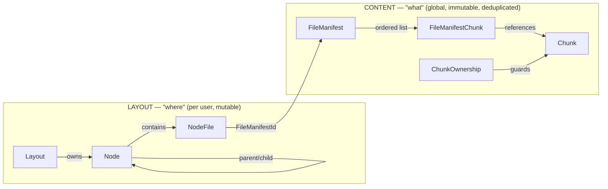
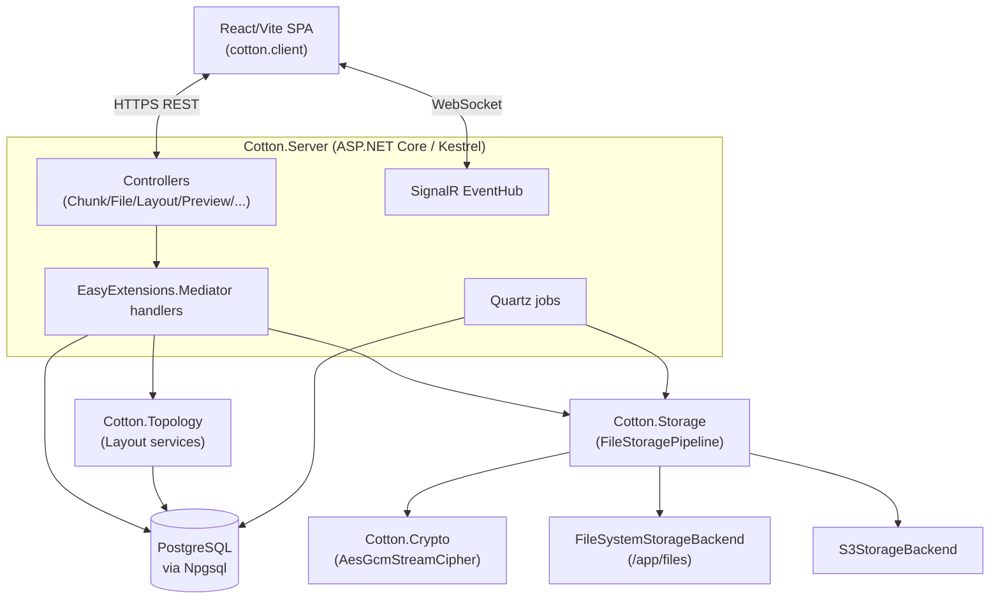
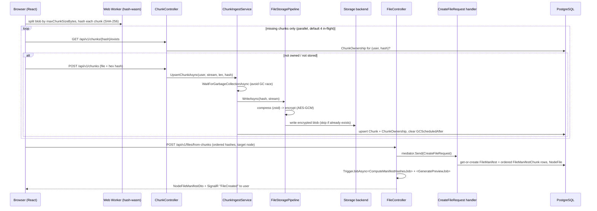
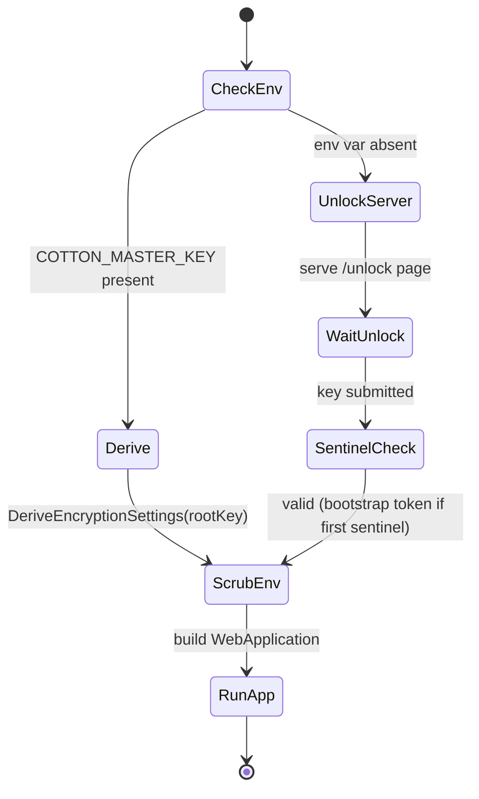

# 01. System Overview & Design Philosophy

Cotton Cloud is a self-hosted, encrypted, content-addressed file cloud built as a single cohesive .NET runtime. It separates *what* a file is (immutable, deduplicated, encrypted content) from *where* it appears (a user-visible folder tree), in a manner deliberately modelled on git. This section frames the whole system: what it is, the design philosophy that runs from the HTTP edge down to encrypted chunk blobs, the major subsystems and how they connect, the verified technology stack, and the end-to-end path a file takes from the browser into encrypted storage and back. It also establishes the vocabulary — `Chunk`, `FileManifest`, `Layout`, `Node`, `NodeFile`, "the pipeline", "the master key" — used throughout the rest of this wiki.

## What Cotton Cloud Is

Cotton Cloud is a file-storage server you run yourself (typically as a single Docker container plus a PostgreSQL database) that stores user files as **content-addressed, compressed, AES-GCM-encrypted chunks**. Files are never stored as opaque whole blobs on disk: they are split into chunks identified by their SHA-256 hash, each chunk is run through a streaming storage pipeline, and the visible "file" is reconstructed on demand from an ordered manifest of chunk hashes.

The product is implemented almost entirely in managed C#/.NET. The README frames this as a deliberate choice ("one cohesive runtime: web engine, storage pipeline, crypto core, compression, and most preview/image processing run in managed .NET"), and the code bears this out — the only external process tools invoked are `ffmpeg`/`ffprobe` for audio/video preview frames and `f3d`/`Xvfb` for 3D model thumbnails (see the *Preview Generation* section). Compression and encryption are pure managed code with no native dependency on the hot path.

The product name and short name are fixed constants in `src/Cotton.Shared/Constants.cs`:

```csharp
public const string ProductName = "Cotton Cloud";
public const string ShortProductName = "cotton";
public const char DefaultPathSeparator = '/';
```

## Core Design Philosophy

### Content vs. layout — the git-like split

The single most important architectural idea in Cotton is the separation of **CONTENT ("what")** from **LAYOUT ("where")**, analogous to how git separates blobs/objects from trees/refs. This split lives directly in the EF Core data model under `src/Cotton.Database/Models/`:



- **CONTENT** entities (`Chunk`, `FileManifest`, `FileManifestChunk`, `ChunkOwnership`) describe immutable, content-addressed, deduplicated data. A `FileManifest` is keyed by content hash and shared by one or more visible file entries; a `Chunk` is one deduplicated encrypted storage chunk keyed by its SHA-256 `Hash`.
- **LAYOUT** entities (`Layout`, `Node`, `NodeFile`) describe a user's mutable, navigable file tree. A `NodeFile` is a *named entry inside a folder* that points at a `FileManifest` via its manifest reference — it carries the name, not the bytes.

Because a `NodeFile` only references content by manifest, the same content can appear in many places with zero duplication, a snapshot can record references instead of copying bytes, and renames/moves are pure metadata operations. The README's "Architecture Overview" describes exactly this grouping, and the code confirms it: `NodeFile` joins the two worlds by referencing a `FileManifest`.

> Vocabulary note: the README's marketing prose talks about "snapshots", "instant tree rollback", and "remounting". In the shipped model these are expressed through `Layout`/`Node`/`NodeFile`. A `Layout` is one user-owned file tree; today the concrete trees are distinguished by `NodeType` (`Default` and `Trash`, see below). Treat broad "snapshot/rollback" language as the design intent that the layout graph enables — the README itself notes the "instant tree rollback flow is being built around" this model — not as a separately named, fully shipped feature surface.

### Content-addressed, deduplicated storage

A chunk's identity *is* its hash. In `src/Cotton.Database/Models/Chunk.cs`, `Chunk.Hash` is the `[Key]` (a `byte[]` SHA-256 digest, 32 bytes per `Hasher.HashSizeInBytes`). Two byte-identical chunks are the same row, so deduplication is intrinsic to the model rather than an after-the-fact optimization. Content identity is computed on the *plaintext* before the storage pipeline runs, so deduplication keeps working even with encryption fully enabled — the server never needs to understand "what the data is" to dedupe it.

### Encryption-first

Every stored chunk passes through streaming AES-GCM encryption before it touches the backend. Encryption is not an optional feature toggled off for throughput; it is a default core behavior. Per the README, the encryption core (`Cotton.Crypto.AesGcmStreamCipher`) was the *first* architectural piece built, with the rest of the pipeline layered on only after throughput validation. The server cannot operate without a master key (see *Master Key, Unlock, and Bootstrap* below); there is no built-in development fallback key.

### Self-hosted and built for NAS-class hardware

Cotton targets operators running their own hardware — the quick-start is `docker run` plus a Postgres container, and the performance design explicitly aims to keep crypto/compression "comfortably faster than storage and network I/O" so the system "remains responsive on NAS-class hardware". The streaming pipeline is built to reuse buffers (`ArrayPool`, bounded `System.IO.Pipelines`) and stay thin in RAM even during large sustained transfers.

### Operational safety and rollback-friendliness

- **Restore-friendly delete.** The database is the source of truth for liveness. Unreferenced chunks are not destroyed immediately; they are scheduled via `Chunk.GCScheduledAfter`, re-checked, and only then reclaimed by `GarbageCollectorJob`. If a scheduled chunk becomes live again before deletion, its schedule is cleared (see the *Garbage Collection & Storage Lifetime* section).
- **GC/ingest cooperation.** `ChunkIngestService` waits for an in-progress GC of the same chunk rather than racing it (`WaitForGarbageCollectionAsync`), closing the "delete while re-uploading" race class.
- **Active integrity.** Manifest hashes are recomputed in the background and compared against the client-proposed hash; storage consistency is checked against the real backend; failures raise admin notifications.
- **Deliberate operator decisions.** First-run setup captures storage mode, email mode, and timezone explicitly rather than guessing.

## Technology Stack (verified)

All backend C# projects target **`net10.0`** (.NET 10). The shared SDK library `Cotton` (`src/Cotton.Shared/Cotton.csproj`) targets `netstandard2.1` so it can be consumed broadly.

| Layer | Technology | Version / detail | Source of truth |
| --- | --- | --- | --- |
| Runtime | .NET | `net10.0` target framework | `src/Cotton.Server/Cotton.Server.csproj` |
| Web | ASP.NET Core on Kestrel | `WebApplication.CreateBuilder`, controllers + static SPA hosting (`MapStaticAssets`, `MapFallbackToFile("/index.html")`) | `src/Cotton.Server/Program.cs` |
| ORM | EF Core | `Microsoft.EntityFrameworkCore.Design`/`.Tools` `10.0.8` | `src/Cotton.Server/Cotton.Server.csproj` |
| Database | PostgreSQL via Npgsql | `EasyExtensions.EntityFrameworkCore.Npgsql` `3.0.66` (`AddPostgresDbContext<CottonDbContext>`); uses `citext` columns | `src/Cotton.Server/Program.cs` |
| Background jobs | Quartz | via `EasyExtensions.Quartz` `3.0.66`, `[JobTrigger]` attribute (`AddQuartzJobs`) | `src/Cotton.Server/Program.cs`, `src/Cotton.Server/Jobs/*` |
| Realtime | SignalR | `AddSignalR()`, `EventHub` mapped at `Routes.V1.EventHub` = `/api/v1/hub/events` | `src/Cotton.Server/Program.cs`, `src/Cotton.Server/Hubs/EventHub.cs` |
| Mediator | EasyExtensions.Mediator | `3.0.66` (controllers delegate to handlers via `AddMediator`) | `src/Cotton.Server/Program.cs` |
| Auth | JWT + refresh tokens (`AddJwt`); WebAuthn via Fido2 `4.0.1` (`PasskeyService`); TOTP via Otp.NET `1.4.1` | — | `src/Cotton.Server/Program.cs` |
| Object mapping | Mapster `10.0.7` (`MapsterConfig.Register()`) | — | `src/Cotton.Server/Program.cs` |
| Compression | Zstandard via `ZstdSharp.Port` `0.8.8` | managed, streaming, no native code | `src/Cotton.Storage/Cotton.Storage.csproj` |
| Object storage | AWS SDK S3 `4.0.23.3` | optional S3 backend | `src/Cotton.Storage/Cotton.Storage.csproj` |
| Crypto | **in-repo `Cotton.Crypto` project** (AES-GCM streaming) | implements `IStreamCipher` from `EasyExtensions.Abstractions` | `src/Cotton.Crypto/AesGcmStreamCipher.cs` |

Frontend (`src/cotton.client/package.json`), built with **Vite** (`vite ^8.0.13`) and TypeScript (`^6.0.3`):

| Concern | Library | Version |
| --- | --- | --- |
| UI framework | React + React DOM | `^19.2.0` |
| Component library | MUI Material + X DataGrid | `@mui/material ^7.3.6`, `@mui/x-data-grid ^8.26.0` |
| Server state | TanStack Query | `@tanstack/react-query ^5.100.10` |
| Client state | Zustand | `^5.0.9` |
| Realtime | SignalR client | `@microsoft/signalr ^10.0.0` |
| Routing | React Router | `react-router-dom ^7.10.1` |
| Large-list virtualization | react-virtuoso | `^4.18.1` |
| Chunk hashing | hash-wasm (in a Web Worker) | `^4.12.0` |
| i18n | i18next / react-i18next | `i18next ^26.2.0` (12 frontend locales: cs, de, en, es, fr, it, nl, pl, pt, ru, uk, zh — parity-checked in CI; backend notifications cover EN/RU) |
| PWA | vite-plugin-pwa | `^1.2.0` |
| Previews | pdfjs-dist, hls.js, three / @react-three, heic2any, monaco-editor | various |

> Crypto provenance. The runtime cipher is the **in-repo `Cotton.Crypto` project** (`src/Cotton.Crypto/AesGcmStreamCipher.cs`, `src/Cotton.Crypto/KeyDerivation.cs`), registered through `AddStreamCipher()` (`src/Cotton.Server/Extensions/ServiceCollectionExtensions.cs`) and constructed by `StreamCipherFactory` (`src/Cotton.Server/Services/StreamCipherFactory.cs`). The `EasyExtensions.Crypto` NuGet package is referenced only by the test project `Cotton.Crypto.Tests` for legacy-format (`CTN1`) interop — a code comment in `src/Cotton.Crypto/Internals/FormatConstants.cs` notes the older `CTN1` format "was emitted by EasyExtensions.Crypto before authenticated stream terminators existed"; the current format is `CTN2`. See the *Cryptography Engine* section for the authoritative description.

## Major Subsystems

The solution `src/Cotton.sln` contains these first-party (non-test) projects. The README "Repo Map" is accurate for the projects it lists, but omits `Cotton.Crypto`, `Cotton.Autoconfig`, `Cotton.Validators`, `Cotton.Localization`, `Cotton.Shared` (assembly name `Cotton`), and `Cotton.Benchmark`:

| Project | Responsibility | Covered in section |
| --- | --- | --- |
| `Cotton.Server` | ASP.NET Core API, SPA hosting, controllers, Quartz jobs, SignalR hub, application services, content hashing (`Hasher`) | *HTTP API & Controllers*, *Background Jobs* |
| `Cotton.Database` | EF Core `CottonDbContext`, entity models, migrations, integrity descriptors | *Data Model*, *Database Integrity* |
| `Cotton.Storage` | Storage pipeline, processors (compression/crypto), backends (filesystem/S3), seekable read streams | *Storage Pipeline & Backends* |
| `Cotton.Crypto` | Streaming AES-GCM cipher (`AesGcmStreamCipher`), key derivation (`KeyDerivation`) | *Cryptography Engine* |
| `Cotton.Topology` | Layout/tree manipulation (`ILayoutService`/`StorageLayoutService`, `ILayoutNavigator`/`LayoutNavigator`) | *Layout & Topology* |
| `Cotton.Previews` | Image/SVG/HEIC, PDF, text, audio, video, and 3D-model preview generators | *Preview Generation* |
| `Cotton.Autoconfig` | Master-key derivation, environment scrubbing, in-memory configuration | *Configuration & Master Key* |
| `Cotton.Validators` | `NameValidator` (Unicode hygiene, `NameKey` generation) | *Name Validation* |
| `Cotton.Localization` | Server-side localized notification templates (`NotificationTemplates`) | *Localization* |
| `Cotton.Shared` (assembly `Cotton`) | Cross-cutting constants, routes, DTOs (`Constants`, `Routes`, `PublicServerInfo`) | this section |

> Note on content hashing. SHA-256 content addressing is implemented by the static `Hasher` class in `src/Cotton.Server/Services/Hasher.cs` (`Hasher.HashSizeInBytes = 32`, `Hasher.SupportedHashAlgorithm => nameof(SHA256)`), not by `Cotton.Crypto`. `Cotton.Crypto` provides the symmetric cipher and key derivation; it does not own content hashing.



### Architectural conventions (per AGENTS.md)

The repository's `AGENTS.md` codifies conventions visible throughout the code and worth knowing as a contributor: application logic lives in `EasyExtensions.Mediator` handlers (not controllers/services); `Program.cs` is kept minimal (registration/middleware only); background work uses Quartz with `EasyExtensions.Quartz.Attributes.JobTrigger` (which already implies `[DisallowConcurrentExecution]`); realtime uses SignalR; all entities derive from `EasyExtensions.EntityFrameworkCore.Abstractions.BaseEntity<Guid>`; relationships use `DeleteBehavior.Restrict` (no cascade deletes) configured via data annotations (no Fluent API); BCL types are preferred (e.g. `AesGcm` over `ChaCha20Poly1305`, `System.Text.Json` over `Newtonsoft.Json`). The frontend forbids `localStorage` in favor of Zustand/TanStack Query, forbids `any`/`unknown`, requires i18n for all user-visible strings, and uses MUI components/`sx` rather than inline styles. Primary development happens on `develop`; pushing directly to `main` is prohibited.

## How a File Moves Through the System

Cotton uses a **chunk-first upload protocol**: the client uploads independent content-addressed chunks first, then assembles a file from an ordered list of chunk hashes. A tiny file and a multi-gigabyte file follow the same shape; size mostly changes chunk count and duration.



Verified specifics:

1. **Chunk existence check** — `GET /api/v1/chunks/{hash}/exists` (`ChunkController.CheckChunkExists`) returns `true` only when both a `ChunkOwnership` row exists for the calling user *and* the blob exists in storage (`_storage.ExistsAsync`); it returns `false` immediately if the user does not own the chunk. This drives the "send only missing chunks" retry behavior.
2. **Chunk upload** — `POST /api/v1/chunks` (`ChunkController.UploadChunk`, multipart `IFormFile`) and `POST /api/v1/chunks/raw` (streaming, no multipart). The hex hash is decoded by `Hasher.FromHexStringHash` and validated to be `Hasher.HashSizeInBytes` (32) bytes; the size is rejected if it exceeds `CottonServerSettings.MaxChunkSizeBytes`. Ingest is delegated to `ChunkIngestService.UpsertChunkAsync`. If storage free space is below the configured reserve, ingest throws `StoragePressureException` and the controller returns **HTTP 507**. The multipart endpoint carries `[RequestSizeLimit(AesGcmStreamCipher.MaxChunkSize + ushort.MaxValue)]`; the raw endpoint uses `[RequestSizeLimit(AesGcmStreamCipher.MaxChunkSize)]`.
3. **Pipeline transform** — inside `FileStoragePipeline.WriteAsync` the stream is run through processors ordered by `Priority` *descending* on write: `CompressionProcessor` (`Priority => 10000`) then `CryptoProcessor` (`Priority => 1000`), then written to the backend. If the encrypted blob already exists in the backend, the write short-circuits (`backend.ExistsAsync` → dedup). A process-wide `SemaphoreSlim(initialCount: Environment.ProcessorCount)` bounds concurrent writes.
4. **Manifest assembly** — `POST /api/v1/files/from-chunks` (`FileController.CreateFileFromChunks`) sends a `CreateFileRequest` through the mediator. The handler (`src/Cotton.Server/Handlers/Files/CreateFileRequest.cs`) gets-or-creates the `FileManifest` (reusing any existing manifest whose `ComputedContentHash` or `ProposedContentHash` matches the proposed hash, otherwise creating one with ordered `FileManifestChunk` rows), then creates the visible `NodeFile` under a per-layout lock. **The controller itself** (not the handler) then calls `_scheduler.TriggerJobAsync<ComputeManifestHashesJob>()` and `<GeneratePreviewJob>()` and pushes a `"FileCreated"` event over SignalR to the owning user (`_hubContext.Clients.User(...).SendAsync("FileCreated", manifest)`).
5. **Background verification** — `ComputeManifestHashesJob` later computes `FileManifest.ComputedContentHash` from the stored chunks; a mismatch with `ProposedContentHash` raises a notification (see *Background Jobs* and *Reliability & Integrity*).

Read/download is the mirror image. `FileStoragePipeline.ReadAsync` reads the backend blob and applies processors ordered by `Priority` *ascending* (`OrderBy(p => p.Priority)`): `CryptoProcessor` (decrypt, 1000) then `CompressionProcessor` (decompress, 10000). Because chunk reads can be assembled into a single seekable logical stream (`ConcatenatedReadStream`, see *Storage Pipeline & Backends*), downloads support HTTP `Range`, `ETag`/`If-None-Match` (304), and preview/frame extraction without reassembling the whole file.

> Pipeline ordering — README accuracy. The README states writes run "compression -> crypto -> backend" and reads "backend -> crypto -> decompression", and notes this is controlled by processor `Priority`. This is correct: `WriteAsync` sorts `OrderByDescending(Priority)` (10000 compression first, then 1000 crypto) and `ReadAsync` sorts `OrderBy(Priority)` applied to the backend stream (1000 crypto first, then 10000 compression). The encrypt-after-compress ordering is what makes compression effective.

## Encryption Defaults and Vocabulary

The cipher `Cotton.Crypto.AesGcmStreamCipher` (`src/Cotton.Crypto/AesGcmStreamCipher.cs`) defines these constants:

| Constant | Value | Meaning |
| --- | --- | --- |
| `KeySize` | 32 bytes | AES-256 key size |
| `NonceSize` | 12 bytes | 4-byte file prefix + 8-byte chunk counter |
| `TagSize` | 16 bytes | per-chunk GCM authentication tag |
| `MinChunkSize` | `8 * 1024` (8 KiB) | minimum cipher chunk |
| `MaxChunkSize` | `64 * 1024 * 1024` (64 MiB) | maximum cipher chunk |
| `DefaultChunkSize` | `1 * 1024 * 1024` (1 MiB) | default cipher chunk |

The cipher uses `ConcurrencyLevel = Math.Min(4, Environment.ProcessorCount)` parallel pipelines by default (overridable via the constructor's thread count, which `StreamCipherFactory` clamps to `[1, ProcessorCount * 2]`), with per-file wrapped keys and per-chunk authentication. Two distinct chunk-size notions exist and are easy to confuse:

- **Cipher chunk size** (`CottonServerSettings.CipherChunkSizeBytes`, validated against `AesGcmStreamCipher.MinChunkSize`/`MaxChunkSize` in `SettingsController`) — the internal AES-GCM framing window inside a single stored object.
- **Upload chunk size** (`CottonServerSettings.MaxChunkSizeBytes`) — the maximum size of a content-addressed chunk a client may POST.

The frontend obtains these limits from the server settings and uses them to size its splitter (the README's "Upload settings are returned by the server; the frontend uses them for chunking").

## Master Key, Unlock, and Bootstrap

Cotton requires a 32-character root master key (`ConfigurationBuilderExtensions.DefaultKeyLength = 32`). Two startup paths exist, resolved in `Program.Main` → `ResolveEncryptionSettingsAsync`:



- If `COTTON_MASTER_KEY` is set, `ConfigurationBuilderExtensions.DeriveEncryptionSettings` derives a `Pepper` and a `MasterEncryptionKey` (both via `KeyDerivation.DeriveSubkeyBase64` from the in-repo `Cotton.Crypto`, with HKDF info strings `"CottonPepper"` and `"CottonMasterEncryptionKey"`), assigns `MasterEncryptionKeyId = DefaultMasterKeyId = 1`, and the env var is then wiped from both Process and User scopes (`ClearMasterKeyEnvironmentVariable`). The `COTTON_PG_PASSWORD` env var is likewise nulled in both scopes after being read into in-memory configuration.
- If `COTTON_MASTER_KEY` is absent, only a lightweight unlock web server runs (`MasterKeyUnlockServer.WaitForUnlockAsync`) serving `/unlock` with an API base of `Routes.V1.Base + "/unlock"` = `/api/v1/unlock`. The main `WebApplication` is not built until a valid key is supplied. Creating the encrypted master-key sentinel for the first time additionally requires a short-lived **bootstrap token** printed to the server logs (validated by `ValidateBootstrapTokenAsync`); subsequent unlocks only validate the key, and the first-unlock window can expire and require a restart.

Changing the key length or losing the key makes derived data (including user passwords, which are peppered with the derived `Pepper`) unrecoverable — the constant `DefaultKeyLength` carries an explicit "DO NOT CHANGE" warning in code. The process clock is forced to UTC at startup (`ConfigureProcessTimeZone`, which sets `TZ=UTC` and clears the cached timezone data) so platform TLS/date handling cannot drift with user timezone settings; per-user timezone is applied per request. See the *Configuration & Master Key* and *Security Hardening* sections for full detail.

## Public Surface and Vocabulary Anchors

API routes are centralized as constants in `src/Cotton.Shared/Routes.cs`, all under the `/api/v1` base:

| Constant | Path |
| --- | --- |
| `Routes.V1.Base` | `/api/v1` |
| `Routes.V1.Auth` | `/api/v1/auth` |
| `Routes.V1.Users` | `/api/v1/users` |
| `Routes.V1.Files` | `/api/v1/files` |
| `Routes.V1.Archives` | `/api/v1/archives` |
| `Routes.V1.Server` | `/api/v1/server` |
| `Routes.V1.Chunks` | `/api/v1/chunks` |
| `Routes.V1.Layouts` | `/api/v1/layouts` |
| `Routes.V1.Settings` | `/api/v1/settings` |
| `Routes.V1.Previews` | `/api/v1/preview` |
| `Routes.V1.EventHub` | `/api/v1/hub/events` (SignalR) |
| `Routes.V1.Notifications` | `/api/v1/notifications` |

WebDAV is served separately by `WebDavController` (routed at `api/v1/webdav` and `api/v1/webdav/{**path}`), which handles `OPTIONS, PROPFIND, PROPPATCH, GET, HEAD, PUT, DELETE, MKCOL, MOVE, COPY, LOCK, UNLOCK` (the `OPTIONS` `Public` header advertises the same set minus `PROPPATCH`). The README positions WebDAV as an early-stage compatibility bridge rather than the primary path.

The unauthenticated discovery endpoint `GET /api/v1/server/info` (`ServerController`) returns `PublicServerInfo` (`src/Cotton.Shared/Models/PublicServerInfo.cs`):

```csharp
public class PublicServerInfo
{
    public string Product { get; set; }            // "Cotton Cloud"
    public string InstanceIdHash { get; set; }      // SHA-256 of InstanceId; stable, non-secret fingerprint
    public bool CanCreateInitialAdmin { get; set; } // true while no users exist
}
```

`InstanceIdHash` comes from `CottonServerSettings.GetInstanceIdHash()` (`InstanceId.ToString().Sha256()`) and lets relay/integration contracts recognize the instance without seeing the raw `InstanceId` GUID. `CanCreateInitialAdmin` is set to `!serverHasUsers` (true only while the server has no users); first-admin creation is further bounded by a startup window of `Constants.AdminAutocreateMinutesDelay = 5` minutes from main-app startup (after any unlock step) — "no eternal backdoor".

### Key enums establishing vocabulary

These enums recur across the wiki. Unless noted, they are defined under `src/Cotton.Database/Models/Enums/`:

| Enum | Values | Used for |
| --- | --- | --- |
| `NodeType` | `Default = 0`, `Trash = 1` | which layout tree a node belongs to; the default-tree namespace uniqueness index includes `Type` |
| `StorageType` | `Local = 0`, `S3 = 1` | physical backend selected at runtime from `CottonServerSettings.StorageType` |
| `EmailMode` | `None = 0`, `Cloud = 1`, `Custom = 2` | email delivery (Cloud uses the Cotton Bridge gateway) |
| `ComputionMode` | `Local = 0`, `Cloud = 1`, `Remote = 2` | where compute-heavy work runs (note: `ComputionMode` is the literal type name in code) |
| `GeoIpLookupMode` | `Disabled = 0`, `CottonCloud = 1`, `MaxMindLocal = 2`, `CustomHttp = 3` | session-location lookup |
| `StorageSpaceMode` | `Optimal = 0`, `Limited = 1`, `Unlimited = 2` | capacity policy |
| `ServerUsage` | `Other = 0`, `Photos = 1`, `Documents = 2`, `Media = 3` | declared usage for setup/diagnostics |
| `NotificationPriority` | `None = 0`, `Low = 1`, `Medium = 2`, `High = 3` | notification severity |

`CompressionAlgorithm` (used by `Chunk.CompressionAlgorithm`, value `Zstd`) is **not** a Cotton-defined enum — it comes from `EasyExtensions.Models.Enums` and is referenced via `CompressionProcessor.Algorithm` (`src/Cotton.Storage/Processors/CompressionProcessor.cs`).

The storage backend is chosen at runtime by `StorageBackendProvider.GetBackend()` based on `CottonServerSettings.StorageType` — `Local` → `FileSystemStorageBackend`, `S3` → `S3StorageBackend` — so a deployment can start filesystem-backed and migrate to S3 by changing settings, not code.

## Background Maintenance at a Glance

Quartz jobs (`src/Cotton.Server/Jobs/`, each annotated with `[JobTrigger]` which implies `[DisallowConcurrentExecution]`) form the operational safety net. Schedules are read directly from the attributes:

| Job | Trigger (`[JobTrigger]`) | Purpose |
| --- | --- | --- |
| `GeneratePreviewJob` | `minutes: 15` | generate previews/thumbnails (also triggered on file create/update) |
| `ComputeManifestHashesJob` | `hours: 1` | compute & verify `ComputedContentHash` vs `ProposedContentHash` |
| `GarbageCollectorJob` | `hours: 6` | reclaim chunks past `GCScheduledAfter`, coordinating with ingest |
| `ClearTempFolderJob` | `hours: 36` | clear the storage temp directory |
| `DownloadTokenRetentionJob` | `days: 1` | sweep expired/used download tokens |
| `RefreshTokenRetentionJob` | `days: 1` | clean expired refresh tokens |
| `FixMimeTypesJob` | `days: 1` | correct stored MIME types |
| `BackfillChunkStoredSizeJob` | `days: 1` | backfill `Chunk.StoredSizeBytes` |
| `CollectPerformanceJob` | `days: 1` | collect performance/telemetry samples |
| `DumpDatabaseJob` | `days: 7` | create chunked, storage-native PostgreSQL backups |
| `StorageConsistencyJob` | `days: 30` | re-check stored data against the real backend, notify on loss |

Heavier jobs are load-aware: for example `ComputeManifestHashesJob` skips when an upload is in progress or during night-time windows. See the *Background Jobs & Scheduling* section for the full mechanics, load-awareness, and notification behavior.

## Concurrency, Failure Modes, and Security Considerations (overview)

- **Startup ordering.** `RunApplicationAsync` builds the `WebApplication`, validates startup transition rules against recorded app-version history, serves the startup-blocked SPA if a required transition release is missing, otherwise configures forwarded headers and auth hardening, maps controllers and the SPA fallback, applies EF migrations (`ApplyMigrations<CottonDbContext>`), attempts auto-restore (`IDatabaseAutoRestoreService.TryRestoreIfEmptyAsync`, active when `COTTON_RESTORE_DATABASE_IF_EMPTY=true` and the DB is empty), warms `SettingsProvider`, maps the SignalR `EventHub`, and finally starts Kestrel (`app.RunAsync()`).
- **GC vs ingest.** Ingest waits out an in-flight GC of the same chunk and clears `GCScheduledAfter` when a chunk becomes live again; this is the central concurrency invariant of the storage lifetime contract.
- **Storage pressure.** Filesystem-backed writes are guarded by `StoragePressureGuard`; crossing the reserve raises `StoragePressureException` and returns **HTTP 507** on chunk upload (`ChunkController`), WebDAV (`WebDavController`), and avatar (`UserController`) paths, and notifies admins (throttled).
- **Integrity.** Upload hash mismatch → notification; storage consistency loss → notification; protected DB rows carry integrity signatures derived from the master key (see *Database Integrity*).
- **Master key exposure.** Even with `DOTNET_EnableDiagnostics=0`, `PR_SET_DUMPABLE=0` (via `LinuxProcessHardening`), and `COTTON_PROCESS_HARDENING=true`, the README is explicit that an attacker executing code inside the process can still reach the in-memory key; these flags protect against accidental dumps and over-privileged neighbors, not in-process compromise.
- **Forwarded headers.** `ForwardedHeadersOptions` is configured for `XForwardedProto | XForwardedHost` with cleared `KnownIPNetworks`/`KnownProxies` lists, relevant when running behind a reverse proxy.

## Non-Obvious Design Decisions & Gotchas

- **The hash *is* the identity.** `Chunk.Hash` is the `[Key]`; there is no separate surrogate chunk ID. Dedup, idempotent re-upload, and content reuse all fall out of this.
- **`ChunkOwnership` is not a retention reference.** Per the README's "Storage Lifetime Contract", `ChunkOwnership` is an ingest/concurrency guard. Liveness for GC comes only from `FileManifestChunk`, preview hashes (`FileManifest.SmallFilePreviewHash`/`LargeFilePreviewHash`), `User.AvatarHash`, protected backup artifacts (latest-backup pointer/manifest and listed chunks), and the master-key sentinel. New storage-backed features must register a reference that `ChunkUsageService` understands or be eligible for reclaim.
- **Manifests are immutable; files version by lineage.** `NodeFile.OriginalNodeFileId` chains versions: the first `NodeFile` ID for a file is recorded as `OriginalNodeFileId` (a node points to itself when it has no explicit original), enabling version history while keeping each `FileManifest` immutable.
- **Two `*PreviewHash` flavors.** `FileManifest.SmallFilePreviewHash` (plain, may be served directly) vs `SmallFilePreviewHashEncrypted`. `GetPreviewHashEncryptedHex()` builds a row-scoped public preview token by concatenating `PreviewTokenPrefix = 'f'`, the manifest `Id` (`"N"` format), and the lowercase hex of `SmallFilePreviewHashEncrypted`, so preview URLs don't enable raw content enumeration.
- **`citext` columns.** `Node.NameKey`, `NodeFile.NameKey` (both `[Column(... TypeName = "citext")]`) and `FileManifest.ContentType` use PostgreSQL `citext` for case-insensitive matching; the `NameKey` itself is produced by `NameValidator.GetNameKey` (NFC normalization, diacritic stripping). This is why a Cotton deployment requires the `citext` extension.
- **The README is marketing-toned.** Several README features are described aspirationally (e.g., the "instant tree rollback flow is being built around" the layout model; generational compaction is on the roadmap). The verified shipped primitives are the layout graph, the chunk/manifest model, the storage pipeline, the Quartz job set, and the SignalR `EventHub`. Where this wiki and the README disagree, the wiki reflects the code.

## Related Sections

- *Data Model* — full entity reference for `Chunk`, `FileManifest`, `FileManifestChunk`, `ChunkOwnership`, `Layout`, `Node`, `NodeFile`, `User`, tokens, and settings.
- *Storage Pipeline & Backends* — `FileStoragePipeline`, processors, `FileSystemStorageBackend`/`S3StorageBackend`, `ConcatenatedReadStream`, caching.
- *Cryptography Engine* — `Cotton.Crypto.AesGcmStreamCipher`, key wrapping, nonce layout, performance.
- *Layout & Topology* — `ILayoutService`/`StorageLayoutService`, `LayoutNavigator`, trees, trash.
- *Configuration & Master Key* — `Cotton.Autoconfig`, unlock/bootstrap, `CottonEncryptionSettings`, `CottonServerSettings`.
- *HTTP API & Controllers* — chunk-first upload, downloads, range/ETag, archives, WebDAV.
- *Background Jobs & Scheduling* — Quartz jobs, GC, integrity, backups, load-awareness.
- *Realtime & SignalR* — the `EventHub`, session groups, client reconnect.
- *Security Hardening & Diagnostics* — process hardening, the admin security checkup, database integrity signatures.
- *Preview Generation* — image/PDF/text/audio/video/3D generators and the FFmpeg range shim.
