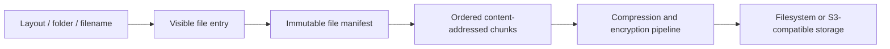

# 01. System Overview

Cotton Cloud is a self-hosted file service built around encrypted, content-addressed storage. A single backend process exposes the HTTP API, serves the frontend, coordinates persistence and storage, runs scheduled maintenance, and publishes realtime events.

## Core architectural split

Cotton separates immutable content from mutable layout metadata.

```mermaid
flowchart LR
    UserPath["Layout / folder / filename"] --> Entry["Visible file entry"]
    Entry --> Manifest["Immutable file manifest"]
    Manifest --> Chunks["Ordered content-addressed chunks"]
    Chunks --> Pipeline["Compression and encryption pipeline"]
    Pipeline --> Backend["Filesystem or S3-compatible storage"]
```

- A layout describes where folders and file entries appear for a user.
- A visible file entry owns its name and points to a manifest.
- A manifest describes ordered immutable content.
- Chunks are addressed by plaintext hashes and may be reused by multiple manifests.

Renaming or moving a file changes layout metadata without rewriting its content. Identical content can be referenced from multiple locations without duplicate storage.

## Runtime boundaries

The main runtime consists of:

- an ASP.NET Core host for HTTP, authentication, WebDAV, and static frontend delivery;
- PostgreSQL through EF Core for users, layouts, manifests, chunk metadata, settings, and security state;
- a storage pipeline that transforms logical chunk bytes into backend objects;
- Quartz jobs for reconciliation, retention, backup, and maintenance;
- SignalR for realtime client invalidation and notifications;
- a React application for user and administrator workflows.

Cotton is a modular monolith. Libraries isolate cryptography, storage, topology, persistence, validation, previews, bootstrap configuration, and shared contracts, while the server remains the composition root.

## File lifecycle

An upload follows this general path:

1. The client divides a file into chunks and computes content hashes.
2. Existing chunks are reused; missing chunks are uploaded.
3. The server verifies each chunk before accepting it.
4. Accepted bytes pass through compression and encryption before backend storage.
5. A manifest records chunk order and file-level metadata.
6. A visible entry links the manifest into the user's layout.
7. Background verification computes authoritative manifest hashes and reports mismatches.

Downloads reverse the storage pipeline and concatenate manifest chunks in order.

## Security model

One configured master key anchors storage encryption and several domain-separated derived keys. The master key is not stored in the application database.

Important boundaries:

- database access alone must not reveal stored chunk plaintext or permit forging protected-row integrity metadata;
- storage-backend access alone exposes encrypted objects and opaque keys;
- every user-visible query is scoped by the authenticated user;
- forwarded client information is trusted only from configured proxy networks;
- missing or invalid cryptographic metadata fails closed rather than being silently repaired.

Cotton protects against database-only or storage-only compromise. It does not claim to protect secrets from a fully compromised host process that already has the master key.

## Operational model

Cotton is designed for one application instance backed by PostgreSQL and either local durable storage or an S3-compatible service. Background work is staggered to avoid startup load spikes and observes shutdown cancellation.

The database is the source of truth for logical references and retention decisions. Backend objects are reclaimed only after liveness checks and retention windows. Ingest and garbage collection coordinate so a chunk cannot be deleted while it is being accepted or reused.

## Design principles

- Stream large content instead of buffering whole files.
- Keep immutable content separate from mutable navigation state.
- Perform validation before durable state becomes visible.
- Prefer deterministic formats and ordering.
- Fail explicitly at security and integrity boundaries.
- Preserve recoverability through delayed reclamation and database backups.
- Keep normal user workflows queued or bounded rather than rejecting them as abuse.

## Related sections

- [Content-addressed storage](04-content-addressed-storage.md)
- [Logical filesystem](05-logical-filesystem.md)
- [Storage pipeline](06-storage-pipeline.md)
- [Cryptography engine](07-cryptography-engine.md)
- [Deployment and operations](27-deployment-operations.md)
