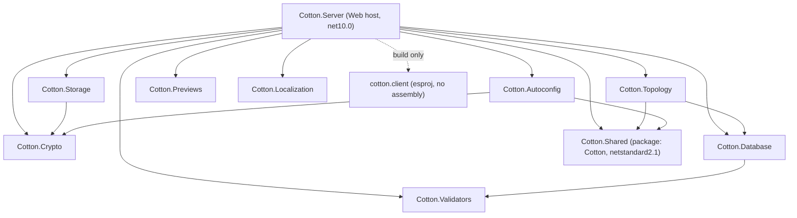
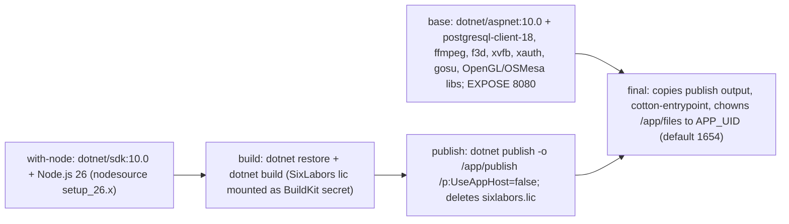
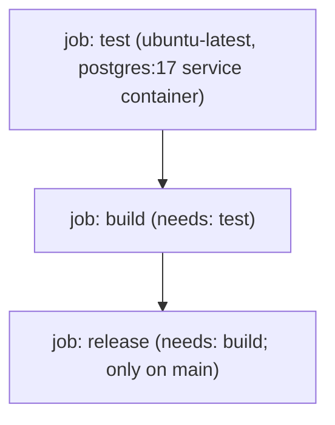

# 02. Solution Layout, Projects & Build

Cotton Cloud is a single Visual Studio solution (`src/Cotton.sln`) that composes one ASP.NET Core web host, a React/TypeScript SPA, and a set of focused class libraries that each own one architectural concern: cryptography, the storage pipeline, the layout/topology graph, the EF Core data model, validation, bootstrap configuration, file previews, localization, and a shared abstractions/contracts assembly. This section enumerates every project, its target framework, who references whom, the NuGet dependencies of note, the plugin abstraction, the contents of `Cotton.Shared` and `Cotton.Localization`, and the build/CI machinery (`Directory.Build.props`, `Dockerfile`, the GitHub Actions workflow, `GitVersion.yml`, `.gitattributes`, and the legal/governance files).

## Purpose & overview

The solution is deliberately a *monolithic, single-runtime* codebase rather than a federation of microservices: with one exception (`Cotton.Shared`, which targets `netstandard2.1` so it can ship as the public **Cotton** NuGet package), every production and test project targets **.NET 10** (`net10.0`) with `Nullable` and `ImplicitUsings` enabled. The web host `Cotton.Server` is the only executable entry point that wires everything together; all other production projects are libraries it consumes. The frontend (`cotton.client`) is an esproj (`Microsoft.VisualStudio.JavaScript.Sdk`) that is referenced by `Cotton.Server` only for SPA proxy/build coordination — `ReferenceOutputAssembly` is set to `false`, so no managed assembly is produced.

The split between projects is enforced by layering: low-level primitives (`Cotton.Crypto`, `Cotton.Validators`) have no internal dependencies, mid-level libraries build on them, and `Cotton.Server` sits at the top referencing nearly all of them. The README's *"focused core, custom behavior in isolated plugins and marketplace-delivered extensions"* framing (`README.md` lines 37 and 141) is reflected by the presence of a plugin abstraction in `Cotton.Shared`, but as of this revision that abstraction is **declaration-only** — see *The plugin abstraction* below.

## Projects in the solution

`src/Cotton.sln` declares **18 project files** (17 `.csproj` plus 1 `.esproj`) as well as a "Solution Items" virtual folder that holds `.editorconfig`. Note that the project displayed as **"Cotton"** in the IDE is physically `Cotton.Shared\Cotton.csproj` — the folder is `Cotton.Shared`, but the project/assembly/NuGet package id is `Cotton`.

### Production projects

| Project (file) | Display name | TFM | Output | Responsibility |
|---|---|---|---|---|
| `src/Cotton.Server/Cotton.Server.csproj` | Cotton.Server | `net10.0` | Web (`Microsoft.NET.Sdk.Web`) | The ASP.NET Core host: controllers, SignalR hubs, Quartz jobs, WebDAV, auth, DI composition root. The only runnable app. |
| `src/Cotton.Crypto/Cotton.Crypto.csproj` | Cotton.Crypto | `net10.0` | Library (`Microsoft.NET.Sdk`) | In-repo streaming AES-GCM cipher (`AesGcmStreamCipher`), key derivation (`KeyDerivation`), hashing (`HashHelpers`), RNG helpers (`RandomHelpers`). No internal project references. |
| `src/Cotton.Storage/Cotton.Storage.csproj` | Cotton.Storage | `net10.0` | Library | Content-addressed storage pipeline: filesystem & S3 backends, compression and crypto processors. |
| `src/Cotton.Topology/Cotton.Topology.csproj` | Cotton.Topology | `net10.0` | Library | Layout/topology graph services (`ILayoutService`, `ILayoutNavigator`, `LayoutNavigator`, `StorageLayoutService`). |
| `src/Cotton.Database/Cotton.Database.csproj` | Cotton.Database | `net10.0` | Library | EF Core + Npgsql data model, `DbContext`, entities, migrations. |
| `src/Cotton.Validators/Cotton.Validators.csproj` | Cotton.Validators | `net10.0` | Library | Pure validation helpers (`NameValidator`, `UsernameValidator`). Zero dependencies. |
| `src/Cotton.Autoconfig/Cotton.Autoconfig.csproj` | Cotton.Autoconfig | `net10.0` | Library | Startup configuration / master-key unlock bootstrap (`ConfigurationBuilderExtensions` under `Extensions/`). |
| `src/Cotton.Previews/Cotton.Previews.csproj` | Cotton.Previews | `net10.0` | Library | Thumbnail/preview generation for images, PDF, SVG, HEIC/WebP, audio, video, and 3D models. |
| `src/Cotton.Localization/Cotton.Localization.csproj` | Cotton.Localization | `net10.0` | Library | Server-side English notification templates (`NotificationTemplates`). No dependencies. |
| `src/Cotton.Shared/Cotton.csproj` | Cotton | `netstandard2.1` | Library / NuGet package `Cotton` | Cross-project contracts: `Constants`, `Routes`, shared models/enums, email templates, plugin abstraction. The published SDK package. |
| `src/cotton.client/cotton.client.esproj` | cotton.client | n/a (Node) | SPA build | React/TypeScript/Vite frontend; built via npm, not MSBuild assembly output. SDK `Microsoft.VisualStudio.JavaScript.Sdk/1.0.2752196`. |

### Test and benchmark projects

| Project (file) | TFM | Kind | Project references under test |
|---|---|---|---|
| `src/Cotton.Server.IntegrationTests/Cotton.Server.IntegrationTests.csproj` | `net10.0` | NUnit + `Microsoft.AspNetCore.Mvc.Testing` | `Cotton.Crypto`, `Cotton.Server`, `Cotton.Storage` |
| `src/Cotton.Crypto.Tests/Cotton.Crypto.Tests.csproj` | `net10.0` | NUnit | `Cotton.Crypto` (+ `EasyExtensions.Crypto` for legacy-format comparison) |
| `src/Cotton.Storage.Tests/Cotton.Storage.Tests.csproj` | `net10.0` | NUnit + Moq | `Cotton.Crypto`, `Cotton.Storage` |
| `src/Cotton.Previews.Tests/Cotton.Previews.Tests.csproj` | `net10.0` | NUnit | `Cotton.Previews` |
| `src/Cotton.Validators.Tests/Cotton.Validators.Tests.csproj` | `net10.0` | NUnit | `Cotton.Validators` |
| `src/Cotton.Autoconfig.Tests/Cotton.Autoconfig.Tests.csproj` | `net10.0` | NUnit | `Cotton.Autoconfig`, `Cotton.Crypto` |
| `src/Cotton.Benchmark/Cotton.Benchmark.csproj` | `net10.0` | Console (`OutputType=Exe`) | `Cotton.Crypto`, `Cotton.Previews`, `Cotton.Storage` |

All test projects standardize on **NUnit 4.6.1**, **NUnit3TestAdapter 6.2.0**, and **Microsoft.NET.Test.Sdk 18.5.1**. Four of the six test projects (`Cotton.Crypto.Tests`, `Cotton.Storage.Tests`, `Cotton.Previews.Tests`, `Cotton.Autoconfig.Tests`) additionally pull **coverlet.collector 10.0.1** and **NUnit.Analyzers 4.13.0** as private/analyzer-only assets; `Cotton.Validators.Tests` and `Cotton.Server.IntegrationTests` pull neither. `Cotton.Storage.Tests` adds **Moq 4.20.72**; `Cotton.Server.IntegrationTests` adds **Microsoft.AspNetCore.Mvc.Testing 10.0.8** and **System.Management 10.0.8** (and is marked `OutputType=Library`). The `.Tests`/`.IntegrationTests` suffix is significant for the build (see *Directory.Build.props* below). The non-NUnit test projects set `LangVersion=latest` and `IsPackable=false`; `Cotton.Validators.Tests` (which uses neither coverlet nor analyzers) does not set `LangVersion`.

## Inter-project dependency graph

The following `ProjectReference` edges are taken directly from the `.csproj` files (production projects only; test projects reference their subject plus shared deps as tabulated above).



Observations grounded in the `.csproj` files:

- **`Cotton.Crypto`, `Cotton.Validators`, `Cotton.Localization`, and `Cotton.Previews` have no `ProjectReference` edges** — they are leaf libraries. `Cotton.Previews` is notable: it depends only on external NuGet packages, not even on `Cotton.Shared`, keeping the heavy native-imaging dependency set isolated.
- **`Cotton.Shared` has no internal references** (it is the bottom of the contract layer) and is referenced only by `Cotton.Server`, `Cotton.Topology`, and `Cotton.Autoconfig`. It is *not* referenced by `Cotton.Crypto`, `Cotton.Storage`, `Cotton.Database`, `Cotton.Validators`, `Cotton.Previews`, or `Cotton.Localization`.
- **`Cotton.Server` is the composition root**, referencing all **nine** other production libraries (`Cotton.Localization`, `Cotton.Shared`, `Cotton.Crypto`, `Cotton.Storage`, `Cotton.Topology`, `Cotton.Previews`, `Cotton.Database`, `Cotton.Autoconfig`, `Cotton.Validators`) plus the SPA esproj.
- **`Cotton.Storage` → `Cotton.Crypto`** and **`Cotton.Autoconfig` → `Cotton.Crypto`** are the only edges into the crypto library besides `Cotton.Server`; the crypto processor inside the storage pipeline is the storage consumer.
- **`Cotton.Topology` → `Cotton.Database`** means topology services operate against the EF model directly, while **`Cotton.Database` → `Cotton.Validators`** keeps name/username validation co-located with the entity layer.

## NuGet dependencies of note

Versions below are exactly as pinned in the `.csproj` files. Note the minor version skew: `Cotton.Server` pins several **EasyExtensions.*** packages at `3.0.66`/`3.0.67`, while the libraries pin `EasyExtensions` (and the EF helpers) at `3.0.65` — there is no central package-version management file (no `Directory.Packages.props` exists in the tree), so versions are per-project.

| Package | Version | Project(s) | Role |
|---|---|---|---|
| `EasyExtensions` | 3.0.65 (Crypto, Storage, Autoconfig) / 3.0.66 (Server) | Server, Crypto, Storage, Autoconfig | Core helper library (the author's own utility framework). |
| `EasyExtensions.Mediator` | 3.0.66 | Server | Mediator/CQRS dispatch. |
| `EasyExtensions.Clients` | 3.0.67 | Server | HTTP client helpers. |
| `EasyExtensions.Quartz` | 3.0.66 | Server | Quartz.NET scheduling integration (background jobs). |
| `EasyExtensions.EntityFrameworkCore` | 3.0.65 (Database) / 3.0.66 (Server) | Server, Database | EF Core helpers. |
| `EasyExtensions.EntityFrameworkCore.Npgsql` | 3.0.65 (Database) / 3.0.66 (Server) | Server, Database | PostgreSQL provider helpers. |
| `EasyExtensions.AspNetCore.Authorization` | 3.0.66 | Server | Auth helpers. |
| `EasyExtensions.Fonts` | 3.0.65 | Previews | Embedded fonts for rendered previews/watermarks. |
| `EasyExtensions.Crypto` | 3.0.65 | **Crypto.Tests only** | Reference implementation used to compare/validate the in-repo cipher and the legacy `CTN1` format. |
| `Fido2` | 4.0.1 | Server | WebAuthn / passkey support. |
| `Otp.NET` | 1.4.1 | Server | TOTP (two-factor) generation/validation. |
| `Mapster` | 10.0.7 | Server | Object-to-DTO mapping. |
| `Microsoft.AspNetCore.SpaProxy` | 10.0.8 | Server | Dev-time SPA proxy to the Vite server. |
| `Microsoft.Bcl.Memory` | 10.0.8 | Server | Memory primitives backport. |
| `Microsoft.VisualStudio.Azure.Containers.Tools.Targets` | 1.23.0 | Server | VS container (Docker) tooling targets. |
| `Microsoft.EntityFrameworkCore.Tools` | 10.0.8 | Server | EF migrations tooling (CLI). |
| `Microsoft.EntityFrameworkCore.Design` | 10.0.8 | Server, Database | EF migrations design-time services. |
| `Microsoft.Extensions.Configuration` / `.Configuration.Abstractions` | 10.0.8 | Autoconfig | Configuration binding for the unlock/bootstrap flow. |
| `Microsoft.Extensions.Logging.Abstractions` | 10.0.8 | Storage, Previews | Logging abstractions in leaf libraries. |
| `AWSSDK.S3` | 4.0.23.3 | Storage | S3-compatible object storage backend. |
| `ZstdSharp.Port` | 0.8.8 | Storage, Benchmark | Managed Zstandard compression (no native code). |
| `K4os.Compression.LZ4.Streams` | 1.3.8 | Storage | LZ4 streaming compression. |
| `Docnet.Core` | 2.6.0 | Previews | PDF rasterization for PDF previews. |
| `LibHeifSharp` | 3.2.0 | Previews | Managed libheif binding for HEIC/HEIF decoding. |
| `LibHeif.Native` | 1.15.1 | Previews | Native libheif binaries (win-x64 + linux-x64). |
| `SixLabors.ImageSharp` | 4.0.0 | Previews, Previews.Tests | Image processing. **Licensed** — see *Directory.Build.props* below. |
| `SixLabors.ImageSharp.Drawing` | 3.0.0 | Previews | Vector drawing on images. |
| `SixLabors.Fonts` | 3.0.0 | Previews | Font rendering. |
| `SkiaSharp.NativeAssets.Linux.NoDependencies` | 3.119.2 | Previews | Skia rendering backend (Linux, dependency-free native assets). |
| `Svg.Skia` | 5.0.0 | Previews | SVG rasterization via Skia. |
| `Xabe.FFmpeg` / `Xabe.FFmpeg.Downloader` | 6.0.2 | Previews | Video/audio preview extraction (wraps the `ffmpeg` binary). |
| `Microsoft.Extensions.DependencyInjection` / `.Logging` / `.Logging.Console` | 10.0.8 | Benchmark | DI + console logging host for the benchmark console app. |
| `Microsoft.SourceLink.GitHub` | 10.0.300 | Shared | Source Link for the published NuGet symbols. |

> Crypto provenance note: The cipher is implemented **in-repo** in `Cotton.Crypto` (`src/Cotton.Crypto/AesGcmStreamCipher.cs`); `Cotton.Crypto.csproj` references only `EasyExtensions` (3.0.65), and the `EasyExtensions.Crypto` package appears **only** in `Cotton.Crypto.Tests.csproj`. The code itself records that `EasyExtensions.Crypto` is the *legacy* origin of the `CTN1` stream format — the current format is `CTN2` (see `LegacyMagicBytes => "CTN1"u8` / `CurrentMagicBytes => "CTN2"u8` and the comment in `src/Cotton.Crypto/Internals/FormatConstants.cs`). FFmpeg integration is via `Xabe.FFmpeg` (no `FFMpegCore` reference exists in any `.csproj`). See the *Cryptography Engine* section for details.

## The plugin abstraction

The plugin contract lives in `Cotton.Shared` so any future external plugin assembly can reference the `Cotton` NuGet package without taking a dependency on the server.

- `src/Cotton.Shared/Abstractions/ICottonPlugin.cs` — interface `Cotton.Abstractions.ICottonPlugin`. It is currently an **empty marker interface** (no members).
- `src/Cotton.Shared/Attributes/CottonPluginAttribute.cs` — `Cotton.Attributes.CottonPluginAttribute`, `[AttributeUsage(AttributeTargets.Class, Inherited = false, AllowMultiple = false)]`. The constructor requires five string parameters and validates them at construction time:

```csharp
public CottonPluginAttribute(
    string pluginId,   // reverse-DNS, e.g. "cotton.company.pluginname"; must not contain spaces
    string name,
    string description,
    string author,     // e.g. "Vadim Belov"
    string website)
```

Each argument throws `ArgumentException` if null/whitespace; `pluginId` additionally throws `ArgumentException` if it contains a space. The exposed read-only properties are `PluginId`, `Author`, `Website`, `Name`, and `Description`.

> Important reality check: a repository-wide search for `ICottonPlugin` and `CottonPluginAttribute` finds **only their declarations** — there is no discovery loader, no `[CottonPlugin]`-decorated class, and no service that scans for `ICottonPlugin` implementations anywhere in `src/`. The plugin/marketplace story the README describes is, at this revision, an **API surface reserved for the future**, not a wired-up extension system.

## Cotton.Shared contents

`Cotton.Shared` (assembly/package `Cotton`, `netstandard2.1`) is the contract layer shared between backend and the published SDK. Every file carries the SPDX header `// SPDX-License-Identifier: MIT` and the copyright line `// Copyright (c) 2025–2026 Vadim Belov <https://belov.us>`.

### Constants — `src/Cotton.Shared/Constants.cs`

Static class `Cotton.Constants`:

| Member | Type | Value / behavior |
|---|---|---|
| `DefaultPathSeparator` | `const char` | `'/'` |
| `ShortProductName` | `const string` | `"cotton"` |
| `ProductName` | `const string` | `"Cotton Cloud"` |
| `CottonBridgeName` | `const string` | `"Cotton Bridge"` |
| `CottonBridgeBaseUrl` | `const string` | `"https://bridge.cottoncloud.dev/api/v1/"` |
| `CottonBridgeTelemetryUrl` | `const string` | base + `"telemetry"` |
| `CottonBridgeHealthUrl` | `const string` | base + `"health"` |
| `CottonBridgeGeoIpLookupUrl` | `const string` | base + `"lookup"` |
| `AdminAutocreateMinutesDelay` | `const int` | `5` — startup window (minutes) during which the first admin may be bootstrapped after master-key unlock. |
| `PublicInstanceEnvironmentVariable` | `const string` | `"COTTON_PUBLIC_INSTANCE"` |
| `IsPublicInstance` | `static readonly bool` | Parsed once at type init from the `COTTON_PUBLIC_INSTANCE` env var via `bool.TryParse` (`true` only if it parses to boolean `true`). |

### Routes — `src/Cotton.Shared/Routes.cs`

`Cotton.Routes.V1` defines the API v1 path constants (single source of truth shared by controllers and, indirectly, the client). Every constant beyond `Base` is composed as `Base + "/…"`:

| Constant | Value |
|---|---|
| `Base` | `/api/v1` |
| `Auth` | `/api/v1/auth` |
| `Users` | `/api/v1/users` |
| `Files` | `/api/v1/files` |
| `Archives` | `/api/v1/archives` |
| `Server` | `/api/v1/server` |
| `Chunks` | `/api/v1/chunks` |
| `Layouts` | `/api/v1/layouts` |
| `Settings` | `/api/v1/settings` |
| `Previews` | `/api/v1/preview` |
| `EventHub` | `/api/v1/hub/events` |
| `Notifications` | `/api/v1/notifications` |

### Shared models & enums

- `src/Cotton.Shared/Models/PublicServerInfo.cs` — `Cotton.Models.PublicServerInfo`: `Product`, `InstanceIdHash` (a stable public fingerprint used by relays/Cotton Bridge instead of the raw internal `InstanceId`), and `CanCreateInitialAdmin` (drives the first-run admin bootstrap UI).
- `src/Cotton.Shared/Models/TelemetryRequest.cs` — `Cotton.Models.TelemetryRequest`: opt-in telemetry payload posted to Cotton Bridge — `InstanceId` (`Guid`), `ServerUrl`, `Users` (`int`), `Version`, `Nodes` (`int`), `Files` (`int`), `MaxChunkSizeBytes` (`int`), and an optional `StoragePipelineProbe` (`StoragePipelineProbeResult?`). The same file defines `StoragePipelineProbeResult` (`CompletedAt`, `PayloadSizeBytes`, `StorageBackend`, `Warmup`, `Measured`) and `StoragePipelineProbeIteration` (`IsWarmup`, `WriteMilliseconds`, `ReadMilliseconds`, `RoundtripMilliseconds`, `WriteMebibytesPerSecond`, `ReadMebibytesPerSecond`, and `StoredSizeBytes` after processors).
- `src/Cotton.Shared/CottonEncryptionSettings.cs` — `Cotton.CottonEncryptionSettings`: the runtime crypto config DTO produced by the unlock/bootstrap flow — `Pepper`, `MasterEncryptionKey`, `MasterEncryptionKeyId` (`int`), and `EncryptionThreads` (`int`).
- `src/Cotton.Shared/Models/Enums/Language.cs` — `Cotton.Models.Enums.Language`: `English = 0`, `Russian = 1`.
- `src/Cotton.Shared/Models/Enums/EmailTemplate.cs` — `Cotton.Models.Enums.EmailTemplate`: `EmailConfirmation = 1`, `PasswordReset = 2`.

### Email templates — `src/Cotton.Shared/Email/`

A self-contained, compile-time HTML email subsystem (no Razor, no file I/O):

- `EmailTemplates.cs` — static class `Cotton.Email.EmailTemplates` holding every email as a `const string` assembled from shared fragments (`CommonHeader`, `CommonFooterEn`/`CommonFooterRu`, `CommonShellClose`, and per-template `ShellOpen…`/`Body…` fragments). Public templates: `EmailConfirmationEn`, `EmailConfirmationRu`, `PasswordResetEn`, `PasswordResetRu`. Placeholders use `{{variable_name}}` syntax; the brand logo is referenced as `cid:cotton-logo`.
- `EmailTemplateRenderer.cs` — static class `Cotton.Email.EmailTemplateRenderer`. Key surface:
  - `Render(EmailTemplate, string languageCode, Dictionary<string,string> variables)` — looks up the template by `"{template}.{lang}"` key, **falls back to English** if the requested language is missing (throws `InvalidOperationException` only if even the English variant is absent), substitutes `{{…}}` placeholders, then strips any unfilled placeholders via the compiled regex `\{\{[a-z_]+\}\}`.
  - `GetSubject(EmailTemplate, languageCode)` — localized subject lines (EN/RU), English fallback, ultimately `template.ToString()`.
  - `BuildVariables(recipientName, recipientEmail, token, serverBaseUrl)` — emits `recipient_name`, `recipient_email`, `token`, `confirmation_url` (`{base}/verify-email?token=…`), `reset_url` (`{base}/reset-password?token=…`), and `year`. The base URL is trimmed of trailing `/` and the token is URL-escaped via `Uri.EscapeDataString` for both URLs.
  - `GetLanguageCode(Language)` — maps `Russian`→`"ru"`, everything else→`"en"`.
  - `IconContentId = "cotton-logo"`, `IconContentType = "image/png"`, `GetIconBytes()` (decodes an embedded base64 PNG), and `GetInlineAttachments()` returning the logo as an `InlineAttachment` (`IReadOnlyList<InlineAttachment>`). Doc comments note it is shared by both SMTP and cloud (Mailjet) senders.
- `InlineAttachment.cs` — `Cotton.Email.InlineAttachment`: a CID-referenced inline attachment with read-only `ContentId`, `ContentType`, `FileName`, `Content` (bytes), plus `GetBase64Content()`.

## Cotton.Localization

`src/Cotton.Localization/NotificationTemplates.cs` — static class `Cotton.Localization.NotificationTemplates`. This is the **server-side English** notification copy used when no client-side localized template applies (the file's own doc comment states this). It is a flat set of title properties and content-builder methods, most offered in two forms — one taking a `device` name and one `…NoDevice` variant. Covered events:

- Failed login attempt (`FailedLoginAttemptTitle` / `…Content` / `…ContentNoDevice`), successful login (`SuccessfulLogin…`), 2FA enabled (`OtpEnabled…`), 2FA disabled (`OtpDisabled…`), invalid TOTP code (`TotpFailedAttempt…`, with a `failedAttempts` count), temporary TOTP lockout (`TotpLockout…`, with a `maxFailedAttempts` count).
- WebDAV access token reset (`WebDavTokenReset…`), shared-file downloaded (`SharedFileDownloaded…`), upload hash mismatch (`UploadHashMismatchTitle`/`UploadHashMismatchContent` with `FormatHashTail`, which renders `"..." + hash[^4..]`), and missing storage chunk (`StorageChunkMissing…`).
- App update available (`AppUpdateAvailableTitle`/`AppUpdateAvailableContent` + `FormatReleaseNotes`, which normalizes `\r\n`→`\n`, trims, and truncates release notes to 3000 chars).
- Local storage pressure (`StoragePressure…`: free space / percent / required reserve / root path), database integrity failure (`DatabaseIntegrityFailure…`), and automatic database restore completed (`DatabaseRestoreCompleted…`).

The project has **no NuGet or project references** — it is a pure string/formatting library, deliberately decoupled so it can be referenced cheaply by the server.

> README/code note: The README says *"UI localization currently includes English, Russian, Spanish, and German"* (`README.md` line 260). This understates the **frontend**, which ships locale JSON for `cs, de, en, es, fr, it, nl, pl, pt, ru, uk, zh` (see `src/cotton.client/src/locales/` and `languageDisplayNames.ts`). Conversely, the **backend** is narrower: the `Language` enum and `Cotton.Localization` only cover English and Russian (and `NotificationTemplates` is English-only). The two localization layers have different coverage.

## Build configuration

### Directory.Build.props — `src/Directory.Build.props`

A single `Directory.Build.props` at `src/` applies to every project in the solution:

- Defines `IsCottonTestProject` = `true` when the MSBuild project name ends with `.Tests` or `.IntegrationTests`.
- For **non-test (product) projects**: forces `GenerateDocumentationFile=true` and **appends `CS1591` to `WarningsAsErrors`** — i.e. *missing XML doc comments on public API are build-breaking* for product assemblies, but not for test fixtures. This is why every public type in `Cotton.Shared` etc. carries `///` documentation.
- Resolves the SixLabors license: `SixLaborsLicenseKey` is taken from the `SIXLABORS_LICENSE` MSBuild/env property if set; otherwise `SixLaborsLicenseFile` is probed at `src/sixlabors.lic`, then `src/Cotton.Benchmark/sixlabors-community.lic`.

### .editorconfig — `src/.editorconfig`

The `.editorconfig` listed under "Solution Items" lives at `src/.editorconfig` and is minimal — it only relaxes one analyzer rule for `*.cs`: `dotnet_diagnostic.CA1873.severity = none` ("Avoid potentially expensive logging"). There is no repository-root `.editorconfig`.

### Target frameworks & language settings

All projects use SDK-style `.csproj`. Every production/test project is `net10.0`; `Cotton.Shared` alone is `netstandard2.1` (so the `Cotton` package can be consumed by any compatible runtime). `Nullable` and `ImplicitUsings` are `enable` everywhere; the analyzer-equipped test projects additionally set `LangVersion=latest` and `IsPackable=false`. `Cotton.Server` carries Web-SDK specifics: `UserSecretsId`, `DockerDefaultTargetOS=Linux`, and SPA proxy settings (`SpaRoot=..\cotton.client`, `SpaProxyLaunchCommand=npm run dev`, `SpaProxyServerUrl=https://localhost:51856`). The `cotton.client.esproj` sets `StartupCommand=npm run dev`, `JavaScriptTestFramework=Vitest`, `ShouldRunBuildScript=false`, and `BuildOutputFolder=$(MSBuildProjectDirectory)\dist`.

### Dockerfile — `src/Cotton.Server/Dockerfile`

A multi-stage BuildKit Dockerfile (`# syntax=docker/dockerfile:1.7`):



Key build facts:

- The `build` stage (`FROM with-node`) copies `Directory.Build.props` and every `*.csproj`/`cotton.client.esproj` first, runs `dotnet restore` on `Cotton.Server.csproj`, then copies the rest (`COPY . .`) and runs `dotnet build` — standard layer-caching ordering. Because the SPA esproj is referenced and Node 26 is installed in the SDK stage, the frontend builds as part of the server build.
- SixLabors licensing is treated as **build-time material**: it is mounted via `--mount=type=secret,id=sixlabors_license,target=/src/sixlabors.lic,required=false` during both the `build` and `publish` stages and **explicitly removed** from the published output (`rm -f /app/publish/sixlabors.lic`).
- The runtime image (`base`) installs from the PGDG apt repo and the base image: `postgresql-client-18` (used by backup/restore), `ffmpeg`, `f3d` (3D model previews), and `xvfb`/`xauth`/`gosu`/OpenGL libraries (`libosmesa6 libgl1 libgl1-mesa-dri libegl1 libglx-mesa0`) for headless rendering. It `EXPOSE`s `8080`.
- The final image sets hardening defaults: `DOTNET_HOSTBUILDER__RELOADCONFIGONCHANGE=false`, `DOTNET_EnableDiagnostics=0`, `COMPlus_EnableDiagnostics=0`, `COTTON_PROCESS_HARDENING=true`. `ENTRYPOINT` is `cotton-entrypoint` (copied with `chmod 0755` from `src/Cotton.Server/docker-entrypoint.sh`) and `CMD` is `["dotnet", "Cotton.Server.dll"]`. It creates `/app/files` and `chown`s it to `${APP_UID:-1654}` (a documented compatibility bridge for existing root-owned self-hosted volumes). `BUILD_VERSION` (default `dev`) flows in as the `APP_VERSION` env var across the build/publish/final stages.

A `src/.dockerignore` excludes `bin`, `obj`, `node_modules`, `LICENSE`, `README.md`, `**/Dockerfile*`, and `**/sixlabors.lic` (among others) from the build context — the license therefore must arrive via the BuildKit secret mount, not the context.

### GitVersion — `GitVersion.yml`

A minimal GitVersion config at the repository root: a single line `next-version: 0.4.0`. The CI pipeline runs GitVersion to compute `SemVer`, used to tag Docker images, version the NuGet package (`-p:Version=...`), and gate the release job.

### .gitattributes

Configures **Git LFS** for binary asset types — everything under `Assets/` plus a long list of media/document/archive/binary/ML extensions (`*.png`, `*.jpg`, `*.svg`, `*.mp4`, `*.pdf`, `*.docx`, `*.zip`, `*.7z`, `*.dll`, `*.so`, `*.db`, `*.h5`, `*.keras`, `*.pkl`, `*.cti`, etc.) is stored via LFS (`filter=lfs diff=lfs merge=lfs -text`). CI checkouts therefore set `lfs: "true"`.

## CI / CD pipeline

The only workflow is `.github/workflows/docker-image.yml` (`name: CI`). It triggers on push to `main` or `develop` when `src/**`, `GitVersion.yml`, or the workflow file itself change, and on `workflow_dispatch`. Env: `IMAGE_NAME=cotton`, `CONTEXT_PATH=src`, `SOURCES_PATH=Cotton.Server`.



### Job `test`

Runs against a `postgres:17` service container (`postgres`/`postgres`/`postgres`, port 5432→5432, `pg_isready` healthcheck). The `SIXLABORS_LICENSE` secret is exposed as a job env var. Steps:

1. `actions/checkout@v5` with `lfs: "true"`, `fetch-depth: 0`.
2. `actions/setup-dotnet@v5` → `10.0.x`.
3. `actions/setup-node@v5` reading `src/cotton.client/.nvmrc` (currently **Node 26**), npm cache keyed on `src/cotton.client/package-lock.json`.
4. **Validate the `SIXLABORS_LICENSE` secret is present** (`exit 1` if empty).
5. `dotnet restore src/Cotton.sln`; `npm ci` in `src/cotton.client`.
6. Install preview tooling via apt: `ffmpeg f3d xvfb xauth libosmesa6 libgl1 libgl1-mesa-dri libegl1 libglx-mesa0`, then smoke-checks `f3d --version`, `xvfb-run --help`, `ffmpeg -version`.
7. `dotnet test src/Cotton.sln --configuration Release --no-restore` with console + TRX loggers (`--results-directory TestResults`); uploads `TestResults/**/*.trx` as artifact `backend-test-results` (`if: always()`, `if-no-files-found: ignore`).
8. Frontend (in `src/cotton.client`): `npm run i18n:check` (`node scripts/check-locales.mjs`, locale parity), `npm test` (`vitest run`), `npm run build` (`tsc -b && vite build`).

### Job `build` (Build and Publish Artifacts)

`needs: test`; permissions `contents: read`, `packages: write`. Outputs `Version` and `CommitsSinceVersionSource` from the GitVersion step. The job env `NUGET_GITHUB_TOKEN` prefers `secrets.DEPLOY_GITHUB_TOKEN`, falling back to the default `secrets.GITHUB_TOKEN`.

1. Checkout (LFS, full history) → install GitVersion (`gittools/actions/gitversion/setup@v3.1.11`, `versionSpec: 5.x`) → execute → display outputs.
2. Setup .NET 10 → `dotnet restore`, `dotnet build` (`--no-restore`), then **`dotnet pack`** (`--no-build`) `src/Cotton.Shared/Cotton.csproj` in Release into `nupkg/` with `-p:Version=<SemVer>`; upload the `nupkg` artifact.
3. Write the `SIXLABORS_LICENSE` secret to `/tmp/sixlabors.lic` (`install -m 600`, then `printf '%s'`), again `exit 1` if empty.
4. Log in to Docker Hub (`docker/login-action@v3`) and build/push images (`docker/build-push-action@v5`) using `src/Cotton.Server/Dockerfile` with `context: src`, `BUILD_VERSION=<SemVer>`, and `secret-files: sixlabors_license=/tmp/sixlabors.lic`. Tagging:
   - `main` → `bvdcode/cotton:latest` and `bvdcode/cotton:<SemVer>`.
   - `develop` → `bvdcode/cotton:dev`.
5. Log in to GHCR (`docker/login-action@v3`, `github.actor`/`GITHUB_TOKEN`) and push the equivalent tags (`ghcr.io/<owner>/cotton:<SemVer>` + `:latest` on `main`; `:dev` on `develop`).
6. On `main` **and** `CommitsSinceVersionSource > 0`: add the GitHub Packages NuGet source and `dotnet nuget push "nupkg/*.nupkg"` to **GitHub Packages** and to **NuGet.org** (using `NUGET_KEY`), both `--skip-duplicate`.

### Job `release` (Create Release)

`needs: build`; only on `main`; `contents: write`. If `needs.build.outputs.CommitsSinceVersionSource > 0`, downloads the `nupkg` artifact (`actions/download-artifact@v4`) and creates a GitHub Release (`ncipollo/release-action@v1`) tagged with the computed `Version`, name `Release <Version>`, body = the head commit message (`github.event.head_commit.message`), attaching `nupkg/*`.

| Secret | Used for |
|---|---|
| `SIXLABORS_LICENSE` | Validated in both the test job and the build job (Docker build); required. |
| `DOCKERHUB_USERNAME` / `DOCKERHUB_TOKEN` | Docker Hub push. |
| `GITHUB_TOKEN` | GHCR login, release creation, GitHub Packages fallback. |
| `DEPLOY_GITHUB_TOKEN` | Preferred token for the GitHub Packages push (optional; falls back to `GITHUB_TOKEN`). |
| `NUGET_KEY` | NuGet.org push. |

## Governance & legal files

| File | Contents / notable points |
|---|---|
| `LICENSE` | **MIT License**, "Copyright (c) 2025 Vadim Belov \| bvdcode \| belov.us". |
| `COPYRIGHT` | States the project is *"licensed under the GNU Affero General Public License version 3.0, SPDX identifier: MIT."* This sentence is **internally contradictory** (AGPL-3.0 text vs `MIT` SPDX id). The `LICENSE` file, the per-file SPDX headers (`MIT`), and every `<PackageLicenseExpression>MIT</PackageLicenseExpression>` all say **MIT**, so MIT is the operative license; the AGPL phrasing in `COPYRIGHT` appears to be a stray error. |
| `SECURITY.md` | Report vulnerabilities to `cotton@belov.us` (no GitHub issues); response within 7 days; no public PoCs before a coordinated release. |
| `CONTRIBUTING.md` | Contributions licensed under MIT; **DCO** required (`Signed-off-by: Real Name <email>` on every commit); declares **frozen areas** — *Crypto, Storage streams, Manifests* (bugfixes only, with tests + bench); a PR must not regress benches by >1%. |
| `CODEOWNERS` | `/ @bvdcode` — the entire tree is owned by the single maintainer. |
| `.github/FUNDING.yml` | `ko_fi: bvdcode`. |
| `.gitignore` | Standard VS/.NET ignores plus project-specific entries: `nupkg/`, `performance/results/`, `BenchmarkDotNet.Artifacts/`, `*.key`, `data`, `notes/`, `sixlabors.lic`, and `AGENTS.md`. |
| `src/UpdateLicense.cs` | A standalone SPDX-header stamper script (`class Program` with `Main`) that walks a directory and applies the `MIT` SPDX header + `Vadim Belov <https://belov.us>` copyright from `StartYear = 2025`. It is **not** part of any `.csproj`; it is run as an ad-hoc file-scoped utility. |

The `Cotton.Shared` `.csproj` also carries the NuGet packaging metadata: `PackageId=Cotton`, `Title=Cotton`, `Product=Cotton`, `Authors=Vadim Belov`, `Company=bvdcode`, `PackageTags=Cloud,Storage,SDK,ASP.NET,Database`, `NeutralLanguage=en-US`, Source Link enabled (`PublishRepositoryUrl=true`, `IncludeSymbols=true`, `SymbolPackageFormat=snupkg`), and it packs the root `README.md` (as `PackageReadmeFile`) and `LICENSE` (to `PackagePath=LICENSE`) plus `packageIcon.png` (`PackageIcon`). Documentation generation is forced on (`GenerateDocumentationFile=true`).

## Concurrency, failure modes & gotchas

- **CI hard-fails without `SIXLABORS_LICENSE`.** Both the test job ("Validate SixLabors license secret") and the build job ("Write SixLabors license secret for Docker build") explicitly `exit 1` if the secret is empty. A fork without that secret cannot run the pipeline as-is. Locally, the `Directory.Build.props` license-file fallbacks allow building without the env var — and unlike `src/sixlabors.lic` (which **is** git-ignored), `src/Cotton.Benchmark/sixlabors-community.lic` is **committed to the repository**, so a local build can resolve the SixLabors license from the tracked community file.
- **Missing XML docs break product builds.** `CS1591` is appended to `WarningsAsErrors` for non-test projects via `Directory.Build.props`. New public members in any library or in `Cotton.Server` must be documented or the build fails.
- **Package version skew is real and unmanaged.** There is no `Directory.Packages.props`/central package management; `EasyExtensions.*` versions differ between `Cotton.Server` (3.0.66/3.0.67) and the libraries (3.0.65). MSBuild/NuGet resolves to the highest in the closure, but the skew is a maintenance hazard.
- **The frontend is build-coupled to the server.** `Cotton.Server` referencing `cotton.client.esproj` (with `ReferenceOutputAssembly=false`) plus Node 26 in the Docker SDK stage means a server build compiles the SPA; a broken frontend build breaks the image build.
- **NuGet publish is gated on `CommitsSinceVersionSource > 0` and `main`.** A push to `main` with no new commits since the last version source will still build/push Docker images but skips NuGet/GitHub Packages publish and the GitHub Release.
- **Email rendering swallows unknown placeholders.** `EmailTemplateRenderer.Render` strips any remaining `{{[a-z_]+}}` tokens after substitution, so a missing variable silently renders as empty rather than erroring — convenient, but it can hide template/variable drift.

## Related sections

- See the *Cryptography Engine* section for the in-repo `Cotton.Crypto` AES-GCM cipher, key derivation, and the `CTN2` (current) / `CTN1` (legacy) stream format that `EasyExtensions.Crypto` originally produced.
- See the *Storage Pipeline* section for `Cotton.Storage` processors (compression → crypto), backends, and the storage pipeline probe surfaced in `TelemetryRequest`.
- See the *Layout & Topology* section for `Cotton.Topology` services.
- See the *Data Model & Persistence* section for `Cotton.Database` (EF Core + Npgsql).
- See the *Preview Generation* section for `Cotton.Previews` and its native-imaging/FFmpeg/f3d dependencies.
- See the *Bootstrap & Master-Key Unlock* section for `Cotton.Autoconfig` and `CottonEncryptionSettings`.
- See the *Frontend (cotton.client)* section for the React/Vite SPA, its locales, and the i18n parity check.
- See the *Telemetry & Cotton Bridge* section for `TelemetryRequest`, `PublicServerInfo`, and the `Constants.CottonBridge*` endpoints.
