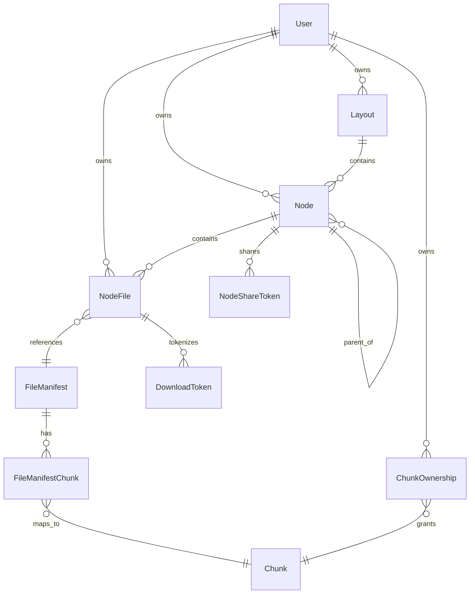
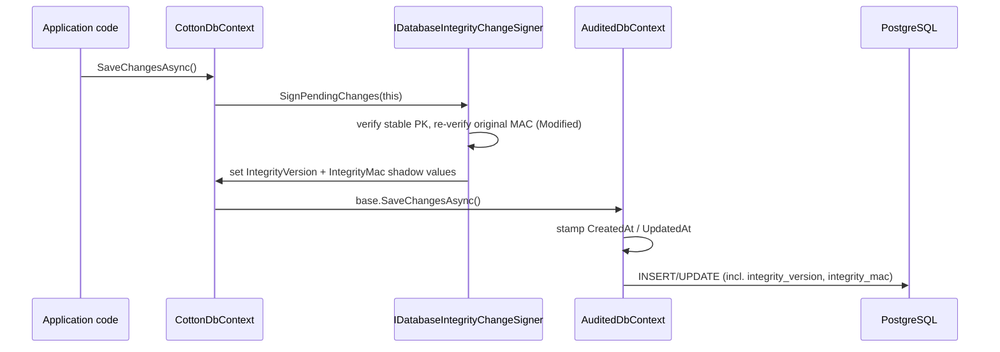

# 03. Data Model & Persistence (EF Core)

Cotton's relational state lives in a single PostgreSQL database accessed through one EF Core context, `CottonDbContext` (`src/Cotton.Database/CottonDbContext.cs`). The data model is deliberately convention-driven: entities are plain C# classes configured almost entirely with data annotations, column-level encryption and row-level integrity signing are layered into the context, and the schema is evolved exclusively through EF-tooling-generated migrations that are auto-applied on startup. This section documents the context, the base-entity conventions, every entity and enum in `src/Cotton.Database/Models`, the content/layout schema split, and the integrity shadow columns.

## Purpose & overview

The `Cotton.Database` project is the persistence layer shared by the server. It contains:

- One `DbContext` (`CottonDbContext`) that owns all `DbSet`s, hooks `SaveChanges`/`SaveChangesAsync` for integrity signing, and wires up transparent column encryption.
- The domain entities in `src/Cotton.Database/Models/*.cs`.
- Domain enums in `src/Cotton.Database/Models/Enums/*` (plus `BenchmarkType` in `src/Cotton.Database/Models/BenchmarkType.cs`, which lives directly in the `Cotton.Database.Models` namespace, not under `Enums`).
- The `[Encrypted]` marker attribute in `src/Cotton.Database/Models/Attributes/EncryptedAttribute.cs`.
- Integrity column metadata (`src/Cotton.Database/Integrity/DatabaseIntegrityColumns.cs`) and the signer abstraction (`src/Cotton.Database/Integrity/IDatabaseIntegrityChangeSigner.cs`).
- The generated migration history under `src/Cotton.Database/Migrations/`.

Two of the most important behaviors — the encryption stream cipher and the integrity signer — are injected as optional constructor dependencies, so the context still works for EF design-time tooling (which constructs it with neither) but performs encryption and signing at runtime when the server's DI container supplies them.

### Base entity conventions

Most entities derive from `EasyExtensions.EntityFrameworkCore.Abstractions.BaseEntity<TId>` (external package, source at `/data/code/EasyExtensions/Sources/EasyExtensions.EntityFrameworkCore/Abstractions/BaseEntity.cs`). `BaseEntity<Guid>` provides:

| Property | Column | Type | Notes |
| --- | --- | --- | --- |
| `Id` | `id` | `uuid` | `[Key]`, `protected set`; value generated by EF convention on add (Npgsql default for a `Guid` key) |
| `CreatedAt` | `created_at` | `timestamp with time zone` | `private set`; set once on insert |
| `UpdatedAt` | `updated_at` | `timestamp with time zone` | `private set`; refreshed on every insert/update |

`BaseEntity<TId>` implements `IAuditableEntity` (exposing `CreatedAt`/`UpdatedAt` via explicit interface setters). The base context `AuditedDbContext` (which `CottonDbContext` extends) overrides `SaveChanges*` and calls a private `UpdateDateTimeValues()`, which stamps `UpdatedAt = DateTime.UtcNow` on all `Added`/`Modified` auditable entities and `CreatedAt = now` on `Added` rows whose `CreatedAt` is still `default`. Application code therefore never sets these timestamps directly.

For user-owned rows, Cotton adds an intermediate base class `Cotton.Database.Abstractions.BaseOwnedEntity` (`src/Cotton.Database/Abstractions/BaseOwnedEntity.cs`):

```csharp
public abstract class BaseOwnedEntity : BaseEntity<Guid>
{
    [Column("owner_id")]
    public Guid OwnerId { get; set; }

    public virtual User Owner { get; set; } = null!;
}
```

`BaseOwnedEntity` is the base for `Node`, `NodeFile`, `Layout`, and `ChunkOwnership`. The `Owner` navigation is intentionally **not** decorated with a `[DeleteBehavior]` attribute — see *Delete-behavior matrix* below for why that matters.

### Project rules (verified against code)

- **Data-annotations-first configuration.** There is no application-level Fluent API for table/column/relationship shape. `OnModelCreating` exists, but it only (1) registers shadow integrity properties, (2) sets one default value (`FileManifest.PreviewGeneratorVersion = 0`), and (3) attaches the encryption value converter. All table names, column names, keys, indexes, lengths, and relationship delete behaviors are expressed with attributes such as `[Table]`, `[Column]`, `[Key]`, `[Index]`, `[MaxLength]`, `[MinLength]`, `[RegularExpression]`, `[ForeignKey]`, and `[DeleteBehavior]`. No domain `modelBuilder.Entity<T>().HasKey/HasOne/Property(...)` mapping calls appear outside the integrity/encryption plumbing.
- **No global naming convention.** snake_case column names come from explicit `[Column("...")]` attributes, not from a convention. Any property without a `[Column]` attribute keeps its CLR name as the column name. The one observed leak is `AppVersion.Version`, which maps to a column literally named `Version` because the property carries no `[Column]` attribute (confirmed in `src/Cotton.Database/Migrations/CottonDbContextModelSnapshot.cs`, where the property is declared as `b.Property<string>("Version")` with no `HasColumnName`).
- **DeleteBehavior is selective, not "Restrict everywhere".** The intent is to avoid accidental cascade deletes, and most navigations are explicitly annotated `[DeleteBehavior(DeleteBehavior.Restrict)]`. However EF Core's default for a required relationship is `Cascade`, and several relationships are left undecorated (or, in one case, explicitly `Cascade`). The actual delete behavior matrix is documented below — treat "Restrict everywhere" as an aspiration the code only partially enforces.
- **Migrations are tooling-generated and auto-applied.** The schema is never hand-edited; migrations come from `dotnet ef migrations add`. At startup the server calls `app.ApplyMigrations<CottonDbContext>()` (`src/Cotton.Server/Program.cs`), which under the hood runs `Database.GetPendingMigrations()` and, if any are pending, `Database.Migrate()`.

## CottonDbContext

`CottonDbContext` is a primary-constructor class:

```csharp
public class CottonDbContext(
    DbContextOptions options,
    IStreamCipher? streamCipher = null,
    ILogger<CottonDbContext>? logger = null,
    IDatabaseIntegrityChangeSigner? integrityChangeSigner = null) : AuditedDbContext(options)
```

`IStreamCipher` is `EasyExtensions.Abstractions.IStreamCipher`; `IDatabaseIntegrityChangeSigner` is the Cotton-defined abstraction in `src/Cotton.Database/Integrity/`. It is registered in DI via `AddPostgresDbContext<CottonDbContext>(x => x.UseLazyLoadingProxies = false)` in `src/Cotton.Server/Program.cs`. That EasyExtensions helper (`EasyExtensions.EntityFrameworkCore.Npgsql`) calls `services.AddDbContext<CottonDbContext>(...)` with the configured connection string and a scoped lifetime by default — it is a standard (non-pooled) `AddDbContext` registration. **Lazy-loading proxies are disabled**, so the `virtual` navigation properties are not auto-loaded — call sites must `Include(...)` or explicitly load related data.

The design-time factory `CottonDbContextDesignTimeFactory` (`src/Cotton.Database/CottonDbContextDesignTimeFactory.cs`) builds the context for EF tooling from `COTTON_PG_*` environment variables (defaults: `COTTON_PG_HOST=localhost`, `COTTON_PG_PORT=5432`, `COTTON_PG_DATABASE=cotton_dev`, `COTTON_PG_USERNAME=postgres`, `COTTON_PG_PASSWORD=postgres`), and uses `UseAdminDatabase("postgres")`. It passes only `options` to the constructor (no cipher, no signer).

### DbSets

| `DbSet` property | Entity | Table |
| --- | --- | --- |
| `Nodes` | `Node` | `nodes` |
| `Users` | `User` | `users` |
| `Chunks` | `Chunk` | `chunks` |
| `UserLayouts` | `Layout` | `layouts` |
| `NodeFiles` | `NodeFile` | `node_files` |
| `Benchmarks` | `Benchmark` | `benchmarks` |
| `AppVersions` | `AppVersion` | `app_versions` |
| `Notifications` | `Notification` | `notifications` |
| `FileManifests` | `FileManifest` | `file_manifests` |
| `DownloadTokens` | `DownloadToken` | `download_tokens` |
| `NodeShareTokens` | `NodeShareToken` | `node_share_tokens` |
| `ChunkOwnerships` | `ChunkOwnership` | `chunk_ownerships` |
| `UserPasskeyCredentials` | `UserPasskeyCredential` | `user_passkey_credentials` |
| `OidcProviders` | `OidcProvider` | `oidc_providers` |
| `UserExternalIdentities` | `UserExternalIdentity` | `user_external_identities` |
| `OidcLoginStates` | `OidcLoginState` | `oidc_login_states` |
| `FileManifestChunks` | `FileManifestChunk` | `file_manifest_chunks` |
| `RefreshTokens` | `ExtendedRefreshToken` | `refresh_tokens` |
| `ServerSettings` | `CottonServerSettings` | `server_settings` |

Each `DbSet` is implemented as an expression-bodied property delegating to `Set<TEntity>()`. Note two naming mismatches: the `DbSet` for `Layout` is named `UserLayouts`, and the `DbSet` for `ExtendedRefreshToken` is named `RefreshTokens`. `ExtendedRefreshToken` is defined in the external EasyExtensions package, not in `src/Cotton.Database/Models`.

### SaveChanges / SaveChangesAsync overrides and integrity hook

All four save entry points (`SaveChanges()`, `SaveChanges(bool)`, `SaveChangesAsync(CancellationToken)`, `SaveChangesAsync(bool, CancellationToken)`) are overridden to invoke `integrityChangeSigner?.SignPendingChanges(this)` before delegating to the base implementation:

```csharp
public override Task<int> SaveChangesAsync(CancellationToken cancellationToken = default)
{
    integrityChangeSigner?.SignPendingChanges(this);
    return base.SaveChangesAsync(cancellationToken);
}
```

Because `AuditedDbContext` also overrides these methods (to stamp timestamps), the effective ordering on a save is: Cotton's override signs pending rows → base `AuditedDbContext` updates `CreatedAt`/`UpdatedAt` → EF persists. The signer is null at design-time and in any DI configuration that doesn't register it, in which case signing is silently skipped. The signer implementation (`src/Cotton.Server/Services/DatabaseIntegrity/DatabaseIntegrityChangeSigner.cs`) is part of the server's database-integrity subsystem; this section documents only the schema-side contract. See the *Database Integrity* and *Cryptography Engine* sections for the signing/verification algorithm.

### OnModelCreating

```mermaid
flowchart TD
    A[base.OnModelCreating] --> B[ConfigureIntegrityShadowProperties&lt;T&gt; for 14 protected entities]
    B --> C[FileManifest.PreviewGeneratorVersion default = 0]
    C --> D[Build encryptedStringConverter using streamCipher]
    D --> E[Scan every entity type's properties]
    E --> F{property has [Encrypted] AND CLR type is string?}
    F -- yes --> G[Apply value converter to that property]
    F -- no --> E
```

`OnModelCreating` does exactly three things beyond the base call:

1. **Integrity shadow properties.** A private generic helper `ConfigureIntegrityShadowProperties<TEntity>` is called for 14 entity types: `User`, `UserPasskeyCredential`, `OidcProvider`, `UserExternalIdentity`, `OidcLoginState`, `ExtendedRefreshToken`, `DownloadToken`, `NodeShareToken`, `CottonServerSettings`, `Node`, `NodeFile`, `FileManifest`, `FileManifestChunk`, `Chunk`. Each gets two shadow properties (see *Integrity shadow columns*).
2. **One default value.** `FileManifest.PreviewGeneratorVersion` gets a database default of `0` via `.HasDefaultValue(0)`.
3. **Transparent encryption.** A `ValueConverter<string?, string?>` is built from the private `EncryptString`/`DecryptString` methods. The model is then scanned with `modelBuilder.Model.GetEntityTypes()`; for every property of every entity that (a) is decorated `[Encrypted]` and (b) has CLR type `string`, the converter is attached via `.HasConversion(encryptedStringConverter)`.

The converter behavior:

- `EncryptString`: if `value` is null **or** `streamCipher` is null, returns the value unchanged; otherwise encrypts via `streamCipher.EncryptString(value)` and stores the result as Base64 text. (`EncryptString`/`DecryptString` on `IStreamCipher` are extension methods from `EasyExtensions.Extensions.StreamCipherExtensions`.)
- `DecryptString`: if `value` is null or `streamCipher` is null, returns the value unchanged; otherwise Base64-decodes and calls `streamCipher.DecryptString`. On **any** exception it logs a warning (`"Failed to decrypt value in encrypted EF converter. Falling back to raw database value."`) and returns the **raw stored value** rather than throwing.

This is a graceful-degradation choice: a missing/rotated key yields warnings and ciphertext-as-plaintext reads instead of read failures. The `[Encrypted]`-decorated `string` properties in the model are exactly:

| Entity | Property | Column |
| --- | --- | --- |
| `OidcProvider` | `ClientSecretEncrypted` | `client_secret_encrypted` |
| `OidcLoginState` | `CodeVerifierEncrypted` | `code_verifier_encrypted` |
| `OidcLoginState` | `NonceEncrypted` | `nonce_encrypted` |
| `CottonServerSettings` | `CloudServicesTokenEncrypted` | `cloud_services_token_encrypted` |
| `CottonServerSettings` | `OidcClientSecretEncrypted` | `oidc_client_secret_encrypted` |
| `CottonServerSettings` | `S3SecretAccessKeyEncrypted` | `s3_secret_access_key_encrypted` |
| `CottonServerSettings` | `SmtpPasswordEncrypted` | `smtp_password_encrypted` |

Note that several entities also store secrets as `byte[]` columns ending in `_encrypted` (e.g. `User.TotpSecretEncrypted`, `User.AvatarHashEncrypted`, `FileManifest.SmallFilePreviewHashEncrypted`) — those are encrypted elsewhere in application code, not by this string converter, which only handles `string` properties.

### PostgreSQL extensions and column types

The model enables two PostgreSQL extensions: `citext` and `hstore`. In the model snapshot both are present (`NpgsqlModelBuilderExtensions.HasPostgresExtension(modelBuilder, "citext")` and `... "hstore"`), but they were enabled at different points in the migration history: `citext` is enabled by the first migration (`20260102064107_Initial`), while `hstore` is enabled later, by `20260210183506_AddNotifications` (the migration that introduced the first `hstore`-typed `metadata` column). Resulting non-obvious column-type mappings:

| CLR type | PostgreSQL type | Used by |
| --- | --- | --- |
| `Dictionary<string,string>` | `hstore` | `Node.Metadata`, `NodeFile.Metadata`, `Notification.Metadata`, `User.Preferences` |
| `string[]` | `text[]` | `OidcProvider.Scopes`, `OidcProvider.AllowedEmailDomains`, `UserPasskeyCredential.Transports` |
| `ServerUsage[]` | `integer[]` | `CottonServerSettings.ServerUsage` |
| `string` with `[Column(TypeName="citext")]` | `citext` (case-insensitive) | `User.Username`, `User.Email`, `Node.NameKey`, `NodeFile.NameKey`, `FileManifest.ContentType` |
| `byte[]` | `bytea` | content hashes, MACs, COSE keys, encrypted secrets |
| `IPAddress` | `inet` | `ExtendedRefreshToken.IpAddress` |
| enum | `integer` | all enum columns |
| `TimeSpan` | `interval` | `Benchmark.Elapsed` |

## The content / layout schema split

Cotton separates **immutable, deduplicated content** from **mutable, user-facing file-tree structure**. This split is the spine of the data model.

**Content side (shared, content-addressed, not user-owned):**

- `Chunk` — one deduplicated encrypted storage chunk, keyed by its content `Hash` (`bytea`), not a Guid.
- `FileManifest` — immutable description of one file's content (size, MIME type, content hashes, previews).
- `FileManifestChunk` — ordered join from a manifest to its chunks.
- `ChunkOwnership` — records that a given user is entitled to reference a given chunk (used for proof-of-ownership during deduplicated uploads).

**Layout side (per-user, mutable tree):**

- `Layout` — a user-owned tree root (the normal view, the trash view, etc.).
- `Node` — a folder-like node within one layout.
- `NodeFile` — a named, visible file entry inside a node that points at one `FileManifest`.

The same `FileManifest` (and therefore the same physical chunks) can be referenced by many `NodeFile` rows across users; conversely a `NodeFile` is a per-user "filename in a folder" that can be renamed or moved without touching content. Deleting a visible file removes a `NodeFile` row; the underlying `Chunk`/`FileManifest` rows persist until garbage collection (driven by `Chunk.GCScheduledAfter`). See the *Storage Pipeline & Deduplication* and *Garbage Collection* sections.



## Entities

Every entity below derives from `BaseEntity<Guid>` (giving `Id`, `CreatedAt`, `UpdatedAt`) unless it derives from `BaseOwnedEntity` (which adds `OwnerId` + `Owner`) or, in the case of `Chunk`, from no base class at all. Only the entity-specific fields are listed.

### User (`users`)

`src/Cotton.Database/Models/User.cs`, `BaseEntity<Guid>`. Unique index on `Username`.

| Field | Column | Type | Notes |
| --- | --- | --- | --- |
| `Username` | `username` | `citext` | `[MinLength(2)]`, `[MaxLength(32)]`, `[RegularExpression("^[a-z][a-z0-9]{1,31}$")]` |
| `FirstName` / `LastName` | `first_name` / `last_name` | text? | optional |
| `BirthDate` | `birth_date` | `date` | `DateOnly?` |
| `PasswordPhc` | `password_phc` | text | PHC-formatted password hash |
| `WebDavTokenPhc` | `webdav_token_phc` | text | PHC-formatted WebDAV token hash |
| `Email` | `email` | `citext` | optional |
| `IsEmailVerified` | `is_email_verified` | bool | |
| `EmailVerificationToken` / `EmailVerificationTokenSentAt` | `email_verification_token` / `email_verification_token_sent_at` | text? / timestamptz? | |
| `PasswordResetToken` / `PasswordResetTokenSentAt` | `password_reset_token` / `password_reset_token_sent_at` | text? / timestamptz? | |
| `Role` | `role` | int | `UserRole` enum (external) |
| `IsTotpEnabled` / `TotpEnabledAt` / `TotpFailedAttempts` | `is_totp_enabled` / `totp_enabled_at` / `totp_failed_attempts` | bool / timestamptz? / int | |
| `TotpSecretEncrypted` | `totp_secret_encrypted` | `bytea?` | encrypted in app code |
| `AvatarHashEncrypted` / `AvatarHash` | `avatar_hash_encrypted` / `avatar_hash` | `bytea?` | private vs directly-servable variants |
| `Preferences` | `preferences` | `hstore` | required, default empty (`[]`) |

`User.AvatarPreviewTokenPrefix = 'u'`. `GetAvatarHashEncryptedHex()` returns `'u' + Id.ToString("N") + Convert.ToHexStringLower(AvatarHashEncrypted)` (a row-scoped public preview token), or `null` when `AvatarHashEncrypted` is null. Navigations: `ChunkOwnerships`, `DownloadTokens`, `Notifications`, `NodeFiles`, `PasskeyCredentials`, `ExternalIdentities`.

### Layout (`layouts`)

`src/Cotton.Database/Models/Layout.cs`, `BaseOwnedEntity`. Single extra field `IsActive` (`is_active`, bool). Navigation `Nodes`. A layout represents one user-owned file tree (normal vs trash); `Node.Type` further distinguishes tree kinds within it.

### Node (`nodes`)

`src/Cotton.Database/Models/Node.cs`, `BaseOwnedEntity`. Unique composite index `(LayoutId, ParentId, Type, NameKey)` — i.e. no two siblings of the same type in the same layout may share a normalized name. The snapshot also shows non-unique indexes on `OwnerId` and `ParentId` (EF-generated FK indexes).

| Field | Column | Type | Notes |
| --- | --- | --- | --- |
| `LayoutId` | `layout_id` | uuid | owning layout |
| `ParentId` | `parent_id` | uuid? | null for a layout root |
| `Type` | `type` | int | `NodeType` enum |
| `Name` | `name` | text | `private set`; assigned via `SetName` |
| `NameKey` | `name_key` | `citext` | `private set`; normalized lookup key |
| `Metadata` | `metadata` | `hstore?` | default empty (`[]`) |

`SetName(string)` validates via `NameValidator.TryNormalizeAndValidate` (in `src/Cotton.Validators/NameValidator.cs`; throws `ArgumentException` on invalid input) and sets both `Name` (the NFC-normalized display name) and `NameKey` (`NameValidator.GetNameKey`, which folds case **and** diacritics — combining marks are stripped). There are two `SetParent` overloads: `SetParent(Node parent)` and `SetParent(Node parent, NodeType nodeType)`; both call the private `EnsureParentMatches`, which enforces that the parent has the same `OwnerId`, same `LayoutId`, and a matching `Type`, throwing `InvalidOperationException` otherwise. Navigations: `Layout` (Restrict), `Parent` (Restrict, self-reference, `Children` collection), `NodeFiles`.

### NodeFile (`node_files`)

`src/Cotton.Database/Models/NodeFile.cs`, `BaseOwnedEntity`. Non-unique indexes `(NodeId, NameKey)` and `(FileManifestId, NodeId)`, plus an EF-generated `OwnerId` index. The `(NodeId, NameKey)` index is **not** unique (uniqueness was dropped by the `20260516005639_DropNodeFilesNameKeyUniqueness` migration), so multiple file versions/entries with the same normalized name can coexist in a node.

| Field | Column | Type | Notes |
| --- | --- | --- | --- |
| `FileManifestId` | `file_manifest_id` | uuid | references immutable content |
| `NodeId` | `node_id` | uuid | containing node |
| `OriginalNodeFileId` | `original_node_file_id` | uuid | stable id across versions; the first `NodeFile` created for a logical file, preserved through subsequent updates |
| `Name` | `name` | text | `private set`; via `SetName` |
| `NameKey` | `name_key` | `citext` | `private set` |
| `Metadata` | `metadata` | `hstore?` | default empty (`[]`) |

`SetName` behaves exactly as in `Node`. Navigations: `FileManifest` (Restrict), `Node` (Restrict), `DownloadTokens`.

### FileManifest (`file_manifests`)

`src/Cotton.Database/Models/FileManifest.cs`, `BaseEntity<Guid>` (NOT owned — content is shared). Unique indexes on `ProposedContentHash` and `ComputedContentHash`; non-unique indexes on `SmallFilePreviewHash` and `LargeFilePreviewHash`.

| Field | Column | Type | Notes |
| --- | --- | --- | --- |
| `ComputedContentHash` | `computed_content_hash` | `bytea?` | server-computed, verifies upload |
| `ProposedContentHash` | `proposed_content_hash` | `bytea` | client-proposed, used for dedup |
| `ContentType` | `content_type` | `citext` | MIME type |
| `SizeBytes` | `size_bytes` | bigint | |
| `SmallFilePreviewHashEncrypted` | `small_file_preview_hash_encrypted` | `bytea?` | private small preview |
| `SmallFilePreviewHash` | `small_file_preview_hash` | `bytea?` | directly-servable small preview |
| `LargeFilePreviewHash` | `large_file_preview_hash` | `bytea?` | large preview image |
| `PreviewGenerationError` | `preview_generation_error` | text? | last preview error message |
| `PreviewGeneratorVersion` | `preview_generator_version` | int | DB default `0` (set in `OnModelCreating`); used to detect stale previews |

`FileManifest.PreviewTokenPrefix = 'f'`. `GetPreviewHashEncryptedHex()` returns `'f' + Id.ToString("N") + Convert.ToHexStringLower(SmallFilePreviewHashEncrypted)`, or `null` when `SmallFilePreviewHashEncrypted` is null. Navigations: `NodeFiles`, `FileManifestChunks`.

### Chunk (`chunks`)

`src/Cotton.Database/Models/Chunk.cs`. **Not** a `BaseEntity` — it is a plain class with no Guid id, no audit timestamps, and no `Owner`. Index on `GCScheduledAfter`.

| Field | Column | Type | Notes |
| --- | --- | --- | --- |
| `Hash` | `hash` | `bytea` | `[Key]` — content-addressed primary key |
| `PlainSizeBytes` | `plain_size_bytes` | bigint | size before compression/encryption |
| `StoredSizeBytes` | `stored_size_bytes` | bigint | size after pipeline processing |
| `GCScheduledAfter` | `gc_scheduled_after` | timestamptz? | when an unreferenced chunk may be collected |
| `CompressionAlgorithm` | `compression_algorithm` | int | `EasyExtensions.Models.Enums.CompressionAlgorithm` |

Navigations: `ChunkOwnerships`, `FileManifestChunks`. Because `Chunk` has no `Id` property, the integrity signer's stable-primary-key check is a no-op for it (see *Integrity shadow columns*), but it still receives the `integrity_version`/`integrity_mac` shadow columns.

### FileManifestChunk (`file_manifest_chunks`)

`src/Cotton.Database/Models/FileManifestChunk.cs`, `BaseEntity<Guid>`. Index on `ChunkHash`; unique index `(FileManifestId, ChunkOrder)`.

| Field | Column | Type | Notes |
| --- | --- | --- | --- |
| `FileManifestId` | `file_manifest_id` | uuid | |
| `ChunkOrder` | `chunk_order` | int | `0..N-1` ordering within the manifest |
| `ChunkHash` | `chunk_hash` | `bytea` | FK to `Chunk.Hash` |

Navigations: `Chunk` (Restrict), `FileManifest` (Restrict).

### ChunkOwnership (`chunk_ownerships`)

`src/Cotton.Database/Models/ChunkOwnership.cs`, `BaseOwnedEntity`. Unique index `(OwnerId, ChunkHash)`.

| Field | Column | Type | Notes |
| --- | --- | --- | --- |
| `ChunkHash` | `chunk_hash` | `bytea` | FK to `Chunk.Hash` |

Navigation: `Chunk` (Restrict). Plus the inherited `Owner`. Used to verify proof-of-ownership before letting a user reference an already-stored chunk during deduplicated upload.

### DownloadToken (`download_tokens`)

`src/Cotton.Database/Models/DownloadToken.cs`, `BaseEntity<Guid>`. Unique index on `Token`; EF-generated indexes on `CreatedByUserId` and `NodeFileId`. A temporary direct-download token for one file.

| Field | Column | Type | Notes |
| --- | --- | --- | --- |
| `FileName` | `file_name` | text | name presented to clients |
| `Token` | `token` | text | opaque authorization token |
| `NodeFileId` | `node_file_id` | uuid | target file entry |
| `ExpiresAt` | `expires_at` | timestamptz? | |
| `CreatedByUserId` | `created_by_user_id` | uuid | |
| `DeleteAfterUse` | `delete_after_use` | bool | single-use semantics |

Navigations: `CreatedByUser` (Restrict), `NodeFile` (Restrict).

### NodeShareToken (`node_share_tokens`)

`src/Cotton.Database/Models/NodeShareToken.cs`, `BaseEntity<Guid>`. Unique index on `Token`; EF-generated indexes on `CreatedByUserId` and `NodeId`. The folder-sharing parallel to `DownloadToken`.

| Field | Column | Type | Notes |
| --- | --- | --- | --- |
| `Name` | `name` | text | folder display name at share time |
| `Token` | `token` | text | opaque share-URL token |
| `NodeId` | `node_id` | uuid | shared folder |
| `ExpiresAt` | `expires_at` | timestamptz? | null = never expires |
| `CreatedByUserId` | `created_by_user_id` | uuid | |

Navigations: `CreatedByUser` (Restrict), `Node` (**Cascade** — the only navigation in the model that explicitly declares `[DeleteBehavior(DeleteBehavior.Cascade)]`, so deleting a shared node deletes its share tokens).

### Notification (`notifications`)

`src/Cotton.Database/Models/Notification.cs`, `BaseEntity<Guid>`.

| Field | Column | Type | Notes |
| --- | --- | --- | --- |
| `Title` | `title` | text | |
| `Content` | `content` | text? | |
| `ReadAt` | `read_at` | timestamptz? | null = unread |
| `Metadata` | `metadata` | `hstore?` | nullable (no default) |
| `UserId` | `user_id` | uuid | recipient |
| `Priority` | `priority` | int | `NotificationPriority` enum |

Navigation: `User` (Restrict).

### UserPasskeyCredential (`user_passkey_credentials`)

`src/Cotton.Database/Models/UserPasskeyCredential.cs`, `BaseEntity<Guid>`. Unique index on `CredentialId`; non-unique index on `UserId`. One WebAuthn/passkey credential.

| Field | Column | Type | Notes |
| --- | --- | --- | --- |
| `UserId` | `user_id` | uuid | `[ForeignKey(nameof(UserId))]` to `User` |
| `CredentialId` | `credential_id` | `bytea` | WebAuthn credential id |
| `PublicKey` | `public_key` | `bytea` | COSE public key |
| `UserHandle` | `user_handle` | `bytea` | WebAuthn user handle |
| `SignatureCounter` | `signature_counter` | bigint | cloned-credential detection |
| `Name` | `name` | text | `[MaxLength(120)]` |
| `Transports` | `transports` | `text[]` | reported transports |
| `AaGuid` | `aaguid` | uuid | authenticator attestation GUID |
| `IsBackupEligible` / `IsBackedUp` | `is_backup_eligible` / `is_backed_up` | bool | |
| `AttestationFormat` | `attestation_format` | text? | `[MaxLength(64)]` |
| `LastUsedAt` | `last_used_at` | timestamptz? | |

Navigation: `User` (via `[ForeignKey(nameof(UserId))]`; effectively Cascade — see matrix).

### OidcProvider (`oidc_providers`)

`src/Cotton.Database/Models/OidcProvider.cs`, `BaseEntity<Guid>`. Unique index on `Slug`. An admin-configured OpenID Connect provider.

| Field | Column | Type | Notes |
| --- | --- | --- | --- |
| `Name` | `name` | text | `[MaxLength(80)]` |
| `Slug` | `slug` | text | `[MaxLength(64)]`, unique, used in login routes |
| `Issuer` | `issuer` | text | `[MaxLength(512)]` |
| `ClientId` | `client_id` | text | `[MaxLength(256)]` |
| `ClientSecretEncrypted` | `client_secret_encrypted` | text? | **`[Encrypted]`** |
| `Scopes` | `scopes` | `text[]` | |
| `IsEnabled` | `is_enabled` | bool | |
| `AllowAccountCreation` | `allow_account_creation` | bool | |
| `RequireVerifiedEmail` | `require_verified_email` | bool | |
| `DefaultRole` | `default_role` | int | `UserRole` for auto-created accounts |
| `AllowedEmailDomains` | `allowed_email_domains` | `text[]` | |
| `SyncProfile` / `SyncAvatar` | `sync_profile` / `sync_avatar` | bool | |

Navigation: `UserIdentities`.

### UserExternalIdentity (`user_external_identities`)

`src/Cotton.Database/Models/UserExternalIdentity.cs`, `BaseEntity<Guid>`. Unique indexes `(ProviderId, Subject)` and `(UserId, ProviderId)`. Links a Cotton user to one external OIDC subject.

| Field | Column | Type | Notes |
| --- | --- | --- | --- |
| `UserId` | `user_id` | uuid | `[ForeignKey(nameof(UserId))]` to `User` |
| `ProviderId` | `provider_id` | uuid | `[ForeignKey(nameof(ProviderId))]` to `OidcProvider` |
| `Issuer` | `issuer` | text | `[MaxLength(512)]` |
| `Subject` | `subject` | text | `[MaxLength(256)]`; the only stable external key |
| `Email` | `email` | text? | `[MaxLength(320)]` |
| `EmailVerified` | `email_verified` | bool | |
| `DisplayName` | `display_name` | text? | `[MaxLength(160)]` |
| `PictureUrl` | `picture_url` | text? | `[MaxLength(2048)]` |
| `LastUsedAt` | `last_used_at` | timestamptz? | |

Navigations: `User`, `Provider` (both via `[ForeignKey]`, both effectively Cascade).

### OidcLoginState (`oidc_login_states`)

`src/Cotton.Database/Models/OidcLoginState.cs`, `BaseEntity<Guid>`. Unique index on `StateHash`; non-unique index on `ExpiresAt` (and an EF-generated `ProviderId` index). Short-lived authorization-code-flow state.

| Field | Column | Type | Notes |
| --- | --- | --- | --- |
| `ProviderId` | `provider_id` | uuid | `[ForeignKey(nameof(ProviderId))]` to `OidcProvider` |
| `StateHash` | `state_hash` | text | `[MaxLength(64)]`; SHA-256 of the browser state value |
| `CodeVerifierEncrypted` | `code_verifier_encrypted` | text | **`[Encrypted]`**; PKCE verifier |
| `NonceEncrypted` | `nonce_encrypted` | text | **`[Encrypted]`**; expected ID-token nonce |
| `ReturnUrl` | `return_url` | text | `[MaxLength(1024)]`, default `"/"` |
| `LinkUserId` | `link_user_id` | uuid? | set for account linking, null for sign-in |
| `TrustDevice` | `trust_device` | bool | |
| `ExpiresAt` | `expires_at` | timestamptz | non-nullable |

Navigation: `Provider` (via `[ForeignKey(nameof(ProviderId))]`; effectively Cascade — see matrix).

### ExtendedRefreshToken (`refresh_tokens`)

Defined in EasyExtensions (`EasyExtensions.EntityFrameworkCore.Database.ExtendedRefreshToken`), which extends `RefreshToken : BaseEntity<Guid>`. Unique index on `Token` (declared on both `RefreshToken` and `ExtendedRefreshToken`). Exposed via the `RefreshTokens` `DbSet`.

| Field | Column | Type | Notes |
| --- | --- | --- | --- |
| `UserId` | `user_id` | uuid | from `RefreshToken` |
| `Token` | `token` | text | unique, from `RefreshToken` |
| `RevokedAt` | `revoked_at` | timestamptz? | from `RefreshToken` |
| `IpAddress` | `ip_address` | `inet` | |
| `UserAgent` | `user_agent` | text | |
| `AuthType` | `auth_type` | int | `EasyExtensions` `AuthType` enum |
| `Country` / `Region` / `City` | `country` / `region` / `city` | text? | geo metadata |
| `Device` | `device` | text? | |
| `SessionId` | `session_id` | text? | |
| `IsTrusted` | `is_trusted` | bool | extended-lifetime / trusted device |

There is no explicit FK navigation back to `User` defined on this type (only the `UserId` scalar). It is in the set of integrity-protected entities.

### CottonServerSettings (`server_settings`)

`src/Cotton.Database/Models/CottonServerSettings.cs`, `BaseEntity<Guid>`. The singleton-style server configuration row (one row in practice). Fields:

| Field group | Columns | Notes |
| --- | --- | --- |
| Cipher/pipeline | `encryption_threads`, `cipher_chunk_size_bytes`, `compression_level`, `max_chunk_size_bytes` | ints |
| Sessions | `session_timeout_hours` | C# default `30 * 24` (720h = 30 days) |
| Policy flags | `allow_cross_user_deduplication`, `allow_global_indexing`, `telemetry_enabled` | bools |
| Instance | `timezone` (text), `instance_id` (uuid), `public_base_url` (text) | |
| SMTP | `smtp_server_address`, `smtp_server_port` (int?), `smtp_username`, `smtp_sender_email`, `smtp_use_ssl`, `smtp_password_encrypted` (**`[Encrypted]`**) | host/user/sender are nullable text |
| S3 | `s3_access_key_id`, `s3_bucket_name`, `s3_region`, `s3_endpoint_url`, `s3_secret_access_key_encrypted` (**`[Encrypted]`**) | nullable text |
| Modes | `email_mode` (`EmailMode`), `compution_mode` (`ComputionMode`), `storage_type` (`StorageType`), `storage_space_mode` (`StorageSpaceMode`), `geo_ip_lookup_mode` (`GeoIpLookupMode`) | enums |
| Server usage | `server_usage` | `ServerUsage[]` → `integer[]` |
| Quotas / templates | `default_user_storage_quota_bytes` (bigint?), `default_user_template_node_id` (uuid?) | |
| TOTP | `totp_max_failed_attempts` (int) | |
| OIDC (legacy single-provider) | `oidc_client_id`, `oidc_issuer`, `oidc_client_secret_encrypted` (**`[Encrypted]`**) | distinct from the multi-provider `OidcProvider` table |
| Cotton Bridge | `cloud_services_token_encrypted` (**`[Encrypted]`**) | |
| Geo IP | `custom_geo_ip_lookup_url` (text?) | |

Helper methods: `GetInstanceIdHash()` returns `InstanceId.ToString().Sha256()` (a stable public fingerprint that avoids exposing the raw instance id to relays/integrations); `GetTimezoneInfo()` resolves `Timezone` via `TimeZoneInfo.FindSystemTimeZoneById`, falling back to `TimeZoneInfo.Utc` when `Timezone` is empty or raises `TimeZoneNotFoundException`. This is an integrity-protected entity.

### Benchmark (`benchmarks`) and AppVersion (`app_versions`)

`Benchmark` (`src/Cotton.Database/Models/Benchmark.cs`, `BaseEntity<Guid>`): one local performance measurement. Fields `Type` (`BenchmarkType` enum, column `type`), `Name` (`name`, text), `Value` (`value`, bigint), `Units` (`units`, text), `Elapsed` (`elapsed`, `interval`). Not integrity-protected; no FK relationships.

`AppVersion` (`src/Cotton.Database/Models/AppVersion.cs`, `BaseEntity<Guid>`): tracks the running version and latest-release notification state. Fields `Version` (column literally named `Version` — no `[Column]` attribute), `LatestReleaseVersion` (`latest_release_version`), `LatestReleaseUrl` (`latest_release_url`), `LatestReleaseCheckedAt` (`latest_release_checked_at`), `LatestReleaseNotifiedAt` (`latest_release_notified_at`). Maintained by `AppVersionTrackerService` (`src/Cotton.Server/Services/AppVersionTrackerService.cs`), registered as a hosted service in `Program.cs`. Not integrity-protected.

## Enums

All enums are stored as `integer`. Explicit numeric values matter for on-disk compatibility — do not reorder.

| Enum (file) | Values |
| --- | --- |
| `NodeType` (`Models/Enums/NodeType.cs`) | `Default = 0`, `Trash = 1` |
| `NotificationPriority` (`Models/Enums/NotificationPriority.cs`) | `None = 0`, `Low = 1`, `Medium = 2`, `High = 3` |
| `EmailMode` (`Models/Enums/EmailMode.cs`) | `None = 0`, `Cloud = 1`, `Custom = 2` |
| `ComputionMode` (`Models/Enums/ComputionMode.cs`) | `Local = 0`, `Cloud = 1`, `Remote = 2` (note: spelled "Compution") |
| `StorageType` (`Models/Enums/StorageType.cs`) | `Local = 0`, `S3 = 1` |
| `StorageSpaceMode` (`Models/Enums/StorageSpaceMode.cs`) | `Optimal = 0`, `Limited = 1`, `Unlimited = 2` |
| `ServerUsage` (`Models/Enums/ServerUsage.cs`) | `Other = 0`, `Photos = 1`, `Documents = 2`, `Media = 3` |
| `GeoIpLookupMode` (`Models/Enums/GeoIpLookupMode.cs`) | `Disabled = 0`, `CottonCloud = 1`, `MaxMindLocal = 2`, `CustomHttp = 3` |
| `BenchmarkType` (`Models/BenchmarkType.cs`) | `DiskSpeed = 1`, `DiskVolume = 2`, `ProcessorSpeed = 3`, `EncryptionSpeed = 4` (no `0`) |

External enums used by the model (all from EasyExtensions, `EasyExtensions.Models.Enums`): `UserRole` (`None = 0`, `User = 1`, `Admin = 2`); `CompressionAlgorithm` (`None = 0`, `Deflate = 1`, `Zlib = 2`, `Gzip = 3`, `Brotli = 4`, `Zstd = 5`, `Lz4 = 6`, `Snappy = 7`, `Lzo = 8`, `Bzip2 = 9`, `Xz = 10`, `Lzma = 11`, `Lzfse = 12`, `Zopfli = 13`); and `AuthType` (a large provider/mechanism enum, `Unknown = 0` through `IdMe = 85`).

## Attributes

`EncryptedAttribute` (`src/Cotton.Database/Models/Attributes/EncryptedAttribute.cs`) is a sealed, property-targeted (`[AttributeUsage(AttributeTargets.Property)]`) marker attribute with no members. Its only role is to be detected during `OnModelCreating` so the encryption value converter is attached to that `string` property. There are no other attributes in `Models/Attributes`.

## Integrity shadow columns

Row-level tamper-evidence is implemented with two **shadow** properties (not present on the CLR entity classes) registered in `OnModelCreating` for 14 entity types. Their names come from `DatabaseIntegrityColumns` (`src/Cotton.Database/Integrity/DatabaseIntegrityColumns.cs`):

| Constant | Value | Purpose |
| --- | --- | --- |
| `VersionProperty` | `"IntegrityVersion"` | EF shadow property name |
| `MacProperty` | `"IntegrityMac"` | EF shadow property name |
| `VersionColumn` | `"integrity_version"` | DB column (`integer`, nullable) |
| `MacColumn` | `"integrity_mac"` | DB column (`bytea`, nullable) |

`ConfigureIntegrityShadowProperties<TEntity>` maps the `int?` shadow property `IntegrityVersion` to column `integrity_version` and the `byte[]?` shadow property `IntegrityMac` to column `integrity_mac`. These are nullable so existing rows can be backfilled rather than migrated atomically.

The save-time contract is defined by `IDatabaseIntegrityChangeSigner` (`src/Cotton.Database/Integrity/IDatabaseIntegrityChangeSigner.cs`), a one-method interface: `void SignPendingChanges(DbContext dbContext)`. `CottonDbContext` invokes it before every save. The server-side implementation (`DatabaseIntegrityChangeSigner` in `src/Cotton.Server/Services/DatabaseIntegrity/`) walks the change tracker for `Added`/`Modified` entries that (a) have a registered descriptor (`IDatabaseIntegrityDescriptorRegistry.TryGet`) and (b) carry the two shadow properties, then:

1. Refuses to sign a row whose `Id` property is still `Guid.Empty` or marked temporary by EF (the PK participates in the signed payload, so a temporary key would produce a MAC that cannot verify after insert), throwing `InvalidOperationException`. Entities without an `Id` property (i.e. `Chunk`) skip this check.
2. For `Modified` rows, re-verifies the **original** stored MAC/version against the original values before re-signing. If the original MAC or version is null (a backfilled row), re-verification is skipped; otherwise a version mismatch or a failed `protector.Verify(originalEntity, descriptor, originalMac)` reports a failure and throws `DatabaseIntegrityException`, blocking the save.
3. Sets `IntegrityVersion = descriptor.SchemaVersion` and `IntegrityMac = protector.Sign(entity, descriptor)`.

This catches in-place tampering on the normal write path; direct SQL edits that bypass the application are caught later at read-time verification. The signing algorithm and descriptor registry live in the server's database-integrity subsystem — see the *Database Integrity* section.



## Delete-behavior matrix (actual, from the model snapshot)

Cascade vs Restrict is determined by `[DeleteBehavior]` attributes where present, and by EF Core's default (`Cascade` for required relationships) where absent. Verified against the `OnDelete(...)` calls in `src/Cotton.Database/Migrations/CottonDbContextModelSnapshot.cs`:

| Dependent → Principal | FK | Behavior | Source |
| --- | --- | --- | --- |
| `Node` → `Layout` | `layout_id` | Restrict | attribute |
| `Node` → `Node` (Parent) | `parent_id` | Restrict | attribute |
| `Node` → `User` (Owner) | `owner_id` | **Cascade** | EF default (no attribute on `BaseOwnedEntity.Owner`) |
| `NodeFile` → `FileManifest` | `file_manifest_id` | Restrict | attribute |
| `NodeFile` → `Node` | `node_id` | Restrict | attribute |
| `NodeFile` → `User` (Owner) | `owner_id` | **Cascade** | EF default |
| `Layout` → `User` (Owner) | `owner_id` | **Cascade** | EF default |
| `ChunkOwnership` → `Chunk` | `chunk_hash` | Restrict | attribute |
| `ChunkOwnership` → `User` (Owner) | `owner_id` | **Cascade** | EF default |
| `FileManifestChunk` → `Chunk` | `chunk_hash` | Restrict | attribute |
| `FileManifestChunk` → `FileManifest` | `file_manifest_id` | Restrict | attribute |
| `DownloadToken` → `User` (CreatedByUser) | `created_by_user_id` | Restrict | attribute |
| `DownloadToken` → `NodeFile` | `node_file_id` | Restrict | attribute |
| `NodeShareToken` → `User` (CreatedByUser) | `created_by_user_id` | Restrict | attribute |
| `NodeShareToken` → `Node` | `node_id` | **Cascade** | explicit `[DeleteBehavior(Cascade)]` |
| `Notification` → `User` | `user_id` | Restrict | attribute |
| `UserPasskeyCredential` → `User` | `user_id` | **Cascade** | EF default (`[ForeignKey]` only) |
| `UserExternalIdentity` → `User` | `user_id` | **Cascade** | EF default |
| `UserExternalIdentity` → `OidcProvider` | `provider_id` | **Cascade** | EF default |
| `OidcLoginState` → `OidcProvider` | `provider_id` | **Cascade** | EF default |

The practical consequence: deleting a `User` cascades through `Layout`, `Node`, `NodeFile`, `ChunkOwnership`, `UserPasskeyCredential`, and `UserExternalIdentity`, but is **blocked** by any of that user's `Notification`, `DownloadToken.CreatedByUser`, or `NodeShareToken.CreatedByUser` rows (Restrict). Deleting an `OidcProvider` cascades to its `UserExternalIdentity` and `OidcLoginState` rows. Content rows (`Chunk`, `FileManifest`) are protected by Restrict from their join tables, so they are only removed by explicit garbage collection, never by cascade.

## Migration approach

Migrations are generated with the EF Core tooling (`dotnet ef migrations add <Name>`) and committed under `src/Cotton.Database/Migrations/` as `<timestamp>_<Name>.cs` + `.Designer.cs` pairs, plus a single `CottonDbContextModelSnapshot.cs`. The history starts at `20260102064107_Initial` and currently runs forward to `20260526073016_AddOidcProviders` — 66 migrations (133 `.cs` files counting designers and the snapshot). They are not individually enumerated here because they are mechanically generated and the snapshot is the source of truth for the current schema. The `Initial` migration enables the `citext` extension; the `hstore` extension is enabled later, by `20260210183506_AddNotifications`.

At startup, `Cotton.Server` calls `app.ApplyMigrations<CottonDbContext>()` (`src/Cotton.Server/Program.cs`), implemented in EasyExtensions. It applies only pending migrations (via `Database.GetPendingMigrations()` + `Database.Migrate()`); if none are pending it is a no-op. The boot sequence in `Program.cs` is: build the app → validate startup transition rules against app-version history → if blocked, serve the startup-blocked SPA and `/api/v1/startup/status` → otherwise build the HTTP pipeline (auth, static files, controllers, fallback) → `app.ApplyMigrations<CottonDbContext>()` → (in a service scope) `IDatabaseAutoRestoreService.TryRestoreIfEmptyAsync()` and `SettingsProvider.GetServerSettings()` → map the SignalR hub → `app.RunAsync()`. Because migrations run automatically on every boot, the operational contract is "deploy new binaries, restart, schema upgrades itself" — there is no separate migration step. Operators should ensure only one instance applies migrations concurrently (EF's `Migrate()` is not designed for simultaneous multi-node execution).

## Concurrency, failure modes, edge cases, security considerations

- **No lazy loading.** `UseLazyLoadingProxies = false`, so accessing an unloaded `virtual` navigation returns null/empty instead of issuing a query. Always project or `Include`.
- **DbContext is not thread-safe.** The inherited `AuditedDbContext` XML docs reiterate EF's rule: never use one context instance from concurrent threads/async operations.
- **Encryption converter is fail-soft on read.** A decryption failure logs a warning and returns the raw stored value; downstream code may then receive ciphertext where it expects plaintext. This avoids hard read failures during key rotation but can mask misconfiguration. Encryption on write is a no-op when no `IStreamCipher` is registered (e.g. design-time), so a misconfigured runtime could silently persist plaintext into `_encrypted` columns.
- **Integrity signing throws on tamper.** Modifying an integrity-protected row whose stored MAC/version no longer matches its original values raises `DatabaseIntegrityException` during `SaveChanges`, aborting the transaction. Missing MAC/version metadata on protected existing rows is also a hard failure.
- **citext + diacritic folding.** `Username`, `Email`, and the `*NameKey` columns are `citext` (case-insensitive), so `Alice` and `alice` collide on the unique indexes. In addition, `NameKey` values are produced by `NameValidator.GetNameKey`, which folds case **and** strips combining diacritic marks — so names differing only by accents also collide. The sibling-uniqueness index on `Node` (`LayoutId, ParentId, Type, NameKey`) inherits both behaviors.
- **`Chunk` has no audit/ownership.** It is content-addressed and intentionally lacks `Id`/`CreatedAt`/`UpdatedAt`/`Owner`; ownership is modeled separately via `ChunkOwnership`. Cross-user dedup is gated by `CottonServerSettings.AllowCrossUserDeduplication`.
- **Restrict can block deletes you expect to succeed.** Because content and several user-referencing tokens use Restrict, deleting users or content requires explicit cleanup of dependent rows first (or relying on the application's own deletion ordering / garbage collection).

## Non-obvious design decisions & gotchas

- **"DeleteBehavior.Restrict everywhere" is only partially true.** Owner FKs on `BaseOwnedEntity`-derived entities and the OIDC/passkey FKs fall back to EF's `Cascade` default because they are not annotated. If you want Restrict semantics on owner deletion, you must add `[DeleteBehavior(DeleteBehavior.Restrict)]` to those navigations.
- **`AppVersion.Version` column is PascalCase.** The missing `[Column]` attribute leaks the CLR name as the column name; this is the one place the otherwise-uniform snake_case scheme breaks. Treat it as a latent inconsistency, not an intentional design.
- **Two OIDC configuration surfaces coexist.** `CottonServerSettings` carries legacy single-provider OIDC fields (`oidc_client_id`, `oidc_issuer`, `oidc_client_secret_encrypted`) while the multi-provider `OidcProvider`/`UserExternalIdentity`/`OidcLoginState` tables are the current model. New code should use the table-based providers.
- **Encrypted columns come in two flavors.** `string`-typed `[Encrypted]` columns are encrypted by the EF value converter; `byte[]` `_encrypted` columns (TOTP secret, avatar/preview hashes) are encrypted by application code outside this layer. Do not assume an `_encrypted` suffix means the EF converter handles it.
- **Preview tokens are row-scoped.** `User.GetAvatarHashEncryptedHex()` (`'u'` prefix) and `FileManifest.GetPreviewHashEncryptedHex()` (`'f'` prefix) embed the row `Id` (`"N"` format) plus the hex-encoded encrypted hash; the prefix lets the public preview endpoint route the token to the right table.

## Related sections

- *Cryptography Engine* — the `IStreamCipher` used by the encryption value converter and the key material behind it.
- *Database Integrity* — the `DatabaseIntegrityChangeSigner`, descriptor registry, MAC algorithm, read-time verifier, and startup transition guard.
- *Storage Pipeline & Deduplication* — how `Chunk`, `FileManifest`, `FileManifestChunk`, and `ChunkOwnership` are produced and verified.
- *Garbage Collection* — how `Chunk.GCScheduledAfter` drives reclamation of unreferenced content.
- *Authentication & Sessions* — `User`, `ExtendedRefreshToken`, `UserPasskeyCredential`, and the OIDC entities.
