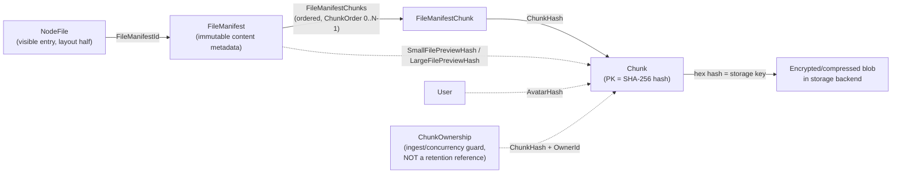
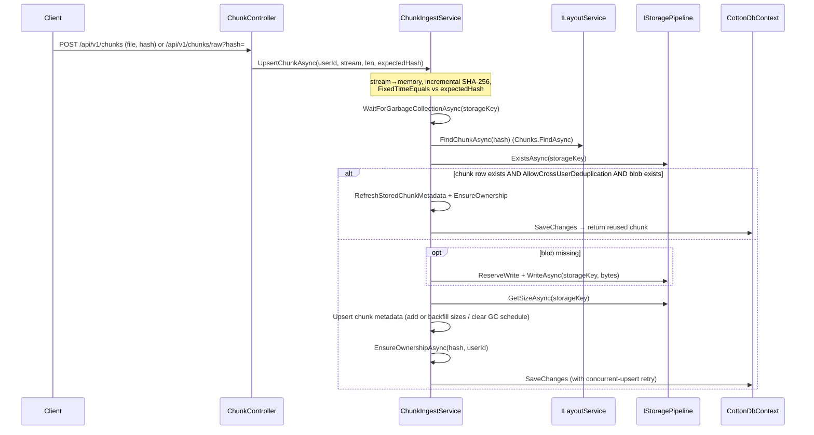
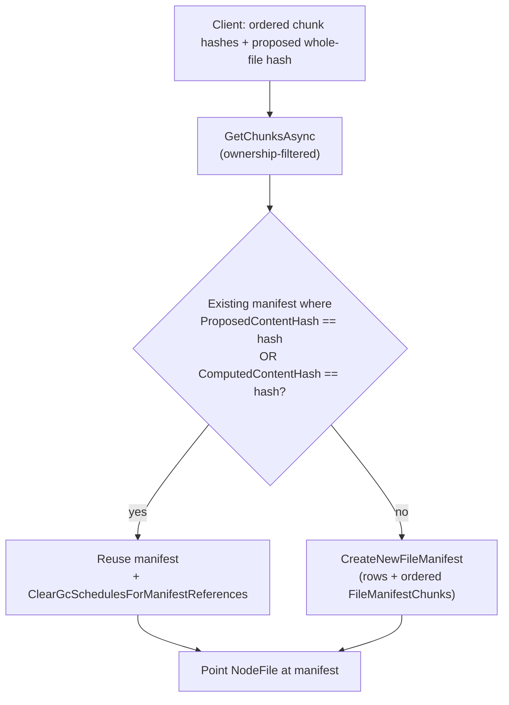

# 04. Content-Addressed Storage: Chunks, Manifests & Deduplication

Cotton's storage engine is split, git-style, into two halves: **content** ("what" is stored) and **layout** ("where" it appears in a user's tree). This section documents the content half — the deduplicated, content-addressed blob model. Every stored object is identified by the **SHA-256 hash of its plaintext bytes**, and that hash *is* the primary key. There are no surrogate identifiers for chunks, and there is no separate "dedup pass": deduplication is a structural property of the model, because two byte-identical chunks necessarily hash to the same key and therefore map to the same row and the same storage object. The layout half (`Layout`, `Node`, `NodeFile`) is covered in its own section; here we focus on `Chunk`, `FileManifest`, `FileManifestChunk`, `ChunkOwnership`, the services that ingest and account for them, and the **Storage Lifetime Contract** that defines exactly what keeps a stored object alive.

## Purpose & overview

A file in Cotton is never stored as a single blob. The client splits it into independent chunks (each at most the server chunk-size limit), uploads each chunk under its SHA-256 hash, and then submits an *ordered list of chunk hashes* to assemble a **file manifest**. The manifest is immutable content metadata; the visible file entry (`NodeFile`) merely points at a manifest via `FileManifestId`. This produces three properties that the rest of the system relies on:

- **Deduplication is intrinsic.** Identical bytes → identical hash → one `Chunk` row and one stored blob, regardless of how many files or users reference them. A manifest whose proposed (or computed) content hash already exists is reused rather than recreated.
- **Idempotent uploads.** Re-uploading an existing chunk does not duplicate storage; the `{hash}/exists` endpoint lets clients skip chunks they already own.
- **Content integrity is verifiable.** The chunk hash is recomputed on the server during ingest, and the whole-file hash is verified — out of band — against the assembled manifest, so a mismatch becomes an explicit operator/user event rather than silent corruption.

Because chunk identity is established on **plaintext** bytes *before* the storage pipeline compresses and encrypts them, dedup keeps working with encryption fully enabled — the server never needs semantic knowledge of "what the data is". The storage key written to the backend is the lowercase hex of the same SHA-256 hash (`Hasher.ToHexStringHash`), so the database key, the storage key, and the content identity are all the same value in different encodings.

## Key components & responsibilities

| Component | File | Responsibility |
| --- | --- | --- |
| `Chunk` | `src/Cotton.Database/Models/Chunk.cs` | One deduplicated stored blob, keyed by its content hash. |
| `FileManifest` | `src/Cotton.Database/Models/FileManifest.cs` | Immutable content of a file: ordered chunks, size, content type, preview hashes, proposed/computed content hashes. |
| `FileManifestChunk` | `src/Cotton.Database/Models/FileManifestChunk.cs` | Ordered mapping row linking a manifest to one chunk at a position. |
| `ChunkOwnership` | `src/Cotton.Database/Models/ChunkOwnership.cs` | Per-user "this user may reference this chunk" record used for proof-of-ownership during ingest/assembly. |
| `ChunkIngestService` | `src/Cotton.Server/Services/ChunkIngestService.cs` | Upserts chunks into storage + DB, verifies hashes, records ownership, handles concurrent-upsert races and cross-user dedup. |
| `FileManifestService` | `src/Cotton.Server/Services/FileManifestService.cs` | Resolves owned chunks by hash, creates new manifests, resolves content types, clears GC schedules for a manifest's references. |
| `ChunkUsageService` | `src/Cotton.Server/Services/ChunkUsageService.cs` | The authority on what a *live* reference is: referenced/unreferenced predicates, protected-storage-key resolution, GC-schedule clearing. |
| `FileManifestExtensions` | `src/Cotton.Server/Extensions/FileManifestExtensions.cs` | Helpers to extract ordered chunk hashes and per-chunk plain lengths from a manifest's chunk rows, with ordering/length validation. |
| `Hasher` | `src/Cotton.Server/Services/Hasher.cs` | Static SHA-256 helpers, hex<->bytes conversion, and validation of the 32-byte hash invariant. |
| `ChunkController` | `src/Cotton.Server/Controllers/ChunkController.cs` | HTTP surface: existence check + two upload endpoints. |
| `GarbageCollectorJob` | `src/Cotton.Server/Jobs/GarbageCollectorJob.cs` | Schedules and deletes unreferenced chunks and orphaned manifests, with a retention window and re-check before deletion. |
| `ComputeManifestHashesJob` | `src/Cotton.Server/Jobs/ComputeManifestHashesJob.cs` | Background verification: recomputes the assembled file hash and sets `ComputedContentHash` (or notifies on mismatch). |
| `StorageConsistencyJob` | `src/Cotton.Server/Jobs/StorageConsistencyJob.cs` | Reconciles DB chunks against the storage backend in both directions. |

## Entities and relationships

### Chunk — `chunks`

`Chunk` (`src/Cotton.Database/Models/Chunk.cs`) is the deduplicated unit. Its primary key is the raw content hash itself:

| Field | Column | Type | Notes |
| --- | --- | --- | --- |
| `Hash` | `hash` | `byte[]` | `[Key]` — the SHA-256 digest (32 bytes). The identifier *is* the content. |
| `PlainSizeBytes` | `plain_size_bytes` | `long` | Plaintext size before compression/encryption. |
| `StoredSizeBytes` | `stored_size_bytes` | `long` | Size of the blob actually written to the backend after pipeline processing. |
| `GCScheduledAfter` | `gc_scheduled_after` | `DateTime?` | UTC time after which an *unreferenced* chunk may be deleted; `null` means not scheduled. Indexed. |
| `CompressionAlgorithm` | `compression_algorithm` | `CompressionAlgorithm` | The algorithm used for this stored chunk. |

The class is annotated `[Index(nameof(GCScheduledAfter))]` so the GC sweep can find scheduled chunks cheaply. `CompressionAlgorithm` is the `EasyExtensions.Models.Enums.CompressionAlgorithm` enum; new chunks are created with `CompressionProcessor.Algorithm`, which is `CompressionAlgorithm.Zstd` (enum value `5`) per `src/Cotton.Storage/Processors/CompressionProcessor.cs`. (Compression and encryption belong to the storage pipeline — see the *Storage Pipeline & Cryptography* section.) Navigation collections `ChunkOwnerships` and `FileManifestChunks` mirror the two relationship tables. There is no `BaseEntity` here — `Chunk` is a plain class keyed solely on `Hash` (no `Id`, no timestamps).

### FileManifest — `file_manifests`

`FileManifest` (`src/Cotton.Database/Models/FileManifest.cs`) extends `BaseEntity<Guid>` and represents *immutable file content shared by one or more visible file entries*. The hash here is the hash of the **whole reassembled file**, not of an individual chunk.

| Field | Column | Type | Notes |
| --- | --- | --- | --- |
| `Id` | (base) | `Guid` | Surrogate PK (manifests, unlike chunks, are not keyed by their content hash). |
| `ComputedContentHash` | `computed_content_hash` | `byte[]?` | **Server-computed** whole-file SHA-256, set only after verification. Nullable until verified. Unique index. |
| `ProposedContentHash` | `proposed_content_hash` | `byte[]` | **Client-proposed** whole-file SHA-256. Required (non-null). Unique index. |
| `ContentType` | `content_type` (`citext`) | `string` | Resolved MIME type. |
| `SizeBytes` | `size_bytes` | `long` | Sum of the chunks' plain sizes (`chunks.Sum(x => x.PlainSizeBytes)`). |
| `SmallFilePreviewHashEncrypted` | `small_file_preview_hash_encrypted` | `byte[]?` | Encrypted storage hash for a privately-served small preview. **Not** a plain storage hash / not a live reference by itself. |
| `SmallFilePreviewHash` | `small_file_preview_hash` | `byte[]?` | Plain storage hash of the small preview chunk. Indexed. **Live reference.** |
| `LargeFilePreviewHash` | `large_file_preview_hash` | `byte[]?` | Plain storage hash of the large preview chunk. Indexed. **Live reference.** |
| `PreviewGenerationError` | `preview_generation_error` | `string?` | Last preview-generation error, if any. |
| `PreviewGeneratorVersion` | `preview_generator_version` | `int` | Generator version used for current previews; field default is `0`, and new manifests set it to `PreviewGeneratorProvider.DefaultGeneratorVersion` (which is also `0`). |

`PreviewTokenPrefix` is the constant `'f'`, and `GetPreviewHashEncryptedHex()` returns `null` when `SmallFilePreviewHashEncrypted` is null, otherwise the row-scoped public preview token: `'f'` + manifest `Id` (`"N"` format) + lowercase hex of `SmallFilePreviewHashEncrypted` (via `Convert.ToHexStringLower`). The four indexes (`ProposedContentHash` unique, `ComputedContentHash` unique, plus non-unique indexes on each preview hash) are what make the dedup/reuse lookups and the preview reference checks fast. Navigation collections are `NodeFiles` (visible entries that point here) and `FileManifestChunks` (the ordered chunk map).

### FileManifestChunk — `file_manifest_chunks`

`FileManifestChunk` (`src/Cotton.Database/Models/FileManifestChunk.cs`) extends `BaseEntity<Guid>` and is the ordered join between a manifest and its chunks:

| Field | Column | Notes |
| --- | --- | --- |
| `Id` | (base `Guid`) | Surrogate PK. |
| `FileManifestId` | `file_manifest_id` | The manifest this row belongs to. |
| `ChunkOrder` | `chunk_order` | `0..N-1` position within the manifest. |
| `ChunkHash` | `chunk_hash` | The referenced chunk's hash. Indexed. |
| `Chunk` (nav) | — | `[DeleteBehavior(DeleteBehavior.Restrict)]` — a chunk cannot be deleted while a manifest chunk references it. |
| `FileManifest` (nav) | — | `[DeleteBehavior(DeleteBehavior.Restrict)]`. |

Constraints: `[Index(nameof(ChunkHash))]` (reverse lookup chunk → manifests) and a **unique** `[Index(nameof(FileManifestId), nameof(ChunkOrder), IsUnique = true)]` guaranteeing exactly one chunk per ordinal position. The `Restrict` delete behaviors are the database-level enforcement of the lifetime contract: the GC must explicitly delete the manifest-chunk rows before it can delete a chunk; it cannot cascade through a live reference.

### ChunkOwnership — `chunk_ownerships`

`ChunkOwnership` (`src/Cotton.Database/Models/ChunkOwnership.cs`) extends `BaseOwnedEntity` (which carries `Id : Guid` and `OwnerId : Guid`). It links a user to a chunk hash:

| Field | Column | Notes |
| --- | --- | --- |
| `OwnerId` | (base) | User allowed to reference this chunk. |
| `ChunkHash` | `chunk_hash` | The chunk hash. |
| `Chunk` (nav) | — | `[DeleteBehavior(DeleteBehavior.Restrict)]`. |

Unique constraint: `[Index(nameof(OwnerId), nameof(ChunkHash), IsUnique = true)]` — one ownership row per `(user, chunk)`.

> **`ChunkOwnership` is an ingest / concurrency / proof-of-ownership guard — NOT a durable retention reference.** This is the single most important and most easily-misunderstood fact about the model. An ownership row says "this user is allowed to assemble a manifest from this chunk", and it stops a user from referencing a chunk they never uploaded by guessing its hash (`FileManifestService.GetChunksAsync` filters chunks by `ChunkOwnership` for the requesting user; `CheckChunkExists` reports existence only for owned chunks; `UpdateCurrentUserRequest.EnsureAvatarChunkReadableAsync` checks ownership before reusing an avatar chunk). It does **not** keep a chunk alive. `ChunkUsageService.WhereUnreferencedByDatabase` does not consider `ChunkOwnership` at all, and the garbage collector *deletes* `ChunkOwnership` rows for chunks it reclaims (`GarbageCollectorJob.DeleteEligibleBatchAsync` runs `ExecuteDeleteAsync` on `ChunkOwnerships` for the eligible hashes in the same transaction as the chunk delete). A chunk that has ownership rows but no live reference (no manifest chunk, no preview, no avatar, not protected) is fully GC-eligible.

## The Storage Lifetime Contract

Cotton treats the **database** as the source of truth for whether a storage object is alive. A raw blob that exists only in the storage backend is *not* considered live and is a candidate for reclamation. The authoritative definition of "live" lives in `ChunkUsageService` (`src/Cotton.Server/Services/ChunkUsageService.cs`), specifically `WhereReferencedByDatabase` / `WhereUnreferencedByDatabase` / `HasDatabaseReferencesAsync`. A chunk is **referenced (live)** if and only if any of the following holds:

| Live reference | Field / source | Where enforced |
| --- | --- | --- |
| File content | A `FileManifestChunk` row exists with `ChunkHash == c.Hash` (`c.FileManifestChunks.Any()`). | `ChunkUsageService` predicates. |
| Small preview | Some `FileManifest.SmallFilePreviewHash == c.Hash`. | `ChunkUsageService` predicates. |
| Large preview | Some `FileManifest.LargeFilePreviewHash == c.Hash`. | `ChunkUsageService` predicates. |
| User avatar | Some `User.AvatarHash == c.Hash`. | `ChunkUsageService` predicates. |

All three predicate methods (`WhereReferencedByDatabase`, `WhereUnreferencedByDatabase`, `HasDatabaseReferencesAsync`) check exactly the same four conditions — file-content chunks, the two preview hashes, and the avatar hash — so the live/dead boundary is consistent across the bulk-query and single-hash paths.

Two further categories are protected as **storage keys** rather than via the chunk-reference predicates, through `ChunkUsageService.GetProtectedStorageKeysAsync`:

| Protected artifact | Storage key | Source |
| --- | --- | --- |
| Latest DB backup pointer | `DatabaseBackupKeyProvider.GetScopedPointerStorageKey()` — `SHA-256("database.ctn:" + MasterEncryptionKey)` in hex. | `src/Cotton.Server/Services/DatabaseBackupKeyProvider.cs`. Always added. |
| Bootstrap master-key sentinel | `MasterKeySentinelStore.SentinelStorageKey` — `SHA-256("cotton.master-key.sentinel.v1")` in hex. | `src/Cotton.Server/Services/MasterKeySentinelStore.cs`. Always added. |
| Latest DB backup manifest | `latestBackup.ManifestStorageKey`. | Resolved from `IDatabaseBackupManifestService.TryGetLatestManifestAsync` *only if the pointer object exists in storage*. |
| Chunks listed by the latest backup manifest | `latestBackup.Manifest.Chunks[*].StorageKey` (each non-blank key). | Same. |

`GetProtectedStorageKeysAsync` is deliberately fail-safe: it always seeds the set with the pointer storage key and the sentinel storage key; if the backup pointer object exists in storage but the latest manifest cannot be resolved (`TryGetLatestManifestAsync` returns `null`), it throws `InvalidOperationException` and **aborts garbage collection entirely** rather than risk deleting backup data. Protected keys that happen to be valid 32-byte hex (i.e., genuine chunk hashes) are converted back to `Chunk.Hash` values by the private `GetChunkHashesFromStorageKeys` (which calls `Hasher.FromHexStringHash` and silently skips keys that throw `ArgumentException`); this is used both to *clear* GC schedules for protected chunks and to *exclude* them from scheduling. The pointer and sentinel logical keys are themselves SHA-256 digests rendered as hex, so they convert cleanly. Any storage key that is not valid 32-byte hex cannot map to a `Chunk.Hash` and so is protected only at the storage-key comparison layer, never at the chunk-hash layer.

> Note the asymmetry the field names hint at: `FileManifest.SmallFilePreviewHash` (and `LargeFilePreviewHash`) and `User.AvatarHash` are **plain storage hashes** and are live references. Their `*Encrypted` siblings — `FileManifest.SmallFilePreviewHashEncrypted`, `User.AvatarHashEncrypted` — are encrypted public tokens used to build preview/avatar URLs without leaking content hashes, and are **not** treated as live references by `ChunkUsageService`. Only the plain-hash columns keep a chunk alive. (`LargeFilePreviewHash` has no encrypted sibling — only the small preview and the avatar do.)

### The rule for new storage-backed features

> Any feature that writes or reuses a stored chunk **must register a live reference the database can see** before relying on that object surviving GC. Concretely: either write the data through the normal chunk/manifest flow (so a `FileManifestChunk` exists), or add an explicit reference column / protection path that `ChunkUsageService` is taught to recognize (a new clause in `WhereReferencedByDatabase`, `WhereUnreferencedByDatabase`, **and** `HasDatabaseReferencesAsync` — all three must agree, or a new entry in `GetProtectedStorageKeysAsync`). If the GC predicates cannot see the reference, the object is eligible for reclaim once the retention window elapses — **even if `ChunkOwnership` rows exist for it.**

## How it works — ingest

`ChunkIngestService` (`src/Cotton.Server/Services/ChunkIngestService.cs`, exposed via `IChunkIngestService`) is the only sanctioned way chunks enter the system. It offers three public `UpsertChunkAsync` overloads:

1. `(userId, byte[] buffer, int length, ct)` — hashes the buffer itself with `SHA256.HashData(buffer.AsSpan(0, length))`.
2. `(userId, Stream stream, long length, byte[] expectedHash, ct)` — streams into memory while incrementally hashing (`IncrementalHash`, 128 KiB rented buffer), enforces the exact length, and verifies the computed hash against `expectedHash` with `CryptographicOperations.FixedTimeEquals`. An `expectedHash` whose length is not `SHA256.HashSizeInBytes` (32) is rejected with `ArgumentException`; a stream length other than the declared `length` throws `InvalidOperationException("Unexpected stream length.")`; a hash mismatch throws `InvalidDataException("Hash mismatch: ...")`.
3. `(userId, Stream stream, long length, ct)` — for callers without a hash (used by the DB-dump job); copies to memory, checks the length, then delegates to overload (1).

All three converge on the private `UpsertChunkAsync(userId, buffer, length, chunkHash, ct)`:

Step-by-step in the private `UpsertChunkAsync`:

1. **Compute storage key.** `storageKey = Hasher.ToHexStringHash(chunkHash)`.
2. **Wait out GC.** `WaitForGarbageCollectionAsync` polls `GarbageCollectorJob.IsChunkBeingDeleted(storageKey)` every `GcWaitStepMs` (100 ms) up to `GcWaitMaxMs` (30 s). If the chunk is *still* mid-deletion after the timeout, it throws `InvalidOperationException("...currently being garbage collected. Please retry.")` — closing the race where ingest and GC touch the same hash concurrently.
3. **Look up existing state.** `_layouts.FindChunkAsync(chunkHash)` (which is just `_dbContext.Chunks.FindAsync(hash)` in `src/Cotton.Topology/StorageLayoutService.cs`) and `_storage.ExistsAsync(storageKey)`.
4. **Cross-user dedup fast path** (`TryReuseDeduplicatedChunkAsync`): if a chunk row exists **and** `settings.AllowCrossUserDeduplication` is true **and** the blob exists in storage, the service refreshes metadata (fills `StoredSizeBytes` if `<= 0`, clears any `GCScheduledAfter`), ensures an ownership row, saves, and returns — no write, no new metadata. When `AllowCrossUserDeduplication` is **false** (the default — see `SettingsProvider`), this path is skipped, so a second user re-uploads/re-verifies even if the blob already exists. (Storage stays deduped either way because the blob is keyed by content; the toggle governs whether one user's upload may *satisfy* another user's upload without re-transfer.)
5. **Write blob if missing.** `WriteChunkAsync` reserves write space via `StoragePressureGuard.ReserveWriteAsync(length)` (throws `StoragePressureException` if free space is below the configured reserve), writes the bytes through the pipeline with a default `PipelineContext`, and commits the reservation.
6. **Upsert metadata.** `UpsertChunkMetadataAsync` either adds a new `Chunk` (`AddChunkMetadataAsync` with `CompressionAlgorithm = CompressionProcessor.Algorithm`) or updates an existing one (`UpdateChunkMetadata`): it clears `GCScheduledAfter` and backfills `PlainSizeBytes`/`StoredSizeBytes` only via the `SetPlainSizeIfMissing`/`SetStoredSizeIfMissing` guards (i.e. only while they are still `<= 0`). Sizes are never *overwritten* once positive — important because the consistency job may have already registered the row with backend size.
7. **Ensure ownership.** `EnsureOwnershipAsync` adds a `ChunkOwnership { ChunkHash, OwnerId }` only if one does not already exist for `(userId, chunkHash)`.
8. **Persist with race handling.** `SaveChunkUpsertAsync` catches `DbUpdateException` whose inner `PostgresException` is a `UniqueViolation` on table `chunks` or `chunk_ownerships` (`IsConcurrentChunkUpsertConflict`). On conflict it detaches the pending `Added` entities (`DetachPendingChunkUpsert`, matching by `Hash.SequenceEqual` / `(OwnerId, ChunkHash)`), reloads the now-committed chunk (`LoadExistingChunkAsync`, throwing `InvalidOperationException` if it truly cannot be found), re-ensures ownership, and saves again (a second `UniqueViolation` on the ownership re-save is swallowed and the existing chunk is returned). This makes concurrent uploads of the same chunk safe and convergent.

The endpoints are in `ChunkController` (`src/Cotton.Server/Controllers/ChunkController.cs`); all require `[Authorize]` and use `Routes.V1.Chunks` (`"/api/v1/chunks"`, defined in `src/Cotton.Shared/Routes.cs`):

| Method + route | Purpose |
| --- | --- |
| `GET /api/v1/chunks/{hash}/exists` (`CheckChunkExists`) | Validates the hash (`Hasher.FromHexStringHash` + 32-byte check); returns `Ok(true)` only if the caller has a `ChunkOwnership` row **and** the blob exists in storage, otherwise `Ok(false)`. Lets clients skip re-upload. |
| `POST /api/v1/chunks` (`UploadChunk`, multipart `IFormFile file` + `string hash`) | Rejects empty file; validates size against `MaxChunkSizeBytes`, parses/validates the hash, calls overload (2). `[RequestSizeLimit(AesGcmStreamCipher.MaxChunkSize + ushort.MaxValue)]`. |
| `POST /api/v1/chunks/raw` (`UploadRawChunk`, `[FromQuery] string hash`, body = `Request.Body`) | Same validation without multipart parsing, using `Request.ContentLength`; `[RequestSizeLimit(AesGcmStreamCipher.MaxChunkSize)]` (64 MiB). |

Both upload endpoints translate `InvalidDataException` → 400 (`CottonResult.BadRequest`) and `StoragePressureException` → `StatusCode(507, ...)`, log the stored size at debug level, fire `PerfTracker.OnChunkCreated()`, and return `Created()`. Note `MaxChunkSizeBytes` (the configurable per-chunk cap, default `4 * 1024 * 1024` = 4 MiB per `SettingsProvider.defaultMaxChunkSizeBytes`) is enforced *separately* from the framework `RequestSizeLimit` (which is anchored to `AesGcmStreamCipher.MaxChunkSize` = 64 MiB). The `CheckChunkExists`/`UploadChunk` pairing is precisely the proof-of-ownership use of `ChunkOwnership`: existence is reported per-user so one user cannot probe whether *another* user's content exists.

> **Gotcha — `UploadChunk` rejects empty files.** `UploadChunk` and `UploadRawChunk` both reject a zero-length body (`file.Length == 0` / `contentLength <= 0`). Empty content is therefore never ingested through the HTTP endpoints; the canonical zero-length chunk (hash `Hasher.ZeroHashHexString`) is created only by the internal stream overloads (DB-dump / WebDAV paths) and special-cased by `StorageConsistencyJob`.

## How it works — manifest assembly, dedup & reuse

Manifests are reused or created at three call sites, each of which performs the dedup lookup locally and then delegates manifest creation to `FileManifestService` (`src/Cotton.Server/Services/FileManifestService.cs`):

- `CreateFileRequestHandler.GetOrCreateFileManifestAsync` (`src/Cotton.Server/Handlers/Files/CreateFileRequest.cs`) — the primary "assemble file at node" path.
- `FileController.ResolveUpdateManifestAsync` (`src/Cotton.Server/Controllers/FileController.cs`) — updating a file's content.
- `WebDavPutFileRequest.GetOrCreateFileManifestAsync` (`src/Cotton.Server/Handlers/WebDav/WebDavPutFileRequest.cs`) — WebDAV PUT.

The common flow (illustrated with `CreateFileRequestHandler`):

1. **Resolve owned chunks.** `FileManifestService.GetChunksAsync(chunkHashes, userId)` normalizes hex hashes to bytes (`Hasher.FromHexStringHash`), loads only chunks where a `ChunkOwnership` row exists for the requesting user, and rebuilds the list in the *caller's order* (case-insensitive hash map). A hash the user does not own (or that does not exist) raises `EntityNotFoundException(nameof(Chunk))`. This is where ownership gates manifest assembly.
2. **Dedup lookup.** At the call site: `_dbContext.FileManifests.FirstOrDefaultAsync(x => x.ComputedContentHash == proposedHash || x.ProposedContentHash == proposedHash)`. The proposed hash is the client's whole-file SHA-256 (`Hasher.FromHexStringHash(request.Hash)`). A match on *either* the verified or the proposed hash means the content already exists — the existing manifest is **reused**, and no new `FileManifest`/`FileManifestChunk` rows are created.
3. **Revive references on reuse.** On reuse, `FileManifestService.ClearGcSchedulesForManifestReferencesAsync(fileManifest.Id)` clears `GCScheduledAfter` on every chunk reachable from that manifest (its `FileManifestChunk` chunks **and** its `SmallFilePreviewHash`/`LargeFilePreviewHash`) in a single `ExecuteUpdate`, so a manifest that was about to be GC'd becomes live again the instant it is reused. `CreateFileRequestHandler` additionally drops a stale `SmallFilePreviewHashEncrypted` and `PreviewGenerationError` (and saves) when `AllowCrossUserDeduplication` is off and either is non-null, so a reusing user does not inherit another tenant's encrypted preview token.
4. **Create if new.** `FileManifestService.CreateNewFileManifestAsync(chunks, fileName, contentType, proposedContentHash)` builds the manifest (`SizeBytes = chunks.Sum(x => x.PlainSizeBytes)`, `ContentType = ResolveContentType(fileName, contentType)`, `PreviewGeneratorVersion = PreviewGeneratorProvider.DefaultGeneratorVersion`), then adds one `FileManifestChunk` per chunk with `ChunkOrder = i` and the chunk's navigation set, clearing each chunk's `GCScheduledAfter` along the way, and saves. `ComputedContentHash` is intentionally left `null` here — it is filled only after verification.

### ProposedContentHash vs ComputedContentHash

These two fields encode an explicit **trust-but-verify** model for whole-file integrity:

- **`ProposedContentHash`** is supplied by the client and is mandatory. It is used immediately for dedup/reuse and is the value surfaced as the file's strong ETag (`"sha256-<hex>"`, e.g. `EntityTagHeaderValue.Parse($"\"sha256-{Hasher.ToHexStringHash(nodeFile.FileManifest.ProposedContentHash)}\"")` in `FileController` and `LayoutController`).
- **`ComputedContentHash`** is set by the **server** only after it independently reassembles the file from the stored chunks and hashes it. It is `null` until that succeeds and the result matches the proposal.

Two paths set it:

- **Synchronous (opt-in):** `CreateFileRequestHandler.ValidateContentHashIfRequestedAsync` runs when `request.Validate` is set and `ComputedContentHash` is still null. It builds a blob stream from the ordered chunk hashes (`_storage.GetBlobStream(hashes, new PipelineContext { FileSizeBytes = fileManifest.SizeBytes })`, where `GetBlobStream` is the extension in `src/Cotton.Storage/Extensions/StoragePipelineExtensions.cs`), hashes it (`Hasher.HashData(stream)`), and on match sets `ComputedContentHash`; on mismatch it throws `BadRequestException("File content hash does not match the provided hash.")` (the file create fails).
- **Asynchronous (default):** `ComputeManifestHashesJob` (`[JobTrigger(hours: 1)]`) takes up to `MaxItemsPerRun` (1000) manifests where `ComputedContentHash == null`, reassembles each from `manifest.FileManifestChunks.GetChunkHashes()`, and compares. On match it sets `ComputedContentHash`; on **mismatch** it does *not* fix anything — it sends `SendUploadHashMismatchNotificationAsync` to the owner of every `NodeFile` pointing at the bad manifest, surfacing corruption as a visible event. The job returns immediately if an upload is in progress or it is night time (`PerfTracker.IsUploading()` / `IsNightTime()`), and between items it yields 60 s when `IsPreviewGenerating()`/`IsUploading()` and 250 ms otherwise.

Because the unique index on `ComputedContentHash` and the dedup `OR` both treat the two hashes interchangeably, a verified manifest and an as-yet-unverified manifest with the same content collapse onto the same content the moment either hash matches a new upload's proposal.

### Helper extensions

`FileManifestExtensions` (`src/Cotton.Server/Extensions/FileManifestExtensions.cs`) turns a collection of `FileManifestChunk` into the inputs the storage pipeline needs, with validation:

- `GetChunkHashes()` orders by `ChunkOrder`, converts each `ChunkHash` to hex, and **fails fast** with `ArgumentException` if the ordinals are non-contiguous or missing (the running invariant `lastOrder + 1 != chunk.ChunkOrder`) — protecting reassembly from gapped manifests.
- `GetChunkLengths()` returns a case-insensitive `hash → PlainSizeBytes` map (requires the `Chunk` navigation to be loaded; throws `ArgumentNullException` if `Chunk` or `ChunkHash` is null) and throws `InvalidOperationException` if the same hash appears with conflicting lengths.

## Garbage collection & the retention window

`GarbageCollectorJob` (`src/Cotton.Server/Jobs/GarbageCollectorJob.cs`, `[JobTrigger(hours: 6)]`, `[DisallowConcurrentExecution]`) is the consumer of the lifetime contract. On the first run it waits 15 minutes for the server to stabilize, and it skips entirely during night time unless `StorageSpaceMode == Limited` (aggressive mode). `RunOnceAsync` first resolves the protected storage keys (`GetProtectedStorageKeysAsync`) — so if backups cannot be safely resolved, GC aborts before deleting anything — then performs four passes in order:

1. **Delete orphaned manifests** (`DeleteOrphanedManifestsAsync`): manifests with no `NodeFiles` are taken in batches of `ManifestBatchSize` (1000) inside a transaction that first `ExecuteDelete`s dependent `DownloadTokens` and `FileManifestChunks`, then the manifests — but the manifest delete re-asserts `!fm.NodeFiles.Any()` and, if `deletedManifests != manifestIds.Count`, **rolls back** (handling the race where a `NodeFile` is created concurrently). A `DbUpdateException` also rolls back. Removing the `FileManifestChunk` rows is what later makes the underlying chunks GC-eligible.
2. **Clear schedules for live/protected chunks** (`ClearSchedulesForReferencedChunksAsync` → `ChunkUsageService.ClearGcSchedulesForReferencedChunksAsync` + `ClearGcSchedulesForProtectedChunksAsync`).
3. **Schedule orphaned chunks** (`ScheduleOrphanedChunksAsync`): chunks matching `WhereUnreferencedByDatabase` **and** `WhereNotProtectedByStorageKeys` **and** `GCScheduledAfter == null` get a `GCScheduledAfter = now + delay`, in inner batches of `ScheduleInnerBatchSize` (2000) up to the run's `batchSize`. The **retention window** depends on `StorageSpaceMode` (see table below).
4. **Delete scheduled chunks** (`DeleteScheduledChunksAsync` / `DeleteEligibleBatchAsync`): for chunks whose `GCScheduledAfter <= now`, it reserves each hash in the static `CurrentlyDeletingChunks` set (`ConcurrentDictionary`, the thing `ChunkIngestService.WaitForGarbageCollectionAsync` observes), waits 5 seconds, then per inner batch of `DeleteInnerBatchSize` (500) **re-checks** that each chunk is still scheduled and still unreferenced (`WhereReferencedByDatabase`) and not protected, clears the schedule on any that became referenced, deletes `ChunkOwnership` + `Chunk` rows for the eligible hashes in a transaction, and only then deletes the blobs from storage (`Parallel.ForEachAsync`, parallelism `StorageDeleteConcurrency` = 8). Any hash that turns out to be protected has its schedule cleared instead of being deleted.

The retention window and the run's `batchSize` both key off `StorageSpaceMode` (`src/Cotton.Database/Models/Enums`; default `Optimal` per `SettingsProvider`):

| `StorageSpaceMode` | Schedule delay (`deleteAfter`) | Per-run `batchSize` |
| --- | --- | --- |
| `Limited` | `now + 1 day` | `MaxChunkBatchSize` (100000) |
| `Optimal` | `now + ChunkGcDelayDays` (7 days) | `(MinChunkBatchSize + MaxChunkBatchSize) / 2` (~50500) |
| `Unlimited` | `now + ChunkGcDelayDays * 4` (28 days) | `MinChunkBatchSize` (1000) |

The design is deliberately conservative: orphaned content is scheduled, re-checked before deletion, and left alone (schedule cleared) if it becomes live again between scheduling and deletion. The `DeleteBehavior.Restrict` navigations, the 5-second pre-delete delay, the `CurrentlyDeletingChunks` reservation, and the re-check together prevent deleting a chunk that just gained a reference or that an in-flight ingest is about to reuse.

## Storage ↔ DB reconciliation

`StorageConsistencyJob` (`src/Cotton.Server/Jobs/StorageConsistencyJob.cs`, `[JobTrigger(days: 30)]`) reconciles both directions after a 5-minute startup delay, streaming DB chunk hashes and batching only orphan registrations:

- **DB chunk missing from storage** (`HandleMissingChunkAsync`): it computes three independent flags — `referencedByFileData` (a `FileManifestChunk` row), `referencedByPreview` (a manifest preview hash), `referencedByAvatar` (a user avatar). If referenced by previews, it nulls the matching `SmallFilePreviewHash`/`SmallFilePreviewHashEncrypted` and/or `LargeFilePreviewHash` on each affected manifest; if referenced by an avatar, it nulls `User.AvatarHash`/`AvatarHashEncrypted`; and *independently*, if referenced by **file data** it deletes nothing and instead notifies each affected owner once (`SendStorageChunkMissingNotificationAsync`). A chunk can hit more than one branch. It double-checks `_storage.ExistsAsync` before acting, to avoid reacting to listing races.
- **Storage key not tracked in DB** (`RegisterOrphanedStorageKeysAsync`): after `ExceptWith(GetProtectedStorageKeysAsync(...))`, each remaining valid-hex key (others are logged and skipped) that has no `Chunk` row is inserted as a `Chunk` with `PlainSizeBytes = StoredSizeBytes = GetSizeAsync`, `CompressionAlgorithm = CompressionProcessor.Algorithm`, and `GCScheduledAfter = now + 1 day` so the GC can reclaim it — the mechanism by which "a raw object that only exists in the storage backend" is brought under the contract. A non-empty key reporting size 0 (any key other than the canonical empty-content hash `Hasher.ZeroHashHexString`) throws `InvalidOperationException` and aborts the job to avoid data loss.

## Concurrency, failure modes & security considerations

- **Hash is verified server-side.** Upload overload (2) recomputes SHA-256 incrementally and compares with `CryptographicOperations.FixedTimeEquals`; a client cannot store bytes under a hash they do not match. `Hasher.FromHexStringHash` enforces a non-empty, even-length, 32-byte, hex-only string (and rejects strings longer than 128 chars) before anything else runs.
- **Cross-tenant isolation via ownership.** `GetChunksAsync` and `CheckChunkExists` are scoped by `OwnerId`, so a user cannot reference or even probe for chunks they have not legitimately uploaded — content addressing alone would otherwise let anyone reference any chunk by guessing its hash. `AllowCrossUserDeduplication` only changes whether an *existing* blob may satisfy another user's upload without re-transfer; it never bypasses the ownership check on manifest assembly.
- **Ingest/GC race** is handled on both sides: ingest waits out `CurrentlyDeletingChunks` (up to 30 s, then asks the client to retry); GC reserves the hash, re-checks references, and uses `DeleteBehavior.Restrict` plus the 5-second delay to avoid deleting a chunk that just gained a reference.
- **Concurrent identical uploads** converge through the `UniqueViolation` retry in `SaveChunkUpsertAsync` rather than failing.
- **Backups are never collateral damage.** `GetProtectedStorageKeysAsync` aborts GC (throws) if the backup pointer exists but its manifest cannot be resolved; the master-key sentinel and backup pointer storage keys are always protected.
- **`DeleteBehavior.Restrict` everywhere on chunk navigations** means deletion order is explicit and enforced by the database — the GC must dismantle references first, and an accidental cascade cannot silently orphan stored content.

## Non-obvious design decisions & gotchas

- **`ChunkOwnership` does not retain.** Repeating because it bites: ownership rows are dropped by the GC alongside the chunk and are ignored by all three reference predicates. Never add a feature that "keeps a chunk" by inserting a `ChunkOwnership` row.
- **Only the *plain* hash columns are live references.** The `*Encrypted` preview/avatar columns are URL tokens, not references. A preview chunk kept alive *only* via the encrypted token would be GC'd. (The large preview has no encrypted column at all.)
- **All three reference predicates must stay in sync.** `WhereReferencedByDatabase`, `WhereUnreferencedByDatabase`, and `HasDatabaseReferencesAsync` each enumerate the same four live-reference conditions independently; adding a reference type means editing all three.
- **`ComputedContentHash` lagging behind is normal.** By default verification is asynchronous and hourly; a freshly created manifest will have `ComputedContentHash == null` for a while. Dedup still works because the lookup also matches `ProposedContentHash`.
- **Sizes are backfilled, never overwritten when positive.** `SetPlainSizeIfMissing`/`SetStoredSizeIfMissing` guards prevent the ingest path from clobbering sizes the consistency job recorded from the backend.
- **Manifest `SizeBytes` is the sum of *plain* chunk sizes**, not stored (post-compression) bytes — it reflects logical file size and feeds quota accounting (`UserStorageQuotaService`).
- **The empty file is the canonical zero-hash chunk.** `Hasher.ZeroHashHexString` (`e3b0c44298fc1c149afbf4c8996fb92427ae41e4649b934ca495991b7852b855`) is the SHA-256 of empty input; the HTTP upload endpoints reject empty bodies, so the zero-length chunk is produced only by the internal stream overloads, and the consistency job special-cases it so a legitimately empty blob is not treated as corruption.

## Related sections

- *Layout Model: Layouts, Nodes & NodeFiles* — the "where" half that points `NodeFile.FileManifestId` at manifests.
- *Storage Pipeline & Cryptography* — `IStoragePipeline`, compression (`CompressionProcessor`, Zstd), AES-GCM (`AesGcmStreamCipher`), `GetBlobStream`, `StoragePressureGuard`.
- *Background Jobs & Maintenance* — `GarbageCollectorJob`, `ComputeManifestHashesJob`, `StorageConsistencyJob` schedules and `StorageSpaceMode` behavior.
- *Previews* — how `SmallFilePreviewHash`/`LargeFilePreviewHash` and their encrypted tokens are produced and served.
- *Database Backup & Restore* — the protected pointer/manifest/chunk artifacts that GC must never reclaim.
- *Master Key & Encryption Bootstrap* — the master-key sentinel that anchors the protected-key set.
