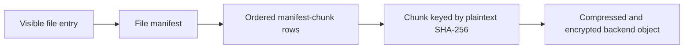

# 04. Content-Addressed Storage

Cotton stores file content as immutable manifests over ordered, content-addressed chunks. Chunk identity is the SHA-256 hash of plaintext bytes, so identical bytes naturally resolve to the same database row and backend object.

## Content model

```mermaid
flowchart LR
    Entry["Visible file entry"] --> Manifest["File manifest"]
    Manifest --> Order["Ordered manifest-chunk rows"]
    Order --> Chunk["Chunk keyed by plaintext SHA-256"]
    Chunk --> Object["Compressed and encrypted backend object"]
```

- A chunk records its plaintext length, stored length, compression algorithm, and optional GC schedule.
- A manifest records whole-file metadata and an ordered sequence of chunks.
- A visible file entry points to a manifest; it does not own storage bytes directly.
- The client proposes a whole-file hash and the server computes an authoritative hash asynchronously.

The backend storage key is derived from the chunk hash. Compression and encryption do not change content identity because hashing occurs before the storage pipeline.

## Ingest and deduplication

Chunk ingest:

1. validates the declared length and SHA-256 hash;
2. coordinates with garbage collection for the same storage key;
3. checks existing database and backend state;
4. writes missing bytes through the storage pipeline;
5. records authoritative plaintext and stored sizes;
6. grants the uploading user permission to reference the chunk;
7. resolves concurrent inserts as reuse rather than duplicate storage.

Manifest creation accepts an ordered list of chunk hashes only after proving that the user may reference every chunk. Reusing a known chunk hash without ownership proof is forbidden even when cross-user deduplication is enabled.

## Ownership is not retention

Chunk ownership proves that a user may assemble a manifest from a chunk. It does not keep the chunk alive indefinitely.

A chunk is retained by database references from:

- manifest content;
- small or large previews;
- user avatars.

Encrypted public tokens for previews or avatars are not storage references. Their corresponding plain hash fields are the references that protect objects from reclamation.

The master-key sentinel and current database-backup objects are protected through reserved storage keys rather than ordinary file references.

## Storage lifetime contract

The database is authoritative for liveness. A backend object with no recognized database or protected-key reference is reclaimable after the configured retention period.

Any feature that stores an object must do one of the following before relying on it:

- create a normal manifest/preview/avatar reference; or
- register the key with the protected-storage mechanism.

Adding a write path without adding a visible liveness reference is a correctness bug: garbage collection is allowed to delete that object.

## Verification and consistency

- Chunk hashes are verified synchronously during ingest.
- Whole-file hashes are recomputed from manifest content in the background.
- A proposed/computed hash mismatch is persisted as an integrity failure and reported; it is not silently accepted.
- Storage consistency maintenance detects database rows without objects and untracked backend objects.
- Stored sizes come from the backend after a successful write and are recorded on every current ingest path.

## Concurrency invariants

- Only one durable object exists for one chunk hash.
- Concurrent uploads of the same bytes converge on the same chunk.
- Ingest waits for deletion of the same object instead of racing it.
- GC rechecks liveness immediately before deletion.
- Restrictive foreign keys prevent a referenced chunk from disappearing through cascade deletion.

## Related sections

- [Upload and file lifecycle](09-upload-file-lifecycle.md)
- [Garbage collection](10-garbage-collection.md)
- [Storage pipeline](06-storage-pipeline.md)
- [Database backup and restore](21-database-backup-restore.md)
