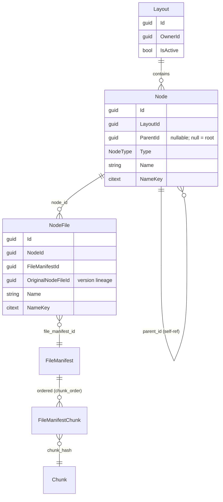
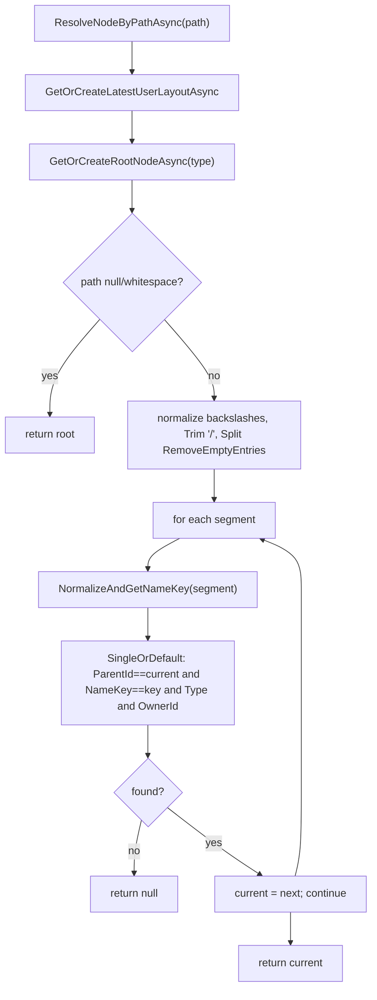
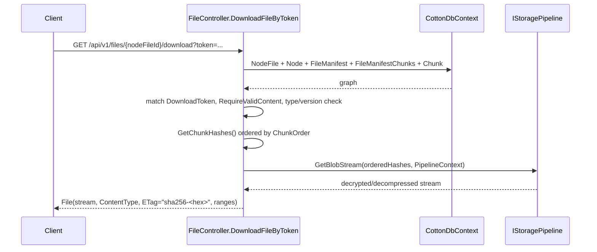
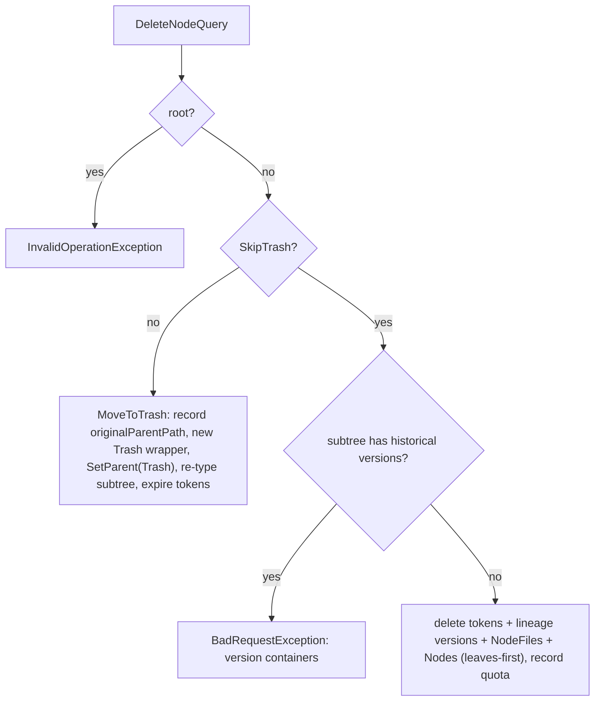

# 05. Logical Filesystem: Layouts, Nodes & Topology

The logical filesystem is the half of Cotton Cloud that answers *"where does a file live and what is it called"*, deliberately kept separate from the content-addressed storage that answers *"what bytes does it contain"*. A user never owns "files on disk"; they own one or more **layout trees** made of **nodes** (folders) and **node files** (named entries) that point at immutable `FileManifest` rows, which in turn reference ordered, deduplicated, encrypted chunks. This section documents the layout/topology data model (`Layout`, `Node`, `NodeFile`, `NodeType`), the `Cotton.Topology` services that resolve and create layout structure, the server-side support services (`LayoutPathResolver`, `LayoutLocks`, `NodeSubtreeService`, `NodeFileHistoryService`, `TrashRestoreCoordinator`), the mediator handlers that mutate the tree, and the end-to-end resolution from a logical path down to chunk bytes. For the content half, see the *Content-Addressed Storage: Chunks, Manifests & Deduplication* section; for how chunk bytes are streamed and decrypted, see the *Storage Pipeline & Backends* and *Cryptography Engine* sections.

> README reality check: the README (`README.md`, lines 409–418) advertises layouts as supporting "mounts, projections, and restore points", "the same content can be mounted in multiple places with no duplication", and "restoring a layout is an atomic switch rather than a bulk copy" (and elsewhere "one-action large-layout rollback", line 110, and "snapshotting, and remounting", line 158). In the actual code, content *deduplication* is real (many `NodeFile` rows can share one `FileManifest`, so identical bytes appear in many places at no extra storage cost), but **there is no mount/projection mechanism, no layout-snapshot or restore-point switching, and no atomic whole-layout rollback**. A user has exactly one *active* `Layout` at a time, and "restore" means restoring individual nodes/files out of the Trash subtree. Those broader capabilities are aspirational/roadmap; this document describes what the code does.

## Purpose & overview

Cotton models a user's namespace as a graph of typed nodes rather than as path strings stored on entities. The benefits the code actually realizes:

- **Structural navigation.** Listing, moving, renaming, and ancestor/descendant queries are parent-pointer walks and indexed lookups, not string surgery (`src/Cotton.Topology/LayoutNavigator.cs`).
- **Content/namespace separation.** A `NodeFile` is just a *name in a folder* that references a `FileManifest`; identical content uploaded twice or moved/copied is one manifest referenced by multiple `NodeFile` rows.
- **Collision safety across case and Unicode form.** Every name carries a derived `NameKey` (a `citext`, case- and diacritic-folded key) so `Report.txt`, `report.txt`, and `RÉPORT.txt` collide deterministically.
- **A single tree per user split by `NodeType`.** Within one `Layout`, the `Default` subtree is the visible filesystem and the `Trash` subtree holds deleted items and historical file versions.

## Key components & responsibilities

### Entities (`Cotton.Database`)

| Type | File | Table | Role |
|------|------|-------|------|
| `Layout` | `src/Cotton.Database/Models/Layout.cs` | `layouts` | One user-owned tree container. Holds `IsActive` and a collection of `Node`s. |
| `Node` | `src/Cotton.Database/Models/Node.cs` | `nodes` | A folder-like node. Self-referential via `ParentId`; root nodes have `ParentId == null`. |
| `NodeFile` | `src/Cotton.Database/Models/NodeFile.cs` | `node_files` | A named file entry inside a node, pointing at a `FileManifest`. Also used to store historical versions. |
| `NodeType` | `src/Cotton.Database/Models/Enums/NodeType.cs` | — | Discriminator: `Default = 0`, `Trash = 1`. |
| `FileManifest` | `src/Cotton.Database/Models/FileManifest.cs` | `file_manifests` | Immutable content descriptor; the join point between namespace and storage. |
| `FileManifestChunk` | `src/Cotton.Database/Models/FileManifestChunk.cs` | `file_manifest_chunks` | Ordered manifest→chunk mapping (`ChunkOrder`, 0..N-1). |
| `Chunk` | `src/Cotton.Database/Models/Chunk.cs` | `chunks` | One deduplicated encrypted stored chunk, keyed by `Hash`. |

`Layout`, `Node`, and `NodeFile` all derive from `BaseOwnedEntity` (`src/Cotton.Database/Abstractions/BaseOwnedEntity.cs`), which adds `OwnerId` (and an `Owner` navigation) on top of `BaseEntity<Guid>` (from `EasyExtensions.EntityFrameworkCore.Abstractions`), which supplies `Id` (a `Guid`, protected setter), `CreatedAt`, and `UpdatedAt` (UTC, audited through `IAuditableEntity`). `Chunk` is the exception: it does **not** derive from `BaseEntity` and has no surrogate `Id`/timestamps — it is keyed directly by its content `Hash`. Ownership (`OwnerId`) appears in essentially every query in this subsystem and is the primary tenancy boundary.

### Topology services (`Cotton.Topology`)

| Type | File | Role |
|------|------|------|
| `ILayoutService` / `StorageLayoutService` | `src/Cotton.Topology/Abstractions/ILayoutService.cs`, `src/Cotton.Topology/StorageLayoutService.cs` | Creates/retrieves the active `Layout`, root nodes per `NodeType`, trash containers; finds chunks by hash. |
| `ILayoutNavigator` / `LayoutNavigator` | `src/Cotton.Topology/Abstractions/ILayoutNavigator.cs`, `src/Cotton.Topology/LayoutNavigator.cs` | Resolves slash-paths to nodes and reconstructs display paths from a node. The production path resolver. |
| `ITopologyDatabaseProvider` | `src/Cotton.Topology/Abstractions/ITopologyDatabaseProvider.cs` | Empty marker interface (doc-commented "Marker for services that provide topology database access") — **not implemented or referenced anywhere** in the codebase (dead/forward-looking abstraction; see *Non-obvious design decisions & gotchas*). |

### Server-side support (`Cotton.Server`)

| Type | File | Role |
|------|------|------|
| `LayoutPathResolver` (`ILayoutPathResolver`) | `src/Cotton.Server/Services/LayoutPathResolver.cs`, `src/Cotton.Server/Abstractions/ILayoutPathResolver.cs` | A near-duplicate of `LayoutNavigator`'s `GetLayoutAndRootAsync`/`ResolveNodeByPathAsync`. Registered in DI but **has no consumers** (see *Gotchas*). |
| `LayoutLocks` | `src/Cotton.Server/Services/LayoutLocks.cs` | `internal static`; per-layout PostgreSQL transaction advisory lock for namespace serialization. |
| `NodeSubtreeService` | `src/Cotton.Server/Services/NodeSubtreeService.cs` | BFS collection of a subtree's node IDs and bulk `NodeType` re-typing. |
| `NodeFileHistoryService` | `src/Cotton.Server/Services/NodeFileHistoryService.cs` | Captures the previous manifest of a file as a Trash-housed historical version when content changes. |
| `TrashRestoreCoordinator` | `src/Cotton.Server/Services/TrashRestoreCoordinator.cs` | Parent re-creation, conflict detection, and metadata bookkeeping for restore. |
| Node/Layout handlers | `src/Cotton.Server/Handlers/Nodes/*`, `src/Cotton.Server/Handlers/Layouts/*` | Mediator request handlers (`GetChildrenQuery`, `MoveNodeCommand`, `DeleteNodeQuery`, `RestoreNodeQuery`, `GetRecentNodesQuery`, `SearchLayoutsQuery`). |
| `LayoutController` | `src/Cotton.Server/Controllers/LayoutController.cs` | HTTP surface under `/api/v1/layouts` (from `Routes.V1.Layouts`, `src/Cotton.Shared/Routes.cs`). |

DI wiring: `ILayoutService→StorageLayoutService` and `ILayoutNavigator→LayoutNavigator` are registered scoped in `src/Cotton.Server/Program.cs`; `NodeSubtreeService` and `TrashRestoreCoordinator` are also scoped there. `NodeFileHistoryService`, `FileVersionService`, and `ILayoutPathResolver→LayoutPathResolver` are registered scoped in `src/Cotton.Server/Extensions/ServiceCollectionExtensions.cs`. The mediator handlers are discovered by `EasyExtensions.Mediator`.

## The data model

### Layout

```csharp
[Table("layouts")]
public class Layout : BaseOwnedEntity
{
    [Column("is_active")] public bool IsActive { get; set; }
    public virtual ICollection<Node> Nodes { get; set; } = [];
}
```

A `Layout` is little more than an owned container with an `IsActive` flag. The active layout for a user is chosen by `StorageLayoutService.GetOrCreateLatestUserLayoutAsync`: it selects rows where `OwnerId == ownerId && IsActive`, ordered by `CreatedAt` descending, and takes the first; if none exists it creates one with `IsActive = true`. The DbSet is exposed as `CottonDbContext.UserLayouts` (`src/Cotton.Database/CottonDbContext.cs`). In normal operation a user has exactly one active layout. Inactive layouts are a latent concept — the integration tests (`src/Cotton.Server.IntegrationTests/MoveEndpointsTests.cs`, e.g. lines 166 and 537) create `IsActive = false` layouts to assert cross-layout isolation — but the only code that ever writes `IsActive` is `StorageLayoutService` (always `true`); no production code path deactivates a layout or switches the active one.

### Node

```csharp
[Table("nodes")]
[Index(nameof(LayoutId), nameof(ParentId), nameof(Type), nameof(NameKey), IsUnique = true)]
public class Node : BaseOwnedEntity
{
    [Column("layout_id")]  public Guid  LayoutId { get; set; }
    [Column("parent_id")]  public Guid? ParentId { get; set; }
    [Column("type")]       public NodeType Type { get; set; }
    [Column("name")]       public string Name    { get; private set; } = null!;
    [Column("name_key", TypeName = "citext")] public string NameKey { get; private set; } = null!;
    [Column("metadata")]   public Dictionary<string,string>? Metadata { get; set; } = [];
    // navigations: Layout, Parent, Children, NodeFiles
}
```

Key facts:

- **Root nodes have `ParentId == null`.** Each `(LayoutId, NodeType)` pair has at most one root, created on demand.
- **The unique index `(LayoutId, ParentId, Type, NameKey)`** is the database-level guarantee that two folders with the same folded name cannot coexist under the same parent within the same tree type. Because `NameKey` is `citext` (case-insensitive Postgres text), the case/diacritic folding is enforced both in application code and at the storage layer.
- **`Name`/`NameKey` are set together only via `SetName(input)`**, which calls `NameValidator.TryNormalizeAndValidate` (throws `ArgumentException` "Invalid node name: …" on invalid names) and `NameValidator.GetNameKey` to derive the key. The setters are `private` so the two fields can never drift apart.
- **Reparenting is mediated by `SetParent(parent)` / `SetParent(parent, nodeType)`**, which call `EnsureParentMatches`. That guard throws `InvalidOperationException` if the parent has a different `OwnerId` ("Parent node belongs to another owner."), a different `LayoutId` ("Parent node belongs to another layout."), or a `Type` that does not match the requested `nodeType` ("Parent node type must match child node type."). This is a model-level invariant: **a node may not change owner or layout, and parent/child must share `NodeType`.** The two-arg overload additionally rewrites the child's `Type` (used when moving a node into Trash or back to Default).
- **`Metadata`** is a free-form `Dictionary<string,string>` persisted as a column (JSON-mapped by EF). Trash uses it to remember the original parent path (key `originalParentPath`, see `TrashMetadataKeys.OriginalParentPath`).

### NodeFile

```csharp
[Table("node_files")]
[Index(nameof(NodeId), nameof(NameKey))]          // NOT unique (see DropNodeFilesNameKeyUniqueness)
[Index(nameof(FileManifestId), nameof(NodeId))]
public class NodeFile : BaseOwnedEntity
{
    [Column("file_manifest_id")]      public Guid FileManifestId { get; set; }
    [Column("node_id")]               public Guid NodeId { get; set; }
    [Column("original_node_file_id")] public Guid OriginalNodeFileId { get; set; }
    [Column("name")]     public string Name    { get; private set; } = null!;
    [Column("name_key", TypeName = "citext")] public string NameKey { get; private set; } = null!;
    [Column("metadata")] public Dictionary<string,string>? Metadata { get; set; } = [];
    // navigations: FileManifest, Node, DownloadTokens
}
```

A `NodeFile` is a *file entry* — a name living inside a folder `Node` and pointing at an immutable `FileManifest`. Multiple `NodeFile` rows may reference the same `FileManifestId` (this is how dedup surfaces in the namespace). Unlike on `Node`, the `(NodeId, NameKey)` index on `node_files` is **not unique** — it was originally created unique and then dropped/recreated non-unique by the migration `20260516005639_DropNodeFilesNameKeyUniqueness`. File-name uniqueness within a folder is therefore enforced procedurally by the handlers/controller (`EnsureNoDuplicatesAsync`, `EnsureNoSiblingCollisionAsync`), not by a DB constraint.

**`OriginalNodeFileId` is the version-lineage pointer.** It is `Guid.Empty` for a brand-new file; the first time a version is captured (or, for a normal create with no supplied lineage, immediately after the row is saved), the current row's id is written into its own `OriginalNodeFileId` so that it becomes the lineage head. Historical version rows then carry `OriginalNodeFileId == <head id>` and `Id != OriginalNodeFileId`. The predicate `OriginalNodeFileId != Guid.Empty && Id != OriginalNodeFileId` identifies a historical version (see `FileVersionService.IsHistoricalVersion`, `src/Cotton.Server/Services/FileVersionService.cs`). Historical versions live on Trash nodes (see *Versioning* below), so the visible filesystem never shows them.

### NodeType and its history

```csharp
public enum NodeType { Default = 0, Trash = 1 }
```

`NodeType` "separates independent node trees that must not be mixed as parent and child" (the `EnsureParentMatches` rule). Both root nodes of a layout share `LayoutId` but differ in `Type`, so `Default` and `Trash` are genuinely two roots of two subtrees inside one layout.

> Migration history: `20260118005931_AddNodeInterfaceLayoutType` added a `ui_layout_type` integer column (default 0) to `nodes`; `20260126033853_RemoveInterfaceLayoutType` dropped that `ui_layout_type` column and altered `name_key` from `text` to `citext` on **both** `nodes` and `node_files`. The current enum has only `Default` and `Trash`; any "interface layout" concept has been removed. (`FileManifest.ContentType` was separately changed to `citext` by `20260109053928_ChangeFileManifestContentTypeToCiText`.)

### Content linkage: FileManifest, FileManifestChunk, Chunk

A `NodeFile.FileManifestId` points at a `FileManifest`, which is the immutable content descriptor: `ProposedContentHash` (client-proposed, unique index), `ComputedContentHash` (server-verified, unique index), MIME `ContentType` (`citext`), `SizeBytes`, and preview hashes (`SmallFilePreviewHash`, `SmallFilePreviewHashEncrypted`, `LargeFilePreviewHash`). A manifest owns a collection of `FileManifestChunk` rows, each carrying `(FileManifestId, ChunkOrder, ChunkHash)` with a unique index on `(FileManifestId, ChunkOrder)`. Each `FileManifestChunk.ChunkHash` references a `Chunk` (keyed by its content `Hash`). This is the bridge into content-addressed storage; the deeper mechanics are in the *Content-Addressed Storage* section.



## NameKey: collision handling

`NameValidator` (`src/Cotton.Validators/NameValidator.cs`) implements a cross-platform name policy and the folding that powers collision detection.

**Normalization/validation (`TryNormalizeAndValidate`)** performs, in order: reject empty/whitespace; Unicode NFC; trim leading/trailing spaces and strip trailing dots; reject empty-after-trim; reject `"."`/`".."`; reject control chars and the ASCII set ``/ \ < > : " | ? * \0`` (a precomputed `SearchValues<char>`); reject specific zero-width/format codepoints (`U+200B`, `U+200C`, `U+200D`, `U+2060`, `U+FEFF`); reject trailing space/dot; enforce `MaxSegmentBytes = 255` (UTF-8 bytes) and `MaxGraphemes = 255` (grapheme clusters, to defeat combining-character abuse); and reject Windows reserved base names (`CON`, `PRN`, `AUX`, `NUL`, `CLOCK$`, `COM1`–`COM9`, `LPT1`–`LPT9`, case-insensitive, matched on the base part before the first dot). The normalized name is what gets stored as `Name`.

**Key derivation (`GetNameKey`)** iterates grapheme clusters; for each cluster it decomposes to NFD, drops combining marks (`NonSpacingMark`, `SpacingCombiningMark`, `EnclosingMark`), lowercases the remaining runes (invariant), and recomposes the cluster to NFC. The concatenation is the `NameKey`. Consequences: case-insensitive **and** diacritic-insensitive collisions — `café` and `CAFE` fold to the same key. `NormalizeAndGetNameKey` is the validate-then-fold convenience used during lookups (it throws `ArgumentException` "Invalid name for key generation: …" if the segment is invalid, e.g. when a stored Trash path segment has become illegal).

Collisions are caught in two complementary ways:

1. **Database**: the unique `(LayoutId, ParentId, Type, NameKey)` index on `nodes` plus the `citext` column type. Handlers translate the resulting `PostgresException` with `SqlState == PostgresErrorCodes.UniqueViolation` into a `DuplicateException` (`MoveNodeCommand`) or into a `RestoreStatus.Conflict` outcome (`RestoreNodeQuery`).
2. **Procedural pre-checks** inside a held `LayoutLocks` advisory lock, checking *both* sibling folders (`Nodes`) and sibling files (`NodeFiles`) for the same `NameKey` under the same parent — because a folder and a file with the same folded name in the same folder is also forbidden, and that cross-table rule has no single DB constraint.

## Path resolution and the topology services

### StorageLayoutService

`StorageLayoutService` (`src/Cotton.Topology/StorageLayoutService.cs`, implements `ILayoutService`) is the factory for layout structure:

- `GetOrCreateLatestUserLayoutAsync(ownerId)` — returns or creates the active `Layout` (see above).
- `GetOrCreateRootNodeAsync(layoutId, ownerId, nodeType)` — returns or creates the `ParentId == null` root for `(layout, type)`; the root's name is the `NodeType.ToString()` ("Default"/"Trash").
- `GetUserTrashRootAsync(ownerId)` — convenience that resolves the active layout then its Trash root.
- `CreateTrashItemAsync(userId)` — creates an isolated **wrapper** node directly under the Trash root, typed `Trash`, named `trash-item-<8-random-chars>` (`StringHelpers.CreateRandomString(8)`). Each delete and each captured file version gets its own wrapper, which is how unrelated trashed items avoid name collisions in Trash.
- `FindChunkAsync(hash)` — a thin `Chunks.FindAsync(hash)` (used by content flows, not strictly layout).

Both "get-or-create" methods serialize through a single **process-wide static `SemaphoreSlim(1,1)`** (`_layoutSemaphore`). See *Concurrency* for why this is significant.

### LayoutNavigator

`LayoutNavigator` (`src/Cotton.Topology/LayoutNavigator.cs`, implements `ILayoutNavigator`) does path↔node translation, always scoped to `userId` and `nodeType`. It is the resolver actually injected across the server — `LayoutController`, `DeleteNodeQuery`, `DeleteFileQuery`, `TrashRestoreCoordinator`, and `WebDavPathResolver` all consume `ILayoutNavigator`.

- `GetLayoutAndRootAsync(userId, nodeType, ct)` — delegates to `ILayoutService` to get `(Layout, Root)`.
- `ResolveNodeByPathAsync(userId, path, nodeType, ct)` — normalizes `\` to `/` (`Constants.DefaultPathSeparator = '/'`, `src/Cotton.Shared/Constants.cs`), `Trim`s leading/trailing separators, `Split` with `RemoveEmptyEntries`, then descends one segment at a time. Each step folds the segment with `NormalizeAndGetNameKey` and runs a `SingleOrDefault` lookup `LayoutId == layout.Id && ParentId == current.Id && OwnerId == userId && NameKey == nameKey && Type == nodeType`. A null/whitespace path returns the root; a missing segment returns `null`.
- `ResolveParentAndNameAsync(userId, path, nodeType, ct)` — splits off the last segment as the resource name and resolves the rest as the parent; used for "the parent must exist but the leaf may not yet" operations (e.g. WebDAV PUT/MKCOL targets). Returns `null` for an empty path or when the parent cannot be resolved.
- `GetNodePathFromRootAsync(userId, nodeId, nodeType, ct)` — walks `ParentId` pointers upward, pushing `Name`s onto a stack, with cycle detection (`visited` set) and a `maxDepth = 256` cap; returns `null` if the chain is broken/cyclic/too deep, otherwise the `/`-joined display path. This is how Trash records an item's original location before deletion.



### LayoutPathResolver (server) vs LayoutNavigator (topology)

`LayoutPathResolver` (`src/Cotton.Server/Services/LayoutPathResolver.cs`, `ILayoutPathResolver`) re-implements `GetLayoutAndRootAsync` and `ResolveNodeByPathAsync` with essentially the same logic as `LayoutNavigator`. The only behavioral difference is that `LayoutPathResolver.ResolveNodeByPathAsync` does **not** `Trim` the separators before splitting (it relies on `RemoveEmptyEntries`), and it omits the path-from-node and parent-and-name helpers. Critically, `ILayoutPathResolver` is **registered in DI but has no consumers** — no class injects it. The production resolver everywhere is `ILayoutNavigator`. Treat `LayoutPathResolver` as a registered-but-dormant near-duplicate (see *Gotchas*).

## End-to-end resolution: logical path → bytes

To turn an authenticated request for a logical node file into content, the chain is `NodeFile → FileManifest → ordered FileManifestChunks → Chunk hashes → storage pipeline`. The canonical read paths are `FileController.DownloadFileByToken` (token-authorized direct download, `GET /api/v1/files/{nodeFileId}/download?token=…`) and the public shared-folder download `LayoutController.DownloadSharedNodeFile` (`GET /api/v1/layouts/shared/{token}/files/{nodeFileId}/content`), both in `src/Cotton.Server/Controllers/`. The shared steps:

1. Load the `NodeFile` with `Include(Node)`, `Include(FileManifest).ThenInclude(FileManifestChunks).ThenInclude(Chunk)`. The token download matches a non-expired `DownloadToken` row for the file; the shared download scopes the `NodeFile` to `OwnerId == nodeShareToken.CreatedByUserId` and verifies the requested node is inside the shared subtree (`IsNodeInSharedSubtreeAsync`).
2. Verify graph integrity (`FileGraphIntegrityVerifier.RequireValidContent` for content, `RequireValidMetadata` for previews) — see the *Database Integrity* section.
3. Enforce the type rule. The shared-folder download rejects anything where `Node.Type != NodeType.Default`. The token download is more permissive: it serves a row on a non-`Default` node **only** when it is a historical version (`nodeFile.Node.Type != NodeType.Default && !FileVersionService.IsHistoricalVersion(nodeFile)` → 404), which is how historical versions (which live on Trash wrappers) remain downloadable.
4. `string[] uids = nodeFile.FileManifest.FileManifestChunks.GetChunkHashes();` — `GetChunkHashes` (`src/Cotton.Server/Extensions/FileManifestExtensions.cs`) orders by `ChunkOrder`, asserts the orders are dense/contiguous starting at the first present order (throws `ArgumentException` "Chunks are out of order or have missing entries, order: …" on any gap), and returns hex hashes in order.
5. Build a `PipelineContext` with `FileSizeBytes` and `ChunkLengths` (`GetChunkLengths` maps each chunk hex hash to its `Chunk.PlainSizeBytes`, throwing `InvalidOperationException` on conflicting lengths for the same hash).
6. `Stream stream = _storage.GetBlobStream(uids, context);` — the storage pipeline fetches, decompresses, and decrypts the ordered chunks into a single logical stream, returned via `File(...)` with `enableRangeProcessing: true`. The strong `ETag` is `"sha256-<hex>"` where the hex is `Hasher.ToHexStringHash(FileManifest.ProposedContentHash)`.



File *creation* (`CreateFileRequestHandler`, `src/Cotton.Server/Handlers/Files/CreateFileRequest.cs`) is the inverse: it resolves the target `Node` (must be `NodeType.Default`, owner- and layout-scoped, else `EntryPointNotFoundException` "Layout node not found."), reuses an existing `FileManifest` whose `ComputedContentHash` or `ProposedContentHash` equals the proposed hash (dedup) or creates a new manifest from the ordered chunks, optionally verifies the streamed content hash when `Validate` is set, then — under the layout lock — re-reads the parent, checks for sibling collisions (`EnsureNoDuplicatesAsync`), enforces quota, and creates the `NodeFile`. A brand-new file with no supplied `OriginalNodeFileId` is saved and then stamped with its own `Id` as the lineage head.

## Mediator handlers

All node/layout mutations go through `EasyExtensions.Mediator` requests. The `LayoutController` (`src/Cotton.Server/Controllers/LayoutController.cs`) is the HTTP front-end under `/api/v1/layouts`.

| Request | File | Returns | HTTP (relative to `/api/v1/layouts`) |
|---------|------|---------|------|
| `GetChildrenQuery` | `Handlers/Nodes/GetChildrenQuery.cs` | `NodeContentDto` | `GET nodes/{nodeId}/children?nodeType=&page=1&pageSize=100&depth=0` |
| `MoveNodeCommand` | `Handlers/Nodes/MoveNodeCommand.cs` | `NodeDto` | `PATCH nodes/{nodeId}/move` (body `MoveNodeRequest`) |
| `DeleteNodeQuery` | `Handlers/Nodes/DeleteNodeQuery.cs` | (none / `IRequest`) | `DELETE nodes/{nodeId}?skipTrash=false` |
| `RestoreNodeQuery` | `Handlers/Nodes/RestoreNodeQuery.cs` | `RestoreOutcomeDto` | `POST nodes/{nodeId}/restore` (body `RestoreItemRequest`) |
| `GetRecentNodesQuery` | `Handlers/Layouts/GetRecentNodesQuery.cs` | `IEnumerable<NodeFileManifestDto>` | `GET {layoutId}/recent?count=10` |
| `SearchLayoutsQuery` | `Handlers/Layouts/SearchLayoutsQuery.cs` | `SearchLayoutsResultDto` | `GET {layoutId}/search?query=&page=1&pageSize=20` |

`LayoutController` also handles, directly (no dedicated handler class), the following endpoints. The ones that mutate the namespace acquire `LayoutLocks` inside their own transaction:

| Endpoint | HTTP | Notes |
|----------|------|-------|
| Get layout stats | `GET {layoutId}/stats` | Returns `LayoutStatsDto` (node count, file count, summed `SizeBytes`). |
| Create node | `PUT nodes` (body `CreateNodeRequest`) | Validates name, takes layout lock, cross-table collision check, emits `NodeCreated`. |
| Rename node | `PATCH nodes/{nodeId}/rename` (body `RenameNodeRequest`) | Takes layout lock, cross-table collision check, emits `NodeRenamed`. |
| Get node | `GET nodes/{nodeId}` | Owner-scoped fetch → `NodeDto`. |
| Update node metadata | `PATCH nodes/{nodeId}/metadata` | `Default`-only; merges a `Dictionary<string,string?>` patch, emits `NodeMetadataUpdated` (best-effort). |
| Delete node | `DELETE nodes/{nodeId}?skipTrash=` | Delegates to `DeleteNodeQuery`, emits `NodeDeleted` (`NodeDeletedEventDto`). |
| Restore node | `POST nodes/{nodeId}/restore` | Delegates to `RestoreNodeQuery`, emits `NodeRestored` only when `Status == Restored`. |
| Get ancestors | `GET nodes/{nodeId}/ancestors?nodeType=Default` | Parent-pointer walk, `MaxDepth = 256`, cycle/depth guarded. |
| Create share link | `GET nodes/{nodeId}/share-link?expireAfterMinutes=1440&customToken=` | Creates a `NodeShareToken`, returns `/s/{token}`. |
| Shared info / children / ancestors / archive link / file download | `GET|POST shared/{token}/…` | Anonymous; gated by `ResolveActiveNodeShareTokenAsync` + `IsNodeInSharedSubtreeAsync` (`maxDepth = 512`). See *Sharing & Download Tokens*. |
| Resolve path | `GET resolver` and `GET resolver/{*path}?nodeType=Default` | Wraps `ILayoutNavigator.ResolveNodeByPathAsync` → `NodeDto`. |

### GetChildrenQuery — paginated listing

`GetChildrenQueryHandler` loads the parent `Node` (owner-, layout-, type-scoped), validates `Page`/`PageSize` (positive) and `Depth` (non-negative), then resolves the set of parent IDs to list:

- `Depth == 0` (default): direct children of the parent.
- `Depth == N`: descends N levels, **materializing each level into a `List<Guid>`** before the next. The comment is explicit about why: nesting these as a single `IQueryable` causes EF Core's `ExpressionTreeFuncletizer` to stack-overflow. If any intermediate level is empty, it returns an empty `NodeContentDto` early.

The shape of the page depends on `NodeType`:

- **`Default`** — folders and files are returned as one logically concatenated, ordered-by-`NameKey` page: folders first, files after, with skip/take arithmetic (`nodesToTake`, `filesSkip`, `filesToTake`) that pages across the folder/file boundary. `TotalCount = nodesCount + filesCount`.
- **`Trash`** — a separate code path (`LoadTrashChildrenAsync`). Nodes and files are projected to a common `TrashChildPageEntry`, `Concat`-ed, and ordered by **`UpdatedAt` descending, then `NameKey`, then `Id`** (not folders-first-by-`NameKey`), then a single `Skip/Take` page is selected and the chosen rows are re-materialized in that order. Trash listings are also filtered so the UI does not show version plumbing: files are restricted to lineage heads (`OriginalNodeFileId == Guid.Empty || Id == OriginalNodeFileId`), and `HideVersionOnlyTrashWrappers` hides Trash wrapper nodes whose only contents are historical versions (a wrapper is shown only if it has any child node, or any non-version file, or no version-only files at all).

### MoveNodeCommand — reparenting with cycle and collision guards

`MoveNodeCommandHandler` is the most defensive handler; it depends only on `CottonDbContext`, an `IEventNotificationService`, and a logger. Flow:

1. `ValidateRequest`: reject empty `ParentId` ("Target parent id is required.") and self-move (`ParentId == NodeId`, "Cannot move a node into itself.") — both `BadRequestException<Node>`.
2. Read the source node's `LayoutId` (owner-scoped) for locking; throw `EntityNotFoundException<Node>` if absent.
3. Open a transaction and `LayoutLocks.AcquireForLayoutAsync(sourceLayoutId)`.
4. Load the tracked source node. `ValidateSourceNode`: must be `NodeType.Default` (else `EntityNotFoundException<Node>` — Trash nodes can't be moved this way) and non-root (root move → `AccessDeniedException<Node>` "Cannot move the root node."). No-op early-return (returns the node mapped to `NodeDto`) if already under `ParentId`.
5. Load the target parent (owner-scoped). `EnsureCompatibleTargetParent`: same `LayoutId` (else "Cannot move a node across layouts") and same `Type` (else "Target parent has incompatible node type.") — both `BadRequestException<Node>`.
6. `IsDescendantAsync`: walk parent pointers up from the moving node; if the target parent is found to be a descendant of the moving node, reject "Cannot move a folder into its descendant". The walk carries a `visited` set and throws "Folder hierarchy contains a cycle." if it detects one.
7. `EnsureNoSiblingCollisionAsync`: reject (`DuplicateException`) if a sibling folder (excluding the moving node, same `Type`) **or** any sibling file under the new parent shares the `NameKey`.
8. `node.SetParent(targetParent)` and `SaveChanges`; a `UniqueViolation` Postgres error is translated to `DuplicateException`.
9. Commit, then best-effort `NotifyNodeMovedAsync(nodeId, oldParentId)` (a notification failure is logged but does **not** fail the already-committed move).

### DeleteNodeQuery — trash vs permanent

`DeleteNodeQueryHandler` loads the node (owner-scoped), rejecting root deletion with `InvalidOperationException` "Cannot delete root node." It branches on `SkipTrash`:

**Soft delete (`MoveToTrashAsync`)** — the default. Under a transaction (created only if none is current) and the layout lock, it re-loads the node, requires it be a non-root `NodeType.Default`, records the original parent's display path into `Metadata[originalParentPath]` via `TrashRestoreCoordinator.SetOriginalParentPath` (using `LayoutNavigator.GetNodePathFromRootAsync` of the parent), creates a fresh Trash wrapper (`CreateTrashItemAsync`), and `SetParent(trashItem, NodeType.Trash)`. It then **re-types the entire subtree to Trash** via `MoveDescendantsToTrashAsync` (BFS collect with `NodeSubtreeService.CollectSubtreeIdsAsync`, set each `Type = Trash`) and expires any still-live `DownloadToken`s under the subtree (sets `ExpiresAt = now`).

**Permanent delete (`DeletePermanentlyAsync`)** — when `skipTrash=true`. It collects the subtree IDs and **refuses if any contained file still has historical versions** (`FileVersionService.ContainsHistoricalVersionsAsync` → `BadRequestException<Node>` "File version containers cannot be deleted directly."). Otherwise, in a transaction, it `ExecuteDelete`s download tokens for the subtree, deletes lineage versions for the current files (`DeleteLineageVersionsForCurrentFilesAsync`, returning reclaimed bytes), removes the `NodeFile` rows, and removes the `Node` rows. Nodes are sorted leaves-first (non-null `ParentId` ordered before null) before `RemoveRange` to satisfy the **`DeleteBehavior.Restrict`** self-referential FK. After commit it records the removed logical bytes against the user's quota (`UserStorageQuotaService.RecordLogicalBytesRemoved`).



### RestoreNodeQuery — pulling an item back out of Trash

`RestoreNodeQueryHandler` restores a top-level Trash item into the Default tree. The request carries `createMissingParents` and `overwrite` flags. Under a transaction and layout lock:

1. `ResolveTopLevelTrashWrapperAsync`: the node must be `NodeType.Trash`, and its parent (the *wrapper*) must sit directly under the Trash root. Only top-level trash items are restorable; otherwise the outcome is `RestoreStatus.NotRestorable` (with a `Reason`).
2. Read the stored `originalParentPath` from metadata (`TrashRestoreCoordinator.GetOriginalParentPath`).
3. `ResolveRestoreParentAsync` → `TrashRestoreCoordinator.ResolveOrCreateParentAsync` (returns a `ParentResolution` record struct): resolve the original parent in the Default tree; if it is missing and `CreateMissingParents` is set, recreate the folder chain segment-by-segment (validating each segment, `Default`-typed). An invalid stored path → `RestoreStatus.NotRestorable`; missing-and-not-recreated → `RestoreStatus.ParentMissing` with `MissingPath`.
4. `ResolveConflictAsync` → `TrashRestoreCoordinator.FindConflictAsync`: returns a `ConflictInfo?` (`Kind` is `RestoreConflictKind.Folder`/`File`, plus `Name`/`Id`) if a folder or file already occupies the target `NameKey`. When `Overwrite` is false, return `RestoreStatus.Conflict` (filling `ConflictKind`/`ConflictName`); when `Overwrite` is true, `SendConflictToTrashAsync` recursively trashes the conflicting resource via `DeleteNodeQuery` (folder) or `DeleteFileQuery` (file) through the mediator, then proceeds.
5. `RestoreNodeAsync`: `node.SetParent(targetParent, NodeType.Default)`, strip the `originalParentPath` marker (`RemoveOriginalParentPath`), re-type the whole subtree back to `Default` (`NodeSubtreeService.SetSubtreeTypeAsync`), save, and delete the now-empty wrapper if it has no remaining children or files (`DeleteWrapperIfEmptyAsync`).
6. A concurrent `UniqueViolation` during save is caught and surfaced as a `RestoreStatus.Conflict` (with the node's own name) rather than a 500. Every failure branch rolls back the transaction.

The result is a `RestoreOutcomeDto` (`src/Cotton.Server/Models/Dto/RestoreOutcomeDto.cs`) whose `Status` is one of `Restored`/`ParentMissing`/`Conflict`/`NotRestorable` (a `[JsonStringEnumConverter]` enum); the controller emits a `NodeRestored` SignalR event only when `Status == Restored`.

### GetRecentNodesQuery & SearchLayoutsQuery

`GetRecentNodesQueryHandler` returns the most recently created visible files: `NodeFile`s where `Node.Type == Default`, owner-scoped and `Node.LayoutId == request.LayoutId`, ordered by `CreatedAt` descending, `Take(Count)` (count must be positive, default 10 from the controller), projected to `NodeFileManifestDto`. `SearchLayoutsQueryHandler` simply adapts the request into a `LayoutSearchRequest` (`src/Cotton.Server/Services/Search/LayoutSearchRequest.cs`) and delegates to `ILayoutSearchService.SearchAsync` — full-text/identifier search is documented in the *Layout Search* section.

## Versioning: how content updates produce Trash-housed history

`NodeFileHistoryService.SaveVersionAndUpdateManifestAsync` (`src/Cotton.Server/Services/NodeFileHistoryService.cs`) is invoked when a file's content changes (it points the visible `NodeFile` at a new `FileManifestId`). It returns immediately (`false`) if the manifest id is unchanged. Otherwise `ShouldSaveVersionAsync` decides whether to snapshot the *previous* manifest: it skips (returns `false`) when the old manifest id is empty or the old manifest is missing or has `SizeBytes == 0`, returns `true` when the new manifest is missing, and otherwise snapshots only when the old and new `ProposedContentHash` differ (`!SequenceEqual`). When snapshotting, it creates a **new `NodeFile` row on a fresh Trash wrapper** (`CreateTrashItemAsync`) carrying the old `FileManifestId`, the lineage `OriginalNodeFileId`, and a copy of the metadata; if the visible file had no lineage yet (`OriginalNodeFileId == Guid.Empty`), both the new version row and the visible file are stamped with the visible file's id as lineage head. Finally it repoints the visible file at the new manifest. `FileVersionService` orchestrates the broader lifecycle (capture, retention pruning via `FileVersionRetentionService`, restore, list, delete) — see the *File Versioning* section.

This is why version history "lives in Trash": historical versions are ordinary `NodeFile` rows on Trash wrapper nodes, reusing the same ownership, quota, GC, and download-authorization machinery as normal files, with no separate version table.

## Concurrency, failure modes, edge cases

### LayoutLocks — per-layout namespace serialization

`LayoutLocks.AcquireForLayoutAsync` (`src/Cotton.Server/Services/LayoutLocks.cs`, `internal static`) issues `SELECT pg_advisory_xact_lock(<key>)` where the key is the layout `Guid` collapsed to a `bigint` by XOR-ing its two 64-bit halves (`high ^ low` from `Guid.ToByteArray()`). Because it is an `xact` advisory lock, it is released automatically on COMMIT/ROLLBACK of the caller's transaction — **the caller must own a transaction** for the lock to mean anything (the XML docs and code comments make this explicit). It serializes namespace writers (create/rename/move, WebDAV MKCOL/PUT/COPY/MOVE, file create, version restore/delete) that validate-then-write a `NameKey` under a layout, so the cross-table (folder+file) collision rule can't be raced. Two important properties:

- **Collisions are benign.** Two distinct layouts whose Guid halves XOR to the same value share one lock — a performance hit only, never a correctness problem (per the in-code comment).
- **Pure deletes generally don't need it**, but a delete that *also* reparents/creates (e.g. move-to-trash, which creates a wrapper) takes the lock; `DeleteNodeQuery.MoveToTrashAsync` does so.

### StorageLayoutService's process-wide semaphore

`StorageLayoutService` guards both get-or-create methods with a **`static SemaphoreSlim(1,1)` shared across all users and requests in the process** (`_layoutSemaphore`). This prevents duplicate root/layout creation within a single server process, but it is a single global serialization point for every "resolve the active layout/root" call and provides **no protection across multiple server instances** (where two processes could still race to create a second active layout for the same user). It is also not the same mechanism as `LayoutLocks`. Contributors scaling out horizontally should be aware that uniqueness of "one active layout / one root per type" is not DB-enforced and relies partly on this in-process lock.

### Cycle and depth protection

Parent-pointer walks all carry a `visited` set and a depth cap: `LayoutNavigator.GetNodePathFromRootAsync` and `LayoutController` ancestor walks use `maxDepth = 256`; `MoveNodeCommand.IsDescendantAsync` is bounded by its `visited` set; the shared-subtree check `LayoutController.IsNodeInSharedSubtreeAsync` uses `maxDepth = 512`. A detected cycle returns `null` / throws "Folder hierarchy contains a cycle." or returns an API conflict ("Circular reference detected in node hierarchy.") rather than looping forever. The data model does not *structurally* prevent cycles (it is a self-referential FK with restrict-on-delete), so these runtime guards are the real defense; `MoveNodeCommand` additionally refuses to create one up front.

### Tenancy and type scoping

Every query filters on `OwnerId`, and most also on `LayoutId` and `Type`. The combination means a `Default`-tree operation can never accidentally touch Trash rows (and vice-versa), and one user's tree can never pollute another's walk. The `Node` model's `EnsureParentMatches` enforces the same invariants at the entity level even if a query forgot a filter.

### Delete ordering and Restrict FKs

`Node.Parent`, `Node.Layout`, `NodeFile.Node`, `NodeFile.FileManifest`, and both `FileManifestChunk` navigations (`Chunk`, `FileManifest`) are all annotated `[DeleteBehavior(DeleteBehavior.Restrict)]`. That forces explicit, ordered deletion (leaves-first for nodes) and prevents a manifest/chunk from being orphaned by a namespace delete — content lifetime is managed separately by GC (`Chunk.GCScheduledAfter`), not by cascade.

## Non-obvious design decisions & gotchas

- **`ITopologyDatabaseProvider` is dead code.** It is an empty marker interface with no implementations and no references anywhere in the repo. Do not assume it wires anything; it is a forward-looking abstraction only.
- **`ILayoutPathResolver` / `LayoutPathResolver` is registered but unused.** It is a near-identical copy of `LayoutNavigator`'s two resolve methods, registered scoped in `ServiceCollectionExtensions.cs`, yet nothing injects `ILayoutPathResolver`. All real resolution goes through `Cotton.Topology.ILayoutNavigator`. If you change resolution semantics, the live behavior is governed by `LayoutNavigator`; `LayoutPathResolver` is currently inert.
- **File-name uniqueness is not a DB constraint.** Only `nodes` has the unique `NameKey` index; `node_files`' `(NodeId, NameKey)` index was made non-unique by migration `20260516005639_DropNodeFilesNameKeyUniqueness`. File collisions (and folder-vs-file collisions) are enforced procedurally under `LayoutLocks`. A code path that creates a `NodeFile` without that check could insert a duplicate.
- **Trash is a real subtree, not a flag.** Deletion re-types every node in the subtree to `Trash` and reparents the top node onto a randomly-named wrapper under the Trash root. Restore reverses both. The wrapper indirection (`trash-item-<random>`) is what lets two deletes of identically-named folders coexist in Trash.
- **Version history reuses `NodeFile` on Trash nodes.** There is no version table; `OriginalNodeFileId` is the lineage pointer, and the `OriginalNodeFileId != Empty && Id != OriginalNodeFileId` predicate is the "is historical version" test that appears throughout the version and Trash-listing code. Permanent delete refuses nodes that still contain historical versions, and the token download path deliberately allows downloading a historical-version row even though it lives on a `Trash` node.
- **`GetChildren` paginates `Default` folders and files as one stream**, folders first by `NameKey`, with cross-boundary skip/take; off-by-one changes there silently corrupt pagination. The `Trash` listing is a *different* path ordered by `UpdatedAt` descending (then `NameKey`, then `Id`).
- **Depth traversal is materialized per level on purpose** to avoid an EF Core funcletizer stack overflow — don't "optimize" it back into a single nested query.
- **Move/metadata notifications are best-effort**; the mutation commits regardless of SignalR success.
- **The README's "mounts/projections/restore points/atomic layout switch" are not implemented.** What exists: one active `Layout` per user, two typed roots, per-node Trash/restore, and content dedup via shared `FileManifest`s.

## Related sections

- *Content-Addressed Storage: Chunks, Manifests & Deduplication* — `FileManifest`, `FileManifestChunk`, `Chunk`, dedup, GC scheduling.
- *Storage Pipeline & Backends* — how ordered chunk hashes become a decrypted byte stream (`GetBlobStream`, `PipelineContext`).
- *Cryptography Engine* — per-chunk AES-GCM and the encrypted EF string converter used on entity columns.
- *File Versioning* — `FileVersionService`, `FileVersionRetentionService`, retention, restore/delete of historical versions.
- *Layout Search* — `SearchLayoutsQuery`, `ILayoutSearchService`, providers and hit merging.
- *Trash & Restore* — user-facing semantics built on `DeleteNodeQuery`/`RestoreNodeQuery`/`TrashRestoreCoordinator`.
- *Database Integrity* — the MAC/version shadow columns and `FileGraphIntegrityVerifier` guarding node/file graphs.
- *Sharing & Download Tokens* — `NodeShareToken`, shared-subtree access checks in `LayoutController`.
