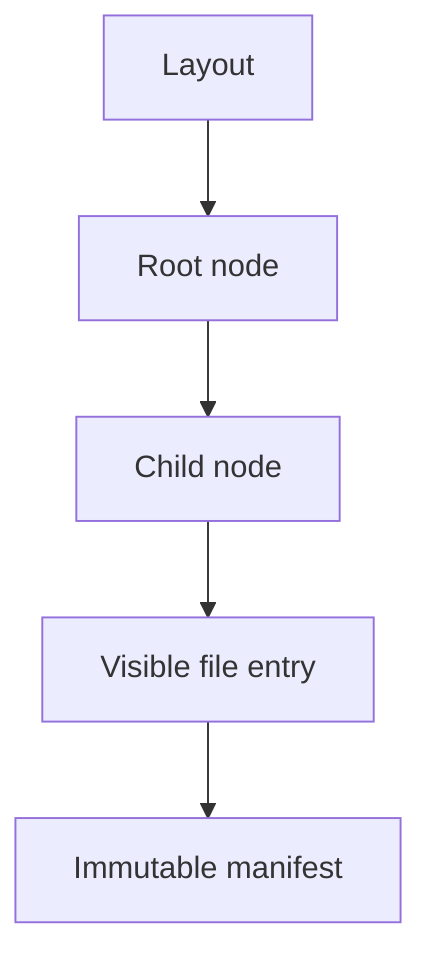

# 05. Logical Filesystem

The logical filesystem is the mutable, user-visible half of Cotton. It maps layouts, folders, names, trash state, and file entries onto immutable manifests.

## Model

- A layout is a user-owned namespace.
- A node is a folder-like entry with an optional parent.
- A file entry belongs to a node, owns its display name and metadata, and references a manifest.
- Visible and trashed trees are distinguished by node type.

```mermaid
flowchart TD
    Layout --> Root["Root node"]
    Root --> Folder["Child node"]
    Folder --> File["Visible file entry"]
    File --> Manifest["Immutable manifest"]
```

## Names and collisions

Display names are validated and converted to normalized name keys before persistence. Sibling uniqueness is enforced on the normalized key, so names that differ only by case or diacritics cannot create ambiguous paths.

Move, rename, restore, upload, and create-folder operations all use the same collision policy. User-facing conflict handling may choose a replacement name, overwrite where explicitly supported, or skip the item; the database remains the final race-safe guard.

## Navigation and paths

Path resolution walks node ancestry within one owner, layout, and node type. It rejects cycles and bounds traversal depth. A path may not cross from the visible tree into trash or another user's namespace.

Root resolution is a domain operation rather than a hardcoded node identifier. Browser, WebDAV, search, archive, and share flows should use the same topology rules so one logical path has one meaning throughout the product.

## Operations

The mediator layer owns filesystem behavior:

- listing children with paging;
- creating, moving, renaming, deleting, and restoring entries;
- resolving recent items and search results;
- linking new manifests into the tree;
- emitting realtime invalidation after committed changes.

Controllers translate HTTP requests and outcomes but do not implement namespace rules.

## Delete and restore

A normal delete moves an entry into trash and records enough metadata to attempt restoration. Permanent deletion removes the visible reference but does not synchronously reclaim shared chunks.

Restore validates that the original parent still exists and that the original name is available. Outcomes distinguish successful restore, missing parent, collision, and non-restorable state.

Historical versions use the same file-entry and manifest model rather than a separate version-content store. Version retention and restoration are documented separately.

## Concurrency

Mutations affecting one layout are serialized through bounded layout locks. Locks protect multi-row topology checks such as cycle prevention and sibling collisions; database constraints remain the final authority.

Important invariants:

- a node cannot become its own ancestor;
- an entry cannot move across owners;
- a visible operation cannot cross into trash implicitly;
- move and restore must revalidate names inside the mutation boundary;
- restrictive foreign keys require explicit lifecycle ordering.

Read-heavy operations do not acquire mutation locks unless they must coordinate with a destructive transition.

## API behavior

Layout endpoints return paged payloads where appropriate and expose total counts through `X-Total-Count`. Public routes and WebDAV reuse the same logical topology but add their own authorization boundaries.

## Related sections

- [Data model and persistence](03-data-model.md)
- [Sharing, versions, trash, archives, and quotas](11-sharing-versioning-trash-archives-quotas.md)
- [Search](19-search.md)
- [WebDAV](17-webdav.md)
