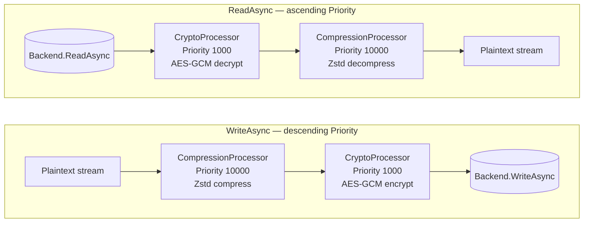
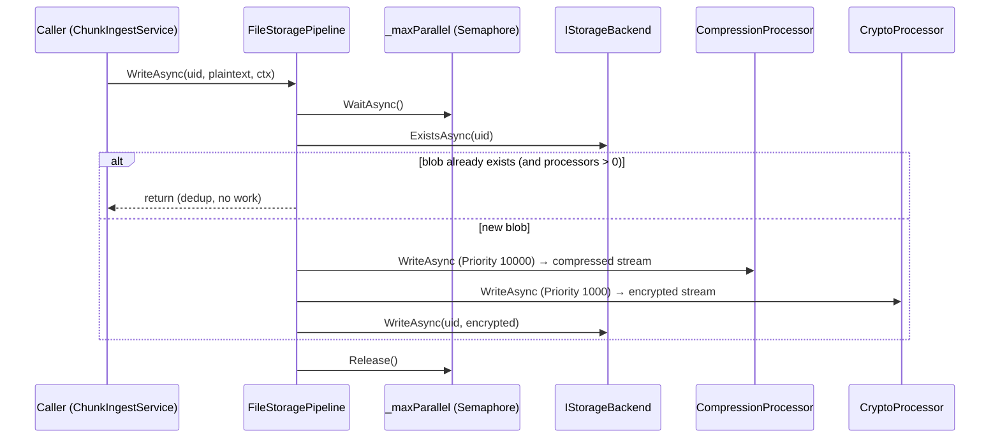
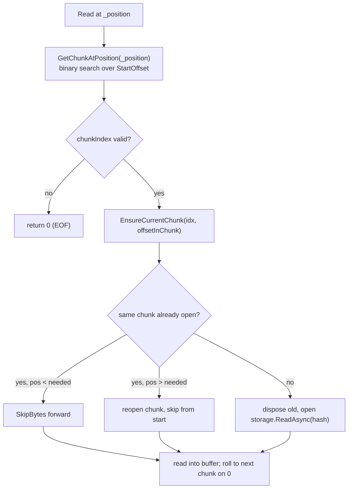
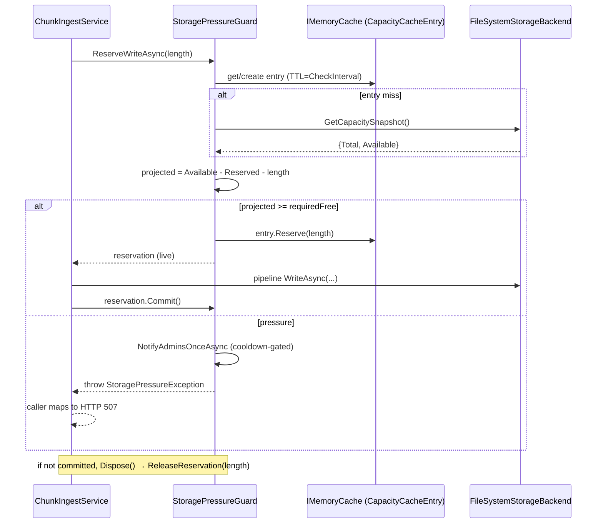

# 06. Storage Pipeline & Backends

The `Cotton.Storage` project is the lowest layer of Cotton's content-addressed storage engine. It takes an opaque, content-addressed blob (a "chunk") identified by a normalized hexadecimal UID, runs it through an ordered chain of stream transformations (compression, encryption), and persists the result in a pluggable backend (local filesystem or S3-compatible object storage). On the way back out it reverses the chain to reconstruct the original plaintext bytes. Everything in this layer is deliberately ignorant of users, files, manifests, encryption keys, and quotas; those concerns live in `Cotton.Server` above the `IStorageBackend` boundary. This section documents the pipeline abstraction, the processors, the backends, the seekable read stream, and the server-side capacity/pressure machinery that sits in front of the write path.

## Purpose & overview

A chunk's lifecycle through this subsystem is:

- **Write**: caller hands the pipeline a plaintext stream + UID. The pipeline applies write processors in *descending* priority order (compression first, then encryption), then writes the transformed stream to the active backend.
- **Read**: caller asks the pipeline for a UID. The pipeline opens the backend stream and applies read processors in *ascending* priority order (decrypt first, then decompress), handing back a plaintext stream.

The whole thing is streaming end-to-end: no processor buffers the full blob in memory. Compression uses Zstandard (via the `ZstdSharp.Port` package) over a `System.IO.Pipelines.Pipe`; encryption uses chunked, parallel AES-GCM from the `Cotton.Crypto` library (see the *Cryptography Engine* section).



## Key components & responsibilities

| Component | File | Responsibility |
| --- | --- | --- |
| `IStoragePipeline` | `src/Cotton.Storage/Abstractions/IStoragePipeline.cs` | Public façade: `ReadAsync`, `WriteAsync`, `ExistsAsync`, `DeleteAsync`, `GetSizeAsync`, `ListAllKeysAsync`. |
| `FileStoragePipeline` | `src/Cotton.Storage/Pipelines/FileStoragePipeline.cs` | The **only** implementation of `IStoragePipeline`. Orders processors, applies dedup short-circuit, throttles concurrent writes. |
| `PipelineContext` | `src/Cotton.Storage/Pipelines/PipelineContext.cs` | Optional per-operation metadata passed to processors and `ConcatenatedReadStream`. |
| `IStorageProcessor` | `src/Cotton.Storage/Abstractions/IStorageProcessor.cs` | Stream transform with a `Priority`. |
| `CompressionProcessor` | `src/Cotton.Storage/Processors/CompressionProcessor.cs` | Zstd compress/decompress. `Priority => 10000`. |
| `CryptoProcessor` | `src/Cotton.Storage/Processors/CryptoProcessor.cs` | AES-GCM encrypt/decrypt via `IStreamCipher`. `Priority => 1000`. |
| `ICompressionLevelProvider` | `src/Cotton.Storage/Processors/ICompressionLevelProvider.cs` | Runtime Zstd level seam. |
| `IEncryptionChunkSizeProvider` | `src/Cotton.Storage/Processors/IEncryptionChunkSizeProvider.cs` | Runtime AES-GCM plaintext chunk-size seam. |
| `IStorageBackend` | `src/Cotton.Storage/Abstractions/IStorageBackend.cs` | Opaque object store contract. |
| `FileSystemStorageBackend` | `src/Cotton.Storage/Backends/FileSystemStorageBackend.cs` | Sharded local filesystem store. Also `IStorageCapacityReporter`. |
| `S3StorageBackend` | `src/Cotton.Storage/Backends/S3StorageBackend.cs` | S3-compatible object store. Also `IStorageBackendUsesEncryptedConfiguration`. |
| `IStorageBackendUsesEncryptedConfiguration` | `src/Cotton.Storage/Abstractions/IStorageBackendUsesEncryptedConfiguration.cs` | Empty marker for backends that need decrypted runtime config. |
| `StorageKeyHelper` | `src/Cotton.Storage/Helpers/StorageKeyHelper.cs` | Normalize/validate UIDs, shard into `p1/p2/fileName`. |
| `S3CompatibilityFactory` | `src/Cotton.Storage/Helpers/S3CompatibilityFactory.cs` | Build S3 clients/configs with path-style + checksum-compat defaults. |
| `ConcatenatedReadStream` | `src/Cotton.Storage/Streams/ConcatenatedReadStream.cs` | A single (optionally seekable) `Stream` assembled from many chunk streams (`internal`). |
| `S3ResponseStream` | `src/Cotton.Storage/Streams/S3ResponseStream.cs` | Stream wrapper that co-owns the `GetObjectResponse` and disposes both. |
| `StoragePipelineExtensions` | `src/Cotton.Storage/Extensions/StoragePipelineExtensions.cs` | `GetBlobStream(uids, ctx)` → builds a `ConcatenatedReadStream`. |
| `IStorageCapacityReporter` / `StorageCapacitySnapshot` | `src/Cotton.Storage/Abstractions/IStorageCapacityReporter.cs` | Cheap free-space reporting for capacity-aware backends. |
| `IStorageBackendProvider` | `src/Cotton.Storage/Abstractions/IStorageBackendProvider.cs` | Resolve the active backend. |
| `IS3Provider` | `src/Cotton.Storage/Abstractions/IS3Provider.cs` | Resolve the active S3 client + bucket. |
| `StorageBackendProvider` / `IStorageBackendTypeCache` / `StorageBackendTypeCache` | `src/Cotton.Server/Providers/StorageBackendProvider.cs` | Server-side backend resolution + cached `StorageType`. |
| `S3Provider` | `src/Cotton.Server/Providers/S3Provider.cs` | Server-side lazy S3 client from decrypted settings. |
| `SettingsCompressionLevelProvider` | `src/Cotton.Server/Services/SettingsCompressionLevelProvider.cs` | Reads `CompressionLevel` from server settings. |
| `SettingsEncryptionChunkSizeProvider` | `src/Cotton.Server/Services/SettingsEncryptionChunkSizeProvider.cs` | Reads `CipherChunkSizeBytes` from server settings. |
| `StoragePressureGuard` | `src/Cotton.Server/Services/StoragePressureGuard.cs` | Reserve free space before a write, throw on pressure, notify admins. |
| `StoragePressureOptions` | `src/Cotton.Server/Models/Configuration/StoragePressureOptions.cs` | Reserve thresholds, cache interval, notification cooldown. |
| `StoragePipelineProbeService` | `src/Cotton.Server/Services/StoragePipelineProbeService.cs` | Telemetry probe: round-trips a synthetic blob through the real pipeline. |

## How the pipeline works

### The abstraction

`IStorageProcessor` exposes an `int Priority` with a precise contract documented in the source: *"Lower values indicate higher priority - closer to the beginning of the pipeline (Backend)."* In other words, a processor with a **lower** `Priority` runs **closer to the backend**.

The two registered processors and their priorities:

| Processor | `Priority` | Position relative to backend |
| --- | --- | --- |
| `CryptoProcessor` | `1000` | Closer to backend (encrypted bytes are what the backend stores) |
| `CompressionProcessor` | `10000` | Closer to the caller (plaintext is compressed before it is encrypted) |

`FileStoragePipeline` translates this into the read/write asymmetry:

- **`ReadAsync`** iterates `_processors.OrderBy(p => p.Priority)` — ascending — so the backend stream first passes the `CryptoProcessor` (decrypt), then the `CompressionProcessor` (decompress).
- **`WriteAsync`** iterates `_processors.OrderByDescending(p => p.Priority)` — descending — so the plaintext first passes the `CompressionProcessor` (compress), then the `CryptoProcessor` (encrypt), then the backend.

Because ordering is derived purely from `Priority`, adding a new processor is a matter of registering it in DI with a priority that places it correctly between `1000` (crypto) and the backend, or above `10000` (caller side). DI registration order does not matter; `FileStoragePipeline` receives the processors via `IEnumerable<IStorageProcessor>` and re-orders them on every call.

### `FileStoragePipeline.WriteAsync`



Notable details:

- **Write concurrency throttle**: a single `static readonly SemaphoreSlim _maxParallel = new(initialCount: Environment.ProcessorCount)`. Every `WriteAsync` acquires it (`WaitAsync().ConfigureAwait(false)`) and releases it in a `finally`. This caps the number of in-flight compress+encrypt write pipelines to the CPU count, process-wide (the semaphore is `static`, so it is shared across all scoped pipeline instances). Reads are **not** throttled by this semaphore.
- **Dedup short-circuit**: if there is at least one processor and `backend.ExistsAsync(uid)` is `true`, the write returns immediately without running any processor or touching the backend (logged at Debug as "File {Uid} deduplicated, skipping processor pipeline"). Content addressing makes this safe: identical UID ⇒ identical stored bytes.
- **Empty-processor fallback**: if no processors are registered, it logs a warning ("No storage processors are registered. Writing the stream directly to the backend.") and writes the raw stream straight to the backend. In that case the pipeline-level dedup existence check is skipped (the `ExistsAsync` call is guarded by `orderedProcessors.Length > 0`), though the backend's own `WriteAsync` still performs its own existence-based dedup.
- **`Stream.Null` guards**: before each write stage the pipeline asserts the incoming stream is not `Stream.Null` and throws `InvalidOperationException` otherwise; it also throws if the final stream to write is `Stream.Null`. These are defensive contract checks, not normal flow.

### `FileStoragePipeline.ReadAsync`

`ReadAsync` opens `backend.ReadAsync(uid)`, then folds it through the ascending-priority processors. Each processor returns a *new* wrapping stream (a `DecompressionStream`, a decrypt stream, etc.). After each processor it asserts the result is not `Stream.Null` (throwing `InvalidOperationException` "...returned Stream.Null for UID {uid}..." if it is), and throws again if the final stream is `Stream.Null`. There is no dedup or semaphore on the read path.

The remaining `IStoragePipeline` members are thin pass-throughs to `_backendProvider.GetBackend()`: `ExistsAsync`, `DeleteAsync`, `GetSizeAsync`, `ListAllKeysAsync`.

### `PipelineContext`

`PipelineContext` is optional per-operation metadata:

| Field | Type | Meaning |
| --- | --- | --- |
| `FileSizeBytes` | `long?` | Plaintext size when the caller already knows it (used by `ConcatenatedReadStream.Length` and as a consistency check against `ChunkLengths`). |
| `StoreInMemoryCache` | `bool` | "Gets or sets whether processors may keep small transformed blobs in memory." |
| `ChunkLengths` | `Dictionary<string, long>?` | Per-chunk plaintext lengths keyed by UID; presence enables seekable concatenated reads. |

> **Gotcha:** `StoreInMemoryCache` is *set* by `PreviewController` (`src/Cotton.Server/Controllers/PreviewController.cs`, `StoreInMemoryCache = true`) but is **not read by any processor** in the current `Cotton.Storage` code. The `CompressionProcessor` and `CryptoProcessor` ignore the `PipelineContext` entirely; the field is presently inert. Treat it as a forward-looking hook, not active behavior. (See *Non-obvious design decisions & gotchas* — the README's "CachedStoragePipeline" does not exist.)

## Processors

### CompressionProcessor

`CompressionProcessor` (`src/Cotton.Storage/Processors/CompressionProcessor.cs`) compresses with Zstandard via `ZstdSharp` and streams through a `System.IO.Pipelines.Pipe`.

Constants and seams:

| Member | Value / Source |
| --- | --- |
| `DefaultCompressionLevel` | `const int 1` |
| `MinCompressionLevel` | `static readonly int Compressor.MinCompressionLevel` (ZstdSharp build) |
| `MaxCompressionLevel` | `static readonly int Compressor.MaxCompressionLevel` (ZstdSharp build) |
| `Algorithm` | `const CompressionAlgorithm.Zstd` (from `EasyExtensions.Models.Enums`) |
| `Priority` | `10000` |
| `CompressBufferSize` | `private const 1 * 1024 * 1024` (1 MiB copy buffer) |

`ThrowIfInvalidLevel(int level)` validates a level against `[MinCompressionLevel, MaxCompressionLevel]`, throwing `ArgumentOutOfRangeException` otherwise. The processor has a default ctor (using a private `StaticCompressionLevelProvider(DefaultCompressionLevel)`) and a ctor taking an `ICompressionLevelProvider`; the server wires the runtime provider.

**Write path** creates a `Pipe` with explicit thresholds — `pauseWriterThreshold: 1024 * 1024 * 1` (1 MiB), `resumeWriterThreshold: 512 * 1024` (512 KiB), `minimumSegmentSize: 4096`, `pool: MemoryPool<byte>.Shared`, `useSynchronizationContext: false` — and returns `pipe.Reader.AsStream(leaveOpen: false)` immediately. A fire-and-forget `Task.Run` drives a `ZstdSharp.CompressionStream` (at `_compressionLevelProvider.Level`, `leaveOpen: true`) wrapping `pipe.Writer.AsStream(leaveOpen: true)`, copying the source via `CopyToAsync(compressor, CompressBufferSize)`, flushing, then completing the writer (`pipe.Writer.CompleteAsync()`). The **source stream is disposed in the producer's `finally`** (always). `OperationCanceledException` and any other exception are surfaced to the reader through `pipe.Writer.CompleteAsync(ex)`, so a downstream reader sees the failure rather than the host crashing.

**Read path** simply wraps the incoming stream in a `ZstdSharp.DecompressionStream` and returns it synchronously via `Task.FromResult`. Decompression is lazy/streaming as the consumer reads.

The `Cotton.Storage.csproj` also references `K4os.Compression.LZ4.Streams` (version `1.3.8`), but no code in `Cotton.Storage` uses LZ4; the active compression algorithm is Zstd only (package `ZstdSharp.Port` `0.8.8`).

### CryptoProcessor

`CryptoProcessor` (`src/Cotton.Storage/Processors/CryptoProcessor.cs`) delegates to `Cotton.Crypto`'s `IStreamCipher` (concretely `AesGcmStreamCipher`):

- `WriteAsync` → `_cipher.EncryptAsync(stream, _chunkSizeProvider.ChunkSizeBytes)` returns an encrypting `Stream`.
- `ReadAsync` → `_cipher.DecryptAsync(stream)` returns a decrypting `Stream`.
- `Priority => 1000`.

The chunk size seam (`IEncryptionChunkSizeProvider`) governs the plaintext chunk granularity of the AES-GCM stream format. The default ctor uses a private `StaticEncryptionChunkSizeProvider(AesGcmStreamCipher.DefaultChunkSize)`; the second ctor takes an `IEncryptionChunkSizeProvider` and the server wires the runtime provider. Relevant crypto constants (from `src/Cotton.Crypto/AesGcmStreamCipher.cs`): `MinChunkSize = 8 * 1024` (8 KiB), `DefaultChunkSize = 1 * 1024 * 1024` (1 MiB), `MaxChunkSize = 64 * 1024 * 1024` (64 MiB). See the *Cryptography Engine* section for the AES-GCM stream format, nonce handling, and parallel windows.

### Provider seams and their server implementations

The processors are intentionally decoupled from where their tunables come from:

| Seam (in `Cotton.Storage`) | Server provider | Reads from |
| --- | --- | --- |
| `ICompressionLevelProvider.Level` | `SettingsCompressionLevelProvider` | `SettingsProvider.GetServerSettings().CompressionLevel` |
| `IEncryptionChunkSizeProvider.ChunkSizeBytes` | `SettingsEncryptionChunkSizeProvider` | `SettingsProvider.GetServerSettings().CipherChunkSizeBytes` |

Server defaults (from `src/Cotton.Server/Providers/SettingsProvider.cs`): `CompressionLevel = CompressionProcessor.DefaultCompressionLevel` (i.e. `1`), `CipherChunkSizeBytes = 1 MiB` (`defaultCipherChunkSizeBytes = 1 * 1024 * 1024`), `MaxChunkSizeBytes = 4 MiB` (`defaultMaxChunkSizeBytes = 4 * 1024 * 1024`), `StorageType = StorageType.Local`, `EncryptionThreads = 2`. Because these are server-settings rows, an operator can change compression level and cipher chunk size at runtime; existing blobs keep whatever parameters they were written with (the AES-GCM format is self-describing, and Zstd decompression is level-agnostic).

## Backends

### The backend contract

`IStorageBackend` is deliberately minimal and, per the file's `<remarks>`, backends "must not know about users, files, manifests, encryption keys, or quotas; those concerns live above this boundary." Members: `CleanupTempFiles(TimeSpan ttl)`, `DeleteAsync(string uid)`, `ExistsAsync(string uid)`, `GetSizeAsync(string uid)`, `ReadAsync(string uid)`, `WriteAsync(string uid, Stream stream)`, `ListAllKeysAsync(CancellationToken ct = default)`. `GetSizeAsync` returns the **stored** (post-compression, post-encryption) size, or `0` when missing. Note the backend `ReadAsync`/`WriteAsync` signatures take **no** `PipelineContext` — that argument exists only on the pipeline/processor layer above.

### Storage key layout (`StorageKeyHelper`)

All backends shard a UID identically. `NormalizeUid` trims, lowercases (`ToLowerInvariant`), requires length ≥ `MinFileUidLength = 6`, and requires every character to be lowercase hex (`0-9a-f`); anything else throws `ArgumentException`. `GetSegments(uid)` first normalizes, then returns `(uid[..2], uid[2..4], uid[4..])`:

```
uid = "ab12cd34ef..."  ->  part1="ab", part2="12", fileName="cd34ef..."
```

This yields a two-level directory fan-out (256 × 256) so no single directory holds the whole keyspace.

### FileSystemStorageBackend

`FileSystemStorageBackend` (`src/Cotton.Storage/Backends/FileSystemStorageBackend.cs`) is the local-disk backend and **also implements `IStorageCapacityReporter`**.

Layout and constants:

- Base path: ctor arg `basePath`, else `Path.Combine(AppContext.BaseDirectory, "files")` (`BaseDirectoryName = "files"`). The server creates the backend via `ActivatorUtilities.CreateInstance` with no `basePath` arg, so the default applies.
- Chunk file: `{basePath}/{p1}/{p2}/{fileName}.ctn` (`ChunkFileExtension = ".ctn"`).
- Temp dir: `{basePath}/tmp` (`TempDirectoryName = "tmp"`).

**Write (`WriteAsync`)** is a temp-file + atomic-move with multiple dedup safety nets:

1. If the final `.ctn` already exists → log Debug ("File {Uid} deduplicated, skipping write") and return (dedup).
2. Otherwise write to `{tmp}/{fileName}.{Guid:N}.tmp` using a `FileStream` opened `FileMode.CreateNew`, `FileShare.None`, `FileAccess.Write`, `FileOptions.Asynchronous`, 2 MiB buffer (`WriteBufferSize = 2 * 1024 * 1024`). If the source is seekable it is rewound to 0 first (`Seek(default, SeekOrigin.Begin)`). On any exception the temp file is deleted (`TryDelete`) and the exception rethrown.
3. `File.Move(tmpFilePath, filePath, overwrite: false)` — the atomic publish step.
4. After move, `File.SetAttributes(filePath, FileAttributes.ReadOnly | FileAttributes.NotContentIndexed)` — the stored blob is marked **read-only** and **excluded from the Windows content indexer**.
5. If the move throws `IOException` *and the final file now exists* (`catch (IOException ex) when (File.Exists(filePath))`), it is treated as a concurrent-write dedup: the temp file is deleted and the call succeeds quietly (logged at Debug). Any other exception deletes the temp file and rethrows.

**Read (`ReadAsync`)** opens the `.ctn` with `FileMode.Open`, `FileShare.Read`, `FileAccess.Read`, `FileOptions.Asynchronous | FileOptions.SequentialScan`. Missing file → `FileNotFoundException`.

**Delete (`DeleteAsync`)** returns `false` if the file does not exist; otherwise it clears the read-only attribute (`File.SetAttributes(..., FileAttributes.Normal)`) before `File.Delete` and returns `true`. On exception it logs an error and returns `false`.

**`CleanupTempFiles(ttl)`** enumerates `*.tmp` in the temp dir (top level only, `SearchOption.TopDirectoryOnly`) and deletes those whose `LastWriteTimeUtc <= now - ttl`, resetting attributes to `Normal` first. Per-file and per-directory failures are caught and logged as warnings.

**`ListAllKeysAsync`** walks `*.ctn` recursively (`SearchOption.AllDirectories`), reconstructs `uid = p1 + p2 + fileNameWithoutExtension`, and skips any relative path that does not split into exactly 3 parts. Returns early if the base path does not exist. Used by storage consistency checks.

**Capacity (`GetCapacitySnapshot`)** creates the base dir, resolves the owning `DriveInfo` via `ResolveDrive` (longest matching mount root, case-insensitive on Windows / ordinal elsewhere; falls back to `Path.GetPathRoot`, throwing `InvalidOperationException` if even that is empty), and returns a `StorageCapacitySnapshot { Backend = "filesystem", RootPath, TotalBytes = drive.TotalSize, AvailableBytes = drive.AvailableFreeSpace }`. `StorageCapacitySnapshot` also exposes a computed `AvailablePercent` (100 when `TotalBytes <= 0`).

### S3StorageBackend

`S3StorageBackend` (`src/Cotton.Storage/Backends/S3StorageBackend.cs`) stores each chunk as a single object and is marked `IStorageBackendUsesEncryptedConfiguration` (it needs decrypted S3 credentials at runtime). It is constructed with an injected `IS3Provider`.

- **Object key**: `GetS3Key(uid)` → `"{p1}/{p2}/{fileName}.ctn"`. There is **no namespace/prefix segment** in front of `p1` — the README's mention of an S3 `"segments"` namespace/partitioning does not correspond to this code (see *Non-obvious design decisions & gotchas* below).
- **Existence/size**: `GetObjectMetadataAsync` (a HEAD); `ExistsAsync` returns `true` when the response status is `HttpStatusCode.OK`, and an `AmazonS3Exception` with `StatusCode == NotFound` is swallowed (`ExistsAsync` → `false`, `GetSizeAsync` → `0`). `GetSizeAsync` returns `res.ContentLength`.
- **Read**: `GetObjectAsync` with `ChecksumMode = new ChecksumMode("DISABLED")`, wrapped in an `S3ResponseStream` so both the `GetObjectResponse` and its `ResponseStream` get disposed together (sync `Dispose` and async `DisposeAsync`).
- **Write**: **existence check before write** (dedup) — if `ExistsAsync(uid)` it returns immediately. Otherwise it spools the (already compressed+encrypted) stream to a local OS temp file (`Path.GetTempFileName()`, `FileMode.Create`, 2 MiB buffer, `useAsync: true`, rewinding seekable sources), then `PutObjectAsync` using `FilePath = tmpPath`, `ContentType = MediaTypeNames.Application.Octet` (`application/octet-stream`), and `.WithFileBodyCompatibility()` (sets `UseChunkEncoding = false`). The temp file is always deleted in `finally`. Spooling to disk lets the SDK send a known `Content-Length` from a file body, which is friendly to S3-compatible providers that reject AWS chunked transfer encoding.
- **Delete**: `DeleteObjectAsync`; returns `true` only when the response is `HttpStatusCode.NoContent` (HTTP 204).
- **`CleanupTempFiles`**: an explicit no-op for S3 (uploads use OS temp files cleaned up inline).
- **`ListAllKeysAsync`**: paginates `ListObjectsV2` (`MaxKeys = 1000`, continuation tokens; loops while `IsTruncated == true`), keeps only keys ending in `.ctn` (case-insensitive) that split into exactly 3 `/`-segments, and reconstructs `uid = p1 + p2 + fileName`.
- **Capacity**: `S3StorageBackend` does **not** implement `IStorageCapacityReporter`, so the pressure guard treats S3 as unknown-capacity and does not block writes.

### S3 client compatibility (`S3CompatibilityFactory`)

`S3CompatibilityFactory` centralizes S3-compatible quirks:

- `BuildConfig(endpoint, region, timeout? = null, maxErrorRetry = 3)` → `AmazonS3Config` with `UseHttp = false`, `ServiceURL = endpoint`, `AuthenticationRegion = region`, `ForcePathStyle = true` (path-style addressing for non-AWS providers), `MaxErrorRetry = maxErrorRetry`, `Timeout` default **5 minutes** (`TimeSpan.FromMinutes(5)`), and checksums set to `WHEN_REQUIRED` for both `RequestChecksumCalculation` and `ResponseChecksumValidation`. Relaxing automatic checksums avoids breaking providers that do not implement AWS's newer checksum behavior.
- `BuildClient(endpoint, region, accessKey, secretKey, timeout? = null, maxErrorRetry = 3)` constructs an `AmazonS3Client` from `BasicAWSCredentials` + the config above.
- `WithFileBodyCompatibility()` → `UseChunkEncoding = false` (used by the file-body PUT in the backend).
- `WithInMemoryBodyCompatibility()` → `UseChunkEncoding = false` **and** `DisablePayloadSigning = true` (used by `SettingsProvider`'s S3 connectivity self-test, which PUTs a small in-memory body, then reads, lists, and deletes a `cotton_server_test_object_*` key during setup/validation).

### Backend resolution (server)

`StorageBackendProvider` (`src/Cotton.Server/Providers/StorageBackendProvider.cs`) implements `Cotton.Storage.Abstractions.IStorageBackendProvider`:

- It reads the active `StorageType` from an `IStorageBackendTypeCache` (singleton `StorageBackendTypeCache`, lock-free via `Volatile` reads/writes of a `_hasValue` flag). On a cache miss it reads `SettingsProvider.GetServerSettings().StorageType`, caches it (`Set`), and proceeds. `Reset()` clears the cache so a settings change re-resolves the type; `SettingsProvider.InvalidateSettingsCache` calls `_storageTypeCache?.Reset()` on any settings update.
- `StorageType.S3` → `ActivatorUtilities.CreateInstance<S3StorageBackend>` (injecting `IS3Provider`); `StorageType.Local` → `ActivatorUtilities.CreateInstance<FileSystemStorageBackend>`; anything else throws `NotSupportedException`. The `StorageType` enum has exactly two members: `Local = 0`, `S3 = 1` (`src/Cotton.Database/Models/Enums/StorageType.cs`).

`S3Provider` (`src/Cotton.Server/Providers/S3Provider.cs`) lazily builds and memoizes one `IAmazonS3` client and bucket name from server settings (`S3EndpointUrl`, `S3Region`, `S3AccessKeyId`, `S3SecretAccessKeyEncrypted`, `S3BucketName`), throwing `ArgumentNullException`/`InvalidOperationException` if any required field is missing. The secret is decrypted **transparently by EF Core, not by `S3Provider` itself**: `CottonServerSettings.S3SecretAccessKeyEncrypted` carries the `[Encrypted]` attribute, and `CottonDbContext` registers a `ValueConverter` (`EncryptString`/`DecryptString` over the `IStreamCipher`) on every `[Encrypted]` string property, so by the time `GetServerSettings()` hands the value back the CLR string is already plaintext. `S3Provider` simply passes that plaintext through to `S3CompatibilityFactory.BuildClient`. Because it caches the client per provider instance and the provider is registered `Scoped`, the client is per-request-scope.

### DI registration

From `src/Cotton.Server/Program.cs`:

```csharp
.AddSingleton<IStorageBackendTypeCache, StorageBackendTypeCache>()
.AddScoped<StoragePipelineProbeService>()
.AddScoped<StoragePressureGuard>()
.AddScoped<IS3Provider, S3Provider>()
.AddScoped<IEncryptionChunkSizeProvider, SettingsEncryptionChunkSizeProvider>()
.AddScoped<ICompressionLevelProvider, SettingsCompressionLevelProvider>()
.AddScoped<IStorageProcessor, CryptoProcessor>()
.AddScoped<IStorageProcessor, CompressionProcessor>()
.AddScoped<IStoragePipeline, FileStoragePipeline>()
.AddScoped<IStorageBackendProvider, StorageBackendProvider>()
```

`IStorageBackendTypeCache` is the only **singleton** here; everything else in the storage path is **scoped**. The two `IStorageProcessor` registrations are the entire processor set; `FileStoragePipeline` receives both via `IEnumerable<IStorageProcessor>` and orders them by `Priority` at call time (registration order does not matter). `StoragePressureOptions` is bound separately via `AddOptions<StoragePressureOptions>().Bind(builder.Configuration.GetSection("StoragePressure"))`.

## Seekable reads: ConcatenatedReadStream

A logical file in Cotton is a *list of chunk UIDs*. `ConcatenatedReadStream` (`src/Cotton.Storage/Streams/ConcatenatedReadStream.cs`, `internal`) presents that list as one `Stream`. It is constructed via the extension `IStoragePipeline.GetBlobStream(uids, context)` in `StoragePipelineExtensions`.

Two modes, selected by whether `PipelineContext.ChunkLengths` is supplied:

- **Sequential (non-seekable)**: `ChunkLengths == null` ⇒ `CanSeek == false`. It opens chunks one at a time in order; when the current chunk returns 0 bytes it disposes it and opens the next (`ReadSequential` / `ReadSequentialAsync`, the async one using recursion to roll to the next chunk). `Seek` throws `NotSupportedException`; `Length` throws `NotSupportedException` unless `FileSizeBytes` is set (`Length => pipelineContext?.FileSizeBytes ?? LengthFromIndex ?? throw`).
- **Seekable (random access)**: `ChunkLengths` present ⇒ at construction `Materialize` builds a `ChunkIndexEntry[]` of `(Hash, StartOffset, Length)` with cumulative offsets, throwing `InvalidOperationException` if any hash has no length, and validating that `FileSizeBytes` (if given) equals the sum of chunk lengths (mismatch ⇒ `InvalidOperationException`). `Length` is then known and `CanSeek == true`.



Key mechanics:

- **Position → chunk**: `GetChunkAtPosition` binary-searches the index for the last entry with `StartOffset <= position`, then returns `(chunkIndex, position - StartOffset)`. Positions at/after the end map to `(index.Length, 0)` (EOF).
- **`EnsureCurrentChunk` / `EnsureCurrentChunkAsync`**: lazily (re)open the target chunk via `storage.ReadAsync(hash, context)`. If the already-open chunk is *behind* the required offset, it forward-skips by reading and discarding (`SkipBytes` / `SkipBytesAsync`, an 80 KiB — `Math.Min(81920, count)` — scratch buffer; throws `EndOfStreamException` on premature EOF); if it is *ahead*, it disposes and reopens from the start, then skips forward. There is no true intra-chunk seek — backward seeks reopen the chunk stream and re-skip. This is the cost model for range reads: seeking backward within a chunk re-reads (re-decrypts/re-decompresses) from that chunk's start.
- **Reads roll across chunk boundaries**: when the current chunk yields 0 bytes mid-read, it advances `chunkIndex` and continues into the next chunk within the same `Read`/`ReadAsync` call.
- **Sync over async**: the synchronous `Read`/`EnsureCurrentChunk`/`ReadSequential` path calls `storage.ReadAsync(...).GetAwaiter().GetResult()`. Prefer the async `ReadAsync(Memory<byte>)` overload on the hot path to avoid blocking.
- **`Seek`** only updates `_position` (validating `0 <= newPosition <= Length`, throwing `IOException` otherwise); the actual stream repositioning happens lazily on the next read. `Flush`, `SetLength`, `Write` all throw `NotSupportedException`. `Position`'s setter routes through `Seek`.
- **Disposal** disposes the currently open chunk stream — sync in `Dispose`, async-aware in `DisposeAsync` (using `IAsyncDisposable` when available).

This is what powers HTTP `Range` responses, media scrubbing, and preview/frame extraction directly over chunked, encrypted, compressed storage without reassembling the whole object — including over S3. The decrypt/decompress cost is per-chunk and incremental.

## Capacity & storage-pressure path

The write path on the filesystem backend is fronted by `StoragePressureGuard` so the disk cannot be filled to the point of failure.

### StoragePressureGuard

`StoragePressureGuard` (`src/Cotton.Server/Services/StoragePressureGuard.cs`) is `Scoped`. Public surface:

- `EnsureCanAcceptWriteAsync(long incomingBytes, ct)` — convenience wrapper: reserves then immediately commits.
- `ReserveWriteAsync(long incomingBytes, ct)` (`internal`) — returns a `StoragePressureReservation` (an `IDisposable`); the caller commits on success or lets `Dispose` release the reservation. This is the form `ChunkIngestService.WriteChunkAsync` uses:

```csharp
using var writeReservation = await _storagePressure.ReserveWriteAsync(length, ct);
using var chunkStream = new MemoryStream(buffer, 0, length, writable: false);
await _storage.WriteAsync(storageKey, chunkStream, new PipelineContext());
writeReservation.Commit();
```

Reservation algorithm (the capacity check + reserve is guarded by a process-wide `static SemaphoreSlim CapacityReservationLock(1, 1)`):

1. If `!options.Enabled` → return `StoragePressureReservation.None` (no-op).
2. `safeIncomingBytes = Math.Max(0, incomingBytes)`. Get/create the cached `CapacityCacheEntry` (key `"storage-pressure:capacity"`), which holds a `StorageCapacitySnapshot?` and a running `ReservedBytes`. The entry is set with TTL = `options.CheckInterval`, so the disk snapshot is at most that old.
3. If the backend does not report capacity (snapshot `null` — e.g. S3 or a capacity read error) or `TotalBytes <= 0` → return `None` (writes are never blocked when capacity is unknown).
4. Compute `requiredFreeBytes = options.GetRequiredFreeBytes(TotalBytes)`, `availableAfterReservations = max(0, AvailableBytes - ReservedBytes)`, `projectedAvailableBytes = availableAfterReservations - safeIncomingBytes`.
5. If `projectedAvailableBytes >= requiredFreeBytes` → `entry.Reserve(safeIncomingBytes)` and return a live reservation (or `None` when `safeIncomingBytes == 0`).
6. Otherwise build a `StoragePressureSnapshot`, call `NotifyAdminsOnceAsync` (outside the lock), and **throw `StoragePressureException`**.

The crucial design point (called out in the class `<remarks>`): **accepted writes immediately subtract from the cached available space via `ReservedBytes`**, so a burst of concurrent chunk uploads cannot all pass against the same stale snapshot. `ReleaseReservation` (called by an uncommitted reservation's `Dispose`, under the same lock) gives those bytes back if a write fails or is abandoned. `CapacityCacheEntry.Reserve`/`Release` saturate at `[0, long.MaxValue]`. The reservation accounting is best-effort and lives only in the cached entry; once the snapshot expires the running reservation count resets with the fresh snapshot.

`ReadCapacitySnapshot` only works for backends implementing `IStorageCapacityReporter` (filesystem); `IOException`/`UnauthorizedAccessException`/`ArgumentException`/`NotSupportedException` are caught and downgraded to a warning + `null` (fail-open).

### HTTP 507 mapping

`StoragePressureException` derives from `InvalidOperationException` and carries the `StoragePressureSnapshot` (via its `Pressure` property). Controllers/handlers catch it and map it to **HTTP 507 Insufficient Storage**:

| Caller | Route / Trigger | File | Response |
| --- | --- | --- | --- |
| Chunk upload (multipart) | `POST /api/v1/chunks` | `src/Cotton.Server/Controllers/ChunkController.cs` | `StatusCode(507, "Storage is running out of free space. Uploads are temporarily paused.")` |
| Raw chunk upload | `POST /api/v1/chunks/raw` | `src/Cotton.Server/Controllers/ChunkController.cs` | same 507 |
| Avatar upload | `PUT /api/v1/users` (current user update) | `src/Cotton.Server/Controllers/UserController.cs` | `StatusCode(507, "Storage is running out of free space. Profile avatar uploads are temporarily paused.")` |
| WebDAV PUT | `WebDavPutFileError.StoragePressure` | `src/Cotton.Server/Handlers/WebDav/WebDavPutFileRequest.cs` → `src/Cotton.Server/Controllers/WebDavController.cs` | `StatusCode(507, "Storage is running out of free space")` |

The WebDAV controller also maps the separate, logically distinct *user-quota* errors `WebDavPutFileError.QuotaExceeded` and `WebDavCopyError.QuotaExceeded` to `StatusCode(507, "Storage quota exceeded")` — that path is enforced by quota services, not by `StoragePressureGuard` (see *Server Settings & Setup* / user-quota documentation).

### Throttled admin notification

`NotifyAdminsOnceAsync` is double-checked-locked behind a process-wide `static SemaphoreSlim NotificationLock(1, 1)` and a cache key `"storage-pressure:notification-sent"`. On the first pressure event after the cooldown it loads all `UserRole.Admin` user IDs (ordered by `Id`, `AsNoTracking`) and sends each a `NotificationPriority.High` notification (templated `NotificationTemplates.StoragePressureTitle` / `StoragePressureContent`, with `NotificationTemplateMetadata` keyed `kind=storage-pressure`, plus `backend`, `rootPath`, `availableBytes`, `totalBytes`, `requiredFreeBytes`, `incomingBytes`, human-readable `availableSpace`/`requiredReserve` via a binary `B/KiB/MiB/GiB/TiB/PiB` `FormatBytes`, and `availablePercent`). It then sets the notification cache key with TTL = `options.AdminNotificationCooldown`, so admins are not spammed on every blocked write. If no admin users exist, it logs a warning (and still proceeds without sending).

### StoragePressureOptions

Bound from configuration section **`StoragePressure`** (`src/Cotton.Server/Program.cs`).

| Key | Type | Default | Notes |
| --- | --- | --- | --- |
| `Enabled` | `bool` | `true` | When false, the guard is a no-op. |
| `MinFreePercent` | `int` | `5` | Clamped to `[0,100]` in `GetRequiredFreeBytes`. |
| `MinFreeBytes` | `long` | `512 MiB` (`512L * 1024 * 1024`) | Floor reserve. |
| `CheckIntervalSeconds` | `int` | `10` | `CheckInterval` clamps to `[1,300]` s; capacity-cache TTL. |
| `AdminNotificationCooldownMinutes` | `int` | `60` | `AdminNotificationCooldown` clamps to `[1, 1440]` min. |

`GetRequiredFreeBytes(totalBytes) = max(MinFreeBytes, ceil(totalBytes * MinFreePercent / 100))` (with `MinFreeBytes` and `MinFreePercent` clamped as above). So with defaults the reserve is the larger of 512 MiB and 5% of the volume.

### Reservation lifecycle diagram



## Telemetry probe: StoragePipelineProbeService

`StoragePipelineProbeService` (`src/Cotton.Server/Services/StoragePipelineProbeService.cs`) measures the *real* pipeline without touching user data. It is invoked from `CollectPerformanceJob` (`src/Cotton.Server/Jobs/CollectPerformanceJob.cs`) only when telemetry is enabled (`settings.TelemetryEnabled`) and **no upload is in progress** (`!_perf.IsUploading()`); the result is attached to the `TelemetryRequest.StoragePipelineProbe` sent to Cotton Bridge, with the backend reported as `settings.StorageType.ToString().ToLowerInvariant()`. Probe failures are caught and logged, and telemetry is sent without the storage metrics.

- `PayloadSizeBytes = 64 * 1024 * 1024` (64 MiB) of `RandomNumberGenerator` bytes (random ⇒ effectively incompressible, so it stresses crypto + IO, not Zstd).
- `RunAsync(storageBackend, ct)` runs **one warmup iteration then one measured iteration** under a process-wide `static SemaphoreSlim ProbeLock(1, 1)`.
- Each iteration generates a fresh random UID (`CreateProbeUid` = `SHA256(RandomNumberGenerator.GetBytes(32))` hex-lowercased — which passes `StorageKeyHelper` validation), writes the payload through `_storage.WriteAsync` with a `PipelineContext` declaring `FileSizeBytes` and the single chunk's length in `ChunkLengths`, reads it back via `_storage.ReadAsync`, hashes the readback incrementally (SHA-256), and asserts byte-for-byte equality (`CryptographicOperations.FixedTimeEquals` plus a length check); a mismatch throws `InvalidOperationException`. It records write/read/roundtrip milliseconds, derives MiB/s (`ToMebibytesPerSecond`), captures `StoredSizeBytes` via `GetSizeAsync`, and **always deletes the probe blob in `finally`** (delete failures are logged, not thrown).

So the probe reports backend type plus observed read/write throughput of the full compression→crypto→backend path.

## Maintenance: temp cleanup job

`ClearTempFolderJob` (`src/Cotton.Server/Jobs/ClearTempFolderJob.cs`, `[JobTrigger(hours: 36)]`) resolves the active backend and calls `CleanupTempFiles(TimeSpan.FromHours(1))` — i.e. it deletes filesystem temp files older than 1 hour roughly every 36 hours. It first awaits a 7-minute startup delay (`Task.Delay(420_000)`) and returns early if `_perf.IsNightTime()`. For S3 this is a no-op, since S3 uploads clean their OS temp files inline.

## Concurrency, failure modes, edge cases, security

- **Write throttling**: `FileStoragePipeline._maxParallel` (= `Environment.ProcessorCount`) is the only concurrency cap on the write pipeline and it is `static` (shared across all scoped pipeline instances / requests). Reads are uncapped here. The `StoragePressureGuard` reservation/notification locks and the probe lock are likewise process-wide statics.
- **Backpressure**: the `CompressionProcessor`'s `Pipe` thresholds (pause 1 MiB / resume 512 KiB) bound how far the Zstd producer can run ahead of the consumer, keeping per-write memory bounded even for large chunks.
- **Producer-task exceptions**: compression runs on a detached `Task.Run`; failures (and cancellation) propagate to the reader via `pipe.Writer.CompleteAsync(ex)` rather than crashing the host. The source stream is always disposed by the producer's `finally`.
- **Atomicity**: filesystem writes only ever publish via `File.Move(..., overwrite: false)`; a crash mid-write leaves a `.tmp` file (later reaped by `ClearTempFolderJob`), never a partial `.ctn`. Stored blobs are read-only on disk.
- **Dedup races**: handled at three layers — pipeline pre-write `ExistsAsync`, backend pre-write `File.Exists`/S3 `ExistsAsync`, and the filesystem `File.Move` `IOException`-when-exists catch. All converge on "identical content already stored, do nothing."
- **Fail-open pressure guard**: unknown capacity (S3, capacity read errors, `Enabled = false`) never blocks writes. Pressure protection is filesystem-only by design.
- **Security boundary**: backends are key-agnostic and store only ciphertext; the `CryptoProcessor` is the encryption boundary, and S3 credentials reach `S3Provider` already decrypted (the EF `[Encrypted]` value converter decrypts on load). Blobs are content-addressed by plaintext hash *above* this layer, so dedup works even though the stored bytes are encrypted (the server never needs to know "what the data is" to dedup). The probe uses cryptographically random payloads and constant-time hash comparison.
- **S3 checksum compatibility**: reads disable checksum mode (`ChecksumMode("DISABLED")`) and the client config sets checksums to `WHEN_REQUIRED`; this is a deliberate interop choice for non-AWS S3 implementations and means Cotton relies on its own AES-GCM tags for integrity, not S3 checksums.

## Non-obvious design decisions & gotchas

- **There is no `CachedStoragePipeline`.** The README (Storage Engine section) describes a `CachedStoragePipeline` with a ~100 MB in-memory cache at `src/Cotton.Storage/Pipelines/CachedStoragePipeline.cs`; **that file does not exist** and `FileStoragePipeline` is the **only** `IStoragePipeline` implementation. The `PipelineContext.StoreInMemoryCache` flag (set by `PreviewController`) is currently read by **nobody**. Expect no in-pipeline caching layer today.
- **Priority semantics are "lower = closer to backend."** This is the opposite of "priority 1 runs first." `WriteAsync` deliberately uses `OrderByDescending` and `ReadAsync` uses `OrderBy` so the write path goes compression→crypto→backend and the read path goes backend→crypto→decompression.
- **No `"segments"` S3 namespace.** The README's "S3 backend with segments — Supports namespace 'segments' for partitioning" is aspirational/incorrect: the real key layout is `{p1}/{p2}/{fileName}.ctn` (the same sharding as the filesystem backend), produced by `GetS3Key` → `StorageKeyHelper.GetSegments`. There is no `"segments"` prefix or partitioning namespace anywhere in the storage code.
- **LZ4 is a dependency but unused.** `K4os.Compression.LZ4.Streams` is referenced by `Cotton.Storage.csproj` but no storage code uses it; Zstd is the sole algorithm.
- **Backward seeks re-read a chunk.** `ConcatenatedReadStream` has no intra-chunk reverse seek; seeking back within a chunk disposes and reopens that chunk's pipeline stream and skips forward from the start — important when reasoning about range-read cost over encrypted/compressed chunks.
- **`GetSizeAsync` is the stored size, not plaintext size.** For compressed+encrypted blobs it reflects ciphertext-on-disk (or S3 `ContentLength`) bytes; callers needing plaintext size track it separately (e.g. `Chunk.PlainSizeBytes`).
- **Backend instances are created per call.** `StorageBackendProvider.GetBackend()` calls `ActivatorUtilities.CreateInstance` each time; only the *type* is cached (in `StorageBackendTypeCache`), and `S3Provider` memoizes the actual S3 client per scope.

## Related sections

- *Cryptography Engine* — the `AesGcmStreamCipher` / `IStreamCipher` stream format, chunk sizing, and parallel encryption that `CryptoProcessor` drives.
- *Chunk Ingest & Deduplication* — `ChunkIngestService`, how uploads reserve pressure and write through the pipeline, and the GC/reclaim coordination.
- *File Manifests & Layout* — how chunk UID lists become files and feed `ConcatenatedReadStream` / `GetBlobStream`.
- *Range Reads, Previews & Media Streaming* — consumers of the seekable concatenated stream.
- *Server Settings & Setup* — `SettingsProvider`, `StorageType`, S3 configuration, the `[Encrypted]` value converter, and compression level / cipher chunk-size settings.
- *Telemetry & Performance Collection* — `CollectPerformanceJob` and how the storage probe result is reported.
- *Background Jobs* — Quartz scheduling, including `ClearTempFolderJob`.
