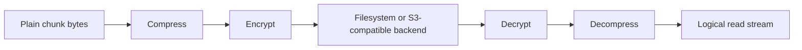

# 06. Storage Pipeline and Backends

The storage pipeline transforms logical chunk bytes into durable backend objects and reverses that transformation on reads.

```mermaid
flowchart LR
    Plain["Plain chunk bytes"] --> Compress["Compress"]
    Compress --> Encrypt["Encrypt"]
    Encrypt --> Backend["Filesystem or S3-compatible backend"]
    Backend --> Decrypt["Decrypt"]
    Decrypt --> Decompress["Decompress"]
    Decompress --> Read["Logical read stream"]
```

## Pipeline contract

Processors have explicit ordering. Writes apply compression before encryption; reads apply the inverse order. A processor may wrap a stream but must preserve asynchronous cancellation, ownership, and disposal semantics.

The pipeline exposes operations for existence, reads, writes, deletion, size lookup, enumeration, and write reservation. Callers should use the pipeline rather than addressing a concrete backend directly.

## Backend selection

Cotton supports:

- local filesystem storage under a configured durable root;
- S3-compatible object storage using configured endpoint, region, bucket, and credentials.

Backend selection is an instance setting. Startup and browser unlock use the same backend factory and configuration rules as the normal runtime; there is no separate probe implementation.

Storage keys are opaque logical identifiers. Local storage may distribute keys across subdirectories, while S3 stores the same logical key as an object key. Application code must not depend on either physical layout.

## Write behavior

A write is complete only after transformed bytes have reached the backend and the backend can report their stored size. The database records metadata after that point.

Write reservation prevents normal concurrent operations from exceeding configured capacity. Capacity exhaustion maps to an explicit insufficient-storage outcome rather than a partial successful write.

Normal user workflows should wait behind bounded coordination when possible. Abuse protection may reject hostile traffic, but storage concurrency is not implemented as a blanket user-facing rate limit.

## Read behavior

Reads return logical plaintext streams. Multi-chunk file reads concatenate manifest chunks in order and propagate cancellation through backend, decrypt, decompress, and consumer stages.

Seekable or ranged reads may resolve only the encrypted chunks needed for the requested logical range. They must still authenticate every decrypted chunk and cannot bypass CTN2 framing rules.

Synchronous `Stream` members are retained where the base contract requires them, but internal I/O uses asynchronous APIs whenever available.

## Filesystem backend

- The storage root must be durable and writable.
- Writes use temporary state and an atomic final placement where supported.
- Enumeration must not treat temporary or unrelated files as live Cotton objects.
- Free-space checks and reservations use the same configured root.

## S3-compatible backend

- Credentials are decrypted before the client is constructed.
- Reads and writes are streamed.
- Compatibility options are limited to observable provider differences; they must not weaken object identity or integrity checks.
- Hashing of response streams is asynchronous so slow object storage does not block worker threads.
- Transport failures remain distinguishable from missing objects and authentication failures.

## Storage pressure

Capacity checks combine observed backend availability with active reservations. Notifications are throttled so one sustained pressure event does not flood administrators.

The pressure guard does not replace backend errors: a write can still fail after admission because external capacity or connectivity changed.

## Operational probe

The storage probe writes, reads, verifies, and removes a small object through the configured pipeline. It validates the complete transform and backend path rather than merely checking network connectivity.

Probe cleanup is best-effort but visible failures are reported. Probe objects must not become permanent liveness references.

## Related sections

- [Content-addressed storage](04-content-addressed-storage.md)
- [Cryptography engine](07-cryptography-engine.md)
- [Configuration and startup](25-configuration-startup.md)
- [Deployment and operations](27-deployment-operations.md)
