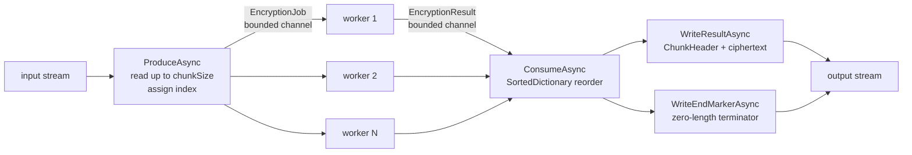
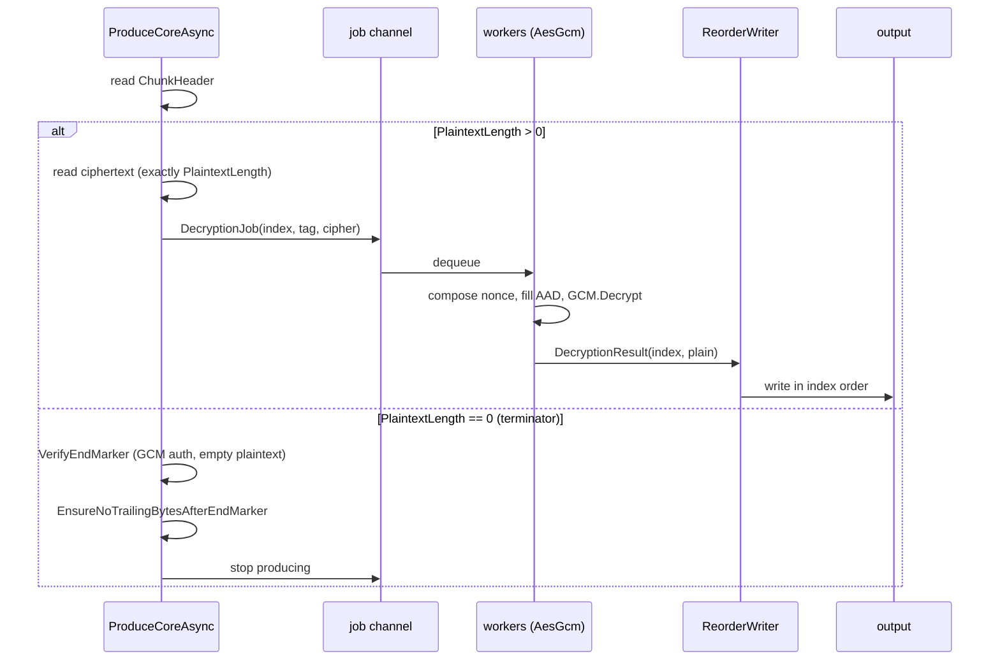
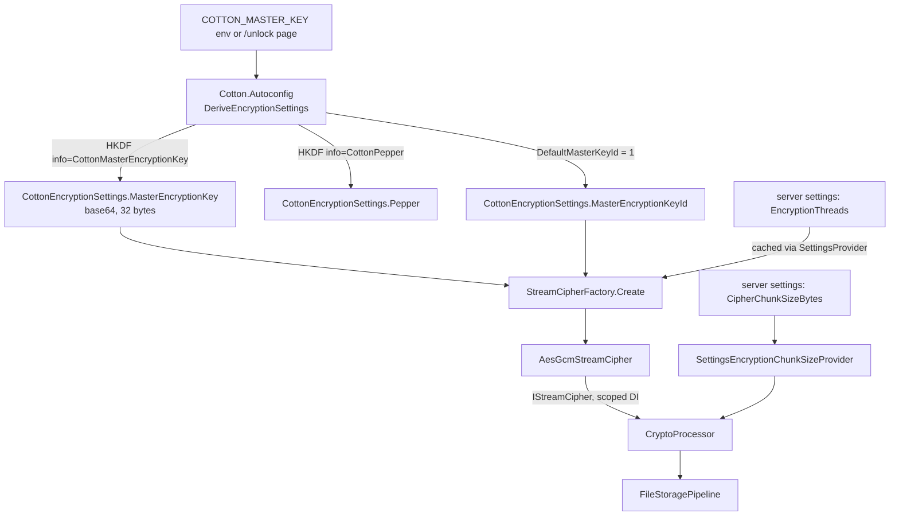

# 07. Cryptography Engine: Streaming AES-GCM

Cotton's cryptography engine is a self-contained, pure-managed C# streaming AES-256-GCM cipher that encrypts and decrypts blob bytes inside the storage pipeline. It is implemented in the `Cotton.Crypto` project (assembly `Cotton.Crypto`, root namespace `Cotton.Crypto`, targeting `net10.0`) and is exposed to the rest of the server through the `EasyExtensions.Abstractions.IStreamCipher` interface that `AesGcmStreamCipher` implements. The design splits a plaintext stream into fixed-size chunks, encrypts each chunk independently under a per-file random key with a deterministically derived per-chunk nonce, frames each ciphertext chunk with its own GCM authentication tag, and runs the work across a bounded parallel pipeline built on channels and `System.IO.Pipelines`. The result is a format that supports arbitrary parallelism, deterministic ordering, authenticated end-of-stream detection, and — because chunk nonces are derived from the chunk index — out-of-order chunk decryption, which is what makes range reads and preview extraction from encrypted storage possible.

> **README/code discrepancy:** The repository `README.md` repeatedly attributes the cipher to a NuGet package named **EasyExtensions.Crypto** (e.g. "Crypto is powered by **EasyExtensions.Crypto** (NuGet)", the architecture note "_See: `EasyExtensions.Crypto/AesGcmStreamCipher.cs` …_", and the dependency line "**EasyExtensions.Crypto** (NuGet) — streaming AES-GCM, key derivation, hashing"). In the actual source, the engine lives in-repo under `src/Cotton.Crypto/` with namespace `Cotton.Crypto`; there is no `EasyExtensions.Crypto` package referenced by `src/Cotton.Crypto/Cotton.Crypto.csproj`, which references only `EasyExtensions` version `3.0.65` (that package supplies the `IStreamCipher` abstraction and the `EncryptString`/`DecryptString` string helpers). The string "EasyExtensions.Crypto" survives only in a code comment in `src/Cotton.Crypto/Internals/FormatConstants.cs`. When this section says "the cipher," it means `Cotton.Crypto.AesGcmStreamCipher`.

## Purpose & overview

The engine provides authenticated, streaming, parallel symmetric encryption with these guarantees:

- **AES-256-GCM** with a 16-byte (128-bit) authentication tag and a 12-byte nonce (`System.Security.Cryptography.AesGcm`).
- **Per-file random data key**, itself wrapped (encrypted) under the configured master key and stored in the stream header.
- **Per-chunk authentication**: every chunk carries its own GCM tag; tampering with any chunk fails decryption of that chunk.
- **Deterministic nonces** derived from a per-file random prefix plus the chunk index, so chunks can be decrypted out of order and a chunk's nonce is computable from its index alone.
- **Authenticated end-of-stream terminator** (current format `CTN2`) so that truncation cannot be silently accepted, even on non-seekable transports.
- **Bounded parallelism and bounded memory** via worker channels, a reorder structure, and a pooled, capped `BufferScope`.

Per the README, the encryption core was conceived and built first, on the premise that crypto throughput would not become the system bottleneck. That is a project-history claim, not a code-verifiable fact.

## Key components & responsibilities

| Component | File | Responsibility |
|---|---|---|
| `AesGcmStreamCipher` | `src/Cotton.Crypto/AesGcmStreamCipher.cs` | Public cipher. Implements `IStreamCipher` and `IDisposable`. Generates the per-file key + nonce prefix, wraps the file key, writes the file header, and drives the encrypt/decrypt pipelines. Holds the master key. |
| `AesGcmStreamFormat` | `src/Cotton.Crypto/Internals/AesGcmStreamFormat.cs` | `internal static` helpers for nonce composition, AAD construction, header build/parse, and exact-length stream reads. |
| `FileHeader`, `ChunkHeader` | `src/Cotton.Crypto/Internals/Headers.cs` | `internal readonly struct` layouts for the per-file header and per-chunk header, with `TryWrite`/`TryRead` and `ComputeLength`. |
| `FormatConstants` | `src/Cotton.Crypto/Internals/FormatConstants.cs` | Magic bytes and format versions (`CTN1` legacy, `CTN2` current), version detection, and the terminator-required rule. |
| `Tag128` | `src/Cotton.Crypto/Internals/Tag128.cs` | Allocation-free 128-bit GCM tag value type (two `ulong`s) with little-endian span conversion. |
| `EncryptionPipeline` | `src/Cotton.Crypto/Internals/Pipelines/EncryptionPipeline.cs` | Producer → worker pool → ordered consumer for encryption; writes framed chunks and the end marker. |
| `DecryptionPipeline` | `src/Cotton.Crypto/Internals/Pipelines/DecryptionPipeline.cs` | Producer (parse + read ciphertext) → worker pool → reorder writer for decryption; verifies the terminator and total length. |
| `ReorderBuffer<T>` | `src/Cotton.Crypto/Internals/Pipelines/ReorderBuffer.cs` | Generic growable ring buffer that re-sequences out-of-order indexed items. (See the gotchas section regarding actual usage.) |
| `PipelineTaskHelpers` | `src/Cotton.Crypto/Internals/Pipelines/PipelineTaskHelpers.cs` | Cancellation-on-failure wiring, channel completion propagation, best-effort task observation during cleanup. |
| `EncryptionJob` / `EncryptionResult` / `DecryptionJob` / `DecryptionResult` | `src/Cotton.Crypto/Internals/AesGcmPipelineModels.cs` | `internal readonly struct`s passed through the channels. (The file has no enclosing type named `AesGcmPipelineModels`.) |
| `BufferScope` | `src/Cotton.Crypto/Internals/BufferScope.cs` | Pooled buffer manager with count/byte caps, reference-identity tracking, and zero-on-dispose. |
| `ReferenceEqualityComparer<T>` | `src/Cotton.Crypto/Internals/ReferenceEqualityComparer.cs` | Reference-identity comparer used by `BufferScope` so equal-content arrays aren't conflated. |
| `KeyDerivation` | `src/Cotton.Crypto/KeyDerivation.cs` | HKDF (RFC 5869) over HMAC-SHA256 subkey derivation. |
| `HashHelpers` | `src/Cotton.Crypto/Helpers/HashHelpers.cs` | 256-bit lowercase-hex hash validation; legacy `HashToHex` (marked `[Obsolete]`). |
| `RandomHelpers` | `src/Cotton.Crypto/Helpers/RandomHelpers.cs` | `GetRandomBytes(int)` via a freshly created `RandomNumberGenerator`. |
| `AesGcmKeyHeader` | `src/Cotton.Crypto/Models/AesGcmKeyHeader.cs` | Public `readonly record struct` for serializing/parsing a header outside the pipeline. |
| `ByteChunk` | `src/Cotton.Crypto/Models/ByteChunk.cs` | Public `(byte[] Buffer, int Length)` `readonly struct` documenting pool-ownership transfer. |
| `StreamCipherFactory` | `src/Cotton.Server/Services/StreamCipherFactory.cs` | `internal static` server-side construction of `AesGcmStreamCipher` from `CottonEncryptionSettings`. |
| `CryptoExtensions` | `src/Cotton.Server/Extensions/CryptoExtensions.cs` | Presigned-token encrypt/decrypt helpers built on the `IStreamCipher` string helpers. |
| `CryptoProcessor` | `src/Cotton.Storage/Processors/CryptoProcessor.cs` | Storage-pipeline processor (`IStorageProcessor`) that calls `EncryptAsync`/`DecryptAsync` on blob streams. |

The project also ships `src/Cotton.Crypto/InternalsVisibleTo.Tests.cs`, which grants `Cotton.Crypto.Tests` access to internal types so the format, pipelines, and `BufferScope` can be unit-tested directly.

## On-disk / stream format

Every encrypted blob is laid out as:

```
[ FileHeader ] [ ChunkHeader | ciphertext ]* [ ChunkHeader (zero-length terminator) ]
```

Integers are little-endian throughout. All sizes below reflect the constants used by the cipher: `NonceSize = 12`, `TagSize = 16`, `KeySize = 32`.

### File header (84 bytes)

Produced by `FileHeader.TryWrite` (`Headers.cs`). `FileHeader.ComputeLength(nonceSize, tagSize, keySize) = 4 + 4 + 8 + 4 + 4 + nonceSize + tagSize + keySize` → `4+4+8+4+4+12+16+32 = 84`.

| Offset | Size | Field | Notes |
|---|---|---|---|
| 0 | 4 | magic | `CTN2` (current) or `CTN1` (legacy) |
| 4 | 4 | header length | equals 84 for the current sizes; validated on read |
| 8 | 8 | `TotalPlaintextLength` | total plaintext bytes if the input was seekable, else `0` |
| 16 | 4 | `KeyId` | must match the configured key id on decrypt |
| 20 | 4 | `NoncePrefix` | per-file random 4-byte nonce prefix (`uint`) |
| 24 | 12 | file-key nonce | nonce used to wrap the per-file key under the master key |
| 36 | 16 | file-key tag | GCM tag of the wrapped key |
| 52 | 32 | encrypted file key | the per-file data key, AES-GCM-wrapped under the master key |

> Only a 16-byte tag is supported for the file header: `FileHeader.TryWrite` and `FileHeader.TryRead` both return `false` for any `tagSize != 16`.

### Chunk header (36 bytes)

Produced by `ChunkHeader.TryWrite`. `ChunkHeader.ComputeLength(tagSize) = 4 + 4 + 8 + 4 + tagSize` → `4+4+8+4+16 = 36`.

| Offset | Size | Field | Notes |
|---|---|---|---|
| 0 | 4 | magic | `CTN2`/`CTN1` |
| 4 | 4 | header length | equals 36 |
| 8 | 8 | `PlaintextLength` | length of this chunk's plaintext; `0` marks the authenticated terminator |
| 16 | 4 | `KeyId` | must match the file's key id |
| 20 | 16 | `Tag` | GCM tag for this chunk's ciphertext |

The ciphertext immediately follows its header and is exactly `PlaintextLength` bytes (AES-GCM is length-preserving; the tag is carried in the header, not appended to the ciphertext). Per-chunk framing overhead is therefore a fixed **36 bytes per chunk**, plus the one **84-byte** file header and one trailing **36-byte** terminator header.

### Format versions

`FormatConstants` defines:

| Constant | Value | Magic |
|---|---|---|
| `LegacyVersion` | 1 | `CTN1` (`"CTN1"u8`) |
| `CurrentVersion` | 2 | `CTN2` (`"CTN2"u8`) |

`CTN1` predates the authenticated terminator. `FormatConstants.RequiresAuthenticatedTerminator(formatVersion)` returns `true` for `formatVersion >= CurrentVersion` (i.e. `CTN2` and newer): a `CTN2` reader must see the zero-length MACed terminator and throws `EndOfStreamException` ("Encrypted stream ended before its authenticated terminator.") if the stream ends without it. `CTN1` blobs are treated as complete at transport EOF. New writes always emit `CTN2` (header and chunk headers default to `FormatConstants.CurrentVersion`). The format version is read from the file-header magic and threaded through to the decryption pipeline and per-chunk parsing: `ChunkHeader.TryRead` accepts an `expectedFormatVersion` and rejects a chunk whose magic does not match, so a reader fast-fails on mixed-version chunks.

### 12-byte nonce layout

Confirmed in `AesGcmStreamFormat.ComposeNonce`: the 12-byte IV is `[4-byte file prefix (uint, LE)] || [8-byte chunk counter (ulong, LE)]`. The file prefix is random per file; the counter is the zero-based chunk index. Because the counter is 64-bit, the maximum number of chunks per file is `2^64 - 1`; if the counter equals `ulong.MaxValue` the method throws `InvalidOperationException` to prevent IV reuse. The same overflow guard is also enforced in the producers of both pipelines (`EncryptionPipeline.ProduceAsync` and `DecryptionPipeline.EnsureChunkIndexCanBePublished`).

This nonce derivation is the load-bearing property for seekable encrypted reads: any chunk's nonce is computable from its index without reading prior chunks, which is what lets the storage layer fetch and decrypt an arbitrary chunk for `Range` responses and preview extraction (see *Storage Pipeline* and *Seekable Reads / Range Requests*).

### Associated data (AAD)

The cipher binds metadata into GCM associated data so it is authenticated even though it is not encrypted.

**Per-chunk AAD** is a fixed 32-byte buffer. `InitAadPrefix` writes the immutable prefix once per worker; `FillAadMutable` rewrites the per-chunk fields before each `Encrypt`/`Decrypt`:

| Offset | Size | Field (source) |
|---|---|---|
| 0 | 4 | magic for the format version (`GetMagicBytes`) |
| 4 | 4 | format version (`Int32`) |
| 8 | 4 | `keyId` (`Int32`) |
| 12 | 8 | chunk index (`Int64`) |
| 20 | 8 | plaintext length of the chunk (`Int64`) |
| 28 | 4 | reserved, written as `0` |

Binding the chunk index and length into the AAD means a chunk cannot be replayed at a different position, nor have its declared length altered, without failing authentication.

**Per-file-key AAD** (`BuildKeyAad`) is `4 + 4 + 8 + 4 + 4 + nonceSize` = 36 bytes (with `nonceSize = 12`) and binds the wrapped file key to immutable header metadata: `magic(4) || headerLength(4) || totalPlaintextLength(8) || keyId(4) || noncePrefix(4) || fileKeyNonce(NonceSize)`. This prevents an attacker from swapping the nonce prefix, key id, total length, header length, or wrapping nonce on a captured header. `BuildKeyAad` takes the `formatVersion` so the magic in the key AAD matches the header version on both encrypt (`CurrentVersion`) and decrypt (`header.FormatVersion`).

## How encryption works

`EncryptAsync(Stream input, Stream output, int chunkSize = DefaultChunkSize, bool leaveInputOpen = true, bool leaveOutputOpen = true, CancellationToken ct = default)` in `AesGcmStreamCipher.cs`:

1. Validate that both streams are non-null, `input.CanRead`, and `output.CanWrite`, and that `MinChunkSize (8 KiB) ≤ chunkSize ≤ MaxChunkSize (64 MiB)`.
2. Compute the effective window cap for the chunk size (`ComputeEffectiveWindowCap(chunkSize)`).
3. Rent a buffer for the 32-byte **file key** from the shared pool and fill it from the RNG; generate a random 4-byte **nonce prefix** (read as a little-endian `uint`).
4. Wrap the file key: `new AesGcm(masterKey, TagSize).Encrypt(fileKeyNonce, fileKey, encryptedFileKey, tagSpan, associatedData: BuildKeyAad(...))`. `totalPlaintextLength` is `Math.Max(0, input.Length - input.Position)` if `input.CanSeek`, else `0`.
5. Build and write the 84-byte file header (`BuildFileHeader` → `FileHeader.TryWrite`).
6. Run an `EncryptionPipeline` that chunks, encrypts in parallel, reorders, and frames the output, finishing with the authenticated terminator.
7. In `finally`: zero the file key with `CryptographicOperations.ZeroMemory`, return it to the pool, and (only if `leaveInputOpen`/`leaveOutputOpen` are false) dispose the streams.

### Encryption pipeline (chunking → parallel encrypt → reorder → framed output)



`EncryptionPipeline.RunAsync` sets up:

- A bounded `EncryptionJob` channel (`SingleWriter`) and a bounded `EncryptionResult` channel (`SingleReader`), each sized `threads * 4`, both with `FullMode = BoundedChannelFullMode.Wait`, so production blocks when workers fall behind (backpressure).
- A `BufferScope` sized for the worst-case in-flight buffer count: `maxCount = jobCap + threads + resCap + allowedBacklog`, where `jobCap = resCap = threads * 4` and `allowedBacklog = min(windowCap * 2, 32768)`; `maxBytes = NextPow2(chunkSize) * maxCount` (`NextPow2` has a floor of 16).
- A linked `CancellationTokenSource`; `PipelineTaskHelpers.CancelOnFailure` cancels the whole pipeline if the producer, the workers, or the consumer faults or cancels.

Stages:

- **`ProduceAsync`** rents a `chunkSize` buffer from the scope, reads up to `chunkSize` bytes, assigns the next monotonically increasing index, and writes an `EncryptionJob(index, buffer, read)`. A read of `<= 0` bytes ends production and recycles the empty buffer. On a read failure the buffer is recycled and the throw propagates; the job-channel writer is always completed (with the error, if any) in `finally`.
- **`StartWorkersAsync`** runs `threads` workers. Each worker owns its own `AesGcm` instance over the file key (GCM instances are not shared across threads), a reusable nonce buffer, and a 32-byte AAD buffer pre-initialized via `InitAadPrefix`. For each job it composes the nonce from `(noncePrefix, index)`, fills the mutable AAD, encrypts into a freshly rented ciphertext buffer, captures the tag into a `Tag128` (written directly through a stack span via `MemoryMarshal.CreateSpan`/`AsBytes` to avoid allocation), publishes an `EncryptionResult`, and recycles the plaintext (job) buffer in `finally`.
- **`ConsumeAsync`** reorders results using a `SortedDictionary<long, EncryptionResult>` keyed by index, writing them strictly in index order via `WriteResultAsync` (which writes the chunk header from a pool-rented buffer, then the ciphertext, then recycles the ciphertext buffer). After all data chunks are flushed it calls `WriteEndMarkerAsync`. Any buffers still pending on exit are recycled in `finally`.

The **end marker** (`WriteEndMarkerAsync`) encrypts an empty plaintext at the next chunk index with `plainLength = 0` in the AAD, producing a chunk header with `PlaintextLength = 0` and a valid GCM tag. This is the authenticated terminator: it lets a reader prove it reached EOF rather than trusting transport EOF. `WriteEndMarkerAsync` and `WriteResultAsync` rent their small header/nonce/AAD buffers directly from the shared `ArrayPool<byte>`, separate from the bulk `BufferScope`, returning the nonce and AAD buffers with `clearArray: true`.

## How decryption works

`DecryptAsync(Stream input, Stream output, bool leaveInputOpen = true, bool leaveOutputOpen = true, CancellationToken ct = default)`:

1. Read and validate the file header (`AesGcmStreamFormat.ReadFileHeaderAsync`). The magic must be a recognized version and the header length must equal the expected 84 bytes; otherwise `InvalidDataException`.
2. Reject the blob if `header.KeyId != _keyId` (throws `InvalidDataException` "Key ID mismatch. Expected … but file has …").
3. Unwrap the file key: `new AesGcm(masterKey, TagSize).Decrypt(header.Nonce, header.EncryptedKey, tag, fileKey, associatedData: BuildKeyAad(...))` using the header's own `FormatVersion`. A tampered header fails here with a `CryptographicException`.
4. Compute `effectiveWindowCap = ComputeEffectiveWindowCap(DefaultChunkSize)` (note: decryption sizes the window from `DefaultChunkSize`, since chunk sizes are read from the stream, not configured), run a `DecryptionPipeline`, then zero and return the file key.



`DecryptionPipeline.RunAsync`:

- **`ProduceCoreAsync` / `TryReadAndPublishJobAsync`** read each chunk header. A zero-`PlaintextLength` header is treated as the terminator: `VerifyEndMarker` re-derives the AAD/nonce for that index and GCM-decrypts the empty record; on tag failure it throws `AuthenticationTagMismatchException` ("Stream terminator authentication failed."). It then calls `EnsureNoTrailingBytesAfterEndMarkerAsync` (seekable: `input.Position` must equal `input.Length`; non-seekable: a 1-byte probe read must return 0) to reject appended bytes with `InvalidDataException` ("Unexpected data after encrypted stream terminator."). For a data chunk, `ValidateDataChunkHeader` checks `KeyId` and `0 < PlaintextLength ≤ maxChunkSize` (and, for seekable input, that enough bytes remain), then `ReadCiphertextAsync` reads exactly `PlaintextLength` bytes (`ReadExactlyAsync`) and a `DecryptionJob` is published. If the stream ends without a terminator and the format requires one (`CTN2`), `TryReadAndPublishJobAsync` throws `EndOfStreamException`; for `CTN1` it simply stops at transport EOF.
- **`StartWorkersAsync`** mirrors encryption: per-worker `AesGcm`, nonce buffer, and AAD (initialized with the stream's `formatVersion`). Each worker GCM-decrypts into a rented plaintext buffer; a `CryptographicException` is wrapped as `AuthenticationTagMismatchException` ("Chunk authentication failed."). The ciphertext (job) buffer is always recycled.
- **`ConsumeAsync`** drives a private nested `ReorderWriter` (a growable ring buffer) that writes plaintext to the output strictly in index order, accumulating `TotalWritten`. Duplicate indices (`result.Index < _nextToWrite`) throw `InvalidDataException` ("Duplicate chunk index detected…") and ring-slot collisions throw `InvalidDataException` ("Reorder buffer slot collision…").
- After all stages complete (and a cancellation re-check), if `strictLength` is enabled and the header recorded a positive `TotalPlaintextLength`, the pipeline throws `InvalidDataException` ("Decrypted length mismatch. Expected: … Actual: …") unless `written == expectedTotal`.

The decryption `BufferScope` uses `allowedBacklog = min(windowCap * 2, 8192)`, `maxCount = jobCap + threads + resCap + allowedBacklog`, and `maxBytes = (long)maxChunkSize * maxCount * 4`. The job and result channels are both bounded at `threads * 4` with `FullMode = Wait`.

## Streaming (one-arg) overloads and the outer Pipe

`EncryptAsync(Stream input, int chunkSize = DefaultChunkSize, bool leaveOpen = false, CancellationToken ct = default)` and `DecryptAsync(Stream input, bool leaveOpen = false, CancellationToken ct = default)` return `Task<Stream>` and wrap the two-stream methods in a `System.IO.Pipelines.Pipe`. They start a background `Task.Run` that feeds `pipe.Writer.AsStream()` while the caller reads `pipe.Reader.AsStream()` as a `Stream`. The pipe uses a small, bounded buffer independent of the internal windowing, computed once in the constructor:

- `pauseWriterThreshold` defaults to **1 MiB**; if a `memoryLimitBytes` cap is configured it is `min(1 MiB, max(256 KiB, memoryLimitBytes / 64))`.
- `resumeWriterThreshold = max(1, pauseWriterThreshold / 2)`.
- `minimumSegmentSize = 4096`, `useSynchronizationContext = false`, pool `MemoryPool<byte>.Shared`.

Background-task exceptions are surfaced by completing the pipe writer with the exception (`OperationCanceledException` and any other `Exception` are both routed to `pipe.Writer.CompleteAsync(ex)`), so they propagate to the reader. The background task disposes `input` in `finally` unless `leaveOpen` is true. These are the overloads that `CryptoProcessor` actually calls.

## Constructor, configuration, and defaults

`AesGcmStreamCipher` constructor:

```csharp
public AesGcmStreamCipher(
    ReadOnlyMemory<byte> masterKey,
    int keyId = 1,
    int? threads = null,
    int threadsLimitMultiplier = 2,
    int windowCap = 1024,
    bool strictLengthCheck = true,
    RandomNumberGenerator? rng = null,
    long? memoryLimitBytes = null)
```

| Public constant | Value |
|---|---|
| `TagSize` | 16 |
| `KeySize` | 32 |
| `NonceSize` | 12 |
| `MinChunkSize` | 8 KiB (`8 * 1024`) |
| `MaxChunkSize` | 64 MiB (`64 * 1024 * 1024`) |
| `DefaultChunkSize` | 1 MiB (`1 * 1024 * 1024`) |

Validation and behavior:

- `masterKey` must be exactly `KeySize` (32) bytes, else `ArgumentException`.
- `keyId > 0`, `threadsLimitMultiplier >= 1`, and `windowCap >= 4`, else `ArgumentOutOfRangeException`; `memoryLimitBytes` (if set) must be `>= MinChunkSize * 4`.
- `_maxThreads = max(1, ProcessorCount * threadsLimitMultiplier)`. If `threads` is supplied it must be in `[1, _maxThreads]`. The private `ConcurrencyLevel` field defaults to `min(4, ProcessorCount)`; when `threads` is given it is set to that value, then clamped to `[1, _maxThreads]`.
- `ComputeEffectiveWindowCap(chunkSize)`: with no memory limit, returns `Clamp(windowCap, 4, int.MaxValue)`. With a memory limit, it clamps `chunkSize` to `[MinChunkSize, MaxChunkSize]`, estimates per-window footprint as `chunkSize + 64 KiB`, derives `maxWindowsByMem = max(4, memoryLimitBytes / perWindow)`, and returns `min(windowCap, effective)`.
- `Dispose()` zeroes the master key bytes (`CryptographicOperations.ZeroMemory`), disposes the RNG, and suppresses finalization.

> **Important — the server does not configure window/memory caps.** `threadsLimitMultiplier`, `windowCap`, `strictLengthCheck`, `rng`, and `memoryLimitBytes` are **not** surfaced by any server setting. `StreamCipherFactory.Create` constructs the cipher with only `keyMaterial`, `settings.MasterEncryptionKeyId`, and the chosen `threads`, so in production these run at their defaults: `threadsLimitMultiplier = 2`, `windowCap = 1024`, `strictLengthCheck = true`, a default `RandomNumberGenerator`, and no `memoryLimitBytes`. The README's mention of "window/memory limits" reflects the constructor API, not a configurable operator surface.

### Server wiring



- **`CottonEncryptionSettings`** (`src/Cotton.Shared/CottonEncryptionSettings.cs`) carries exactly four properties: `Pepper`, `MasterEncryptionKey` (base64 string), `MasterEncryptionKeyId` (`int`), and `EncryptionThreads` (`int`). `Cotton.Autoconfig` (`src/Cotton.Autoconfig/Extensions/ConfigurationBuilderExtensions.cs`) derives `Pepper` and `MasterEncryptionKey` from the root key via `KeyDerivation.DeriveSubkeyBase64(rootKey, "CottonPepper"/"CottonMasterEncryptionKey", DefaultKeyLength)` and sets `MasterEncryptionKeyId = DefaultMasterKeyId` (= 1). The root `COTTON_MASTER_KEY` must be exactly `DefaultKeyLength` (32) **characters**; the env var (and the Postgres password) is cleared from the process/user environment after derivation. Note: `Autoconfig` writes only `Pepper`, `MasterEncryptionKey`, and `MasterEncryptionKeyId` into configuration — it does **not** set `EncryptionThreads`; that value comes from server settings. See *Master Key & Bootstrap* and *Configuration / Autoconfig*.
- **`StreamCipherFactory.Create`** (`src/Cotton.Server/Services/StreamCipherFactory.cs`) base64-decodes `MasterEncryptionKey`, picks the thread count (an explicit `encryptionThreadsOverride > 0`, else `settings.EncryptionThreads > 0`, else `null` → automatic), clamps any non-null value to `[1, max(1, ProcessorCount * 2)]`, and constructs the cipher with `settings.MasterEncryptionKeyId`.
- **DI**: `ServiceCollectionExtensions.AddStreamCipher` registers `IStreamCipher` **scoped**, resolving `CottonEncryptionSettings` and passing `SettingsProvider.GetCachedEncryptionThreads()` as the override. That method does a `Volatile.Read` of a static field populated by `CacheRuntimePipelineSettings` from the server-settings `EncryptionThreads`; it returns `null` when the cached value is `<= 0`, in which case the factory falls back to `settings.EncryptionThreads`, and ultimately to automatic concurrency.
- **`CryptoProcessor`** (`src/Cotton.Storage/Processors/CryptoProcessor.cs`) has `Priority => 1000`. `WriteAsync` calls `_cipher.EncryptAsync(stream, _chunkSizeProvider.ChunkSizeBytes)`; `ReadAsync` calls `_cipher.DecryptAsync(stream)`. The chunk size comes from `SettingsEncryptionChunkSizeProvider` (`src/Cotton.Server/Services/SettingsEncryptionChunkSizeProvider.cs`), whose `ChunkSizeBytes` reads `CipherChunkSizeBytes` from server settings. `CryptoProcessor` also has a parameterless-cipher constructor that defaults to a `StaticEncryptionChunkSizeProvider(AesGcmStreamCipher.DefaultChunkSize)`. The pipeline (`FileStoragePipeline`) orders processors so writes run highest-priority first and reads lowest-priority first; see the ordering note below and the *Storage Pipeline* section.

> **README/code note:** `CipherChunkSizeBytes` is a property of the **server settings entity** (`CottonServerSettings`, read via `SettingsProvider` / `SettingsEncryptionChunkSizeProvider`), **not** a field of `CottonEncryptionSettings`. The latter exposes only `Pepper`, `MasterEncryptionKey`, `MasterEncryptionKeyId`, and `EncryptionThreads`. The default `CipherChunkSizeBytes` is **1 MiB** (`defaultCipherChunkSizeBytes` in `SettingsProvider`).

#### Storage-pipeline ordering

`FileStoragePipeline` (`src/Cotton.Storage/Pipelines/FileStoragePipeline.cs`) orders the registered `IStorageProcessor`s by `Priority`. `CompressionProcessor.Priority` is `10000` and `CryptoProcessor.Priority` is `1000`. On **write**, processors run `OrderByDescending(Priority)` → compression (10000) then crypto (1000), then the backend write. On **read**, processors run `OrderBy(Priority)` over the backend stream → crypto (1000, decrypt) then compression (10000, decompress). So the effective flow is **plaintext → compress → encrypt → backend** on writes and the exact reverse on reads.

#### Admin-configurable crypto settings

Both endpoints below live on `SettingsController`, which is routed at both `Routes.V1.Settings` (`/api/v1/settings`) and `Routes.V1.Server + "/settings"` (`/api/v1/server/settings`), and both require the `Admin` role.

| Method & route | Setting | Validation |
|---|---|---|
| `PATCH /api/v1/settings/cipher-chunk-size/{cipherChunkSizeBytes:int}` | `CipherChunkSizeBytes` | must be in `[AesGcmStreamCipher.MinChunkSize, AesGcmStreamCipher.MaxChunkSize]` (8 KiB … 64 MiB), else `400` with the supported set |
| `PATCH /api/v1/settings/encryption-threads/{encryptionThreads:int}` | `EncryptionThreads` | must be in `[1, GetMaxEncryptionThreads()]` where `GetMaxEncryptionThreads() = max(1, ProcessorCount)`, else `400` |

`EncryptionThreads` defaults to **2** (`defaultEncryptionThreads`). Note the asymmetry: the settings endpoint caps `EncryptionThreads` at `ProcessorCount`, while the factory/cipher hard cap is `ProcessorCount * 2` (via `threadsLimitMultiplier = 2`). Changing either setting writes through `SettingsProvider.SetPropertyAsync`, which refreshes the cached pipeline values.

### String/token helpers

`CryptoExtensions` (`src/Cotton.Server/Extensions/CryptoExtensions.cs`) builds presigned download tokens. `GetPresignedToken` formats `"{hexHash}|{expireAt:R}"` (expiry default `TimeSpan.FromDays(1)`), encrypts it with `IStreamCipher.EncryptString` (from `EasyExtensions.Extensions.StreamCipherExtensions`), and hex-encodes the bytes via `Convert.ToHexString(...).ToLower()`. `DecryptPresignedToken` reverses this: it converts from a hex hash string (`Hasher.FromHexStringHash`), `DecryptString`s it, splits on `|`, parses the expiry, throws if expired, and returns the decoded hash bytes. The same `EncryptString`/`DecryptString` helpers back TOTP-secret encryption in `AuthController` (`user.TotpSecretEncrypted`), transparent column encryption in `CottonDbContext`, and master-key sentinel handling in `MasterKeyStartupStorage`.

## Buffer management

`BufferScope` (`src/Cotton.Crypto/Internals/BufferScope.cs`) wraps `ArrayPool<byte>.Shared` (the cipher's static `BufferPool`) with hard ceilings:

- Tracks live rentals in a `ConcurrentDictionary<byte[], byte?>` keyed by **reference identity** (`ReferenceEqualityComparer<byte[]>.Instance`), plus running `_count` and `_bytes` via `Interlocked`. It also keeps `_tracked` and `_free` `ConcurrentBag`s.
- `Rent(minimumLength)` first tries to reuse a recycled buffer from `_free` that is large enough; otherwise rents fresh from the pool. If a rental would exceed `maxCount` or `maxBytes`, it undoes the accounting and either re-queues the reused buffer or, for a fresh pool rental, returns it to the pool and throws `InvalidOperationException("BufferScope limit exceeded.")`. This is the bounded-memory backstop. (`minimumLength` must be positive.)
- `Recycle(buffer)` removes the buffer from the active set (decrementing the counters) and pushes it onto the free bag for reuse **within the scope** — it is *not* returned to the shared pool until disposal.
- `Dispose()` deduplicates all tracked/free/active buffers via a reference-identity `HashSet`, `Array.Clear`s each (zeroing any residual plaintext/ciphertext), and returns each to the shared pool exactly once.

`ByteChunk` and `AesGcmKeyHeader` are public surface. `ByteChunk` documents pool-ownership transfer to the receiver. `AesGcmKeyHeader.ToBytes`/`FromStream` provide standalone header (de)serialization, including a best-effort fallback to a compact chunk header when the buffer is not a full file header (see gotchas).

## KeyDerivation, hashing, randomness

- **`KeyDerivation`** (`src/Cotton.Crypto/KeyDerivation.cs`) implements HKDF (RFC 5869) over HMAC-SHA256 manually: `HkdfExtract` (HMAC over the IKM with the salt as key, defaulting to `HmacOutputLength = 32` zero bytes per RFC 5869 §2.2) then `HkdfExpand` (`T(1) = HMAC(PRK, info || 0x01)`, `T(i) = HMAC(PRK, T(i-1) || info || i)`). Intermediate buffers (`prk`, `tPrev`, `data`, `infoBytes`, plus the string overload's UTF-8 inputs) are zeroed via `CryptographicOperations.ZeroMemory`. Expansion is capped at 255 blocks (`n > 255` throws `ArgumentOutOfRangeException`). `DeriveSubkey(ReadOnlySpan<byte> masterKey, ReadOnlySpan<byte> info, int lengthBytes, ReadOnlySpan<byte> salt = default)` is the byte-span core; the string overloads UTF-8-encode their inputs, and `DeriveSubkeyBase64` returns base64. This is what `Autoconfig` uses to split the root master key into the data master key and the pepper.
- **`HashHelpers`** (`src/Cotton.Crypto/Helpers/HashHelpers.cs`) validates lowercase 64-hex-char (256-bit) strings via a `[GeneratedRegex]` compiled `^[0-9a-f]{64}$` (`IsValidHash`). `HashToHex(Stream)` computes a SHA-256 lowercase-hex digest and is marked `[Obsolete]`. **Note:** its obsolete message points callers to `Cotton.Crypto.Hashing.HashingExtensions.ComputeHashToHex`, but no such type, namespace, or method exists anywhere in the repository — the suggested replacement is a dangling reference. `HashToHex` itself remains the only functioning hash-to-hex helper in `Cotton.Crypto`.
- **`RandomHelpers.GetRandomBytes(int)`** (`src/Cotton.Crypto/Helpers/RandomHelpers.cs`) creates a fresh `RandomNumberGenerator` per call (in a `using`) and fills a new array. The cipher itself uses its injected (or `RandomNumberGenerator.Create()`) instance for the file key and nonce prefix, not this helper.

## Concurrency, failure modes, and edge cases

- **No GCM instance sharing.** Each worker constructs its own `AesGcm`; tags are read/written through stack spans (`MemoryMarshal.AsBytes(MemoryMarshal.CreateSpan(ref tag, 1))` over a `Tag128`) to avoid per-chunk heap allocation.
- **Backpressure.** Bounded channels with `FullMode = Wait` plus the small outer `Pipe` thresholds bound memory; `BufferScope` is the absolute cap and converts overrun into an exception rather than unbounded growth.
- **Failure propagation & cleanup.** `PipelineTaskHelpers.CancelOnFailure` cancels the linked CTS if any stage faults or cancels (tolerating an already-disposed CTS); `CompleteWhenFinishedAsync` completes the result channel (with the exception on failure); on any exception both pipelines run `CleanupAfterFailureAsync` to cancel, complete channels, and `ObserveAllAsync` (best-effort, swallows the secondary exceptions so the original rethrows). Externally requested cancellation surfaces as `TaskCanceledException` ("Encryption pipeline canceled." / "Decryption pipeline canceled."). Buffers held in pending/reorder structures are recycled in `finally` blocks (`ReorderWriter.RecycleBuffered`, and the encrypt consumer's pending-values loop).
- **Authentication failures** throw `System.Security.Cryptography.AuthenticationTagMismatchException` (wrapping the underlying `CryptographicException`) for both data chunks ("Chunk authentication failed.") and the terminator ("Stream terminator authentication failed."). This BCL type is used directly; it is not defined in `Cotton.Crypto`.
- **Truncation / appended data.** A `CTN2` stream that ends without the authenticated terminator throws `EndOfStreamException`; bytes after the terminator throw `InvalidDataException`. A short/over-short chunk read throws `EndOfStreamException` from `ReadExactlyAsync`.
- **Length mismatch.** With `strictLengthCheck = true` (the production default) and a recorded positive `TotalPlaintextLength`, a short or over-long decrypt throws `InvalidDataException`. Non-seekable inputs record `TotalPlaintextLength = 0`, so the length check is skipped for them, but the authenticated terminator still guarantees completeness.
- **Index overflow** at `ulong.MaxValue` throws `InvalidOperationException` (in `ComposeNonce` and both pipeline producers) to prevent nonce reuse.
- **Reorder integrity (decrypt).** Duplicate indices throw `InvalidDataException` ("Duplicate chunk index detected…"); ring-slot collisions throw `InvalidDataException` ("Reorder buffer slot collision…").

## Security considerations

- AES-256-GCM with 16-byte tags; nonce uniqueness per file is guaranteed by the random 4-byte prefix plus the strictly increasing 64-bit counter, with overflow guarded.
- The data key is per-file and random, wrapped under the derived master key with AAD-bound header metadata, so compromising one file's data key does not affect others.
- Sensitive material is zeroed on the hot path: file keys (`ZeroMemory` after each operation), the master key on `Dispose`, all HKDF intermediates, and every `BufferScope` buffer on disposal.
- AAD binds key id, format version, nonce prefix, chunk index, chunk length, and (for the key) header length, total length, and wrapping nonce — defeating cross-position replay, header swaps, and silent truncation. The authenticated terminator extends integrity to "the stream is complete," not merely "each chunk is intact."
- The master key never touches disk in plaintext: it is derived at startup from `COTTON_MASTER_KEY` or the `/unlock` page, and the source env var is cleared after derivation (see *Master Key & Bootstrap*).

## Non-obvious design decisions & gotchas

- **`ReorderBuffer<T>` is parallel/unused in the decrypt path.** `DecryptionPipeline` uses a *private nested* `ReorderWriter` class with the same growable-ring logic rather than the generic `ReorderBuffer<T>` in `ReorderBuffer.cs`. The generic type exists and is internally testable (via `InternalsVisibleTo`) but is not what the pipeline instantiates. The encryption consumer uses a `SortedDictionary` instead of either ring.
- **Encryption vs decryption reordering differ.** Encryption reorders with an unbounded `SortedDictionary<long, EncryptionResult>` keyed by index; decryption uses a bounded growable ring (`ReorderWriter`) whose window doubles up to `windowCap`. The decrypt side can therefore reject pathological out-of-order spreads via slot collisions, while the encrypt side relies on `BufferScope` count/byte caps (and channel backpressure) for boundedness.
- **`EncryptionPipeline.WriteEndMarkerAsync` and `WriteResultAsync` rent from the shared pool**, not from the `BufferScope`, for small header/nonce/AAD buffers (returning nonce/AAD with `clearArray: true`). The bulk chunk buffers go through the `BufferScope`.
- **`AesGcmKeyHeader.FromStream` is heuristic.** It reads the declared header length, infers the encrypted-key length, and tries a `FileHeader.TryRead`, falling back to a compact `ChunkHeader.TryRead`. It is a standalone DTO utility (`ToBytes` only supports 16-byte tags) and is not used by the streaming pipelines.
- **Two distinct thread caps.** The settings endpoint caps `EncryptionThreads` at `ProcessorCount`; the cipher and factory permit up to `ProcessorCount * 2` (via `threadsLimitMultiplier = 2`). The internal default concurrency before any override is `min(4, ProcessorCount)`.
- **Decryption windows are sized from `DefaultChunkSize`.** `DecryptAsync` computes its `effectiveWindowCap` from `DefaultChunkSize`, because chunk sizes are taken from the stream rather than configured for reads.
- **Per-chunk overhead is fixed at 36 bytes.** A smaller `CipherChunkSizeBytes` means more chunks, more headers/tags, and more parallel-pipeline coordination; larger chunks reduce overhead but increase per-window memory and reduce achievable parallelism for small blobs.

## Performance

Throughput figures circulating in `README.md` (decrypt ~9–10 GB/s, encrypt ~14–16+ GB/s, "Intel 13th Gen and DDR5 4200 MT/s") and in `src/Cotton.Crypto.Tests.Charts/README.md` (e.g. optimal encryption ~7385.6 MB/s at 32 threads / 16 MB chunks, decryption ~7597.8 MB/s at 16 threads / 32 MB chunks) are **reported on developer hardware** and vary with CPU, memory bandwidth, thread count, and chunk size; the README and chart figures are not even mutually consistent. They should be treated as indicative only. See *Performance & Benchmarks* for methodology and baselines, and the benchmark project under `src/Cotton.Benchmark`. (The chart-analysis scripts in `src/Cotton.Crypto.Tests.Charts` are Python plotting helpers with a Russian-language README, not an automated benchmark gate.)

## Related sections

- *Storage Pipeline* (processor ordering: compress → encrypt → backend on writes, and the reverse on reads)
- *Seekable Reads / Range Requests & Preview Extraction* (why deterministic per-chunk nonces matter)
- *Master Key & Bootstrap* and *Configuration / Autoconfig* (key derivation, `COTTON_MASTER_KEY`, the `/unlock` page)
- *Compression Engine* (the processor that runs before crypto on writes)
- *Performance & Benchmarks* (throughput methodology and baselines)
