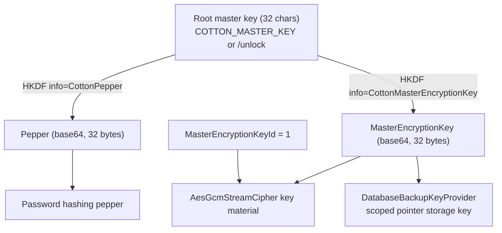
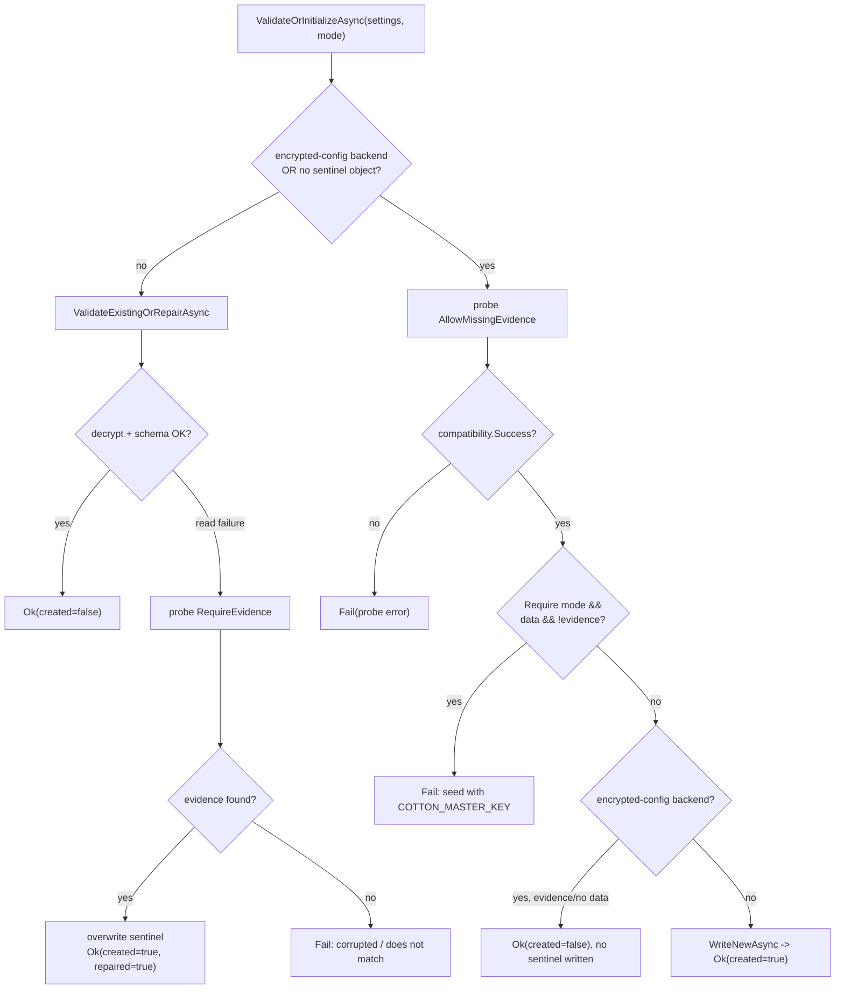

# 08. Master Key, Autoconfig & Unlock Bootstrap

Cotton's entire encryption story bottoms out at a single 32-character *root master key*. Everything else — the storage cipher key, the password pepper, database-row integrity signatures, and backup-pointer scoping — is deterministically derived from it. This section documents how that root key enters the process (either from the `COTTON_MASTER_KEY` environment variable or through the interactive `/unlock` web page), how Cotton scrubs the variable from the process and user environment immediately after reading it, how the encrypted *sentinel* and *compatibility probes* prove that a submitted key actually matches existing data, and how the short-lived *bootstrap token* gates first-ever sentinel creation in production. A central, deliberate property runs through all of it: **Cotton never falls back to a built-in development master key.** If no key is supplied, the main application is simply not built; the process serves only the lightweight unlock page until a valid key arrives.

## Purpose & overview

The master-key bootstrap is the first thing `Program.Main` does after timezone configuration and Linux process hardening, and it is a hard gate: the full ASP.NET Core application (`WebApplication`) is never constructed until a `CottonEncryptionSettings` value has been resolved. The two resolution paths are implemented in `src/Cotton.Server/Program.cs` (`ResolveEncryptionSettingsAsync`):

1. **`COTTON_MASTER_KEY` is set and non-empty** — the root key is read, validated, and used to derive encryption settings directly, then the env var is cleared in a `finally` block. No web server is started for this step.
2. **`COTTON_MASTER_KEY` is absent or empty** — `Program` first calls `ClearMasterKeyEnvironmentVariable()` defensively, then awaits `MasterKeyUnlockServer.WaitForUnlockAsync(args)`, which starts a minimal, throwaway `WebApplication` that serves only the `/unlock` page and three unlock endpoints. It blocks until an operator submits a key that passes validation, returns the derived settings, then tears itself down so the real application can be built.

`ResolveEncryptionSettingsAsync` returns a tuple `(CottonEncryptionSettings Settings, MasterKeyRuntimeState RuntimeState)`. `Program.Main` then calls `RunApplicationAsync(args, encryptionSettings, masterKeyRuntimeState, processHardeningStatus)`, which builds the real app and registers both the derived `CottonEncryptionSettings` and the `MasterKeyRuntimeState` (the latter describes how the key was obtained, for the admin security diagnostics page).

The key-length contract is fixed and load-bearing: the root key must be **exactly 32 characters** (`ConfigurationBuilderExtensions.DefaultKeyLength`). Changing it for an existing deployment makes derived keys differ, which renders existing encrypted data — including user passwords (via the pepper) — unrecoverable. This is spelled out in the XML doc comment on `DefaultKeyLength` ("DO NOT CHANGE THIS VALUE once it is set for a deployment").

## Key components & responsibilities

| Component | File | Responsibility |
|---|---|---|
| `ConfigurationBuilderExtensions` | `src/Cotton.Autoconfig/Extensions/ConfigurationBuilderExtensions.cs` | Reads/validates the root key, derives `Pepper` + `MasterEncryptionKey`, scrubs env vars, injects in-memory config. |
| `Program` | `src/Cotton.Server/Program.cs` | Chooses env vs. unlock path; builds the real app only after settings resolve. |
| `MasterKeyUnlockServer` | `src/Cotton.Server/Services/MasterKeyUnlockServer.cs` | Minimal web app serving `/unlock`; generates the bootstrap token; validates/initializes the sentinel. |
| `MasterKeyStartupStorage` | `src/Cotton.Server/Services/MasterKeyStartupStorage.cs` | Builds the storage backend + sentinel store before DI exists; checks for existing data. |
| `MasterKeySentinelStore` | `src/Cotton.Server/Services/MasterKeySentinelStore.cs` | Reads/validates/creates/repairs the encrypted sentinel object in storage. |
| `MasterKeyCompatibilityProbe` | `src/Cotton.Server/Services/MasterKeyCompatibilityProbe.cs` | Proves a submitted key decrypts pre-existing encrypted DB columns or storage chunks. |
| `MasterKeyRuntimeState` | `src/Cotton.Server/Services/MasterKeyRuntimeState.cs` | Records the key source and env-var disposition for diagnostics. |
| `CottonEncryptionSettings` | `src/Cotton.Shared/CottonEncryptionSettings.cs` | The derived runtime secret bundle (`Pepper`, `MasterEncryptionKey`, `MasterEncryptionKeyId`, `EncryptionThreads`); namespace `Cotton`. |
| `KeyDerivation` | `src/Cotton.Crypto/KeyDerivation.cs` | HKDF-SHA256 subkey derivation. |
| `StreamCipherFactory` | `src/Cotton.Server/Services/StreamCipherFactory.cs` | Builds the `AesGcmStreamCipher` from settings, binding `MasterEncryptionKeyId`. |
| `DatabaseBackupKeyProvider` | `src/Cotton.Server/Services/DatabaseBackupKeyProvider.cs` | Derives the per-key storage key for the latest-backup pointer object. |
| `UnlockPage` / `unlockApi` | `src/cotton.client/src/pages/unlock/UnlockPage.tsx`, `src/cotton.client/src/shared/api/unlockApi.ts` | The browser unlock UI and its API client. |

## Key derivation: from one root key to all subkeys

`ConfigurationBuilderExtensions.DeriveEncryptionSettings(rootMasterEncryptionKey)` validates the root key length, then derives two distinct base64 subkeys using HKDF-SHA256 with fixed `info` (purpose) strings:

```csharp
return new CottonEncryptionSettings
{
    Pepper = KeyDerivation.DeriveSubkeyBase64(rootMasterEncryptionKey, "CottonPepper", DefaultKeyLength),
    MasterEncryptionKey = KeyDerivation.DeriveSubkeyBase64(rootMasterEncryptionKey, "CottonMasterEncryptionKey", DefaultKeyLength),
    MasterEncryptionKeyId = DefaultMasterKeyId, // 1
};
```

Note that `DeriveEncryptionSettings` does **not** set `EncryptionThreads`; it defaults to `0`, and `StreamCipherFactory.Create` treats a non-positive value as "let the cipher pick" (no thread override).

`KeyDerivation` (`src/Cotton.Crypto/KeyDerivation.cs`) is a from-scratch RFC 5869 HKDF over HMAC-SHA256: `HkdfExtract` (HMAC with a zero salt of hash length when none is supplied) then `HkdfExpand` (`T(i) = HMAC(PRK, T(i-1) || info || i)`). It zeroes all intermediate buffers with `CryptographicOperations.ZeroMemory`. Because the `info` strings differ, `Pepper` and `MasterEncryptionKey` are cryptographically independent even though they share a root.

- **`MasterEncryptionKey`** is the AES-GCM key material for the storage stream cipher. `StreamCipherFactory.Create` base64-decodes it and constructs an `AesGcmStreamCipher(keyMaterial, settings.MasterEncryptionKeyId, threads)`.
- **`Pepper`** is the server-side secret mixed into password hashing (see the *Cryptography Engine* / *Authentication* sections).
- **`MasterEncryptionKeyId`** (always `1` today) is written into every encrypted file header and bound into the GCM AAD, then re-checked on decrypt — see *MasterEncryptionKeyId & rotation* below.



### The three `AddCottonOptions` overloads

`ConfigurationBuilderExtensions` exposes three overloads. `Program` uses only the last:

| Overload | What it does |
|---|---|
| `AddCottonOptions(this IConfigurationBuilder)` | Reads `COTTON_MASTER_KEY` from the environment (throws `InvalidOperationException` if null), derives settings, and clears the env var in a `finally`. Exercised by `Cotton.Autoconfig.Tests`, not by `Program`. |
| `AddCottonOptions(this IConfigurationBuilder, string rootMasterEncryptionKey)` | Derives settings from an explicit root key, then delegates to the third overload. |
| `AddCottonOptions(this IConfigurationBuilder, CottonEncryptionSettings)` | Reads Postgres env vars, scrubs `COTTON_PG_PASSWORD`, generates a fresh random `JwtSettings:Key`, and injects everything into in-memory configuration. This is what `Program.RunApplicationAsync` calls with already-derived settings. |

Because `Program` reads `COTTON_MASTER_KEY` itself in `ResolveEncryptionSettingsAsync`, calls `DeriveEncryptionSettings` directly, and later passes the *already-derived* settings to `AddCottonOptions(CottonEncryptionSettings)`, the master-key env var is read exactly once.

## Boot WITH COTTON_MASTER_KEY

When the env var is present and non-empty, `Program.ResolveEncryptionSettingsAsync` calls `DeriveEncryptionSettings(rootMasterKey)` synchronously and clears the variable in a `finally` block. No sentinel validation and no compatibility probe run on this path — supplying the env var is treated as authoritative. (The sentinel and probes only run inside the unlock server.) The runtime state recorded is `MasterKeyRuntimeState.FromEnvironment(environmentVariablePresentAfterResolution: false)`, which sets `Source = "Environment"` and `EnvironmentVariableWasConfigured = true`; that latter flag is what drives the `master-key-from-environment` admin warning.

```mermaid
sequenceDiagram
    participant OS as OS / container
    participant Main as Program.Main
    participant Resolve as ResolveEncryptionSettingsAsync
    participant Cfg as ConfigurationBuilderExtensions
    participant App as WebApplication (real app)

    OS->>Main: COTTON_MASTER_KEY set (32 chars)
    Main->>Main: ConfigureProcessTimeZone(); LinuxProcessHardening.ApplyFromEnvironment()
    Main->>Resolve: ResolveEncryptionSettingsAsync(args)
    Resolve->>Cfg: DeriveEncryptionSettings(rootKey)
    Cfg->>Cfg: ValidateRootMasterKey (length == 32)
    Cfg->>Cfg: HKDF -> Pepper + MasterEncryptionKey, KeyId=1
    Cfg-->>Resolve: CottonEncryptionSettings
    Resolve->>Cfg: ClearMasterKeyEnvironmentVariable() (Process + User, in finally)
    Resolve-->>Main: (settings, MasterKeyRuntimeState.FromEnvironment)
    Main->>App: RunApplicationAsync(args, settings, runtimeState, hardeningStatus)
    App->>App: builder.Configuration.AddCottonOptions(settings) -> in-memory config
    App->>App: ApplyMigrations, auto-restore, RunAsync
```

### Environment scrubbing

`AddCottonOptions(CottonEncryptionSettings)` scrubs the Postgres password before injecting config:

```csharp
Environment.SetEnvironmentVariable("COTTON_PG_PASSWORD", null, EnvironmentVariableTarget.Process);
Environment.SetEnvironmentVariable("COTTON_PG_PASSWORD", null, EnvironmentVariableTarget.User);
```

and `ClearMasterKeyEnvironmentVariable()` clears `COTTON_MASTER_KEY` from both `Process` and `User` scope:

```csharp
Environment.SetEnvironmentVariable(MasterKeyEnvironmentVariable, null, EnvironmentVariableTarget.Process);
Environment.SetEnvironmentVariable(MasterKeyEnvironmentVariable, null, EnvironmentVariableTarget.User);
```

This removes the secret from the process's own `/proc/self/environ`-visible environment and from the per-user registry on Windows. It does **not** remove it from container/orchestration deployment metadata or from environments handed to newly `docker exec`'d processes — exactly the caveat surfaced as the `master-key-from-environment` diagnostic warning (`SecurityDiagnosticsService.AddMasterKeyWarning`, severity `warning`).

> Note: `AddCottonOptions(CottonEncryptionSettings)` also generates a fresh random `JwtSettings:Key` (`StringHelpers.CreateRandomString(DefaultKeyLength)`, i.e. 32 chars) on every build and injects Postgres connection settings into in-memory configuration (`DatabaseSettings:Host/Port/Database/Username/Password`). The other Postgres env vars (`COTTON_PG_HOST/PORT/DATABASE/USERNAME`) are read but *not* scrubbed; only the password is.

## Boot WITHOUT COTTON_MASTER_KEY — the /unlock flow

If the env var is missing/empty, `Program` calls `ClearMasterKeyEnvironmentVariable()` (defensive, even though it was empty) and then awaits `MasterKeyUnlockServer.WaitForUnlockAsync(args)`. This builds a *separate*, throwaway `WebApplication` whose only job is to host the unlock UI and accept a key. It blocks on a `TaskCompletionSource<CottonEncryptionSettings>` until either an unlock succeeds or the app is stopped: `lifetime.ApplicationStopping.Register(() => completion.TrySetCanceled())` cancels the task, so a `Ctrl-C` during unlock raises `OperationCanceledException`, which `Program.Main` swallows and exits cleanly. After `completion.Task` resolves, the `finally` block calls `app.StopAsync()` and `app.DisposeAsync()` to tear down the unlock host.

The README documents that the unlock page is reachable at `http://localhost:8080/unlock` in the default container.

### Unlock endpoints

All endpoints are under `UnlockApiBase = Routes.V1.Base + "/unlock"`, i.e. base path `/api/v1/unlock` (`Routes.V1.Base` is `/api/v1`). While locked, a global middleware returns **HTTP 423 Locked** for *any* request whose path starts with `/api/v1` (`IsLockedApiRequest`) that is not one of the three exact unlock paths (`IsUnlockApiRequest`), so the rest of the API is hard-fenced.

| Method & path | Handler | Purpose |
|---|---|---|
| `GET /api/v1/unlock/status` | `MapGet(.../status)` | Returns `UnlockStatusResponse { RequiresBootstrapToken, FirstUnlockExpiresAtUtc }`; the expiry is `null` unless a token is required. |
| `GET /api/v1/unlock/key` | `MapGet(.../key)` | Returns a freshly generated candidate key as `text/plain; charset=utf-8`: `Convert.ToBase64String(RandomNumberGenerator.GetBytes(24))` (24 random bytes → 32 base64 chars). |
| `POST /api/v1/unlock` | `MapPost(UnlockApiBase)` | Accepts `{ masterKey, bootstrapToken }` (JSON or form), validates the bootstrap token, derives settings, validates/initializes the sentinel, and on success completes the unlock. |
| `*` other `/api/v1/*` | locked middleware (`WriteLockedApiResponseAsync`) | `423 Locked` with body `LockedApiResponse { Locked = true, Message = "Cotton is locked until the master key is provided." }`. |
| fallback | `MapFallbackToFile("/index.html")` | Serves the SPA (the React `UnlockPage`). |

All unlock responses set `Cache-Control: no-store, no-cache, max-age=0`, `Pragma: no-cache`, `Expires: 0` (`DisableCaching`).

### The bootstrap token

On startup `WaitForUnlockAsync` generates a one-time `bootstrapToken = Convert.ToHexString(RandomNumberGenerator.GetBytes(16)).ToLowerInvariant()` (32 lowercase hex chars). It is held only in memory for the life of the unlock server and **printed to the server logs** as a `LogWarning` (`LogUnlockAddressesAsync`). When the unlock host has bound addresses, the message is:

```
COTTON_MASTER_KEY is not configured. First unlock requires bootstrap token {BootstrapToken};
it expires at {ExpiresAtUtc:O}. Unlock Cotton at {UnlockUrl}
```

(When no addresses are bound yet, a shorter variant without a URL is logged.)

The token is required **only** when `RequiresBootstrapTokenAsync` is true:

```csharp
!environment.IsDevelopment() && !await MasterKeyStartupStorage.HasExistingCottonDataAsync(...)
```

So the token is demanded **only in non-Development environments AND only when there is no existing Cotton data** (no row in `users`, `nodes`, `file_manifests`, `chunks`, or `server_settings`). Once data exists, later unlocks validate the key against that data and no token is needed. In Development the token is never required.

The token has a time window: `FirstUnlockWindow = TimeSpan.FromMinutes(Constants.AdminAutocreateMinutesDelay)` = **5 minutes** from unlock-server start (`firstUnlockExpiresAtUtc`). `ValidateBootstrapTokenAsync` enforces, in order:

1. If a token is not required (`!RequiresBootstrapTokenAsync`) → pass (returns `null`).
2. If `DateTimeOffset.UtcNow > firstUnlockExpiresAtUtc` → **403** "First unlock window expired. Restart Cotton and use the new bootstrap token from server logs."
3. If the submitted token is missing/blank or does not match → **403** "Bootstrap token is required for the first unlock. Check the server logs."

The token compare (`IsBootstrapTokenValid`) trims the input, rejects null/whitespace, and uses a length check plus `CryptographicOperations.FixedTimeEquals` over UTF-8 bytes to avoid timing oracles. The 5-minute window means an unattended fresh production instance cannot be bootstrapped long after launch without a restart, narrowing the window in which a leaked-log token is usable.

### POST /api/v1/unlock — validation & sentinel

After the bootstrap-token gate passes, the handler:

1. Reads the request via `ReadSubmittedUnlockRequestAsync` (form *or* JSON body; both `masterKey` and `bootstrapToken` are trimmed).
2. Calls `ConfigurationBuilderExtensions.DeriveEncryptionSettings(submitted.MasterKey ?? string.Empty)`. A wrong length throws `InvalidOperationException`, caught and returned as **400** `UnlockResponse { Ok = false, Message = <length error> }`.
3. Builds a sentinel store via `MasterKeyStartupStorage.CreateSentinelStore(encryptionSettings, loggerFactory)` (this reads `server_settings` straight from Postgres to pick the storage backend — local FS or S3 — see *Pre-DI storage bootstrap*).
4. Calls `sentinel.ValidateOrInitializeAsync(encryptionSettings, MasterKeySentinelInitializationMode.RequireCompatibilityEvidenceForExistingData, ct)`.
5. On `validation.Success == false` → **400** `UnlockResponse { Ok = false, Message = validation.Error ?? "Unlock failed." }`.
6. On success, fires `CompleteUnlockAsync` (fire-and-forget: `Task.Delay(750)` to let the HTTP 200 flush, then `completion.TrySetResult` and `host.StopAsync()`) and returns **200** with a message that varies by outcome: `"Master key sentinel repaired. Cotton is starting."` (repaired), `"Master key initialized. Cotton is starting."` (created), or `"Master key accepted. Cotton is starting."` (validated existing).

```mermaid
sequenceDiagram
    participant Br as Browser (UnlockPage)
    participant U as MasterKeyUnlockServer (/unlock app)
    participant PG as Postgres
    participant ST as Storage backend
    participant Main as Program (real app)

    Br->>U: GET /api/v1/unlock/status
    U->>PG: HasExistingCottonDataAsync()
    U-->>Br: { requiresBootstrapToken, firstUnlockExpiresAtUtc }
    Note over Br: optional GET /unlock/key for a generated candidate key
    Br->>U: POST /api/v1/unlock { masterKey, bootstrapToken }
    U->>U: ValidateBootstrapTokenAsync (prod + no data)
    U->>U: DeriveEncryptionSettings(masterKey) (length 32)
    U->>ST: CreateSentinelStore (storage chosen from server_settings)
    U->>ST: ExistsAsync(SentinelStorageKey) ?
    alt sentinel exists (non-encrypted-config backend)
        ST-->>U: encrypted sentinel
        U->>U: decrypt + parse (AES-GCM); validate schema/purpose
        U-->>Br: 200 "Master key accepted"
    else no usable sentinel, existing data
        U->>PG: CompatibilityProbe (decrypt known columns)
        U->>ST: CompatibilityProbe (decrypt a known chunk)
        alt evidence decrypts
            U->>ST: WriteNewAsync (write new sentinel)
            U-->>Br: 200 "Master key initialized"
        else no/failed evidence
            U-->>Br: 400 "does not match" / "seed with COTTON_MASTER_KEY"
        end
    else no usable sentinel, no data
        U->>ST: WriteNewAsync (write new sentinel)
        U-->>Br: 200 "Master key initialized"
    end
    U->>Main: completion.TrySetResult (after 750ms), StopAsync
    Main->>Main: RunApplicationAsync(args, settings, FromUnlock, hardening)
    Br->>Main: waitUntilAppReady polls GET /api/v1/server/info, then redirect /
```

After a successful POST the React client (`unlockApi.unlock` → `UnlockPage.handleSubmit`) polls `GET /api/v1/server/info` via `unlockApi.waitUntilAppReady` (defaults: 20 000 ms timeout, 300 ms interval) until the real app answers with a JSON `200`, writes `JUST_UNLOCKED_STORAGE_KEY` (`"cotton:just-unlocked"`) into `sessionStorage`, then calls `window.location.replace("/")`. The runtime state recorded is `MasterKeyRuntimeState.FromUnlock(IsMasterKeyEnvironmentVariablePresent())`; `FromUnlock` always sets `Source = "Unlock"` and `EnvironmentVariableWasConfigured = false`, so the `master-key-from-environment` warning is suppressed for browser-unlocked instances regardless of the env-var probe result.

## The encrypted sentinel

`MasterKeySentinelStore` (`src/Cotton.Server/Services/MasterKeySentinelStore.cs`) is the persistent proof-of-key. It stores one small encrypted object whose storage key is deterministic and key-independent:

- **Logical key**: `SentinelLogicalKey = "cotton.master-key.sentinel.v1"`.
- **Storage key**: `SentinelStorageKey = Hasher.ToHexStringHash(Hasher.HashData(UTF8(SentinelLogicalKey)))` — a hex hash of the logical key, identical across all keys, so it can be looked up before any key is known.

The payload is a small JSON record encrypted with the storage cipher (`AesGcmStreamCipher` built from the submitted settings via `StreamCipherFactory.Create`):

```csharp
private sealed record MasterKeySentinelPayload(
    int SchemaVersion,      // 1
    string Purpose,         // "cotton.master-key.sentinel.v1"
    DateTimeOffset CreatedAtUtc,
    string Nonce);          // base64 of 32 random bytes
```

`ValidateOrInitializeAsync(settings, mode, ct)` orchestrates the decision tree. The two-arg overload defaults `mode` to `TrustProvidedKeyWhenNoProbe`; the unlock server passes `RequireCompatibilityEvidenceForExistingData`. The whole body is wrapped in a `catch` for `FormatException`, `InvalidOperationException`, `ArgumentException`, `IOException`, `UnauthorizedAccessException`, and `TimeoutException`, all turned into `MasterKeySentinelResult.Fail(ex.Message)` — these surface to the unlock page as a 400 rather than crashing the process.

1. **`TryValidateExistingStorageSentinelAsync`** — returns early (skips this branch) when the backend implements `IStorageBackendUsesEncryptedConfiguration` *or* the sentinel object does not exist. Otherwise → `ValidateExistingOrRepairAsync`:
   - `ValidateExistingAsync`: decrypt + deserialize. If `payload.SchemaVersion == 1` and `payload.Purpose == SentinelLogicalKey` → success, `created: false`. A null/wrong-schema/wrong-purpose payload returns `Fail("Master key sentinel is corrupted.")`.
   - If decrypt/parse throws a *read failure* (`CryptographicException`, `InvalidDataException`, or `JsonException` per `IsSentinelReadFailure`) → `TryRepairExistingSentinelAsync`: run a `RequireEvidenceForExistingData` compatibility probe. If the submitted key decrypts real existing data, the corrupt sentinel is **overwritten** with a fresh one (`created: true, repaired: true`, logs a warning). Otherwise it returns `"Master key sentinel is corrupted."` (for a `JsonException`) or `"Master key does not match this Cotton instance."` (for a crypto/data failure).
2. **No usable existing sentinel** → run a compatibility probe in `AllowMissingEvidence` mode (`ValidateCompatibilityAsync`), then:
   - `ValidateCompatibilityResult`: if `compatibility.Success == false` → fail with the probe's error. If `mode == RequireCompatibilityEvidenceForExistingData` AND `ExistingDataFound` AND NOT `EvidenceFound` → fail with the "seed with `COTTON_MASTER_KEY`" message (see *gotchas*).
   - `AcceptEncryptedConfigurationBackend`: for an encrypted-config backend (S3), accept the key with **no storage sentinel written** when there is evidence or there is no existing data; otherwise fail.
   - Otherwise → `WriteNewAsync(cipher, ct)` creates the sentinel (`created: true`).

`WriteNewAsync(cipher, ct, overwrite)` optionally deletes the prior object (`overwrite: true`), serializes a new payload, encrypts it with `cipher.EncryptAsync`, and writes it to `SentinelStorageKey`.

### Result types and modes

```csharp
public sealed record MasterKeySentinelResult(bool Success, bool Created, bool Repaired, string? Error);
public enum MasterKeySentinelInitializationMode { TrustProvidedKeyWhenNoProbe, RequireCompatibilityEvidenceForExistingData }
```

`MasterKeySentinelResult.Ok(created, repaired = false)` and `MasterKeySentinelResult.Fail(error)` are the factory helpers.



## The compatibility probe — proving the key without a sentinel

`MasterKeyCompatibilityProbe` (`src/Cotton.Server/Services/MasterKeyCompatibilityProbe.cs`) exists for the upgrade/migration case: a deployment created **before** the sentinel feature has plenty of encrypted data but no sentinel object. Trusting a freshly submitted key in that state would let a wrong key silently "adopt" the instance and seed a sentinel that does not match the data. The probe instead tries to **decrypt real, pre-existing encrypted artifacts** with the submitted key.

`ValidateAsync` opens a fresh Npgsql connection (using the injected connection string or `BuildConnectionStringFromEnvironment()`) and delegates to `ValidateOpenDatabaseAsync`, which first checks `HasExistingCottonDataAsync` (any row in `users`, `nodes`, `file_manifests`, `chunks`, `server_settings` — gated by `TableExistsAsync` + `RowExistsAsync`). If empty → `Compatible(existingDataFound: false, evidenceFound: false)`. Otherwise it runs two probes with the candidate `AesGcmStreamCipher`:

1. **Encrypted database columns** (`ValidateEncryptedDatabaseProbeAsync`) — for each existing column, reads up to 8 candidate values (`limit 8`, non-null; non-empty for base64-string columns) and tries `cipher.Decrypt(...)`:

   | Table | Column | Kind |
   |---|---|---|
   | `users` | `totp_secret_encrypted` | bytea |
   | `users` | `avatar_hash_encrypted` | bytea |
   | `file_manifests` | `small_file_preview_hash_encrypted` | bytea |
   | `server_settings` | `cloud_services_token_encrypted` | base64 string |
   | `server_settings` | `oidc_client_secret_encrypted` | base64 string |
   | `server_settings` | `s3_secret_access_key_encrypted` | base64 string |
   | `server_settings` | `smtp_password_encrypted` | base64 string |

2. **Storage chunk** (`ValidateStorageChunkProbeAsync`) — reads up to 16 `chunks.hash` rows (`limit 16`, ordered by `stored_size_bytes asc nulls last` when that column exists, so smallest first), maps each via `Hasher.ToHexStringHash` to a storage key, checks `_storage.ExistsAsync`, and streams a decrypt through `Stream.Null`. This probe is **skipped** when the backend implements `IStorageBackendUsesEncryptedConfiguration` (S3) — because reaching S3 itself requires a decrypted secret key, so the DB-column probe is the only available evidence in that mode.

Probe outcomes are tri-state (`ProbeValidationState`): `Validated` (some candidate decrypted → evidence found), `FailedCandidates` (candidates existed but all failed to decrypt → wrong key, hard fail `"Master key does not match existing encrypted Cotton data."` via `EvaluateFailedProbe`), or `NoCandidates` (nothing to test). When data exists but no candidate could be tested, behaviour depends on `MasterKeyCompatibilityMode`: `AllowMissingEvidence` logs and returns *compatible without evidence* (trusts the sentinel path via `CompatibleWithoutEvidence`), while `RequireEvidenceForExistingData` fails with the "seed with `COTTON_MASTER_KEY`" message (`EvaluateMissingEvidence` / `EvaluateMissingStorageProbe`).

```csharp
public sealed record MasterKeyCompatibilityResult(bool Success, bool ExistingDataFound, bool EvidenceFound, string? Error);
public enum MasterKeyCompatibilityMode { AllowMissingEvidence, RequireEvidenceForExistingData }
```

A `CryptographicException`/`InvalidDataException` thrown while opening the connection or decrypting is interpreted as a wrong key (`FailInvalidMasterKey` → `"Master key does not match existing encrypted Cotton data."`); a `PostgresException` with `SqlState == InvalidCatalogName` (database does not exist yet) is treated as "no existing data" → `Compatible`. Other transport/parse exceptions (`NpgsqlException`, `TimeoutException`, `FormatException`, `InvalidOperationException`, `ArgumentException`) are logged and returned as a soft `Fail` with `existingDataFound: false`.

Note that when `MasterKeySentinelStore` is constructed without a probe (`_compatibilityProbe is null`), `ValidateCompatibilityAsync` returns `Compatible(existingDataFound: false, ...)` in `AllowMissingEvidence` mode and `Fail(...)` in `RequireEvidenceForExistingData` mode. In the unlock flow, `MasterKeyStartupStorage.CreateSentinelStore` always wires a probe in.

## Pre-DI storage bootstrap

The sentinel and probes must run *before* the DI container exists, so `MasterKeyStartupStorage` (`src/Cotton.Server/Services/MasterKeyStartupStorage.cs`) builds everything by hand:

- `MasterKeyCompatibilityProbe.BuildConnectionStringFromEnvironment()` constructs the Npgsql connection string from `COTTON_PG_*` env vars (defaults: host `localhost`, port `5432`, db `cotton_dev`, user `postgres`, password `postgres`).
- `LoadLatestStorageSettings` runs raw SQL against `public.server_settings` (`order by created_at desc limit 1`) to pick the storage backend; an empty result or a missing table (`PostgresException` with `SqlState == UndefinedTable`) falls back to `StartupStorageSettings.Local`.
- For `StorageType.Local` it constructs a `FileSystemStorageBackend`; for `StorageType.S3` it constructs an `S3StorageBackend` backed by a private `StaticS3Provider`. The S3 provider lazily decrypts `s3_secret_access_key_encrypted` with the *submitted* master key (`MasterKeySentinelStore.CreateCipher` → `cipher.DecryptString`); a wrong key (`FormatException`/`CryptographicException`/`InvalidDataException`) is wrapped into `InvalidOperationException("S3 secret access key could not be decrypted with the configured master key.")`, which becomes an unlock 400.

This is why the S3 backend is marked `IStorageBackendUsesEncryptedConfiguration` (confirmed: `S3StorageBackend` implements it; `FileSystemStorageBackend` does not): you cannot even reach S3 storage to read a sentinel/chunk unless the submitted key already decrypts the S3 credentials, so a successful storage connection is itself evidence and the storage chunk probe is unnecessary.

## MasterEncryptionKeyId & rotation / compatibility

`MasterEncryptionKeyId` is a small integer (`ConfigurationBuilderExtensions.DefaultMasterKeyId = 1`) carried on `CottonEncryptionSettings` and passed into the `AesGcmStreamCipher` constructor by `StreamCipherFactory.Create`. The cipher writes the key id into each encrypted file header and binds it into the GCM AAD (`AesGcmStreamFormat.BuildKeyAad`); on decrypt, a header whose key id differs from the configured id throws:

```csharp
throw new InvalidDataException($"Key ID mismatch. Expected {_keyId}, but file has {header.KeyId}.");
```

It is therefore a **compatibility/versioning tag** for the derivation scheme, not a per-file key. Today exactly one scheme exists (id `1`); the field is the seam through which a future re-keying scheme could be distinguished from data written under the original scheme. There is no rotation logic in the current code — `DeriveEncryptionSettings` always sets it to `1`.

## Relationship to DatabaseBackupKeyProvider

`DatabaseBackupKeyProvider` (`src/Cotton.Server/Services/DatabaseBackupKeyProvider.cs`) is the one component besides the cipher that consumes the derived `MasterEncryptionKey` directly. It computes the storage key of the *latest-backup pointer* object by hashing a logical key that is **scoped by the master encryption key itself**:

```csharp
string scopedLogicalKey = $"{ManifestPointerLogicalKey}:{encryptionSettings.MasterEncryptionKey}"; // "database.ctn:<base64 key>"
return Hasher.ToHexStringHash(Hasher.HashData(Encoding.UTF8.GetBytes(scopedLogicalKey)));
```

Because the master key is part of the hashed input, the pointer's storage key changes when the master key changes. Practically, a different master key resolves to a *different* pointer storage key — so a backup-pointer written under one key is invisible under another, an intentional guard so that backup discovery cannot accidentally cross master-key boundaries. The provider is registered as a singleton in `Program.RunApplicationAsync` (`AddSingleton<DatabaseBackupKeyProvider>()`) and receives the derived `CottonEncryptionSettings` via constructor injection. See the *Database Backup & Auto-Restore* section for how `DumpDatabaseJob`, `ChunkUsageService`, and `DatabaseBackupManifestService` consume the pointer.

## "Paranoia Mode"

"Paranoia Mode" is the README's name for an operational hardening posture, not a single code switch. Verifying against code, it decomposes into independent mechanisms:

| README "Paranoia" element | Backed by code? | Where |
|---|---|---|
| Run as non-root `app` user, volume-permission entrypoint | Container image / entrypoint (not in this repo's C#); diagnostics observe effective UID | `SecurityDiagnosticsService.AddRootWarning` (code `running-as-root`, severity `info`), `LinuxProcessHardening.TryGetEffectiveUserId` |
| `DOTNET_EnableDiagnostics=0` / `COMPlus_EnableDiagnostics=0` | Observed only — diagnostics warns (code `dotnet-diagnostics-enabled`) when diagnostics appear enabled | `SecurityDiagnosticsService.AddDotNetDiagnosticsWarning` |
| `COTTON_PROCESS_HARDENING=true` → `prctl(PR_SET_DUMPABLE, 0)` | Yes — actively applied at startup via P/Invoke `prctl` | `LinuxProcessHardening.ApplyFromEnvironment` (`Program.Main` calls it first; `EnvironmentVariable = "COTTON_PROCESS_HARDENING"`) |
| `cap_drop`, `no-new-privileges`, `pids_limit`, `ulimit core=0`, read-only rootfs, seccomp/AppArmor/SELinux, Docker socket, host PID namespace | Container/Compose settings — observed only, contribute to warnings & 0–10 score | `SecurityDiagnosticsService` warning builders |

So the only thing the Cotton process itself *toggles* for "paranoia" is `PR_SET_DUMPABLE=0` (gated by `COTTON_PROCESS_HARDENING`, Linux-only, returning a `ProcessHardeningStatus`); the rest are deployment-time settings the process merely **detects and scores** via the admin-only `GET /api/v1/server/security/status` endpoint (`ServerController`, route prefix `Routes.V1.Server` = `/api/v1/server`, action `[HttpGet("security/status")]`). The README is honest that if an attacker runs code inside the process, none of these can hide the in-memory key — and indeed the master key lives in `CottonEncryptionSettings` (registered as a singleton) in process memory for the life of the app once unlocked.

## Concurrency, failure modes, edge cases

- **No development fallback.** There is no hardcoded/default master key anywhere. A missing env var does not start the app; it starts only the unlock server and blocks. Verified across `ConfigurationBuilderExtensions`, `Program`, and `MasterKeyUnlockServer`, and consistent with the README ("Cotton never falls back to a built-in development key").
- **Length is the only structural validation.** `ValidateRootMasterKey` only checks `Length == DefaultKeyLength` (32) and rejects `null`. Any 32-character string is accepted structurally; whether it is the *right* key is decided later by the sentinel/probe. A wrong-but-32-char key on a fresh instance will create a brand-new sentinel and silently become that instance's key (there is nothing yet to compare against).
- **First-unlock window expiry.** The 5-minute bootstrap window is measured from unlock-server start. If it lapses, the only remedy is restarting the process to get a fresh token and window (the 403 message says so).
- **Sentinel repair.** A corrupt/undecryptable sentinel is not fatal: if the submitted key is proven against real data (`RequireEvidenceForExistingData` probe), the sentinel is rewritten. A `JsonException` with no corroborating evidence is reported as "corrupted"; a crypto/data failure with no evidence is reported as "does not match".
- **Race / lifecycle.** `CompleteUnlockAsync` waits 750 ms before stopping the unlock host so the HTTP 200 reaches the browser; the browser then polls `server/info` until the real app is up. `ApplicationStopping` cancels the `TaskCompletionSource`, so `Ctrl-C` during unlock exits cleanly rather than throwing.
- **S3 credential dependency.** On S3 deployments, unlock cannot proceed unless the submitted key decrypts the stored S3 secret, since the storage backend cannot be reached otherwise; a decrypt failure surfaces as an unlock 400.
- **Persistent volume requirement.** The encrypted sentinel lives in storage (the `/app/files` volume for local FS). Losing that volume loses the sentinel; a fresh unlock on existing-but-no-sentinel data then relies on the compatibility probe.

## Non-obvious design decisions & gotchas

- **The Postgres password is scrubbed too.** `AddCottonOptions(CottonEncryptionSettings)` nulls `COTTON_PG_PASSWORD` (Process + User) after reading it, alongside the master key. Other `COTTON_PG_*` vars are left in place.
- **`Program` uses neither env-reading `AddCottonOptions` overload directly.** It reads the env var itself in `ResolveEncryptionSettingsAsync`, derives via `DeriveEncryptionSettings`, then injects the already-derived settings through `AddCottonOptions(CottonEncryptionSettings)`. The parameterless `AddCottonOptions()` (which both reads and scrubs) is exercised mainly by `Cotton.Autoconfig.Tests`.
- **`JwtSettings:Key` is ephemeral.** It is regenerated randomly (`StringHelpers.CreateRandomString(32)`) on every process start, so JWTs do not survive restarts — a deliberate consequence of not persisting that key. (Relevant to the *Authentication* section.)
- **The "seed with COTTON_MASTER_KEY" message** appears when existing data is present but no encrypted artifact could be tested with the submitted key (encrypted-config/S3 backend with no testable columns, or no testable columns/chunks generally). The remedy is to boot once *with* `COTTON_MASTER_KEY` set to the original key so the sentinel is written via the trusting env path, after which browser unlocks validate against the sentinel.
- **Sentinel storage key is key-independent**, but the backup-pointer storage key is key-*dependent*. This asymmetry is intentional: the sentinel must be findable before the key is known; the backup pointer must be partitioned by key.
- **`MasterEncryptionKeyId` is a tag, not rotation.** No automated rotation exists; the id is the AAD/header marker that would let a future scheme coexist with data written under id `1`.
- **`MasterKeyRuntimeState` carries three flags.** `Source` (`"Environment"` or `"Unlock"`), `EnvironmentVariableWasConfigured`, and `EnvironmentVariablePresentAfterResolution`. The admin warning is gated on `EnvironmentVariableWasConfigured`, which `FromEnvironment` sets to `true` and `FromUnlock` always sets to `false`.

## Related sections

- *Cryptography Engine* — `AesGcmStreamCipher`, HKDF (`KeyDerivation`), the encrypted file/header format and `MasterEncryptionKeyId` AAD binding.
- *Storage Backends* — `FileSystemStorageBackend`, `S3StorageBackend`, and the `IStorageBackendUsesEncryptedConfiguration` marker.
- *Database Backup & Auto-Restore* — `DumpDatabaseJob`, the latest-backup pointer, and `DatabaseBackupKeyProvider`.
- *Authentication* — how the derived `Pepper` and the ephemeral JWT key are used.
- *Security Diagnostics & Process Hardening* — `SecurityDiagnosticsService`, `LinuxProcessHardening`, and the admin security score.
- *Server Bootstrap & Startup* — the rest of `Program.RunApplicationAsync` (migrations, integrity backfill, auto-restore, first-admin window).
