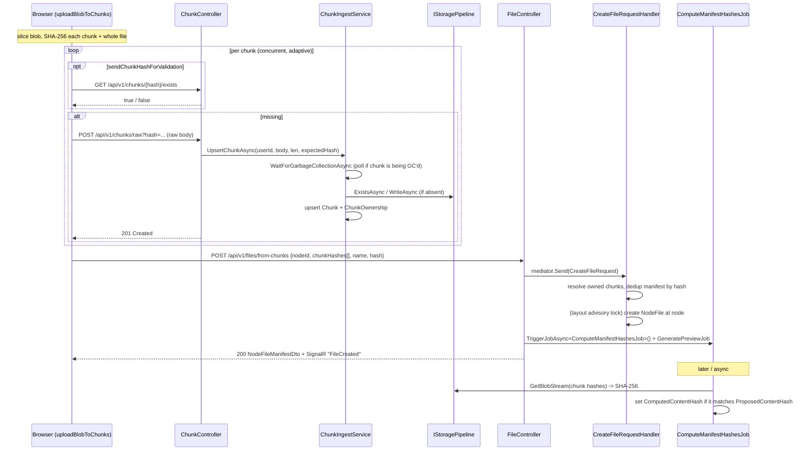
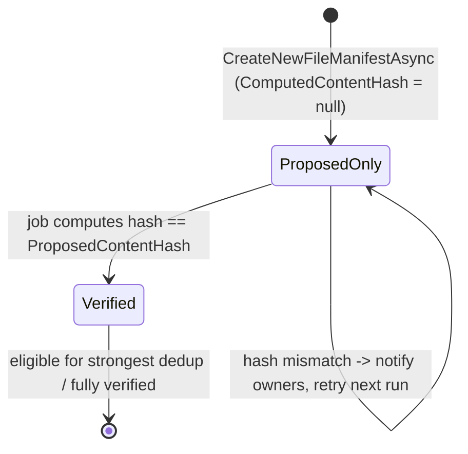
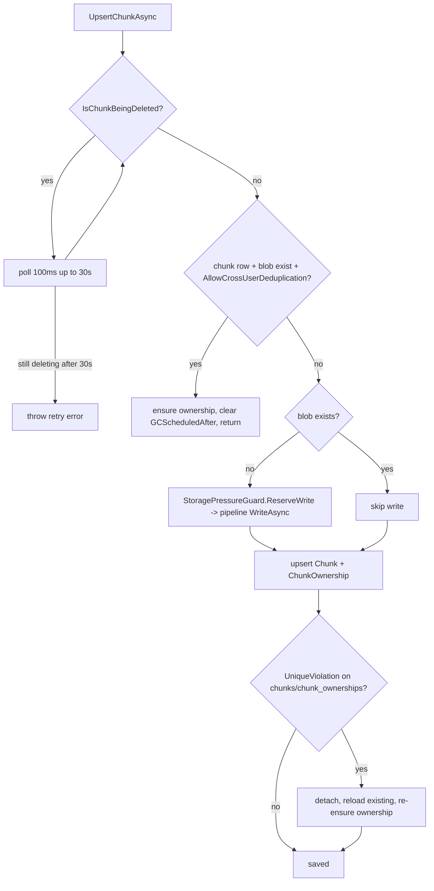
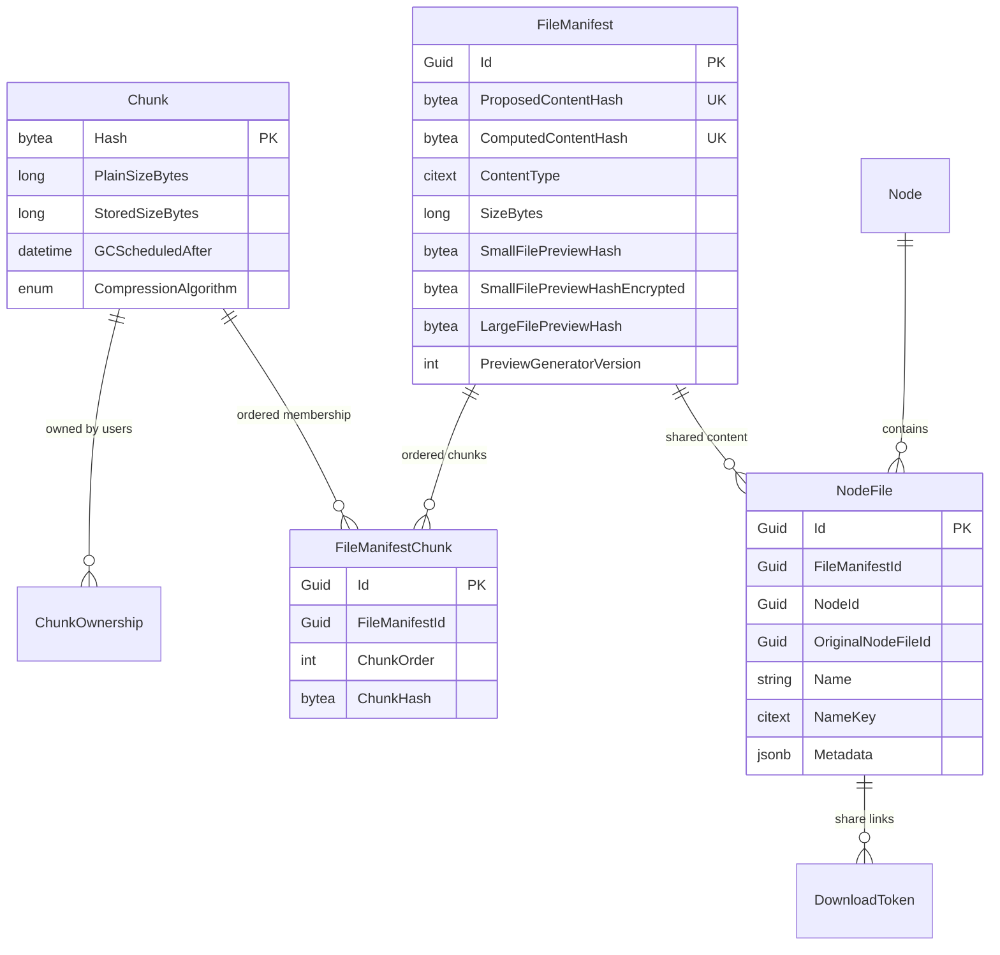

# 09. Upload & File Lifecycle (Chunk-First Protocol)

Cotton Cloud never accepts a whole file in a single request. Instead, content is broken into independent, content-addressed chunks that are uploaded first, and only afterwards assembled into a *file manifest* and attached as a visible *node file* at a layout node. This "chunk-first" protocol makes interrupted uploads safe, makes retries cheap (only missing chunks are re-sent), enables transparent deduplication, and lets the server verify integrity before content becomes part of the visible layout. This section walks the end-to-end protocol on the server: chunk ingest (`ChunkController` → `ChunkIngestService`), manifest creation and content update (`FileController` → `CreateFileRequestHandler`/`FileManifestService`), the background `ComputeManifestHashesJob`, the file lifecycle mediator handlers (move/delete/restore/share), and the garbage-collector coordination that keeps ingest and deletion from racing.

## Purpose & overview

The unit of storage is a `Chunk`, identified solely by the SHA-256 hash of its plaintext bytes (the hash *is* the storage key, stored as hex). A `FileManifest` is an immutable, deduplicated record of file content: a content type, a size, a proposed content hash, and an ordered list of chunk hashes (`FileManifestChunk` rows). A `NodeFile` is a named, visible entry inside a node that points at exactly one `FileManifest`. Many `NodeFile` rows (across users, across folders, across versions) can share one manifest, and many manifests can share one chunk. This many-to-many fan-out is what makes dedup and cheap restore possible, and is also why deletion is handled by a reference-counting garbage collector rather than by deleting blobs inline (see the *Garbage Collection & Chunk Lifecycle* and *Storage Topology / Layout Graph* sections).

The protocol has two phases:

1. **Upload missing chunks.** The client hashes each chunk, optionally asks `GET /api/v1/chunks/{hash}/exists`, and `POST`s only the chunks the server does not already have for this user.
2. **Assemble the file.** The client `POST`s the ordered list of chunk hashes plus the whole-file hash to `POST /api/v1/files/from-chunks`. The server resolves or creates a manifest, attaches a `NodeFile`, and schedules background hash verification and preview generation.

## Key components & responsibilities

| Component | File | Responsibility |
| --- | --- | --- |
| `ChunkController` | `src/Cotton.Server/Controllers/ChunkController.cs` | Chunk existence check and chunk upload (multipart and raw). |
| `ChunkIngestService` (`IChunkIngestService`) | `src/Cotton.Server/Services/ChunkIngestService.cs`, `src/Cotton.Server/Abstractions/IChunkIngestService.cs` | Hash verification, storage write, chunk/ownership upsert, GC coordination, cross-user dedup. |
| `FileController` | `src/Cotton.Server/Controllers/FileController.cs` | File create-from-chunks, update-content, rename/move/delete/restore, metadata, download (token / link / Range), HLS, versions, public share. |
| `CreateFileRequest` + handler | `src/Cotton.Server/Handlers/Files/CreateFileRequest.cs` | Mediator command that resolves/creates a manifest and attaches a `NodeFile`. |
| `FileManifestService` | `src/Cotton.Server/Services/FileManifestService.cs` | Content-type resolution, owned-chunk lookup, new-manifest creation with ordered `FileManifestChunk` rows, GC-schedule clearing. |
| `ComputeManifestHashesJob` | `src/Cotton.Server/Jobs/ComputeManifestHashesJob.cs` | Background job that computes `ComputedContentHash` and detects upload corruption. |
| `MoveFileCommand`, `DeleteFileQuery`, `RestoreFileQuery`, `ShareFileQuery` | `src/Cotton.Server/Handlers/Files/*` | File lifecycle mediator handlers. |
| `GarbageCollectorJob` | `src/Cotton.Server/Jobs/GarbageCollectorJob.cs` | Owns the "currently deleting" set that ingest waits on; schedules and deletes orphaned chunks. |
| `ChunkUsageService` | `src/Cotton.Server/Services/ChunkUsageService.cs` | Defines what makes a chunk live (referenced) vs eligible for GC. |
| `StoragePressureGuard` | `src/Cotton.Server/Services/StoragePressureGuard.cs` | Refuses writes when free disk would drop below the configured reserve. |
| `LayoutLocks` | `src/Cotton.Server/Services/LayoutLocks.cs` | Per-layout PostgreSQL transaction advisory lock serializing namespace mutations. |
| `PerfTracker` | `src/Cotton.Server/Services/PerfTracker.cs` | Tracks recent upload/preview activity and night-time windows so maintenance jobs back off. |
| `Hasher` | `src/Cotton.Server/Services/Hasher.cs` | SHA-256 helpers, hex conversion, and hash-string validation. |
| `uploadBlobToChunks` (client) | `src/cotton.client/src/shared/upload/uploadBlobToChunks.ts` | Browser-side chunking, hashing, adaptive concurrency, retry, and ordered-hash assembly. |
| `chunksApi` (client) | `src/cotton.client/src/shared/api/chunksApi.ts` | `exists` probe and raw chunk upload. |

> Note on namespaces: `Hasher` lives in `Cotton.Server.Services` (file `src/Cotton.Server/Services/Hasher.cs`), not in `Cotton.Crypto`. The `Cotton.Crypto` namespace contributes `AesGcmStreamCipher`.

## Chunk ingest

### Endpoints

`ChunkController` extends `ControllerBase` and is **not** decorated with `[ApiController]`. It binds routes from `Routes.V1.Chunks` (`/api/v1/chunks`, defined in `src/Cotton.Shared/Routes.cs`). All three operations require `[Authorize]`.

| Method | Route | Action method | Purpose |
| --- | --- | --- | --- |
| `GET` | `/api/v1/chunks/{hash}/exists` | `CheckChunkExists` | Returns `true` only if the caller owns a `ChunkOwnership` row **and** the blob exists in storage. |
| `POST` | `/api/v1/chunks` | `UploadChunk` | Multipart upload (`[FromForm] IFormFile file` + `[FromForm] string hash`). `RequestSizeLimit` = `AesGcmStreamCipher.MaxChunkSize + ushort.MaxValue` (64 MiB + 65535). |
| `POST` | `/api/v1/chunks/raw` | `UploadRawChunk` | Raw-body upload (`[FromQuery] string hash`, body is the chunk). `RequestSizeLimit` = `AesGcmStreamCipher.MaxChunkSize` (64 MiB). This is the path the browser client actually uses. |

`AesGcmStreamCipher.MaxChunkSize` is `64 * 1024 * 1024` (`src/Cotton.Crypto/AesGcmStreamCipher.cs`). The `RequestSizeLimit` attributes are coarse HTTP guards; the *enforced* per-chunk limit is the runtime setting `MaxChunkSizeBytes` from `CottonServerSettings` (`src/Cotton.Database/Models/CottonServerSettings.cs`), which `SettingsController` restricts to one of `4 MiB`, `8 MiB`, or `16 MiB` (`SupportedMaxChunkSizeBytes` in `src/Cotton.Server/Controllers/SettingsController.cs`, set via `PATCH /api/v1/settings/chunk-size/{maxChunkSizeBytes:int}`). Both POST handlers reject any chunk whose length exceeds `MaxChunkSizeBytes` with a `400`. The empty-body / zero-length case is also rejected with `400`. `GET /api/v1/settings` (`SettingsController.GetClientSettings`) exposes `MaxChunkSizeBytes` and `SupportedHashAlgorithm` (`"SHA256"`, from `Hasher.SupportedHashAlgorithm`) so the client knows how to slice and hash.

### `CheckChunkExists`

The existence check (`ChunkController.CheckChunkExists`) validates the hex hash via `Hasher.FromHexStringHash` and `Hasher.HashSizeInBytes` (32 bytes), looks up a `ChunkOwnership` for `(ChunkHash, OwnerId)`, and only then calls `_storage.ExistsAsync(hash)`. A chunk that exists in storage but is not *owned* by the caller returns `false` — ownership is required, so one user cannot probe whether another user's content exists. The client's `chunksApi.exists` is configured to accept HTTP `200` and `404`, treating `404` as `false` as well.

### Upload path: hashing, verification, GC wait, dedup, persistence

Both POST handlers delegate to `IChunkIngestService.UpsertChunkAsync`. The raw handler passes `Request.Body` and `Request.ContentLength` straight through with `HttpContext.RequestAborted`. The service exposes three public overloads (`src/Cotton.Server/Abstractions/IChunkIngestService.cs`):

| Overload | Behavior |
| --- | --- |
| `UpsertChunkAsync(userId, Stream, length, byte[] expectedHash, ct)` | Streams into a `MemoryStream` (128 KiB pooled buffer from `ArrayPool<byte>`), computes SHA-256 incrementally (`IncrementalHash`), enforces exact `length`, and rejects a mismatch between the computed digest and `expectedHash` with `InvalidDataException` using `CryptographicOperations.FixedTimeEquals`. **This is the path the controllers use.** |
| `UpsertChunkAsync(userId, Stream, length, ct)` | Copies the stream and hashes the buffer itself (no caller hash). |
| `UpsertChunkAsync(userId, byte[] buffer, length, ct)` | Derives the hash from the buffer. |

The controllers map `InvalidDataException` (hash mismatch / bad length) to `400 Bad Request`, and `StoragePressureException` to `507`.

All overloads converge on the private `UpsertChunkAsync(userId, buffer, length, chunkHash, ct)`. Its steps:

1. **GC wait.** `WaitForGarbageCollectionAsync` polls `GarbageCollectorJob.IsChunkBeingDeleted(storageKey)` every `GcWaitStepMs` (100 ms) up to `GcWaitMaxMs` (30 000 ms). If the chunk is still being deleted after 30 s it throws `InvalidOperationException("…is currently being garbage collected. Please retry.")`. This is the "ingest refuses/holds an upload of a chunk currently being deleted" guarantee.
2. **Lookups.** `_layouts.FindChunkAsync(chunkHash)` (an `ILayoutService` primary-key lookup against `Chunks`) and `_storage.ExistsAsync(storageKey)`.
3. **Cross-user dedup fast path.** `TryReuseDeduplicatedChunkAsync` short-circuits when the `Chunk` row exists, `settings.AllowCrossUserDeduplication` is true, **and** the blob exists in storage. It refreshes `StoredSizeBytes` (only if it is `<= 0`), clears `GCScheduledAfter`, ensures a `ChunkOwnership`, saves, and returns — no re-write of bytes.
4. **Write if absent.** If the blob is not in storage, `WriteChunkAsync` first reserves capacity via `StoragePressureGuard.ReserveWriteAsync(length)` (throws `StoragePressureException` → `507` if the reserve would be breached), writes through `IStoragePipeline.WriteAsync` with a fresh `PipelineContext()` (compression → crypto → backend), then commits the reservation. `StoredSizeBytes` is read back from storage via `_storage.GetSizeAsync`.
5. **Metadata upsert.** `UpsertChunkMetadataAsync` adds a new `Chunk` (with `CompressionAlgorithm = CompressionProcessor.Algorithm`, i.e. Zstd) or fills in missing `PlainSizeBytes`/`StoredSizeBytes` (only when they are still `0`) and clears any `GCScheduledAfter`.
6. **Ownership + save.** `EnsureOwnershipAsync` adds a `ChunkOwnership` if the `(ChunkHash, OwnerId)` pair is absent, then `SaveChunkUpsertAsync` persists.

After a successful upload the controller calls `PerfTracker.OnChunkCreated()` and returns `201 Created`. `OnChunkCreated` stamps a timestamp that `PerfTracker.IsUploading()` reports as `true` for `ChunkTimeoutSeconds` (10 s); the maintenance jobs use this to back off (see below).

### Concurrent-upsert resolution

Because the same chunk can be uploaded concurrently (multiple parallel requests, or two users uploading identical content), `SaveChunkUpsertAsync` catches `DbUpdateException` whose inner `PostgresException` is a `UniqueViolation` on table `chunks` or `chunk_ownerships` (`IsConcurrentChunkUpsertConflict`). On conflict it detaches the pending added entities (`DetachPendingChunkUpsert`), reloads the existing `Chunk` (`LoadExistingChunkAsync`), re-ensures ownership, and saves again (a second `UniqueViolation` on the ownership insert is also swallowed) — so two racing uploads converge on one canonical `Chunk` row instead of failing the request. Uniqueness is enforced by the schema: `Chunk.Hash` is the primary key, and `ChunkOwnership` has a unique index on `(OwnerId, ChunkHash)`.

### `ChunkOwnership` vs durable retention

`ChunkOwnership` (`src/Cotton.Database/Models/ChunkOwnership.cs`) records that a user is *allowed to reference* a chunk during proof-of-ownership checks; it is an ingest/concurrency guard, **not** a retention reference (the README states this explicitly). What keeps a chunk alive against GC is being referenced by a live `FileManifestChunk`, a manifest preview hash (`FileManifest.SmallFilePreviewHash` or `LargeFilePreviewHash`), or a user avatar (`User.AvatarHash`) — see `ChunkUsageService.WhereReferencedByDatabase` / `WhereUnreferencedByDatabase` (`src/Cotton.Server/Services/ChunkUsageService.cs`). A freshly uploaded chunk that has ownership but is not yet in any manifest is *unreferenced* and is eligible for GC scheduling, which is why the chunk-first flow expects the manifest to follow promptly (and why `CreateFileRequestHandler` and `FileManifestService` aggressively clear `GCScheduledAfter` when a chunk becomes referenced).

## Manifest creation — `POST /api/v1/files/from-chunks`

`FileController` is decorated with `[ApiController]`. `FileController.CreateFileFromChunks` sets `request.UserId = User.GetUserId()`, sends the `CreateFileRequest` through the mediator, then triggers `ComputeManifestHashesJob` and `GeneratePreviewJob` via `_scheduler.TriggerJobAsync<…>()`, pushes a `"FileCreated"` SignalR event to the owning user (`IHubContext<EventHub>`), and returns `Ok(manifest)` (HTTP `200`) with the `NodeFileManifestDto`.

### `CreateFileRequest`

`CreateFileRequest` (`src/Cotton.Server/Handlers/Files/CreateFileRequest.cs`) is both the API body and the mediator request (`IRequest<NodeFileManifestDto>`):

| Field | Type | Meaning |
| --- | --- | --- |
| `NodeId` | `Guid` | Target node (must be `NodeType.Default`, owned by the user, in the user's latest layout). |
| `ChunkHashes` | `string[]` | Ordered hex SHA-256 chunk hashes — this **is** the file's content sequence. |
| `Name` | `string` | File display name (validated/normalized via `NameValidator`). |
| `ContentType` | `string` | Client-proposed MIME type. |
| `Hash` | `string` | Hex SHA-256 of the whole file → becomes `ProposedContentHash`. |
| `OriginalNodeFileId` | `Guid?` | Lineage id for versioning; when null, the new file becomes its own lineage root. |
| `Metadata` | `Dictionary<string,string>?` | Arbitrary metadata copied onto the `NodeFile`. |
| `Validate` | `bool` | When true, forces synchronous content-hash verification before the namespace write. |
| `UserId` | `Guid` | Owner; set server-side from the auth context. |

### Handler control flow (`CreateFileRequestHandler.Handle`)

1. **Resolve layout & pre-lock target.** `GetOrCreateLatestUserLayoutAsync` then a no-tracking `GetTargetNodeAsync` filtered by `Id == NodeId && Type == NodeType.Default && OwnerId == userId && LayoutId == layout.Id` (throws `EntryPointNotFoundException("Layout node not found.")` if absent). The name is validated and reduced to a `nameKey` up front via `NameValidator`.
2. **Resolve owned chunks.** `FileManifestService.GetChunksAsync(request.ChunkHashes, userId)` loads only `Chunk` rows the user owns (the query joins `ChunkOwnerships`) and returns them **in request order**; a missing/unowned hash throws `EntityNotFoundException(nameof(Chunk))`. This is the ownership gate for assembly: you can only build a file from chunks you have proven you possess.
3. **Resolve or create the manifest.** `GetOrCreateFileManifestAsync` looks up an existing `FileManifest` where `ComputedContentHash == proposedHash OR ProposedContentHash == proposedHash`. If found (a dedup hit), it clears GC schedules on the manifest's chunks/previews via `FileManifestService.ClearGcSchedulesForManifestReferencesAsync`, and — only when `AllowCrossUserDeduplication` is **off** — strips a stored `SmallFilePreviewHashEncrypted` and `PreviewGenerationError`, then reuses it (no new chunk rows). Otherwise `FileManifestService.CreateNewFileManifestAsync` creates one (below).
4. **Optional synchronous validation.** `ValidateContentHashIfRequestedAsync` runs **before** the namespace transaction. If `request.Validate` is true and the manifest's `ComputedContentHash` is still null, the handler streams the assembled blob (`IStoragePipeline.GetBlobStream(hashes, PipelineContext { FileSizeBytes })`), hashes it, and on mismatch logs and throws `BadRequestException`; on match it sets `ComputedContentHash` immediately and saves. The default upload path leaves `Validate` false and relies on the async job.
5. **Namespace mutation under the layout lock.** Opens a transaction, takes the per-layout advisory lock (`LayoutLocks.AcquireForLayoutAsync(_dbContext, preLockNode.LayoutId, …)`), re-reads the target node *tracked*, calls `EnsureNoDuplicatesAsync` (rejects a same-`NameKey` file **or** `NodeType.Default` folder under the parent with `DuplicateException`), reserves quota via `UserStorageQuotaService.EnsureCanAddFileReferenceAsync`, then `CreateNodeFileAsync`.
6. **Create the `NodeFile`.** `CreateNodeFileAsync` builds the row, copies metadata, and sets the lineage: when `OriginalNodeFileId` is null it saves once to obtain the new id and points `OriginalNodeFileId` at itself; otherwise it adopts the supplied lineage id. Commits, records added quota bytes (`RecordLogicalBytesAdded`), and returns `MapToDto`.

`MapToDto` surfaces the encrypted preview token via `FileManifest.GetPreviewHashEncryptedHex()` and computes `RequiresVideoTranscoding`, which is `true` only when `SmallFilePreviewHash != null` **and** the content type starts with `video/` **and** it is not one of the natively playable types `video/mp4`, `video/webm`, `video/ogg`, or `video/quicktime`.

### `FileManifestService.CreateNewFileManifestAsync`

This builds the immutable content record:

- A new `FileManifest` with `ContentType = ResolveContentType(fileName, contentType)`, `SizeBytes = chunks.Sum(PlainSizeBytes)`, `ProposedContentHash = proposedContentHash`, and `PreviewGeneratorVersion = PreviewGeneratorProvider.DefaultGeneratorVersion`. `ComputedContentHash` is deliberately left **null** at creation.
- One `FileManifestChunk` per chunk, with `ChunkOrder = i` (0..N-1) and `ChunkHash` set; as each chunk is wired up, any pending `GCScheduledAfter` on it is cleared so newly referenced chunks are protected immediately.

`ResolveContentType` normalizes/maps MIME types (e.g. `video/mov` → `video/quicktime`, `video/avi`/`video/vnd.avi`/`video/msvideo` → `video/x-msvideo`, `image/x-heic` → `image/heic`), applies extension overrides (HEIC/HEIF families, `.mov`/`.qt`, `.mkv`, `.avi`, `.svg`, audio extensions, and — *forced* regardless of the supplied type — `.stl`/`.obj`/`.3mf`), and downgrades recognized source-code extensions (and `Dockerfile`/`.dockerignore`) to `text/plain` for safe preview/inline rendering. The full source-text extension set and the `SourceTextFileNameRegexPattern` are defined in `FileManifestService`.

### Manifest reuse / dedup is hash-keyed

`FileManifest` carries two unique indexes — `ProposedContentHash` (unique) and `ComputedContentHash` (unique) (`src/Cotton.Database/Models/FileManifest.cs`). Dedup keys on either. The whole-file hash the client supplies in `Hash` is therefore the dedup identity: upload the same file twice (any user, if cross-user dedup is enabled) and the second create-from-chunks reuses the existing manifest. Because `ProposedContentHash` is *client-supplied*, an attacker could in principle propose a hash that does not match the chunk bytes — which is exactly why the asynchronous job verifies it before a manifest can be matched on its (stronger) `ComputedContentHash`.

## Background hash computation — `ComputeManifestHashesJob`

`ComputeManifestHashesJob` (`src/Cotton.Server/Jobs/ComputeManifestHashesJob.cs`) is a Quartz job triggered hourly (`[JobTrigger(hours: 1)]`) and also fired on demand after create-from-chunks and update-content. Its job is to populate `ComputedContentHash` — the server's own verification of what was actually stored.

- **Back-off.** It returns early when `PerfTracker.IsUploading()` (a chunk landed within the last 10 s) or `PerfTracker.IsNightTime()` (server-local hour `< 7` or `>= 22`, where local time is computed from `CottonServerSettings.Timezone` via `GetTimezoneInfo()`, falling back to UTC). Within a run it sleeps `60 000 ms` between manifests while a preview is generating or an upload is active (`IsPreviewGenerating() || IsUploading()`), otherwise `250 ms`.
- **Selection.** The query is `FileManifests.Take(MaxItemsPerRun).Include(FileManifestChunks).Where(ComputedContentHash == null)` — note the `Take(1000)` is applied **before** the `Where`, so EF takes (an unordered) batch of up to `MaxItemsPerRun` (1000) manifests and filters those for a null computed hash. Fully verified manifests are skipped naturally and unverified ones are revisited on subsequent runs.
- **Compute.** For each, it streams the assembled blob via `IStoragePipeline.GetBlobStream(hashes, PipelineContext { FileSizeBytes })` (chunk hash order from `FileManifestExtensions.GetChunkHashes`) and computes SHA-256 (`Hasher.HashData(stream)`).
- **Match → commit.** If the computed hash equals `ProposedContentHash`, it sets `ComputedContentHash` and saves. Setting `ComputedContentHash` is what makes the manifest eligible for the strongest dedup match and confirms integrity.
- **Mismatch → notify.** On mismatch it logs a warning and, for every `NodeFile` referencing the manifest, calls `SendUploadHashMismatchNotificationAsync(ownerId, fileName, proposedHex, computedHex)` (an extension method on the notifications provider, defined in `src/Cotton.Server/Extensions/NotificationsProviderExtensions.cs`). It does **not** set `ComputedContentHash`, so the manifest is retried on subsequent runs and never silently dedups corrupt content.

## Updating file content — `PATCH /api/v1/files/{id}/update-content`

`FileController.UpdateFileContent` accepts a `CreateFileRequest` body and rewrites a file's content while preserving history. It validates the name, resolves the owned file's layout id, resolves/creates the manifest the same way (`ResolveUpdateManifestAsync` mirrors `GetOrCreateFileManifestAsync` but without the preview-stripping branch), takes the layout lock inside a transaction, re-loads the editable `NodeFile`, re-checks name conflicts (`FindUpdateNameConflictAsync`), reserves quota via `UserStorageQuotaService.EnsureCanChangeFileManifestAsync`, then `ApplyUpdatedFileContentAsync`:

- If the request's `ProposedContentHash` differs from the file's current manifest hash, it captures the current manifest as a historical version via `FileVersionService.CaptureAndUpdateManifestAsync` and repoints the `NodeFile` at the new manifest. Identical content (same proposed hash) is a no-op for content and skips version capture.
- It updates the name and replaces metadata (when supplied).

After commit it adjusts quota (added/removed logical bytes), triggers `ComputeManifestHashesJob` and `GeneratePreviewJob`, and emits a `"FileUpdated"` SignalR event. See the *File Versioning* section for `FileVersionService`, lineage (`OriginalNodeFileId`), and retention.

Related write/read endpoints on `FileController`:

| Method | Route | Action method |
| --- | --- | --- |
| `PATCH` | `/api/v1/files/{nodeFileId}/rename` | `RenameFile` (takes the layout lock; `"FileRenamed"` event) |
| `PATCH` | `/api/v1/files/{nodeFileId}/metadata` | `UpdateFileMetadata` (merges a `Dictionary<string,string?>` patch; `"FileUpdated"` event) |
| `GET` | `/api/v1/files/{nodeFileId}/versions` | `GetFileVersions` |
| `POST` | `/api/v1/files/{nodeFileId}/versions/{versionId}/restore` | `RestoreFileVersion` (`"FileUpdated"` event) |
| `DELETE` | `/api/v1/files/{nodeFileId}/versions/{versionId}` | `DeleteFileVersion` |
| `GET` | `/api/v1/files/{nodeFileId}/versions/{versionId}/download-link` | `DownloadFileVersion` |

## File lifecycle handlers

### `MoveFileCommand`

`MoveFileCommandHandler` (`src/Cotton.Server/Handlers/Files/MoveFileCommand.cs`) takes `NodeFileId`, `ParentId`, `UserId`. It rejects an empty target parent (`BadRequestException<NodeFile>`), then takes the per-layout advisory lock keyed on the **source** file's layout (the cross-table file-vs-folder same-name collision is not protected by a single DB unique index, so serialization is required). It loads the tracked `NodeFile`, returns the file unchanged if already in the target parent, validates the target is a `NodeType.Default` node in the **same layout** (cross-layout moves are rejected with `BadRequestException<Node>("Cannot move a file across layouts.")`), checks `EnsureNoSiblingCollisionAsync` (file *and* `NodeType.Default`-folder name-key collisions → `DuplicateException`), reassigns `NodeId`, and commits. A `UniqueViolation` during save is translated to `DuplicateException`. After commit, `NotifyMoveAsync` calls `IEventNotificationService.NotifyFileMovedAsync` best-effort — a notification failure is logged and never fails an already-committed move. The HTTP entry point is `PATCH /api/v1/files/{nodeFileId}/move` with a `MoveFileRequest` body (`{ parentId }`).

### `DeleteFileQuery`

`DeleteFileQueryHandler` (`src/Cotton.Server/Handlers/Files/DeleteFileQuery.cs`) takes `UserId`, `NodeFileId`, `SkipTrash`. The HTTP `DELETE /api/v1/files/{nodeFileId}?skipTrash=` first reads the parent node id (no-tracking), sends the query, then emits a `"FileDeleted"` SignalR event with a `NodeFileDeletedEventDto(nodeFileId, parentNodeId)` and returns `204 No Content`.

- **Trash (default, `skipTrash=false`).** `MoveToTrashAsync` takes the layout lock, re-loads the file with its `DownloadTokens`, records the original parent path into metadata (`TrashRestoreCoordinator.SetOriginalParentPath`, resolved via `ILayoutNavigator.GetNodePathFromRootAsync`) so restore can rebuild the path, creates a trash wrapper node (`ILayoutService.CreateTrashItemAsync`), reparents the file under it, and expires any still-live `DownloadToken`s (sets `ExpiresAt = UtcNow`).
- **Permanent (`skipTrash=true`).** For a historical version (`FileVersionService.IsHistoricalVersion`) it delegates to `FileVersionService.DeleteHistoricalVersionAsync`. Otherwise `DeletePermanentlyAsync` deletes lineage versions (`FileVersionService.DeleteLineageVersionsAsync`), deletes the user's download tokens for the file (`CreatedByUserId == userId && NodeFileId == file.Id`), removes the `NodeFile`, and records the freed logical bytes (`SizeBytes + removedVersionBytes`). It does **not** delete chunks or the manifest — those become unreferenced and are reclaimed later by `GarbageCollectorJob`.

### `RestoreFileQuery`

`RestoreFileQueryHandler` (`src/Cotton.Server/Handlers/Files/RestoreFileQuery.cs`) takes `UserId`, `NodeFileId`, `CreateMissingParents`, `Overwrite` and returns a `RestoreOutcomeDto` with a `RestoreStatus` (`Restored`, `ParentMissing`, `Conflict`, `NotRestorable`; defined in `src/Cotton.Server/Models/Dto/RestoreOutcomeDto.cs`). It runs inside a transaction under the layout lock, requires the file to sit at the **top level of trash** (its wrapper must be a `NodeType.Trash` node whose `ParentId` is the user's trash root, via `ILayoutService.GetUserTrashRootAsync`), resolves the original parent path (creating missing parents only if `CreateMissingParents`, via `TrashRestoreCoordinator.ResolveOrCreateParentAsync`), and handles name conflicts (`TrashRestoreCoordinator.FindConflictAsync`): without `Overwrite` it returns a `Conflict` outcome (with a `RestoreConflictKind` of `File`/`Folder`); with `Overwrite` it sends the conflicting item to trash. On success it reparents the file, strips the stored original-parent metadata, deletes the now-empty trash wrapper (`TrashRestoreCoordinator.DeleteWrapperIfEmptyAsync`), and returns the restored `NodeFileManifestDto`. A concurrent `UniqueViolation` is mapped to a `Conflict` outcome. The HTTP entry point is `POST /api/v1/files/{nodeFileId}/restore` with a `RestoreItemRequest` body (`{ createMissingParents, overwrite }`); on `RestoreStatus.Restored` the controller emits `"FileRestored"`. (See the *Trash & Restore* section.)

### `ShareFileQuery` and downloads

`ShareFileQueryHandler` (`src/Cotton.Server/Handlers/Files/ShareFileQuery.cs`) backs the public, unauthenticated `GET`/`HEAD /s/{token}` route. It returns a discriminated `ShareFileResult` whose `Kind` the controller maps to a response: `badRequest`, `notFound`, `redirect`, `html`, `head`, or `stream`. The `?view=` query (default `page`) selects `page` (HTML with Open Graph / Twitter card tags and a meta-refresh + `window.location.replace` redirect to the SPA `/share/{token}`), `download` (attachment), or `inline`; an unrecognized value yields `badRequest`. Tokens are `DownloadToken` rows; an expired token (`ExpiresAt < now`) or a wrong-type node yields not-found. When a download token is missing for an HTML view, the handler also tries a `NodeShareToken` and, if found, builds a redirect page; otherwise it redirects to `/404`. Integrity is checked before serving via `IDatabaseIntegrityVerifier.RequireValid` on the token and `FileGraphIntegrityVerifier.RequireValidMetadata` (HTML/HEAD) or `RequireValidContent` (stream) on the file graph. There is an inline metadata range-probe special case (`bytes=0-3`) that streams without consuming a `deleteAfterUse` token or sending a download notification. Streaming uses `IStoragePipeline.GetBlobStream(uids, PipelineContext { FileSizeBytes, ChunkLengths })` and a one-shot download notification (`ISharedFileDownloadNotifier.NotifyOnceAsync`).

Authenticated downloads live on `FileController`:

| Method | Route | Notes |
| --- | --- | --- |
| `GET` | `/api/v1/files/{nodeFileId}/download-link` | Creates a `DownloadToken` (random 16-char token via `StringHelpers.CreateRandomString` unless a `customToken` is supplied; `expireAfterMinutes` defaults to 1440 and is bounded to ≤ 1 year; optional `deleteAfterUse`) and returns a relative `…/download?token=` URL. A taken `customToken` yields `409`. |
| `GET` | `/api/v1/files/{nodeFileId}/download?token=` | Token-authorized stream; honors `download` (default true) and `preview`. |
| `GET`/`HEAD` | `/s/{token}` | Public share (handled by `ShareFileQuery`). |
| `GET` | `/api/v1/files/{nodeFileId}/hls/master.m3u8`, `…/hls/playlist.m3u8`, `…/hls/seg-{segmentIndex}.ts` | Token-authorized HLS (only when `VideoPlaybackResolver.Resolve` returns `Transcode`); see *Media Previews & HLS Transcoding*. |

The download stream (`DownloadFileByToken`) verifies the token and file-graph integrity, sets `ETag` to `"sha256-{ProposedContentHash}"`, `Content-Encoding: identity`, `Cache-Control: private, no-store, no-transform`, `Last-Modified` from `CreatedAt`, and calls `File(..., enableRangeProcessing: true)` so the browser/CDN handle `Range` and `If-None-Match` (304). When `preview=true` and the manifest has a `LargeFilePreviewHash`, it instead serves the WebP preview with `Cache-Control: public, max-age=31536000, immutable` and its own ETag (with explicit 304 handling). `deleteAfterUse` tokens are removed in `Response.OnCompleted`.

## GC-aware ingest coordination

Deletion is owned by `GarbageCollectorJob` (`src/Cotton.Server/Jobs/GarbageCollectorJob.cs`, `[JobTrigger(hours: 6)]`, `[DisallowConcurrentExecution]`). On the very first run it waits 15 minutes (`Task.Delay(900_000)`) to let the server stabilize. Unless `StorageSpaceMode.Limited` (aggressive mode), it skips entirely during night time. Each pass (`RunOnceAsync`) runs four steps in order: delete orphaned manifests (manifests with no `NodeFiles`, plus their `FileManifestChunks` and any `DownloadTokens`), clear GC schedules for chunks that became referenced or protected, **schedule** orphaned chunks, and **delete** chunks whose schedule has elapsed.

The database is the source of truth for liveness: a chunk is deletable only when `ChunkUsageService.WhereUnreferencedByDatabase` holds (no `FileManifestChunk`, not a `SmallFilePreviewHash`/`LargeFilePreviewHash` on any manifest, not a `User.AvatarHash`) and it is not in the protected-storage-key set (`ChunkUsageService.GetProtectedStorageKeysAsync` — the database-backup pointer, the master-key sentinel, and the latest backup manifest plus its chunks). Unreferenced chunks are first *scheduled* (`GCScheduledAfter` set), then deleted once the schedule elapses and a re-check still finds them unreferenced. The scheduling delay and batch size vary by `StorageSpaceMode`:

| `StorageSpaceMode` | Schedule delay | Per-run chunk batch size |
| --- | --- | --- |
| `Limited` (aggressive) | `now + 1 day` | `MaxChunkBatchSize` (100 000) |
| `Optimal` (default) | `now + ChunkGcDelayDays` (7 days) | midpoint `(1000 + 100000) / 2` |
| `Unlimited` | `now + ChunkGcDelayDays * 4` (28 days) | `MinChunkBatchSize` (1000) |

The ingest/deletion handshake uses a process-wide `static ConcurrentDictionary<string,byte> CurrentlyDeletingChunks` keyed by storage UID (case-insensitive). Before deleting a batch, GC reserves each UID with `TryAdd`; after a 5 s grace delay it performs the DB delete (`ChunkOwnerships` then `Chunks`, in a transaction) and then the storage delete (`Parallel.ForEachAsync`, `MaxDegreeOfParallelism = 8`); the UIDs are removed in a `finally`. `GarbageCollectorJob.IsChunkBeingDeleted(uid)` exposes membership. `ChunkIngestService.WaitForGarbageCollectionAsync` consults exactly this set: an upload of a chunk currently being deleted blocks (polling, up to 30 s) and then either proceeds once the delete finishes or fails with a retry-please error. Conversely, when an upload re-references a chunk that was merely *scheduled*, ingest and `FileManifestService` clear `GCScheduledAfter`, and GC's own pre-delete re-check (`DeleteEligibleBatchAsync` re-queries `WhereReferencedByDatabase` and the protected set) clears the schedule for any hash that became referenced again — so a chunk that comes back to life between scheduling and deletion is spared. This is the README's "safety first, then fast reconciliation" coordination; see the *Garbage Collection & Chunk Lifecycle* section for full detail.

## Important data structures

Key invariants:

- **Chunk identity = SHA-256 of plaintext.** `Chunk.Hash` is the primary key (`bytea`) and the storage UID (its lowercase hex). `StoredSizeBytes` is post-pipeline (compressed/encrypted) size; `PlainSizeBytes` is the logical size used for `FileManifest.SizeBytes` and range math. `Chunk` has an index on `GCScheduledAfter`.
- **Ordering is explicit.** `FileManifestChunk` has a unique index on `(FileManifestId, ChunkOrder)` and an index on `ChunkHash`. `FileManifestExtensions.GetChunkHashes` (`src/Cotton.Server/Extensions/FileManifestExtensions.cs`) sorts by `ChunkOrder` and throws if orders are non-contiguous (no gaps allowed), guaranteeing a faithful reassembly. `GetChunkLengths` builds the per-hash length map (from each chunk's `PlainSizeBytes`) used to drive `Range` reads, and throws on conflicting lengths for the same hash.
- **`ComputedContentHash` is nullable until verified.** Created manifests start with only `ProposedContentHash`; the async job (or `Validate=true`) sets `ComputedContentHash`. Treat `ComputedContentHash != null` as "server-verified".
- **`DeleteBehavior.Restrict`** on the `Chunk`, `FileManifest`, and `Node` navigations (`FileManifestChunk`, `NodeFile`, `ChunkOwnership`) prevents EF cascade-deleting shared rows; reclamation is GC's responsibility.

### Settings & defaults

| Setting | Source | Default / allowed |
| --- | --- | --- |
| `MaxChunkSizeBytes` | `CottonServerSettings` | One of 4/8/16 MiB (`SettingsController.SupportedMaxChunkSizeBytes`). Enforced per chunk by both POST handlers. |
| `AllowCrossUserDeduplication` | `CottonServerSettings` | Gates cross-user chunk reuse and manifest preview sharing. |
| `StorageSpaceMode` | `CottonServerSettings` | Enum `Optimal=0` (default), `Limited=1`, `Unlimited=2`; tunes GC schedule delay (1 / 7 / 28 days) and batch size. |
| `Timezone` | `CottonServerSettings` | Used by `PerfTracker.IsNightTime()`; falls back to UTC when empty/invalid. |
| `GcWaitStepMs` / `GcWaitMaxMs` | `ChunkIngestService` (const) | 100 ms / 30 000 ms (ingest wait for in-progress GC). |
| `ChunkTimeoutSeconds` | `PerfTracker` (const) | 10 s upload/preview-activity window (`IsUploading`, `IsPreviewGenerating`). |
| `MaxItemsPerRun` | `ComputeManifestHashesJob` (const) | 1000 manifests per run (applied via `Take` before the null-hash filter). |
| `ChunkGcDelayDays` | `GarbageCollectorJob` (const) | 7 days base scheduling delay (scaled by `StorageSpaceMode`). |
| Storage-pressure reserve | `StoragePressureOptions` (`src/Cotton.Server/Models/Configuration/StoragePressureOptions.cs`) | `Enabled=true`, `MinFreePercent=5`, `MinFreeBytes=512 MiB`, `CheckIntervalSeconds=10`, `AdminNotificationCooldownMinutes=60`. Required free = `max(MinFreeBytes, MinFreePercent% of total)`; a breach throws `StoragePressureException` → `507`. |

## Concurrency, failure modes, edge cases & security

- **Per-layout serialization.** Create, rename, move, update-content, delete-to-trash, restore, and version restore all take `LayoutLocks.AcquireForLayoutAsync`, a PostgreSQL **transaction-scoped advisory lock** (`pg_advisory_xact_lock`) keyed by the layout id (the 16-byte Guid is XOR-folded to an int64; a spurious collision only serializes two unrelated layouts — a performance, never a correctness, issue). The lock auto-releases on COMMIT/ROLLBACK. This prevents the cross-table file-vs-folder same-`NameKey` race that no single unique index can catch. `LayoutLocks` is `internal` and requires the caller to open and commit the surrounding transaction.
- **Concurrent chunk upload.** Resolved by the `UniqueViolation` retry in `SaveChunkUpsertAsync`; the request still succeeds and converges on one canonical `Chunk`.
- **GC vs ingest race.** Closed by `CurrentlyDeletingChunks` + the 30 s ingest wait, plus GC's pre-delete liveness re-check and the 5 s grace delay before deletes begin.
- **Storage pressure.** `507 Insufficient Storage` is returned when the reserve would be breached; reservations are tracked against a briefly cached capacity snapshot (`CapacityCacheEntry`, TTL = `CheckInterval`) so a burst of concurrent chunks cannot all pass against the same stale free-space reading. Admins are notified once per cooldown window.
- **Hash verification timing.** Chunk bytes are verified at ingest (`FixedTimeEquals` against the client-supplied per-chunk hash), but the *whole-file* `ProposedContentHash` is client-supplied and only verified later by the job (or synchronously when `Validate=true`). A mismatch never blocks file creation but does notify the owner and keeps `ComputedContentHash` null, so corrupt content cannot become a strong dedup target.
- **Ownership gates.** Existence checks and assembly both require `ChunkOwnership`, so users cannot reference or enumerate content they did not upload — even though the underlying chunk may be physically shared after dedup.
- **Idempotent re-upload.** `chunks/{hash}/exists` + the dedup fast path mean re-running an interrupted upload re-sends only missing chunks, and re-creating an identical file reuses the manifest.

## Non-obvious design decisions & gotchas

- **`POST /api/v1/chunks` (multipart) exists but the browser uses `POST /api/v1/chunks/raw`.** The raw endpoint avoids `IFormFile`/multipart parsing and streams the body directly with verify-as-you-buffer. A `TODO` in `ChunkController.UploadChunk` notes the intent to stream without buffering at all, and warns that a hash-mismatched chunk *cannot* simply be deleted from storage because the same blob may be owned by other users or "hacked together from other chunks."
- **Client chunk size is adaptive and decoupled from the manifest.** `uploadBlobToChunks` starts at the server's `MaxChunkSizeBytes`, and on a connection interruption `reduceChunkSize` halves the active size (bounded below by `uploadConfig.minAdaptiveChunkSizeBytes`) and re-splits the failed segment; concurrency is governed by `AdaptiveConcurrencyController`. Two clients can therefore chunk the same file differently yet still assemble identical content, because identity is per-chunk SHA-256, not per-upload-session.
- **The client maintains two independent hash streams.** Per-chunk hashes (for content addressing) and an in-order whole-file hash (for `ProposedContentHash`), the latter advanced strictly by byte offset (`waitForFileHashTurn` / `advanceFileHashOffset`, with a `maxQueuedFileHashBytes` back-pressure window) so out-of-order concurrent uploads still produce the correct file digest. It refuses to finish if the file-hash coverage is incomplete or if the assembled chunks are non-contiguous or do not cover the whole blob (`buildOrderedChunkHashes`).
- **`sendChunkHashForValidation`.** When enabled (per `uploadConfig` or per-call), the client probes `chunksApi.exists` before uploading each chunk (skipping already-stored ones) and, after a connection interruption with a known hash, queues a *verification* segment that re-probes `exists` rather than blindly re-uploading (`queueVerificationSegment` / `verifyKnownHashSegment`).
- **Deleting a file frees nothing immediately.** Permanent delete removes only the `NodeFile` (and lineage versions / the user's tokens); chunks and manifests linger until GC reclaims them after the delay, which is what makes restore and cross-reference cheap.
- **README accuracy.** The README's *Chunk-First Upload Model* and *Garbage Collection* sections match the code, with two nuances worth flagging to operators: (1) the README's "Selected endpoints" lists `POST /chunks`, but the actual browser path is `POST /chunks/raw`, and the enforced max chunk size is the runtime `MaxChunkSizeBytes` setting (4/8/16 MiB), not the cipher's 64 MiB ceiling; (2) the README names the encrypted preview field `EncryptedPreviewImageHash`, but in code it is `FileManifest.SmallFilePreviewHashEncrypted`, surfaced via `GetPreviewHashEncryptedHex()` (which prefixes the token with the manifest's `PreviewTokenPrefix` `'f'` and the row id).

## Related sections

See the *Storage Pipeline & Backends*, *Cryptography Engine*, *Garbage Collection & Chunk Lifecycle*, *Storage Topology / Layout Graph*, *File Versioning*, *Media Previews & HLS Transcoding*, *Trash & Restore*, and *Storage Quotas & Pressure* sections for the subsystems referenced above.
