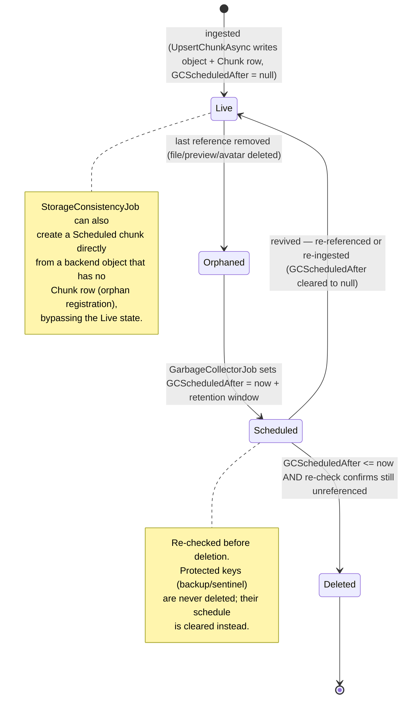
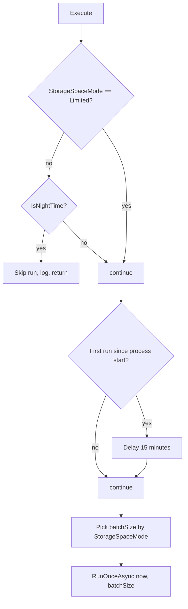
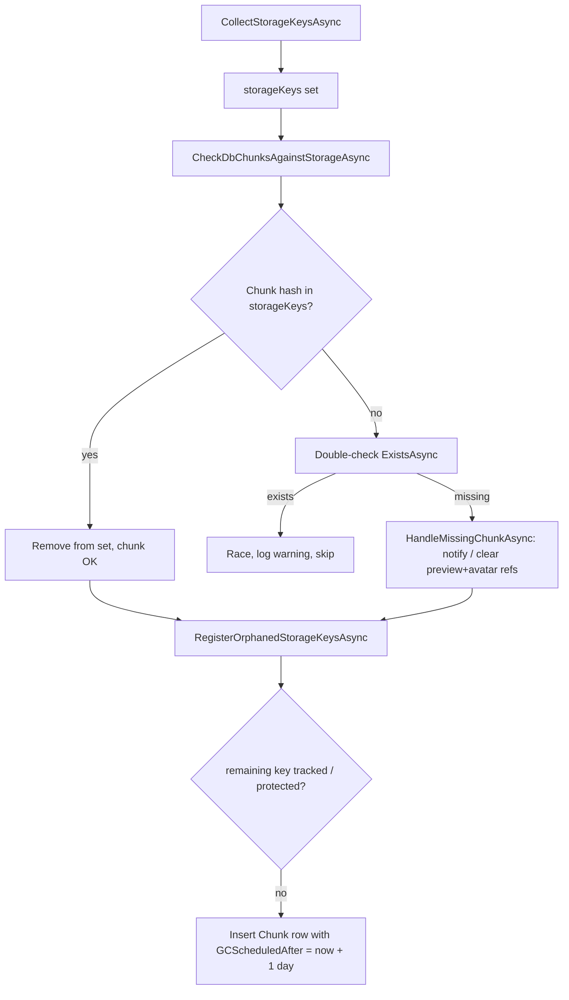
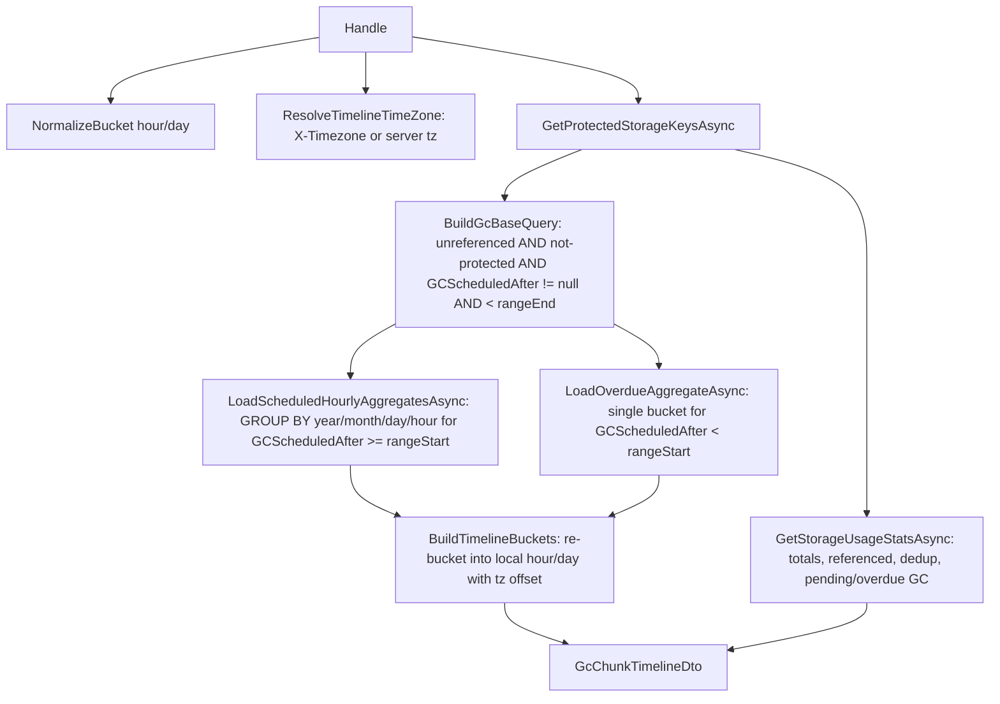

# 10. Garbage Collection & Storage Consistency

Cotton stores file content as deduplicated, content-addressed encrypted chunks. Once a file is deleted or a manifest becomes unreferenced, the underlying storage objects must eventually be reclaimed — but never so eagerly that an in-flight upload, a revived reference, or a database backup is destroyed. This section documents the reclamation and reconciliation subsystem: the `GarbageCollectorJob` that schedules and deletes orphaned chunks behind a retention window, the `StorageConsistencyJob` that reconciles raw backend objects against database rows, the `ChunkUsageService` that is the single source of truth for "is this object live", the `BackfillChunkStoredSizeJob` housekeeping pass, and the admin-facing GC observability path (`GetGcChunksTimelineQuery`).

The governing design principle — stated in `README.md` as "do not reclaim first and ask questions later" — is implemented as: **the database is the source of truth for liveness, deletions are delayed by a retention window, and every candidate is re-checked immediately before deletion**.

## Purpose & overview

Cotton's storage is content-addressed: a chunk's identity is the lowercase hex SHA-256 of its plaintext bytes (`Hasher.ToHexStringHash`, in `src/Cotton.Server/Services/Hasher.cs`). The same hex string is both the `Chunk.Hash` primary key (stored as raw `byte[]`) and the storage backend's object key ("storage key" / "uid"). Because identical content from any user maps to the same key, a single stored object can be referenced by many manifests, previews, and avatars.

This creates a reference-counting problem with no explicit refcount column. Instead, liveness is computed on demand by joining `chunks` against everything that can reference a chunk hash. The GC subsystem must therefore:

1. Find chunks not referenced by anything live (orphans).
2. Wait out a retention window before deleting, so accidental or transient orphaning is recoverable and so concurrent ingestion can revive the chunk.
3. Re-verify non-liveness immediately before the physical delete.
4. Protect special storage objects (the latest database backup's manifest and chunks, the backup pointer, the master-key sentinel) that have no `FileManifestChunk`/avatar/preview reference but must never be reclaimed.
5. Reconcile the two halves of the system — DB rows and backend objects — so neither drifts into silent inconsistency.

### Component map

| Component | File | Responsibility |
|---|---|---|
| `GarbageCollectorJob` | `src/Cotton.Server/Jobs/GarbageCollectorJob.cs` | Schedules orphans for deletion after a retention window, clears schedules for revived/protected chunks, performs delayed physical deletion, removes orphaned `FileManifest` rows. |
| `StorageConsistencyJob` | `src/Cotton.Server/Jobs/StorageConsistencyJob.cs` | Reconciles backend object keys vs `chunks` rows; handles DB-rows-missing-from-storage; registers storage-orphans as `Chunk` rows so GC can schedule them. |
| `ChunkUsageService` | `src/Cotton.Server/Services/ChunkUsageService.cs` | Source of truth for liveness queries and for the protected-storage-key set; clears GC schedules for live chunks. |
| `BackfillChunkStoredSizeJob` | `src/Cotton.Server/Jobs/BackfillChunkStoredSizeJob.cs` | Backfills `Chunk.StoredSizeBytes` for rows that predate the column or were never populated. |
| `GetGcChunksTimelineQuery` (+ handler) | `src/Cotton.Server/Handlers/Server/GetGcChunksTimelineQuery.cs` | Admin observability: aggregates pending-deletion chunks into a time-bucketed timeline plus storage-usage stats. |
| `GcChunkTimelineDto`, `GcChunkTimelineBucketDto`, `StorageUsageStatsDto` | `src/Cotton.Server/Models/Dto/` | API payloads for the timeline and storage statistics. |
| `ChunkIngestService` | `src/Cotton.Server/Services/ChunkIngestService.cs` | Ingestion side of the GC coordination contract (revives chunks, waits out in-progress deletes). |

## The `Chunk` entity and liveness model

`Chunk` (`src/Cotton.Database/Models/Chunk.cs`) is the metadata row for one deduplicated, encrypted storage object:

| Column | Type | Meaning |
|---|---|---|
| `hash` | `byte[]` (PK) | SHA-256 of the plaintext chunk; also the storage key (as hex). |
| `plain_size_bytes` | `long` | Size before compression/encryption. |
| `stored_size_bytes` | `long` | Size actually written to the backend after the pipeline (compression + encryption). |
| `gc_scheduled_after` | `DateTime?` | UTC instant after which an unreferenced chunk may be physically deleted. `null` = not scheduled. Indexed. |
| `compression_algorithm` | `CompressionAlgorithm` | Algorithm used for this stored chunk (the `EasyExtensions.Models.Enums.CompressionAlgorithm` enum). |

Two navigation collections — `ChunkOwnerships` (`ICollection<ChunkOwnership>`) and `FileManifestChunks` (`ICollection<FileManifestChunk>`) — are declared on the entity.

`GCScheduledAfter` is indexed via the `[Index(nameof(GCScheduledAfter))]` attribute on the entity, which is materialized by migration `20260421045328_AddChunkIndexes` as the index `IX_chunks_gc_scheduled_after`. (The `gc_scheduled_after` *column itself* was added earlier by migration `20260120195224_AddChunkGCScheduledAfter`, which did not create the index.) The same `AddChunkIndexes` migration also creates `IX_file_manifests_small_file_preview_hash` and `IX_file_manifests_large_file_preview_hash`, backing the preview half of the liveness queries.

A chunk is **live** when any of three reference sources points at its hash. This is encoded once in `ChunkUsageService.WhereReferencedByDatabase` and its inverse `WhereUnreferencedByDatabase`:

```csharp
// WhereUnreferencedByDatabase: a chunk is an orphan when NONE of these hold
!c.FileManifestChunks.Any()                                                  // not part of any file's chunk list
&& !_dbContext.FileManifests.Any(fm => fm.SmallFilePreviewHash == c.Hash     // not a small file preview
                                     || fm.LargeFilePreviewHash == c.Hash)    // not a large file preview
&& !_dbContext.Users.Any(u => u.AvatarHash == c.Hash)                         // not a user avatar
```

These three sources — `FileManifestChunk` rows, `FileManifest.SmallFilePreviewHash`/`LargeFilePreviewHash`, and `User.AvatarHash` — are the complete definition of liveness. Any new feature that pins a stored object must add a row to one of these (or extend these queries), otherwise GC will treat the object as an orphan. The README states this contract explicitly: Cotton "treats the database as the source of truth for whether a storage object is still alive."

> **Important:** `ChunkOwnership` is **not** a liveness reference. It is an ingest/proof-of-ownership guard with a unique `(OwnerId, ChunkHash)` index (`src/Cotton.Database/Models/ChunkOwnership.cs`) and is deliberately excluded from the liveness queries. A chunk that has only `ChunkOwnership` rows but no manifest/preview/avatar reference is an orphan and will be collected (and its ownership rows deleted with it). The README confirms: "`ChunkOwnership` is an ingest/concurrency guard, not a durable retention reference."

### Chunk lifecycle



A storage object can also enter the lifecycle from the right: `StorageConsistencyJob` discovers a backend object with no `Chunk` row and inserts a `Chunk` already in the `Scheduled` state (see *Storage consistency reconciliation*).

## `GarbageCollectorJob`

`GarbageCollectorJob` is a Quartz job marked `[JobTrigger(hours: 6)]` and `[DisallowConcurrentExecution]`. The `JobTriggerAttribute` comes from the external `EasyExtensions.Quartz` package (`EasyExtensions.Quartz.Attributes.JobTriggerAttribute`), with constructor defaults `startNow: true`, `repeatForever: true`, `disallowConcurrentExecution: true`. Its registration helper `AddQuartzJobs`/`SetupQuartz` builds a simple schedule `WithInterval(6h).WithMisfireHandlingInstructionFireNow()`, calls `RepeatForever()` and `StartNow()`, and applies `DisallowConcurrentExecution(...)` to the job detail — so the trigger fires once at startup (after the Quartz server's `StartDelay` of 5 s) and then every 6 hours. The class-level `[DisallowConcurrentExecution]` plus a `static ConcurrentDictionary<string, byte>` of in-flight deletes guard against overlap.

### Execute() gating, startup delay, and batch sizing



- **Night-time gating:** `PerfTracker.IsNightTime()` (`src/Cotton.Server/Services/PerfTracker.cs`) returns true when the server-timezone local hour is `< 7` or `>= 22` (the timezone comes from `CottonServerSettings.GetTimezoneInfo()`). If the server is **not** in `StorageSpaceMode.Limited` (the "aggressive" mode) and it is currently night time, the run is skipped entirely. In `Limited` mode this gate is bypassed and GC runs around the clock.
- **First-run delay:** A `static bool _isFirstRun` causes a one-time `await Task.Delay(900_000)` (15 minutes) before the very first pass, to let the server stabilize after startup. Because the flag is static and process-scoped, this delay happens once per process lifetime, not once per trigger.
- **Batch size** is chosen in `Execute()` by `StorageSpaceMode` (`src/Cotton.Database/Models/Enums/StorageSpaceMode.cs`), while the **retention window** is chosen by a separate switch in `ScheduleOrphanedChunksAsync`. Both switches key off the same mode value, so the per-mode pairing is:

| `StorageSpaceMode` | `batchSize` | Retention window (`deleteAfter`) |
|---|---|---|
| `Limited` (1) | `MaxChunkBatchSize` = 100000 | `now + 1 day` |
| `Optimal` (0) | `(MinChunkBatchSize + MaxChunkBatchSize) / 2` = `(1000 + 100000) / 2` = 50500 | `now + ChunkGcDelayDays` = `now + 7 days` |
| `Unlimited` (2) | `MinChunkBatchSize` = 1000 | `now + ChunkGcDelayDays * 4` = `now + 28 days` |
| default (`_`, unreachable) | `MinChunkBatchSize * 2` = 2000 | `now + ChunkGcDelayDays` = `now + 7 days` |

`ChunkGcDelayDays = 7` is the constant behind the canonical 7-day `Optimal` window the README describes.

### RunOnceAsync — the four phases

`RunOnceAsync(DateTime now, int batchSize, CancellationToken)` resolves the protected-key set once, then runs four phases in order:

```csharp
HashSet<string> protectedStorageKeys = await _chunkUsage.GetProtectedStorageKeysAsync(ct);
await DeleteOrphanedManifestsAsync(ct);
await ClearSchedulesForReferencedChunksAsync(protectedStorageKeys, ct);
await ScheduleOrphanedChunksAsync(now, protectedStorageKeys, batchSize, ct);
await DeleteScheduledChunksAsync(now, batchSize, protectedStorageKeys, ct);
```

This `public` method is also the test entry point and can be invoked directly (see `src/Cotton.Server.IntegrationTests/GarbageCollectorJobTests.cs`, which calls `RunOnceAsync(now, batchSize)`).

**Phase 1 — `DeleteOrphanedManifestsAsync`.** Selects up to `ManifestBatchSize` = 1000 `FileManifest` IDs with no `NodeFiles` (`!fm.NodeFiles.Any()`), ordered by `Id`. In a transaction it deletes dependent `DownloadTokens` (filtered via `dt.NodeFile.FileManifestId`), then `FileManifestChunks`, then the manifests — but the final manifest delete **re-checks** `!fm.NodeFiles.Any()`. If the number of manifests actually deleted (`deletedManifests`) differs from the candidate count, it rolls back the entire batch and logs a warning rather than risk deleting a manifest a `NodeFile` just attached to. A `DbUpdateException` during the batch also rolls back and logs. Deleting `FileManifestChunk` rows here is what turns the manifest's chunks into orphans for later phases.

**Phase 2 — `ClearSchedulesForReferencedChunksAsync`.** Resets `GCScheduledAfter = null` for any chunk that is now live again (the **revival** path). It delegates to two `ChunkUsageService` methods and sums the counts:

- `ClearGcSchedulesForReferencedChunksAsync` — `WhereReferencedByDatabase(...).Where(c => c.GCScheduledAfter != null)` then `ExecuteUpdateAsync(... null)`. A single set-based UPDATE clears the schedule for every chunk that became referenced again.
- `ClearGcSchedulesForProtectedChunksAsync` — clears schedules for protected storage keys that happen to have a parsable hash, batched in groups of `ProtectedHashBatchSize` = 500 (via `Chunk(500)`) to keep `IN (...)` lists bounded.

**Phase 3 — `ScheduleOrphanedChunksAsync`.** Marks orphans for future deletion. It loops in inner batches of `ScheduleInnerBatchSize` = 2000 until `batchSize` total are scheduled or candidates run out. Each iteration:

```csharp
IQueryable<Chunk> baseQuery     = _chunkUsage.WhereUnreferencedByDatabase(_dbContext.Chunks);
IQueryable<Chunk> filteredQuery = _chunkUsage.WhereNotProtectedByStorageKeys(baseQuery, protectedStorageKeys);
var candidateHashes = await filteredQuery.AsNoTracking()
    .Where(c => c.GCScheduledAfter == null)            // only not-yet-scheduled
    .OrderBy(c => c.Hash).Take(take).Select(c => c.Hash).ToListAsync(ct);
int updated = await _dbContext.Chunks
    .Where(c => candidateHashes.Contains(c.Hash) && c.GCScheduledAfter == null)
    .ExecuteUpdateAsync(c => c.SetProperty(x => x.GCScheduledAfter, deleteAfter), ct);
```

The `OrderBy(c => c.Hash)` gives a deterministic, resumable cursor; the `GCScheduledAfter == null` guard on the UPDATE makes it idempotent under concurrency. Progress is logged at most every `ProgressLogInterval` = 15 seconds. The loop also breaks when a page returns fewer than `take` rows.

**Phase 4 — `DeleteScheduledChunksAsync`.** Physically deletes chunks whose window has elapsed. The selection re-applies the liveness filter at read time:

```csharp
var hashesToDelete = await _chunkUsage.WhereUnreferencedByDatabase(_dbContext.Chunks)
    .Where(c => c.GCScheduledAfter != null && c.GCScheduledAfter <= now)
    .OrderBy(c => c.Hash).Take(batchSize).AsNoTracking().Select(c => c.Hash).ToListAsync(ct);
```

Then, per candidate hash:

- If the hex uid is in `protectedStorageKeys`, it is **not** deleted; instead it is queued into `protectedHashesToClear` and its schedule is reset to `null` in a single `ExecuteUpdateAsync` (a protected object should never have lingered in the schedule).
- Otherwise the uid is reserved in the static `CurrentlyDeletingChunks` dictionary via `TryAdd`. Reservation both serializes against any other GC pass and is the flag the ingest path polls. If `TryAdd` fails (already being deleted), the chunk is skipped this pass with a debug log.

After reservation, the job logs the count and **waits `await Task.Delay(5_000)`** — a deliberate 5-second grace pause between reservation and deletion. Deletion then proceeds in inner batches of `DeleteInnerBatchSize` = 500 via `DeleteEligibleBatchAsync`, with progress logged every 15 s. A per-batch `try/catch` logs and swallows batch failures, and a `try/finally` guarantees every reserved uid is removed from `CurrentlyDeletingChunks` even on failure.

**`DeleteEligibleBatchAsync` — the final re-check.** This is the safety core. For each 500-hash batch it:

1. Re-reads which hashes are **still** `GCScheduledAfter != null && <= now` (`stillScheduledHashes`); a chunk revived since selection would have had its schedule cleared and is dropped (and if none remain it returns 0).
2. Queries `WhereReferencedByDatabase` over those hashes to find any that became live again (`nowReferencedHashes`); for those it clears `GCScheduledAfter` and excludes them.
3. Builds `eligibleHashes` excluding both newly-referenced and protected uids.
4. In a transaction: deletes `ChunkOwnership` rows for the eligible hashes (`ExecuteDeleteAsync`), then deletes the `Chunk` rows (`ExecuteDeleteAsync`), then commits. `ChunkOwnership.Chunk` uses `DeleteBehavior.Restrict`, so ownership rows must be deleted first.
5. Only **after** the DB commit does it delete the physical objects, with `Parallel.ForEachAsync` at `MaxDegreeOfParallelism` = `StorageDeleteConcurrency` = 8, calling `_storage.DeleteAsync(uid)`. A `false` return is logged at debug; a thrown exception is caught and logged at warning. Neither rolls back the DB delete.

The DB-first ordering means that if the process dies between the DB commit and the storage delete, the result is a backend object with no `Chunk` row — exactly the orphan that `StorageConsistencyJob` is built to find and re-register. The reverse (object gone, row present) is the dangerous data-loss case and is avoided by ordering.

### GC sequence (delete path)

```mermaid
sequenceDiagram
    participant Q as Quartz (every 6h)
    participant GC as GarbageCollectorJob
    participant CU as ChunkUsageService
    participant DB as PostgreSQL
    participant ST as IStoragePipeline
    Q->>GC: Execute()
    GC->>CU: GetProtectedStorageKeysAsync()
    CU-->>GC: protected keys (backup + sentinel)
    GC->>DB: delete orphaned FileManifests (re-checked, transactional)
    GC->>CU: ClearGcSchedules for referenced + protected chunks
    GC->>DB: schedule orphans (GCScheduledAfter = now + window)
    GC->>DB: select due, unreferenced chunks (GCScheduledAfter <= now)
    GC->>GC: reserve uids in CurrentlyDeletingChunks, wait 5s
    loop per 500-hash batch
        GC->>DB: re-check still-scheduled & still-unreferenced
        GC->>DB: clear schedule for any revived chunk
        GC->>DB: BEGIN; delete ChunkOwnerships; delete Chunks; COMMIT
        GC->>ST: DeleteAsync(uid) x8 parallel (after DB commit)
    end
    GC->>GC: finally: release CurrentlyDeletingChunks reservations
```

### Coordination with ingestion

The ingest path (`ChunkIngestService.UpsertChunkAsync`, `src/Cotton.Server/Services/ChunkIngestService.cs`) closes the upload-vs-delete race from the other side. Two mechanisms:

1. **Wait for in-flight deletion.** Before doing anything, the private `UpsertChunkAsync` overload calls `WaitForGarbageCollectionAsync(storageKey)`, which polls `GarbageCollectorJob.IsChunkBeingDeleted(storageKey)` (a static accessor over `CurrentlyDeletingChunks`) every `GcWaitStepMs` = 100 ms, up to `GcWaitMaxMs` = 30000 ms. If the chunk is still being deleted after 30 s, it throws `InvalidOperationException($"Chunk {storageKey} is currently being garbage collected. Please retry.")`. This matches the README: "if a chunk is currently being deleted, the ingest path will refuse/hold concurrent uploads of that same chunk until the delete completes." The 5-second `Task.Delay` in `DeleteScheduledChunksAsync` widens the window in which the ingest poller can observe the reservation before the row disappears.
2. **Revive on re-ingest.** When ingestion reuses or re-creates a chunk it explicitly clears the schedule. `RefreshStoredChunkMetadataAsync` (cross-user dedup reuse path) sets `chunk.GCScheduledAfter = null` if set; `UpdateChunkMetadata` does the same through the helper `ClearGcSchedule`. So an upload that lands on a scheduled-but-not-yet-deleted chunk un-schedules it, and Phase 2 / the Phase 4 re-check will also catch it once a manifest/ownership reference exists. `ChunkUsageService.ClearGcScheduleAsync(byte[] chunkHash, ct)` provides a single-hash variant of the same operation for other callers.

## `StorageConsistencyJob`

`StorageConsistencyJob` (`src/Cotton.Server/Jobs/StorageConsistencyJob.cs`) is marked `[JobTrigger(days: 30)]` — i.e. it runs at startup and then every 30 days. Unlike `GarbageCollectorJob` it is **not** annotated `[DisallowConcurrentExecution]` at the class level, but the attribute's default `disallowConcurrentExecution: true` still applies a Quartz `DisallowConcurrentExecution` directive to the job detail during registration. `Execute()` waits `Task.Delay(300_000)` (5 minutes) for startup to settle, then calls `RunOnceAsync`.

`RunOnceAsync` performs a full bidirectional reconciliation:



**Phase A — collect keys.** `CollectStorageKeysAsync` enumerates every backend object via `_storage.ListAllKeysAsync(ct)` into a case-insensitive `HashSet<string>` (`StringComparer.OrdinalIgnoreCase`).

**Phase B — `CheckDbChunksAgainstStorageAsync` (DB rows missing from storage).** Pages through `chunks` ordered by hash, `BatchSize` = 10000 at a time (offset/skip paging). For each chunk hash it converts to the uid and `storageKeys.Remove(uid)`. A successful remove means the object exists and the set is simultaneously narrowed down to "keys not backed by a chunk row" for Phase C. If the key was not in the set, it **double-checks** with `_storage.ExistsAsync(uid)` to defend against a race with concurrent uploads/listing; if it really exists, it logs a warning and skips. If it is genuinely missing, `HandleMissingChunkAsync` runs and a missing counter increments (logged at `Error` level at the end if `> 0`).

`HandleMissingChunkAsync` distinguishes reference types for a chunk that is gone from storage:

- **Preview loss:** If the missing hash is a `SmallFilePreviewHash`/`LargeFilePreviewHash`, the matching preview columns are silently nulled via change-tracking + `SaveChangesAsync`. For a matching small preview both `SmallFilePreviewHash` **and** `SmallFilePreviewHashEncrypted` are cleared; for a matching large preview only `LargeFilePreviewHash` is cleared (there is no `LargeFilePreviewHashEncrypted` column). Previews are regenerable, so losing one is non-fatal.
- **Avatar loss:** If it is a `User.AvatarHash`, both `AvatarHash` and `AvatarHashEncrypted` are nulled via a set-based `ExecuteUpdateAsync`.
- **File-data loss:** If it is referenced by a `FileManifestChunk` (real file content), **nothing is deleted**. Instead the job collects the affected `NodeFile`s (via the distinct affected `FileManifestId`s), dedupes by `(OwnerId, Name)`, and sends one `SendStorageChunkMissingNotificationAsync(ownerId, fileName)` per affected user/file via `INotificationsProvider`. Notification failures are caught and logged but do not abort the pass. This is the deliberate "safety first" posture: a missing data chunk is surfaced to the user, never papered over by destroying the manifest.

**Phase C — `RegisterOrphanedStorageKeysAsync` (storage objects missing from DB).** After Phase B the `remainingStorageKeys` set holds backend keys with no matching `Chunk` row. The job:

1. Subtracts the protected-key set (`ExceptWith(await _chunkUsage.GetProtectedStorageKeysAsync(ct))`) so backup/sentinel objects are never registered or scheduled. (If nothing remains, it returns early.)
2. For each remaining uid: parses it back to a hash with `Hasher.FromHexStringHash` (skipping with a warning if the key is not a valid 32-byte hex hash — non-hash keys cannot be a `Chunk.Hash`), re-checks no `Chunk` already exists, reads `GetSizeAsync(uid)`, and inserts a new `Chunk` with `GCScheduledAfter = now + 1 day`, `CompressionAlgorithm = CompressionProcessor.Algorithm`, and **both** `PlainSizeBytes` and `StoredSizeBytes` set to the stored size.
3. **Data-loss guard:** if `GetSizeAsync` returns `0` for any key other than `Hasher.ZeroHashHexString` (the SHA-256 of empty input, `e3b0c442…b855`), it throws `InvalidOperationException` and aborts the whole job rather than register a suspicious zero-byte object.

`SaveChangesAsync` is flushed every `BatchSize` = 10000 registrations and once more at the end. Registering an orphan with a near-term (1-day) schedule hands it to `GarbageCollectorJob`, which will re-verify non-liveness and delete it — the README line "The storage consistency job may register such objects as orphan `Chunk` rows so GC can schedule them" is implemented exactly here. The integration test `StorageConsistency_DoesNotRegisterProtectedBackupStorageKeys` (in `src/Cotton.Server.IntegrationTests/GarbageCollectorJobTests.cs`) asserts that a storage orphan gets registered with a non-null schedule, while the backup chunk, backup manifest, pointer, and sentinel keys do **not** get a `Chunk` row. A sibling test, `StorageConsistency_ClearsMissingPreviewAndAvatarReferences`, covers the preview/avatar-nulling behavior.

## `ChunkUsageService` — the liveness source of truth

`ChunkUsageService` (`src/Cotton.Server/Services/ChunkUsageService.cs`, `sealed`) centralizes every "is this live / what is protected" decision so GC, consistency, and observability all agree. Its surface:

| Member | Purpose |
|---|---|
| `WhereUnreferencedByDatabase(IQueryable<Chunk>)` | Filter to orphans (no manifest-chunk, preview, or avatar reference). |
| `WhereReferencedByDatabase(IQueryable<Chunk>)` | Inverse filter — live chunks. |
| `WhereNotProtectedByStorageKeys(query, keys)` | Excludes chunks whose hash maps to a protected storage key. |
| `HasDatabaseReferencesAsync(byte[] chunkHash, ct)` | Per-hash boolean liveness check (three `AnyAsync` calls OR'd). |
| `ClearGcSchedulesForReferencedChunksAsync(ct)` | Set-based UPDATE clearing `GCScheduledAfter` for all live chunks; returns count. |
| `ClearGcSchedulesForProtectedChunksAsync(keys, ct)` | Clears schedules for protected keys, batched at `ProtectedHashBatchSize` = 500. |
| `ClearGcScheduleAsync(byte[] chunkHash, ct)` | Clears schedule for one chunk. |
| `GetProtectedStorageKeysAsync(ct)` | Builds the protected-storage-key set (see below). |

The private helper `GetChunkHashesFromStorageKeys` maps storage keys to `Chunk.Hash` byte arrays via `Hasher.FromHexStringHash`, silently ignoring keys that are not valid 32-byte hex hashes (caught `ArgumentException`). `WhereNotProtectedByStorageKeys` short-circuits and returns the unfiltered query if no protected key maps to a chunk hash.

### The protected-key set

`GetProtectedStorageKeysAsync` returns a case-insensitive `HashSet<string>` of storage keys that must never be reclaimed regardless of `Chunk` references:

1. `DatabaseBackupKeyProvider.GetScopedPointerStorageKey()` — the backup pointer object (the SHA-256 hex of `"database.ctn:{MasterEncryptionKey}"`).
2. `MasterKeySentinelStore.SentinelStorageKey` — the master-key sentinel (the SHA-256 hex of `"cotton.master-key.sentinel.v1"`; `src/Cotton.Server/Services/MasterKeySentinelStore.cs`).
3. If the backup pointer object exists in storage, it resolves the latest backup manifest via `IDatabaseBackupManifestService.TryGetLatestManifestAsync`. It adds the resolved `ManifestStorageKey` and **every** non-blank `chunk.StorageKey` of the latest backup's `Manifest.Chunks` (each a `BackupChunkInfo`).

A critical fail-safe: if the pointer object exists but the latest manifest **cannot** be resolved (`TryGetLatestManifestAsync` returns `null`), it throws `InvalidOperationException` ("…Aborting chunk garbage collection to avoid deleting backup data."). This propagates out of `RunOnceAsync` and aborts the entire GC pass rather than risk deleting backup chunks whose protection set is unknown.

Because the protected set is resolved once at the top of `RunOnceAsync` and threaded through all four phases, and is also subtracted in `StorageConsistencyJob` and used by the timeline query, backup data is protected uniformly across reclamation, scheduling, re-registration, and observability. See the *Database Backup & Restore* section for how the backup pointer and manifest are produced.

## `BackfillChunkStoredSizeJob`

`BackfillChunkStoredSizeJob` (`src/Cotton.Server/Jobs/BackfillChunkStoredSizeJob.cs`) is a `[JobTrigger(days: 1)]` housekeeping pass that populates `Chunk.StoredSizeBytes` for rows where it is missing. The `stored_size_bytes` column was added later (migration `20260421040421_AddChunkStoredSizeBytes`); rows created before it, or rows where the size was never resolved, carry `StoredSizeBytes <= 0`.

The job repeatedly selects `chunks` with `StoredSizeBytes <= 0` ordered by hash, `BatchSize` = 1000 at a time, until a batch comes back empty. For each chunk it reads `_storage.GetSizeAsync(uid)` and writes the result back, **but only when `storedSizeBytes > 0` or the uid is the zero-hash** (`Hasher.ZeroHashHexString`). This is a data-loss guard: a genuine non-zero chunk that momentarily reports size 0 is left untouched rather than overwritten. Note the consequence — because the query has no offset/skip cursor and a row that legitimately reports size 0 (and is not the zero-hash) is never updated, such a row would remain in the `StoredSizeBytes <= 0` set and could be re-selected on every loop iteration. In practice the only legitimate zero-size object is the empty-content chunk, which is handled by the zero-hash branch. Progress (processed/updated) is logged per batch. Accurate `StoredSizeBytes` matters because the GC timeline and storage-usage statistics sum this column to report reclaimable bytes and compression savings.

## GC observability — the timeline query

The admin Storage Statistics page surfaces a forward-looking view of pending deletions plus storage-usage rollups. The path is:

`ServerController.GetGcChunksTimeline` — `[HttpGet("gc/chunks/timeline")]` on the controller routed at `Routes.V1.Server` (`"/api/v1/server"`), so the full route is `GET /api/v1/server/gc/chunks/timeline`, guarded by `[Authorize(Roles = nameof(UserRole.Admin))]` (`src/Cotton.Server/Controllers/ServerController.cs`) → `GetGcChunksTimelineQuery` → `GetGcChunksTimelineQueryHandler` (`src/Cotton.Server/Handlers/Server/GetGcChunksTimelineQuery.cs`) → `GcChunkTimelineDto`.

### Endpoint contract

| Input | Source | Default / behavior |
|---|---|---|
| `fromUtc` | `[FromQuery] DateTime?` | Defaults to "now" (UTC). |
| `toUtc` | `[FromQuery] DateTime?` | Defaults to `fromUtc + DefaultGcTimelineHorizonDays` = 30 days. |
| `bucket` | `[FromQuery] string` (default `"hour"`) | `"hour"` or `"day"` after trim/lowercase; anything else → `BadRequestException`. |
| `X-Timezone` | Request header | IANA timezone id used for bucket boundaries; falls back to the server's configured timezone if missing/unrecognized. The controller reads it via `Request.Headers["X-Timezone"].FirstOrDefault()`. |

The handler's `ResolveRange` normalizes `fromUtc`/`toUtc` to UTC and `ValidateRange` enforces `toUtc > fromUtc` and that the span does not exceed `MaxGcTimelineHorizonDays` = 365 days (both throw `BadRequestException` on violation). `ResolveTimelineTimeZone` uses `TimeZoneInfo.TryFindSystemTimeZoneById` on the `X-Timezone` value and otherwise returns `CottonServerSettings.GetTimezoneInfo()`.

> Although the `GetGcChunksTimelineQuery.Bucket` property carries a stale XML-doc comment ("Gets the S3 bucket name"), it is the time-bucket granularity, not an S3 bucket.

### How the timeline is computed



`BuildGcBaseQuery` reuses the exact GC predicates — `WhereNotProtectedByStorageKeys(WhereUnreferencedByDatabase(chunks.AsNoTracking()))` with `GCScheduledAfter != null && GCScheduledAfter < rangeEndUtc` — so the timeline reflects precisely what GC would consider deletable, not a separate notion. Aggregation happens in two parts (`LoadHourlyAggregatesAsync`):

- `LoadScheduledHourlyAggregatesAsync` groups chunks with `GCScheduledAfter >= rangeStartUtc` by `(Year, Month, Day, Hour)` of `GCScheduledAfter`, summing `LongCount()` and `StoredSizeBytes`.
- `LoadOverdueAggregateAsync` collapses everything with `GCScheduledAfter < rangeStartUtc` (already overdue) into a single synthetic hourly aggregate pinned at `rangeStartUtc` (only added when its count is `> 0`).

These UTC hourly aggregates are then re-bucketed into the requested `hour`/`day` granularity in the caller's timezone by `ResolveBucketStartUtc`, which converts each UTC hour to local time (`TimeZoneInfo.ConvertTimeFromUtc`), truncates to the hour or day, then converts the local bucket start back to a UTC instant via `DateTimeOffset` with the zone's offset. `BuildTimelineDto` sums all buckets into `TotalChunks` / `TotalSizeBytes`.

### DTO shapes

`GcChunkTimelineDto` (`src/Cotton.Server/Models/Dto/GcChunkTimelineDto.cs`):

| Field | Type | Meaning |
|---|---|---|
| `Bucket` | `string` | `"hour"` or `"day"` (init default `"hour"`). |
| `TimezoneOffsetMinutes` | `int` | Present on the DTO but **not populated** by the handler (`BuildTimelineDto` never sets it), so it stays at default `0`. |
| `From`, `To` | `DateTime` | Resolved UTC range. |
| `GeneratedAt` | `DateTime` | UTC time the response was built (`DateTime.UtcNow`). |
| `TotalChunks`, `TotalSizeBytes` | `long` | Sums across buckets. |
| `Buckets` | `IReadOnlyList<GcChunkTimelineBucketDto>` | Per-bucket points. |
| `Storage` | `StorageUsageStatsDto` | Storage-usage rollup. |

`GcChunkTimelineBucketDto` (`src/Cotton.Server/Models/Dto/GcChunkTimelineBucketDto.cs`): `BucketStartUtc` (`DateTime`), `ChunkCount` (`long`), `SizeBytes` (`long`).

`StorageUsageStatsDto` (`src/Cotton.Server/Models/Dto/StorageUsageStatsDto.cs`), populated by `GetStorageUsageStatsAsync`:

| Field | Computation |
|---|---|
| `StorageType` | `CottonServerSettings.StorageType.ToString()` — `Local` or `S3`. |
| `TotalUniqueChunkCount` / `TotalUniqueChunkPlainSizeBytes` / `TotalUniqueChunkStoredSizeBytes` | Count and size sums over all `chunks`. |
| `ReferencedUniqueChunkCount` | Count of distinct `FileManifestChunk.ChunkHash` groups. |
| `ReferencedUniqueChunkPlainSizeBytes` / `ReferencedUniqueChunkStoredSizeBytes` | Join referenced-chunk groups to `chunks`, sum sizes. |
| `ReferencedLogicalChunkCount` | Sum of per-chunk reference counts (logical, pre-dedup). |
| `ReferencedLogicalPlainSizeBytes` | Sum of `PlainSizeBytes * RefCount` over referenced chunks. |
| `DeduplicatedUniqueChunkCount` | Count of chunks referenced more than once (`RefCount > 1`). |
| `DedupSavedBytes` | `max(0, ReferencedLogicalPlainSizeBytes − ReferencedUniqueChunkPlainSizeBytes)`. |
| `CompressionSavedBytes` | `max(0, TotalUniqueChunkPlainSizeBytes − TotalUniqueChunkStoredSizeBytes)`. |
| `PendingGcChunkCount` / `PendingGcStoredSizeBytes` | Unreferenced, not-protected chunks with `GCScheduledAfter != null`. |
| `OverdueGcChunkCount` / `OverdueGcStoredSizeBytes` | Of the pending set, those with `GCScheduledAfter <= now`. |

Note the storage-usage rollup derives its "referenced/dedup/logical" figures only from `FileManifestChunk` references (it does not fold in previews or avatars), whereas the pending/overdue GC figures use the full `WhereUnreferencedByDatabase` + `WhereNotProtectedByStorageKeys` predicate. The figures are computed with several separate aggregate queries against `AsNoTracking()` projections, each guarding `Sum` against an empty set with `(long?)` casts and `?? 0L`.

The React client consumes this under `src/cotton.client/src/pages/admin/storage-statistics/`: `AdminStorageStatisticsPage.tsx`, the `components/` folder (`StorageSummaryCards.tsx`, `GcTimelineChart.tsx`, `StorageSpaceModeControl.tsx`), and a `timelineUtils.ts` helper (with `timelineUtils.test.ts`). `GcTimelineChart.tsx` renders each bucket as a dot scaled by `sizeBytes` and clamps past bucket indices up to the current bucket index (`Math.max(rawBucketIndex, currentBucketIndex)`). The API call `adminApi.getGcChunksTimeline` (`src/cotton.client/src/shared/api/adminApi.ts`) sends `bucket`/`fromUtc`/`toUtc` query params; the `X-Timezone` header is attached globally by the axios request interceptor in `src/cotton.client/src/shared/api/httpClient.ts` from the browser's resolved IANA timezone, so in practice the timeline is bucketed in the viewer's local time. The TS types mirror the DTOs in `adminApi.ts` (`GcChunkTimelineDto`, `StorageUsageStatsDto`, `GcTimelineBucketKind = "hour" | "day"`).

## Concurrency, failure modes & security considerations

- **Single-flight deletion.** The static `CurrentlyDeletingChunks` (`ConcurrentDictionary<string, byte>`, `StringComparer.OrdinalIgnoreCase`) reserves uids for the duration of deletion. Combined with `[DisallowConcurrentExecution]` it prevents two passes from deleting the same chunk, and it is the visible signal the ingest path waits on (30 s cap, then a retry-able exception). The 5-second pre-delete delay deliberately widens the observation window.
- **DB-before-storage ordering.** The `Chunk`/`ChunkOwnership` deletion commits in a transaction before any storage object is removed. A crash in between leaves a backend object with no DB row — recoverable by `StorageConsistencyJob`. The opposite (object deleted, row kept) would cause silent read failures and is avoided.
- **Repeated liveness re-checks.** Liveness is verified at selection time, again per batch (`stillScheduledHashes`), and again for newly-referenced hashes (`nowReferencedHashes`) inside `DeleteEligibleBatchAsync`. Any revival between phases drops the chunk from deletion and clears its schedule. The idempotent `GCScheduledAfter == null` / `!= null` guards on every UPDATE make concurrent passes safe.
- **Backup protection is fail-closed.** If the backup pointer exists but its manifest can't be resolved, GC (and the timeline query, and consistency registration — anything that calls `GetProtectedStorageKeysAsync`) aborts entirely. Protected keys are also re-checked at delete time (queued to `protectedHashesToClear` and excluded), so a chunk that is both scheduled and protected is un-scheduled rather than deleted.
- **Zero-byte data-loss guards.** Both `StorageConsistencyJob` (registration) and `BackfillChunkStoredSizeJob` treat a `GetSizeAsync` result of `0` as suspicious unless the uid is the canonical empty-content hash (`Hasher.ZeroHashHexString`); the consistency job aborts the run on an unexpected zero size, the backfill job declines to write it.
- **Night-time throttling.** Outside `Limited` mode, GC will not run during local night hours (`< 7` or `>= 22` in the server timezone), trading reclaim latency for lower nighttime I/O.
- **Storage delete failures are non-fatal.** `_storage.DeleteAsync` returning `false` or throwing is logged (debug/warning) but does not roll back the DB delete or fail the batch; orphaned-on-storage results are reconciled later.
- **Partial manifest cleanup is transactional and re-checked**, rolling back the whole batch if any candidate becomes referenced mid-operation.

## Non-obvious design decisions & gotchas

- **`ChunkOwnership` is not retention.** This is the single most important gotcha: a chunk kept alive only by ownership rows will be collected. Ownership exists for proof-of-ownership during dedup and as a concurrency guard, with its `Chunk` navigation set to `DeleteBehavior.Restrict`, which is why GC deletes ownership rows before the chunk.
- **The retention window is set at scheduling time, not delete time**, and varies by `StorageSpaceMode` (1 / 7 / 28 days). Changing the mode does not retroactively re-time already-scheduled chunks; their `GCScheduledAfter` was fixed when they were first scheduled.
- **First-run 15-minute delay is process-static**, so it applies once per server process, not once per 6-hour trigger.
- **The `gc_scheduled_after` index ships separately from the column.** The column is migration `20260120195224_AddChunkGCScheduledAfter`; the supporting `IX_chunks_gc_scheduled_after` index (and the two preview-hash indexes) are migration `20260421045328_AddChunkIndexes`.
- **`TimezoneOffsetMinutes` on `GcChunkTimelineDto` is never populated** by the handler — it remains `0`. Clients should rely on the explicitly bucketed `BucketStartUtc` values rather than this field.
- **Storage-usage "referenced" stats count only file-data references** (`FileManifestChunk`), so a chunk used solely as a preview or avatar appears in the `TotalUniqueChunk*` figures but not in the referenced/dedup/logical figures, even though it is live and excluded from GC.
- **Generational GC / dust-chunk compaction is NOT implemented.** `README.md` lists "Generational GC with compaction/merging of small 'dust' chunks (design complete; implementation pending)" as a roadmap item, and the prose admits "More advanced generational compaction is on the roadmap." No code in the repository performs chunk merging or compaction; the shipped reclamation model is the schedule-then-delete-with-revival design documented above. Operators should not expect small-chunk compaction today.

## Related sections

- *Cryptography Engine* and *Storage Pipeline* — how chunks are compressed/encrypted and what `IStoragePipeline` (`DeleteAsync`, `ListAllKeysAsync`, `GetSizeAsync`, `ExistsAsync`) backs the GC and consistency jobs.
- *Chunk Ingestion & Deduplication* — `ChunkIngestService`, dedup, ownership, and the ingest side of the GC coordination contract.
- *Database Backup & Restore* — the backup pointer, `IDatabaseBackupManifestService`, `ResolvedBackupManifest`, and the protected-key set that GC honors.
- *Background Jobs & Scheduling* — the Quartz / `JobTriggerAttribute` infrastructure (the external `EasyExtensions.Quartz` package) and startup behavior shared by all jobs.
- *Admin & Server Settings* — `StorageSpaceMode`, `StorageType`, `CottonServerSettings`, and the Storage Statistics admin UI that renders the GC timeline.
