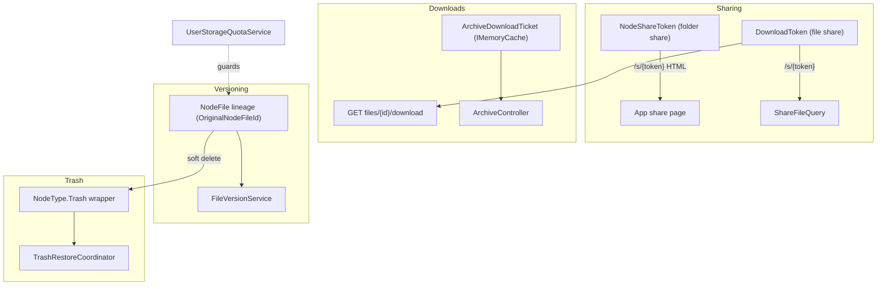
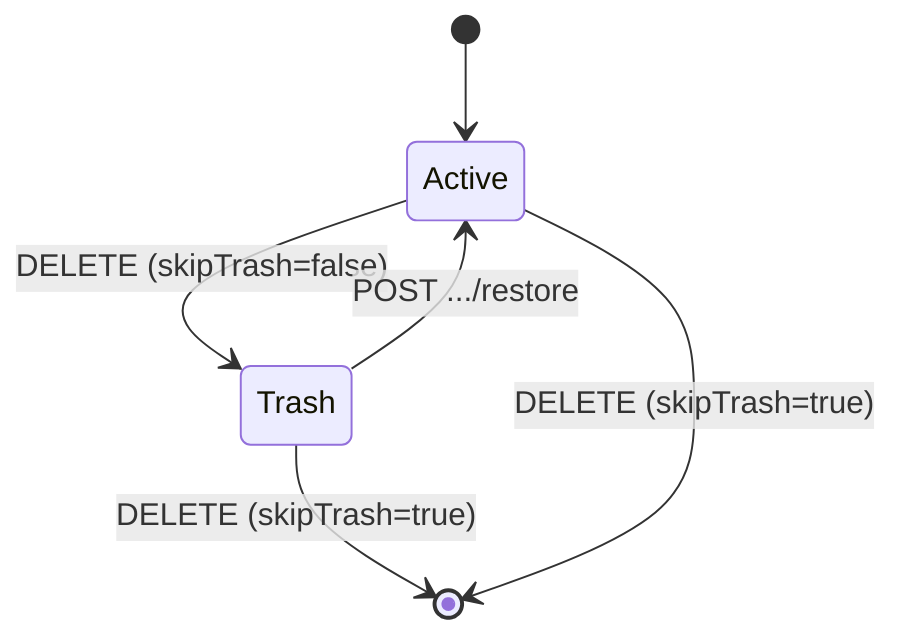

# 11. Sharing, Versioning, Trash, Archives & Quotas

This section documents the user-facing content operations that sit on top of Cotton's content-addressed storage and layout model: public sharing of files and folders, single-use and expiring download tokens, file version lineages, the soft-delete trash/restore model, on-the-fly ZIP archive downloads, and logical per-user storage quotas. All of these features deliberately reuse the same `Node` / `NodeFile` / `FileManifest` domain so that ownership, deduplication, storage reclaim, integrity verification, and quota accounting stay on one model rather than parallel tables. Where a feature touches storage streaming, cryptography, or the layout tree, that subsystem is documented in its own section (see *Storage Engine*, *Cryptography Engine*, and *Layout & Topology*); this section concentrates on the operations themselves and their HTTP surface.

## Purpose & overview

These operations are exposed across five controllers:

- `src/Cotton.Server/Controllers/FileController.cs` — file sharing (`/s/{token}`), token-based downloads, file versioning, file delete/restore.
- `src/Cotton.Server/Controllers/LayoutController.cs` — folder (node) sharing, the anonymous shared-folder browse API, node delete/restore.
- `src/Cotton.Server/Controllers/ArchiveController.cs` — ticketed ZIP archive downloads.
- `src/Cotton.Server/Controllers/UserController.cs` — the per-user storage-quota snapshot endpoint.
- `src/Cotton.Server/Controllers/AuthController.cs` — bulk file-share revocation; `src/Cotton.Server/Controllers/SettingsController.cs` — the admin default-quota setter.

Two token entities back sharing. `NodeShareToken` (`src/Cotton.Database/Models/NodeShareToken.cs`) shares a *folder* subtree; `DownloadToken` (`src/Cotton.Database/Models/DownloadToken.cs`) shares a single *file* and also backs version download links. Both are signed, read-boundary-verified rows (see *Database Integrity & Row Signing*), with dedicated descriptors in `src/Cotton.Server/Services/DatabaseIntegrity/Descriptors/NodeShareTokenIntegrityDescriptor.cs` and `.../DownloadTokenIntegrityDescriptor.cs`.

## Sharing

### Folder shares — NodeShareToken

`NodeShareToken` columns (`src/Cotton.Database/Models/NodeShareToken.cs`): `Name` (folder display name captured at share time), `Token` (unique opaque value, `[Index(nameof(Token), IsUnique = true)]`), `NodeId`, `ExpiresAt` (`DateTime?`; null means never), `CreatedByUserId`. The `Node` navigation is `DeleteBehavior.Cascade` (deleting the node deletes its share rows); `CreatedByUser` is `DeleteBehavior.Restrict`. The row inherits `Id`, `CreatedAt`, `UpdatedAt` from `BaseEntity<Guid>`.

A share link is created by `GET /api/v1/layouts/nodes/{nodeId}/share-link` (`LayoutController.GetNodeShareLink`):

- Query params: `expireAfterMinutes` (default `1440` = 24h) and optional `customToken`. `expireAfterMinutes` is validated by `ArgumentOutOfRangeException.ThrowIfGreaterThan(expireAfterMinutes, 60*24*365)` (one year) and `ThrowIfNegativeOrZero(expireAfterMinutes)`, so it must be `1 … 525600`.
- The node must be owned by the caller and `Type == NodeType.Default` (trash folders cannot be shared); otherwise `404`.
- If `customToken` is supplied it must not collide with an existing `DownloadToken` *or* `NodeShareToken`; on collision the endpoint returns HTTP 409 (`this.ApiConflict`). When no custom token is supplied, `CreateUniqueShareTokenAsync(16)` generates a 16-char random token via `StringHelpers.CreateRandomString`, retrying up to `maxAttempts = 8` times against both token tables (and throwing `InvalidOperationException` if all attempts collide).
- `ExpiresAt` is set to `DateTime.UtcNow.AddMinutes(expireAfterMinutes)`.
- The response body is the relative share URL string `"/s/{token}"`.

The anonymous browse API lets a recipient navigate the shared subtree without authentication. All handlers first call `ResolveActiveNodeShareTokenAsync`, which loads the token (filtering on `ExpiresAt`), runs `IDatabaseIntegrityVerifier.RequireValid` on both the token (`"shared-folder.node-token"`) and its root node (`"shared-folder.root-node"`), and rejects non-`Default` root nodes.

| Endpoint | Auth | Purpose |
| --- | --- | --- |
| `GET /api/v1/layouts/shared/{token}` | Anonymous | `GetSharedNodeInfo` — returns `SharedNodeInfoDto` (`Token`, root `NodeId`, `Name`, `ExpiresAt`). |
| `GET /api/v1/layouts/shared/{token}/children` | Anonymous | `GetSharedNodeChildren` — paged `SharedNodeContentDto` of subfolders + files under `nodeId` (defaults to the share root). |
| `GET /api/v1/layouts/shared/{token}/ancestors/{nodeId}` | Anonymous | `GetSharedNodeAncestors` — breadcrumb path from the share root down to `nodeId`. |
| `POST /api/v1/layouts/shared/{token}/archives/download-link` | Anonymous | `CreateSharedArchiveDownloadLink` — prepares a ZIP archive of one folder (`NodeIds = [targetNodeId]`) inside the share, delegating to `ArchiveDownloadService.CreateDownloadLinkAsync`. |
| `GET /api/v1/layouts/shared/{token}/files/{nodeFileId}/content` | Anonymous | `DownloadSharedNodeFile` — streams (or previews) a single file inside the shared subtree. |

The crucial authorization primitive is `IsNodeInSharedSubtreeAsync(nodeId, sharedRootNodeId, ownerId)`. It walks `ParentId` from the requested node upward, integrity-verifying each hop via `LoadVerifiedSharedDefaultNodeAsync` (which scopes by `OwnerId == ownerId` and `Type == NodeType.Default` and calls `RequireValid`), returning `true` only if the share root is reached. It bounds the walk at `maxDepth = 512` and uses a `visited` set to reject cycles. Every anonymous folder endpoint scopes queries to `OwnerId == nodeShareToken.CreatedByUserId` and `Type == NodeType.Default`, so a recipient can never read another user's data or trashed content even with a guessed `nodeFileId`. Note `DownloadSharedNodeFile` does not consult a `DownloadToken` at all — the share token plus subtree membership is the authorization.

`GetSharedNodeChildren` interleaves folders and files into a single paginated stream: folders are ordered by `NameKey` and counted first, files (ordered by `NameKey`) follow. It computes `nodesToTake = max(0, min(pageSize, nodesCount - skip))`, `filesSkip = max(0, skip - nodesCount)`, and `filesToTake = max(0, pageSize - nodesToTake)` so that a single `page`/`pageSize` window spans the folder list and then the file list, and emits the combined `TotalCount = nodesCount + filesCount` as both the DTO field and an `X-Total-Count` response header. `pageSize` defaults to 100; both `page` and `pageSize` must be positive (`ArgumentOutOfRangeException.ThrowIfNegativeOrZero`).

Shared files DTO loading (`LoadSharedFilesAsync`) projects each `NodeFile` into `SharedNodeFileDto` (`Id`, `CreatedAt`, `UpdatedAt`, `NodeId`, `Name`, `ContentType`, `SizeBytes`, and `PreviewHashEncryptedHex` via `FileManifest.GetPreviewHashEncryptedHex()`), so the recipient UI can render previews without ever seeing raw chunk hashes. `GetPreviewHashEncryptedHex()` derives its value from `FileManifest.SmallFilePreviewHashEncrypted`.

### File shares — DownloadToken and the `/s/{token}` page

`DownloadToken` columns (`src/Cotton.Database/Models/DownloadToken.cs`): `FileName`, `Token` (unique, `[Index(nameof(Token), IsUnique = true)]`), `NodeFileId`, `ExpiresAt` (`DateTime?`), `CreatedByUserId`, and `DeleteAfterUse` (bool). Both navigations (`CreatedByUser`, `NodeFile`) are `DeleteBehavior.Restrict`.

A file share/download link is minted by `GET /api/v1/files/{nodeFileId}/download-link` (`FileController.DownloadFile`):

- Params: `expireAfterMinutes` (default `1440`, same `1 … 525600`-minute validation via `ThrowIfGreaterThan`/`ThrowIfNegativeOrZero`), `customToken` (default `""`), `deleteAfterUse` (default `false`).
- The file must be owned by the caller and live in a `NodeType.Default` node; otherwise `404`.
- A non-empty `customToken` is checked for collision against `DownloadTokens` only (not `NodeShareTokens`); collision returns HTTP 409. When no custom token is supplied, the token is `StringHelpers.CreateRandomString(16)` with **no** uniqueness-retry loop (the unique index would surface a duplicate as a DB error).
- `ExpiresAt = DateTime.UtcNow.AddMinutes(expireAfterMinutes)`.
- Returns the relative URL string `"/api/v1/files/{nodeFileId}/download?token={token}"` (built from `Routes.V1.Files`).

The public landing route is `GET|HEAD /s/{token}` (`FileController.Share`), which delegates to `ShareFileQuery` / `ShareFileQueryHandler` (`src/Cotton.Server/Handlers/Files/ShareFileQuery.cs`). The handler is the heart of public sharing and supports three view modes via the `?view=` query string:

| `view` | Behavior |
| --- | --- |
| `page` (default; also any `null` value) | Returns an HTML page (`BuildRedirectHtml`) with Open Graph / Twitter card meta tags and a `meta http-equiv="refresh"` + JS `window.location.replace` redirect to the SPA route `/share/{token}`. |
| `download` | Streams the file as an attachment (`downloadName = FileName`). |
| `inline` | Streams the file inline (`downloadName = null`, e.g. for in-browser preview), with range support. |

Any other `view` value yields a `badRequest` result (`"Invalid view mode. Valid values: page, download, inline."`). Control flow inside `ShareFileQueryHandler.Handle`:

1. Parse the view mode (`TryParseViewMode`); reject invalid modes.
2. Load the `DownloadToken` (`LoadDownloadTokenAsync`) filtered by token and non-expiry (`!ExpiresAt.HasValue || ExpiresAt > now`). For HTML/HEAD requests it skips eager-loading chunks; for actual downloads it includes `FileManifest.FileManifestChunks.Chunk`.
3. If no live download token exists *and* the request is HTML, fall back to looking up a `NodeShareToken` with the same token value (`BuildMissingTokenResultAsync` → `LoadNodeShareTokenAsync`) and emit a folder-share redirect page; if there is also no live `Default`-rooted folder share, the result is an HTML **redirect to `{baseAppUrl}/404`** (for non-HTML/HEAD it is a plain `404`). This is what lets one `/s/{token}` URL serve either a file or a folder share.
4. Integrity-verify the token (`RequireValid`, boundary `"share.download-token"`). For HTML/HEAD requests verify file *metadata* only (`FileGraphIntegrityVerifier.RequireValidMetadata`, `"share.file-metadata"`); for downloads verify file *content* (`RequireValidContent`, `"share.file-download"`).
5. Reject if the file's node is not `NodeType.Default` (trashed files are not downloadable through shares): HTML → redirect to `/404`, otherwise `404`.
6. Build the result: HTML redirect, a `HEAD` response (content type/length, ETag, content disposition), or a streamed file.

The ETag is `"sha256-{hex(FileManifest.ProposedContentHash)}"`; `LastModified` is the token's `CreatedAt`. The controller sets `Content-Encoding: identity` and `Cache-Control: private, no-store, no-transform` on the `head` and `stream` cases. Range requests are enabled on the stream (`enableRangeProcessing: true`).

### Single-use semantics (DeleteAfterUse via Response.OnCompleted)

When `DownloadToken.DeleteAfterUse` is set, the token is removed **after** the response body finishes streaming, using `Response.OnCompleted`. This appears in several places:

- `FileController.Share` (`stream` case): if `result.DeleteAfterUse && result.DeleteTokenId.HasValue`, it registers an `OnCompleted` callback that re-loads the token by id and `Remove`s it.
- `FileController.DownloadFileByToken` (`GET /api/v1/files/{nodeFileId}/download`): if the loaded `downloadToken.DeleteAfterUse`, it registers an `OnCompleted` callback that removes the tracked token.
- `FileController.HonourDeleteAfterUse` (shared by the HLS playlist/segment endpoints `…/hls/master.m3u8`, `…/hls/playlist.m3u8`, `…/hls/seg-{n}.ts`): same `OnCompleted`-delete pattern.

Registering the delete on `OnCompleted` (rather than before streaming) ensures a partial/failed transfer does not consume the single-use token. There is one deliberate exception in the share path: an *inline metadata range probe* — a `GET` with `Range: bytes=0-3` on an `inline` view (`IsInlineMetadataRangeProbe`) — neither consumes a single-use token nor fires a download notification (`deleteAfterUse: downloadToken.DeleteAfterUse && !isMetadataRangeProbe`, `notifyDownload: !isMetadataRangeProbe`). This lets the preview UI sniff the first bytes without burning a one-time link.

`DownloadFileByToken` additionally serves previews: with `?preview=true` and a non-null `FileManifest.LargeFilePreviewHash`, it streams the WebP preview (`image/webp`) with a long-lived immutable cache (`Cache-Control: public, max-age=31536000, immutable`) and an `If-None-Match`/304 fast path (ETag `"sha256-{hex(LargeFilePreviewHash)}"`). The preview path verifies metadata only (`RequireValidMetadata`), the full-content path verifies content (`RequireValidContent`). It also permits historical-version files through the node-type gate: `nodeFile.Node.Type != NodeType.Default && !FileVersionService.IsHistoricalVersion(nodeFile)` returns `404`, so version rows (which live under trash nodes — see below) remain downloadable via their tokens.

### Share-download notifications

`SharedFileDownloadNotifier` (`src/Cotton.Server/Services/SharedFileDownloadNotifier.cs`, implementing `ISharedFileDownloadNotifier` from `src/Cotton.Server/Abstractions/ISharedFileDownloadNotifier.cs`) sends the owner a "shared file downloaded" notification, but at most once per `(ownerId, tokenId, ip, userAgent)` tuple within a 10-minute window — the de-dup key `shared-download:{ownerId:N}:{tokenId:N}:{ip}:{userAgent}` is held in `IMemoryCache` with `AbsoluteExpirationRelativeToNow = TimeSpan.FromMinutes(10)`. The IP is taken from `HttpContext.Request.GetRemoteIPAddress()`, except on a public instance (`Constants.IsPublicInstance`, driven by the `COTTON_PUBLIC_INSTANCE` env var) where it is forced to `IPAddress.Loopback` to avoid leaking visitor addresses; the IP, user-agent, and `IGeoLookupService` are then handed to `INotificationsProvider.SendSharedFileDownloadedNotificationAsync`. It is invoked from `ShareFileQueryHandler.CreateStreamResultAsync` only when `notifyDownload` is true and `HttpContext` is non-null (suppressed for the inline metadata probe).

### Bulk share revocation

`POST /api/v1/auth/invalidate-share-links` (`AuthController.InvalidateShareLinks`) lets an authenticated user kill all of their live file-download tokens at once. It calls `DownloadTokenExpirationService.ExpireActiveTokensCreatedByUserAsync` (`src/Cotton.Server/Services/DownloadTokenExpirationService.cs`), which loops through every `DownloadToken` created by the user that is still active (`ExpiresAt == null || ExpiresAt > expiresAt`) in pages of `BatchSize = 1000` ordered by `Id`, setting `ExpiresAt = expiresAt` (the current UTC time), saving, and clearing the change tracker between batches. Note this expires *file* download tokens only; `NodeShareToken` rows are not touched by this endpoint.

## Download tokens — expiry & retention

`DownloadToken` lifecycle:

- **Created** by version download links (`FileVersionService.CreateVersionDownloadLinkAsync`) and the `download-link` endpoint. `ExpiresAt` is `now + expireAfterMinutes`.
- **Expired** (soft) by setting `ExpiresAt` to the past — done on bulk revocation, when a file is moved to trash (`DeleteFileQueryHandler.MoveToTrashAsync` clamps each live token's `ExpiresAt` to now), and when a node subtree is trashed (`DeleteNodeQueryHandler.MoveDescendantsToTrashAsync` does the same for tokens whose file lives in the subtree).
- **Hard-deleted** either eagerly (permanent file/node delete and version pruning, via `ExecuteDeleteAsync`) or by the retention job.

`DownloadTokenRetentionJob` (`src/Cotton.Server/Jobs/DownloadTokenRetentionJob.cs`) is a Quartz job annotated `[JobTrigger(days: 1)]`, i.e. a 1-day repeat interval. On execution it first awaits `Task.Delay(240_000)` (4 minutes) to let the server stabilize, then removes every `DownloadToken` whose `ExpiresAt != null && ExpiresAt <= now - 30 days` in a single `RemoveRange`/`SaveChangesAsync` (it loads all matching rows at once — it is **not** paginated; the paging behavior lives in `DownloadTokenExpirationService`, used for bulk revocation). So an expired token lingers (returning `404` to clients because of the expiry filter) for at least 30 days before physical deletion. Tokens with `ExpiresAt == null` are never swept by this job.

## File versioning

### Model — version lineages without a version table

`FileVersionService` (`src/Cotton.Server/Services/FileVersionService.cs`) implements versioning **without a dedicated table**. Historical versions are ordinary `NodeFile` rows linked by `OriginalNodeFileId`:

- A brand-new file has `OriginalNodeFileId == Guid.Empty` (the visible file *starts* a lineage).
- The first time content changes, the *previous* manifest is preserved as a new `NodeFile` (the historical row), and both the visible file and that row get `OriginalNodeFileId` set to the visible file's id — establishing the lineage id (`NodeFileHistoryService.SaveVersionAndUpdateManifestAsync`).
- `IsHistoricalVersion(file)` is `file.OriginalNodeFileId != Guid.Empty && file.Id != file.OriginalNodeFileId`.
- `GetLineageId(file)` normalizes either case: `OriginalNodeFileId == Guid.Empty ? Id : OriginalNodeFileId`.

Historical version rows are parked under **trash wrapper nodes** (`NodeType.Trash`): `NodeFileHistoryService.SaveVersionAndUpdateManifestAsync` calls `ILayoutService.CreateTrashItemAsync(userId)` to create a throwaway wrapper, then inserts the version `NodeFile` there (copying the old `FileManifestId`, the old `Metadata`, and the name). This keeps history out of the visible `Default` tree while still being a first-class, owned, quota-counted, downloadable file. Because historical rows live under `Trash` nodes, the integrity boundary and the node-type gate in download endpoints explicitly special-case `IsHistoricalVersion`.

### Capture decision — NodeFileHistoryService

`NodeFileHistoryService.SaveVersionAndUpdateManifestAsync` (`src/Cotton.Server/Services/NodeFileHistoryService.cs`) decides whether an update warrants a snapshot:

- If `nodeFile.FileManifestId == newFileManifestId` → no version (returns false; nothing changed).
- `ShouldSaveVersionAsync`: if the old manifest id is `Guid.Empty` → false; if the old manifest is missing or its `SizeBytes == 0` → false (an empty/placeholder file is not worth versioning).
- If the new manifest doesn't exist yet → true (defensive).
- Otherwise compare `ProposedContentHash` byte sequences; a version is saved only when the content hash actually differs.

Regardless of whether a version was captured, the visible row is repointed: `nodeFile.FileManifestId = newFileManifestId`. The whole operation is invoked through `FileVersionService.CaptureAndUpdateManifestAsync`, which (when a capture occurred) saves, runs retention, and returns a `FileVersionCaptureResult(bool Captured, long RemovedBytes)` (`src/Cotton.Server/Models/FileVersionCaptureResult.cs`, a `readonly record struct` with a static `Empty`).

Capture is wired into both content-update paths:

- `FileController.UpdateFileContent` (`PATCH /api/v1/files/{nodeFileId}/update-content`) — calls `_quota.EnsureCanChangeFileManifestAsync` then `_versions.CaptureAndUpdateManifestAsync` (inside the layout-locked transaction).
- WebDAV PUT overwrite (`src/Cotton.Server/Handlers/WebDav/WebDavPutFileRequest.cs`) — same `EnsureCanChangeFileManifestAsync` + `CaptureAndUpdateManifestAsync` pair.

### Retention policy — FileVersionRetentionService

`FileVersionRetentionService.ApplyAsync` (`src/Cotton.Server/Services/FileVersionRetentionService.cs`) prunes excess history after each capture. The cap depends on the server's `StorageSpaceMode` (`SettingsProvider.GetServerSettings().StorageSpaceMode`, resolved by `ResolveMaxHistoricalVersions`):

| `StorageSpaceMode` | Value | Max historical versions kept |
| --- | --- | --- |
| `Optimal` (default) | 0 | `OptimalHistoricalVersionCount` = 10 |
| `Limited` | 1 | `LimitedHistoricalVersionCount` = 2 |
| `Unlimited` | 2 | `null` → no pruning |

Pruning loads historical rows ordered by `CreatedAt, Id`. If `historicalVersions.Count <= max`, nothing happens. Otherwise `pruneCount = count - max`; the candidates are `historicalVersions.Skip(1)` (so index 0 — the immutable original — is **always** skipped), with any ids in `protectedVersionIds` excluded, then `.Take(pruneCount)`. The candidate rows are deleted through `FileVersionStorageService.DeleteHistoricalVersionsAsync`, whose returned byte total is propagated so the quota cache can be adjusted.

### Storage cleanup — FileVersionStorageService

`FileVersionStorageService.DeleteHistoricalVersionsAsync` (`src/Cotton.Server/Services/FileVersionStorageService.cs`) is the single place version rows are physically removed. It:

1. Sums `FileManifest.SizeBytes` across the doomed versions (the logical bytes to credit back).
2. Deletes any `DownloadToken` rows the user created that point at those version ids (`ExecuteDeleteAsync`).
3. `RemoveRange`s the `NodeFile` rows and saves.
4. For each distinct wrapper node id, calls `DeleteWrapperIfEmptyAsync`, which deletes the `NodeType.Trash` wrapper node only if it now has no child nodes and no files.

Note it removes the manifest *references*; reclaiming the underlying chunks is the storage GC's job (see *Storage Engine*) and happens only once no manifest references remain.

### Version operations & endpoints

| Endpoint | Service call (`FileVersionService`) | Effect |
| --- | --- | --- |
| `GET /api/v1/files/{nodeFileId}/versions` | `ListVersionsAsync` | Returns `FileVersionDto[]` (current + history), newest first. |
| `POST /api/v1/files/{nodeFileId}/versions/{versionId}/restore` | `RestoreVersionAsync` | Restores a historical manifest as the active content; broadcasts SignalR `FileUpdated`. |
| `DELETE /api/v1/files/{nodeFileId}/versions/{versionId}` | `DeleteVersionAsync` | Removes one historical version (original protected). |
| `GET /api/v1/files/{nodeFileId}/versions/{versionId}/download-link` | `CreateVersionDownloadLinkAsync` | Mints a `DownloadToken` for the version and returns its URL. |

`ListVersionsAsync` → `BuildVersionDtos`: each historical row at index `i` gets `VersionNumber = i+1`, `IsOriginal = (i == 0)`, `CanDelete = (i != 0)`; the current file is appended with `VersionNumber = historicalVersions.Count + 1`, `IsCurrent = true`, `CanDelete = false`, and `IsOriginal = (historicalVersions.Count == 0)` (the current file is itself the original when no history exists yet). The list is returned ordered by `VersionNumber` descending. `FileVersionDto` fields (`src/Cotton.Server/Models/Dto/FileVersionDto.cs`): `Id`, `NodeFileId` (always the current visible file id), `FileManifestId`, `Name`, `ContentType`, `SizeBytes`, `CreatedAt`, `VersionNumber`, `IsCurrent`, `IsOriginal`, `CanDelete`.

`RestoreVersionAsync` is the most subtle: it opens a transaction, acquires the per-layout advisory lock (`LayoutLocks.AcquireForLayoutAsync`), checks quota for the manifest swap (`EnsureCanChangeFileManifestAsync`), then **captures the current state as a new version before swapping to the chosen version's manifest** (so a restore is itself non-destructive and reversible). The version being restored is passed as `protectedVersionIds` so retention can't prune it during the same call. After commit it reconciles the quota cache (`RecordLogicalBytesAdded`/`RecordLogicalBytesRemoved`) and returns the updated file as `NodeFileManifestDto`.

`DeleteVersionAsync` loads the lineage's history (tracked), finds the target, and delegates to the private `DeleteHistoricalVersionAsync(userId, historicalVersions, version, ct)`, which refuses to delete index 0 (`throw new BadRequestException<NodeFile>("The original file version cannot be deleted.")`). The public `DeleteHistoricalVersionAsync(userId, versionId, ct)` is the lineage-agnostic variant used when a historical row is the *direct* target of a `skipTrash` delete (see Trash below); it loads the lineage from the row's `OriginalNodeFileId` and applies the same original-protection rule.

`CreateVersionDownloadLinkAsync` mints a non-`DeleteAfterUse` `DownloadToken` (`expireAfterMinutes` validated `1 … 525600`, token length 16) pointing at the version row and returns `"/api/v1/files/{versionId}/download?token=…"`.

Two bulk helpers support permanent deletes: `DeleteLineageVersionsAsync` (all history for one lineage) and `DeleteLineageVersionsForCurrentFilesAsync` (all history for a set of current files in a subtree). `ContainsHistoricalVersionsAsync` guards permanent folder deletion.

### Versions dialog workflow (front-end)

The web client surfaces this through `src/cotton.client/src/pages/files/components/FileVersionsDialog.tsx` (queries/mutations in `src/cotton.client/src/shared/api/queries/fileVersions.ts`). From a file's action menu the user opens the dialog, which lists versions, and per row offers three `BusyAction`s — `"restore"`, `"delete"`, `"download"` — wired to `useRestoreFileVersionMutation`, `useDeleteFileVersionMutation`, and a download-link call respectively. Restore and delete prompt a typed confirmation; the delete action is guarded by `version.canDelete`, so the original version is rendered non-deletable (matching `CanDelete = false`).

## Trash & restore

### Soft-delete model

Deletion has two modes selected by a `skipTrash` query flag:

- **Soft delete** (default, `skipTrash=false`): the item is *moved* into the user's trash tree (`NodeType.Trash`), recording where it came from.
- **Permanent delete** (`skipTrash=true`): the item and (for files) its version lineage are physically removed and bytes credited back to the quota.

Files: `DeleteFileQuery` / `DeleteFileQueryHandler` (`src/Cotton.Server/Handlers/Files/DeleteFileQuery.cs`), invoked by `DELETE /api/v1/files/{nodeFileId}` (`FileController.DeleteFile`, which afterward broadcasts SignalR `FileDeleted` with a `NodeFileDeletedEventDto`). There is a special case at the top of `Handle`: if `skipTrash` is set *and* the target is itself a historical version (`FileVersionService.IsHistoricalVersion`), it routes to `_versions.DeleteHistoricalVersionAsync(userId, nodeFile.Id)` and returns. Otherwise:

- On soft delete (`MoveToTrashAsync`): acquire the layout lock, re-load the file (including its `DownloadTokens` collection), require it to be `NodeType.Default`, record the original parent path into metadata (`TrashRestoreCoordinator.SetOriginalParentPath`, value from `ILayoutNavigator.GetNodePathFromRootAsync`), create a fresh trash wrapper via `CreateTrashItemAsync`, repoint `NodeFile.NodeId` to it, and clamp every still-live `DownloadToken` on the file to expire now.
- On permanent delete (`DeletePermanentlyAsync`): delete lineage versions (`DeleteLineageVersionsAsync`), `ExecuteDeleteAsync` the file's download tokens, remove the row, then credit `FileManifest.SizeBytes + removedVersionBytes` back to the quota cache (`RecordLogicalBytesRemoved`).

Nodes: `DeleteNodeQuery` / `DeleteNodeQueryHandler` (`src/Cotton.Server/Handlers/Nodes/DeleteNodeQuery.cs`), invoked by `DELETE /api/v1/layouts/nodes/{nodeId}` (`LayoutController.DeleteLayoutNode`, which afterward broadcasts SignalR `NodeDeleted` with a `NodeDeletedEventDto`). Root nodes cannot be deleted (`InvalidOperationException("Cannot delete root node.")`). Soft delete moves the node under a trash wrapper (`SetParent(trashItem, NodeType.Trash)`), records its **original parent's** path, and flips the **entire subtree** to `NodeType.Trash` (`MoveDescendantsToTrashAsync`, via `NodeSubtreeService.CollectSubtreeIdsAsync`), expiring any live download tokens whose file lives inside. Permanent delete first rejects the operation with `BadRequestException<Node>("File version containers cannot be deleted directly.")` if the subtree still contains historical versions (`ContainsHistoricalVersionsAsync`), then `ExecuteDeleteAsync`s tokens, removes files (crediting `Sum(SizeBytes) + removedVersionBytes` via `DeleteLineageVersionsForCurrentFilesAsync`), and removes nodes sorted leaves-first (`ParentId != null` before `ParentId == null`) to satisfy the self-referencing FK restriction.

### Trash metadata

`TrashMetadataKeys` (`src/Cotton.Server/Services/TrashMetadataKeys.cs`) is an `internal static` class defining exactly one key: `OriginalParentPath = "originalParentPath"`. The original parent path (computed by `ILayoutNavigator.GetNodePathFromRootAsync`) is stored in the item's `Metadata` dictionary at delete time and removed on successful restore. The static `TrashRestoreCoordinator.GetOriginalParentPath` / `SetOriginalParentPath` / `RemoveOriginalParentPath` are the only accessors; the mutating ones operate on copies of the metadata dictionary.

### Restore coordination — TrashRestoreCoordinator

`TrashRestoreCoordinator` (`src/Cotton.Server/Services/TrashRestoreCoordinator.cs`) centralizes restore logic shared by file and node restore:

- `ResolveOrCreateParentAsync` — resolves the stored original parent path back to a live `Node` via `ILayoutNavigator.ResolveNodeByPathAsync`. An `ArgumentException` from path resolution becomes a `ParentResolution` with `InvalidPathReason`. If the parent is missing and `createMissingParents` is true, `CreateMissingParentsAsync` walks/recreates each path segment (validating each via `NameValidator.TryNormalizeAndValidate`), creating `Default` nodes as needed; an invalid stored segment yields `InvalidPathReason`.
- `FindConflictAsync` — checks the target parent for an existing folder (`NodeType.Default`) or file with the same `NameKey`, returning a `ConflictInfo(RestoreConflictKind Kind, string Name, Guid Id)` (folder checked first).
- `SendConflictToTrashAsync` — when overwriting, moves the conflicting resource to trash by issuing a `DeleteNodeQuery` / `DeleteFileQuery` with `skipTrash: false` through the mediator.
- `DeleteWrapperIfEmptyAsync` — removes the auto-created trash wrapper / recreated parent once the restored item has left it empty (no child nodes, no files).

`ParentResolution(Node? Parent, string? InvalidPathReason)` is the resolution result type.

### Restore handlers & RestoreItemRequest

`RestoreItemRequest` (`src/Cotton.Server/Models/Requests/RestoreItemRequest.cs`) carries two booleans: `CreateMissingParents` and `Overwrite`.

- Files: `POST /api/v1/files/{nodeFileId}/restore` → `RestoreFileQuery` / `RestoreFileQueryHandler` (`src/Cotton.Server/Handlers/Files/RestoreFileQuery.cs`).
- Nodes: `POST /api/v1/layouts/nodes/{nodeId}/restore` → `RestoreNodeQuery` / `RestoreNodeQueryHandler` (`src/Cotton.Server/Handlers/Nodes/RestoreNodeQuery.cs`).

Both run inside a transaction with the layout advisory lock held, and both validate that the item is a **top-level** trash entry — its wrapper must be `NodeType.Trash` and its `ParentId` must equal the user's trash root (`ILayoutService.GetUserTrashRootAsync`): `ValidateTopLevelTrashFileAsync` for files, `ResolveTopLevelTrashWrapperAsync` for nodes. You restore a trashed item, not an arbitrary descendant. The handlers return a `RestoreOutcomeDto` (`src/Cotton.Server/Models/Dto/RestoreOutcomeDto.cs`), never an exception, for the expected failure cases:

| `RestoreStatus` | Value | Meaning |
| --- | --- | --- |
| `Restored` | 0 | Success; `RestoredFile` / `RestoredNode` carries the live DTO. |
| `ParentMissing` | 1 | Original parent no longer exists and `CreateMissingParents` was false; `MissingPath` set. |
| `Conflict` | 2 | A name collision exists and `Overwrite` was false; `ConflictKind` + `ConflictName` set. |
| `NotRestorable` | 3 | Item is not a top-level trash entry or the stored path is invalid; `Reason` set. |

`RestoreStatus` and `RestoreConflictKind` are serialized as strings (`[JsonConverter(typeof(JsonStringEnumConverter))]`). `RestoreConflictKind` is `Folder` (0) or `File` (1). `RestoreOutcomeDto` fields: `Status`, `OriginalParentPath`, `MissingPath`, `ConflictKind`, `ConflictName`, `RestoredNode`, `RestoredFile`, `Reason`.

On success the file handler sets `NodeId` to the resolved parent, removes the `originalParentPath` marker, deletes the now-empty wrapper, commits, and (in the controller) broadcasts SignalR `FileRestored`; the node handler returns `RestoredNode` and the controller broadcasts `NodeRestored`. **Both** restore handlers wrap a Postgres unique-violation (a concurrent restore that re-creates the same name) into a `Conflict` outcome via the private `IsUniqueViolation` check (`PostgresErrorCodes.UniqueViolation`).

## Archives — stored ZIP downloads

### Two-phase ticketed flow

Archive download is a two-step process. Step one (`POST /api/v1/archives/download-link`, authenticated, `ArchiveController.CreateDownloadLink`) prepares an in-memory ticket and returns metadata; step two (`GET /api/v1/archives/{token}`, anonymous, `ArchiveController.Download`) streams the ZIP. Decoupling them lets the API set an accurate `Content-Length` *before* a single byte is sent.

`CreateArchiveDownloadLinkRequest` (`src/Cotton.Server/Models/Requests/CreateArchiveDownloadLinkRequest.cs`) carries `FileIds`, `NodeIds` (both `IReadOnlyList<Guid>`), and an optional `ArchiveName`. `ArchiveDownloadService.CreateDownloadLinkAsync` (`src/Cotton.Server/Services/ArchiveDownloadService.cs`):

1. De-dupes and drops empty ids (`DistinctNonEmpty`); at least one file or folder is required (otherwise `BadRequest` "Select at least one file or folder to download."). If the loaded counts do not match the requested counts (missing/unowned ids) → `NotFound`.
2. Loads selected files (owned, `Default` node), integrity-checks each via `FileGraphIntegrityVerifier.RequireValidContent` (`"archive.selected-file"`), and adds file entries in the requested order (`OrderByRequestedIds`).
3. For each selected folder, emits a directory entry and breadth-first-walks the subtree (`AddFolderEntriesAsync`), emitting directory markers and file entries per level; folder files are also content-integrity-checked (`"archive.folder-file"`). The walk loads files with their `FileManifest.FileManifestChunks.Chunk` eagerly (`AsSplitQuery`) so the streamer has hashes and lengths.
4. Computes the exact archive size via `StoredZipArchiveWriter.CalculateLength(entries)` and a friendly file name (`BuildArchiveFileName`, default `cotton-download.zip`, normalized via `NameValidator`).
5. Stores an `ArchiveDownloadTicket` and returns `ArchiveDownloadLinkDto` { `Url` = `/api/v1/archives/{token}`, `FileName`, `SizeBytes`, `EntryCount` }.

`ArchiveDownloadService.CreateDownloadLinkAsync` returns a `CreateArchiveDownloadLinkResult` (status code + link/error); the controller maps `200/400/404` to MVC results. `ArchiveDownloadTicketStore` (`src/Cotton.Server/Services/ArchiveDownloadTicketStore.cs`) holds tickets in `IMemoryCache` keyed `archive-download:{token}` with a fixed 1-hour `Lifetime`. Tokens are 32 random bytes hex-encoded lowercase (`Convert.ToHexString(RandomNumberGenerator.GetBytes(32)).ToLowerInvariant()`). The `ArchiveDownloadTicket` record holds `FileName`, `SizeBytes`, `EntryCount`, and the entry list. An `ArchiveDownloadEntry(Path, SizeBytes, IsDirectory)` (which implements `IStoredZipEntry`) is either an `ArchiveDownloadDirectoryEntry` (zero-length marker, trailing-slash path) or an `ArchiveDownloadFileEntry` (carries `SizeBytes`, ordered `ChunkHashes`, and `ChunkLengths` keyed by hash for deterministic re-streaming).

`ArchiveController.Download` re-projects ticket entries into `StoredZipSourceEntry`s with a deferred `OpenReadAsync` func: directories open `Stream.Null`; files open `IStoragePipeline.GetBlobStream(chunkHashes, PipelineContext { FileSizeBytes, ChunkLengths })` (chunk lengths re-wrapped with `StringComparer.OrdinalIgnoreCase`). It sets `Content-Type: application/zip`, `Content-Length: ticket.SizeBytes`, `Content-Encoding: identity`, `Cache-Control: private, no-store, no-transform`, and a `Content-Disposition: attachment; filename*=…` header (`FileNameStar` only), then streams via `StoredZipArchiveWriter.WriteAsync(Response.Body, …)`. A missing/expired ticket returns `404` ("Archive download link not found."). The endpoint is anonymous: possession of the random 32-byte token is the authorization, and the ticket already pinned the resolved, integrity-checked entries at creation time.

### Path uniquification — ArchivePathUniquifier

`ArchivePathUniquifier` (`src/Cotton.Server/Services/ArchivePathUniquifier.cs`, `internal sealed`) prevents duplicate ZIP paths (case-insensitively, `StringComparer.OrdinalIgnoreCase`). `AddFile` / `AddDirectory` normalize the path (backslashes → `/`, trimmed) and, on collision, append ` (2)`, ` (3)`, … — inserting the suffix *before* the extension for files with a non-leading dot (`name (2).txt`). `Combine(parent, name)` joins normalized segments with `/`. An empty/whitespace normalized path throws `InvalidOperationException` ("Archive entry path cannot be empty."). `AddDirectory` returns a trailing-slash path; callers strip the slash where they need the bare path.

### Stored ZIP writer — StoredZipArchiveWriter

`StoredZipArchiveWriter` (`src/Cotton.Server/Services/StoredZipArchiveWriter.cs`) emits an **uncompressed (STORED, method 0)** ZIP whose total byte length is known in advance. Design choices, called out in the source comments:

- **STORED, not DEFLATE** → predictable size, low CPU, and a known `Content-Length`. Version-needed is `VersionStore = 20` (`VersionZip64 = 45` when ZIP64 applies).
- **UTF-8 filenames** via the language-encoding flag (`Utf8Flag = 1 << 11`, bit 11) rather than code pages.
- **Data descriptors** (`DataDescriptorFlag = 1 << 3`, bit 3) for file entries: sizes/CRC are written *after* the data. CRC-32 is computed while streaming.
- **Planning vs writing are separate** (`BuildPlan` vs `WriteAsync` / `CalculateLength`) precisely so the controller can set `Content-Length` first.

ZIP structure produced per entry: local file header (30 bytes + path) → file bytes → data descriptor (16 bytes, or 24 with ZIP64). After all entries: a central directory (46 bytes + path + optional ZIP64 extra per entry), an optional ZIP64 end-of-central-directory record + locator (56 + 20 bytes), and the end-of-central-directory record (22 bytes). Directory entries emit external attribute `0x10`, no data and no data descriptor.

ZIP64 is engaged precisely where 32/16-bit fields would overflow (`RequiresZip64UInt32(v) => v >= uint.MaxValue`, `RequiresZip64UInt16(v) => v >= ushort.MaxValue`):

- Per-file `UsesZip64DataDescriptor` when a (non-directory) entry's `SizeBytes >= uint.MaxValue`.
- Central-directory ZIP64 extra when entry size *or* its `LocalHeaderOffset >= uint.MaxValue` (`RequiresZip64CentralDirectoryMetadata` / `GetCentralZip64ExtraLength`) — so even small files in a >4 GiB archive get the offset promoted.
- ZIP64 end record/locator when entry count `>= ushort.MaxValue` or the central-directory length/offset `>= uint.MaxValue`.

The writer validates entry integrity: a negative size, an empty or `> ushort.MaxValue` UTF-8 path, or a streamed byte count that doesn't match the planned `SizeBytes` all throw `InvalidOperationException` (the size-mismatch check is what catches a chunk graph that changed between planning and streaming). Streaming uses a pooled 128 KiB buffer (`ArrayPool<byte>.Shared.Rent(128 * 1024)`). `StoredZipSourceEntry(Path, SizeBytes, IsDirectory, OpenReadAsync)` is the input record consumed by `WriteAsync`.

### CRC — Crc32Accumulator

`Crc32Accumulator` (`src/Cotton.Server/Services/Crc32Accumulator.cs`, `internal sealed`) is a standard table-driven CRC-32 (polynomial `0xEDB88320`, init `0xFFFFFFFF`, exposed value `~_state`). One instance accumulates per file entry via `Append(ReadOnlySpan<byte>)` as bytes stream through `WriteLocalEntryAsync`; the final value lands in both the data descriptor and the central-directory record.

## Quotas

### Logical quota model — UserStorageQuotaService

`UserStorageQuotaService` (`src/Cotton.Server/Services/UserStorageQuotaService.cs`) enforces a **logical** per-user quota: the sum of `FileManifest.SizeBytes` across all `NodeFile` rows the user owns (visible files *and* retained version rows). Quota is intentionally enforced on *file references*, not on raw chunk uploads — raw chunk pressure is handled separately by storage-pressure protection, because chunking is an internal storage detail (see *Storage Engine*).

The quota value itself is the single global server setting `DefaultUserStorageQuotaBytes` (`long?`) on `CottonServerSettings` (`src/Cotton.Database/Models/CottonServerSettings.cs`). There is **no per-user quota column**; every user is measured against the same configured limit. A null or `<= 0` setting means "unlimited" — all `EnsureCan…` checks short-circuit and `GetSnapshotAsync` returns null `QuotaBytes` / `AvailableBytes`. Admins set the value through `PATCH /api/v1/settings/default-user-storage-quota-bytes` (`SettingsController.SetDefaultUserStorageQuotaBytes`, Admin-only; a value of `0` is normalized to `null`/unlimited) and read it via the corresponding getter.

Usage is cached at two levels to keep the hot upload path off a per-file aggregate query:

- A request-scoped dictionary `_usedBytesByUser` (the service is registered per request/scope).
- A process-wide `IMemoryCache` entry `user-storage-quota:used:{userId:N}` with a 15-minute TTL (`UsedBytesCacheDuration`).

`GetUsedBytesAsync` checks the scoped dict, then the memory cache, and only on a cold cache runs the `SUM(FileManifest.SizeBytes)` aggregate over the user's `NodeFile` rows, populating both caches.

Enforcement methods, all funneling into the private `EnsureCanAddLogicalBytesAsync`:

| Method | Used by | Returns |
| --- | --- | --- |
| `EnsureCanAddFileReferenceAsync` | new file create (`CreateFileRequest`), WebDAV COPY (`WebDavCopyRequest`), WebDAV PUT new-file (`WebDavPutFileRequest`) | added bytes (manifest size) |
| `EnsureCanAddKnownFileSizeAsync` | WebDAV PUT pre-check (`WebDavPutFileRequest`) | — |
| `EnsureCanChangeFileManifestAsync` | content update (`FileController.UpdateFileContent`), WebDAV PUT overwrite, version restore | added bytes after dedup |

`EnsureCanChangeFileManifestAsync` is deduplication-aware: if the new manifest has the same id or the same `ProposedContentHash` as the current one, `additionalBytes` is 0. `EnsureCanAddLogicalBytesAsync` throws `BadRequestException<User>` ("Storage quota exceeded. Current usage is {used} bytes, quota is {quota} bytes.") when `usedBytes > quotaBytes - safeAdditionalBytes`, and (when `reserveInRequestCache`) optimistically bumps the scoped figure so multiple references inside one request are billed cumulatively. `RecordLogicalBytesAdded` / `RecordLogicalBytesRemoved` reconcile the caches after a successful commit (delete handlers, version pruning, restore) — these are called *after* `SaveChangesAsync` / `CommitAsync`, never speculatively.

`GetSnapshotAsync` produces `UserStorageQuotaDto` { `UsedBytes`, `QuotaBytes` (`long?`), `AvailableBytes` = `Math.Max(0, quota - used)` (`long?`) }, surfaced at `GET /api/v1/users/me/storage-quota` (`UserController.GetCurrentUserStorageQuota`). The same logical usage feeds WebDAV `PROPFIND` `quota-used-bytes` / `quota-available-bytes`.

### Default quota & template seeding

There is no explicit "seed a quota" action — assigning a default quota is purely the `DefaultUserStorageQuotaBytes` setting applied uniformly to all users (the README's "default user quotas" for public/demo instances refers to this setting). What *is* seeded is onboarding content: `DefaultUserContentSeeder` (`src/Cotton.Server/Services/DefaultUserContentSeeder.cs`) deep-copies the folder/file tree under the configured `DefaultUserTemplateNodeId` into a newly created account's `Default` root (`GetOrCreateRootNodeAsync`). `SeedAsync` runs from the user-creation paths: `AdminCreateUserRequest` (admin create), anonymous/demo guest creation (`AuthController`), and OIDC first-login (`OidcAuthenticationService`). It is a no-op when no template node is configured (`null`/`Guid.Empty`) or the template node is missing/not `Default`. Copied files reuse the source `FileManifestId` (a manifest reference) and get their own `OriginalNodeFileId` set to themselves (a fresh single-entry lineage). The seeder honors quota only indirectly: it copies manifest references, and those references then count toward the new user's usage on first `GetUsedBytesAsync`.

## Concurrency, failure modes & security considerations

- **Layout advisory locks.** Restore, version restore/delete, content update, and trash moves all take `LayoutLocks.AcquireForLayoutAsync` inside a transaction to serialize same-namespace mutations (a concurrent rename/move/create with the same `NameKey` could otherwise commit a cross-table duplicate). Restore additionally catches the Postgres unique-violation as a `Conflict` outcome.
- **Single-use after success.** `DeleteAfterUse` tokens are deleted on `Response.OnCompleted`, so an aborted transfer doesn't burn the link. The inline `bytes=0-3` metadata probe is explicitly exempted from both consumption and notification.
- **Anonymous endpoints are scoped by owner + node type.** Shared-folder and archive download endpoints are `[AllowAnonymous]` but every query is constrained to the share owner and `NodeType.Default`, and subtree membership is re-verified per request with cycle/depth guards (`maxDepth = 512`). Archive tickets pin integrity-checked entries at creation; the 32-byte token is the only credential and tickets expire after 1 hour.
- **Integrity gating.** Token rows, nodes, and file metadata/content pass through `IDatabaseIntegrityVerifier` / `FileGraphIntegrityVerifier` before any byte is served (see *Database Integrity & Row Signing*). HTML/HEAD paths verify metadata only (`RequireValidMetadata`); download paths verify full content (`RequireValidContent`, which requires the chunk graph to resolve).
- **Quota cache drift.** Usage is eventually consistent: the 15-minute memory-cache TTL and the manual add/remove reconciliations can briefly diverge from the true sum (e.g. if a process crashes between commit and `RecordLogicalBytes*`). The cold-cache aggregate is the source of truth and self-heals on TTL expiry. Quota is also not a hard transactional reservation — concurrent requests across processes could both pass the check; the design treats the limit as soft.
- **Version rows occupy quota.** Because history is real `NodeFile` rows, retained versions count against the user's quota. Restoring a version captures the current state first, so a restore can transiently increase usage; `EnsureCanChangeFileManifestAsync` guards it.
- **Expired-but-present tokens.** Expiring a token (setting `ExpiresAt` to the past) is immediate for access but physical removal waits up to 30 days (`DownloadTokenRetentionJob`). Never-expiring tokens (`ExpiresAt == null`) are not swept.

## Non-obvious design decisions & gotchas

- **No version table on purpose.** Versions are `NodeFile` rows under `NodeType.Trash` wrappers linked by `OriginalNodeFileId`. This reuses ownership, dedup, quota, download authorization, and storage cleanup — but it also means download/integrity code must special-case `IsHistoricalVersion` to let version rows through the "must be a `Default` node" gate.
- **The original version is sacred.** Index 0 of the historical list is never pruned by retention and cannot be deleted via the API (`BadRequestException<NodeFile>("The original file version cannot be deleted.")`); permanent folder deletes are blocked outright if any history remains (`"File version containers cannot be deleted directly."`).
- **One `/s/{token}` URL, two share kinds.** The share handler first tries a `DownloadToken` (file), then — for HTML requests only — falls back to a `NodeShareToken` (folder), so the public URL shape is uniform. Missing/expired tokens redirect HTML clients to `/404` rather than returning a bare 404 status.
- **Folder vs file token minting differ.** Folder shares (`GetNodeShareLink`) use `CreateUniqueShareTokenAsync` with up to 8 retries checking *both* token tables; file download links (`DownloadFile`) generate a single 16-char random token and only pre-check `DownloadTokens` for an explicit `customToken` collision.
- **Retention cap is server-wide, not per-user.** `StorageSpaceMode` (Optimal=10, Limited=2, Unlimited=∞) sets the history cap for everyone; there is no per-user override.
- **Bulk revoke is file-only.** `invalidate-share-links` expires `DownloadToken`s but not `NodeShareToken`s — folder shares are not killed by that endpoint.
- **Archive size is exact and pre-computed** so the browser shows a real progress bar; this is why the writer asserts the streamed byte count equals the planned size and fails the response if a file's chunk graph shifted after planning.
- **README vs code:** The README's "User quotas are logical, cached, and upload-aware" and "default user quotas" are accurate, but note the quota is a single global `DefaultUserStorageQuotaBytes` setting — there is no per-user quota field, and `DefaultUserContentSeeder` seeds *template content*, not a quota value. The README line "Share tokens can be single-use (`DeleteAfterUse`) and expire after configurable retention" is right about single-use and per-token expiry, but the *physical* retention grace is a fixed 30-day window before deletion (`DownloadTokenRetentionJob`), not an admin-configurable value, and that job deletes in one `RemoveRange` rather than in batches (the batched, paged path is the per-user bulk-revoke in `DownloadTokenExpirationService`).

## Related sections

See the *Storage Engine* and *Cryptography Engine* sections for `IStoragePipeline.GetBlobStream`, `PipelineContext`, chunk reassembly, and garbage collection of unreferenced chunks; *Layout & Topology* for `Node` / `NodeFile`, `NameKey` normalization, `ILayoutService` / `ILayoutNavigator`, and `LayoutLocks`; *Database Integrity & Row Signing* for the `RequireValid` / `RequireValidContent` boundaries; *Background Jobs & Scheduling* for Quartz `JobTrigger` jobs; *Notifications & Real-Time* for SignalR events (`FileDeleted`, `FileRestored`, `NodeDeleted`, `NodeRestored`, `FileUpdated`) and the shared-download notification; and *WebDAV* for the quota-aware PUT/COPY paths and `PROPFIND` quota properties.
