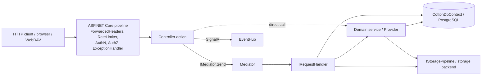
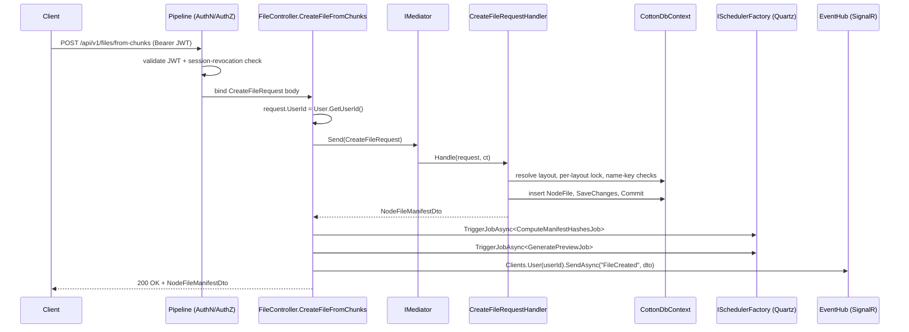

# 12. HTTP API & Application (Mediator) Layer

Cotton Cloud's web layer is a deliberately thin ASP.NET Core controller surface that delegates almost all non-trivial work to an in-process mediator (`EasyExtensions.Mediator`) and to domain services. Controllers parse and validate HTTP-shaped input, resolve the caller identity from JWT claims, dispatch a command/query (or call a service directly), and translate results into `IActionResult`. The composition root (`src/Cotton.Server/Program.cs`) wires everything up but contains no request-handling business logic. This section documents that layering, the full controller inventory, the mediator request/handler pattern, DTO/request models, Mapster mapping, route constants, DI registration, auth rate-limit policies, and provides an exhaustive endpoint reference.

## Purpose & overview

The HTTP/application layer exists to keep transport concerns (routing, model binding, status codes, headers, cookies, streaming) separate from domain logic (chunk ingest, layout/node graph mutations, file manifests, auth/session issuance, settings). The pattern is a pragmatic CQRS-lite:

- **Controllers** (`src/Cotton.Server/Controllers/*.cs`) are thin. They read route/query/body params, call `User.GetUserId()` to obtain the authenticated user id, and either send a mediator request or invoke an injected domain service.
- **Handlers** (`src/Cotton.Server/Handlers/**`) implement `IRequestHandler<TRequest>` / `IRequestHandler<TRequest, TResponse>` and contain the orchestration: transactions, per-layout locks, validation, EF Core queries, and storage-pipeline calls.
- **Services / Providers** (`src/Cotton.Server/Services`, `src/Cotton.Server/Providers`) hold reusable domain operations that both controllers and handlers call.
- **`Program.cs`** is logic-free: it resolves encryption settings (env-var master key or interactive unlock), registers services, builds the middleware pipeline, applies migrations, runs the database-integrity bridge backfill, performs optional auto-restore on an empty database, maps the SignalR hub, then runs.

Not every controller routes through the mediator. Several controllers (e.g. `ChunkController`, `NotificationsController`, `SettingsController`, `PreviewController`, and large parts of `FileController`/`LayoutController`) call domain services or `CottonDbContext` directly when there is no command/query handler for the operation. The mediator is used where an operation benefits from being a discrete, reusable, testable unit (file/node create-from-chunks/move/delete/restore/share, WebDAV verbs, user admin, auth sessions, server maintenance).



## Key components & responsibilities

| Component | File | Responsibility |
| --- | --- | --- |
| Route constants | `src/Cotton.Shared/Routes.cs` | `Routes.V1.*` string constants; base prefix `/api/v1`. |
| Mediator registration | `src/Cotton.Server/Program.cs` (`AddMediator()`) | Scans the calling assembly (`Cotton.Server`), registers all handlers + `IMediator` as transient. |
| Mapster config | `src/Cotton.Server/Mappings/MapsterConfig.cs` | Entity→DTO adapter rules; registered once via `MapsterConfig.Register()` in `Program.cs`. |
| Service registration extensions | `src/Cotton.Server/Extensions/ServiceCollectionExtensions.cs` | `AddStreamCipher`, `AddWebDavServices`, `AddChunkServices`, `AddDatabaseIntegrity`, `AddLayoutPathServices`, `AddLayoutSearchServices`, `AddWebDavAuth`. |
| Auth hardening | `src/Cotton.Server/Extensions/AuthHardeningExtensions.cs` | `AddAuthHardening`/`UseAuthHardening`; configures the two rate-limit policies and JWT session-revocation validation. |
| Rate-limit policy names | `src/Cotton.Server/Auth/AuthRateLimitPolicies.cs` | `Interactive = "auth.interactive"`, `Refresh = "auth.refresh"`. |
| WebDAV auth handler | `src/Cotton.Server/Auth/WebDavBasicAuthenticationHandler.cs` | `SchemeName = "WebDavBasic"`, `PolicyName = "WebDav"`. |
| Standard result type | `src/Cotton.Server/Models/CottonResult.cs` | `IActionResult` with `Success`/`Message`/`Data`/`MessageCode`/`StatusCode`; static `BadRequest`/`NotFound`/`Forbidden`/`InternalError`. |
| DTOs | `src/Cotton.Server/Models/Dto/*` | API response payloads (`NodeDto`, `NodeFileManifestDto`, `UserDto`, `SessionDto`, etc.). |
| Request models | `src/Cotton.Server/Models/Requests/*` | Inbound bodies bound from JSON (`MoveFileRequest`, `CreateNodeRequest`, `OidcProviderRequestDto`, etc.). |
| Mediator handlers | `src/Cotton.Server/Handlers/**` | Command/query handlers grouped by area: `Auth`, `Files`, `Nodes`, `Layouts`, `Users`, `Server`, `WebDav`. |

### Controllers

| Controller | File | Class-level route | Notes |
| --- | --- | --- | --- |
| `ArchiveController` | `src/Cotton.Server/Controllers/ArchiveController.cs` | `[Route(Routes.V1.Archives)]` (`/api/v1/archives`) | Streams prepared ZIP archives by one-time ticket. |
| `AuthController` | `src/Cotton.Server/Controllers/AuthController.cs` | `[Route(Routes.V1.Auth)]` (`/api/v1/auth`) | Login, refresh, logout, sessions, TOTP, passkeys, WebDAV token, password reset. Largest auth surface. |
| `ChunkController` | `src/Cotton.Server/Controllers/ChunkController.cs` | none (no `[ApiController]`, no class `[Route]`) | Each action sets its own absolute route via `Routes.V1.Chunks`. |
| `FileController` | `src/Cotton.Server/Controllers/FileController.cs` | none at class level (`[ApiController]` only) | Routes are absolute per-action (`Routes.V1.Files + ...`, `/s/{token}`). |
| `LayoutController` | `src/Cotton.Server/Controllers/LayoutController.cs` | `[Route(Routes.V1.Layouts)]` (`/api/v1/layouts`) | Nodes, navigation, search, stats, folder sharing. |
| `NotificationsController` | `src/Cotton.Server/Controllers/NotificationsController.cs` | none at class level (`[ApiController]` only) | Routes absolute via `Routes.V1.Notifications`; uses Gridify. |
| `OidcController` | `src/Cotton.Server/Controllers/OidcController.cs` | `[Route(Routes.V1.Auth + "/oidc")]` | OIDC providers admin + sign-in/link/callback. |
| `PreviewController` | `src/Cotton.Server/Controllers/PreviewController.cs` | `[Route(Routes.V1.Previews)]` (`/api/v1/preview`) | Serves encrypted-token-addressed WebP previews/avatars. |
| `ServerController` | `src/Cotton.Server/Controllers/ServerController.cs` | `[Route(Routes.V1.Server)]` (`/api/v1/server`) | Server info, security diagnostics, backup/GC triggers. |
| `SettingsController` | `src/Cotton.Server/Controllers/SettingsController.cs` | `[Route(Routes.V1.Settings)]` AND `[Route(Routes.V1.Server + "/settings")]` | Dual-mounted: both `/api/v1/settings` and `/api/v1/server/settings`. |
| `UserController` | `src/Cotton.Server/Controllers/UserController.cs` | `[Route(Routes.V1.Users)]` (`/api/v1/users`) | Current-user profile, preferences, quota, admin user CRUD. |
| `WebDavController` | `src/Cotton.Server/Controllers/WebDavController.cs` | `[Route("api/v1/webdav")]` AND `[Route("api/v1/webdav/{**path}")]` | Full WebDAV verb set; basic-auth scheme/policy. |

> Note: routing differs by controller. `ArchiveController`, `OidcController`, `PreviewController`, `ServerController`, `SettingsController`, `UserController`, `LayoutController`, and `WebDavController` use class-level `[Route]` (action routes are relative). `ChunkController`, `FileController`, and `NotificationsController` declare absolute routes per action using the `Routes.V1.*` constants, so the action attribute strings are the full paths. `ChunkController` is also the only controller without `[ApiController]`.

## How it works — the standard request flow

A representative authenticated mutation (creating a file from already-uploaded chunks) shows the full path: controller → mediator → handler → service/DbContext/storage, with a SignalR side-effect and two Quartz job triggers.



### Mediator request/handler pattern

The mediator is `EasyExtensions.Mediator` (a MediatR-style library that lives outside the Cotton repository). The contracts used in Cotton (from `EasyExtensions.Mediator.Contracts`) are:

- `IRequest` — a command with a void response (e.g. `EmergencyShutdownRequest`, `DeleteFileQuery`, `ChangePasswordRequest`).
- `IRequest<TResponse>` — a request/query returning `TResponse` (e.g. `CreateFileRequest : IRequest<NodeFileManifestDto>`, `GetSessionsQuery : IRequest<IEnumerable<SessionDto>>`).
- `IRequestHandler<TRequest>` / `IRequestHandler<TRequest, TResponse>` — the corresponding handler with a `Handle(request, CancellationToken)` method.

Controllers depend on `IMediator` (from `EasyExtensions.Mediator`) and call `await _mediator.Send(request, cancellationToken)`. Naming is not uniform — the suffix is `*Request`, `*Query`, or `*Command` depending on author intent, but all implement `IRequest`/`IRequest<T>`. A single source file typically declares **both** the request record/class and its handler together (e.g. `Handlers/Files/CreateFileRequest.cs` contains both `CreateFileRequest` and `CreateFileRequestHandler`).

Handler discovery and lifetime: `Program.cs` calls the parameterless `AddMediator()` overload, which scans the **calling assembly** (`Cotton.Server`) and registers every handler interface implementation, plus `IMediator`, as **transient** (`MediatorServiceConfiguration.Lifetime` defaults to `ServiceLifetime.Transient`). No pipeline behaviors, pre-processors, or post-processors are registered, so `Send` resolves the handler from DI and invokes it directly.

Handlers grouped by area (each request is defined alongside its handler in the named file):

| Area / folder | Requests (→ response) | Used by |
| --- | --- | --- |
| `Handlers/Auth` | `GetSessionsQuery` → `IEnumerable<SessionDto>` | `AuthController.GetSessions` |
| `Handlers/Files` | `CreateFileRequest` → `NodeFileManifestDto`; `DeleteFileQuery` (void); `MoveFileCommand` → `NodeFileManifestDto`; `RestoreFileQuery` → `RestoreOutcomeDto`; `ShareFileQuery` → `ShareFileResult` | `FileController` |
| `Handlers/Nodes` | `DeleteNodeQuery` (void); `GetChildrenQuery` → `NodeContentDto`; `MoveNodeCommand` → `NodeDto`; `RestoreNodeQuery` → `RestoreOutcomeDto` | `LayoutController` |
| `Handlers/Layouts` | `GetRecentNodesQuery` → `IEnumerable<NodeFileManifestDto>`; `SearchLayoutsQuery` → `SearchLayoutsResultDto` | `LayoutController` |
| `Handlers/Users` | `AdminCreateUserRequest` → `UserDto`; `AdminGetUsersQuery` → `IEnumerable<AdminUserDto>`; `AdminUpdateUserRequest` → `AdminUserDto`; `ChangePasswordRequest` (void); `ConfirmEmailVerificationRequest` (void); `ConfirmPasswordResetRequest` (void); `SendEmailVerificationRequest` (void); `SendPasswordResetRequest` (void); `UpdateCurrentUserRequest` → `UserDto` | `UserController`, `AuthController` |
| `Handlers/Server` | `EmergencyShutdownRequest` (void); `GetGcChunksTimelineQuery` → `GcChunkTimelineDto`; `GetLatestDatabaseBackupInfoQuery` → `LatestDatabaseBackupDto?`; `TriggerDatabaseBackupRequest` (void) | `ServerController` |
| `Handlers/WebDav` | `WebDavCopyRequest`, `WebDavDeleteRequest`, `WebDavGetFileQuery`, `WebDavHeadQuery`, `WebDavMkColRequest`, `WebDavMoveRequest`, `WebDavPropFindQuery`, `WebDavPutFileRequest` (each → its own result record) | `WebDavController` |

A typical request+handler colocation, abbreviated from `Handlers/Auth/GetSessionsQuery.cs`:

```csharp
public record GetSessionsQuery(Guid UserId, string SessionId) : IRequest<IEnumerable<SessionDto>> { }

public class GetSessionsQueryHandler(
    CottonDbContext _dbContext,
    ITokenProvider _tokens) : IRequestHandler<GetSessionsQuery, IEnumerable<SessionDto>>
{
    public async Task<IEnumerable<SessionDto>> Handle(GetSessionsQuery request, CancellationToken cancellationToken)
    { /* group refresh tokens by session, merge active intervals, project to SessionDto */ }
}
```

WebDAV handlers return typed result records. Four of the eight carry an error enum that the controller maps to WebDAV-appropriate status codes: `WebDavPutFileError`, `WebDavMkColError`, `WebDavMoveError`, and `WebDavCopyError` (mapping to `409 Conflict`, `405 Method Not Allowed`, `412 Precondition Failed`, `507 Insufficient Storage`, etc.). The other four result records — `WebDavDeleteResult`, `WebDavHeadResult`, `WebDavGetFileResult`, `WebDavPropFindResult` — communicate outcomes with boolean flags (`Found`, `Success`, `NotFound`, `IsCollection`) rather than an enum.

## Comprehensive endpoint reference

Auth column legend: **JWT** = `[Authorize]` (any authenticated user); **Admin** = `[Authorize(Roles = nameof(UserRole.Admin))]`; **Anon** = anonymous (no auth attribute or explicit `[AllowAnonymous]`); **WebDAV** = `[Authorize(Policy = WebDavBasicAuthenticationHandler.PolicyName)]` (HTTP Basic). Rate-limited endpoints note the policy.

### ArchiveController — `/api/v1/archives`

| Method | Route | Action | Auth | Purpose |
| --- | --- | --- | --- | --- |
| POST | `/api/v1/archives/download-link` | `CreateDownloadLink` | JWT | Create a one-time ZIP download ticket for files/folders (delegates to `ArchiveDownloadService`). |
| GET | `/api/v1/archives/{token}` | `Download` | Anon | Stream the prepared ZIP by ticket via `ArchiveDownloadTicketStore` + `StoredZipArchiveWriter`; sets a `Content-Disposition: attachment`. |

### AuthController — `/api/v1/auth`

| Method | Route | Action | Auth | Purpose |
| --- | --- | --- | --- | --- |
| GET | `/api/v1/auth/webdav/token` | `GetWebDavToken` | JWT | Issue a new WebDAV basic-auth token (stored as a PHC hash on the user), bump the WebDAV auth-cache version, notify user. |
| DELETE | `/api/v1/auth/sessions/{sessionId}` | `RevokeSession` | JWT | Revoke all refresh tokens for a session and notify revocation. |
| GET | `/api/v1/auth/sessions` | `GetSessions` | JWT | List active sessions (via `GetSessionsQuery`). |
| DELETE | `/api/v1/auth/totp/disable` | `DisableTotp` | JWT | Disable TOTP after password re-check. |
| POST | `/api/v1/auth/totp/confirm` | `ConfirmTotp` | JWT | Confirm TOTP setup with a code. |
| POST | `/api/v1/auth/totp/setup` | `SetupTotp` | JWT | Begin TOTP enrollment; returns `TotpSetup`. |
| GET | `/api/v1/auth/me` | `Me` | JWT | Return current `UserDto`. |
| GET | `/api/v1/auth/passkeys` | `GetPasskeys` | JWT | List registered passkeys. |
| POST | `/api/v1/auth/passkeys/registration/options` | `BeginPasskeyRegistration` | JWT | WebAuthn registration options. |
| POST | `/api/v1/auth/passkeys/registration/verify` | `FinishPasskeyRegistration` | JWT | Complete passkey registration. |
| PUT | `/api/v1/auth/passkeys/{credentialId:guid}` | `RenamePasskey` | JWT | Rename a passkey. |
| DELETE | `/api/v1/auth/passkeys/{credentialId:guid}` | `DeletePasskey` | JWT | Delete a passkey. |
| POST | `/api/v1/auth/passkeys/assertion/options` | `BeginPasskeyAssertion` | Anon, rate-limit `Interactive` | WebAuthn assertion (login) options. |
| POST | `/api/v1/auth/passkeys/assertion/verify` | `FinishPasskeyAssertion` | Anon, rate-limit `Interactive` | Verify assertion, issue token pair. |
| POST | `/api/v1/auth/login` | `Login` | Anon, rate-limit `Interactive` | Password (+optional TOTP) login; can auto-create initial admin / public-instance guest. |
| POST | `/api/v1/auth/refresh` | `GetRefreshToken` | Anon, rate-limit `Refresh` | Rotate refresh token, return new token pair; reads `?refreshToken=` or the `refresh_token` cookie. |
| POST | `/api/v1/auth/logout` | `Logout` | Anon | Revoke current refresh token, notify revocation, clear `access_token`/`refresh_token` cookies. |
| POST | `/api/v1/auth/forgot-password` | `ForgotPassword` | Anon, rate-limit `Interactive` | Start reset flow (`SendPasswordResetRequest`); no account enumeration. |
| POST | `/api/v1/auth/reset-password` | `ResetPassword` | Anon, rate-limit `Interactive` | Complete reset (`ConfirmPasswordResetRequest`). |
| POST | `/api/v1/auth/invalidate-share-links` | `InvalidateShareLinks` | JWT | Expire all active download tokens created by the user. |

### OidcController — `/api/v1/auth/oidc`

| Method | Route | Action | Auth | Purpose |
| --- | --- | --- | --- | --- |
| GET | `/api/v1/auth/oidc/providers` | `GetPublicProviders` | Anon | List enabled providers for the login page. |
| GET | `/api/v1/auth/oidc/providers/admin` | `GetAdminProviders` | Admin | List all providers (admin view). |
| POST | `/api/v1/auth/oidc/providers` | `CreateProvider` | Admin | Create an OIDC provider (`OidcProviderRequestDto`). |
| PUT | `/api/v1/auth/oidc/providers/{providerId:guid}` | `UpdateProvider` | Admin | Update a provider. |
| DELETE | `/api/v1/auth/oidc/providers/{providerId:guid}` | `DeleteProvider` | Admin | Delete a provider. |
| POST | `/api/v1/auth/oidc/start/{providerSlug}/authorization-url` | `CreateSignInAuthorizationUrl` | Anon, rate-limit `Interactive` | Begin sign-in; return `OidcAuthorizationUrlDto`. |
| POST | `/api/v1/auth/oidc/link/{providerSlug}/authorization-url` | `CreateLinkAuthorizationUrl` | JWT, rate-limit `Interactive` | Begin account-link; return authorization URL. |
| GET | `/api/v1/auth/oidc/callback` | `Callback` | Anon, rate-limit `Interactive` | Authorization-code callback; redirects to return URL (or `/login?oidc=cancelled`). |
| GET | `/api/v1/auth/oidc/links` | `GetLinks` | JWT | List the current user's linked providers. |
| DELETE | `/api/v1/auth/oidc/links/{identityId:guid}` | `Unlink` | JWT | Unlink a provider identity. |

### ChunkController (no class route; absolute paths under `/api/v1/chunks`)

| Method | Route | Action | Auth | Purpose |
| --- | --- | --- | --- | --- |
| GET | `/api/v1/chunks/{hash}/exists` | `CheckChunkExists` | JWT | Check chunk ownership (`ChunkOwnerships`) + storage presence (returns `bool`). |
| POST | `/api/v1/chunks` | `UploadChunk` | JWT | Upload chunk via multipart `IFormFile` + `hash`; `[RequestSizeLimit(AesGcmStreamCipher.MaxChunkSize + ushort.MaxValue)]`. |
| POST | `/api/v1/chunks/raw` | `UploadRawChunk` | JWT | Upload chunk as raw request body with `?hash=`; `[RequestSizeLimit(AesGcmStreamCipher.MaxChunkSize)]`. |

Both upload paths validate the hex hash, enforce `MaxChunkSizeBytes` from server settings, and delegate to `IChunkIngestService.UpsertChunkAsync`. A bad hash or invalid data returns **400**; a `StoragePressureException` returns **507**; success returns **201 Created**.

### FileController (no class route; absolute paths under `/api/v1/files`, plus `/s/{token}`)

| Method | Route | Action | Auth | Purpose |
| --- | --- | --- | --- | --- |
| GET / HEAD | `/s/{token}` | `Share` | Anon | Public share endpoint; dispatches `ShareFileQuery`; returns badRequest/notFound/redirect/html/head/stream based on `result.Kind`. |
| DELETE | `/api/v1/files/{nodeFileId:guid}` | `DeleteFile` | JWT | Delete (or trash; `?skipTrash`) a file (`DeleteFileQuery`); emits `FileDeleted`; returns 204. |
| POST | `/api/v1/files/{nodeFileId:guid}/restore` | `RestoreFile` | JWT | Restore from trash (`RestoreFileQuery`); emits `FileRestored` when restored. |
| PATCH | `/api/v1/files/{nodeFileId:guid}/move` | `MoveFile` | JWT | Move file to another parent (`MoveFileCommand`). |
| PATCH | `/api/v1/files/{nodeFileId:guid}/rename` | `RenameFile` | JWT | Rename inline with per-layout lock + cross-table name-key conflict checks; emits `FileRenamed`. |
| PATCH | `/api/v1/files/{nodeFileId:guid}/metadata` | `UpdateFileMetadata` | JWT | Merge metadata key/values; emits `FileUpdated` (best-effort). |
| GET | `/api/v1/files/{nodeFileId:guid}/versions` | `GetFileVersions` | JWT | List file version history (`FileVersionService`). |
| POST | `/api/v1/files/{nodeFileId:guid}/versions/{versionId:guid}/restore` | `RestoreFileVersion` | JWT | Restore a prior version; emits `FileUpdated`. |
| DELETE | `/api/v1/files/{nodeFileId:guid}/versions/{versionId:guid}` | `DeleteFileVersion` | JWT | Delete a stored version. |
| GET | `/api/v1/files/{nodeFileId:guid}/versions/{versionId:guid}/download-link` | `DownloadFileVersion` | JWT | Create a download link for a version (`expireAfterMinutes`, default 1440). |
| GET | `/api/v1/files/{nodeFileId:guid}/download-link` | `DownloadFile` | JWT | Create a `DownloadToken` link (optional `customToken`, expiry `1..525600` minutes ≤ 1 year, optional `deleteAfterUse`). |
| PATCH | `/api/v1/files/{nodeFileId:guid}/update-content` | `UpdateFileContent` | JWT | Replace file content (captures a version) under a per-layout lock; triggers hash/preview jobs; emits `FileUpdated`. |
| GET | `/api/v1/files/{nodeFileId:guid}/download` | `DownloadFileByToken` | Anon (token) | Stream file by `?token=`; range-enabled; honors `DeleteAfterUse`; serves WebP preview if `?preview=true` and a large preview exists. |
| GET | `/api/v1/files/{nodeFileId:guid}/hls/master.m3u8` | `HlsMasterPlaylistByToken` | Anon (token) | HLS master playlist (Source / 1080p / 720p / 480p variants). |
| GET | `/api/v1/files/{nodeFileId:guid}/hls/playlist.m3u8` | `HlsVodPlaylistByToken` | Anon (token) | HLS media playlist for a `?quality=`. |
| GET | `/api/v1/files/{nodeFileId:guid}/hls/seg-{segmentIndex:int}.ts` | `HlsSegmentByToken` | Anon (token) | On-the-fly transcoded MPEG-TS segment; cached via `HlsSegmentCache`. |
| POST | `/api/v1/files/from-chunks` | `CreateFileFromChunks` | JWT | Create a file from chunk hashes (`CreateFileRequest`); triggers hash/preview jobs; emits `FileCreated`. |

The token-authorized download/HLS endpoints carry no `[Authorize]` attribute; authorization is enforced by a valid, non-expired `DownloadToken` matched to the `nodeFileId`, plus database-integrity verification (`IDatabaseIntegrityVerifier` for the token and `FileGraphIntegrityVerifier` for the file content/metadata). HLS eligibility is gated by `VideoPlaybackResolver.Resolve(...) == VideoPlaybackMode.Transcode`.

### LayoutController — `/api/v1/layouts`

| Method | Route | Action | Auth | Purpose |
| --- | --- | --- | --- | --- |
| GET | `/api/v1/layouts/{layoutId:guid}/recent` | `GetRecentNodes` | JWT | Recent files (`GetRecentNodesQuery`, `count` default 10). |
| GET | `/api/v1/layouts/{layoutId:guid}/search` | `SearchLayouts` | JWT | Search files/folders (`SearchLayoutsQuery`, `page`/`pageSize` default 1/20); sets `X-Total-Count`. |
| GET | `/api/v1/layouts/{layoutId:guid}/stats` | `GetLayoutStats` | JWT | Node/file counts and total size (`LayoutStatsDto`). |
| PATCH | `/api/v1/layouts/nodes/{nodeId:guid}/move` | `MoveLayoutNode` | JWT | Move a folder node (`MoveNodeCommand`). |
| PATCH | `/api/v1/layouts/nodes/{nodeId:guid}/rename` | `RenameLayoutNode` | JWT | Rename node inline with per-layout lock + conflict checks; emits `NodeRenamed`. |
| GET | `/api/v1/layouts/nodes/{nodeId:guid}` | `GetLayoutNode` | JWT | Get a single node as `NodeDto`. |
| PATCH | `/api/v1/layouts/nodes/{nodeId:guid}/metadata` | `UpdateLayoutNodeMetadata` | JWT | Merge node metadata; emits `NodeMetadataUpdated` (best-effort). |
| DELETE | `/api/v1/layouts/nodes/{nodeId:guid}` | `DeleteLayoutNode` | JWT | Delete/trash a node (`DeleteNodeQuery`, `?skipTrash`); emits `NodeDeleted`. |
| POST | `/api/v1/layouts/nodes/{nodeId:guid}/restore` | `RestoreLayoutNode` | JWT | Restore a node (`RestoreNodeQuery`); emits `NodeRestored` when restored. |
| PUT | `/api/v1/layouts/nodes` | `CreateLayoutNode` | JWT | Create a folder node under a parent; per-layout lock + conflict checks; emits `NodeCreated`. |
| GET | `/api/v1/layouts/nodes/{nodeId:guid}/ancestors` | `GetAncestorNodes` | JWT | Walk parents to root (`MaxDepth = 256`, cycle-guarded). |
| GET | `/api/v1/layouts/nodes/{nodeId:guid}/children` | `GetChildNodes` | JWT | Paged children (`GetChildrenQuery`, `page`/`pageSize`/`depth`); sets `X-Total-Count`. |
| GET | `/api/v1/layouts/nodes/{nodeId:guid}/share-link` | `GetNodeShareLink` | JWT | Create a `NodeShareToken` (optional `customToken`, expiry ≤ 1 year); returns `/s/{token}`. |
| GET | `/api/v1/layouts/shared/{token}` | `GetSharedNodeInfo` | Anon | Resolve a shared-folder token to `SharedNodeInfoDto`. |
| GET | `/api/v1/layouts/shared/{token}/children` | `GetSharedNodeChildren` | Anon | Page through a shared subtree (`SharedNodeContentDto`, subtree-bounded); sets `X-Total-Count`. |
| GET | `/api/v1/layouts/shared/{token}/ancestors/{nodeId:guid}` | `GetSharedNodeAncestors` | Anon | Ancestors within the shared subtree. |
| POST | `/api/v1/layouts/shared/{token}/archives/download-link` | `CreateSharedArchiveDownloadLink` | Anon | Create a ZIP ticket for a shared folder (`ArchiveDownloadService`). |
| GET | `/api/v1/layouts/shared/{token}/files/{nodeFileId:guid}/content` | `DownloadSharedNodeFile` | Anon | Stream a file from a shared subtree; range-enabled; preview support. |
| GET | `/api/v1/layouts/resolver` and `/api/v1/layouts/resolver/{*path}` | `ResolveLayout` | JWT | Resolve a path to a `NodeDto` via `ILayoutNavigator`. |

### NotificationsController (no class route; absolute paths under `/api/v1/notifications`)

| Method | Route | Action | Auth | Purpose |
| --- | --- | --- | --- | --- |
| POST | `/api/v1/notifications/test` | `TestNotification` | JWT | Send a test notification to the user. |
| GET | `/api/v1/notifications` | `GetNotifications` | JWT | Gridify-paged notifications; sets `X-Total-Count`. |
| PATCH | `/api/v1/notifications/mark-all-read` | `MarkAllNotificationsAsRead` | JWT | Mark all unread as read. |
| GET | `/api/v1/notifications/unread/count` | `GetUnreadNotificationsCount` | JWT | Unread count (`{ UnreadCount }`). |
| PATCH | `/api/v1/notifications/{id:guid}/read` | `MarkNotificationAsRead` | JWT | Mark one as read. |

### PreviewController — `/api/v1/preview`

| Method | Route | Action | Auth | Purpose |
| --- | --- | --- | --- | --- |
| GET | `/api/v1/preview/{previewHashEncryptedHex}` and `.../{...}.webp` | `GetFilePreview` | Anon | Serve a WebP file/avatar preview addressed by an encrypted token; strong ETag + immutable cache; concurrency-gated. |

Authorization is implicit: the route token is `kind` char + 32-hex owner id + encrypted preview-hash hex. The handler parses it, dispatches by kind (`FileManifest.PreviewTokenPrefix` for files, `DbUser.AvatarPreviewTokenPrefix` for avatars), cross-checks the encrypted hash against the signed DB row, decrypts via `IStreamCipher`, re-verifies the plaintext hash, runs database-integrity verification (`IDatabaseIntegrityVerifier.RequireValid`), confirms storage presence, then streams `image/webp`. A static `SemaphoreSlim(8)` gates concurrent reads; `If-None-Match` yields `304`.

### ServerController — `/api/v1/server`

| Method | Route | Action | Auth | Purpose |
| --- | --- | --- | --- | --- |
| POST | `/api/v1/server/emergency-shutdown` | `EmergencyShutdown` | Admin | `EmergencyShutdownRequest` → `Environment.Exit(1)`. |
| GET | `/api/v1/server/info` | `GetServerInfo` | Anon | Public `PublicServerInfo`: `InstanceIdHash`, `CanCreateInitialAdmin` (true when no users exist), `Product`. |
| GET | `/api/v1/server/security/status` | `GetSecurityDiagnostics` | Admin | `SecurityDiagnosticsDto` snapshot. |
| PATCH | `/api/v1/server/database-backup/trigger` | `TriggerDatabaseBackup` | Admin | Schedule immediate DB backup (`TriggerDatabaseBackupRequest`). |
| PATCH | `/api/v1/server/gc/trigger` | `TriggerGarbageCollector` | Admin | Trigger `GarbageCollectorJob` directly via `ISchedulerFactory.TriggerJobAsync<GarbageCollectorJob>()`. |
| GET | `/api/v1/server/database-backup/latest` | `GetLatestDatabaseBackupInfo` | Admin | `LatestDatabaseBackupDto`, or 404 when none. |
| GET | `/api/v1/server/gc/chunks/timeline` | `GetGcChunksTimeline` | Admin | GC chunk timeline (`GcChunkTimelineDto`; `bucket` default `hour`; reads `X-Timezone` header; optional `fromUtc`/`toUtc`). |

### SettingsController — dual-mounted at `/api/v1/settings` and `/api/v1/server/settings`

Every route below exists under **both** prefixes (two class-level `[Route]` attributes). Most write endpoints first `EnsureServerSettingsAsync`, validate via `SettingsProvider.Validate*`, then persist via `SettingsProvider.SetPropertyAsync`/`UpdateSettingsAsync`. Validation failures throw `BadRequestException<CottonServerSettings>` (mapped to 400 by the exception handler); some write endpoints instead return `400` with a structured `{ error, supported... }` body. Writes return **204 No Content** unless noted.

| Method | Route (relative) | Action | Auth | Purpose |
| --- | --- | --- | --- | --- |
| GET | (root) | `GetClientSettings` | JWT | `{ Version, MaxChunkSizeBytes, SupportedHashAlgorithm }`. |
| GET | `is-setup-complete` | `IsServerInitialized` | Admin | `{ IsServerInitialized }`. |
| GET | `chunk-size` | `GetChunkSize` | JWT | Current + supported max chunk sizes. |
| PATCH | `chunk-size/{maxChunkSizeBytes:int}` | `SetChunkSize` | Admin | Set max chunk size (4/8/16 MiB); returns 200 with the chunk-size response. |
| GET | `storage-pipeline` | `GetStoragePipelineSettings` | Admin | Compression level, cipher chunk size, encryption threads (with min/max/supported). |
| PATCH | `compression-level/{compressionLevel:int}` | `SetCompressionLevel` | Admin | Set Zstandard level (validated by `CompressionProcessor`); returns 200. |
| PATCH | `cipher-chunk-size/{cipherChunkSizeBytes:int}` | `SetCipherChunkSize` | Admin | Set AES-GCM plaintext chunk size (`AesGcmStreamCipher.MinChunkSize`..`MaxChunkSize`); returns 200. |
| PATCH | `encryption-threads/{encryptionThreads:int}` | `SetEncryptionThreads` | Admin | Set encryption worker thread count (1..`Environment.ProcessorCount`); returns 200. |
| GET | `supported-hash-algorithms` | `GetSupportedHashAlgorithms` | JWT | Supported hash list. |
| PATCH / GET | `geoip-lookup-mode/{mode}` · `geoip-lookup-mode` | `SetGeoIpLookupMode` · `GetGeoIpLookupMode` | Admin | GeoIP lookup mode (`GeoIpLookupMode`). |
| PATCH / GET | `custom-geoip-lookup-url` | `SetCustomGeoIpLookupUrl` · `GetCustomGeoIpLookupUrl` | Admin | Custom GeoIP URL. |
| POST | `custom-geoip-lookup-url/test` | `TestCustomGeoIpLookupUrl` | Admin | Test the stored custom GeoIP URL. |
| PATCH / GET | `server-usage` | `SetServerUsage` · `GetServerUsage` | Admin | `ServerUsage[]` flags (body is a JSON array of strings/numbers). |
| PATCH / GET | `telemetry` | `SetTelemetry` · `GetTelemetry` | Admin | Telemetry on/off. |
| PATCH / GET | `storage-space-mode/{mode}` · `storage-space-mode` | `SetStorageSpaceMode` · `GetStorageSpaceMode` | Admin | `StorageSpaceMode`. |
| PATCH / GET | `default-user-storage-quota-bytes` | `SetDefaultUserStorageQuotaBytes` · `GetDefaultUserStorageQuotaBytes` | Admin | Default per-user quota (0/null = unlimited). |
| PATCH / GET | `default-user-template-node` | `SetDefaultUserTemplateNode` · `GetDefaultUserTemplateNode` | Admin | Template node id for new-user seeding. |
| PATCH / GET | `timezone` | `SetTimezone` · `GetTimezone` | Admin | Display timezone. |
| PATCH / GET | `public-base-url` | `SetPublicBaseUrl` · `GetPublicBaseUrl` | Admin | Public base URL. |
| PATCH / GET | `compution-mode/{mode}` · `compution-mode` | `SetComputionMode` · `GetComputionMode` | Admin | `ComputionMode` (sic — spelled "compution" in code). |
| PATCH / GET | `email-mode/{mode}` · `email-mode` | `SetEmailMode` · `GetEmailMode` | Admin | `EmailMode`. |
| PATCH / GET | `allow-cross-user-deduplication` | `SetAllowCrossUserDeduplication` · `GetAllowCrossUserDeduplication` | Admin | Cross-user dedup toggle. |
| PATCH / GET | `allow-global-indexing` | `SetAllowGlobalIndexing` · `GetAllowGlobalIndexing` | Admin | Global indexing toggle. |
| PATCH / GET | `storage-type/{type}` · `storage-type` | `SetStorageType` · `GetStorageType` | Admin | `StorageType` (filesystem/S3). |
| PATCH / GET | `s3-config` | `SetS3Config` · `GetS3Config` | Admin | S3 endpoint/creds (`S3Config`; `SecretKey` returned as empty string). |
| PATCH / GET | `email-config` | `SetEmailConfig` · `GetEmailConfig` | Admin | SMTP config (`EmailConfig`; `Password` returned as empty string). |
| POST | `email-config/test` | `SendEmailConfigTest` | Admin | Send SMTP test email to the current user. |

### UserController — `/api/v1/users`

| Method | Route | Action | Auth | Purpose |
| --- | --- | --- | --- | --- |
| POST | `/api/v1/users/verify-email` | `ConfirmEmailVerification` | Anon (token) | Confirm email via `?token=` (`ConfirmEmailVerificationRequest`). |
| POST | `/api/v1/users/me/send-email-verification` | `SendEmailVerification` | JWT | Send verification email (`SendEmailVerificationRequest`). |
| PATCH | `/api/v1/users/me/preferences` | `UpdatePreferences` | JWT | Merge preference key/values directly on the user; pushes `PreferencesUpdated` over SignalR (with an optional `?token` echo). |
| GET | `/api/v1/users/me` | `GetCurrentUser` | JWT | Current `UserDto`. |
| GET | `/api/v1/users/me/storage-quota` | `GetCurrentUserStorageQuota` | JWT | `UserStorageQuotaDto` (`UserStorageQuotaService.GetSnapshotAsync`). |
| PUT | `/api/v1/users/me` | `UpdateCurrentUser` | JWT | Update profile/avatar (`UpdateCurrentUserRequest`); 507 on storage pressure. |
| GET | `/api/v1/users` | `GetUsers` | Admin | List users (`AdminGetUsersQuery`; `?calculateStorageUsage`). |
| POST | `/api/v1/users` | `CreateUser` | Admin | Create user (`AdminCreateUserRequest`). |
| PUT | `/api/v1/users/{userId:guid}` | `UpdateUser` | Admin | Update user (`AdminUpdateUserRequest`; carries the acting admin's id). |
| PUT | `/api/v1/users/me/password` | `ChangePassword` | JWT | Change own password (`ChangePasswordRequest`). |

### WebDavController — `/api/v1/webdav` and `/api/v1/webdav/{**path}`

All verbs except `OPTIONS` require the `WebDav` policy (HTTP Basic via `WebDavBasicAuthenticationHandler`, scheme `WebDavBasic`). Mutating verbs first check the in-memory lock table and return **423 Locked** when a lock is held without a matching token.

| Verb | Action | Auth | Purpose |
| --- | --- | --- | --- |
| OPTIONS | `HandleOptions` | Anon | Advertise DAV capabilities (`DAV: 1, 2`, `MS-Author-Via: DAV`, `Public`/`Allow` method lists). |
| PROPFIND | `HandlePropFindAsync` | WebDAV | `WebDavPropFindQuery` → 207 Multi-Status XML (depth from `Depth` header). |
| GET | `HandleGetAsync` | WebDAV | `WebDavGetFileQuery`; streams file (range-enabled), 405 on a collection. |
| HEAD | `HandleHeadAsync` | WebDAV | `WebDavHeadQuery`; metadata headers only, 405 on a collection. |
| PUT | `HandlePutAsync` | WebDAV | `WebDavPutFileRequest`; lock-checked; `[DisableRequestSizeLimit]`; 507 on quota/pressure. |
| PROPPATCH | `HandlePropPatchAsync` | WebDAV | Acknowledge property set (207 Multi-Status; no-op store). |
| LOCK | `HandleLockAsync` | WebDAV | Issue an opaque lock token (in-memory); honors `Timeout: Second-N` (default 1 h). |
| UNLOCK | `HandleUnlockAsync` | WebDAV | Release a lock token (204). |
| DELETE | `HandleDeleteAsync` | WebDAV | `WebDavDeleteRequest`; lock-checked; 404/403/204. |
| MKCOL | `HandleMkColAsync` | WebDAV | `WebDavMkColRequest`; lock-checked. |
| MOVE | `HandleMoveAsync` | WebDAV | `WebDavMoveRequest`; `Destination`/`Overwrite` headers. |
| COPY | `HandleCopyAsync` | WebDAV | `WebDavCopyRequest`; `Destination`/`Overwrite` headers. |

## Important data structures, types, configuration, defaults

### Route constants — `src/Cotton.Shared/Routes.cs`

```text
Routes.V1.Base          = "/api/v1"
Routes.V1.Auth          = "/api/v1/auth"
Routes.V1.Users         = "/api/v1/users"
Routes.V1.Files         = "/api/v1/files"
Routes.V1.Archives      = "/api/v1/archives"
Routes.V1.Server        = "/api/v1/server"
Routes.V1.Chunks        = "/api/v1/chunks"
Routes.V1.Layouts       = "/api/v1/layouts"
Routes.V1.Settings      = "/api/v1/settings"
Routes.V1.Previews      = "/api/v1/preview"
Routes.V1.EventHub      = "/api/v1/hub/events"
Routes.V1.Notifications = "/api/v1/notifications"
```

`Routes` lives in the shared `Cotton` namespace (project `Cotton.Shared`) so server and client agree on paths. `EventHub` is the SignalR hub (`src/Cotton.Server/Hubs/EventHub.cs`) mapped in `Program.cs` via `app.MapHub<EventHub>(Routes.V1.EventHub)`.

### DTOs — `src/Cotton.Server/Models/Dto/*`

Response payloads serialized to clients. The directory currently contains: `NodeDto`, `NodeFileManifestDto`, `NodeContentDto`, `SharedNodeContentDto`, `SharedNodeFileDto`, `SharedNodeInfoDto`, `UserDto`, `AdminUserDto`, `UserStorageQuotaDto`, `UserExternalIdentityDto`, `SessionDto`, `NotificationDto`, `FileVersionDto`, `LayoutStatsDto`, `SearchLayoutsResultDto`, `SearchResultDto`, `RestoreOutcomeDto`, `SecurityDiagnosticsDto`, `LatestDatabaseBackupDto`, `GcChunkTimelineDto`, `GcChunkTimelineBucketDto`, `ArchiveDownloadLinkDto`, `StorageUsageStatsDto`, the OIDC DTOs (`OidcProviderDto`, `PublicOidcProviderDto`, `OidcAuthorizationUrlDto`), passkey DTOs (`PasskeyDtos.cs`), `S3Config`, `EmailConfig`, the SignalR event DTOs (`NodeDeletedEventDto`, `NodeFileDeletedEventDto`, `NodeMovedEventDto`, `NodeFileMovedEventDto`), and — anomalously — `LoginRequest.cs` (an inbound payload that sits in `Models/Dto` despite being a request body). Many DTOs derive from `EasyExtensions.Models.Dto.BaseDto<Guid>`, which supplies `Id`, `CreatedAt`, and `UpdatedAt`.

`NodeFileManifestDto` (`src/Cotton.Server/Models/Dto/NodeFileManifestDto.cs`) extends `BaseDto<Guid>` and carries `NodeId`, `OwnerId`, `Name`, `ContentType`, `SizeBytes`, a never-null `Metadata` dictionary, `RequiresVideoTranscoding`, and `PreviewHashEncryptedHex` (the encrypted-hash token used to construct preview URLs).

### Request models — `src/Cotton.Server/Models/Requests/*`

Inbound bodies bound by MVC. The directory contains exactly: `MoveFileRequest`, `MoveNodeRequest`, `RenameFileRequest`, `RenameNodeRequest`, `CreateNodeRequest`, `RestoreItemRequest`, `CreateArchiveDownloadLinkRequest`, `AdminUpdateUserRequestDto`, `ChangePasswordRequestDto`, `ConfirmTotpRequestDto`, `DisableTotpRequestDto`, `ForgotPasswordRequestDto`, `ResetPasswordRequestDto`, `UpdateCurrentUserRequestDto`, `OidcAuthorizationRequestDto`, and `OidcProviderRequestDto`. Several controller body types live elsewhere: passkey request DTOs (`PasskeyDtos.cs`) and `LoginRequest` live in `Models/Dto`; metadata-patch endpoints bind a raw `Dictionary<string, string?>`; preference updates bind a raw `Dictionary<string, string>`; and the file-creation body (`CreateFileRequest`) **is itself the mediator request** in `Handlers/Files/CreateFileRequest.cs` — the controller binds it directly from the body and sets `UserId` server-side before sending it. The `*Dto`-suffixed request types are typically translated by the controller into the corresponding mediator request (e.g. `UpdateCurrentUserRequestDto` → `UpdateCurrentUserRequest`).

### Mapster configuration — `src/Cotton.Server/Mappings/MapsterConfig.cs`

`MapsterConfig.Register()` is idempotent (guarded by a static `_isConfigured`) and called once from `Program.cs`. It defines two explicit adapter configs; everything else relies on Mapster convention mapping (`.Adapt<T>()` / `.ProjectToType<T>()`):

- `NodeFile → NodeFileManifestDto`: flattens `FileManifest.SizeBytes`/`ContentType`, computes `RequiresVideoTranscoding` (a `SmallFilePreviewHash` exists AND `ContentType` starts with `video/` AND is not `video/mp4`/`video/webm`/`video/ogg`/`video/quicktime`), and maps `PreviewHashEncryptedHex` from `FileManifest.GetPreviewHashEncryptedHex()`.
- `User → UserDto`: maps `AvatarHashEncryptedHex` from `User.GetAvatarHashEncryptedHex()`.

Controllers use `.Adapt<NodeDto>()`, `.Adapt<UserDto>()`, `.Adapt<NodeFileManifestDto>()`, and `.ProjectToType<NodeDto>()` (for queryable projection in the shared-folder children path).

### Auth rate-limit policies — `src/Cotton.Server/Auth/AuthRateLimitPolicies.cs` + `src/Cotton.Server/Extensions/AuthHardeningExtensions.cs`

| Policy constant | Value | Limiter | Permit limit | Window | Applied to |
| --- | --- | --- | --- | --- | --- |
| `AuthRateLimitPolicies.Interactive` | `auth.interactive` | Fixed-window, partitioned by remote IP | 10 | 1 minute | login, password reset start/confirm, passkey assertion options/verify, OIDC start/link/callback |
| `AuthRateLimitPolicies.Refresh` | `auth.refresh` | Fixed-window, partitioned by remote IP | 60 | 1 minute | token refresh |

Both partitions use `QueueLimit = 0` (excess requests rejected immediately) and `AutoReplenishment = true`. Global `RejectionStatusCode = 429`. The partition key is `httpContext.Connection.RemoteIpAddress?.ToString()` (falls back to `"unknown"`). The limiter middleware is enabled by `UseAuthHardening()`, which calls `app.UseRateLimiter()`.

### DI registration — `Program.cs` + extension methods

`Program.cs` registers, in a single fluent chain, `AddMediator()`, `AddQuartzJobs()`, `AddMemoryCache()`, `AddSignalR()`, `AddHttpContextAccessor()`, and a large set of singleton/scoped services. Notable registrations include `SettingsProvider` (scoped), `FileManifestService`, `UserStorageQuotaService`, `ArchiveDownloadService`, `VideoTranscoder`, `HlsSegmentCache` (singleton), the storage processors (`CryptoProcessor`, `CompressionProcessor`) and `IStoragePipeline → FileStoragePipeline`, `CottonDbContext` via `AddPostgresDbContext<CottonDbContext>` with lazy-loading proxies disabled, `ILayoutService → StorageLayoutService`, `ILayoutNavigator → LayoutNavigator`, `AddPbkdf2PasswordHashService()`, and `AddControllers()`. The chain then calls the focused extensions:

```csharp
.AddStreamCipher()        // IStreamCipher (scoped) from CottonEncryptionSettings
.AddDatabaseIntegrity()   // signers/verifiers + descriptor registry + failure-reporter hosted service
.AddChunkServices()       // IChunkIngestService, file-version services, IEventNotificationService
.AddLayoutPathServices()  // ILayoutPathResolver
.AddLayoutSearchServices()// ILayoutSearchService + name/no-op-vector providers
.AddWebDavServices()      // IWebDavPathResolver
.AddWebDavAuth()          // WebDavBasic auth scheme + "WebDav" authorization policy
.AddJwt();                // JWT bearer auth (EasyExtensions)
builder.Services.AddAuthHardening(); // rate limiting + session-revocation token validation
```

`AddWebDavAuth` registers the `WebDavBasic` authentication scheme (`WebDavBasicAuthenticationHandler.SchemeName`) and an authorization policy named `WebDav` (`WebDavBasicAuthenticationHandler.PolicyName`) requiring an authenticated user on that scheme; it also registers `WebDavAuthCache`. `AddJwt` wires the default bearer scheme used by `[Authorize]`. `AddAuthHardening` registers `SessionAccessTokenRevocationCache`/`Store`, the two rate-limit policies, and post-configures `JwtBearerOptions.OnTokenValidated` (via `PostConfigure<JwtBearerOptions>`) to require a user-id claim (`sub`, falling back to `NameIdentifier`) and a session-id claim (`sid`, falling back to `Sid`), and to fail validation if the session has been revoked (`SessionAccessTokenRevocationStore.IsRevokedAsync`).

The middleware pipeline order in `Program.cs` is: `UseForwardedHeaders()` → `UseAuthHardening()` (rate limiter) → `UseDefaultFiles()` → `MapStaticAssets()` → `UseAuthentication()` → `UseAuthorization()` → `UseExceptionHandler()` → `MapControllers()` → `MapFallbackToFile("/index.html")`. After build it applies EF migrations, runs the database-integrity bridge backfill, attempts auto-restore on an empty database, eagerly materializes server settings, and finally maps the SignalR hub.

### Identity & error conventions

- **Caller identity**: `User.GetUserId()` (the `EasyExtensions` `ClaimsPrincipalExtensions`) reads the user id from JWT claims. Controllers pass it explicitly into mediator requests/services rather than relying on ambient state.
- **Standard errors**: controllers use either `CottonResult.BadRequest`/`NotFound`/`Forbidden`/`InternalError` (returns a JSON `CottonResult` with `Success = false`, a `Message`, optional `Data`/`MessageCode`, and an `HttpStatusCode`) or the `EasyExtensions.AspNetCore` `this.Api*` helpers (`ApiBadRequest`, `ApiNotFound`, `ApiUnauthorized`, `ApiForbidden`, `ApiConflict`) which emit RFC-7807 `ProblemDetails` with a `code` field. Both styles coexist across controllers.
- **Exception → HTTP**: `AddExceptionHandler()` (from `EasyExtensions.AspNetCore`) installs a handler that, for any thrown exception implementing `IHttpError` (e.g. `EntityNotFoundException<T>`, `BadRequestException`, `BadRequestException<T>`, `DuplicateException`), writes the exception's `StatusCode` and the `ProblemDetails` from `GetErrorModel(...)`. This is why handlers can simply `throw` instead of returning result objects.
- **Storage pressure**: chunk upload, profile-avatar update, and WebDAV PUT surface `507 Insufficient Storage` when free space is below the configured reserve (`StoragePressureException`, or `WebDavPutFileError.StoragePressure`/`QuotaExceeded`).

## Concurrency, failure modes, edge cases, security considerations

- **Per-layout namespace serialization**: rename/update-content for files, and create/rename for nodes, open an EF transaction and call `LayoutLocks.AcquireForLayoutAsync(_dbContext, layoutId, ct)` before performing name-key uniqueness checks and the write. This is the cross-table guard (a folder and a file may not share an identical normalized name under the same parent). The inline pattern appears in `FileController.RenameFile`/`UpdateFileContent` and `LayoutController.RenameLayoutNode`/`CreateLayoutNode`; the move handlers `MoveFileCommandHandler`/`MoveNodeCommandHandler` and `CreateFileRequestHandler` apply the same locking inside the mediator. The "read before lock, re-read inside lock" pattern lets expensive work (chunk lookup, manifest dedup) run outside the lock window.
- **Mediator handler lifetime is transient**, but handlers depend on the **scoped** `CottonDbContext`; because `Send` runs synchronously within the request scope, the resolved handler shares the request's `DbContext`. There is no separate unit-of-work boundary beyond explicit transactions.
- **Token-only endpoints**: file download/HLS, archive ticket download, shared-folder endpoints, and previews are anonymous. Access control is the secret token (matched to the specific `nodeFileId`/subtree and checked for expiry) plus database-integrity verification (`IDatabaseIntegrityVerifier` / `FileGraphIntegrityVerifier`) rather than `[Authorize]`. Single-use download tokens are consumed (`DeleteAfterUse`) on response completion via `Response.OnCompleted(...)`.
- **WebDAV locking is in-memory and process-local**: `_locks` is a `static ConcurrentDictionary<string, WebDavLock>` keyed by `"{userId:N}:{path}"`, with opportunistic expiry cleanup every 30 s. Mutating verbs walk the path and all ancestors and return **423 Locked** unless a matching `Lock-Token`/`If` token is presented. Locks are not persisted and not shared across instances — acceptable for the single-process self-hosted model but not for horizontal scale-out.
- **WebDAV `infinity` depth is clamped twice**: `GetDepthHeader` maps `infinity` to 25, and `WebDavPropFindQueryHandler` further applies `Math.Clamp(request.Depth, 0, MaxDepth)` with `MaxDepth = 32`, so the effective recursion bound is 25.
- **Preview concurrency gate**: `PreviewController` uses a static `SemaphoreSlim(8)`, so at most 8 preview reads decrypt/stream concurrently.
- **Node-graph traversal guards**: ancestor/subtree walks are depth- and cycle-guarded (`MaxDepth = 256` for ancestors, `512` for shared-subtree membership). Exceeding the depth or detecting a cycle returns a 409 (`ApiConflict`) for the authenticated ancestor walks.
- **Initial-admin / guest auto-provisioning**: `AuthController.Login` creates the first user as an `Admin` on an empty instance, but only within `Constants.AdminAutocreateMinutesDelay` (5) minutes of process uptime — beyond that it throws a `BadRequestException<User>` instructing a restart. On a public instance (`Constants.IsPublicInstance`), unknown logins auto-create a guest `User` and seed default content. On public instances `GetRequestIpAddress()` returns `IPAddress.Loopback` to avoid logging client IPs.
- **Rate limiting is IP-partitioned**; behind a proxy, accuracy depends on `UseForwardedHeaders` (configured in `Program.cs` to honor `X-Forwarded-Proto`/`X-Forwarded-Host`). Note that `KnownProxies` and `KnownIPNetworks` are cleared, and the rate-limit partition reads `Connection.RemoteIpAddress` directly.
- **Settings secrets are write-only**: `GetS3Config` and `GetEmailConfig` return empty strings for the `SecretKey`/`Password` fields; the encrypted stored values are never sent back to clients.

## Non-obvious design decisions & gotchas

- **Routing is inconsistent by design history**: most controllers carry a class-level `[Route]`, but `ChunkController`, `FileController`, and `NotificationsController` declare full absolute paths on each action via the `Routes.V1.*` constants. `ChunkController` also lacks `[ApiController]`. When adding endpoints, match the surrounding controller's convention.
- **`SettingsController` is dual-mounted** at both `/api/v1/settings` and `/api/v1/server/settings` (two class-level `[Route]` attributes), so every settings endpoint has two valid URLs.
- **`CreateFileRequest` doubles as the HTTP body and the mediator request** — it is defined in `Handlers/Files/`, not `Models/Requests/`. The controller mutates `request.UserId` from the JWT before dispatch, and the same type is also reused as the body for `PATCH /update-content`.
- **Spelling carried into the public API**: the settings property/route is `compution-mode` / `ComputionMode` (not "computation"). Clients and docs must use the literal misspelling.
- **`EmergencyShutdownRequest` calls `Environment.Exit(1)`** inside the handler — a hard process termination, not a graceful shutdown.
- **Naming convention for mediator types is mixed** (`*Request`, `*Query`, `*Command`); the suffix is not semantically load-bearing — all are `IRequest`/`IRequest<T>`. WebDAV PUT/MKCOL/MOVE/COPY return result records with error enums; WebDAV DELETE/HEAD/GET/PROPFIND return result records with boolean flags instead.
- **SignalR is the real-time side channel**: mutating file/node endpoints push events (`FileCreated`, `FileDeleted`, `FileRenamed`, `FileUpdated`, `FileRestored`, `NodeCreated`, `NodeDeleted`, `NodeRenamed`, `NodeMetadataUpdated`, `NodeRestored`, `PreferencesUpdated`) to `EventHub` scoped to `Clients.User(userId)`. For the metadata-update endpoints these notifications are wrapped in try/catch and logged on failure (best-effort, non-fatal); WebDAV mutations note in code comments that hub events are not yet emitted from those handlers.
- **README accuracy**: the README's API section (around line 454) lists only two representative endpoints (`POST /chunks`, `POST /files/from-chunks`, written without the `/api/v1` prefix) and points readers to `src/Cotton.Server/Controllers`; it is illustrative, not exhaustive. The README does not document the mediator/CQRS-lite layering at all — this section is the authoritative description of that layering. No contradictions were found between README claims and code for this subsystem; the README simply under-specifies it.

## Related sections

For the subsystems this layer delegates into, see the *Cryptography Engine* section (`IStreamCipher`, AES-GCM chunking, `AesGcmStreamCipher.Min/MaxChunkSize`), the *Storage Pipeline* section (`IStoragePipeline`, chunk read/write, storage pressure), the *Layout & Node Graph* section (layouts, nodes, `LayoutLocks`, navigation), the *Chunk Ingest & File Manifests* section (`IChunkIngestService`, `FileManifestService`, dedup), the *Authentication & Sessions* section (JWT issuance, refresh rotation, passkeys, TOTP, OIDC, WebDAV basic auth), the *Database Integrity* section (`IDatabaseIntegrityVerifier`, `FileGraphIntegrityVerifier`, descriptors), the *Background Jobs* section (Quartz jobs triggered by controllers: `ComputeManifestHashesJob`, `GeneratePreviewJob`, `GarbageCollectorJob`), the *Previews & Transcoding* section (WebP previews, HLS), and the *Real-time Events* section (SignalR `EventHub`).
