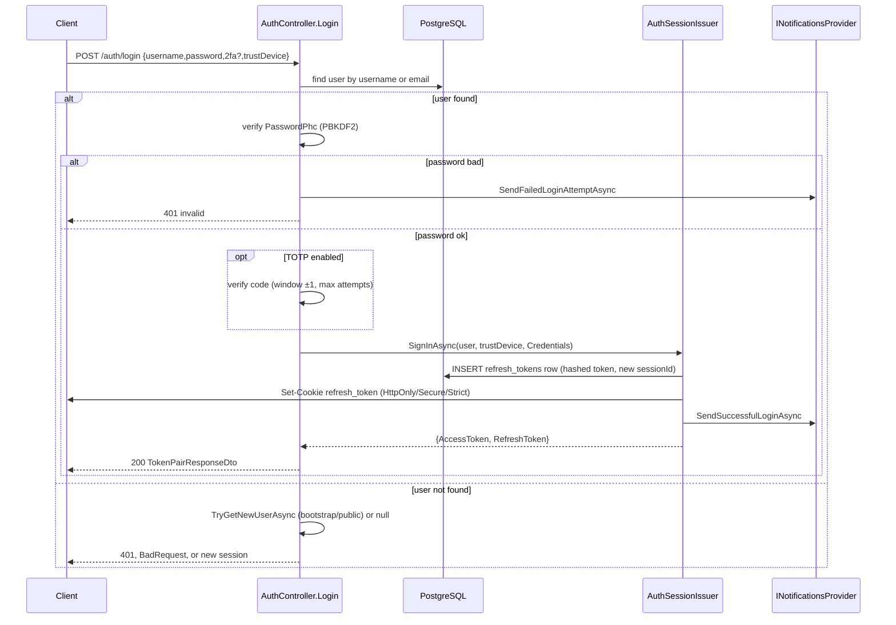
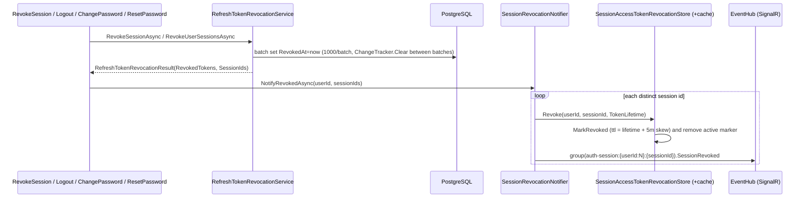
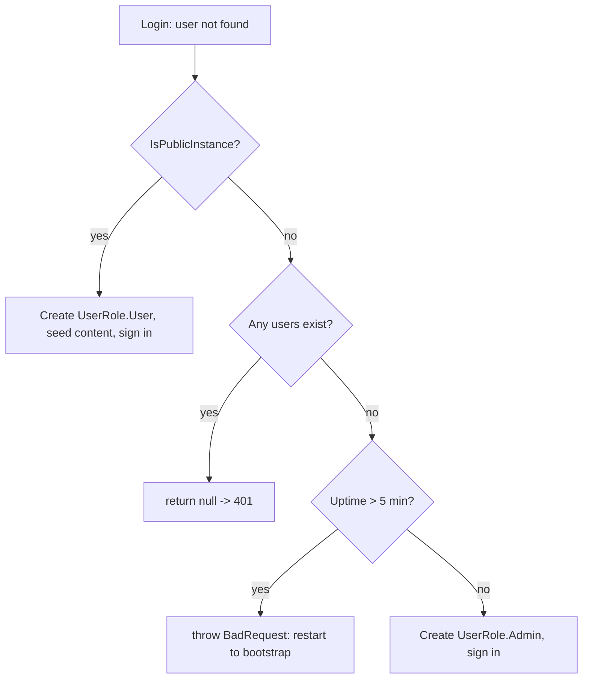

# 13. Authentication, Sessions & Password Security

Cotton authenticates users with a short-lived **JWT access token** for API calls plus a long-lived, **database-stored refresh token** for session continuity. A successful authentication factor (password, passkey, or linked OIDC identity) is converted into a session by `AuthSessionIssuer`, which mints both tokens, persists a `refresh_tokens` row, and writes the refresh token into an `HttpOnly`/`Secure`/`SameSite=Strict` cookie. Refresh tokens rotate on every use, every session can be inspected and revoked, and revocation is propagated both to access-token validation (so a stolen access token dies fast) and to connected SignalR clients. Passwords are hashed with peppered PBKDF2-HMAC-SHA256 in PHC format. This section documents those flows, the supporting services, and their failure modes.

> The HTTP surface lives in `src/Cotton.Server/Controllers/AuthController.cs` (route prefix `/api/v1/auth`, from `Routes.V1.Auth` in `src/Cotton.Shared/Routes.cs`). Email verification and password-change endpoints live on `src/Cotton.Server/Controllers/UserController.cs` (`/api/v1/users`, from `Routes.V1.Users`). Passkey/WebAuthn and OIDC flows are touched here only where they share the session machinery; see the *Passkeys & WebAuthn* and *OpenID Connect* sections for depth.

## Purpose & overview

The subsystem provides:

- **Stateless API authorization** via a signed JWT access token carrying the user id, username, role, and a per-session id (`sid` claim).
- **Stateful session continuity** via opaque refresh tokens stored (hashed) in PostgreSQL, with one-time-use rotation on refresh.
- **Session management**: list active sessions with device/IP/geo metadata and effective duration, and revoke individual sessions or all of a user's sessions.
- **Fast revocation**: a memory-cached revocation store consulted on every JWT validation, plus SignalR notifications that ask connected clients to reconnect.
- **Account bootstrap**: a time-limited first-admin window (no permanent backdoor) and, on public/demo instances, on-the-fly account creation from any submitted credentials.
- **Password security**: peppered PBKDF2 hashing, password reset, password change (which revokes all sessions), and email verification.
- **Two-factor auth**: TOTP setup/confirm/disable with a configurable failed-attempt lockout.
- **Abuse resistance**: per-IP fixed-window rate limiting on interactive and refresh endpoints.

## Key components & responsibilities

| Component | File | Responsibility |
| --- | --- | --- |
| `AuthController` | `src/Cotton.Server/Controllers/AuthController.cs` | HTTP endpoints: login, refresh, logout, sessions, TOTP, passkeys, forgot/reset password, WebDAV token, share-link invalidation, `me` |
| `AuthSessionIssuer` | `src/Cotton.Server/Services/AuthSessionIssuer.cs` | Mints access tokens, creates/persists refresh-token rows, sets the refresh cookie, hashes refresh tokens, resolves geo metadata |
| `RefreshTokenRevocationService` | `src/Cotton.Server/Services/RefreshTokenRevocationService.cs` | Batched revocation of refresh-token rows for a session or for an entire user |
| `SessionRevocationNotifier` | `src/Cotton.Server/Services/SessionRevocationNotifier.cs` | Propagates revocation to the access-token revocation store and to SignalR clients |
| `SessionAccessTokenRevocationStore` | `src/Cotton.Server/Services/SessionAccessTokenRevocationStore.cs` | Scoped service answering "is this `(userId, sessionId)` still active?" with a DB fallback |
| `SessionAccessTokenRevocationCache` | `src/Cotton.Server/Services/SessionAccessTokenRevocationCache.cs` | Singleton in-memory cache of active/revoked session markers |
| `AuthHardeningExtensions` | `src/Cotton.Server/Extensions/AuthHardeningExtensions.cs` | DI + middleware wiring: rate limiter, revocation cache/store, JWT `OnTokenValidated` revocation check |
| `AuthRateLimitPolicies` | `src/Cotton.Server/Auth/AuthRateLimitPolicies.cs` | Names of the two rate-limit policies (`auth.interactive`, `auth.refresh`) |
| `GetSessionsQuery` / `GetSessionsQueryHandler` | `src/Cotton.Server/Handlers/Auth/GetSessionsQuery.cs` | Aggregates refresh-token rows per session into `SessionDto`, computing effective duration |
| `GeoLookupService` | `src/Cotton.Server/Services/GeoLookupService.cs` | Resolves IP → country/region/city for session metadata (registered as `IGeoLookupService`) |
| `TotpHelpers` | `src/Cotton.Server/Helpers/TotpHelpers.cs` | Generates TOTP secrets/`otpauth://` URIs and verifies codes (via `OtpNet`) |
| `Hasher` | `src/Cotton.Server/Services/Hasher.cs` | SHA-256 helpers; used to hash refresh tokens and content addressing (not passwords) |
| `RefreshTokenRetentionJob` | `src/Cotton.Server/Jobs/RefreshTokenRetentionJob.cs` | Quartz job (1-day interval) that revokes refresh tokens older than 30 days |
| `EventHub` | `src/Cotton.Server/Hubs/EventHub.cs` | SignalR hub; per-session groups and the `SessionRevoked` client method |
| `WebDavBasicAuthenticationHandler` | `src/Cotton.Server/Auth/WebDavBasicAuthenticationHandler.cs` | HTTP Basic auth for WebDAV; verifies `WebDavTokenPhc` with the same PHC hasher |
| `User` | `src/Cotton.Database/Models/User.cs` | Account entity: password/WebDAV PHC, TOTP fields, email-verification/reset tokens |
| `ExtendedRefreshToken` | `EasyExtensions.EntityFrameworkCore.Database` (table `refresh_tokens`) | Refresh-token row with device/IP/geo/session/trust metadata |

The password hasher is **not** the local `Hasher` class. It is the `IPasswordHashService` implementation `Pbkdf2PasswordHashService` from `EasyExtensions`, registered in `src/Cotton.Server/Program.cs` via `.AddPbkdf2PasswordHashService()`.

## Tokens, sessions & identifiers

### Access token (JWT)

`AuthSessionIssuer.CreateAccessToken` builds the JWT through the `ITokenProvider` (`JwtTokenProvider` in EasyExtensions). The claims are:

| Claim | Source |
| --- | --- |
| `sub` (`JwtRegisteredClaimNames.Sub`) | `user.Id` |
| `name` (`JwtRegisteredClaimNames.Name`) and `ClaimTypes.Name` | `user.Username` (both are added) |
| `sid` (`JwtRegisteredClaimNames.Sid`) | the session id |
| `ClaimTypes.Role` | `user.Role.ToString()` (`UserRole` enum) |

The token is signed with the symmetric `JwtSettings:Key`. In Cotton this key is generated at startup per-process by `Cotton.Autoconfig`: `src/Cotton.Autoconfig/Extensions/ConfigurationBuilderExtensions.cs` sets `JwtSettings:Key = StringHelpers.CreateRandomString(DefaultKeyLength)` where `DefaultKeyLength = 32`, i.e. a fresh random **32-character** string (32 ASCII bytes). Because this is injected through `AddInMemoryCollection` after the JSON config sources are loaded, it overrides any literal `JwtSettings:Key` in `appsettings*.json` (the value present in `appsettings.Development.json` is therefore not the key actually used at runtime). The practical consequence is that a process restart invalidates all previously issued access tokens. EasyExtensions picks the signing algorithm by UTF-8 key byte length (32/48/64 bytes → HMAC-SHA256/384/512); a 32-byte key yields HMAC-SHA256.

**Access-token lifetime:** `JwtSettings:LifetimeMinutes` is not set in Cotton's `appsettings*.json`, so `GetJwtSettings` falls back to its default of **15 minutes** (`EasyExtensions.AspNetCore.Authorization/Extensions/ConfigurationExtensions.cs`). JWT validation (`AddJwt` in EasyExtensions) uses `ClockSkew = 5 minutes`, so an access token is honored for roughly 15–20 minutes of wall-clock time.

The access token can be supplied as a **bearer** token or as an **`access_token` query parameter** (`EasyExtensions.AspNetCore.Authorization` `AccessTokenParamName = "access_token"`, useful for SignalR/WebSockets). Cotton calls `AddJwt()` with the default `useCookies = false`, so an `access_token` **cookie is NOT read for inbound authentication**. `AuthController` defines `CookieAccessTokenKey = "access_token"`, but it is only ever *deleted* on logout — Cotton never sets an access-token cookie and never authenticates from one.

### Refresh token (DB-backed) — the `ExtendedRefreshToken` entity

The refresh token plaintext is a 32-character cryptographically random string (`StringHelpers.CreateRandomString(AuthController.RefreshTokenLength)`, where `RefreshTokenLength = 32`; the generator draws each char with `RandomNumberGenerator.GetInt32` over the 62-char alphabet `A–Z a–z 0–9` → ~190 bits). **Only the SHA-256 hex hash is stored**, via `AuthSessionIssuer.HashRefreshToken` → `Hasher.ToHexStringHash(Hasher.HashData(...))`. Lookups hash the presented token and match on the column.

`ExtendedRefreshToken` (mapped to table `refresh_tokens`, unique index on `Token`) is `EasyExtensions`' `RefreshToken` subclass; its fields:

| Field | Column | Meaning |
| --- | --- | --- |
| `UserId` | `user_id` | Owning user (from base `RefreshToken`) |
| `Token` | `token` | SHA-256 hex of the plaintext refresh token (unique; base `RefreshToken`) |
| `RevokedAt` | `revoked_at` | UTC revocation time; `null` while active (base `RefreshToken`) |
| `IpAddress` | `ip_address` | Client IP at issuance (stored as `IPAddress`) |
| `UserAgent` | `user_agent` | Raw User-Agent header |
| `AuthType` | `auth_type` | `EasyExtensions.Models.Enums.AuthType` (`Credentials = 1`, `Passkey = 68`, etc.) |
| `Country` / `Region` / `City` | `country`/`region`/`city` | Nullable geo metadata from `GeoLookupService` |
| `Device` | `device` | Parsed device label (`UserAgentHelpers.GetDevice`) |
| `SessionId` | `session_id` | Stable (nullable) session identifier shared across rotated tokens |
| `IsTrusted` | `is_trusted` | "Trust this device" flag, controls cookie lifetime |
| `Id` / `CreatedAt` / `UpdatedAt` | `id`/`created_at`/`updated_at` | Set automatically by the `BaseEntity<Guid>` audit hook |

The **session id** (`SessionId`) is the durable unit. It is generated once at sign-in (also a 32-char random string from `CreateRandomString(RefreshTokenLength)`) and **reused across every rotation**, so one session yields many `refresh_tokens` rows over its lifetime that share a `SessionId`. The `sid` JWT claim equals this `SessionId`.

### Refresh cookie flags

`AuthSessionIssuer.AddRefreshTokenToCookies` writes the plaintext refresh token to cookie `refresh_token` (`AuthController.CookieRefreshTokenKey`) with:

```csharp
new CookieOptions
{
    Secure = true,
    HttpOnly = true,
    SameSite = SameSiteMode.Strict,
    Expires = DateTimeOffset.UtcNow.AddHours(trustDevice ? 24 * 365 : sessionTimeoutHours)
}
```

`sessionTimeoutHours` comes from `CottonServerSettings.SessionTimeoutHours`, which defaults to `30 * 24` = **720 hours (30 days)**. A trusted device gets a **1-year** cookie. Note the cookie `Expires` only governs the browser; server-side, an *idle* refresh token's true ceiling is the 30-day retention job (below), independent of the trust flag.

## How it works — flows & sequences

### Login (`POST /api/v1/auth/login`)

`Login` is rate-limited by `AuthRateLimitPolicies.Interactive` and orchestrates four steps:

1. `GetUserOrTryGetNewAsync` — trims the username, looks up by `Username` **or** `Email`. If found, it runs a database-integrity check (`_integrity.RequireValid(_dbContext, user, "auth.login")`). If not found, it may create a new account (`TryGetNewUserAsync`, see *Account bootstrap*). Returns `null` if the username is blank.
2. `VerifyPasswordOrNotifyAsync` — verifies `request.Password` against `user.PasswordPhc` (treating an empty stored hash as failure). On failure it fires `SendFailedLoginAttemptAsync` and returns false.
3. `ValidateTotpOrGetFailureAsync` — if `IsTotpEnabled`, requires and verifies the TOTP code (see *Two-factor authentication*).
4. `CreateSignedInResponseAsync` → `AuthSessionIssuer.SignInAsync(user, request.TrustDevice, AuthType.Credentials)`.

All failure branches for unknown user / bad password return the same opaque `401 "Invalid username or password"`, limiting user enumeration on the login path. TOTP-required and TOTP-invalid return `403`. (`LoginRequest` carries `Username`, `Password`, optional `FirstName`/`LastName`, optional `TwoFactorCode`, and `TrustDevice`.)



`SignInAsync` returns `TokenPairResponseDto { AccessToken, RefreshToken }` (from `EasyExtensions.AspNetCore.Authorization.Models.Dto`) and also sets the cookie, so SPA and cookie-based clients both work. The plaintext refresh token is returned in the body **and** the cookie. `SignInAsync` also sends `SendSuccessfulLoginAsync`.

### Refresh rotation (`POST /api/v1/auth/refresh`)

Rate-limited by `AuthRateLimitPolicies.Refresh`. The refresh token is read from the `refreshToken` query parameter or, falling back, the `refresh_token` cookie.

The endpoint **rotates** the token: it revokes the presented token and issues a brand-new one **reusing the same `SessionId`**, so a session id is stable but each physical refresh token is single-use.

```mermaid
sequenceDiagram
    participant C as Client
    participant A as AuthController.GetRefreshToken
    participant DB as PostgreSQL
    participant I as AuthSessionIssuer
    C->>A: POST /auth/refresh (cookie or ?refreshToken=)
    A->>A: hash token (SHA-256)
    A->>DB: SELECT refresh_tokens WHERE token=hash
    alt missing or RevokedAt != null
        A-->>C: 404 NotFound
    else valid
        A->>A: integrity-check refresh row, then load + check user
        A->>I: CreateAccessToken(user, oldToken.SessionId)
        A->>DB: oldToken.RevokedAt = now
        A->>I: CreateRefreshTokenAsync(user, oldToken.IsTrusted, oldToken.AuthType, SAME sessionId)
        A->>DB: INSERT new refresh_tokens row; SaveChanges
        A->>C: Set-Cookie new refresh_token
        A-->>C: 200 {AccessToken, RefreshToken}
    end
```

Key behaviors:

- A presented token that is missing or already has `RevokedAt != null` (or whose user is missing) yields `404`. There is **no replay-detection cascade** — presenting a revoked token does not revoke the whole session; it simply fails.
- The old row's `IsTrusted` and `AuthType` are carried into the new row, so the cookie lifetime and recorded auth type stay consistent across rotations.
- `CreateRefreshTokenAsync` re-resolves geo/device on each rotation from the **current** request, so a session's last-seen IP/location reflects the most recent refresh.
- Both the refresh row and the user are run through `_integrity.RequireValid(...)` (`"auth.refresh-token"`, `"auth.refresh-user"`).

### Logout (`POST /api/v1/auth/logout`)

Not rate-limited, no `[Authorize]` (it works with just the refresh token). It reads the refresh token from query or cookie, and if found and not already revoked: integrity-checks it (`"auth.logout"`), sets `RevokedAt = now`, then calls `SessionRevocationNotifier.NotifyRevokedAsync(userId, sessionId, ...)` to fast-revoke any outstanding access token and notify clients. It then deletes both the `refresh_token` and `access_token` cookies. Logout always returns `200`, even when no token is present.

### Session inspection (`GET /api/v1/auth/sessions`)

`GetSessions` (authorized) reads the current `sid` claim, then dispatches `GetSessionsQuery(userId, currentSessionId)` through the mediator. `GetSessionsQueryHandler`:

1. Loads all `refresh_tokens` for the user with a non-null `SessionId` (`AsNoTracking`, ordered by `CreatedAt` descending).
2. Groups by `SessionId`, keeping only groups with **at least one non-revoked** token (`HasAnyNonRevokedRefreshToken`), so fully-revoked sessions disappear from the list.
3. Builds one `SessionDto` per session, ordered by `TotalSessionDuration` descending.

`SessionDto` (`src/Cotton.Server/Models/Dto/SessionDto.cs`):

| Field | Source / meaning |
| --- | --- |
| `SessionId` | Group key |
| `IsCurrentSession` | `currentSessionId == SessionId` (matches the caller's `sid`) |
| `IpAddress`, `UserAgent`, `AuthType`, `Country`, `Region`, `City`, `Device` | Taken from the latest **active** token, falling back to the latest token of any state (`source = latestActive ?? latestAny`); the four geo/device fields default to `"Unknown"` when null |
| `LastSeenAt` | `CreatedAt` of the latest token (active or not) |
| `RefreshTokenCount` | Number of rows in the group (i.e. rotations) |
| `TotalSessionDuration` | Effective active duration (see below) |

**Effective duration** (`CalculateTotalSessionDuration` + `SumMergedIntervals`): each token contributes the interval `[CreatedAt, min(CreatedAt + tokenLifetime, RevokedAt ?? CreatedAt + tokenLifetime)]` — i.e. a token "covers" one access-token lifetime unless revoked sooner. Zero/negative intervals are dropped, intervals are sorted by start, and overlaps are merged so rapid rotations do not double-count; the merged total is the reported duration. `tokenLifetime` here is `ITokenProvider.TokenLifetime` (15 min).

### Revocation propagation

There are two independent revocation surfaces:

1. **Refresh-token rows** (`RefreshTokenRevocationService`) — sets `RevokedAt`, which kills future refreshes. This alone does **not** invalidate an already-issued access token (a JWT is valid until expiry).
2. **Access-token revocation store** (`SessionAccessTokenRevocationStore` + cache) — consulted on every JWT validation so a revoked session's access token stops working within seconds.

`SessionRevocationNotifier.NotifyRevokedAsync` ties them together and additionally pings SignalR:



The **revoke-session endpoint** is `DELETE /api/v1/auth/sessions/{sessionId}` (`RevokeSession`), authorized; it revokes only the named session via `RevokeSessionAsync` and notifies only if `RevokedTokens > 0`.

`RefreshTokenRevocationService` works in batches of `1_000`, calling `ChangeTracker.Clear()` between batches to bound memory; it returns a `RefreshTokenRevocationResult(RevokedTokens, SessionIds)` with the distinct session ids touched. `RevokeUserSessionsAsync` revokes every non-revoked row for the user; `RevokeSessionAsync` scopes to one `SessionId`.

### JWT validation with revocation check

`AuthHardeningExtensions.AddSessionRevocationValidation` post-configures the JWT bearer `OnTokenValidated` event (chained after any existing handler, and skipped if the prior handler already set `context.Result`). After the standard validation it:

1. Extracts `sub` (or `ClaimTypes.NameIdentifier`) and `sid` (or `ClaimTypes.Sid`).
2. If the user id is missing/unparseable as a `Guid`, or the session id is blank → `context.Fail("Access token is missing required session claims.")`. **Every access token therefore needs a parseable user id and a session id**, so legacy/sessionless tokens are rejected.
3. Otherwise resolves `SessionAccessTokenRevocationStore` from request services and calls `IsRevokedAsync(userId, sessionId)`. If revoked → `context.Fail("Session has been revoked.")`.

`SessionAccessTokenRevocationStore.IsRevokedAsync` is **fail-closed**:

- Empty user id (`Guid.Empty`) or blank session id → `true` (revoked).
- Cache says revoked → `true`.
- Cache says active (`TryGetActive`) → returns `!active`.
- Otherwise it queries the DB for any non-revoked `refresh_tokens` row with that `(userId, sessionId)`, integrity-checks each (`"auth.access-token-session"`), and:
  - if any active token exists → `MarkActive` for **30 seconds** and return `false`;
  - if none exist → `MarkRevoked` for **65 minutes** and return `true`.

`Revoke(userId, sessionId, accessTokenLifetime)` stores a revoked marker with TTL `accessTokenLifetime + AccessTokenClockSkew` when the lifetime is positive (otherwise it falls back to the 65-minute revoked duration), and `MarkRevoked` additionally **removes** any active marker. So after an explicit revocation, the in-process cache flips to revoked immediately. The remaining best-case window for a not-yet-revoked instance is bounded by the 30-second active-cache TTL plus DB propagation. Cache constants (`SessionAccessTokenRevocationStore`): `ActiveSessionCacheDuration = 30s`, `RevokedSessionCacheDuration = 65m`, `AccessTokenClockSkew = 5m`.

The cache (`SessionAccessTokenRevocationCache`) is a singleton `MemoryCache` with a size limit of `1_000_000` entries (each entry size 1) and keys `auth-session-active:{userId:N}:{sessionId}` / `auth-session-revoked:{userId:N}:{sessionId}`.

### Realtime client notification

`SessionRevocationNotifier` sends the `EventHub.SessionRevokedMethod` (`"SessionRevoked"`) to the SignalR group `auth-session:{userId:N}:{sessionId}` (`EventHub.GetSessionGroupName`). On connect, `EventHub.OnConnectedAsync` reads the `sid` claim and joins the client to its own session group; if the `sid` claim is missing it aborts the connection. The hub is `[Authorize]`. This lets the frontend react immediately when its session is killed elsewhere.

> Note the access-token revocation **cache key prefix** (`auth-session-active:` / `auth-session-revoked:`) differs from the SignalR **group name prefix** (`auth-session:`); both embed `{userId:N}:{sessionId}` but they are distinct namespaces.

### Refresh-token retention (`RefreshTokenRetentionJob`)

A Quartz job (`[JobTrigger(days: 1)]`, i.e. a 1-day / 24-hour interval) that, after a hard-coded `Task.Delay(600_000)` (**10-minute** startup grace), revokes every refresh token where `RevokedAt == null` and `CreatedAt < now - RetentionPeriod` (`RetentionPeriod = 30 days`). It only sets `RevokedAt`; it does not delete rows, and it does **not** call the notifier (so it does not push the revocation into the access-token cache or to clients — those expire naturally). This caps an *idle* session's true server-side lifetime at ~30 days regardless of the 1-year trusted cookie. An actively-refreshing session is never pruned, because each rotation writes a fresh row with a new `CreatedAt`.

## Password security

### Hashing — `Pbkdf2PasswordHashService` (PHC)

Cotton registers `IPasswordHashService` via `AddPbkdf2PasswordHashService()` (`Program.cs`), which constructs `EasyExtensions.Services.Pbkdf2PasswordHashService` with the pepper from configuration key **`Pepper`** and the **default 310,000 iterations**. Algorithm details (verified in `EasyExtensions.Services.Pbkdf2PasswordHashService`):

- Input transform: `HMAC-SHA256(key = pepper, message = UTF-8 password)` — the pepper is a keyed HMAC, not a concatenated salt. Both byte buffers are zeroed after use.
- KDF: `Rfc2898DeriveBytes` (PBKDF2) with HMAC-SHA256, **16-byte** random salt, **32-byte** output, 310,000 iterations.
- Stored format (PHC): `$pbkdf2-sha256$v=1$i=310000$<saltB64>$<hashB64>`.
- Verification uses `CryptographicOperations.FixedTimeEquals` (constant-time) and computes `needsRehash` when version/iterations/salt-len/hash-len are below current parameters. **Cotton does not currently act on `needsRehash`** — all Cotton call sites use the single-argument `Verify(password, phc)`, so transparent rehash-on-login is not wired up.

The **pepper** is derived per-instance from the root master key: `Cotton.Autoconfig` computes `Pepper = KeyDerivation.DeriveSubkeyBase64(rootMasterEncryptionKey, "CottonPepper", DefaultKeyLength)` (`ConfigurationBuilderExtensions.cs`, `DefaultKeyLength = 32`). It is held in process configuration only, never stored in the DB alongside hashes. The service requires the pepper to be at least 16 UTF-8 bytes. Because the pepper is keyed into the HMAC, a database leak without the master key does not allow offline cracking with standard PBKDF2 tooling.

`User.PasswordPhc` (column `password_phc`) holds the account password hash; `User.WebDavTokenPhc` (column `webdav_token_phc`) holds the WebDAV token hash using the same PHC scheme (verified by `WebDavBasicAuthenticationHandler` with the same `IPasswordHashService`). On public-instance signups both columns are seeded from the same submitted password.

> **Naming gotcha:** the local `Hasher` class (`src/Cotton.Server/Services/Hasher.cs`) is SHA-256 only (`SHA256.HashData`, `ToHexStringHash`) and is used for hashing refresh tokens and content addressing — **not** for passwords. Passwords always go through `IPasswordHashService`.

### Change password (`PUT /api/v1/users/me/password`)

`UserController.ChangePassword` (authorized) → `ChangePasswordRequest`/`ChangePasswordRequestHandler`. It requires non-empty old and new passwords, loads the user, and verifies the old password against `PasswordPhc` (rejecting with `400 "Old password is incorrect"` on mismatch). Then **inside a DB transaction** it writes the new hash, calls `RefreshTokenRevocationService.RevokeUserSessionsAsync` (revoking **every** session including the current one), commits, and finally `NotifyRevokedAsync` for all touched session ids. Changing a password thus logs the user out everywhere. (Unlike password *reset*, change-password does **not** disable TOTP.)

### Forgot / reset password

| Step | Endpoint | Handler | Notes |
| --- | --- | --- | --- |
| Request reset | `POST /api/v1/auth/forgot-password` (rate-limited Interactive) | `SendPasswordResetRequest` / `SendPasswordResetRequestHandler` | Looks up by username or email; **silent** — returns `200` regardless of whether the account/email exists. No-ops if the account has no email. |
| Confirm reset | `POST /api/v1/auth/reset-password` (rate-limited Interactive) | `ConfirmPasswordResetRequest` / `ConfirmPasswordResetRequestHandler` | Validates the token + expiry, sets the new hash, disables TOTP, revokes all sessions |

`SendPasswordResetRequestHandler`: generates a 32-char random `PasswordResetToken` (`TokenLength = 32`), stamps `PasswordResetTokenSentAt`, enforces a **2-minute cooldown** (`CooldownPeriod`; re-requests inside the window are silently ignored), and emails the `EmailTemplate.PasswordReset` (`= 2`) link built from `CottonServerSettings.PublicBaseUrl`. The code comment is explicit: *"Intentionally silent: do not reveal whether user exists or email was sent."*

`ConfirmPasswordResetRequestHandler`: finds the user by `PasswordResetToken`, integrity-checks (`"user.password-reset"`); token lifetime is **1 hour** (`TokenExpiration = TimeSpan.FromHours(1)`). On a valid, unexpired token it (in a transaction): sets the new `PasswordPhc`, clears the reset token/timestamp, **disables TOTP** (`IsTotpEnabled = false`, clears `TotpSecretEncrypted`/`TotpEnabledAt`, resets `TotpFailedAttempts = 0`), saves, revokes all sessions, commits, then notifies. Missing/expired tokens are cleared and rejected with `400`. Resetting a password therefore also resets 2FA — operationally relevant because a user who lost both their password and authenticator can recover via email alone.

### Email verification

| Step | Endpoint | Handler | Token TTL / cooldown |
| --- | --- | --- | --- |
| Send | `POST /api/v1/users/me/send-email-verification` (`[Authorize]`) | `SendEmailVerificationRequest` / handler | 2-minute cooldown; `400` if no email or already verified; `400` if the email send returns false |
| Confirm | `POST /api/v1/users/verify-email?token=...` | `ConfirmEmailVerificationRequest` / handler | Token valid **24 hours** (`TokenExpiration`); missing/expired tokens cleared and rejected with `400` |

Both use a 32-char random token (`TokenLength = 32`). Confirm uses `EmailTemplate.EmailConfirmation` (`= 1`) on send; on success it sets `IsEmailVerified = true` and clears the token. `verify-email` is `[HttpPost]`, takes the token from the query string, is **not** `[Authorize]`-protected, and is **not** behind a rate-limit policy.

## Two-factor authentication (TOTP)

TOTP is per-user, opt-in, and verified during login. Helpers live in `src/Cotton.Server/Helpers/TotpHelpers.cs` (using `OtpNet`). The TOTP secret is stored **encrypted** at rest in `User.TotpSecretEncrypted` (column `totp_secret_encrypted`, `byte[]`) via `IStreamCipher` and is decrypted only transiently for verification.

| Endpoint | Method | Behavior |
| --- | --- | --- |
| `POST /api/v1/auth/totp/setup` | `SetupTotp` (`[Authorize]`) | Generates a 160-bit secret (`KeyGeneration.GenerateRandomKey(20)`), returns `TotpSetup { SecretBase32, OtpAuthUri }`. The URI is `otpauth://totp/{label}?secret=...&issuer=cotton&digits=6&period=30`, where issuer is `Constants.ShortProductName` (`"cotton"`) and label is `username` or `username@host`. Stores the encrypted secret. `409` if already enabled. |
| `POST /api/v1/auth/totp/confirm` | `ConfirmTotp` (`[Authorize]`) | Requires `TwoFactorCode`, decrypts the secret, verifies; on success sets `IsTotpEnabled = true`, stamps `TotpEnabledAt`, sends `SendOtpEnabledAsync`. `400` if code missing, `409` if already enabled, `400` if setup not initiated (`TotpSecretEncrypted == null`), `403` if code invalid. |
| `DELETE /api/v1/auth/totp/disable` | `DisableTotp` (`[Authorize]`) | Requires the account **password** (`DisableTotpRequestDto.Password`); `400` if missing, `403` if wrong, `409` if not enabled. Clears `IsTotpEnabled`/`TotpSecretEncrypted`/`TotpEnabledAt`; sends `SendOtpDisabledAsync`. |

Verification (`TotpHelpers.VerifyCode`) builds an `OtpNet.Totp(secret, step: 30, totpSize: 6)` and uses a `VerificationWindow(previous: 1, future: 1)` — accepting the current 30-second step plus one before and one after (±30 s clock tolerance).

**Login-time lockout** (`ValidateTotpOrGetFailureAsync`): if `IsTotpEnabled` and no code is supplied → `403` "code required". If `user.TotpFailedAttempts >= CottonServerSettings.TotpMaxFailedAttempts` → `403` lockout + `SendTotpLockoutAsync`. A wrong code increments `TotpFailedAttempts`, persists it, and sends `SendTotpFailedAttemptAsync` and returns `403`; a correct code resets the counter to `0`. (If `IsTotpEnabled` is true but `TotpSecretEncrypted` is null, the method throws `InvalidOperationException` — an inconsistent-state guard.)

`TotpMaxFailedAttempts` (column `totp_max_failed_attempts`) has no default initializer in `CottonServerSettings` (so it is `0` for a default-constructed object); operators configure it via server settings. A value of `0` would make the lockout branch (`>= 0`) trigger immediately, so this is expected to be set to a positive number through admin settings.

## Account bootstrap & public/demo accounts

`AuthController.TryGetNewUserAsync` (reached only from `Login` when the username/email is not found) handles two distinct creation paths. It first normalizes the input: an email address (validated with `EmailAddressAttribute`) yields a generated available username (`UsernameHelpers.BuildAvailableUsernameFromEmailAsync`); otherwise the input must pass `UsernameValidator.TryNormalizeAndValidate` (returns `null` if invalid).

> **Username policy nuance:** the EF model `User.Username` carries the data annotation `^[a-z][a-z0-9]{1,31}$` and `citext` uniqueness, but runtime account creation goes through `Cotton.Validators.UsernameValidator`, whose regex `^[a-z](?:[a-z0-9]|[._-](?=[a-z0-9])){1,31}$` additionally permits `.`, `_`, and `-` as **non-consecutive** separators (lowercased, length 2–32, must start with a letter). The two are not identical; the validator is the gate for the bootstrap/public path.

### Public/demo instances

When `Constants.IsPublicInstance` is true (env var `COTTON_PUBLIC_INSTANCE=true`, key `Constants.PublicInstanceEnvironmentVariable`), **any** unknown login creates a new `UserRole.User` account on the fly with the submitted password (hashed into both `PasswordPhc` and `WebDavTokenPhc`), the optional first/last name, seeds default content (`DefaultUserContentSeeder.SeedAsync`), logs `"Created guest user ..."`, and signs in. There is no shared `demo/demo` account.

On the client, `src/cotton.client/src/pages/login/demoCredentials.ts` generates **per-browser** demo credentials persisted to `localStorage` under the key `DEMO_CREDENTIALS_STORAGE_KEY = STORAGE_KEY_PREFIX + "demo-credentials"`:

- `username` = `"u_"` + 6 random chars from `[a-z0-9]`;
- `password` = 32 random chars from `[a-z0-9]`;
- `firstName`/`lastName` chosen at random from two curated 16-item word lists (`demoFirstNames` / `demoLastNames`).

`getOrCreateDemoCredentials` reuses stored credentials if they pass `isDemoCredentials` validation, generates fresh ones otherwise, and silently tolerates `localStorage` write failures (private-mode browsing). Randomness prefers `crypto.getRandomValues`, falling back to `Math.random` when unavailable. These plaintext credentials live only client-side; the server treats the resulting login like any other public-instance account creation.

On public instances, `GetRequestIpAddress` returns `IPAddress.Loopback` (the real client IP is never recorded). When a public instance produces no geo lookup result, `AuthSessionIssuer.ResolveRefreshTokenGeoFields` labels the **City** field `"Demo"` (with empty Region/Country); otherwise missing geo fields normalize to `"Unknown"`.

### First-admin bootstrap (time-limited, no eternal backdoor)

On a non-public instance with **zero** users, the first login creates a `UserRole.Admin` account from the submitted credentials — but only within a startup window. `ApplicationStartupClock.Uptime.TotalMinutes` is compared to `Constants.AdminAutocreateMinutesDelay` (**5 minutes**). After 5 minutes of uptime, bootstrap is refused with a `BadRequestException<User>` instructing the operator to restart the application/container to reopen the window. If any user already exists, the path returns `null` (→ `401`). This guarantees there is no permanent unauthenticated account-creation backdoor.



There is **no separate `/register` endpoint**: registration is folded into `POST /login` for the two cases above. (The README's "public instances can also create an account from any credentials you enter" maps exactly to this login-driven path.)

## Rate limiting (`AuthHardeningExtensions` + `AuthRateLimitPolicies`)

Two ASP.NET Core fixed-window policies, partitioned by **remote IP** (`HttpContext.Connection.RemoteIpAddress?.ToString()`, or `"unknown"`), with `AutoReplenishment = true`, `QueueLimit = 0` (excess requests are rejected, not queued) and a global `429` rejection status (`RejectionStatusCode = StatusCodes.Status429TooManyRequests`):

| Policy constant | Name | Permit limit | Window | Applied to (verified via `[EnableRateLimiting(...)]`) |
| --- | --- | --- | --- | --- |
| `AuthRateLimitPolicies.Interactive` | `auth.interactive` | 10 | 1 minute | `login`, `forgot-password`, `reset-password`, `passkeys/assertion/options`, `passkeys/assertion/verify` |
| `AuthRateLimitPolicies.Refresh` | `auth.refresh` | 60 | 1 minute | `refresh` |

The limiter is registered by `AddAuthHardening` → `AddAuthRateLimiting` and activated by `UseAuthHardening` → `UseRateLimiter` in `Program.cs`. `AddAuthHardening` also registers the singleton `SessionAccessTokenRevocationCache`, the scoped `SessionAccessTokenRevocationStore`, and the JWT revocation `OnTokenValidated` hook (`AddSessionRevocationValidation`).

> Note the partition key uses `Connection.RemoteIpAddress` directly. Behind a reverse proxy this is meaningful only because `Program.cs` calls `app.UseForwardedHeaders()` before `app.UseAuthHardening()`; operators must configure forwarded-headers/known-proxies correctly or all clients will share the proxy's IP partition.

## Geo lookup (`GeoLookupService`)

Session metadata (and several notifications) use `GeoLookupService.TryLookupAsync` (the `IGeoLookupService` implementation), gated by `CottonServerSettings.GeoIpLookupMode`:

| Mode | Behavior |
| --- | --- |
| `Disabled` | Returns `null` (no geo) |
| `CustomHttp` | GETs `CustomGeoIpLookupUrl` (supports a `{ip}` placeholder, else appends `?ip=`/`&ip=`), 10 s `HttpClient` timeout, and heuristically extracts country/region/city from arbitrary JSON by field-name priority |
| `CottonCloud` | Uses the hosted bridge `Cotton.Constants.CottonBridgeGeoIpLookupUrl` (`https://bridge.cottoncloud.dev/api/v1/lookup`) via `EasyExtensions.Clients.GeoIpClient` — **only if `TelemetryEnabled`**; otherwise returns `null` |

The custom-HTTP extractor (`FindGeoFields`) recursively scans the JSON response (objects and arrays), strips `_`/`-` from property names, and scores names by priority: country code/ISO (`countrycode`/`iso2`/`iso3`) beats country name/`country`; `region`/`state`/`province`/`territory`/`prefecture` (and lower-priority `district`) for region; `city`/`town`/`locality`/`village`/`municipality` for city. `GeoLookupService.TestCustomLookupAsync` exercises the URL against the instance URL, Google DNS (`8.8.8.8`), and an empty IP for the settings UI. `AuthSessionIssuer` normalizes missing fields to `"Unknown"`, and uses `"Demo"` for the City on public instances when no lookup result is available.

## Concurrency, failure modes & security considerations

- **Refresh rotation is not atomic against concurrent reuse.** `GetRefreshToken` does a read-then-write without a row lock or optimistic concurrency token. Two simultaneous refreshes with the same token can both pass the `RevokedAt == null` check before either writes. There is no automatic "revoke the whole session on reuse of a revoked token" — a stale token simply 404s. This is a deliberate simplicity trade-off, not full BCP refresh-reuse detection.
- **Access-token revocation is best-effort and process-local.** The revocation cache is an in-memory singleton; in a multi-instance deployment, a `Revoke` on instance A does not populate instance B's cache. Instance B still catches it on the next DB-backed `IsRevokedAsync` (when its 30 s active cache lapses), so the cross-instance worst-case window is ~30 seconds plus access-token skew. The SignalR notification is similarly per-instance unless a backplane is configured.
- **Fail-closed validation.** Missing/unparseable session claims, empty ids, or "no active token found" all resolve to *revoked*, so ambiguous states deny access rather than grant it.
- **Token storage.** Refresh tokens are stored only as SHA-256 hex; a DB read cannot recover usable tokens. Passwords (and WebDAV tokens) use peppered PBKDF2 with constant-time compare. TOTP secrets are encrypted at rest.
- **User-enumeration resistance.** Login returns a uniform `401`; forgot-password is fully silent. (TOTP-required vs invalid both return `403`, which does reveal that a username+password pair is valid and 2FA-protected — an accepted trade-off for UX.)
- **Notifications double as a security audit trail:** failed/successful logins, TOTP failed/lockout/enabled/disabled, and WebDAV token resets are all surfaced via `INotificationsProvider`. WebDAV auth failures also emit `SendFailedLoginAttemptAsync`.
- **Cookie security.** `Secure = true` is unconditional, so the refresh cookie is dropped on plain HTTP — Cotton must be served over HTTPS for cookie-based auth to function. `SameSite = Strict` blocks cross-site CSRF on the refresh/logout endpoints.
- **Database-integrity coupling.** Most auth reads route the loaded `User`/`ExtendedRefreshToken` through `IDatabaseIntegrityVerifier.RequireValid(dbContext, entity, boundary)`. If integrity signing is enabled, a tampered user or refresh row fails the auth operation. See the *Database Integrity* section.

## Non-obvious design decisions & gotchas

- **Two hashers, different jobs.** `Hasher` = SHA-256 (refresh tokens, content addressing). `IPasswordHashService` = PBKDF2 (passwords, WebDAV tokens). Don't confuse them.
- **JWT key is ephemeral by default.** Because `Cotton.Autoconfig` injects a per-process random `JwtSettings:Key` (overriding any value in `appsettings*.json`), restarting the server invalidates all access tokens immediately (clients silently re-auth via their still-valid refresh cookies). The in-memory revocation cache is likewise wiped on restart.
- **Access-token lifetime is the EasyExtensions default (15 min), not a Cotton setting.** Cotton does not set `JwtSettings:LifetimeMinutes`. `SessionTimeoutHours` controls the **refresh cookie**, not the JWT.
- **Cookie mode is off.** Cotton calls `AddJwt()` with `useCookies = false`, so the access token is only accepted as a bearer or `access_token` query parameter — never read from a cookie. The `access_token` cookie is only deleted on logout.
- **Trusted devices get a 1-year cookie but only a 30-day idle server token.** `RefreshTokenRetentionJob` revokes a token at 30 days of inactivity regardless of the cookie's `Expires`. Because rotation resets `CreatedAt`, an actively-used trusted session can persist indefinitely; only **idle** sessions are pruned at 30 days.
- **Password reset disables TOTP; password change does not.** Reset is intentional recovery behavior — email access alone can strip an account's second factor. Change-password keeps TOTP intact.
- **`TotpMaxFailedAttempts` defaults to 0.** Must be explicitly set to a sensible positive value via admin settings, or every TOTP login is immediately locked out.
- **Public instances hide client IPs** (`IPAddress.Loopback`) and label the session City `"Demo"` — useful to know when reading session lists or audit notifications on a demo deployment.

## Related sections

- *Cryptography Engine* / *Master Key & Key Derivation* — origin of the password pepper (`KeyDerivation.DeriveSubkeyBase64(..., "CottonPepper", ...)`) and the `IStreamCipher` used for TOTP secrets.
- *Passkeys & WebAuthn* — the `PasskeyService` flows that also call `CreateSignedInResponseAsync` (`AuthType.Passkey`).
- *OpenID Connect* — `OidcAuthenticationService`, which links external identities and issues sessions through the same `AuthSessionIssuer`.
- *Database Integrity* — `IDatabaseIntegrityVerifier.RequireValid` checks woven through these flows.
- *Realtime Events (SignalR)* — `EventHub`, session groups, and the `SessionRevoked` client method.
- *Notifications* — failed/successful login, TOTP, and WebDAV reset alerts.
- *Background Jobs (Quartz)* — scheduling model for `RefreshTokenRetentionJob`.
- *Server Settings* — `CottonServerSettings.SessionTimeoutHours`, `TotpMaxFailedAttempts`, and GeoIP configuration.
