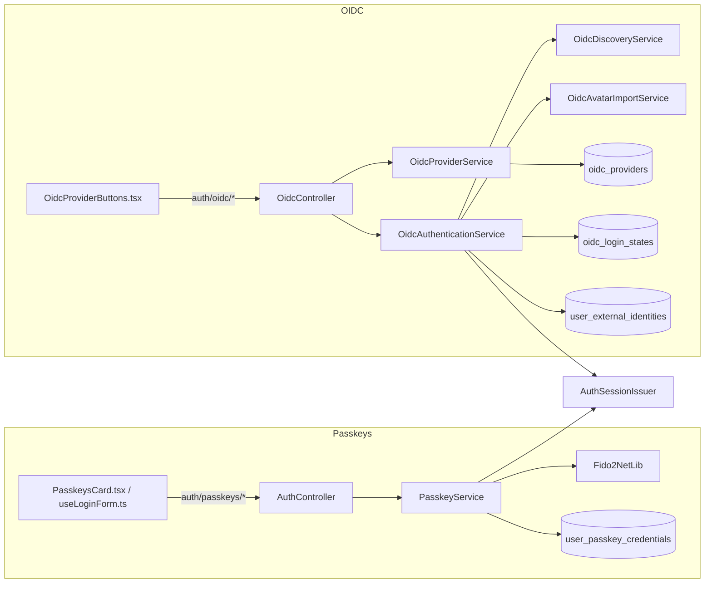
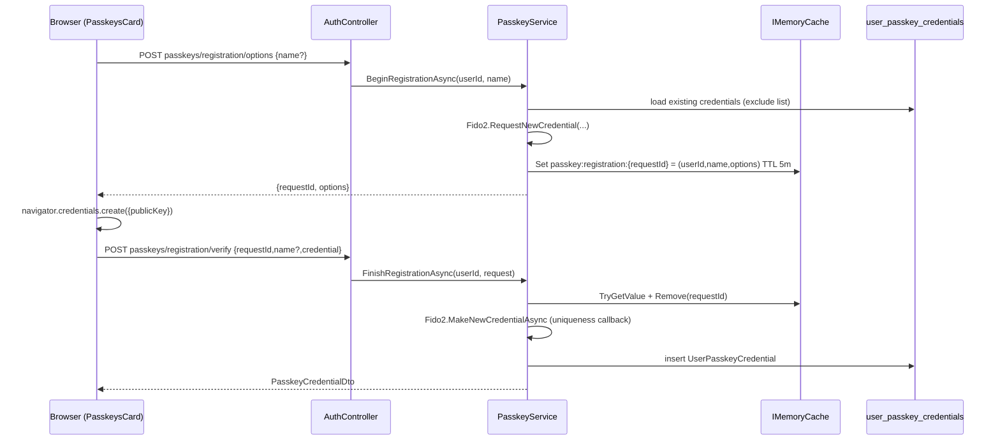
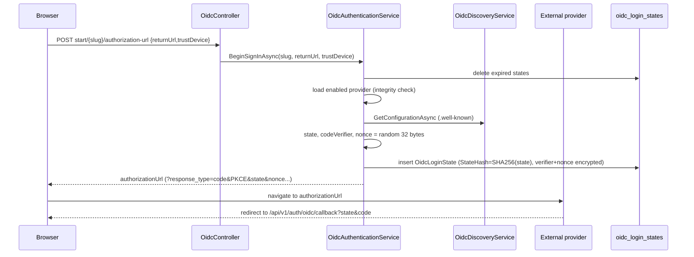
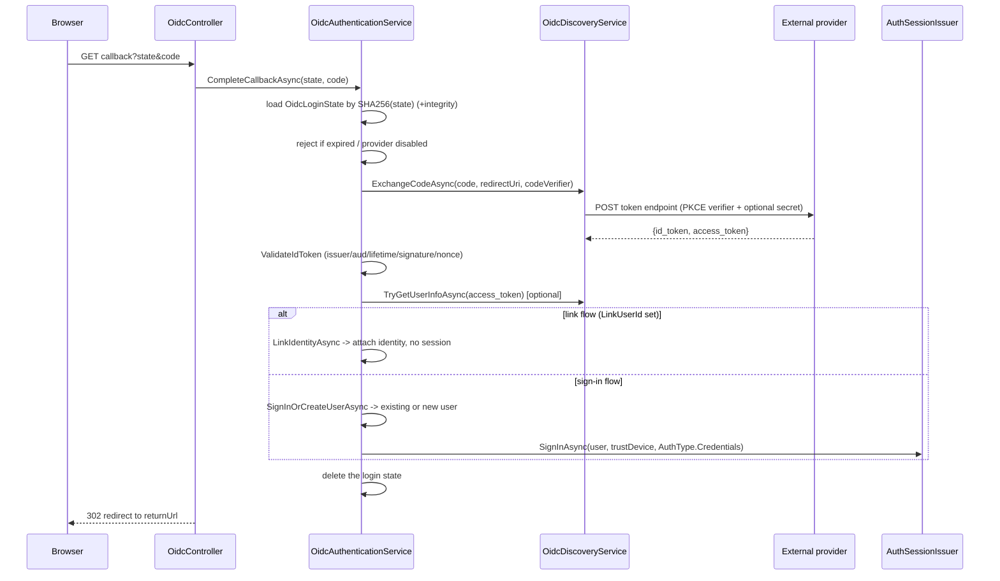

# 14. Passkeys (WebAuthn) & OIDC SSO

Cotton supports two strong/external authentication surfaces in addition to username-and-password login: **passkeys** (WebAuthn, via the `Fido2NetLib` library) for passwordless, phishing-resistant credentials bound to an authenticator, and **OpenID Connect (OIDC) SSO** for delegating sign-in to external identity providers and linking external accounts. Both surfaces issue the same Cotton refresh/access session as a normal password login (see the *Authentication & Sessions* section) and both persist rows whose authentication-critical fields are protected by HMAC integrity signatures (see the *Database Integrity* section). This page documents the server services, controllers, entities, DTOs, configuration, and the React client integration for each.

## Purpose & overview

The passkey subsystem lets a user register one or more WebAuthn credentials (platform authenticators, security keys, synced passkeys) and then sign in with them without a password. Registration and assertion both use a two-step server "ceremony": the server issues challenge options keyed by an opaque `requestId` cached in memory, and the browser returns the authenticator response under that same `requestId`.

The OIDC subsystem lets an administrator configure external providers (`OidcProvider` rows) and lets users either (a) sign in / auto-create a Cotton account through a provider, or (b) link a provider to an existing account from profile settings. It implements the OAuth 2.0 / OIDC **authorization-code flow with PKCE (S256)**, a server-side `state`/`nonce` anti-forgery binding, ID-token validation against the provider's JWKS, optional user-info enrichment, and optional profile/avatar synchronization.



## Part A — Passkeys (WebAuthn)

### Key components

| Component | File | Responsibility |
| --- | --- | --- |
| `PasskeyService` | `src/Cotton.Server/Services/PasskeyService.cs` | All passkey logic: build options, verify attestation/assertion, CRUD on credentials |
| `AuthController` (passkey actions) | `src/Cotton.Server/Controllers/AuthController.cs` | HTTP surface under `auth/passkeys/*` |
| `UserPasskeyCredential` | `src/Cotton.Database/Models/UserPasskeyCredential.cs` | Stored credential entity |
| Passkey DTOs | `src/Cotton.Server/Models/Dto/PasskeyDtos.cs` | Request/response payloads |
| `UserPasskeyCredentialIntegrityDescriptor` | `src/Cotton.Server/Services/DatabaseIntegrity/Descriptors/UserPasskeyCredentialIntegrityDescriptor.cs` | HMAC-signed field set |
| `webauthn.ts` | `src/cotton.client/src/shared/passkeys/webauthn.ts` | Base64url ↔ `ArrayBuffer` conversion and credential serialization |
| `passkeysApi.ts` | `src/cotton.client/src/shared/api/passkeysApi.ts` | Client API wrapper |
| `PasskeysCard.tsx` | `src/cotton.client/src/pages/profile/components/PasskeysCard.tsx` | Profile UI for managing passkeys |
| `useLoginForm.ts` | `src/cotton.client/src/pages/login/useLoginForm.ts` | Login-page passkey assertion flow |

`PasskeyService` is registered as scoped in `src/Cotton.Server/Program.cs` (`.AddScoped<PasskeyService>()`). It is a primary-constructor class depending on `CottonDbContext`, `IHttpContextAccessor`, `IMemoryCache`, and `IDatabaseIntegrityVerifier`.

### Endpoints

All passkey endpoints live on `AuthController` (route base `Routes.V1.Auth` = `/api/v1/auth`, defined in `src/Cotton.Shared/Routes.cs` as `Base + "/auth"` where `Base = "/api/v1"`). There is no dedicated `PasskeyController`.

| Method & path | Auth | Rate limit | Purpose |
| --- | --- | --- | --- |
| `GET auth/passkeys` | `[Authorize]` | — | List the current user's credentials |
| `POST auth/passkeys/registration/options` | `[Authorize]` | — | Begin registration; returns `requestId` + `CredentialCreateOptions` |
| `POST auth/passkeys/registration/verify` | `[Authorize]` | — | Finish registration; verifies attestation, stores credential |
| `PUT auth/passkeys/{credentialId:guid}` | `[Authorize]` | — | Rename a credential |
| `DELETE auth/passkeys/{credentialId:guid}` | `[Authorize]` | — | Delete a credential (returns `Ok()`, not `NoContent`) |
| `POST auth/passkeys/assertion/options` | anonymous | `auth.interactive` | Begin sign-in; returns `requestId` + `AssertionOptions` |
| `POST auth/passkeys/assertion/verify` | anonymous | `auth.interactive` | Finish sign-in; verifies assertion, issues a session |

The `auth.interactive` policy (`AuthRateLimitPolicies.Interactive`, defined in `src/Cotton.Server/Auth/AuthRateLimitPolicies.cs` and configured in `src/Cotton.Server/Extensions/AuthHardeningExtensions.cs`) is a per-remote-IP fixed-window limiter of **10 requests per minute** (`PermitLimit = 10`, `Window = 1 minute`, `QueueLimit = 0`); rejections return HTTP **429** (`RejectionStatusCode = StatusCodes.Status429TooManyRequests`). The partition key is `HttpContext.Connection.RemoteIpAddress` (falling back to the literal `"unknown"`). Only the two anonymous assertion endpoints are rate-limited; registration is gated behind `[Authorize]`.

> Note on rate-limit partitioning: the limiter keys on the *connection* remote IP, not on a forwarded client IP, so behind a reverse proxy that does not preserve the connection source address the window may be shared across clients. (See also the operator gotcha below regarding forwarded headers.)

### The `Fido2` instance and relying-party configuration

`PasskeyService.CreateFido2()` builds a fresh `Fido2` from the active HTTP request on every call:

- `ServerDomain` = `request.Host.Host` (the bare host, no port).
- `ServerName` = `Constants.ProductName` (`"Cotton Cloud"`, from `src/Cotton.Shared/Constants.cs`).
- `Origins` = a single-entry `HashSet<string>` built from `request.Scheme` + `request.Host` via `UriHelper.BuildAbsolute`, with the trailing slash trimmed.
- `Timeout` = `60_000` ms; `ChallengeSize` = `32`; `metadataService: null` (no MDS attestation metadata lookups).

If the request has no host, `CreateFido2()` throws `InvalidOperationException("Passkeys require a request host")`; if there is no active request at all it throws `InvalidOperationException("Passkeys require an active HTTP request")`.

> **Operator gotcha:** the relying-party ID and allowed origin are derived from the inbound request host/scheme, not from a configured base URL. Behind a reverse proxy the forwarded scheme/host must be correct. Forwarded-header processing is enabled in `Program.cs` for `X-Forwarded-Proto` and `X-Forwarded-Host` (`ForwardedHeaders.XForwardedProto | ForwardedHeaders.XForwardedHost`, with `KnownIPNetworks`/`KnownProxies` cleared), otherwise the WebAuthn origin check will fail. If the host the browser uses changes (for example switching domains), previously registered credentials bound to the old RP ID will no longer assert.

### Registration ceremony



`BeginRegistrationAsync` (`PasskeyService.cs`):

- Loads the `User` (`EntityNotFoundException<User>` if missing), then runs `_integrity.RequireValid(_dbContext, user, "passkey.registration-options")` before doing anything.
- Builds an `ExcludeCredentials` list from the user's existing credentials so an authenticator that already holds a Cotton passkey won't double-register.
- Sets the `Fido2User` handle to `CreateUserHandle(user.Id)` = `userId.ToByteArray()` (a 16-byte GUID), `Name` = `user.Username`, `DisplayName` = `BuildDisplayName(user)` = `"{FirstName} {LastName}".Trim()`, falling back to the username when blank.
- Forces `AuthenticatorSelection { ResidentKey = Required, UserVerification = Required }` (so it is a true **discoverable/resident** passkey requiring user verification) and `AttestationPreference = None`.
- Caches a `RegistrationState(UserId, Name, Options)` record under key `passkey:registration:{requestId}` with a **5-minute** TTL (`OptionsLifetime`). The cached `Name` is already passed through `NormalizeName(requestedName)`. `requestId` is `CreateRequestId()` = base64url-encoded random GUID bytes.

`FinishRegistrationAsync`:

- Re-reads the cache entry, requires it to exist and that `state.UserId == userId` (the caller), then removes it (single-use). A missing/expired/mismatched entry throws `BadRequestException<UserPasskeyCredential>("Passkey registration request has expired")`.
- Converts the browser payload to a `Fido2NetLib` `AuthenticatorAttestationRawResponse` (base64url-decoded fields, with browser-reported transports parsed by `ParseTransports`) and calls `MakeNewCredentialAsync`, passing an `IsCredentialIdUniqueToUserCallback` that asserts the credential ID isn't already present in `user_passkey_credentials` (global uniqueness). Any non-`OperationCanceledException` is wrapped as `BadRequestException<UserPasskeyCredential>("Passkey registration could not be verified")`.
- Persists a `UserPasskeyCredential` capturing `CredentialId` (`result.Id`), `PublicKey` (COSE), `UserHandle` (`result.User.Id`), `SignatureCounter` (`result.SignCount`), `Name`, normalized `Transports`, `AaGuid`, `IsBackupEligible`, `IsBackedUp`, and `AttestationFormat`.
- The name is `NormalizeName(request.Name ?? state.Name)` — defaults to `"Passkey"` when blank and is truncated to `MaxPasskeyNameLength` = **120** characters.

### Assertion (login) ceremony

```mermaid
sequenceDiagram
  participant B as Browser (useLoginForm)
  participant API as AuthController
  participant S as PasskeyService
  participant Cache as IMemoryCache
  participant ASI as AuthSessionIssuer

  B->>API: POST passkeys/assertion/options {username?}
  API->>S: BeginAssertionAsync(username)
  alt username given and resolves
    S->>S: allowedCredentials = that user's credentials
  else no/unknown username
    S->>S: allowedCredentials = [] (discoverable login)
  end
  S->>Cache: Set passkey:assertion:{requestId} = (scopedUserId,options) TTL 5m
  S-->>B: {requestId, options}
  B->>B: navigator.credentials.get({publicKey})
  B->>API: POST passkeys/assertion/verify {requestId,trustDevice,credential}
  API->>S: FinishAssertionAsync(request)
  S->>S: lookup credential by CredentialId, Fido2.MakeAssertionAsync
  S->>Cache: Remove(requestId); update counter/backup/lastUsed
  API->>ASI: SignInAsync(user, trustDevice, AuthType.Passkey)
  ASI-->>B: refresh cookie + {accessToken}
```

`BeginAssertionAsync(username)`:

- If a username/email is supplied and matches a `User` (by `Username` **or** `Email`), the service validates that user's integrity (`"passkey.assertion-options"`) and scopes the ceremony: `AllowedCredentials` is populated from that user's credentials and `scopedUserId` is remembered. If no username (or an unknown one) is given, `AllowedCredentials` is empty, enabling **discoverable (usernameless) login** — the authenticator chooses the resident credential.
- `UserVerification = Required` for the assertion. State is cached as `AssertionState(ScopedUserId?, Options)` under `passkey:assertion:{requestId}` for 5 minutes.

`FinishAssertionAsync`:

- Re-reads and removes the cache entry (single-use); a missing/expired entry throws `BadRequestException<UserPasskeyCredential>("Passkey sign-in request has expired")`.
- Resolves the credential ID from `assertion.RawId`, falling back to base64url-decoding `request.Credential.Id` when `RawId` is empty.
- Loads the `UserPasskeyCredential` (including its `User`) by `CredentialId`; not found throws **`UnauthorizedAccessException("Passkey credential was not found")`**. Runs integrity checks on both the credential (`"passkey.assertion-credential"`) and its user (`"passkey.assertion-user"`).
- If the ceremony was scoped to a user, it enforces `credential.UserId == state.ScopedUserId` (otherwise `UnauthorizedAccessException`).
- Calls `MakeAssertionAsync` with the stored COSE `PublicKey`, the stored signature counter (`ToSignatureCounter`, clamped into `uint`), and an `IsUserHandleOwnerOfCredentialIdCallback` that confirms the credential belongs to the same user and, when the authenticator returned a non-empty user handle, that it matches the stored `UserHandle`. Any non-`OperationCanceledException` becomes `UnauthorizedAccessException("Passkey assertion could not be verified")`.
- On success it updates `SignatureCounter = result.SignCount`, `IsBackedUp = result.IsBackedUp`, and `LastUsedAt = DateTime.UtcNow`, saves, and returns the `User`.

The controller action `FinishPasskeyAssertion` catches `UnauthorizedAccessException` and returns `this.ApiUnauthorized("Invalid passkey")`. On success it calls `CreateSignedInResponseAsync(user, request.TrustDevice, AuthType.Passkey)`, which delegates to `AuthSessionIssuer.SignInAsync` (`src/Cotton.Server/Services/AuthSessionIssuer.cs`). That writes a `Secure` / `HttpOnly` / `SameSite=Strict` refresh cookie (cookie name `refresh_token`, expiry `SessionTimeoutHours`, or one year when `trustDevice`), persists an `ExtendedRefreshToken` whose token value is stored hashed (`HashRefreshToken`) with `AuthType = Passkey` (the `EasyExtensions.Models.Enums.AuthType` enum, `Passkey = 68`), and returns `{ accessToken }`.

> Note: `result.SignCount` from `Fido2NetLib` is a `uint`; assigning it to the `long SignatureCounter` column is widening and safe. The reverse conversion `ToSignatureCounter` clamps values `<= 0` to `0` and anything `>= uint.MaxValue` to `uint.MaxValue` before passing the stored counter back into the library.

### `UserPasskeyCredential` entity

Table `user_passkey_credentials` (`BaseEntity<Guid>`), unique index on `CredentialId`, index on `UserId`.

| Property | Column | Notes |
| --- | --- | --- |
| `UserId` | `user_id` | Owner FK (navigation `User`) |
| `CredentialId` | `credential_id` | `byte[]`, unique; the WebAuthn credential ID |
| `PublicKey` | `public_key` | `byte[]`, COSE public key |
| `UserHandle` | `user_handle` | `byte[]`, WebAuthn user handle (the 16-byte user GUID) |
| `SignatureCounter` | `signature_counter` | `long`; cloned-credential detection |
| `Name` | `name` | `string`, max 120 |
| `Transports` | `transports` | `string[]` (lowercased, distinct, ordered) |
| `AaGuid` | `aaguid` | `Guid`, authenticator model GUID |
| `IsBackupEligible` | `is_backup_eligible` | `bool` |
| `IsBackedUp` | `is_backed_up` | `bool` |
| `AttestationFormat` | `attestation_format` | `string?`, max 64 |
| `LastUsedAt` | `last_used_at` | `DateTime?` |

Introduced by migration `20260520030000_AddUserPasskeyCredentials` (`src/Cotton.Database/Migrations/`).

**Integrity (cross-ref *Database Integrity*):** `UserPasskeyCredentialIntegrityDescriptor` (`EntityName = "user_passkey_credentials"`, `SchemaVersion = 1`) signs `Id`, `UserId`, `CredentialId`, `PublicKey`, `UserHandle`, `SignatureCounter`, `Transports`, `AaGuid`, `IsBackupEligible`, `IsBackedUp`. Its remarks note that the user-facing `Name` is **deliberately excluded** from the MAC (so renaming doesn't require re-signing the credential binding). `LastUsedAt`, `CreatedAt`, and `AttestationFormat` are also not in the signed set. Every read path (`BeginRegistrationAsync`, `BeginAssertionAsync`, `FinishAssertionAsync`, `RenameCredentialAsync`, `DeleteCredentialAsync`) calls `_integrity.RequireValid` before trusting a row, so a tampered credential row is rejected rather than used.

### Client-side WebAuthn glue

`webauthn.ts` is the only browser-side crypto plumbing. It provides:

- `isPasskeySupported()` — feature-detects `PublicKeyCredential` and `navigator.credentials.create`/`get`.
- `base64UrlToBuffer` / `bufferToBase64Url` — base64url ↔ `ArrayBuffer`, matching the server's `WebEncoders.Base64UrlEncode`/`Base64UrlDecode`.
- `toCredentialCreationOptions` / `toCredentialRequestOptions` — convert the server JSON (challenge, `excludeCredentials[].id`, `allowCredentials[].id`, `user.id` as base64url strings) into the binary `PublicKeyCredential*Options` the browser API expects.
- `serializeAttestationCredential` / `serializeAssertionCredential` — turn the authenticator response into the base64url JSON the server decodes. Attestation includes `transports` via `response.getTransports?.() ?? []`; assertion includes `userHandle` (or `null`).

`PasskeysCard.tsx` (profile) drives registration: `passkeysApi.beginRegistration(null)` → `navigator.credentials.create` → `serializeAttestationCredential` → `passkeysApi.finishRegistration`, then immediately opens a rename dialog (`openRenameDialog`) seeded with a heuristically chosen default name from `buildDefaultName(transports)` (a security-key, device, or numbered default). Cancellation is detected when a thrown `DOMException` has name `AbortError` or `NotAllowedError` (the set `passkeyCancellationErrorNames`). `useLoginForm.ts` drives login: `passkeysApi.beginAssertion(username || null)` → `navigator.credentials.get` → `passkeysApi.finishAssertion(requestId, trustDevice, credential)` (which stores the returned access token via `setAccessToken`) → `authApi.me()` → `setAuthenticated(true, user)` and `navigate("/")`.

## Part B — OIDC SSO

### Key components

| Component | File | Responsibility |
| --- | --- | --- |
| `OidcController` | `src/Cotton.Server/Controllers/OidcController.cs` | HTTP surface under `auth/oidc/*` |
| `OidcProviderService` | `src/Cotton.Server/Services/OidcProviderService.cs` | Provider CRUD, normalization, slug handling |
| `OidcAuthenticationService` | `src/Cotton.Server/Services/OidcAuthenticationService.cs` | Authorization URL, state/PKCE/nonce, callback, sign-in/link/unlink |
| `OidcDiscoveryService` | `src/Cotton.Server/Services/OidcDiscoveryService.cs` | `.well-known` discovery, token exchange, user-info |
| `OidcAvatarImportService` | `src/Cotton.Server/Services/OidcAvatarImportService.cs` | Import provider avatar into Cotton's chunk pipeline |
| `OidcProvider` | `src/Cotton.Database/Models/OidcProvider.cs` | Configured provider entity |
| `OidcLoginState` | `src/Cotton.Database/Models/OidcLoginState.cs` | Short-lived per-flow state entity |
| `UserExternalIdentity` | `src/Cotton.Database/Models/UserExternalIdentity.cs` | User ↔ external subject link entity |
| OIDC DTOs | `src/Cotton.Server/Models/Dto/OidcProviderDto.cs`, `.../PublicOidcProviderDto.cs`, `.../OidcAuthorizationUrlDto.cs`, `.../UserExternalIdentityDto.cs` | Response payloads |
| Request DTOs | `src/Cotton.Server/Models/Requests/OidcProviderRequestDto.cs`, `.../OidcAuthorizationRequestDto.cs` | Request payloads |
| `oidcApi.ts` | `src/cotton.client/src/shared/api/oidcApi.ts` | Client API wrapper |
| `OidcProviderButtons.tsx` | `src/cotton.client/src/pages/login/components/OidcProviderButtons.tsx` | Login-page provider buttons |
| `oidcSignInSession.ts` | `src/cotton.client/src/features/auth/oidcSignInSession.ts` | Pending-sign-in `sessionStorage` handling |

DI (in `Program.cs`): `OidcProviderService` and `OidcAuthenticationService` are scoped; `OidcDiscoveryService` is scoped and constructed with the named HTTP client `OidcDiscoveryService.HttpClientName` = `"Cotton.Oidc"` (15-second timeout, `User-Agent: Cotton/1.0`). `OidcAvatarImportService` is registered as a typed `HttpClient` service (10-second timeout, same UA). The avatar client therefore has a shorter timeout than the discovery/token client.

### Endpoints

Route base is `Routes.V1.Auth + "/oidc"` = `/api/v1/auth/oidc` (the controller is `[Route(Routes.V1.Auth + "/oidc")]`).

| Method & path | Auth | Rate limit | Purpose |
| --- | --- | --- | --- |
| `GET providers` | anonymous | — | Public list (enabled only): `{name, slug}` for the login page |
| `GET providers/admin` | `Admin` | — | Full provider list for administrators |
| `POST providers` | `Admin` | — | Create provider |
| `PUT providers/{providerId:guid}` | `Admin` | — | Update provider |
| `DELETE providers/{providerId:guid}` | `Admin` | — | Delete provider (cascades to links); returns `NoContent` |
| `POST start/{providerSlug}/authorization-url` | anonymous | `auth.interactive` | Begin **sign-in**; returns the provider authorization URL |
| `POST link/{providerSlug}/authorization-url` | `[Authorize]` | `auth.interactive` | Begin **account linking**; returns the authorization URL |
| `GET callback?state&code&error` | anonymous | `auth.interactive` | Authorization-code callback; redirects back into the SPA |
| `GET links` | `[Authorize]` | — | List the current user's external identities |
| `DELETE links/{identityId:guid}` | `[Authorize]` | — | Unlink a provider; returns `NoContent` |

Admin endpoints require role `UserRole.Admin` (`[Authorize(Roles = nameof(UserRole.Admin))]`). The callback is anonymous (the provider redirects the browser to it directly) but rate-limited under `auth.interactive`.

### Provider configuration & validation (`OidcProviderService`)

`CreateAsync` / `UpdateAsync` run input through `Normalize`, which enforces:

- **Name** required (trimmed; `RequiredTrim`). **Client ID** required (trimmed).
- **Issuer** is required, must parse as an absolute **HTTPS** URL with a host (`NormalizeIssuer`), and its trailing slash is stripped. A non-HTTPS, hostless, or relative issuer throws `BadRequestException<OidcProvider>("Issuer must be an absolute HTTPS URL.")`.
- **Scopes** (`NormalizeScopes`): trimmed, de-duplicated; if empty, defaults to `DefaultScopes` = `["openid", "profile", "email"]`; `openid` is always prepended if missing.
- **AllowedEmailDomains**: each domain trimmed, leading `@` stripped, lowercased, de-duplicated (case-insensitive), and sorted.
- **DefaultRole**: `UserRole.Admin` is explicitly **rejected** (`"OIDC auto-created accounts cannot default to admin."`) — auto-provisioned accounts can never become admins.
- **Client secret**: a blank value normalizes to `null`. `Normalize` is called with `requireSecret: false` on both create and update, so a secret is never mandatory at the service layer (public clients are allowed). On update, `ClearClientSecret = true` nulls the stored secret; otherwise a non-null normalized secret replaces it and a null secret leaves the existing value untouched.

Slug handling (`ResolveSlugAsync`): an explicit slug is normalized by `NormalizeSlug` (must match `^[a-z](?:[a-z0-9]|[._-](?=[a-z0-9])){1,63}$`, with length between `UsernameValidator.MinLength` and `MaxSlugLength` = 64); a blank slug is generated from the name by `Slugify` (lowercase, runs of non-`[a-z0-9._-]` collapsed to `-`, prefixed with `oidc-` when the result is empty or does not start with `a`–`z`, then truncated to 64). Slugs are unique (an `AnyAsync` check excluding the current row throws `"OIDC provider slug is already used."`).

`ToDto` exposes `HasClientSecret` (a boolean derived from whether `ClientSecretEncrypted` is non-blank) rather than the secret itself — the encrypted secret is never returned to the admin UI. `ListPublicAsync` returns only `Name` + `Slug` of **enabled** providers (`PublicOidcProviderDto`), never the issuer, client ID, or any config. `ListAdminAsync` integrity-checks each row (`"oidc.admin-list"`) before mapping.

> Legacy note: an older single-provider design persisted `oidc_client_id`, `oidc_issuer`, and `oidc_client_secret_encrypted` columns on `server_settings` (migration `20260423061540_AddOidcSettings`; still present on `CottonServerSettings` as `OidcClientId`, `OidcIssuer`, `OidcClientSecretEncrypted`). These settings-level fields are **not** referenced by the current OIDC auth path, which is driven entirely by `OidcProvider` rows. Treat them as orphaned legacy columns.

### Sign-in / link: building the authorization URL

`BeginSignInAsync` and `BeginLinkAsync` both funnel into the private `BeginAsync` (`OidcAuthenticationService.cs`). `BeginLinkAsync` passes the caller's `userId` as `linkUserId` and forces `trustDevice: false`; sign-in passes `linkUserId: null` and the caller's `trustDevice`.



`BeginAsync` steps:

1. `CleanupExpiredStatesAsync` — bulk `ExecuteDeleteAsync` of any `oidc_login_states` past `ExpiresAt` (opportunistic GC; there is no separate scheduled job for this).
2. `GetEnabledProviderAsync(slug)` — lowercases/trims the slug, loads the provider (`EntityNotFoundException<OidcProvider>` if missing), runs `_integrity.RequireValid(... "oidc.provider")`, and rejects disabled providers with `"OIDC provider is disabled."`.
3. `GetConfigurationAsync` fetches the discovery document; if it has no `AuthorizationEndpoint`, throws `"OIDC provider does not publish an authorization endpoint."`.
4. Generates three independent **256-bit** opaque values via `CreateOpaqueValue()` (`RandomNumberGenerator.GetBytes(32)`, base64url-encoded): `state`, `codeVerifier`, `nonce`.
5. Persists an `OidcLoginState` with `StateHash = HashOpaqueValue(state)` (lowercase-hex SHA-256 of the UTF-8 state), the **encrypted** code verifier and nonce (stored in `CodeVerifierEncrypted` / `NonceEncrypted`), the normalized return URL, `LinkUserId`, `TrustDevice`, and `ExpiresAt = now + 10 minutes` (`StateLifetime`).
6. Builds the authorization URL with `QueryHelpers.AddQueryString` on the provider's `AuthorizationEndpoint`: `response_type=code`, `client_id`, `redirect_uri`, `scope` (space-joined), `state` (the plaintext opaque value), `nonce`, `code_challenge = base64url(SHA256(ASCII(codeVerifier)))`, `code_challenge_method=S256`.

The `redirect_uri` is `BuildRedirectUri()` = `{ResolvePublicBaseUrl()}{Routes.V1.Auth}/oidc/callback` = `<base>/api/v1/auth/oidc/callback`. `ResolvePublicBaseUrl` uses `SettingsProvider.GetServerSettings().PublicBaseUrl` (trailing slash trimmed); only when that value is exactly `http://localhost` (the seeded default, `SettingsProvider.defaultPublicBaseUrl`) does it fall back to the request's `{Scheme}://{Host.Value}`. This matches `docs/oidc-setup.md`: register `https://your-cotton-domain/api/v1/auth/oidc/callback` and set the public base URL to the externally reachable HTTPS origin.

`NormalizeReturnUrl` only accepts a value that begins with a single `/` (rejecting `//...` protocol-relative URLs); anything else collapses to `/`. This is an **open-redirect guard** — the post-login redirect can never leave the Cotton origin.

### Callback completion



`OidcController.Callback`:

- If `error` is present (the user denied consent or the provider errored), it redirects to `/login?oidc=cancelled` (no exception).
- If `state` or `code` is missing/blank, returns `BadRequest("OIDC callback is missing state or code.")`.
- Otherwise calls `CompleteCallbackAsync(state.Trim(), code.Trim())` and `302`-redirects to the returned application URL.

`CompleteCallbackAsync`:

1. Looks up the `OidcLoginState` (including its `Provider`) by `StateHash = HashOpaqueValue(state)` (single use; the plaintext state never persists). Not found → `BadRequestException<OidcLoginState>("OIDC sign-in state was not found.")`. Integrity-checks both the state (`"oidc.callback-state"`) and its provider (`"oidc.callback-provider"`).
2. If expired, deletes the row and throws `"OIDC sign-in state has expired."`. If the provider has since been disabled, throws `"OIDC provider is disabled."`.
3. `GetConfigurationAsync` (re-fetched), then `ExchangeCodeAsync` redeems the code with the decrypted PKCE `code_verifier` (`loginState.CodeVerifierEncrypted` — decrypted transparently on read; see below).
4. `ValidateIdToken` validates the ID token (including the nonce from `loginState.NonceEncrypted`).
5. `TryGetUserInfoAsync` optionally enriches claims (best effort).
6. `BuildIdentityClaims` produces the normalized `OidcIdentityClaims` record.
7. Branches: `LinkIdentityAsync` if `LinkUserId` is set, else `SignInOrCreateUserAsync`.
8. Deletes the login state, saves.
9. **Only for sign-in** (not link), issues the session: `_sessionIssuer.SignInAsync(user, loginState.TrustDevice, AuthType.Credentials, ct)`.

> **Discrepancy worth noting:** OIDC sign-in records the refresh token's `AuthType` as **`AuthType.Credentials`** (the same value a username/password login uses), not a distinct external/OIDC value — i.e., an OIDC login is indistinguishable from a password login in the session list. The passkey path, by contrast, records `AuthType.Passkey`. The `EasyExtensions.Models.Enums.AuthType` enum actually *defines* dedicated values that go unused here (for example `OpenIdConnect = 57` and `Google = 2`), while `Credentials = 1` and `Passkey = 68` are the values Cotton actually writes.

### Token exchange, ID-token validation, user-info (`OidcDiscoveryService`)

- `GetConfigurationAsync` builds `{issuer}/.well-known/openid-configuration` (trailing slash trimmed from the issuer) and loads it with `OpenIdConnectConfigurationRetriever.GetAsync` over an `HttpDocumentRetriever { RequireHttps = true }`. Any non-cancellation failure maps to `"OIDC discovery document could not be loaded."`. There is **no caching** of the configuration/JWKS in this service — discovery is fetched fresh on each begin and again on each callback.
- `ExchangeCodeAsync` POSTs (`application/x-www-form-urlencoded`) `grant_type=authorization_code`, `code`, `redirect_uri`, `client_id`, `code_verifier`, and — only if a secret is configured — `client_secret`. A missing token endpoint throws `"OIDC provider does not publish a token endpoint."`; a non-2xx response throws `"OIDC token exchange failed."`; a response without an `id_token` throws `"OIDC token response did not include an ID token."`.
- `OidcTokenResponse` reads only `id_token` and `access_token`.
- `TryGetUserInfoAsync` returns `null` when there is no user-info endpoint or no access token, and also returns `null` on any non-2xx (best-effort). When successful it reads `sub`, `email`, `email_verified`, `name`, `given_name`, `family_name`, `picture`, `preferred_username` from the JSON, tolerating string/boolean shapes for `email_verified` (and treating a string like `"true"`/`"false"` as a parsed boolean).

`ValidateIdToken` uses `JwtSecurityTokenHandler { MapInboundClaims = false }` with `TokenValidationParameters`:

- `ValidateIssuer` against `configuration.Issuer ?? provider.Issuer`.
- `ValidateAudience` against `provider.ClientId`.
- `ValidateLifetime` with a **2-minute** `ClockSkew`, `RequireExpirationTime = true`.
- `ValidateIssuerSigningKey` with `IssuerSigningKeys = configuration.SigningKeys` (the JWKS from discovery), `RequireSignedTokens = true`.
- `NameClaimType = "name"`.
- After validation it explicitly **rejects `alg: none`** tokens (and any non-`JwtSecurityToken`) with `"OIDC ID token signature is invalid."`.
- It then enforces the **nonce**: the `nonce` claim must equal the stored (decrypted) nonce by ordinal comparison (`"OIDC ID token nonce is invalid."`).

`BuildIdentityClaims` requires a non-empty `sub` (read from `JwtRegisteredClaimNames.Sub` / `ClaimTypes.NameIdentifier`; `"OIDC subject is missing."` otherwise); if user-info also returns a `sub`, it must match the ID token's (`"OIDC user-info subject does not match the ID token."`). All other fields prefer the user-info value, then fall back through several ID-token claim names (`email`, `email_verified`, `name`, `given_name`, `family_name`, `picture`, `preferred_username`).

### Account creation, sign-in, and linking logic

`SignInOrCreateUserAsync`:

- Looks up an existing `UserExternalIdentity` by (`ProviderId`, `Subject`). If found, integrity-checks it (`"oidc.signin-link"`) and its user (`"oidc.signin-user"`), refreshes the stored claims (`ApplyIdentityClaims`), runs `ApplyUserSyncAsync`, and returns the existing user.
- If not found and `provider.AllowAccountCreation == false`, throws `"This provider can only sign in accounts that are already linked."`.
- Runs `ValidateAccountCreation`: if `RequireVerifiedEmail` and the claim isn't verified → reject (`"This provider requires a verified email address to create an account."`); if `AllowedEmailDomains` is non-empty, the email's domain must be in the allow-list (case-insensitive) → otherwise reject (`"This provider cannot create accounts for the supplied email domain."`).
- **Email-collision guard:** if the claimed email already belongs to any Cotton user, account creation is refused with `"An account with this email already exists. Sign in normally and link this provider from profile settings."` — preventing silent account takeover by a provider that asserts someone else's email.
- Otherwise creates a `User`: username from `BuildUsernameAsync` (derived from the email via `UsernameHelpers.BuildAvailableUsernameFromEmailAsync`, or a `preferred_username` / `name` / `user-{first-8-of-sub}` fallback synthesized under `@oidc.local`), `Role = provider.DefaultRole`, email/verified/first/last from claims. Both `PasswordPhc` and `WebDavTokenPhc` are set to the hash of a throwaway random 256-bit secret (the account has no usable password until the user resets it). It then creates and attaches the identity, attempts avatar import, saves, and seeds default content via `DefaultUserContentSeeder.SeedAsync`.

`LinkIdentityAsync` (link flow, caller already authenticated):

- Loads the user and integrity-checks it (`"oidc.link-user"`).
- Rejects linking a (provider, subject) already owned by a **different** Cotton user (`"This external account is already linked to another Cotton account."`).
- If this user already has a link for the provider with the **same** subject, it just refreshes claims/sync and returns; if the existing link has a **different** subject, it rejects (`"This Cotton account is already linked to another account from the same provider."`).
- Otherwise creates the link and runs profile/avatar sync. The link flow never issues a session (the user is already signed in).

`ApplyProfileSync` (only when `provider.SyncProfile`): updates first/last name from claims when the claim is non-null (`claims.GivenName ?? user.FirstName`, etc.), and — only if the email claim is **verified** and non-blank — overwrites `User.Email` and sets `IsEmailVerified = true`. `TryImportUserAvatarAsync` (only when `provider.SyncAvatar`) calls `OidcAvatarImportService`.

### Avatar import (`OidcAvatarImportService`)

`TryImportMissingAvatarAsync` is a no-op if the user already has an avatar (`AvatarHash` or `AvatarHashEncrypted` set) or if the picture URL is not an absolute **HTTPS** URI (`CreateHttpsUri`). It downloads the image (HTTP `GET`, `HttpCompletionOption.ResponseHeadersRead`), enforcing `MaxAvatarBytes` = **5 MiB** (`5 * 1024 * 1024`) both via the `Content-Length` header and a streaming cap in `ReadLimitedAsync` (which uses a 64 KiB pooled `ArrayPool<byte>` buffer). The bytes are re-encoded to a small WebP preview via `ImagePreviewGenerator.GeneratePreviewWebPAsync` at `PreviewGeneratorProvider.DefaultSmallPreviewSize`, ingested through the normal content-addressed pipeline (`IChunkIngestService.UpsertChunkAsync`, `src/Cotton.Server/Abstractions/IChunkIngestService.cs`), and the resulting chunk hash is stored on the user as `AvatarHash` plus an encrypted copy (`IStreamCipher.Encrypt`). All failures are swallowed and logged as warnings — a failed avatar import never breaks login.

### Entities

**`OidcProvider`** — table `oidc_providers`, unique index on `Slug`. All three OIDC tables are created by migration `20260526073016_AddOidcProviders`.

| Property | Column | Notes |
| --- | --- | --- |
| `Name` | `name` | max 80 |
| `Slug` | `slug` | max 64, unique |
| `Issuer` | `issuer` | max 512 |
| `ClientId` | `client_id` | max 256 |
| `ClientSecretEncrypted` | `client_secret_encrypted` | `[Encrypted]`, nullable |
| `Scopes` | `scopes` | `string[]` |
| `IsEnabled` | `is_enabled` | `bool` |
| `AllowAccountCreation` | `allow_account_creation` | `bool` |
| `RequireVerifiedEmail` | `require_verified_email` | `bool` |
| `DefaultRole` | `default_role` | `UserRole` |
| `AllowedEmailDomains` | `allowed_email_domains` | `string[]` |
| `SyncProfile` / `SyncAvatar` | `sync_profile` / `sync_avatar` | `bool` |

(Navigation: `ICollection<UserExternalIdentity> UserIdentities`.)

**`OidcLoginState`** — table `oidc_login_states`, unique index on `StateHash`, index on `ExpiresAt`.

| Property | Column | Notes |
| --- | --- | --- |
| `ProviderId` | `provider_id` | FK (navigation `Provider`) |
| `StateHash` | `state_hash` | max 64; lowercase-hex SHA-256 of the opaque state |
| `CodeVerifierEncrypted` | `code_verifier_encrypted` | `[Encrypted]` PKCE verifier |
| `NonceEncrypted` | `nonce_encrypted` | `[Encrypted]` expected nonce |
| `ReturnUrl` | `return_url` | max 1024, default `/` |
| `LinkUserId` | `link_user_id` | nullable; non-null ⇒ link flow |
| `TrustDevice` | `trust_device` | `bool` |
| `ExpiresAt` | `expires_at` | UTC |

**`UserExternalIdentity`** — table `user_external_identities`, unique indexes on (`ProviderId`, `Subject`) and (`UserId`, `ProviderId`). The composite uniqueness enforces both "one Cotton user per external subject" and "one link per (user, provider)". `Subject` is documented in the model as the only stable external account key.

| Property | Column | Notes |
| --- | --- | --- |
| `UserId` / `ProviderId` | `user_id` / `provider_id` | FKs (navigations `User`, `Provider`) |
| `Issuer` | `issuer` | max 512 |
| `Subject` | `subject` | max 256 |
| `Email` | `email` | max 320, nullable |
| `EmailVerified` | `email_verified` | `bool` |
| `DisplayName` | `display_name` | max 160, nullable |
| `PictureUrl` | `picture_url` | max 2048, nullable |
| `LastUsedAt` | `last_used_at` | nullable |

### At-rest encryption of secrets

`ClientSecretEncrypted`, `CodeVerifierEncrypted`, and `NonceEncrypted` carry the `[Encrypted]` attribute (`src/Cotton.Database/Models/Attributes/EncryptedAttribute.cs`). `CottonDbContext.OnModelCreating` scans every property and, where `[Encrypted]` is present on a `string` property, applies an EF Core value converter (`HasConversion(encryptedStringConverter)`, which calls `EncryptString` on write and `DecryptString` on read). Consequently the service code reads `provider.ClientSecretEncrypted` / `loginState.CodeVerifierEncrypted` / `loginState.NonceEncrypted` as **plaintext at the application layer** despite the `*Encrypted` names — the values are only ciphertext in the database. (See the *Cryptography Engine* / data-protection sections for how the converter key is managed.)

### Integrity coverage (cross-ref *Database Integrity*)

All three OIDC entities have integrity descriptors (each `SchemaVersion = 1`) that HMAC-sign their security-relevant fields:

- `OidcProviderIntegrityDescriptor` (`EntityName = "oidc_providers"`) signs `Id`, `Name`, `Slug`, `Issuer`, `ClientId`, `ClientSecretEncrypted`, `Scopes`, `IsEnabled`, `AllowAccountCreation`, `RequireVerifiedEmail`, `DefaultRole` (as `int`), `AllowedEmailDomains`, `SyncProfile`, `SyncAvatar`.
- `OidcLoginStateIntegrityDescriptor` (`EntityName = "oidc_login_states"`) signs `Id`, `ProviderId`, `StateHash`, `CodeVerifierEncrypted`, `NonceEncrypted`, `ReturnUrl`, `LinkUserId`, `TrustDevice`, `ExpiresAt`.
- `UserExternalIdentityIntegrityDescriptor` (`EntityName = "user_external_identities"`) signs `Id`, `UserId`, `ProviderId`, `Issuer`, `Subject`, `Email`, `EmailVerified`, `DisplayName`, `PictureUrl` (not `LastUsedAt`).

Every service path validates with `_integrity.RequireValid(...)` (with descriptive operation tags such as `"oidc.callback-state"`, `"oidc.signin-link"`, `"oidc.provider"`, `"oidc.unlink"`) before trusting a row, so a row edited directly in the database (for example flipping `IsEnabled`, swapping a `Subject`, or rewriting the signed nonce/state) is rejected at use time.

### Unlink safety

`UnlinkAsync` → `EnsureCanUnlinkAsync` prevents a user from removing their **last** sign-in method. Unlinking is allowed if the user has another external identity, or has at least one passkey, or can perform a password reset (`IsEmailVerified` && non-blank `Email` && `ServerSettings.EmailMode != EmailMode.None`). Otherwise it throws `"Add another sign-in method before unlinking the last external account."`.

### Client integration

`oidcApi.ts` wraps every endpoint (paths relative to the HTTP client base, e.g. `auth/oidc/providers`, `auth/oidc/links`, `auth/oidc/start/{slug}/authorization-url`) and normalizes request bodies (trims fields, lowercases/de-dupes scopes and email domains via `normalizeProviderRequest`). For sign-in, `OidcProviderButtons.tsx` (login page, rendered only when `visible` and only for enabled providers from `GET providers` via `usePublicOidcProvidersQuery`) calls `oidcApi.createSignInAuthorizationUrl(slug, { returnUrl, trustDevice })`, then `markOidcSignInPending()` (sets the `cotton:oidc-sign-in-pending` flag in `sessionStorage`), then `window.location.assign(authorizationUrl)` to leave the SPA. After the provider redirects back to `/api/v1/auth/oidc/callback` (which sets the refresh cookie and 302s into the app), `consumeOidcSignInPending` (`oidcSignInSession.ts`) detects the pending flag to resume the authenticated session; landing back on `/login` or seeing `?oidc=cancelled` clears it instead. Account linking from the profile uses `oidcApi.createLinkAuthorizationUrl(slug, returnUrl)` with `trustDevice: false`. Admin provider management lives under `src/cotton.client/src/pages/admin/identity-providers/` (`AdminIdentityProvidersPage.tsx`, `OidcProviderFormDialog.tsx`, etc.).

The troubleshooting checklist in `docs/oidc-setup.md` (verify the browser receives a `refresh_token` cookie, that `POST /api/v1/auth/refresh` succeeds after the callback, that the public base URL exactly matches the external HTTPS origin, and that the proxy forwards host/proto headers) follows directly from this cookie-plus-redirect design.

## Concurrency, failure modes & security considerations

- **Single-use, short-lived challenges.** Passkey ceremony state lives in `IMemoryCache` for 5 minutes (`OptionsLifetime`) and is removed on use; OIDC login state lives in PostgreSQL for 10 minutes (`StateLifetime`), is keyed by a hash of the opaque value, and is deleted on completion. Because passkey state is in-process memory (not the database), it does **not** survive an app restart and is **not shared across multiple server instances** — a ceremony begun on one node must finish on the same node. OIDC state, being in the database, is restart- and node-safe.
- **PKCE + nonce + state.** OIDC binds the browser round-trip three ways: `state` (CSRF, hashed at rest), PKCE `code_verifier`/`code_challenge` (S256, encrypted at rest), and `nonce` (replay binding into the ID token, encrypted at rest). The ID token is fully validated (issuer, audience = client ID, lifetime with 2-min skew, JWKS signature, `alg:none` rejected, nonce enforced).
- **Open-redirect protection.** Return URLs are forced to a same-origin relative path beginning with a single `/`.
- **No admin auto-provisioning.** `DefaultRole` cannot be `Admin`; auto-created accounts get a throwaway password hash and no usable WebDAV token until reset.
- **Email-takeover protection.** Auto-creation refuses an email already owned by a Cotton user, and profile email sync only trusts **verified** provider emails.
- **Rate limiting.** Anonymous passkey assertion and all OIDC begin/callback endpoints are limited to 10 requests/minute per remote IP (`auth.interactive`); provider CRUD and authenticated profile reads are not rate-limited.
- **Integrity gating.** Tampered passkey/provider/identity/state rows are rejected before use by HMAC verification.
- **Best-effort enrichment never blocks auth.** User-info fetch and avatar import both fail soft (returning `null` / swallowing exceptions).
- **Discovery is not cached** in `OidcDiscoveryService`, so each begin/callback performs a fresh `.well-known` + JWKS fetch (over the `Cotton.Oidc` client, 15-second timeout); a slow or unreachable provider surfaces as a `BadRequestException` to the user.

## Related sections

- *Authentication & Sessions* — `AuthSessionIssuer`, refresh cookies, `AuthType`, the access-token JWT, and session revocation.
- *Database Integrity* — the HMAC descriptor framework and `IDatabaseIntegrityVerifier.RequireValid` used by every read path here.
- *Cryptography Engine* — the `[Encrypted]` value converter and key management protecting client secrets, PKCE verifiers, and nonces at rest.
- *Previews & Thumbnails* and *Chunk Ingestion / Content Addressing* — the avatar import pipeline (`ImagePreviewGenerator`, `IChunkIngestService`).
