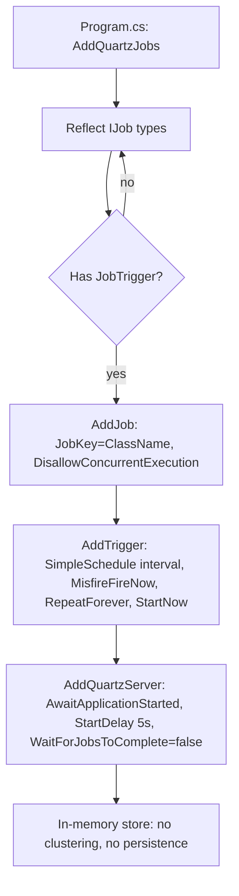

# 15. Background Jobs & Scheduling

Cotton runs all of its recurring server-side maintenance as Quartz.NET jobs. Every job is a class in `src/Cotton.Server/Jobs/` that implements `Quartz.IJob` and carries a single `[JobTrigger(...)]` attribute from the **EasyExtensions.Quartz** package. There is no `quartz.config`/`quartz.properties`, no hand-written `JobDetail`/`Trigger` wiring, and no database-backed job store: jobs are discovered by reflection at startup and run from an in-memory scheduler. This section documents the registration pattern, the scheduler lifecycle, and every individual job — its cadence, what it reads and writes, its concurrency and failure behavior, and how it interacts with the rest of the system.

## Purpose & overview

Background jobs in Cotton fall into a few categories:

- **Reclamation / consistency**: `GarbageCollectorJob`, `StorageConsistencyJob` — keep the `Chunks` table and the blob store in agreement and reclaim unreferenced space.
- **Deferred content work**: `GeneratePreviewJob`, `ComputeManifestHashesJob` — work that is too expensive to do inline on the upload path.
- **Retention**: `DownloadTokenRetentionJob`, `RefreshTokenRetentionJob` — prune/expire security tokens.
- **Backup**: `DumpDatabaseJob` — periodic logical PostgreSQL dump stored as content-addressed chunks.
- **Idempotent backfills / migrations** that ride along as periodic jobs: `FixMimeTypesJob`, `BackfillChunkStoredSizeJob`, `BackfillNullMetadataJob` (temporary), and `SyncChangeRetentionJob` (sync-log pruning).
- **Housekeeping / telemetry**: `ClearTempFolderJob`, `CollectPerformanceJob`.

Several jobs are also *fired on demand* in response to user actions or admin requests (uploads trigger preview/hash jobs; an admin endpoint triggers GC; a backup endpoint triggers the dump). Those triggers reuse the same registered `JobDetail`, so on-demand runs honor the same concurrency rules as scheduled runs.

## Registration pattern

### The `[JobTrigger]` attribute

`JobTriggerAttribute` is defined in the vendored EasyExtensions repository at `/data/code/EasyExtensions/Sources/EasyExtensions.Quartz/Attributes/JobTriggerAttribute.cs` (consumed by Cotton as the NuGet package `EasyExtensions.Quartz`). Its constructor is:

```csharp
public JobTriggerAttribute(int days = 0, int hours = 0, int minutes = 0, int seconds = 0,
    bool startNow = true, bool repeatForever = true, string? cronSchedule = "",
    bool disallowConcurrentExecution = true)
```

The constructor throws `ArgumentException` if the resulting `Interval` is `<= TimeSpan.Zero` *and* no `cronSchedule` is given, so every usable trigger must specify at least one of `days`/`hours`/`minutes`/`seconds` or a cron expression.

Key behaviors derived from the constructor defaults, which Cotton's jobs all rely on:

| Property | Default | Effect in Cotton |
| --- | --- | --- |
| `Interval` | `new TimeSpan(days, hours, minutes, seconds)` | The simple-schedule repeat interval. Every Cotton job specifies exactly one of `days`/`hours`/`minutes`. |
| `StartNow` | `true` | The trigger is registered with `.StartNow()`, so each job's first fire is attempted at startup (subject to the scheduler `StartDelay` and each job's own internal start-up `Task.Delay`). |
| `RepeatForever` | `true` | `.RepeatForever()` — the simple schedule never stops repeating. |
| `CronSchedule` | `""` | No Cotton job uses cron; all use the interval-based simple schedule. |
| `DisallowConcurrentExecution` | `true` | The Quartz `JobDetail` is configured `.DisallowConcurrentExecution(true)` for every job. |

The important nuance: **`DisallowConcurrentExecution` defaults to `true` inside the attribute itself**, so *every* Cotton job is registered as non-concurrent at the Quartz job-detail level, whether or not it also carries the separate Quartz `[DisallowConcurrentExecution]` marker attribute. Only `GarbageCollectorJob` and `GeneratePreviewJob` additionally apply the Quartz `[DisallowConcurrentExecution]` marker on the class. That marker is effectively redundant given the registration default, but it documents intent.

### Discovery and scheduler wiring

`src/Cotton.Server/Program.cs` (line 149) registers everything with a single argument-less call inside the service-configuration chain:

```csharp
builder.Services
    .AddMediator()
    .AddQuartzJobs()
    .AddMemoryCache()
    .AddSignalR().Services
    ...
```

`AddQuartzJobs()` (in `/data/code/EasyExtensions/Sources/EasyExtensions.Quartz/Extensions/ServiceCollectionExtensions.cs`) does the following:

1. Calls `ReflectionHelpers.GetTypesOfInterface<IJob>()` to find every loaded type implementing `IJob`.
2. For each type that has a `[JobTrigger]` attribute (types without it are skipped), it:
   - Creates a `JobKey(job.Name)` (the bare class name, e.g. `GarbageCollectorJob`).
   - Registers the job via `AddJob(...)` with `.WithIdentity(jobKey).DisallowConcurrentExecution(jobTriggerAttribute.DisallowConcurrentExecution)`.
   - Registers one trigger identified `job.Name + "Trigger"` (e.g. `GarbageCollectorJobTrigger`). When `Interval > 0` and no cron is set, it uses `.WithSimpleSchedule(x => x.WithInterval(interval).WithMisfireHandlingInstructionFireNow())`, adding `.RepeatForever()` when `RepeatForever` and `.StartNow()` when `StartNow`.
3. Calls `.AddQuartzServer(...)` with:
   - `WaitForJobsToComplete = false` — on shutdown the host does **not** block for running jobs to finish; jobs observe `IJobExecutionContext.CancellationToken` instead.
   - `AwaitApplicationStarted = true` — the scheduler does not start firing until the ASP.NET host has fully started.
   - `StartDelay = TimeSpan.FromSeconds(5)` — an additional 5-second delay before the scheduler begins.

Because `AddQuartzJobs()` is called with no `postgresConnectionString` and the default `useClustering = false`, **the scheduler uses the default in-memory store and clustering is off** (the extension only calls `UsePersistentStore`/`UsePostgres`/`UseClustering` when a connection string is supplied). Consequences:

- Schedules and trigger state are not persisted. On every restart all triggers re-arm fresh, and (because `StartNow` is true) each job attempts a first run shortly after startup. This is why nearly every job opens with an internal `await Task.Delay(...)` to defer real work past the startup storm (see per-job tables below).
- Misfires are handled with **fire-now** semantics (`WithMisfireHandlingInstructionFireNow`) — a single catch-up fire, not a backlog replay.
- Running multiple server instances would run these jobs **independently on each instance** (no cluster coordination). The GC job mitigates same-process double-deletion with an in-process reservation set, but cross-process coordination relies on the database-level checks each job performs, not on Quartz.



### On-demand triggering

`ISchedulerFactory.TriggerJobAsync<TJob>()` (extension in `/data/code/EasyExtensions/Sources/EasyExtensions.Quartz/Extensions/SchedulerFactoryExtensions.cs`) constructs `new JobKey(typeof(TJob).Name)`, resolves the scheduler, and calls `scheduler.TriggerJob(jobKey)`. Because the key matches the registered job, a manual trigger reuses the same `JobDetail` and therefore the same `DisallowConcurrentExecution` guard.

| Call site | Job(s) triggered | When |
| --- | --- | --- |
| `Controllers/ServerController.cs` `TriggerGarbageCollector` (`PATCH /api/v1/server/gc/trigger`, `[Authorize(Roles = nameof(UserRole.Admin))]`) | `GarbageCollectorJob` | Admin requests an immediate GC pass |
| `Handlers/Server/TriggerDatabaseBackupRequest.cs` (`TriggerDatabaseBackupRequestHandler`), reached via `ServerController.TriggerDatabaseBackup` (`PATCH /api/v1/server/database-backup/trigger`, Admin only) | `DumpDatabaseJob` | Admin requests an immediate backup |
| `Controllers/FileController.cs` line 517–518 (after updating an existing file's content) and line 1011–1012 (`CreateFileFromChunks`, `POST /api/v1/files/from-chunks`) | `ComputeManifestHashesJob` **and** `GeneratePreviewJob` | After a file commit/update |
| `Handlers/WebDav/WebDavPutFileRequest.cs` line 471 (`NotifyPutCompletedAsync`) | `GeneratePreviewJob` only | After a WebDAV `PUT` completes |

## Job summary table

Cadences below are the literal `[JobTrigger]` arguments. "Internal start delay" is the `await Task.Delay(...)` at the top of `Execute` that defers the first useful work after process start.

| Job | Trigger / cadence | Internal start delay | Purpose | Primary writes |
| --- | --- | --- | --- | --- |
| `GarbageCollectorJob` | `[JobTrigger(hours: 6)]` | 15 min (first run only, process-static) | Reclaim orphaned manifests & unreferenced chunks (schedule-then-delete) | `FileManifests`, `FileManifestChunks`, `DownloadTokens`, `Chunks` (`GCScheduledAfter`), `ChunkOwnerships`, blob-store deletes |
| `StorageConsistencyJob` | `[JobTrigger(days: 30)]` | 5 min | Reconcile `Chunks` table against the blob store in both directions | `FileManifests` (clears preview hashes), `Users` (clears avatar hash), `Chunks` (registers orphans w/ `GCScheduledAfter`); sends notifications |
| `ComputeManifestHashesJob` | `[JobTrigger(hours: 1)]` | none | Verify whole-file content hash of manifests in background | `FileManifests.ComputedContentHash`; sends mismatch notifications |
| `GeneratePreviewJob` | `[JobTrigger(minutes: 15)]` | none | Generate small/large WebP previews | blob store (preview blobs), `Chunks`, `FileManifests` (preview hashes, version, error); SignalR `PreviewGenerated` |
| `DownloadTokenRetentionJob` | `[JobTrigger(days: 1)]` | 4 min | Delete download tokens expired > 30 days | `DownloadTokens` (delete) |
| `RefreshTokenRetentionJob` | `[JobTrigger(days: 1)]` | 10 min | Revoke refresh tokens created > 30 days ago | `RefreshTokens.RevokedAt` |
| `DumpDatabaseJob` | `[JobTrigger(days: 7)]` | 3 min | Logical `pg_dump` stored as content-addressed chunks + manifest pointer | blob store (dump chunks, manifest, pointer), `Chunks`/`ChunkOwnerships` via ingest |
| `ClearTempFolderJob` | `[JobTrigger(hours: 36)]` | 7 min | Delete storage-backend temp files older than 1 hour | storage backend temp dir |
| `FixMimeTypesJob` | `[JobTrigger(days: 1)]` | 2 min | Backfill/repair `ContentType` for default/empty manifests | `FileManifests.ContentType` |
| `BackfillChunkStoredSizeJob` | `[JobTrigger(days: 1)]` | none | Backfill `StoredSizeBytes` for chunks with non-positive value | `Chunks.StoredSizeBytes` |
| `BackfillNullMetadataJob` | `[JobTrigger(days: 1)]` | none | Backfill legacy `null` metadata dictionaries to empty `{}` on nodes/node-files | `Nodes.Metadata`, `NodeFiles.Metadata` |
| `SyncChangeRetentionJob` | `[JobTrigger(days: 1)]` | none | Prune `SyncChanges` older than 365 days (keeps the newest per owner) | `SyncChanges` (delete) |
| `CollectPerformanceJob` | `[JobTrigger(days: 1)]` | 6 min | Send telemetry + optional storage-pipeline probe to Cotton Bridge | none (outbound HTTP POST only) |

> Note: only `GarbageCollectorJob` and `GeneratePreviewJob` carry the extra Quartz `[DisallowConcurrentExecution]` marker; all other jobs are non-concurrent purely through the `[JobTrigger]` registration default.

## Per-job reference

### GarbageCollectorJob

`src/Cotton.Server/Jobs/GarbageCollectorJob.cs` — `[JobTrigger(hours: 6)]`, `[DisallowConcurrentExecution]`. Injects `PerfTracker`, `IStoragePipeline`, `CottonDbContext`, `ChunkUsageService`, `SettingsProvider`, `ILogger`.

This is the most involved job; the deep mechanics are documented in the *Garbage Collection* section. Summary of control flow:

1. **Night-time gate.** Reads `SettingsProvider.GetServerSettings().StorageSpaceMode`. `isAggressiveMode = spaceMode == StorageSpaceMode.Limited`. If the mode is *not* `Limited` and `PerfTracker.IsNightTime()` is true, the run logs and returns early. Night time is local hours `< 7` or `>= 22` evaluated against the server's configured timezone (`PerfTracker.IsNightTime` via `CottonServerSettings.GetTimezoneInfo()`).
2. **First-run cool-down.** A `static bool _isFirstRun` flag delays the very first run with `await Task.Delay(900_000, context.CancellationToken)` (15 minutes) to let the server stabilize. This is process-static, so it applies once per process and is cancellation-aware.
3. **Batch sizing by mode.** `StorageSpaceMode` selects the chunk batch size: `Limited` → `MaxChunkBatchSize` (100000), `Unlimited` → `MinChunkBatchSize` (1000), `Optimal` → midpoint `(MinChunkBatchSize + MaxChunkBatchSize) / 2` (50500); the fall-through default is `MinChunkBatchSize * 2` (2000).
4. **`RunOnceAsync(now, batchSize, ct)`** loads `protectedStorageKeys` via `ChunkUsageService.GetProtectedStorageKeysAsync` and performs four phases:
   - `DeleteOrphanedManifestsAsync` — deletes up to `ManifestBatchSize` (1000) `FileManifests` with no `NodeFiles`, inside a transaction that first `ExecuteDeleteAsync`-deletes dependent `DownloadTokens` (joined through `NodeFile.FileManifestId`) and `FileManifestChunks`. The manifest delete re-asserts `!fm.NodeFiles.Any()`; if a candidate became referenced mid-transaction (`deletedManifests != manifestIds.Count`) or a `DbUpdateException` is thrown, the whole transaction rolls back and the pass logs a warning rather than risking data loss.
   - `ClearSchedulesForReferencedChunksAsync` — clears `GCScheduledAfter` for chunks that are now referenced or protected, via `ChunkUsageService.ClearGcSchedulesForReferencedChunksAsync` and `ClearGcSchedulesForProtectedChunksAsync`.
   - `ScheduleOrphanedChunksAsync` — sets `Chunk.GCScheduledAfter` on unreferenced, unprotected chunks (`ChunkUsageService.WhereUnreferencedByDatabase` filtered by `WhereNotProtectedByStorageKeys`, only where `GCScheduledAfter == null`). The deletion delay depends on mode: `Limited` → `now + 1 day`; `Unlimited` → `now + 28 days` (`ChunkGcDelayDays * 4`); `Optimal`/default → `now + 7 days` (`ChunkGcDelayDays`). Scheduling is done in inner batches of `ScheduleInnerBatchSize` (2000) with `ExecuteUpdateAsync`, up to the mode-selected `batchSize` total.
   - `DeleteScheduledChunksAsync` — selects unreferenced chunks whose `GCScheduledAfter != null && <= now` (up to `batchSize`), routes any protected hashes to a schedule-clear instead of deletion, reserves each remaining hash in the static `CurrentlyDeletingChunks` `ConcurrentDictionary` (case-insensitive), waits 5 s (`Task.Delay(5_000, ct)`), then for each `DeleteInnerBatchSize` (500) batch calls `DeleteEligibleBatchAsync`. Reservations are released in a `finally`.

`DeleteEligibleBatchAsync` is the database-level safety net: it re-queries which hashes are still scheduled, re-queries which have become referenced (`WhereReferencedByDatabase`), clears `GCScheduledAfter` on the now-live ones, and only deletes the still-eligible (unreferenced, unprotected) hashes — removing `ChunkOwnerships` then `Chunks` rows in a transaction, then deleting blobs from storage with `Parallel.ForEachAsync` at `MaxDegreeOfParallelism = StorageDeleteConcurrency` (8) via `IStoragePipeline.DeleteAsync`.

**Concurrency / ingest cooperation.** `[DisallowConcurrentExecution]` plus the attribute default prevent overlapping runs of the same `JobDetail`. The static `CurrentlyDeletingChunks` set is exposed through `public static bool IsChunkBeingDeleted(string uid)`. The ingest path (`ChunkIngestService.WaitForGarbageCollectionAsync`) polls this: while a chunk's storage key is being deleted it waits in steps, and if it is still being deleted after the wait budget it throws `InvalidOperationException` asking the caller to retry — this is the "GC and ingest coordinate" guarantee the README cites.

**Failure handling.** Per-batch deletes are wrapped in try/catch and log a warning on failure without aborting the whole pass. Manifest cleanup rolls back on contention. Storage delete failures are logged at warning and swallowed (the DB row is already gone, so the orphaned blob will be re-detected by `StorageConsistencyJob`); a `DeleteAsync` returning `false` is logged at debug.

See the *Garbage Collection* section for the full schedule-then-delete model.

### StorageConsistencyJob

`src/Cotton.Server/Jobs/StorageConsistencyJob.cs` — `[JobTrigger(days: 30)]`. No explicit `[DisallowConcurrentExecution]` marker, but the registration default still makes it non-concurrent. Injects `IStoragePipeline`, `CottonDbContext`, `INotificationsProvider`, `ChunkUsageService`, `ILogger`.

After `await Task.Delay(300_000, context.CancellationToken)` (5 minutes), `RunOnceAsync` does a two-directional reconciliation:

1. **Collect all storage keys** into a case-insensitive `HashSet<string>` via `IStoragePipeline.ListAllKeysAsync`.
2. **DB → storage** (`CheckDbChunksAgainstStorageAsync`): pages `Chunks` ordered by `Hash` in batches of `BatchSize` (10000) using `Skip`/`Take`. For each chunk hash (hex via `Hasher.ToHexStringHash`), if its key is present in the storage set it is `Remove`d (marking it accounted-for); otherwise it double-checks with `IStoragePipeline.ExistsAsync` (guard against listing races) and, if truly missing, calls `HandleMissingChunkAsync`.
3. **storage → DB** (`RegisterOrphanedStorageKeysAsync`): keys still left in the set after step 2 are storage blobs with no DB chunk. Protected keys (`ChunkUsageService.GetProtectedStorageKeysAsync`) are removed first. Each remaining key is parsed back to a hash via `Hasher.FromHexStringHash` (invalid keys are logged and skipped), re-checked against the DB, sized via `IStoragePipeline.GetSizeAsync`, and inserted as a new `Chunk` (`PlainSizeBytes` and `StoredSizeBytes` = measured size, `CompressionAlgorithm = CompressionProcessor.Algorithm`, `GCScheduledAfter = now + 1 day`) so the GC job can reclaim it. A size-0 blob whose key is not the canonical zero hash (`Hasher.ZeroHashHexString`) is treated as corruption: the job **throws** `InvalidOperationException` to abort rather than risk registering bad data. Inserts are saved every `BatchSize` rows and once more at the end.

`HandleMissingChunkAsync` distinguishes by reference type:

- **Preview** (`FileManifest.SmallFilePreviewHash` / `LargeFilePreviewHash`): silently clears the matching preview hash columns — for a small-preview match it also clears `SmallFilePreviewHashEncrypted` — so previews regenerate.
- **Avatar** (`User.AvatarHash`): clears `AvatarHash` and `AvatarHashEncrypted` via `ExecuteUpdateAsync`.
- **Actual file data** (`FileManifestChunks.ChunkHash`): **does not delete anything**; instead resolves affected `FileManifestId`s → `NodeFiles`, and sends one `SendStorageChunkMissingNotificationAsync(ownerId, fileName)` per distinct `(OwnerId, Name)` via the `INotificationsProvider` extension. Notification failures are caught and logged.

**Failure handling.** Most failures propagate (Quartz logs the failed execution); the size-0 guard intentionally aborts. Notification sends are individually try/caught. **Interactions.** `IStoragePipeline`, `ChunkUsageService`, `INotificationsProvider`; feeds work back to `GarbageCollectorJob` by scheduling orphaned keys.

### ComputeManifestHashesJob

`src/Cotton.Server/Jobs/ComputeManifestHashesJob.cs` — `[JobTrigger(hours: 1)]`. Injects `PerfTracker`, `IStoragePipeline`, `INotificationsProvider`, `ILogger`, `CottonDbContext`.

Verifies that uploaded file content actually hashes to the value the client proposed.

- **Gates:** returns early (logging the reason) if `PerfTracker.IsUploading()` or `PerfTracker.IsNightTime()`.
- Loads the work set with the LINQ chain `_dbContext.FileManifests.Take(MaxItemsPerRun).Include(fm => fm.FileManifestChunks).Where(fm => fm.ComputedContentHash == null).ToList()` — note the `Take(1000)` is composed *before* the `ComputedContentHash == null` predicate and the query is materialized synchronously, so a run processes at most `MaxItemsPerRun` (1000) candidate manifests.
- For each manifest, it delays *before* processing the item — `await Task.Delay(60_000)` if `IsPreviewGenerating()` or `IsUploading()`, else `await Task.Delay(250)` (these initial per-item delays do **not** take a cancellation token). It then assembles the blob stream via `_storage.GetBlobStream(hashes, pipelineContext)` (`pipelineContext.FileSizeBytes = manifest.SizeBytes`) and computes the hash with `Hasher.HashData(stream)`.
  - **Match** (`computedContentHash.SequenceEqual(manifest.ProposedContentHash)`): sets `ComputedContentHash` and saves.
  - **Mismatch:** logs a warning and, for every `NodeFile` referencing the manifest, sends `SendUploadHashMismatchNotificationAsync(ownerId, name, proposedHex, computedHex)`. It does **not** set `ComputedContentHash`, so the manifest is re-examined on the next run.

**Concurrency.** Non-concurrent via the registration default. **Failure handling.** No outer try/catch; an exception fails the Quartz execution and the manifest stays unverified for retry. **Triggered on demand** after uploads (FileController). See the *Garbage Collection* and storage-integrity material in the *Storage Pipeline* section.

### GeneratePreviewJob

`src/Cotton.Server/Jobs/GeneratePreviewJob.cs` — `[JobTrigger(minutes: 15)]`, `[DisallowConcurrentExecution]`. Injects `PerfTracker`, `IStreamCipher`, `IStoragePipeline`, `CottonDbContext`, `IHubContext<EventHub>`, `ILogger`.

Generates WebP previews. Deep detail lives in the *Previews* section; control flow:

1. `NormalizeLegacySourceTextContentTypesAsync` — upgrades up to `MaxItemsPerRun` manifests whose `ContentType` is `FileManifestService.DefaultContentType` (`"application/octet-stream"`) or empty but whose file name matches `FileManifestService.SourceTextFileNameRegexPattern`, resolving them to a real content type via `FileManifestService.ResolveContentType` so a generator can match.
2. `LoadNextPreviewItemsAsync` → `CreateItemsToProcessQuery` — selects `FileManifest`s whose `ContentType` is in `PreviewGeneratorProvider.GetAllSupportedMimeTypes()` and that either lack a small preview (`SmallFilePreviewHash == null` && `PreviewGenerationError == null`) **or** are behind the current generator version for their content type (a `Union` over the `GetGeneratorVersionsByContentType()` groups drives regeneration on generator upgrades). Ordered by `CreatedAt` descending (newest first), `Take(MaxItemsPerRun)` (10000), then re-loaded by id with `NodeFiles` and `FileManifestChunks.Chunk` included as an `AsSplitQuery`.
3. For each item: marks `PerfTracker.OnPreviewGenerating()`, resolves a generator via `PreviewGeneratorProvider.GetGeneratorByContentType(item.ContentType)`. If none, detaches the item and continues. Otherwise it streams the blob with `IStoragePipeline.GetBlobStream`, generates a `PreviewGeneratorProvider.DefaultSmallPreviewSize` (200) WebP, hashes it (`Hasher.HashData`), `WriteAsync`s it to storage, calls `EnsureChunkExistsAsync` (inserts a new `Chunk` or repairs an existing one — clearing `GCScheduledAfter`, backfilling `PlainSizeBytes`/`StoredSizeBytes`), then sets `SmallFilePreviewHash`, `SmallFilePreviewHashEncrypted = _crypto.Encrypt(hash)`, clears `PreviewGenerationError`, and records `PreviewGeneratorVersion = generator.Version`. For `ImagePreviewGenerator`, `HeicPreviewGenerator`, or `SvgPreviewGenerator` it additionally generates and stores a `DefaultLargePreviewSize` (2000) preview into `LargeFilePreviewHash`.
4. After a successful save it pushes, per owning `NodeFile`, a SignalR `PreviewGenerated` event with arguments `(nodeFile.NodeId, nodeFile.Id, item.GetPreviewHashEncryptedHex())` to that user via `IHubContext<EventHub>`.
5. **Throttling:** the first `UnthrottledItemsCount` (1000) items run without delay; once `processed > UnthrottledItemsCount` it inserts `await Task.Delay(ThrottleDelayMs)` (250 ms) between items. If `PerfTracker.IsUploading()` after an item, it waits 5 s (`WaitForUploadPauseAsync`) and then **refreshes the queue** (`RefreshPreviewQueueAsync`, up to `RefreshItemsPerUploadPause` = 250 newest items inserted ahead of the cursor) so freshly uploaded files get previews promptly; the queue is trimmed back to `MaxItemsPerRun` (`TrimPreviewQueueToRunLimit`).

**Failure handling.** Per-item failures other than cancellation are caught: the manifest's `PreviewGenerationError` is set to the exception message and `PreviewGeneratorVersion` is recorded, then saved — this surfaces the error and prevents an infinite retry loop (the item is excluded next run until a newer generator version exists). `OperationCanceledException` on the job's cancellation token re-throws. **Concurrency.** Non-concurrent (marker + default). **Triggered on demand** after uploads and WebDAV PUTs. A code comment near the `PreviewGenerated` broadcast notes a minor cross-user dedup side-channel; see the *Previews* and *Cryptography* sections.

### DownloadTokenRetentionJob

`src/Cotton.Server/Jobs/DownloadTokenRetentionJob.cs` — `[JobTrigger(days: 1)]`. Injects `CottonDbContext`, `ILogger`.

After `await Task.Delay(240_000)` (4 minutes; no cancellation token), deletes `DownloadTokens` whose `ExpiresAt` is non-null and `<= now - 30 days` (i.e. expired for more than 30 days, not merely expired). It loads them, `RemoveRange`, `SaveChangesAsync`, and logs the count. Tokens with a null `ExpiresAt` are never removed here. See the *Sharing & Download Tokens* section.

### RefreshTokenRetentionJob

`src/Cotton.Server/Jobs/RefreshTokenRetentionJob.cs` — `[JobTrigger(days: 1)]`. Injects `CottonDbContext`, `ILogger`.

After `await Task.Delay(600_000)` (10 minutes; no cancellation token), it revokes (does not delete) auth refresh tokens. `RetentionPeriod` is `TimeSpan.FromDays(30)`. It loads `RefreshTokens` where `RevokedAt == null` and `CreatedAt < now - 30 days`, sets `RevokedAt = DateTime.UtcNow` on each, saves, and logs the count. Note this revokes by **creation age**, capping the absolute lifetime of any refresh token at 30 days regardless of recent use. See the *Authentication & Sessions* section.

### DumpDatabaseJob

`src/Cotton.Server/Jobs/DumpDatabaseJob.cs` — `[JobTrigger(days: 7)]`. Injects `IPostgresDumpService`, `IChunkIngestService`, `IStoragePipeline`, `SettingsProvider`, `CottonDbContext`, `DatabaseBackupKeyProvider`, `IConfiguration`, `ILogger`.

Performs a logical PostgreSQL backup and stores it as content-addressed chunks. After `await Task.Delay(180_000)` (3 minutes; no cancellation token):

1. Resolves a backup owner (`ResolveBackupOwnerIdAsync` — the first user by `Id`); throws `InvalidOperationException` if no users exist.
2. `IPostgresDumpService.DumpToFileAsync` writes a dump file to `{Path.GetTempPath()}/cotton/db-dumps/db-{yyyyMMdd-HHmmss}-{backupId}.dump` (path built by `BuildDumpFilePath`, `backupId` is a `Guid.NewGuid().ToString("N")`).
3. `UploadDumpWithChunkerAsync` reads the dump in fixed-size pieces of `SettingsProvider.GetServerSettings().MaxChunkSizeBytes` (must be positive, else `InvalidOperationException`) using `ReadExactlyAsync`, hashing the whole file incrementally with `IncrementalHash` (`Hasher.SupportedHashAlgorithmName`, SHA-256), and ingesting each piece via `IChunkIngestService.UpsertChunkAsync(ownerId, buffer, bytesRead, ct)`. An empty dump still produces one empty chunk.
4. Builds a `BackupManifest` (`SchemaVersion: 1`) recording `BackupId`, `Elapsed`, `CreatedAtUtc`, `Contains` (`"postgres_database_dump"`), `DumpFormat` (`"pg_dump_custom"`), source DB/host/port (from `DatabaseSettings:Database` / `DatabaseSettings:Host` / `DatabaseSettings:Port` config with `cotton_dev`/`localhost`/`5432` fallbacks via `GetConfigOrDefault`), `HashAlgorithm` (`Hasher.SupportedHashAlgorithm`, `"SHA256"`), chunk size, dump size, content hash, `ChunkCount`, and the ordered `Chunks` list; serializes it with web JSON defaults and writes it (`WriteObjectAsync` → `IStoragePipeline.WriteAsync`) to a content-addressed key (hash of the manifest bytes).
5. Writes a `BackupManifestPointer` (`SchemaVersion: 1`, `LogicalKey = DatabaseBackupKeyProvider.ManifestPointerLogicalKey` = `"database.ctn"`, `LatestManifestStorageKey`, `LatestBackupId`) to `DatabaseBackupKeyProvider.GetScopedPointerStorageKey()` (a master-key-scoped key), deleting the previous pointer object first via `IStoragePipeline.DeleteAsync`, so restore can find the latest backup.
6. A `finally` deletes the local dump file (`TryDeleteDumpFile`, errors swallowed).

**Failure handling.** Errors propagate out of `Execute` (Quartz records the failed run) but the temp dump file is always cleaned up via `finally`. **Triggered on demand** by the admin backup endpoint. The full design is in the *Database Backup & Auto-Restore* section.

### ClearTempFolderJob

`src/Cotton.Server/Jobs/ClearTempFolderJob.cs` — `[JobTrigger(hours: 36)]`. Injects `PerfTracker`, `IStorageBackendProvider`.

After `await Task.Delay(420_000)` (7 minutes; no cancellation token), returns early if `PerfTracker.IsNightTime()`. Otherwise it resolves the active backend via `IStorageBackendProvider.GetBackend()` and calls `backend.CleanupTempFiles(_ttl)` with `_ttl = TimeSpan.FromHours(1)`, removing temp files older than one hour. Whether a backend actually has temp files depends on the configured backend; see the *Storage Backends* section.

### FixMimeTypesJob

`src/Cotton.Server/Jobs/FixMimeTypesJob.cs` — `[JobTrigger(days: 1)]`. Injects `CottonDbContext`, `ILogger`.

An idempotent backfill that repairs `FileManifest.ContentType` for manifests stuck at `FileManifestService.DefaultContentType` (`"application/octet-stream"`) or empty string. After `await Task.Delay(120_000)` (2 minutes; no cancellation token) it keyset-paginates by `Id` (`m.Id.CompareTo(lastId) > 0`, ordered by `Id`) in batches of `BatchSize` (1000). For each manifest it resolves a content type from the first `NodeFile`'s name via `FileManifestService.ResolveContentType`; if the resolved type differs case-insensitively it updates `ContentType` and increments the counter. It saves per batch, clears the change tracker (`ChangeTracker.Clear()`) between batches to bound memory, and respects `context.CancellationToken` in the loop and queries. Logs total updated. Once all manifests already have a proper content type this job is effectively a no-op each day.

### BackfillChunkStoredSizeJob

`src/Cotton.Server/Jobs/BackfillChunkStoredSizeJob.cs` — `[JobTrigger(days: 1)]`. Injects `CottonDbContext`, `IStoragePipeline`, `ILogger`. It is one of several backfill/migration jobs the README's "background jobs" list does not name (see also `BackfillNullMetadataJob` and `SyncChangeRetentionJob`).

An idempotent backfill that fills in `Chunk.StoredSizeBytes` for chunks created before that column was tracked (value `<= 0`). It loops over `Chunks` where `StoredSizeBytes <= 0` ordered by `Hash` in batches of `BatchSize` (1000), querying actual size from `IStoragePipeline.GetSizeAsync`. It writes the size only when `> 0` or when the key is the canonical zero hash (`Hasher.ZeroHashHexString`), so a chunk genuinely missing from storage is left at `<= 0` (and is retried) rather than recorded as size 0. Saves per batch, respects `context.CancellationToken`. The loop exits when no more chunks need backfill. `StoredSizeBytes` feeds storage-usage accounting; see the *Storage Pipeline* and *Quotas* sections.

### BackfillNullMetadataJob

`src/Cotton.Server/Jobs/BackfillNullMetadataJob.cs` — `[JobTrigger(days: 1)]`. Injects `CottonDbContext`, `ILogger`. No internal start delay.

An idempotent, **temporary** migration job (its source carries a "remove this job after the null metadata cleanup has rolled out" note) that converts legacy `null` `Metadata` dictionaries into empty ones (`[]`). It backfills `Nodes` and then `NodeFiles` separately: each pass loops over rows where `Metadata == null` ordered by `Id` in batches of `BatchSize` (1000), assigns an empty dictionary, saves per batch, and clears the change tracker (`ChangeTracker.Clear()`) between batches to bound memory; both passes respect `context.CancellationToken`. Once all rows have a non-null metadata dictionary it is a no-op. Logs the total nodes and node-files updated.

### SyncChangeRetentionJob

`src/Cotton.Server/Jobs/SyncChangeRetentionJob.cs` — `[JobTrigger(days: 1)]`. Injects `CottonDbContext`, `ILogger`. No internal start delay.

Prunes the sync-change log used by the delta-sync API. `RetentionPeriod` is `TimeSpan.FromDays(365)`. It `ExecuteDeleteAsync`-deletes `SyncChanges` older than the 365-day cutoff, **but only those that are superseded** — the predicate keeps, per `OwnerId`, the newest expired change (a row is deleted only when another expired change with the same owner and a higher `Id` exists), so the latest pre-cutoff sync state per owner is retained. Logs the deleted count when non-zero. See the *Sync & Delta API* section.

### CollectPerformanceJob

`src/Cotton.Server/Jobs/CollectPerformanceJob.cs` — `[JobTrigger(days: 1)]`. Injects `PerfTracker`, `CottonDbContext`, `SettingsProvider`, `StoragePipelineProbeService`, `ILogger`.

Sends opt-in telemetry to Cotton Bridge. After `await Task.Delay(360_000)` (6 minutes; no cancellation token):

- **Gates:** returns early if `SettingsProvider.GetServerSettings().TelemetryEnabled` is false, or if `PerfTracker.IsUploading()`.
- Optionally runs a bounded storage-pipeline throughput probe via `StoragePipelineProbeService.RunAsync(storageBackend, ct)`, where `storageBackend = settings.StorageType.ToString().ToLowerInvariant()`. Probe failures are caught (`TryRunStoragePipelineProbeAsync`) and the telemetry is sent with a null probe.
- Builds a `TelemetryRequest` (defined in `src/Cotton.Shared/Models/TelemetryRequest.cs`, namespace `Cotton.Models`) and `POST`s it (`PostAsJsonAsync`, via a transient `HttpClient`) to `Cotton.Constants.CottonBridgeTelemetryUrl` (`"https://bridge.cottoncloud.dev/api/v1/telemetry"`, defined in `src/Cotton.Shared/Constants.cs`).

`TelemetryRequest` fields populated by this job:

| Property | Source |
| --- | --- |
| `InstanceId` (`Guid`) | `settings.InstanceId` |
| `ServerUrl` (`string`) | `settings.PublicBaseUrl` |
| `Nodes` (`int`) | `_dbContext.Nodes.CountAsync()` |
| `Users` (`int`) | `_dbContext.Users.CountAsync()` |
| `Files` (`int`) | `_dbContext.FileManifests.CountAsync()` |
| `Version` (`string`) | `AppVersionHelpers.GetAppVersion() ?? "Unknown"` |
| `MaxChunkSizeBytes` (`int`) | `settings.MaxChunkSizeBytes` |
| `StoragePipelineProbe` (`StoragePipelineProbeResult?`) | optional probe result, or null |

This job writes nothing to the database or storage — it only emits an outbound HTTP request. See the *Performance & Telemetry* section.

## Concurrency, failure modes, and edge cases

- **Non-concurrent by default.** Because `JobTriggerAttribute.DisallowConcurrentExecution` defaults to `true` and the registration honors it, no single job overlaps itself — including manual `TriggerJobAsync` fires, which target the same `JobDetail`. The explicit `[DisallowConcurrentExecution]` markers on `GarbageCollectorJob` and `GeneratePreviewJob` are belt-and-suspenders.
- **Startup storm + start delays.** With `StartNow = true` and an in-memory store, every trigger tries to fire right after `AwaitApplicationStarted` plus the 5-second `StartDelay`. The staggered per-job `Task.Delay` values (2–15 minutes) spread the first runs out and let the server stabilize. Several of these initial delays are **not** cancellation-aware — `DownloadTokenRetentionJob`, `RefreshTokenRetentionJob`, `DumpDatabaseJob`, `ClearTempFolderJob`, `FixMimeTypesJob` (2 min only), and `CollectPerformanceJob` pass no token to the opening `Task.Delay` — so a shutdown during that window will not interrupt the delay promptly; with `WaitForJobsToComplete = false` the host does not block on them either. (`GarbageCollectorJob` and `StorageConsistencyJob` *do* pass `context.CancellationToken` to their start delays.)
- **No persistence / no clustering.** Multi-instance deployments run each job on every node. Cross-node safety relies on the database-level re-checks inside the jobs (GC's `CurrentlyDeletingChunks` reservation set is process-local only), not on Quartz. Operators running more than one server replica should expect GC, consistency, dump, and telemetry to each run per-node.
- **Misfire handling.** All triggers use `WithMisfireHandlingInstructionFireNow()` — a single catch-up fire after downtime, not a replay of missed occurrences.
- **PerfTracker gating.** `IsUploading()` and `IsPreviewGenerating()` are time-window heuristics (both use the same 10-second `ChunkTimeoutSeconds`) backed by in-memory timestamps (`OnChunkCreated` is called from `ChunkController`; `OnPreviewGenerating` from `GeneratePreviewJob`). `IsNightTime()` is evaluated against the configured server timezone. Several jobs voluntarily yield to live traffic using these signals (GC night gate, `ComputeManifestHashesJob`, `GeneratePreviewJob`, `ClearTempFolderJob`, `CollectPerformanceJob`).
- **Data-loss guards.** Both `StorageConsistencyJob` (size-0 abort) and `GarbageCollectorJob` (transactional manifest delete with rollback on contention, double-check before chunk delete) deliberately err toward *not deleting* when reality is ambiguous.

## Non-obvious design decisions & gotchas

- The "`[DisallowConcurrentExecution]` is included by `[JobTrigger]`" behavior is real but indirect: it is the attribute's `disallowConcurrentExecution = true` default, applied at registration via `.DisallowConcurrentExecution(...)`, not the Quartz class marker. Removing the explicit markers from GC/Preview would not change runtime behavior.
- `FixMimeTypesJob`, `BackfillChunkStoredSizeJob`, and `BackfillNullMetadataJob` are effectively one-time migrations implemented as daily jobs; once converged they are cheap no-ops. `FixMimeTypesJob` and `BackfillChunkStoredSizeJob` are left in place so newly-imported or legacy rows are continuously self-healing, while `BackfillNullMetadataJob` is explicitly marked temporary (to be removed once the cleanup has rolled out to all deployed databases).
- `RefreshTokenRetentionJob` caps tokens by **creation age**, not idle age — long-lived sessions are forcibly rotated at 30 days. `DownloadTokenRetentionJob` keeps expired tokens for an extra 30 days before deleting them (grace window) and never deletes tokens with a null `ExpiresAt`.
- `GarbageCollectorJob._isFirstRun` and `CurrentlyDeletingChunks` are `static`, so their state is per-process and shared across all (non-concurrent) runs in that process.
- The README's "Background jobs are built into normal operation" list — preview generation, manifest hashing, token cleanup, temp cleanup, performance collection, MIME fixes, and storage consistency checks — matches implemented jobs. The README does **not** name the migration/maintenance jobs `BackfillChunkStoredSizeJob`, `BackfillNullMetadataJob`, `SyncChangeRetentionJob`, or `DumpDatabaseJob` in that list (the dump/backup job and GC are described separately), and it does not mention the deferred GC scheduling delays, which the code makes precise.

## Related sections

- *Garbage Collection* — deep dive into `GarbageCollectorJob`, `ChunkUsageService`, protected keys, and the schedule-then-delete model.
- *Storage Pipeline* and *Storage Backends* — `IStoragePipeline`, blob listing/sizing, the `GetBlobStream` assembly extension, and temp-file cleanup.
- *Previews* — preview generators, sizes, versioning, and the SignalR `PreviewGenerated` event.
- *Database Backup & Auto-Restore* — `DumpDatabaseJob`, `BackupManifest`/`BackupManifestPointer`, pointers, and restore.
- *Sharing & Download Tokens* and *Authentication & Sessions* — the token entities the retention jobs prune.
- *Performance & Telemetry* — `CollectPerformanceJob`, the storage-pipeline probe, and Cotton Bridge.
- *Real-time Events (SignalR)* — `EventHub` and the events jobs emit.
