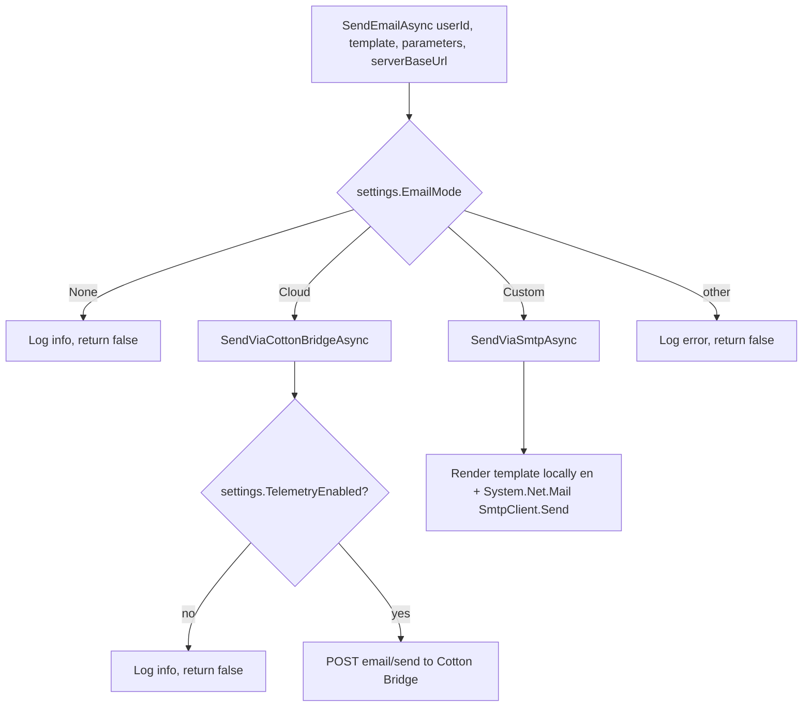
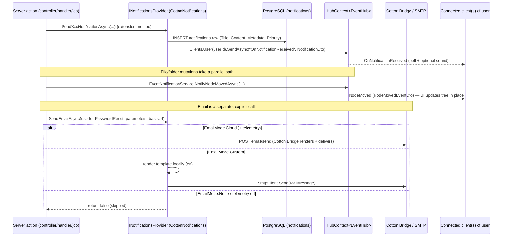

# 16. Real-time Events, Notifications & Email

Cotton delivers asynchronous activity to users through three distinct, loosely coupled channels: **realtime SignalR push** (for keeping active web clients in sync without polling), **in-app notifications** (durable rows in PostgreSQL surfaced through the notification bell and a REST API), and **email** (transactional confirmation/reset messages, sent either via the hosted Cotton Bridge relay or an operator-configured SMTP server). These channels overlap only partially: a single server-side action may push a SignalR frame, persist a notification row (which itself triggers a SignalR push), and/or send an email — but most events use only one or two of them. This section documents each channel, the exact wire methods and DTOs, and how a server action fans out across them, grounded in the actual source code.

## Purpose & overview

The three channels answer three different needs:

| Channel | Transport | Durable? | Audience | Typical triggers |
| --- | --- | --- | --- | --- |
| Realtime push | SignalR (`EventHub`) | No (fire-and-forget to connected clients) | All connections of one user, or one specific session group | File & folder mutations, restore, preview readiness, metadata/preference changes, session revocation |
| In-app notification | DB row + SignalR push | Yes (`notifications` table) | One user | Security events (logins, TOTP, 2FA, WebDAV token), shared-file downloads, upload/storage integrity, server updates, storage pressure, DB restore/integrity |
| Email | Cotton Bridge HTTP relay or SMTP | External | One user's email address | Email verification, password reset, SMTP test |

The boundary is deliberate: realtime push is *ephemeral UI synchronization*, in-app notifications are the *durable activity log*, and email is the only channel that reaches users who are not logged in.

## SignalR realtime push

### EventHub — the single hub

`src/Cotton.Server/Hubs/EventHub.cs` defines the only SignalR hub, `EventHub : Hub`. It is mapped at the route constant `Routes.V1.EventHub` (`src/Cotton.Shared/Routes.cs`, defined as `Base + "/hub/events"` where `Base = "/api/v1"`), which resolves to **`/api/v1/hub/events`**, via `app.MapHub<EventHub>(Routes.V1.EventHub)` in `src/Cotton.Server/Program.cs`. SignalR itself is registered with a bare `.AddSignalR()` in the service pipeline in `Program.cs` (no Redis/backplane — this is a single-process deployment).

The hub class is `[Authorize]`, so every connection must carry a valid JWT. The hub exposes **no callable server methods** (clients never invoke RPCs on it); it is push-only. The hub defines two public string constants used as method names elsewhere:

| Constant | Value | Meaning |
| --- | --- | --- |
| `EventHub.NotificationMethod` | `"OnNotificationReceived"` | A new in-app notification was created for the user |
| `EventHub.SessionRevokedMethod` | `"SessionRevoked"` | The client's auth session was revoked; it must drop its tokens |

#### Client grouping

`EventHub` overrides `OnConnectedAsync`. On connect it:

1. Reads the user id via `Context.User.GetUserId()` (an `EasyExtensions` claims helper reading the `sub`/`NameIdentifier` claim).
2. Reads the **session id** from the `sid` claim (`JwtRegisteredClaimNames.Sid`, falling back to `ClaimTypes.Sid`).
3. If no session id is present, it calls `Context.Abort()` and returns — the connection is rejected.
4. Otherwise it adds the connection to a per-session **group** named by `GetSessionGroupName(userId, sessionId)`:

```csharp
public static string GetSessionGroupName(Guid userId, string sessionId)
{
    return $"auth-session:{userId:N}:{sessionId}";
}
```

Two addressing schemes therefore coexist:

* **Per-user addressing** — `Clients.User(userId.ToString())` targets *all* connections of a user across all their sessions/devices. SignalR maps `User(...)` to the connection's user identifier, which here is the `sub` claim (set to `user.Id.ToString()` in `AuthSessionIssuer.CreateAccessToken`, `src/Cotton.Server/Services/AuthSessionIssuer.cs`). All file/folder/notification events use this scheme.
* **Per-session group addressing** — `Clients.Group(EventHub.GetSessionGroupName(userId, sessionId))` targets only the connections belonging to one specific session. This is used exclusively for `SessionRevoked` (see *Session revocation* below), so revoking one device's session does not log out the user's other devices.

The JWT carries the claims that make both schemes work. `AuthSessionIssuer.CreateAccessToken(User user, string sessionId)` adds: `JwtRegisteredClaimNames.Sub` = `user.Id.ToString()`, `JwtRegisteredClaimNames.Name` = `user.Username`, `JwtRegisteredClaimNames.Sid` = `sessionId`, `ClaimTypes.Name` = `user.Username`, and `ClaimTypes.Role` = `user.Role.ToString()`.

#### Reconnect / transport behavior

The hub itself contains no transport configuration beyond the default `.AddSignalR()`; transport negotiation and reconnect are driven by the **client**. The web client (`src/cotton.client/src/shared/signalr/eventHub.ts`, the `EventHubService` class) connects to the hard-coded URL `"/api/v1/hub/events"` with:

* An `accessTokenFactory` that returns the in-memory access token; if no token is present and refresh is enabled (`getRefreshEnabled()`), it calls `refreshAccessToken()`; if refresh is disabled or the refresh fails, it throws. SignalR sends this token as the `access_token` query-string parameter on the WebSocket/long-polling handshake.
* A two-stage transport attempt list (`attemptSpecs`): first `HttpTransportType.WebSockets` with `skipNegotiation: true` (avoids the `/negotiate` round-trip that some proxies reject), then `WebSockets | LongPolling` with normal negotiation as a fallback.
* `withAutomaticReconnect` using a custom `reconnectPolicy.nextRetryDelayInMilliseconds`: retry every **1 s** while `previousRetryCount < 5`, every **5 s** while `< 15`, then every **30 s** thereafter.
* On `onreconnected`, it re-subscribes all handlers (`resubscribeAll`) and notifies connected listeners (`notifyConnected`). The notifications feature hook `src/cotton.client/src/features/notifications/useEventHub.ts` registers an `onConnected` callback that calls `invalidateNotificationQueries(queryClient)`, so the UI refetches anything missed while disconnected.

The incoming-notification handler in `useEventHub.ts` validates the payload with `notificationSchema.safeParse`, prepends it to the cached list (`prependCachedNotification`), and plays `/assets/sounds/notification-3.mp3` at volume `0.5` only if the user preference `selectNotificationSoundEnabled` is set.

### Events pushed by the server

There are two server-side producers of realtime frames: the dedicated `EventNotificationService`, and a handful of controllers/jobs that push directly through `IHubContext<EventHub>`.

#### EventNotificationService

`src/Cotton.Server/Services/EventNotificationService.cs` (`IEventNotificationService`, registered scoped inside `AddChunkServices()` in `src/Cotton.Server/Extensions/ServiceCollectionExtensions.cs`) centralizes file/folder mutation events. Each method that needs an entity loads it from `CottonDbContext` (`AsNoTracking`), maps it to a DTO via Mapster `Adapt`, and pushes to `Clients.User(owner.ToString())` (the owner is read from the loaded entity's `OwnerId`):

| Method | Wire method | Payload type | Notes |
| --- | --- | --- | --- |
| `NotifyFileCreatedAsync(nodeFileId, ct)` | `FileCreated` | `NodeFileManifestDto` | Loads `NodeFile` + `FileManifest`; no-op if not found |
| `NotifyFileUpdatedAsync(nodeFileId, ct)` | `FileUpdated` | `NodeFileManifestDto` | |
| `NotifyFileDeletedAsync(userId, nodeFileId, parentNodeId, ct)` | `FileDeleted` | `NodeFileDeletedEventDto` | No DB load — payload built directly; `userId` passed in because the row may already be gone |
| `NotifyFileMovedAsync(nodeFileId, oldParentId, ct)` | `FileMoved` | `NodeFileMovedEventDto` | New parent is read from the loaded `NodeFile.NodeId` |
| `NotifyFileRenamedAsync(nodeFileId, ct)` | `FileRenamed` | `NodeFileManifestDto` | |
| `NotifyNodeCreatedAsync(nodeId, ct)` | `NodeCreated` | `NodeDto` | |
| `NotifyNodeDeletedAsync(userId, nodeId, parentNodeId, ct)` | `NodeDeleted` | `NodeDeletedEventDto` | No DB load; `userId` passed in |
| `NotifyNodeMovedAsync(nodeId, oldParentId, ct)` | `NodeMoved` | `NodeMovedEventDto` | **Only fires if `node.ParentId.HasValue`** — a move to the root is silently skipped; new parent is `node.ParentId.Value` |
| `NotifyNodeRenamedAsync(nodeId, ct)` | `NodeRenamed` | `NodeDto` | |

Callers include the move/delete handlers and WebDAV handlers, confirmed by grep: `MoveFileCommand` (`src/Cotton.Server/Handlers/Files/MoveFileCommand.cs`), `MoveNodeCommand` (`src/Cotton.Server/Handlers/Nodes/MoveNodeCommand.cs`), `WebDavPutFileRequest`, `WebDavMoveRequest`, `WebDavCopyRequest`, `WebDavDeleteRequest`, `WebDavMkColRequest` (all under `src/Cotton.Server/Handlers/WebDav/`).

#### Events pushed directly via IHubContext

Some events bypass `EventNotificationService` and call `_hubContext.Clients.User(...).SendAsync(...)` straight from a controller or job:

| Wire method | Producer (file) | Payload |
| --- | --- | --- |
| `NodeRenamed` | `src/Cotton.Server/Controllers/LayoutController.cs` | `NodeDto` (`node.Adapt<NodeDto>()`) |
| `NodeCreated` | `src/Cotton.Server/Controllers/LayoutController.cs` | `NodeDto` |
| `NodeDeleted` | `src/Cotton.Server/Controllers/LayoutController.cs` | `NodeDeletedEventDto(nodeId, parentNodeId)` |
| `NodeMetadataUpdated` | `src/Cotton.Server/Controllers/LayoutController.cs` | `NodeDto` (mapped from the patched node); the send is wrapped in `try/catch` and logs a warning on failure |
| `NodeRestored` | `src/Cotton.Server/Controllers/LayoutController.cs` | `outcome.RestoredNode` (a `NodeDto`) or, if null, the anonymous `new { id = nodeId }`; only when `outcome.Status == RestoreStatus.Restored` |
| `FileRenamed` / `FileUpdated` / `FileCreated` / `FileDeleted` | `src/Cotton.Server/Controllers/FileController.cs` | mapped `NodeFileManifestDto` / `NodeFileDeletedEventDto` (the controller also re-emits some `EventNotificationService` method names directly) |
| `FileRestored` | `src/Cotton.Server/Controllers/FileController.cs` | `outcome.RestoredFile` (a `NodeFileManifestDto`) or, if null, `new { id = nodeFileId }`; only when restored |
| `PreviewGenerated` | `src/Cotton.Server/Jobs/GeneratePreviewJob.cs` | three positional args: `nodeFile.NodeId`, `nodeFile.Id`, `item.GetPreviewHashEncryptedHex()` |
| `PreferencesUpdated` | `src/Cotton.Server/Controllers/UserController.cs` | two positional args: a CSRF/refresh token (`token ?? string.Empty`) and the updated `foundUser.Preferences` dictionary |
| `OnNotificationReceived` | `CottonNotifications.SendNotificationAsync` | `NotificationDto` |
| `SessionRevoked` | `SessionRevocationNotifier` (group-addressed, via `SendCoreAsync`) | empty arg array (`Array.Empty<object>()`) |

The complete set of wire-method names the server emits — confirmed by grepping every `SendAsync(...)`/`SendCoreAsync(...)` literal and constant — is: `FileCreated`, `FileUpdated`, `FileDeleted`, `FileMoved`, `FileRenamed`, `FileRestored`, `NodeCreated`, `NodeDeleted`, `NodeMetadataUpdated`, `NodeMoved`, `NodeRenamed`, `NodeRestored`, `PreviewGenerated`, `PreferencesUpdated`, plus the constant-named `OnNotificationReceived` and `SessionRevoked`. The client mirror `src/cotton.client/src/shared/signalr/hubMethods.ts` (`HUB_METHODS`) lists exactly this same set.

> Client compatibility note: `GeneratePreviewJob` carries an inline comment flagging a *minor information-disclosure consideration* — because the preview hash is reset and regenerated on dedup changes, the `PreviewGenerated` event could in principle reveal to a user who already had a file that another user also had it. This is documented in the job, not a separate feature.

> Lowercase-name handling: `hubMethods.ts` defines `getHubMethodVariants` which produces both the canonical PascalCase name and its lowercase form for a given set. The client installs **no-op handlers** for the `SILENCED_HUB_METHODS` set only — the file/node mutation methods (`FILE_AND_NODE_MUTATION_HUB_METHODS`) plus `PreviewGenerated`, each in both canonical and lowercase form — to suppress SignalR "no handler" warnings on pages that don't subscribe. The comments state older server builds emitted lowercased names; **current server code emits the canonical PascalCase names** shown above.

### Realtime event DTOs

The four hand-written event payloads live in `src/Cotton.Server/Models/Dto/`. The recurring design decision, called out in the DTO XML comments: **delete and move events carry the old parent id** so a client viewing the source folder can invalidate its cache precisely — the entity's own `ParentId`/`NodeId` reveals only the new location.

```csharp
// NodeDeletedEventDto.cs   (wire "NodeDeleted")
public record NodeDeletedEventDto(Guid NodeId, Guid? ParentNodeId);

// NodeFileDeletedEventDto.cs  (wire "FileDeleted")
public record NodeFileDeletedEventDto(Guid NodeFileId, Guid? ParentNodeId);

// NodeMovedEventDto.cs   (wire "NodeMoved")
public record NodeMovedEventDto(NodeDto Node, Guid OldParentId, Guid NewParentId);

// NodeFileMovedEventDto.cs   (wire "FileMoved")
public record NodeFileMovedEventDto(NodeFileManifestDto File, Guid OldParentId, Guid NewParentId);
```

Created/updated/renamed events carry the full entity DTO (`NodeDto` or `NodeFileManifestDto`) rather than a slim payload, so the client can apply the change without a refetch.

### Session revocation

`src/Cotton.Server/Services/SessionRevocationNotifier.cs` (a `sealed class`, registered scoped in `Program.cs`) couples access-token revocation with a realtime nudge. It depends on `SessionAccessTokenRevocationStore`, `ITokenProvider`, and `IHubContext<EventHub>`. It exposes `NotifyRevokedAsync` in single-session and `IEnumerable<string?>` overloads. The single-session overload:

1. Returns immediately if the session id is null/blank.
2. Calls `_sessionRevocations.Revoke(userId, sessionId, _tokens.TokenLifetime)` on the `SessionAccessTokenRevocationStore` so the still-valid JWT is rejected at the auth layer for the remainder of its lifetime.
3. Sends `SessionRevoked` (empty arg array, via `SendCoreAsync`) **only to that session's group** via `Clients.Group(EventHub.GetSessionGroupName(userId, sessionId))`.

The `IEnumerable` overload de-duplicates session ids with an ordinal `HashSet<string>` and skips blank ids, calling the single-session overload for each.

Callers (confirmed by grep):

| Caller | Path | Trigger |
| --- | --- | --- |
| `AuthController` | `src/Cotton.Server/Controllers/AuthController.cs` (~line 125) | Revoke a specific session — passes `revocation.SessionIds` (the `IEnumerable` overload) only when `RevokedTokens > 0` |
| `AuthController` | `src/Cotton.Server/Controllers/AuthController.cs` (~line 564) | Logout — passes the single `dbToken.SessionId` |
| `ChangePasswordRequest` | `src/Cotton.Server/Handlers/Users/ChangePasswordRequest.cs` | Password change |
| `ConfirmPasswordResetRequest` | `src/Cotton.Server/Handlers/Users/ConfirmPasswordResetRequest.cs` | Confirmed password reset |

On the client, the `HUB_METHODS.SessionRevoked` handler in `eventHub.ts` clears the access token (`clearAccessToken()`), performs a local logout (`useAuthStore.getState().logoutLocal()`), and disposes the hub connection.

## In-app notifications

### Notification entity & enum

`src/Cotton.Database/Models/Notification.cs` maps to table **`notifications`** and derives from `BaseEntity<Guid>` (supplying `Id`, `CreatedAt`, etc.):

| Column | Field | Type | Notes |
| --- | --- | --- | --- |
| `title` | `Title` | `string` | required (`= null!`) |
| `content` | `Content` | `string?` | nullable body |
| `read_at` | `ReadAt` | `DateTime?` | null = unread |
| `metadata` | `Metadata` | `Dictionary<string,string>?` | JSON column; holds i18n keys + structured context |
| `user_id` | `UserId` | `Guid` | owner |
| `priority` | `Priority` | `NotificationPriority` | |
| (nav) | `User` | `User` (`virtual`) | `[DeleteBehavior(DeleteBehavior.Restrict)]` |

`NotificationPriority` (`src/Cotton.Database/Models/Enums/NotificationPriority.cs`) is `None = 0`, `Low = 1`, `Medium = 2`, `High = 3`.

### Creating notifications — CottonNotifications.SendNotificationAsync

`src/Cotton.Server/Services/CottonNotifications.cs` is the concrete `INotificationsProvider` (`src/Cotton.Server/Abstractions/INotificationsProvider.cs`), registered scoped in `Program.cs` (`AddScoped<INotificationsProvider, CottonNotifications>()`). It is constructed with `CottonDbContext`, `SettingsProvider`, `CottonPublicEmailProvider`, an `ILogger`, and `IHubContext<EventHub>`. `SendNotificationAsync` is the single creation path:

```csharp
public async Task SendNotificationAsync(
    Guid userId, string title, string? content = null,
    NotificationPriority priority = NotificationPriority.None,
    Dictionary<string, string>? metadata = null)
{
    Notification notification = new()
    {
        Title = title, UserId = userId, Content = content,
        Priority = priority, Metadata = metadata ?? []
    };
    await _dbContext.Notifications.AddAsync(notification);
    await _dbContext.SaveChangesAsync();
    await _hubContext.Clients.User(userId.ToString())
        .SendAsync(EventHub.NotificationMethod, notification.Adapt<NotificationDto>());
}
```

So **every in-app notification is both persisted and pushed** over SignalR as `OnNotificationReceived` with a `NotificationDto`. There is no email coupling here — email is a separate `INotificationsProvider` method.

The `INotificationsProvider` interface declares exactly three members:

| Method | Returns | Purpose |
| --- | --- | --- |
| `SendEmailAsync(userId, template, parameters, serverBaseUrl)` | `Task<bool>` | Transactional email; `true` only if actually dispatched |
| `SendSmtpTestEmailAsync(userId, serverBaseUrl)` | `Task` | Admin SMTP test send |
| `SendNotificationAsync(userId, title, content?, priority?, metadata?)` | `Task` | Persist + push an in-app notification |

### NotificationsController — REST surface

`src/Cotton.Server/Controllers/NotificationsController.cs` is `[ApiController]`; every action is individually `[Authorize]`. Route base is `Routes.V1.Notifications` = **`/api/v1/notifications`**:

| Method & route | Action | Behavior |
| --- | --- | --- |
| `POST /api/v1/notifications/test` | `TestNotification` | Sends a hard-coded `"Test Notification"` / `"Such a beautiful notification!"` to the current user; returns `Ok()` |
| `GET /api/v1/notifications` | `GetNotifications` | `AsNoTracking`, scoped to `UserId`, `OrderByDescending(CreatedAt)`, `GridifyAsync(query)`; sets `X-Total-Count` header; returns `IEnumerable<NotificationDto>` |
| `PATCH /api/v1/notifications/mark-all-read` | `MarkAllNotificationsAsRead` | Sets `ReadAt = DateTime.UtcNow` on all unread rows for the user; no-op if none |
| `GET /api/v1/notifications/unread/count` | `GetUnreadNotificationsCount` | Returns `{ UnreadCount }` |
| `PATCH /api/v1/notifications/{id:guid}/read` | `MarkNotificationAsRead` | Marks one row read; ownership-scoped by `UserId`; idempotent (returns `Ok()` if already read/absent) |

Queries use `GridifyQuery` (`Gridify` / `Gridify.EntityFramework`) for filtering/paging. All paths scope by `User.GetUserId()`, so a user can only read/mutate their own rows. `NotificationDto` (`src/Cotton.Server/Models/Dto/NotificationDto.cs`, `BaseDto<Guid>`) exposes `Title`, `Content`, `ReadAt`, `Metadata`, `UserId`, `Priority`.

### Notification template text & i18n keys

Server-side notification text is generated in **English** by `Cotton.Localization.NotificationTemplates` (`src/Cotton.Localization/NotificationTemplates.cs`) and stored directly in `Title`/`Content`. To allow the client to *re-localize*, each notification also stuffs i18n keys (and structured context) into `Metadata`:

* `src/Cotton.Server/Services/NotificationTemplateKeys.cs` — `const` strings of the form `notifications:server.<event>.title` / `.content.withDevice` / `.content.withoutDevice` (e.g. `FailedLoginAttemptTitle = "notifications:server.failedLoginAttempt.title"`). The client resolves these keys against its own translation catalog.
* `src/Cotton.Server/Services/NotificationTemplateMetadata.cs` — `Create(titleKey, contentKey, metadata?)` copies the supplied metadata and injects two reserved keys: `TitleKey = "i18n.titleKey"` and `ContentKey = "i18n.contentKey"`. The English `Title`/`Content` act as a fallback if the client lacks a translation.

### Notification producers

Most notification producers are extension methods on `INotificationsProvider` in `src/Cotton.Server/Extensions/NotificationsProviderExtensions.cs`. Each request-bound producer builds a private `ClientNotificationContext` from the request IP and user agent (`UserAgentHelpers.GetDeviceInfo`, with `FriendlyName ?? Type.ToString()`) plus a geo lookup (`IGeoLookupService.TryLookupAsync`), picks the `withDevice`/`withoutDevice` content variant based on `HasKnownDevice` (true unless the device name is blank or case-insensitively `"Unknown"`), writes base metadata (`ip`, `userAgent`, `device`, `country`, `region`, `city` — geo fields normalized to `"Unknown"` when absent via `NormalizeGeoField`), then calls `SendNotificationAsync`:

| Extension method | English title (`NotificationTemplates`) | Priority |
| --- | --- | --- |
| `SendFailedLoginAttemptAsync` | "Failed login attempt" | `High` |
| `SendSuccessfulLoginAsync` | "New login to your account" | `None` |
| `SendOtpDisabledAsync` | "Two-factor authentication disabled" | `High` |
| `SendOtpEnabledAsync` | "Two-factor authentication activated" | `Medium` |
| `SendTotpFailedAttemptAsync` | "Invalid authentication code" | `Medium` |
| `SendTotpLockoutAsync` | "Account temporarily locked" | `High` |
| `SendWebDavTokenResetAsync` | "WebDAV access token changed" | `Medium` |
| `SendSharedFileDownloadedNotificationAsync` | "Shared file downloaded" | `None` |
| `SendUploadHashMismatchNotificationAsync` | "Upload verification failed" | `High` |
| `SendStorageChunkMissingNotificationAsync` | "File data missing from storage" | `High` |

The login/OTP/TOTP/WebDAV/shared-download producers take an `IGeoLookupService` and request context. The two integrity producers (`SendUploadHashMismatchNotificationAsync`, `SendStorageChunkMissingNotificationAsync`) are background, not request-bound, so they take **no** geo context; they add `fileName` (and, for the hash mismatch, `proposedHash`/`computedHash` plus `proposedTail`/`computedTail`). `NotificationTemplates.FormatHashTail` truncates a hash to `"..." + hash[^4..]` (last four characters) for display.

Four further notification types are produced **outside** the extensions file, building metadata directly with `NotificationTemplateMetadata.Create` + `NotificationTemplates`:

| Type | Producer | English title | Priority |
| --- | --- | --- | --- |
| App update available | `src/Cotton.Server/Services/AppVersionTrackerService.cs` (`BackgroundService`) | "Cotton server update available" | `Medium` |
| Storage pressure | `src/Cotton.Server/Services/StoragePressureGuard.cs` | "Storage is running out of free space" | `High` |
| DB restore completed | `src/Cotton.Server/Services/DatabaseAutoRestoreService.cs` | "Database restored automatically" | `High` |
| DB integrity failure | `src/Cotton.Server/Services/DatabaseIntegrity/DatabaseIntegrityFailureReporter.cs` (`BackgroundService`, bounded `Channel`, deduped) | "Database integrity issue detected" | `High` |

Their i18n keys (`AppUpdateAvailable*`, `StoragePressure*`, `DatabaseRestoreCompleted*`, `DatabaseIntegrityFailure*`) are also defined in `NotificationTemplateKeys.cs`.

### SharedFileDownloadNotifier — debounced producer

`src/Cotton.Server/Services/SharedFileDownloadNotifier.cs` (`ISharedFileDownloadNotifier`, a `sealed class`, registered scoped) wraps `SendSharedFileDownloadedNotificationAsync` with an `IMemoryCache`-based debounce so a single viewer re-fetching a shared file doesn't spam the owner. `NotifyOnceAsync(Guid ownerId, Guid tokenId, string fileName, HttpContext httpContext, CancellationToken ct)`:

* Resolves the IP: if `Constants.IsPublicInstance` is true the IP is forced to `IPAddress.Loopback` (privacy on the public demo); otherwise `httpContext.Request.GetRemoteIPAddress()`.
* Builds a cache key `shared-download:{ownerId:N}:{tokenId:N}:{ip}:{userAgent}`.
* If the key already exists, returns immediately (no notification).
* Otherwise sets the key with `AbsoluteExpirationRelativeToNow = TimeSpan.FromMinutes(10)` and sends the notification (addressed to `ownerId`).

It is invoked from `ShareFileQuery` (`src/Cotton.Server/Handlers/Files/ShareFileQuery.cs`) only when `notifyDownload` is set (i.e. `!isMetadataRangeProbe`) and `_httpContextAccessor.HttpContext != null`, with `downloadToken.NodeFile.OwnerId` as the owner.

## Email

### Channel selection — EmailMode

`src/Cotton.Database/Models/Enums/EmailMode.cs` selects how mail is sent: `None = 0`, `Cloud = 1`, `Custom = 2`. The active mode is read from `CottonServerSettings.EmailMode` (`src/Cotton.Database/Models/CottonServerSettings.cs`). `CottonNotifications.SendEmailAsync` switches on it:



`SendEmailAsync` returns `bool` (true only if actually dispatched). `EmailTemplate` (`src/Cotton.Shared/Models/Enums/EmailTemplate.cs`, namespace `Cotton.Models.Enums`) has exactly two members: `EmailConfirmation = 1`, `PasswordReset = 2`. Email is invoked from two handlers:

| Handler | Template | Notes |
| --- | --- | --- |
| `SendEmailVerificationRequest` (`src/Cotton.Server/Handlers/Users/SendEmailVerificationRequest.cs`) | `EmailTemplate.EmailConfirmation` | Passes `["token"] = user.EmailVerificationToken`; throws `BadRequestException<User>` if `sent` is false |
| `SendPasswordResetRequest` (`src/Cotton.Server/Handlers/Users/SendPasswordResetRequest.cs`) | `EmailTemplate.PasswordReset` | Passes `["token"] = user.PasswordResetToken`; intentionally ignores the return value so it does not leak whether the user exists |

### Cloud mode — Cotton Bridge relay

`SendViaCottonBridgeAsync` requires `settings.TelemetryEnabled` (cloud mail rides the same outbound relay as telemetry; if telemetry is off the send is skipped, logged at Information, and returns `false`). It then loads the user (returns `false` if missing or no email), computes a display name via `GetRecipientDisplayName` (first+last, else one of them, else `Username`), and delegates to `CottonPublicEmailProvider.SendEmailAsync` with a hard-coded language code `"en"`.

`src/Cotton.Server/Services/CottonPublicEmailProvider.cs` is a singleton (`AddSingleton<CottonPublicEmailProvider>()` in `Program.cs`) holding an `HttpClient` with `BaseAddress = Constants.CottonBridgeBaseUrl` (**`https://bridge.cottoncloud.dev/api/v1/`**) and a 15-second timeout. The constructor creates a DI scope to read `SettingsProvider.GetServerSettings()` and captures the instance's `InstanceId`. `SendEmailAsync(template, serverUrl, recipientEmail, recipientName, languageCode, parameters)` POSTs a private `CottonBridgeEmailRequest` to the relative path `email/send`:

| Field | Source |
| --- | --- |
| `Template` | `template.ToString()` |
| `InstanceId` | the captured settings `InstanceId` |
| `ServerUrl` | the `serverUrl` argument |
| `RecipientEmail` / `RecipientName` | from `User` |
| `Language` | `MapLanguageCode(languageCode)` — `"ru" → "Russian"`, anything else → `"English"` |
| `Parameters` | the template variables (e.g. `token`) |

The **server itself does not render HTML in cloud mode** — the Bridge renders and delivers; a non-success status is logged at Warning and `SendEmailAsync` returns `false`. `CheckHealthAsync` GETs `health` and returns true only if the JSON `Status == "Healthy"`. The provider is `IDisposable` and disposes its `HttpClient`. (Note: `EmailTemplateRenderer.GetInlineAttachments` carries a doc comment referencing a "Mailjet" cloud sender, but no Mailjet client exists in this repo; the cloud path is purely the Bridge HTTP relay.)

### Custom mode — local SMTP

`SendViaSmtpAsync` renders the email locally and sends it through `System.Net.Mail`:

1. Loads the user (returns `false` if missing or no email). Reads `token` from `parameters` (default empty).
2. Builds variables via `EmailTemplateRenderer.BuildVariables(recipientName, user.Email, token, serverBaseUrl)` and merges any extra `parameters` whose keys aren't already present.
3. Subject via `EmailTemplateRenderer.GetSubject(template, "en")` and body via `EmailTemplateRenderer.Render(template, "en", variables)`. **Language is hard-coded to `"en"`** here even though the renderer and `Language` enum support `ru`.
4. `SendSmtpEmail(...)` constructs an `SmtpClient` from `CottonServerSettings` (`SmtpServerAddress`, `SmtpServerPort`, `SmtpUsername`, `SmtpPasswordEncrypted`, `SmtpSenderEmail`, `SmtpUseSsl`), with a 15 000 ms timeout, `EnableSsl = SmtpUseSsl`, and `NetworkCredential(username, password)`. The `From` display name is `Constants.ProductName` ("Cotton Cloud"). Any throw is caught and logged, returning `false`.

HTML detection inside `SendSmtpEmail`: if the body contains `"<html"` (case-insensitive), it is sent as an HTML `AlternateView` with the inline Cotton logo attached as a `LinkedResource` (`ContentId = EmailTemplateRenderer.IconContentId` = `cotton-logo`, content type `image/png`, Base64 transfer encoding); otherwise it is sent as plain text.

`SendSmtpTestEmailAsync` (declared on `INotificationsProvider`) loads the current SMTP config from settings into an `EmailConfig`, validates it (`SettingsProvider.ValidateEmailConfig`, throwing `ArgumentException` on failure), loads the user (throws `EntityNotFoundException<User>` if missing/no email), parses the port (`SettingsProvider.TryParsePort`), builds a plain-text body with `BuildSmtpTestBody`, and calls `SendSmtpEmail` with subject `"Cotton SMTP test email"`. It is reached from `SettingsController.SendEmailConfigTest`.

### SettingsController email endpoints

`src/Cotton.Server/Controllers/SettingsController.cs` carries two route bases (`Routes.V1.Settings` = `/api/v1/settings` and `Routes.V1.Server + "/settings"` = `/api/v1/server/settings`). The email-related endpoints are all admin-only (`[Authorize(Roles = nameof(UserRole.Admin))]`):

| Method & relative route | Action | Behavior |
| --- | --- | --- |
| `PATCH email-config` | `SetEmailConfig` | Validates the `EmailConfig` body (`ValidateEmailConfig`), parses the port, and writes the SMTP fields onto `CottonServerSettings` via `UpdateSettingsAsync`; returns `NoContent()` |
| `POST email-config/test` | `SendEmailConfigTest` | Asserts the configured mode is `Custom` (`ValidateEmailModeAsync(EmailMode.Custom)`), then calls `SendSmtpTestEmailAsync`; wraps failures in `BadRequestException<CottonServerSettings>` |
| `GET email-config` | `GetEmailConfig` | Reflects the stored SMTP config back, **with `Password = string.Empty`** (the password is never echoed) |
| `POST email-mode/{mode}` | `SetEmailMode` | Sets `CottonServerSettings.EmailMode` |
| `GET email-mode` | (getter) | Returns the current `EmailMode` |

### EmailConfig DTO

`src/Cotton.Server/Models/Dto/EmailConfig.cs` is the admin-facing SMTP config payload (all `init`-only props): `Username`, `Password`, `SmtpServer`, `Port` (a `string`), `FromAddress`, `UseSSL` (`bool`). `SettingsProvider.ValidateEmailConfig` requires `SmtpServer`, a parseable `Port` (1–65535), `Username`, `Password`, and `FromAddress` to be present. The password is stored into `CottonServerSettings.SmtpPasswordEncrypted`; the at-rest encryption mechanics are described in the *Settings & Configuration* section.

### Email template renderer

`src/Cotton.Shared/Email/EmailTemplateRenderer.cs` (namespace `Cotton.Email`) is a static renderer over compile-time HTML constants in `src/Cotton.Shared/Email/EmailTemplates.cs` (public constants `EmailConfirmationEn`, `EmailConfirmationRu`, `PasswordResetEn`, `PasswordResetRu`). Key behavior:

* Templates and subjects are keyed by `"<Template>.<lang>"` (`BuildKey`, e.g. `EmailConfirmation.en`), in case-insensitive dictionaries. `Render` and `GetSubject` **fall back to English** when the requested language is missing; `Render` throws `InvalidOperationException` if even the English template is absent, while `GetSubject` ultimately falls back to `template.ToString()`.
* Placeholders use `{{name}}` syntax; substitution is a literal `string.Replace` per variable, then a final `PlaceholderRegex` (`\{\{[a-z_]+\}\}`, compiled) strips any **unfilled** placeholders to empty string.
* `BuildVariables(recipientName, recipientEmail, token, serverBaseUrl)` produces `recipient_name`, `recipient_email`, `token`, `confirmation_url` (`{base}/verify-email?token=...`), `reset_url` (`{base}/reset-password?token=...`), and `year`. The base URL is `TrimEnd('/')`-ed, and **both** URLs embed the token via `Uri.EscapeDataString`.
* `GetLanguageCode(Language)` maps `Language.Russian → "ru"`, else `"en"`. The `Language` enum (`src/Cotton.Shared/Models/Enums/Language.cs`, namespace `Cotton.Models.Enums`) is `English = 0`, `Russian = 1`.
* Inline logo: `IconContentId = "cotton-logo"`, `IconContentType = "image/png"`; `GetIconBytes()` decodes an embedded Base64 PNG; `GetInlineAttachments()` returns a one-element `IReadOnlyList<InlineAttachment>`. `src/Cotton.Shared/Email/InlineAttachment.cs` is a CID-referenced attachment with `ContentId`, `ContentType`, `FileName`, `Content`, plus `GetBase64Content()`.

> Localization gotcha: both `SendViaCottonBridgeAsync` and `SendViaSmtpAsync` pass `"en"`, so although the renderer, subjects, Russian templates, and the Bridge `Language` field all support Russian, **all transactional email currently ships in English** regardless of the user's language. Re-localizing would require threading the user's language into these two call sites.

## Fan-out: a single server action across all three channels

The richest fan-out is a successful interactive login, which (a) issues a session (and may revoke others), (b) records a durable security notification, and (c) pushes that notification in realtime. Email is *not* part of login — it is reserved for verification/reset. The diagram shows the general shape; substitute the relevant producer for other actions.



When which channel fires:

* **Realtime only** — file/folder CRUD, rename, move, restore, preview readiness (`PreviewGenerated`), node-metadata and user-preference changes. These have no durable row and no email; they go through `EventNotificationService` or direct `IHubContext`.
* **Notification + realtime** — every `SendNotificationAsync` call (security events, shared-file downloads, integrity/storage/update alerts). The row is persisted and the same row is pushed as `OnNotificationReceived`.
* **Email only** — email verification and password reset. These do *not* create in-app notification rows.
* **Session-targeted realtime** — `SessionRevoked` is the only group-addressed (per-session) push; it accompanies access-token revocation.

## Concurrency, failure modes & security

* **No SignalR backplane.** `.AddSignalR()` is registered without Redis/Azure backplane, so realtime delivery is single-process. Multi-instance horizontal scaling would silently drop cross-instance pushes — this is a single-process design assumption.
* **Push is best-effort.** Realtime frames to disconnected clients are simply lost; durability is provided only by the `notifications` table (and clients re-sync via `invalidateNotificationQueries` on (re)connect). File/folder events have no durable backstop, so a client that misses a `NodeMoved` while disconnected relies on a manual/route refresh to reconcile.
* **Notification write before push.** `SendNotificationAsync` calls `SaveChangesAsync` before `SendAsync`; a SignalR send failure does not roll back the persisted row, so the notification still appears on next fetch.
* **Resilient direct sends.** `NodeMetadataUpdated` in `LayoutController` wraps its `SendAsync` in `try/catch` and only logs a warning on failure, so a hub error never fails the metadata write.
* **Auth on the hub.** `[Authorize]` plus the mandatory `sid` claim (else `Context.Abort()`) ensures only authenticated, session-bound connections join. The access token reaches SignalR via the `access_token` query string; the JWT lifetime bounds how long a connection survives without reconnect/refresh.
* **Per-user vs per-session scoping.** Most events use `Clients.User(...)` (all devices); only `SessionRevoked` is narrowed to a session group so revoking one device does not eject the others.
* **Email & telemetry coupling.** Cloud email silently requires telemetry; operators who disable telemetry but expect cloud mail get no email and only an Information log line. Custom SMTP is the air-gapped option.
* **Shared-download debounce window.** The 10-minute `IMemoryCache` debounce is per process and per `(owner, token, ip, userAgent)`; cache eviction or a restart resets it, and a changed user agent/IP produces a fresh notification.
* **Privacy on public instances.** When `Constants.IsPublicInstance` is set, shared-download notifications record `127.0.0.1` (`IPAddress.Loopback`) instead of the real client IP.
* **Password never echoed.** `GetEmailConfig` returns an empty `Password`; the stored SMTP secret is write-only over the API.
* **Placeholder stripping.** Any `{{...}}` placeholder left unfilled in an email is removed rather than leaked into the message body.

## Non-obvious design decisions & gotchas

* **Delete/move payloads carry the old parent id on purpose** — the DTO XML comments call this out: without `OldParentId`, a client viewing the source folder couldn't know to invalidate it.
* **`NotifyNodeMovedAsync` skips root moves** — it only emits when `node.ParentId.HasValue`, so moving a node to the root produces no `NodeMoved` frame (note this guard is absent from `NotifyFileMovedAsync`).
* **Delete events take `userId` explicitly** because the row may be gone (or about to be) by the time the event is sent, so the owner can't be re-read from the entity.
* **Restore/preference/preview payloads are not all clean DTOs** — `NodeRestored`/`FileRestored` fall back to an anonymous `new { id }` when the outcome has no mapped entity; `PreferencesUpdated` carries two positional args (a token plus the preferences map); `PreviewGenerated` carries three positional scalars rather than a record.
* **Two notification-producer styles coexist** — security/shared-download events go through `NotificationsProviderExtensions`; app-update/storage/DB events build metadata inline. Both ultimately call `SendNotificationAsync`.
* **Email language is hard-coded to English** at both send sites despite full Russian template support — a real, latent localization gap.
* **The hub has no client-callable methods** — it is strictly server-to-client; clients only register `.on(...)` handlers.
* **`PreviewGenerated` information-disclosure note** — `GeneratePreviewJob` documents that resetting and regenerating the preview hash on dedup changes could reveal cross-user file possession.

## Related sections

See the *Authentication & Sessions* section for JWT claim issuance (`AuthSessionIssuer`) and the `SessionAccessTokenRevocationStore` that backs `SessionRevocationNotifier`; the *Settings & Configuration* section for `CottonServerSettings`, SMTP credential encryption, and the `EmailMode`/`EmailConfig` admin endpoints; the *File & Node Operations* and *WebDAV* sections for the handlers that drive `EventNotificationService`; the *Background Jobs* section for `GeneratePreviewJob`, `AppVersionTrackerService`, and the storage-consistency producers; the *Cotton Bridge & Telemetry* section for the relay that cloud email shares; and the *Database Integrity* and *Storage* sections for the integrity-failure and storage-pressure notification producers.
