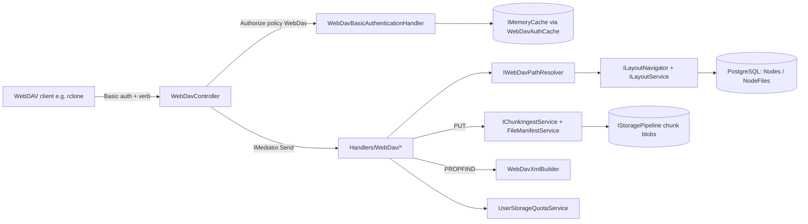
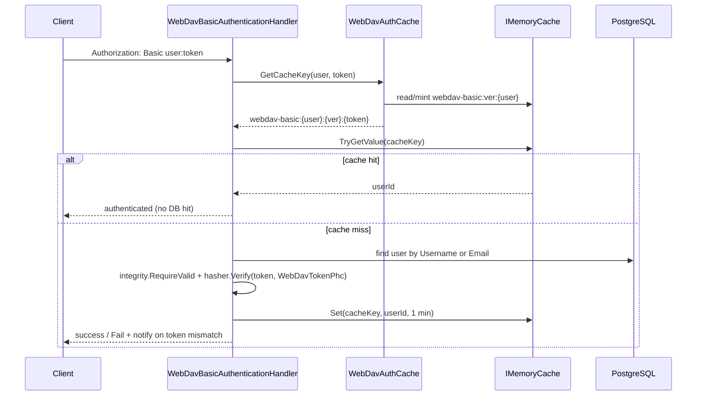
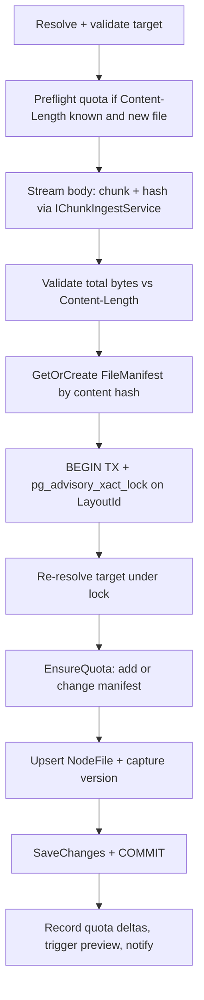

# 17. WebDAV Interface

Cotton exposes a WebDAV endpoint so that standard, protocol-level sync clients (rclone, phone auto-sync, Windows Explorer, macOS Finder) can read and write the same encrypted, content-addressed storage that the native web UI uses. The WebDAV surface is a thin protocol adapter: it maps WebDAV URLs onto a user's layout tree (the same `Node`/`NodeFile` graph used everywhere else), and PUT uploads flow straight into the chunk/manifest storage engine — there is no separate WebDAV-only storage path. This section documents the controller, the per-method handlers, Basic authentication, path resolution, the XML builder (including the quota PROPFIND properties), and the supported/unsupported semantics observed in code.

The implementation lives in `src/Cotton.Server/Controllers/WebDavController.cs`, `src/Cotton.Server/Handlers/WebDav/`, `src/Cotton.Server/Services/WebDav/`, and `src/Cotton.Server/Auth/WebDavBasicAuthenticationHandler.cs`. As the README frames it, WebDAV is positioned as a "compatibility bridge" / "compatibility path" rather than the long-term native protocol.

## Purpose & overview

WebDAV is mounted at `api/v1/webdav` (and `api/v1/webdav/{**path}`). The controller does not implement WebDAV protocol logic in one place; instead, each HTTP/WebDAV verb is translated into a CQRS request that is dispatched through `IMediator` (`EasyExtensions.Mediator`) to a dedicated handler in `Handlers/WebDav` (locking, PROPPATCH, LOCK/UNLOCK, OPTIONS, and the various header-parsing helpers stay in the controller). Authentication uses HTTP Basic, where the password is a dedicated, per-user **WebDAV token** (not, in general, the account password — see *Authentication*). Path strings in the URL are resolved to layout nodes/files by `IWebDavPathResolver`, which in turn delegates to the shared `ILayoutNavigator` and `ILayoutService` (see the *Layout & Topology* section). Uploads run through the same `IChunkIngestService` / `FileManifestService` ingest pipeline as the regular chunk upload API (see the *Chunk Storage & Ingest* and *File Manifests* sections), so dedup, encryption-at-rest, garbage-collection scheduling, versioning, and quota accounting all apply identically.



## Key components & responsibilities

| Component | File | Responsibility |
|---|---|---|
| `WebDavController` | `src/Cotton.Server/Controllers/WebDavController.cs` | Routing, verb dispatch, DAV response headers, in-process lock bookkeeping, header parsing (Depth/Destination/Overwrite/Timeout/Lock-Token/If). |
| `WebDavBasicAuthenticationHandler` | `src/Cotton.Server/Auth/WebDavBasicAuthenticationHandler.cs` | Custom ASP.NET Core `AuthenticationHandler<AuthenticationSchemeOptions>` implementing HTTP Basic against the per-user WebDAV token hash. |
| `WebDavAuthCache` | `src/Cotton.Server/Services/WebDav/WebDavAuthCache.cs` | Per-username cache-version + cache-key construction so token resets invalidate cached auth results. |
| `IWebDavPathResolver` / `WebDavPathResolver` | `src/Cotton.Server/Services/WebDav/IWebDavPathResolver.cs`, `WebDavPathResolver.cs` | Maps WebDAV path strings to `Node`/`NodeFile` (`ResolvePathAsync`, `ResolveMetadataAsync`, `GetParentNodeAsync`). |
| `WebDavXmlBuilder` + `WebDavResource`/`WebDavQuota` | `src/Cotton.Server/Services/WebDav/WebDavXmlBuilder.cs` | Builds `multistatus`, PROPPATCH OK, and lockdiscovery XML; emits quota PROPFIND properties. |
| `WebDavPropFindQuery(Handler)` | `src/Cotton.Server/Handlers/WebDav/WebDavPropFindQuery.cs` | PROPFIND: enumerates a resource (and children to a clamped depth) into a `multistatus`. |
| `WebDavGetFileQuery(Handler)` | `src/Cotton.Server/Handlers/WebDav/WebDavGetFileQuery.cs` | GET: opens a decrypting/reassembling blob stream from chunk storage. |
| `WebDavHeadQuery(Handler)` | `src/Cotton.Server/Handlers/WebDav/WebDavHeadQuery.cs` | HEAD: returns metadata only (no body). Also reused by PROPPATCH/LOCK existence checks. |
| `WebDavPutFileRequest(Handler)` | `src/Cotton.Server/Handlers/WebDav/WebDavPutFileRequest.cs` | PUT: streaming chunked upload + manifest dedup + quota + versioning + upsert. |
| `WebDavMkColRequest(Handler)` | `src/Cotton.Server/Handlers/WebDav/WebDavMkColRequest.cs` | MKCOL: creates a directory (`Node`). |
| `WebDavMoveRequest(Handler)` | `src/Cotton.Server/Handlers/WebDav/WebDavMoveRequest.cs` | MOVE: reparents/renames a node or file. |
| `WebDavCopyRequest(Handler)` | `src/Cotton.Server/Handlers/WebDav/WebDavCopyRequest.cs` | COPY: recursively copies node trees / files (reusing manifest references, no re-upload). |
| `WebDavDeleteRequest(Handler)` | `src/Cotton.Server/Handlers/WebDav/WebDavDeleteRequest.cs` | DELETE: delegates to the shared `DeleteNodeQuery` / `DeleteFileQuery`. |

DI registration is in `src/Cotton.Server/Extensions/ServiceCollectionExtensions.cs`. `IWebDavPathResolver → WebDavPathResolver` is registered as scoped (`AddScoped`). `AddWebDavAuth(...)` registers `WebDavAuthCache` as a **singleton**, adds the authentication scheme via `AddScheme<AuthenticationSchemeOptions, WebDavBasicAuthenticationHandler>(SchemeName, _ => { })`, and registers an authorization policy named `WebDav` that adds the `WebDavBasic` scheme and requires an authenticated user (`RequireAuthenticatedUser`). The mediator handlers are discovered/registered by the `EasyExtensions.Mediator` wiring used for all other handlers.

## Routing & verb dispatch

The controller is decorated with both `[Route("api/v1/webdav")]` and `[Route("api/v1/webdav/{**path}")]`. The catch-all `{**path}` route variable captures the full remaining URL (including embedded slashes) as the resource path; the empty-path route handles operations on the layout root. Every action takes a nullable `string? path` and treats a `null` path as `string.Empty` (the root collection).

Verbs are bound either with standard MVC attributes (`[HttpOptions]`, `[HttpGet]`, `[HttpHead]`, `[HttpPut]`, `[HttpDelete]`) or with `[AcceptVerbs("...")]` for the WebDAV-specific methods (`PROPFIND`, `PROPPATCH`, `LOCK`, `UNLOCK`, `MKCOL`, `MOVE`, `COPY`). `OPTIONS` is `[AllowAnonymous]`; every other action requires `[Authorize(Policy = WebDavBasicAuthenticationHandler.PolicyName)]` (the `WebDav` policy).

| WebDAV method | Action | Mediator request | Auth |
|---|---|---|---|
| OPTIONS | `HandleOptions` | — | Anonymous |
| PROPFIND | `HandlePropFindAsync` | `WebDavPropFindQuery` | WebDav policy |
| GET | `HandleGetAsync` | `WebDavGetFileQuery` | WebDav policy |
| HEAD | `HandleHeadAsync` | `WebDavHeadQuery` | WebDav policy |
| PUT | `HandlePutAsync` | `WebDavPutFileRequest` | WebDav policy |
| PROPPATCH | `HandlePropPatchAsync` | `WebDavHeadQuery` (existence) | WebDav policy |
| LOCK | `HandleLockAsync` | `WebDavHeadQuery` (existence) | WebDav policy |
| UNLOCK | `HandleUnlockAsync` | — (in-memory) | WebDav policy |
| DELETE | `HandleDeleteAsync` | `WebDavDeleteRequest` | WebDav policy |
| MKCOL | `HandleMkColAsync` | `WebDavMkColRequest` | WebDav policy |
| MOVE | `HandleMoveAsync` | `WebDavMoveRequest` | WebDav policy |
| COPY | `HandleCopyAsync` | `WebDavCopyRequest` | WebDav policy |

`AddDavHeaders(params string[] exclude)` is called on essentially every response to advertise compliance: it sets `DAV: 1, 2`, `MS-Author-Via: DAV`, and an `Allow` header built from the full method set (`OPTIONS, PROPFIND, PROPPATCH, GET, HEAD, PUT, DELETE, MKCOL, MOVE, COPY, LOCK, UNLOCK`) minus any excluded verbs. When a collection is targeted by GET/HEAD or by a PUT that resolves to an existing collection, the handler/controller returns `405 Method Not Allowed` and excludes `GET`, `HEAD`, `PUT` from `Allow`. The `OPTIONS` handler additionally sets a `Public` header listing `OPTIONS, PROPFIND, GET, HEAD, PUT, DELETE, MKCOL, MOVE, COPY, LOCK, UNLOCK` and forces an expired-lock sweep.

### Header parsing helpers

- `GetDepthHeader()` maps the `Depth` header to an integer: `0` → 0, `1` → 1, `infinity` → **25** (capped, not truly infinite), missing/whitespace/any other value → 1. Only the first comma-separated token is considered.
- `GetDestinationPath()` parses the `Destination` header for MOVE/COPY: it parses the value as a URI, takes `AbsolutePath` for an absolute URI (or `OriginalString` for a relative one), `Uri.UnescapeDataString`s it, then finds the `/api/v1/webdav` prefix anywhere in the string (case-insensitively, via `IndexOf`) and strips everything up to and including it, and finally trims path separators. Returns `null` if the header is absent.
- `GetOverwriteHeader()` returns `false` only when `Overwrite: F` is sent (case-insensitive); any other value (including absent) means overwrite is allowed (`true`). Note: this is the controller default. The underlying `WebDavMoveRequest`/`WebDavCopyRequest`/`WebDavPutFileRequest` records default `Overwrite` to a positional default (`false` for MOVE/COPY, `true` for PUT), but the controller always supplies an explicit value, so the record default is not exercised through the HTTP surface.

## Authentication

WebDAV does not use the JWT bearer flow of the rest of the API. Instead, `WebDavBasicAuthenticationHandler` (scheme name `WebDavBasic`, policy name `WebDav`) implements HTTP Basic. The handler's `HandleAuthenticateAsync` proceeds in stages:

1. **Header presence** (`TryGetBasicAuthHeaderFailure`): the `Authorization` header must be present and start with `Basic ` (case-insensitive). Absence or a non-`Basic` scheme yields `AuthenticateResult.NoResult()`. `HandleChallengeAsync` sets `WWW-Authenticate: Basic realm="Cotton WebDAV", charset="UTF-8"`.
2. **Credential parsing** (`ParseBasicCredentials` via `TryParseAndValidateCredentials`): base64-decodes the value, splits the decoded text on `\n`, takes the first line containing `:`, and splits into `username` / `token` on the **first** colon (`IndexOf(':')`; a leading colon, i.e. empty username, is rejected). A base64 decode failure → `AuthenticateResult.Fail`. Empty/whitespace username or token (after trimming the username) is rejected. The "username" may be either the account `Username` or `Email`.
3. **Cache fast-path** (`TryAuthenticateFromCache`): `WebDavAuthCache.GetCacheKey(username, token)` builds a key of the form `webdav-basic:{username}:{version}:{token}`. If `IMemoryCache` holds a non-empty `Guid` user id under that key, authentication succeeds immediately without hitting the database.
4. On a cache miss, the user is loaded by `Username` or `Email`. If not found → `AuthenticateResult.Fail`. Otherwise `IDatabaseIntegrityVerifier.RequireValid(dbContext, user, "webdav.auth")` is invoked — WebDAV auth participates in the same database-integrity gate as the rest of the system (see the *Database Integrity* section).
5. **Token verification** (`VerifyTokenOrFailAsync`): the stored hash `User.WebDavTokenPhc` (a PHC string) must be present (a missing/empty hash fails) and must verify against the supplied token via `IPasswordHashService.Verify`. On success the user id is cached under the cache key for **1 minute** (`CacheTtl = TimeSpan.FromMinutes(1)`).
6. On a verify failure, a `Failed login attempt` notification is sent best-effort (the call is wrapped in try/catch; failures are logged, not propagated) via the `INotificationsProvider.SendFailedLoginAttemptAsync` extension (`src/Cotton.Server/Extensions/NotificationsProviderExtensions.cs`) with geo lookup, and `AuthenticateResult.Fail` is returned.

On success a `ClaimsPrincipal` is built (`ClaimTypes.NameIdentifier` + `sub` = user id, `ClaimTypes.Name` = username) under the `WebDavBasic` identity, and `User.GetUserId()` in the controller reads it back.

### WebDAV token lifecycle and cache invalidation

The token is minted by `AuthController.GetWebDavToken` (`GET /api/v1/auth/webdav/token`, `[Authorize]` — i.e. it requires an already-authenticated session): it runs `IDatabaseIntegrityVerifier.RequireValid(..., "auth.webdav-token")`, generates a random string of length `WebDavTokenLength = 32` (`StringHelpers.CreateRandomString(32)`), stores `WebDavTokenPhc = _hasher.Hash(token)`, saves, calls `_webDavAuthCache.BumpUsernameCacheVersion(user.Username)`, sends a token-reset notification (`SendWebDavTokenResetAsync`), and returns the plaintext token once (`Ok(token)`). The plaintext is never stored.

`WebDavTokenPhc` is also initialized at account creation, but **what it holds depends on the creation path**:

| Creation path | File | `WebDavTokenPhc` initial value | Can the password be used as a WebDAV token? |
|---|---|---|---|
| Public/demo guest self-registration | `AuthController` (`Constants.IsPublicInstance` branch) | `_hasher.Hash(request.Password)` | Yes, until a dedicated token is generated |
| Initial bootstrap admin (first user) | `AuthController` | `_hasher.Hash(request.Password)` | Yes, until a dedicated token is generated |
| Admin-created user | `src/Cotton.Server/Handlers/Users/AdminCreateUserRequest.cs` | `_hasher.Hash(StringHelpers.CreateRandomString(32))` | **No** — the random seed is never returned, so the user must mint a token first |

So the common "use your password for WebDAV until you generate a token" shortcut applies only to self-registration and the bootstrap admin; admin-provisioned users must call the token endpoint before WebDAV will authenticate.

`WebDavAuthCache` implements cache busting through a per-username **version** stored under `webdav-basic:ver:{username}` (also a 1-minute TTL). `GetCacheKey` reads the current version via `GetOrBumpUsernameCacheVersion` (which mints one if none is cached); `BumpUsernameCacheVersion` writes a fresh `Guid` (`"N"` format) version. Because the version is embedded in every credential cache key, bumping it makes all previously cached `(username, token)` keys unreachable, so a token reset is effective immediately. Even without an explicit bump, every cache entry (credential and version alike) is bounded by the 1-minute TTL, so a reset becomes effective within at most that window.



### Public-instance IP handling

`GetRequestIpAddress()` returns `IPAddress.Loopback` when `Constants.IsPublicInstance` is true (controlled by the env var `COTTON_PUBLIC_INSTANCE`, parsed as a boolean by `Constants.IsPublicInstance`), otherwise `Request.GetRemoteIPAddress()`. This is used only in the failed-login notification path, masking the caller's IP on public/demo deployments.

## Path resolution

`WebDavPathResolver` (registered behind `IWebDavPathResolver`) translates URL paths into the layout tree. Key constants: `DefaultNodeType = NodeType.Default` (WebDAV operates only on the default layout, not on special node types) and `PathSeparator = Constants.DefaultPathSeparator` (`'/'`). It depends on `CottonDbContext`, `ILayoutService` (`_layouts`), and `ILayoutNavigator` (`_navigator`). Three operations are exposed:

- **`ResolvePathAsync`** — full resolve **including the file content graph** (`Include` of `Node`, `FileManifest`, `FileManifestChunks`, `Chunk`). Used by GET, which needs chunk hashes to stream content.
- **`ResolveMetadataAsync`** — same resolution but `AsNoTracking()` and only including `FileManifest` (no chunk graph). Used by PROPFIND, HEAD, DELETE, MOVE, COPY, and PUT pre-checks, where only metadata is required. This split avoids loading the heavy chunk graph for metadata-only operations.
- **`GetParentNodeAsync`** — resolves the parent node plus the trailing `ResourceName` segment, for creating new resources (PUT/MKCOL/MOVE/COPY destinations). It `Uri.UnescapeDataString`s the whole path first (explicitly to let Windows clients send names with reserved characters such as `#`/`%`, sent as `%23`/`%25`), then delegates to `ILayoutNavigator.ResolveParentAndNameAsync`.

Resolution mechanics in `ResolveInternalAsync`: the path is normalized (`\` → `/`, trimmed of separators). An empty path resolves to the layout root via `ILayoutNavigator.GetLayoutAndRootAsync(userId, NodeType.Default, ct)` and is reported as a collection. Otherwise the path is split on `/` (each segment `Uri.UnescapeDataString`'d, with malformed escapes tolerated as literals by `SafeUnescapePathSegment`), the parent prefix is resolved through `ILayoutNavigator.ResolveNodeByPathAsync`, and the **last** segment is matched first as a child `Node` (a directory), then as a `NodeFile`. The child-node lookup is scoped by `LayoutId`, `ParentId`, `OwnerId`, `NameKey == NormalizeAndGetNameKey(lastName)`, and `Type == NodeType.Default`; the file lookup is scoped by `NodeId`, `OwnerId`, and `NameKey`. If neither matches, `Found = false`.

The resolver always fetches `_layouts.GetOrCreateLatestUserLayoutAsync(userId)` (on `ILayoutService`) — i.e. the user's current/latest layout — and every query is owner-scoped, so a user only ever sees their own tree.

`WebDavResolveResult` carries `Found`, `IsCollection`, and either `Node` or `NodeFile`. `WebDavParentResult` carries `Found`, `ParentNode`, and `ResourceName`.

## How each method works

### PROPFIND

`HandlePropFindAsync` reads the `Depth` header, builds an `hrefBase` from `Url.Content("~/api/v1/webdav/")`, and dispatches `WebDavPropFindQuery(userId, path, hrefBase, depth)`. The handler (`WebDavPropFindQueryHandler`):

1. `ResolveMetadataAsync` the target; if not found, returns `Found = false` and the controller responds `404`.
2. Computes a `WebDavQuota` once via `UserStorageQuotaService.GetSnapshotAsync` (see *WebDAV XML & quota properties* below).
3. If the target is a collection, it emits the collection itself, then (if `depth > 0`) recursively walks children via `AddChildResourcesAsync`. Child **nodes** are queried scoped to `ParentId`, `Type == NodeType.Default`, `OwnerId`, and `LayoutId`, ordered by `NameKey`; child **files** `Include` `FileManifest`, are scoped to `NodeId` and `OwnerId` (note: not `LayoutId`), and are ordered by `NameKey`. Recursion continues while `currentDepth < maxDepth`.
4. If the target is a file, it emits a single file response (the parent node is looked up to reconstruct the href path).
5. The list of `WebDavResource` is serialized by `WebDavXmlBuilder.BuildMultiStatusResponse` and returned as `207 Multi-Status` with content type `application/xml; charset="utf-8"`.

Depth handling has two independent caps: the controller maps `infinity` to **25**, and the handler additionally `Math.Clamp(depth, 0, MaxDepth)` where `MaxDepth = 32`. The effective ceiling for an `infinity` PROPFIND is therefore 25 levels. Hrefs are built with each path segment `Uri.EscapeDataString`'d; collection hrefs get a trailing slash via `EnsureTrailingSlash`. `BuildNodePathAsync` walks parents to the root (excluding the root node, which has `ParentId == null`) using an in-request `Dictionary<Guid, Node>` cache to avoid repeated lookups.

ETags: collections use `"{Node.Id}"`; files use `"{NodeFile.Id}:{NodeFile.FileManifestId}"`, so the ETag changes whenever the file's manifest (content) changes.

### GET

`WebDavGetFileQueryHandler` resolves with `ResolvePathAsync` (full graph). A collection target returns `IsCollection = true` and the controller responds `405` (excluding GET/HEAD/PUT from `Allow`). For a file, `FileGraphIntegrityVerifier.RequireValidContent(dbContext, nodeFile, "webdav.get")` gates content access (see the *Database Integrity* section). The handler orders `FileManifestChunks` by `ChunkOrder`, converts each `ChunkHash` to a lowercase hex string (`Convert.ToHexString(...).ToLowerInvariant()`), builds a `PipelineContext` (`FileSizeBytes = manifest.SizeBytes`, `ChunkLengths` from `GetChunkLengths()`), and obtains a reassembled/decrypted stream from `IStoragePipeline.GetBlobStream(chunkHashes, context)` — the **same storage pipeline used by the rest of the system** (see the *Storage Pipeline* and *Cryptography Engine* sections).

The controller returns the stream via `File(...)` with `enableRangeProcessing: true` (range requests supported), `Content-Encoding: identity`, and `Cache-Control: private, no-store, no-transform`. An ETag is mandatory here (the controller throws `InvalidOperationException` if `result.ETag` is null) and `LastModified` is set from `NodeFile.UpdatedAt`.

### HEAD

`WebDavHeadQueryHandler` resolves via `ResolveMetadataAsync`. Collections report `Content-Type: httpd/unix-directory` and `Content-Length: 0`; files report the manifest `ContentType`, `SizeBytes`, `UpdatedAt`-based `LastModified`, and the same `"{id}:{manifestId}"` ETag. The controller also sets `Accept-Ranges: bytes`, `Content-Encoding: identity`, and `Cache-Control: private, no-store, no-transform` for files. A collection target returns `405`. `WebDavHeadQuery` is also reused by PROPPATCH and LOCK purely as an existence/metadata probe.

### PUT (upload)

PUT is the most involved handler. The controller action is `[DisableRequestSizeLimit]`, first enforces the in-process lock guard (`IsLockSatisfied`, see *Locking*), then passes `Request.Body` as the upload stream along with `Content-Type`, the parsed `Overwrite` flag, and `Content-Length` into `WebDavPutFileRequest`. Control flow in `WebDavPutFileRequestHandler.Handle`:



Detailed behavior:

- **Target validation** (`TryResolveAndValidateTargetAsync`): resolves both the existing resource (`ResolveMetadataAsync`) and the parent (`GetParentNodeAsync`). Fails with `IsCollection` if the path is an existing collection, `ParentNotFound` if the parent is missing, `InvalidName` if `NameValidator.TryNormalizeAndValidate` rejects the name, `Conflict` if a folder already exists with the same `NameKey` under the parent (scoped to `ParentId`/`OwnerId`/`LayoutId`/`Type == Default`), and `PreconditionFailed` if a file exists and `Overwrite` is false.
- **Quota preflight** (`TryPreflightKnownLengthQuotaAsync`): only for **new** files (existing not found) with a known non-negative `Content-Length`; calls `UserStorageQuotaService.EnsureCanAddKnownFileSizeAsync`, mapping `BadRequestException<User>` to `QuotaExceeded`.
- **Streaming chunking** (`ProcessStreamInChunksAndHashAsync`): reads the body in `MaxChunkSizeBytes` slices (server setting; default **4 MiB**, allowed 4/8/16 MiB) using a pooled buffer (`ArrayPool<byte>.Shared.Rent`), computes a running whole-file hash with `IncrementalHash` over `Hasher.SupportedHashAlgorithmName` (SHA-256), and ingests each slice via `IChunkIngestService.UpsertChunkAsync` — the identical chunk-ingest path as the native upload API. A `StoragePressureException` (free space below the configured reserve) is mapped to `StoragePressure` → HTTP 507.
- **Length / abort checks** (`TryReadAndValidateContentAsync`): the chunk `PlainSizeBytes` are summed. If `Content-Length > 0` and the streamed total is `0` or does not match exactly, the upload is treated as truncated/aborted (`UploadAborted` → 408). A zero-byte body with `Content-Length: 0` is allowed and produces a single empty chunk (`UpsertChunkAsync(userId, [], 0)`) with `Hasher.HashData([])` as the file hash; a zero-byte body with a non-zero or absent `Content-Length` is treated as aborted.
- **Content type** is resolved via `FileManifestService.ResolveContentType(resourceName, request.ContentType)` (extension/declared-type reconciliation), not taken verbatim from the request.
- **Manifest dedup** (`GetOrCreateFileManifestAsync`): looks up an existing `FileManifest` whose `ProposedContentHash` **or** `ComputedContentHash` equals the upload hash. If found, GC schedules for that manifest's references are cleared (`FileManifestService.ClearGcSchedulesForManifestReferencesAsync`); otherwise a new manifest is created via `FileManifestService.CreateNewFileManifestAsync`. Identical content is thus never stored twice.
- **Per-layout serialization**: the final insert/update phase opens an EF transaction and acquires `LayoutLocks.AcquireForLayoutAsync` (a PostgreSQL `pg_advisory_xact_lock` keyed by a bigint collapsed from `LayoutId`). After the lock, the target is **re-resolved** because a long upload stream may have raced with other writers; if the parent's `LayoutId` changed, it fails with `ParentNotFound`.
- **Quota commit** (`TryEnsureQuotaAsync`): for an overwrite of an existing file, `EnsureCanChangeFileManifestAsync`; for a new file, `EnsureCanAddFileReferenceAsync`. Either returning `BadRequestException<User>` maps to `QuotaExceeded` (507).
- **Upsert + versioning** (`UpsertNodeFileAsync`): for an overwrite where the previous manifest's `SizeBytes != 0`, `FileVersionService.CaptureAndUpdateManifestAsync` captures a prior version (returning a `FileVersionCaptureResult` with `RemovedBytes`) before re-pointing `FileManifestId`; overwriting an empty (0-byte) placeholder just re-points `FileManifestId` without versioning (`FileVersionCaptureResult.Empty`). New files create a `NodeFile`, `SetName(...)`, save, then set `OriginalNodeFileId = Id`.
- **Post-commit**: `UserStorageQuotaService.RecordLogicalBytesAdded` (and `RecordLogicalBytesRemoved` when `capture.RemovedBytes > 0`) update the cached usage; a `GeneratePreviewJob` is triggered via Quartz (`_scheduler.TriggerJobAsync<GeneratePreviewJob>()`); and a created/updated SignalR event is emitted (`IEventNotificationService.NotifyFileCreatedAsync` / `NotifyFileUpdatedAsync`). The controller responds `201 Created` for a new resource or `204 No Content` for an overwrite.

### MKCOL

`WebDavMkColRequestHandler` resolves and validates the parent and name, then opens a transaction and takes the layout advisory lock. Inside the lock it re-validates the parent (failing `ParentNotFound` if the layout shifted), checks for an existing path (`AlreadyExists` → 405) or a same-named file under the parent (`Conflict`, scoped to `NodeId`/`OwnerId`/`NameKey`), then creates a `Node` of `Type == NodeType.Default` under the parent (`SetParent` + `SetName`) and emits `NotifyNodeCreatedAsync`. Success returns `201 Created`. The handler does not read or interpret any request body, so MKCOL with a body is not handled specially.

### MOVE

`WebDavMoveRequest(UserId, SourcePath, DestinationPath, Overwrite)` is a rename/reparent. The controller enforces the lock guard, then requires a `Destination` header (otherwise `400`). Flow:

1. Pre-lock (`ResolvePreLockSourceAsync`): resolve+validate the source (`SourceNotFound`; moving the root collection — a collection whose `Node.ParentId is null` — → `CannotMoveRoot`), and determine the source's `LayoutId`.
2. Open transaction, acquire the layout advisory lock, then **re-resolve** source and destination parent under the lock (`PrepareLockedMoveAsync`); if the source's layout no longer matches the locked layout → `SourceNotFound`, and if the destination parent's layout differs → `DestinationParentNotFound`. An invalid destination name causes `GetAndValidateDestinationParentAsync` to return the parent as `Found = false`, which surfaces as `DestinationParentNotFound`.
3. Overwrite handling (`HandleDestinationOverwriteAsync`): if the destination exists and `Overwrite` is false → `DestinationExists` (412). If it exists and overwrite is allowed, the existing destination is deleted first via the shared `DeleteNodeQuery`/`DeleteFileQuery` (`skipTrash: false`).
4. Cycle guard (collections only): moving a collection into its own descendant → `CannotMoveIntoDescendant`. `IsDescendantAsync` walks up the parent chain from the destination parent, with `MaxDepth = 256`; reaching that depth (or finding the source id) is treated as a descendant/cycle.
5. The move re-parents the tracked `Node` (`SetParent` + `SetName`) or `NodeFile` (set `NodeId` + `SetName`), saves, commits, and emits a best-effort node/file-moved SignalR event (`NotifyNodeMovedAsync` / `NotifyFileMovedAsync`; failures after commit are logged, never failing the response). Returns `201` (created at destination) or `204`.

MOVE does not touch quota (it relocates existing references rather than adding bytes).

### COPY

`WebDavCopyRequestHandler` mirrors MOVE's locking/validation structure but **duplicates** rather than relocates. `PerformCopyAsync` handles two cases:

- **File**: `EnsureCanAddFileReferenceAsync` (quota), then a new `NodeFile` is created pointing at the **same `FileManifestId`** — no content is re-uploaded or re-chunked; only a new logical reference is created. `OriginalNodeFileId` is set to the new id.
- **Collection**: `CopyNodeRecursivelyAsync` deep-copies the subtree, creating new `Node`s (preserving the source node's `Type`) and `NodeFile`s; each copied file calls `EnsureCanAddFileReferenceAsync` and reuses the source's `FileManifestId`. Recursion is bounded by the tree itself (no explicit depth cap in the copy walk).

Quota overage anywhere in the copy raises `BadRequestException<User>`, which `TryPerformCopyAsync` catches and maps to `QuotaExceeded` (507). Copying the root collection is rejected (`CannotCopyRoot` → 403). On success, `RecordLogicalBytesAdded` updates cached usage with the accumulated added bytes, a created event is emitted (`NotifyNodeCreatedAsync` for collections, `NotifyFileCreatedAsync` for files), and the controller returns `201`/`204`. Overwrite handling is identical to MOVE (delete-then-create when allowed; `DestinationExists`/412 otherwise).

### DELETE

`WebDavDeleteRequestHandler` resolves via `ResolveMetadataAsync`. Not found → `NotFound = true` → controller `404`. Deleting the root collection (a collection node with `ParentId is null`) is refused (`Success = false`, not `NotFound`) → controller `Forbid()` (403). Otherwise it loads the tracked entity and delegates to the shared `DeleteNodeQuery` / `DeleteFileQuery` (with `SkipTrash` defaulting to `false`, so deletions go to trash). It emits the corresponding `NotifyNodeDeletedAsync(userId, nodeId, originalParentId)` / `NotifyFileDeletedAsync(userId, nodeFileId, originalNodeId)` SignalR event and returns `204`. The controller also enforces the lock guard before dispatching. Because deletion reuses the standard handlers, WebDAV deletes are subject to the same trash/garbage-collection semantics as web-UI deletes (see the *Trash & Garbage Collection* section).

## WebDAV XML & quota properties

`WebDavXmlBuilder` is a static builder using `System.Xml.XmlWriter` under the `DAV:` namespace (prefix `d`). It deliberately sets `OmitXmlDeclaration = true` because, per an inline comment, the "Windows WebDAV client doesn't like encoding declaration." It produces three document shapes:

- `BuildMultiStatusResponse` — `<d:multistatus>` containing one `<d:response>` per `WebDavResource`. Each emits (inside `<d:propstat><d:prop>`): `displayname`, `resourcetype` (`<d:collection/>` for collections), `getcontentlength`, `getlastmodified` (RFC 1123 "R" format), `getetag`, optional quota properties, and `getcontenttype` for files; the `<d:href>` is written as a sibling of `propstat`. Each `propstat` carries a `<d:status>` of `HTTP/1.1 200 OK`.
- `BuildPropPatchOkResponse` — a minimal `207` body reporting `HTTP/1.1 200 OK` for a PROPPATCH that is **not actually applied** (see *PROPPATCH*).
- `BuildLockDiscoveryResponse` — a `<d:prop><d:lockdiscovery><d:activelock>` describing an exclusive write lock with `<d:depth>Infinity</d:depth>`, the requested `Second-N` timeout, and the lock token as a `<d:locktoken><d:href>`.

The quota properties are emitted by `WriteResourceResponse` only when `resource.Quota` is non-null. `quota-used-bytes` is **always** written in that case; `quota-available-bytes` is written **only when `AvailableBytes` is non-null**:

```xml
<d:quota-used-bytes>123456789</d:quota-used-bytes>
<d:quota-available-bytes>9876543210</d:quota-available-bytes>
```

The values come from `UserStorageQuotaService.GetSnapshotAsync` (mapped into `WebDavQuota(UsedBytes, AvailableBytes)` in `WebDavPropFindQueryHandler.GetQuotaPropertiesAsync`). `UsedBytes` is the user's cached logical usage (`GetUsedBytesAsync`; the underlying value is cached for `UsedBytesCacheDuration = 15 minutes`). `AvailableBytes` is non-null only when the instance has a configured per-user quota (`CottonServerSettings.DefaultUserStorageQuotaBytes` is non-null), computed as `Math.Max(0, quota - used)`; when there is no quota, `AvailableBytes` is `null` and `quota-available-bytes` is omitted entirely. A `WebDavQuota` doc comment makes the intent explicit: without a quota, Cotton does not pretend to know backend free space. This matches the README claim that PROPFIND exposes these properties for clients like rclone, and reflects the **logical** quota service rather than filesystem capacity. (`WebDavXmlBuilderTests` asserts exactly this: `quota-available-bytes` present when a quota exists, `null`/omitted otherwise.)

Importantly, the quota object is only attached to the **top-level** resource in a PROPFIND (the directly-requested node/file). Child resources added by `AddChildResourcesAsync` are constructed without a `Quota`, so quota properties appear once per PROPFIND, on the requested resource.

## Locking (LOCK / UNLOCK)

`DAV: 1, 2` is advertised, so Class-2 locking is claimed, but the implementation is a lightweight, **in-process, advisory** lock store — not durable and not cluster-aware:

- Locks live in a `static ConcurrentDictionary<string, WebDavLock>` on the controller, keyed by `"{userId:N}:{path}"`. A `WebDavLock` record holds the user id, normalized (separator-trimmed) path, opaque token, and expiry (`ExpiresAt`).
- `LOCK` parses the `Timeout` header (`Second-N`, default 1 hour), mints a token `opaquelocktoken:{Guid:D}`, stores the lock, returns `Lock-Token: <token>` and `Timeout: Second-N` headers plus a `lockdiscovery` XML body. A lock on a non-existent path ("lock-null resource", common from Windows) returns `201 Created`; otherwise `200 OK`.
- `UNLOCK` removes the lock if a `Lock-Token` header is present and matches the stored token (ordinal compare); it always returns `204 No Content`.
- Write methods (PUT, DELETE, MKCOL, MOVE, COPY) call `IsLockSatisfied(userId, path)`, which checks the exact path and **all ancestor paths** (down to the empty root) for a lock owned by the same user. If a lock is found, the request must supply the matching token via a `Lock-Token` header or an `If` header (parsed by the minimal `ExtractLockToken`, which finds the first `<opaquelocktoken:...>`). If a lock exists and the token does not match (or is absent), the controller returns `423 Locked`.
- Expired locks are swept lazily by `CleanupExpiredLocksIfNeeded` (at most every 30 seconds, or `force: true` on OPTIONS), using interlocked timestamp bookkeeping.

Because locks are static and per-process, they are **not shared across instances** and are lost on restart. They guard only within a single server process and only between requests of the same user.

## PROPPATCH

`HandlePropPatchAsync` exists to satisfy clients (notably Windows) that issue PROPPATCH to set timestamps/attributes. It checks the resource exists (via `WebDavHeadQuery`, else `404`) and returns a `207` with a blanket `HTTP/1.1 200 OK` propstat (`BuildPropPatchOkResponse`) over an empty `<d:prop>` — but **no property is actually persisted**. PROPPATCH is effectively a no-op acknowledgement; custom dead properties and modified timestamps are not stored.

## Important data structures, types & configuration

| Identifier | Where | Notes |
|---|---|---|
| Route prefix | `WebDavController` | `api/v1/webdav` and `api/v1/webdav/{**path}` |
| Scheme / policy | `WebDavBasicAuthenticationHandler` | `SchemeName = "WebDavBasic"`, `PolicyName = "WebDav"` |
| `WebDavTokenLength` | `AuthController` | 32-char random WebDAV token (`StringHelpers.CreateRandomString(32)`) |
| Auth cache TTL (`CacheTtl`) | `WebDavBasicAuthenticationHandler` / `WebDavAuthCache` | 1 minute (both credential keys and version keys) |
| `MaxChunkSizeBytes` | `CottonServerSettings` / `SettingsProvider` / `SettingsController` | PUT slice size; default 4 MiB (`defaultMaxChunkSizeBytes`), allowed 4/8/16 MiB (`SupportedMaxChunkSizeBytes`) |
| `DefaultUserStorageQuotaBytes` | `CottonServerSettings` | `long?`; drives `quota-available-bytes`; null disables it |
| `DefaultNodeType` | `WebDavPathResolver` | `NodeType.Default` (WebDAV only sees the default layout) |
| `PathSeparator` | `WebDavPathResolver` | `'/'` (`Constants.DefaultPathSeparator`) |
| `MaxDepth` (PROPFIND) | `WebDavPropFindQueryHandler` | 32; `infinity` capped to 25 by the controller |
| `MaxDepth` (descendant walk) | `WebDavMoveRequestHandler.IsDescendantAsync` | 256 |
| `UsedBytesCacheDuration` | `UserStorageQuotaService` | 15 minutes |
| `COTTON_PUBLIC_INSTANCE` | `Constants` (`PublicInstanceEnvironmentVariable`) | When true, masks remote IP in WebDAV failure notifications |

Error enums per command: `WebDavPutFileError`, `WebDavMkColError`, `WebDavMoveError`, `WebDavCopyError` (mapped to HTTP status codes by the controller switch expressions). DELETE has no error enum; it uses `WebDavDeleteResult(Success, NotFound, ...)`.

### Status code mapping (selected)

| Condition | HTTP |
|---|---|
| PROPFIND / DELETE / MOVE source not found | 404 |
| GET/HEAD on a collection, or PUT to an existing collection | 405 |
| PUT parent missing | 409 Conflict |
| PUT folder conflict (same-name folder exists) | 409 Conflict |
| MKCOL parent missing / file conflict | 409 Conflict |
| MKCOL already exists | 405 |
| PUT / MKCOL / MOVE / COPY invalid name | 400 |
| PUT exists + `Overwrite: F` | 412 |
| PUT length mismatch / abort | 408 |
| PUT / COPY quota exceeded | 507 |
| PUT storage pressure | 507 |
| MOVE / COPY destination exists + no overwrite | 412 |
| MOVE / COPY missing `Destination` header | 400 |
| MOVE root / COPY root / DELETE root | 403 |
| Locked resource without matching token | 423 |
| Created vs overwritten | 201 vs 204 |

## Concurrency, failure modes & security considerations

- **Per-layout serialization**: all namespace-mutating WebDAV operations (PUT, MKCOL, MOVE, COPY) take a PostgreSQL transaction-scoped advisory lock keyed by `LayoutId` (`LayoutLocks.AcquireForLayoutAsync` → `pg_advisory_xact_lock`) and re-resolve their targets after acquiring it, defending against TOCTOU races where a long-running upload or a concurrent web-UI mutation changes the tree. The lock auto-releases on COMMIT/ROLLBACK.
- **Streaming uploads**: PUT never buffers the whole file; it streams into chunk storage with a rented `ArrayPool<byte>` buffer of `MaxChunkSizeBytes`, so peak per-request memory is bounded regardless of file size. This matches the README's "WebDAV PUT streams directly into chunk storage without full buffering."
- **No resumable uploads**: a WebDAV PUT is a single long-lived request. There is no chunk-protocol resume; a dropped connection that yields a byte count not matching a positive `Content-Length` is rejected as `UploadAborted` (408). This is the README-acknowledged narrower retry behavior versus the native resumable chunk protocol.
- **Quota correctness**: quota is checked before commit (preflight for known lengths on new files, hard check inside the lock) and the in-memory usage cache is corrected post-commit; because the used-bytes value is cached for 15 minutes, `quota-used-bytes` in PROPFIND can momentarily lag concurrent changes from other sessions.
- **Integrity gates**: WebDAV auth (`"webdav.auth"`) invokes `IDatabaseIntegrityVerifier.RequireValid` and WebDAV GET (`"webdav.get"`) invokes `FileGraphIntegrityVerifier.RequireValidContent`; a failing integrity check blocks WebDAV the same way it blocks other surfaces.
- **Brute-force signal**: failed token verifications generate failed-login notifications (with geo lookup), but the controller does not apply a dedicated rate-limit policy on the WebDAV routes — the named auth rate-limit policies in `src/Cotton.Server/Auth/AuthRateLimitPolicies.cs` (`auth.interactive`, `auth.refresh`) are applied to the interactive auth endpoints, not WebDAV.
- **Token storage**: only the PHC hash (`WebDavTokenPhc`) is stored; the plaintext token is shown once at generation. Resets are effective immediately via the cache-version bump and, regardless, within at most the 1-minute cache TTL.
- **Locks are best-effort**: in-process, non-persistent, single-instance only — do not rely on them for cross-node mutual exclusion.

## Non-obvious design decisions & gotchas

- **`infinity` PROPFIND is capped to 25 levels** (controller) and the handler clamps to 32 — deep trees are not fully enumerated by a single `Depth: infinity` request.
- **Quota appears once per PROPFIND**, only on the top-level requested resource, never on children.
- **`quota-available-bytes` is intentionally omitted when no quota is configured** rather than reported as filesystem free space.
- **PROPPATCH is a no-op** that always reports success; clients that depend on persisting timestamps/attributes will silently see no effect.
- **MOVE/COPY overwrite deletes the destination first** through the standard delete handlers (`skipTrash: false`, so the overwritten destination lands in trash), rather than performing an in-place replace.
- **COPY of files reuses the existing manifest** (a pure logical reference + quota accounting), so copying a 10 GB file is cheap in storage but still counts against the logical quota.
- **Empty-file handling** is explicit: a 0-byte PUT with `Content-Length: 0` creates a single empty chunk; overwriting an empty placeholder skips versioning.
- **The XML omits the XML declaration on purpose** for Windows client compatibility.
- **Names are matched by `NameKey`** (normalized via `NameValidator.NormalizeAndGetNameKey`), so the case/normalization rules from `NameValidator` apply to WebDAV path resolution exactly as in the rest of the system.
- **Admin-created users cannot use their password for WebDAV** — only self-registered and bootstrap-admin accounts seed `WebDavTokenPhc` from the password; an admin-provisioned account must mint a token via `GET /api/v1/auth/webdav/token` first.

## Related sections

See the *Chunk Storage & Ingest*, *File Manifests*, *Storage Pipeline*, and *Cryptography Engine* sections for how PUT/GET reuse the content-addressed engine; the *Layout & Topology* section for `ILayoutNavigator`/`ILayoutService` path resolution and `NodeType`; the *Storage Quotas* section for `UserStorageQuotaService`; the *Trash & Garbage Collection* section for delete/version semantics; the *Database Integrity* section for the `RequireValid`/`RequireValidContent` gates; the *Authentication* section for the WebDAV token endpoint and notifications; and the *Real-time Events* section for the SignalR notifications emitted by the WebDAV handlers.
