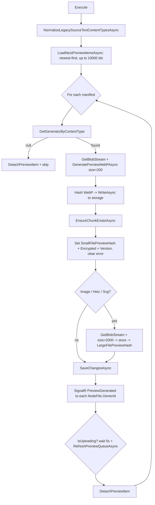
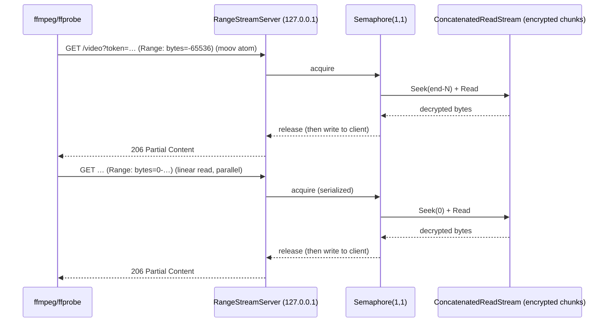
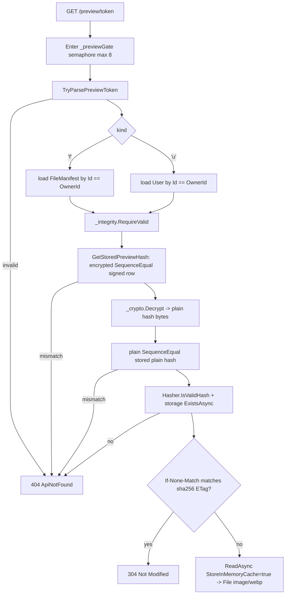
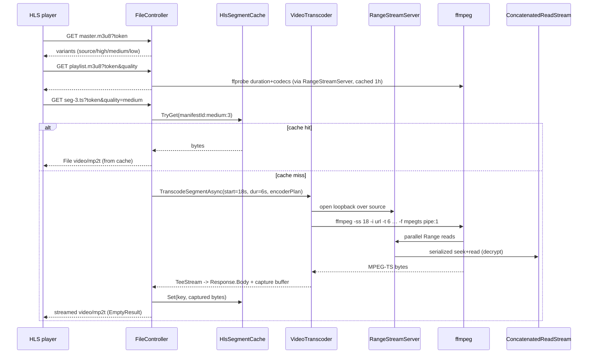

# 18. Previews & Media Processing

Cotton's preview/media subsystem turns arbitrary uploaded content into small, cacheable WebP thumbnails and, for video, into adaptive HLS playback — all while the underlying bytes remain chunked, compressed, and AES-GCM-encrypted in content-addressed storage. It is split across two assemblies: `Cotton.Previews` (a server-agnostic library of preview generators plus a local HTTP "range shim" for FFmpeg), and the server side in `Cotton.Server` (the `PreviewController`, the scheduled `GeneratePreviewJob`, and the on-the-fly HLS transcoding endpoints on `FileController`). This section documents both halves and the data flow between them.

The two design constraints that shape everything here are: (1) preview *bytes* live in the same deduplicated, content-addressed store as file content, so previews are themselves chunks that the garbage collector must protect; and (2) the original media never exists as a plaintext temp file — generators read it through a seekable in-memory/over-HTTP stream so that even multi-gigabyte videos can be previewed and transcoded without reassembly. For how the underlying seekable stream is assembled, see the *Storage Pipeline* and *Cryptography Engine* sections.

## Purpose & overview

Two distinct outputs are produced from uploaded content:

- **Thumbnail previews** — square WebP images at two sizes (small/large), generated asynchronously by a background job (`GeneratePreviewJob`) and served by `PreviewController`. Used for grid icons, the media lightbox, audio cover art, document thumbnails, and 3D-model thumbnails.
- **Adaptive video playback** — HLS (HTTP Live Streaming) master/media playlists and on-demand transcoded MPEG-TS segments, served by `FileController`, for video formats a browser cannot play natively.

The thumbnail pipeline is "managed-first": image, SVG, HEIC, PDF, and text previews run entirely inside .NET via SixLabors.ImageSharp, SkiaSharp/Svg.Skia, libheif (via LibHeifSharp), and Docnet (a MuPDF wrapper). Only three media categories shell out to external native tools: audio/video previews and HLS use **ffmpeg/ffprobe** (via the `Xabe.FFmpeg` / `Xabe.FFmpeg.Downloader` v6.0.2 packages for resolution/auto-download), and 3D-model thumbnails use **f3d** (optionally under **Xvfb** for headless rendering).

## Key components & responsibilities

### Cotton.Previews library

| Component | File | Responsibility |
|---|---|---|
| `IPreviewGenerator` | `src/Cotton.Previews/IPreviewGenerator.cs` | Contract: `int Version`, `IEnumerable<string> SupportedContentTypes`, `Task<byte[]> GeneratePreviewWebPAsync(Stream, int size)`. |
| `PreviewGeneratorProvider` | `src/Cotton.Previews/PreviewGeneratorProvider.cs` | Static registry; maps MIME type → generator; exposes size/version constants. |
| `ImagePreviewGenerator` | `src/Cotton.Previews/ImagePreviewGenerator.cs` | Raster images via ImageSharp; auto-orient, resize, WebP encode. |
| `SvgPreviewGenerator` | `src/Cotton.Previews/SvgPreviewGenerator.cs` | SVG (incl. gzip-compressed `.svgz`) via SkiaSharp/Svg.Skia. |
| `HeicPreviewGenerator` | `src/Cotton.Previews/HeicPreviewGenerator.cs` | HEIC/HEIF decoded via LibHeifSharp (libheif) into an ImageSharp image, encoded through the shared `PreviewImageEncoder`. |
| `TextPreviewGenerator` | `src/Cotton.Previews/TextPreviewGenerator.cs` | Text/code rendered to a canvas with an embedded Consolas font. |
| `PdfPreviewGenerator` | `src/Cotton.Previews/PdfPreviewGenerator.cs` | First PDF page via Docnet (`DocLib.Instance`) at 150 DPI. |
| `AudioPreviewGenerator` | `src/Cotton.Previews/AudioPreviewGenerator.cs` | Embedded cover art (ffmpeg) → fallback synthesized waveform. |
| `VideoPreviewGenerator` | `src/Cotton.Previews/VideoPreviewGenerator.cs` | Attached cover art, else a frame at mid-duration (ffmpeg). |
| `StlThumbPreviewGenerator` | `src/Cotton.Previews/StlThumbPreviewGenerator.cs` | STL/OBJ/3MF via f3d; 3MF embedded thumbnails first. |
| `FfmpegBinary` | `src/Cotton.Previews/FfmpegBinary.cs` | Resolves/auto-downloads ffmpeg+ffprobe; ffprobe metadata helpers. |
| `PreviewColorPalette` | `src/Cotton.Previews/PreviewColorPalette.cs` | The brand accent green (`#96BE02`) in hex/RGB/byte/f3d forms. |
| `RangeStreamServer` | `src/Cotton.Previews/Http/RangeStreamServer.cs` | Loopback HTTP server exposing a seekable stream to ffmpeg via `Range`. |
| `MediaProbeInfo` | `src/Cotton.Previews/FfmpegBinary.cs` | Record `(double? DurationSeconds, string? VideoCodec, string? AudioCodec)`. |

### Server side

| Component | File | Responsibility |
|---|---|---|
| `PreviewController` | `src/Cotton.Server/Controllers/PreviewController.cs` | Serves WebP previews from encrypted preview tokens. |
| `GeneratePreviewJob` | `src/Cotton.Server/Jobs/GeneratePreviewJob.cs` | Quartz job (every 15 min) that generates missing/stale previews. |
| `FileManifest` | `src/Cotton.Database/Models/FileManifest.cs` | Holds the preview-hash columns and the token-building helper. |
| `User` | `src/Cotton.Database/Models/User.cs` | Holds the avatar-hash columns and the avatar token helper. |
| `VideoPlaybackResolver` | `src/Cotton.Server/Services/VideoPlaybackResolver.cs` | Decides None / Native / Transcode / Unsupported playback. |
| `HlsManifestBuilder` | `src/Cotton.Server/Services/HlsManifestBuilder.cs` | Builds master/media `.m3u8` text and segment plans. |
| `HlsRenditionProfile` | `src/Cotton.Server/Services/HlsRenditionProfile.cs` | Maps a quality level to ffmpeg encoder args (or stream-copy). |
| `HlsSegmentCache` | `src/Cotton.Server/Services/HlsSegmentCache.cs` | In-memory size-limited cache of transcoded segments (512 MiB default). |
| `VideoTranscoder` | `src/Cotton.Server/Services/VideoTranscoder.cs` | Runs ffmpeg to produce one MPEG-TS segment from a source time window. |
| `TeeStream` | `src/Cotton.Server/Services/TeeStream.cs` | Write-only fan-out that streams a segment to the client and a capture buffer simultaneously. |
| `ChunkUsageService` | `src/Cotton.Server/Services/ChunkUsageService.cs` | Treats preview/avatar hashes as live GC references. |

## How thumbnail generation works

### Generator dispatch

`PreviewGeneratorProvider` instantiates a fixed array of generators once at type-load and builds two case-insensitive dictionaries: `GeneratorsByContentType` (MIME → generator) and `GeneratorVersionsByContentType` (MIME → version). When several generators claim the same MIME type, the **first one in declaration order wins** (`x.First().Generator` after grouping by content type). The declaration order in the `Generators` array is:

```
PdfPreviewGenerator, HeicPreviewGenerator, StlThumbPreviewGenerator (STL),
StlThumbPreviewGenerator.CreateObjGenerator(), StlThumbPreviewGenerator.CreateThreeMfGenerator(),
TextPreviewGenerator, AudioPreviewGenerator, VideoPreviewGenerator,
SvgPreviewGenerator, ImagePreviewGenerator
```

`ImagePreviewGenerator` is last; its `SupportedContentTypes` come from `Configuration.Default.ImageFormats.SelectMany(x => x.MimeTypes)` (ImageSharp's registered formats), so it catches the broad raster set without colliding with the more specific generators above it.

The provider exposes `GetGeneratorByContentType`, `GetAllSupportedMimeTypes`, and `GetGeneratorVersionsByContentType`, plus three constants:

| Constant | Value | Meaning |
|---|---|---|
| `DefaultSmallPreviewSize` | `200` | Small preview edge (px). |
| `DefaultLargePreviewSize` | `2000` | Large preview edge (px). |
| `DefaultGeneratorVersion` | `0` | Version assumed for files with no matching generator. |

The `Version` property on each generator is the staleness key: when a generator's `Version` is bumped, `GeneratePreviewJob` re-runs it for all matching manifests whose stored `PreviewGeneratorVersion` differs (see *The scheduled GeneratePreviewJob* below). Current versions are taken directly from each generator's `Version` property:

| Generator | `Version` |
|---|---|
| `ImagePreviewGenerator` | 3 |
| `AudioPreviewGenerator` | 4 |
| `VideoPreviewGenerator` | 2 |
| `SvgPreviewGenerator` | 1 |
| `HeicPreviewGenerator` | 2 |
| `PdfPreviewGenerator` | 0 |
| `TextPreviewGenerator` | 0 |
| `StlThumbPreviewGenerator` | 9 |

### The scheduled GeneratePreviewJob

`GeneratePreviewJob` is a Quartz job decorated `[JobTrigger(minutes: 15)]` and `[DisallowConcurrentExecution]`. It is also triggered eagerly after file creation: `FileController.CreateFileFromChunks` and `FileController.UpdateFileContent` both call `_scheduler.TriggerJobAsync<GeneratePreviewJob>()` (alongside `ComputeManifestHashesJob`), and the WebDAV PUT handler (`src/Cotton.Server/Handlers/WebDav/WebDavPutFileRequest.cs`) does the same.



Key behaviors in `Execute`:

- **Selection query** (`CreateItemsToProcessQuery`): from manifests whose `ContentType` is in the supported set, it starts with rows where `SmallFilePreviewHash == null AND PreviewGenerationError == null`. It then `Union`s in — grouped per generator version — every manifest whose `ContentType` belongs to that version group **and** whose `PreviewGeneratorVersion` differs from the current version. Note the version-mismatch branch does **not** re-apply the `PreviewGenerationError == null` filter, so bumping a generator's `Version` re-processes even rows that previously errored. `LoadNextPreviewItemsAsync` orders by `CreatedAt` descending (newest first), selects IDs, and takes up to `MaxItemsPerRun = 10000`; the loaded entities `Include` `NodeFiles` and `FileManifestChunks.ThenInclude(Chunk)` with `AsSplitQuery`.
- **Source stream**: `_storage.GetBlobStream(uids, pipelineContext)` where `pipelineContext` carries `FileSizeBytes = item.SizeBytes` and `ChunkLengths = item.FileManifestChunks.GetChunkLengths()` (a `Dictionary<string, long>` keyed by chunk hash). `uids` come from `item.FileManifestChunks.GetChunkHashes()` (both helpers live in `src/Cotton.Server/Extensions/FileManifestExtensions.cs`). Supplying `ChunkLengths` is what makes the resulting `ConcatenatedReadStream` *seekable*, which the audio/video/STL generators require.
- **Storage of the result**: the WebP bytes are SHA-256 hashed (`Hasher.HashData`), written to storage under the lowercase hex hash (`Hasher.ToHexStringHash`), and a `Chunk` row is created/repaired by `EnsureChunkExistsAsync`. The plain hash is stored in `SmallFilePreviewHash` and an encrypted copy in `SmallFilePreviewHashEncrypted` (`_crypto.Encrypt(hash)`); `PreviewGenerationError` is cleared and `PreviewGeneratorVersion` is set to `generator.Version`.
- **`EnsureChunkExistsAsync`**: for a new hash it adds a `Chunk` with `PlainSizeBytes` = the WebP byte length, `StoredSizeBytes` = `_storage.GetSizeAsync(storageKey)`, and `CompressionAlgorithm = CompressionProcessor.Algorithm` (i.e. `CompressionAlgorithm.Zstd`). For an existing chunk it revives it from GC (`GCScheduledAfter = null`) and back-fills `PlainSizeBytes`/`StoredSizeBytes` only when they are `<= 0`.
- **Large preview**: generated only when the generator is `ImagePreviewGenerator`, `HeicPreviewGenerator`, or `SvgPreviewGenerator`, at `DefaultLargePreviewSize = 2560`, stored into `LargeFilePreviewHash`. The large variant intentionally has **no** encrypted-hash column.
- **Notification**: after `SaveChangesAsync`, for each `NodeFile` of the manifest a SignalR event is pushed to that node-file's owner: `_hubContext.Clients.User(nodeFile.OwnerId.ToString()).SendAsync("PreviewGenerated", nodeFile.NodeId, nodeFile.Id, item.GetPreviewHashEncryptedHex(), …)`.
- **Failure handling**: a generator exception (other than caller cancellation) is caught, `ex.Message` is written to `PreviewGenerationError`, `PreviewGeneratorVersion` is set to `generator.Version`, and the row is saved — which excludes it from future runs until its generator version changes. A null generator logs a warning and `DetachPreviewItem`s the row without persisting an error.

Concurrency/throttling constants:

| Constant | Value | Effect |
|---|---|---|
| `MaxItemsPerRun` | `10000` | Hard cap on items processed per job run. |
| `UnthrottledItemsCount` | `1000` | After this many items, a fixed delay is inserted per item. |
| `ThrottleDelayMs` | `250` | Delay (ms) per item once past the unthrottled count (`processed > UnthrottledItemsCount`). |
| `RefreshItemsPerUploadPause` | `250` | Max newer items pulled in during an upload pause. |

When `_perf.IsUploading()` (the injected `PerfTracker`) reports an active upload, the job waits 5 s (`WaitForUploadPauseAsync`) and then `RefreshPreviewQueueAsync` inserts up to 250 *newer* manifests at the current position ahead of the remaining queue (so freshly-uploaded files get previews quickly), re-trimming the queue to `MaxItemsPerRun` (`TrimPreviewQueueToRunLimit`). Processed/queued IDs are tracked in a `HashSet<Guid>` to avoid duplicates. `DetachPreviewItem` detaches each manifest, its chunks (and their `Chunk` entities), and node-files from the EF change tracker after processing to bound memory across a 10k-item run.

`NormalizeLegacySourceTextContentTypesAsync` runs first each pass: it repairs manifests stored as the default/empty content type (`FileManifestService.DefaultContentType` or `string.Empty`) whose node-file name matches a source-text pattern (`FileManifestService.SourceTextFileNameRegexPattern`, matched case-insensitively), reassigning a proper content type via `FileManifestService.ResolveContentType` so `TextPreviewGenerator` can pick them up (only when the resolved type is in the supported set). It processes up to `MaxItemsPerRun` rows ordered by `CreatedAt` ascending.

### Individual generators

**ImagePreviewGenerator** — Loads via `Image.Load<Rgba32>`, applies `AutoOrient()` (honours EXIF orientation), and resizes with `ResizeMode.Max` only if the image exceeds `size`. WebP quality is size-dependent: it compares `size` against the midpoint of the small/large defaults (`(200 + 2000) / 2 = 1100`) and uses `LargePreviewQuality = 82` when `size > mid`, else `SmallPreviewQuality = 75`. This generator is reused internally by the audio, video, and STL/3MF generators to do the final downscale+encode.

**SvgPreviewGenerator** — Buffers the input, sniffs the gzip magic bytes (`0x1F 0x8B`) and transparently decompresses `.svgz`. Renders with `SKSvg`/Svg.Skia onto an RGBA premultiplied Skia surface, scaled to fit `size` while preserving aspect ratio, on a transparent background, then encodes WebP at a fixed quality of 90. Throws `InvalidOperationException` if `svg.Picture` is null or the `CullRect` has non-positive dimensions.

**HeicPreviewGenerator** — Decodes the primary image with `LibHeifSharp` (`HeifContext` → `GetPrimaryImageHandle` → `Decode(HeifColorspace.Rgb, HeifChroma.InterleavedRgba32)`), copies the interleaved pixels into an ImageSharp `Image<Rgba32>`, then resizes and encodes through the shared `ImagePreviewGenerator.EncodeMaxResizedWebpAsync` (and thus `PreviewImageEncoder`). Native `libheif` is provided by the `LibHeif.Native` package (win-x64 + linux-x64); no separate codec registration step is needed. Supports `image/heic`, `image/heic-sequence`, `image/heif`, `image/heif-sequence`.

**PdfPreviewGenerator** — Reads all bytes, opens via the in-process Docnet native library `DocLib.Instance` at 150×150 DPI, renders page index 0 to a BGRA buffer, wraps it in an ImageSharp `Image<Bgra32>`, resizes (`ResizeMode.Max`), and saves WebP. Throws `InvalidOperationException("PDF has no pages.")` when the page count is `<= 0`. Only `application/pdf` is supported. (Docnet wraps MuPDF, but this is the in-process native library — not an external MuPDF binary.)

**TextPreviewGenerator** — Reads up to `MaxCharsToRead = 24_000` characters (BOM-detected encoding), normalizes `\r\n`/`\r` to `\n`, substitutes `(empty file)` for blank content, then truncates to 4000 chars with an ellipsis line. It renders onto a square canvas at `renderSize = max(size*4, 512)` with the embedded **Consolas** font (loaded once via `StaticFonts.GetFontBytes(StaticFontName.Consola)`), white background, black text, then downscales to `size` with `ResizeMode.Crop` anchored top-left using Lanczos3, and encodes WebP. Layout ratios are `PaddingRatio = 0.06`, `FontSizeRatio = 0.045`, with the top padding scaled by 1.3 and a font-size floor of 10 px. Supported types: `text/plain`, `text/markdown`, `text/x-csharp`, `application/xml`, `application/json`, `application/javascript`.

> Note (code reality): `TextPreviewGenerator` also defines constants `MaxLinesToRender = 64` / `MaxLineChars = 512` and several private helpers (`PrepareAndLayout`, `ReadSomeText`, `LooksBinary`, `LayoutTextMonospace`, `NormalizeText`, `LimitLineWidth`, `LimitLogicalLines`, `ClipTextToFitHeight`) implementing binary-detection and monospace wrapping. The live `GeneratePreviewWebPAsync` path does **not** call them — it uses the simpler read/truncate/render flow described above. These helpers are effectively dead code for the current entry point.

**AudioPreviewGenerator** — Calls `FfmpegBinary.EnsureAvailableAsync()` and requires a seekable stream (throws `InvalidOperationException` otherwise). It wraps the stream in a `RangeStreamServer` and:
1. Tries `ExtractCoverArtAsync` — runs ffmpeg `-an -sn -dn -frames:v 1 -f image2pipe -vcodec png pipe:1` against the loopback URL to pull embedded album art to a PNG (15 s timeout, kills the process tree on timeout).
2. If no cover art, falls back to `GenerateWaveformPreviewWebPAsync`: decodes the audio to a low-rate 400 Hz mono signed-16-bit PCM envelope via ffmpeg (`-vn -sn -dn -ac 1 -ar 400 -f s16le pipe:1`, 120 s timeout), buckets samples into `Clamp(size/10, 8, 20)` bars, computes per-bar RMS with a `pow(rms, 0.55)` perceptual curve, normalizes, applies edge tapering, and draws rounded green bars (`PreviewColorPalette.AccentGreen*`) on a transparent canvas.
3. Cover-art PNG (when found) is downscaled+encoded through `ImagePreviewGenerator`.

If both paths fail it throws an `InvalidOperationException` wrapping both errors in an `AggregateException`. Supported types include `audio/mpeg`, `audio/mp3`, `audio/flac`, `audio/x-flac`, `audio/ogg`, `audio/wav`, `audio/x-wav`, `audio/aac`, `audio/mp4`, `audio/x-m4a`, `audio/opus`, `audio/webm`, `audio/aiff`, `audio/x-aiff`.

**VideoPreviewGenerator** — Calls `FfmpegBinary.EnsureAvailableAsync()`, requires a seekable stream, and wraps it in a `RangeStreamServer`. It first tries `TryExtractCoverArtAsync` (`-dump_attachment:t:0 <tempfile> -i <url> -y`, 15 s timeout) to extract an *attached* cover image (e.g. MKV cover art) to a temp file. If none, it probes duration via `FfmpegBinary.TryGetDurationSecondsAsync` (15 s), computes a mid-duration seek (`ComputeSeekSeconds`: `duration * 0.5`, clamped to `[0.5, duration - 0.5]`, or 0 when duration is unknown/non-positive), and runs ffmpeg `[-ss <t>] -i <url> -frames:v 1 -an -sn -dn -f image2pipe -vcodec png pipe:1` (30 s timeout) to capture one frame. The PNG is then downscaled+encoded through `ImagePreviewGenerator`. Supported video MIME types: `video/mp4`, `video/webm`, `video/ogg`, `video/avi`, `video/mov`, `video/quicktime`, `video/x-quicktime`, `video/mkv`, `video/x-msvideo`, `video/vnd.avi`, `video/x-matroska`.

**StlThumbPreviewGenerator** — Despite the class name (historically "stl-thumb"), it renders via **f3d**. Three variants are registered: `.stl` (`model/stl`, `application/sla`, `application/vnd.ms-pki.stl`), `.obj` (`model/obj`), and `.3mf` (`model/3mf`, `application/vnd.ms-package.3dmanufacturing-3dmodel+xml`). Flow:

1. Copy input to a temp model file (`cotton-model-<guid>.<ext>`); reject empty files (`EnsureModelFileIsNotEmpty`).
2. For `.3mf` only, `TryExtractEmbeddedThreeMfThumbnailWebPAsync` opens the file as a ZIP and gathers candidate thumbnails: it parses `_rels/.rels` for relationships whose `Type` ends in `/metadata/thumbnail` or contains "thumbnail", then adds a scored fallback over all embedded supported images (boosting `thumbnail`/`cover`/`plate`/`Metadata/` names, penalizing `small`). It returns the first candidate ImageSharp can decode. This avoids rendering when the slicer already embedded a preview.
3. Otherwise render with f3d via `RunF3dAsync`: builds the argument list `--dry-run [--verbose] --input=<model> --output=<png> --resolution=<size>,<size> --color=<accent f3d rgb> [--max-size=200] [--no-background]`, forcing software OpenGL via env vars `LIBGL_ALWAYS_SOFTWARE=1`, `MESA_LOADER_DRIVER_OVERRIDE=llvmpipe`, `GALLIUM_DRIVER=llvmpipe`. A 20 s timeout (`OperationCanceledException`) kills runaway renders. `--max-size` is `PreviewGeneratorProvider.DefaultSmallPreviewSize` (200).
4. `TryRenderWithF3dAsync` runs a primary attempt (with `--verbose`, `--max-size`, `--no-background`) and, on failure, a fallback attempt with those three flags removed.
5. For `.3mf`, if both f3d attempts fail, `TryNormalizeThreeMfArchiveAsync` rewrites the ZIP (re-deflating every entry at `CompressionLevel.Optimal`, preserving `LastWriteTime`) and retries f3d on the normalized copy — a workaround for archives f3d's reader rejects.
6. The rendered PNG is downscaled+encoded through `ImagePreviewGenerator`.

`ShouldUseXvfb()` returns true only on Linux when `DISPLAY` is unset **and** `xvfb-run` is on `PATH`; in that case f3d is launched as `xvfb-run -a -s "-screen 0 <size>x<size>x24" f3d …`. Otherwise `f3d` is invoked directly. Temp files (`cotton-model-*`, `cotton-preview-*.png`, and any normalized 3MF) are cleaned up in a `finally`.

## FFmpeg binary resolution & codec bootstrap

`FfmpegBinary` resolves ffmpeg/ffprobe lazily and caches the resolved paths in static fields (`_ffmpegPath`/`_ffprobePath`). `EnsureAvailableAsync` first checks for installed binaries (env-var override or `PATH`, via `TryResolveInstalledBinaries`); only if both are missing does it download. The download is serialized by a `SemaphoreSlim DownloadGate(1,1)` with a double-checked lock, fetched via `FFmpegDownloader.GetLatestVersion(FFmpegVersion.Official, dir)`, and on Unix (`PlatformID.Unix`) the binaries are `chmod +x`'d.

| Env var | Purpose |
|---|---|
| `COTTON_FFMPEG_PATH` | Explicit ffmpeg executable (file path or name on `PATH`). |
| `COTTON_FFPROBE_PATH` | Explicit ffprobe executable. |
| `COTTON_FFMPEG_DIR` | Directory the auto-download writes to / reads from. |

If neither env var nor `PATH` resolves a binary, the download directory defaults to `<LocalApplicationData>/cotton-ffmpeg` (or `<temp>/cotton-ffmpeg` when LocalApplicationData is empty). A configured env var that points at a nonexistent file (and not on `PATH`) throws `FileNotFoundException`. Executable names get a `.exe` suffix on Windows (`PlatformID.Win32NT`).

`FfmpegBinary` also provides ffprobe helpers used by the HLS/video paths:

- `TryGetDurationSecondsAsync(url, timeout)` — `-v error -analyzeduration 100M -probesize 100M -show_entries format=duration -of default=nw=1:nk=1 <url>`; returns positive seconds or `null`.
- `TryGetMediaProbeAsync(url, timeout)` — JSON probe (`-of json -show_entries format=duration:stream=codec_name,codec_type`) returning a `MediaProbeInfo(double? DurationSeconds, string? VideoCodec, string? AudioCodec)` record (first video/audio stream codecs).

Both helpers route through `RunFfprobeAsync`, which calls `EnsureAvailableAsync` first and applies a default 60 s timeout (`WaitForProcessAsync`), killing the process tree (`Kill(entireProcessTree: true)`) on timeout and returning `null` on non-zero exit.

HEIC/HEIF decoding uses `LibHeifSharp` over the native `libheif` shipped by the `LibHeif.Native` package (win-x64 + linux-x64); no codec-registration bootstrap is required. If the native library is unavailable the decode throws and the job records a `PreviewGenerationError` rather than crashing.

## The RangeStreamServer HTTP shim

FFmpeg/ffprobe seek inefficiently over a pipe and frequently want to read the MP4 `moov` atom at the *end* of a file before reading from the start. They also issue **parallel** `Range` requests. Cotton solves this without temp files by exposing the in-memory seekable source stream over a tiny loopback HTTP server.

`RangeStreamServer` (`src/Cotton.Previews/Http/RangeStreamServer.cs`):

- Requires a **seekable** stream (throws `ArgumentException` otherwise) and reads `stream.Length` up front.
- Binds an `HttpListener` to `http://127.0.0.1:<free-port>/` (the free port comes from a transient `TcpListener` bound to port 0), and exposes `Url` as `http://127.0.0.1:<port>/video?token=<guid "N">`. Each request must match the exact path (else `404 Not Found`) and the per-server random token (else `403 Forbidden`) in `TryAuthorize`, defending the loopback endpoint against other local processes.
- Accepts standard HTTP byte ranges: `bytes=start-end`, open-ended `bytes=start-`, and suffix `bytes=-N`. It clamps `end` to `length-1`, returns `206 Partial Content` with a `Content-Range` header for ranges, `200 OK` with full length when no `Range` header is present, and `416 Requested Range Not Satisfiable` (with `Content-Range: bytes */<length>` when `start >= length`) for unsatisfiable ranges. Responses advertise `Accept-Ranges: bytes`, `Connection: close`, and `Content-Type: application/octet-stream`, with chunked transfer and keep-alive disabled.
- **The critical concurrency mechanism**: a single shared source stream cannot be seeked by two concurrent requests, so every seek+read pair is serialized by a `SemaphoreSlim _sem(1,1)` inside `CopyRangeAsync`. Each request loops in 1 MiB chunks; for every chunk it acquires the semaphore, seeks to the absolute position, reads, releases, then writes to the client **outside** the lock. This lets multiple concurrent ffmpeg `Range` connections coexist without corrupting the shared position and without holding the lock during slow client writes.
- Early client disconnects are expected: `HttpListenerException`s whose message mentions "reset by peer"/"forcibly closed"/"broken pipe" and `OperationCanceledException` are treated as normal (ffmpeg got the `moov` atom and closed) and logged at Debug; the response is aborted.
- `DisposeAsync` cancels the accept loop, stops/closes the listener, awaits loop completion, and disposes the CTS and semaphore. It is used in `await using` blocks so the server lifetime is exactly scoped to one generation/probe/transcode operation.



The seekability comes from `ConcatenatedReadStream` (`src/Cotton.Storage/Streams/ConcatenatedReadStream.cs`), which is seekable **only** when `PipelineContext.ChunkLengths` is supplied (`CanSeek` is initialized from `pipelineContext?.ChunkLengths != null`). This is why every caller (`GeneratePreviewJob.Execute`, `FileController.OpenSourceStream`/`ProbeMediaAsync`) populates both `FileSizeBytes` and `ChunkLengths`. Reads pull individual encrypted/compressed chunks through the storage pipeline on demand — no full-file reassembly, no plaintext temp file, and it works over S3-backed storage. See the *Storage Pipeline* section for the chunk-index/seek mechanics.

## Serving previews: PreviewController

`PreviewController` (`[Route(Routes.V1.Previews)]` = `/api/v1/preview`) serves stored WebP previews from a single action (`GetFilePreview`) that accepts an *encrypted preview token*:

```
GET /api/v1/preview/{previewHashEncryptedHex}
GET /api/v1/preview/{previewHashEncryptedHex}.webp
```

### The preview token format

URLs never expose the raw content-addressed storage hash. Instead they expose a token built by `FileManifest.GetPreviewHashEncryptedHex()` / `User.GetAvatarHashEncryptedHex()`:

```
<kind char><owner-guid "N" (32 hex)><encrypted-hash (lowercase hex)>
```

| Field | Source |
|---|---|
| kind | `FileManifest.PreviewTokenPrefix = 'f'` or `User.AvatarPreviewTokenPrefix = 'u'` |
| owner GUID | manifest `Id` or user `Id`, formatted `"N"` (32 hex chars) |
| encrypted hash | `SmallFilePreviewHashEncrypted` / `AvatarHashEncrypted`, lowercase hex |

`TryParsePreviewToken` parses this with `TokenOwnerIdLength = 32`, requiring a recognized kind char, a valid `"N"`-format GUID, and an even-length hex tail.

> README/code discrepancy: README line 527 names this field `EncryptedPreviewImageHash`. **No such field exists.** The real columns are `FileManifest.SmallFilePreviewHashEncrypted` and `User.AvatarHashEncrypted`.

### Request flow



Security-relevant checks (all in `PreviewController`):

- `_previewGate` (`SemaphoreSlim(8)`) bounds concurrent preview serving across the whole controller, throttling decrypt+read load; the gate is released in a `finally`.
- `_integrity.RequireValid(_dbContext, manifest|user, …)` runs a row-integrity (signature) verification on the loaded entity (`"preview.file-manifest"` / `"preview.avatar-user"`) before trusting its hashes (see the *Database Integrity* section).
- The token's encrypted-hash bytes must `SequenceEqual` the encrypted value **stored on the signed row** (`GetStoredPreviewHash`), then decrypt, then the decrypted bytes must `SequenceEqual` the stored plain hash. This three-way check means a caller cannot supply an arbitrary ciphertext to fish for content — only a token whose ciphertext already matches a persisted row decrypts to a usable hash. Any decrypt exception is caught and treated as "not found".
- `Hasher.IsValidHash` plus `_storage.ExistsAsync` guard against malformed/absent blobs.
- Caching: a strong ETag `"sha256-<hash>"` is set with `Cache-Control: public, max-age=31536000, immutable`. Because the URL is keyed by the (encrypted) content hash and the bytes are immutable, a matching `If-None-Match` (strong comparison) returns `304`. On a cache miss, the blob is read with `PipelineContext { StoreInMemoryCache = true }` so previews stay hot in the storage memory cache, and returned as `File(stream, "image/webp")`.

Note that the large preview (`LargeFilePreviewHash`) has no encrypted-hash column and therefore **no token route** in `PreviewController`; only the small file preview and the user avatar are served through this controller. The avatar shares the identical token/verification machinery, only swapping `AvatarHashEncrypted`/`AvatarHash` for the file columns.

## Preview hashes as live GC references

Preview blobs are real chunks in the deduplicated store, so the garbage collector must treat the preview/avatar-hash columns as live references. `ChunkUsageService` (`src/Cotton.Server/Services/ChunkUsageService.cs`) does exactly this — a chunk is considered referenced if any `FileManifestChunk` points at it **or**:

```csharp
_dbContext.FileManifests.Any(fm =>
    fm.SmallFilePreviewHash == c.Hash || fm.LargeFilePreviewHash == c.Hash)
|| _dbContext.Users.Any(u => u.AvatarHash == c.Hash)
```

The same predicate appears in `WhereUnreferencedByDatabase`, `WhereReferencedByDatabase`, and `HasDatabaseReferencesAsync` (the last keyed on `FileManifestChunk.ChunkHash`). Consequently `GarbageCollectorJob` will not schedule or delete a chunk that backs a small/large preview or an avatar, and `ClearGcSchedulesForReferencedChunksAsync` clears any pending GC schedule once a chunk becomes referenced again. The `file_manifests` table indexes both `SmallFilePreviewHash` and `LargeFilePreviewHash` (`[Index(...)]`) so these existence checks stay cheap. See the *Garbage Collection* section.

## Adaptive video playback (HLS)

For videos a browser cannot play natively, Cotton transcodes to HLS **on demand**, segment by segment, directly from chunked encrypted storage. There is no pre-transcoding step and no persisted output — segments are produced lazily and cached in memory.

### Eligibility — VideoPlaybackResolver

`VideoPlaybackResolver.Resolve(contentType, hasPreview)` returns a `VideoPlaybackMode` (`None`, `Native`, `Transcode`, `Unsupported`):

| Condition | Mode |
|---|---|
| null/blank or not a `video/*` type | `None` |
| browser-native (`video/mp4`, `video/webm`, `video/ogg`, `video/quicktime`) | `Native` |
| other `video/*` **and** a preview exists | `Transcode` |
| other `video/*` and no preview | `Unsupported` |

`IsBrowserNativeVideo(contentType)` exposes the native set, and `RequiresTranscoding(contentType, hasPreview)` is a convenience returning `Resolve(...) == Transcode`. The `hasPreview` gate (in `FileController`, `SmallFilePreviewHash != null`) is a proxy for "we already successfully decoded this file once", avoiding offering HLS for files ffmpeg can't open.

### Endpoints (FileController)

All three HLS endpoints are token-authorized via a `DownloadToken` (query `?token=…`), not a session — so a generated playback URL can be handed to a `<video>` element / HLS.js. They are resolved by `ResolveTranscodableSourceAsync`, which loads the `NodeFile` + `Node` + `FileManifest` + chunks, validates the download token (existence, `NodeFileId` match, and not expired via `ExpiresAt`), runs `_integrity.RequireValid` on the token (`"file.hls-token"`) and `_fileGraphIntegrity.RequireValidContent` on the node-file (`"file.hls-source"`), requires `Node.Type == NodeType.Default`, and finally requires `VideoPlaybackResolver.Resolve(...) == Transcode`. Any failed lookup returns `404 NotFound("File not found")`; an ineligible-but-valid file returns `400 BadRequest("This file is not eligible for on-the-fly transcoding.")`.

| Route | Method (action) |
|---|---|
| `GET /api/v1/files/{nodeFileId}/hls/master.m3u8` | `HlsMasterPlaylistByToken` |
| `GET /api/v1/files/{nodeFileId}/hls/playlist.m3u8?token=…&quality=…` | `HlsVodPlaylistByToken` |
| `GET /api/v1/files/{nodeFileId}/hls/seg-{segmentIndex}.ts?token=…&quality=…` | `HlsSegmentByToken` |

**Master playlist** advertises four variants, all declaring `CODECS="avc1.640029,mp4a.40.2"`, each linking to the media playlist with a `quality` query param:

| NAME | quality | BANDWIDTH | RESOLUTION |
|---|---|---|---|
| `Source` | `source` | 8,000,000 | 1920×1080 |
| `1080p` | `high` | 3,000,000 | 1920×1080 |
| `720p` | `medium` | 1,500,000 | 1280×720 |
| `480p` | `low` | 700,000 | 854×480 |

(The advertised resolutions are static hints for the player's ABR logic; actual scaling is governed by `HlsRenditionProfile`.) The master/media playlist responses both set `Cache-Control: private, no-store, no-transform`.

**Media playlist** probes the source (`ProbeMediaAsync`) for duration, builds a VOD playlist with `HlsManifestBuilder.Build`, and lists one `seg-<i>.ts` URL per segment, carrying the parsed/normalized quality name forward.

**Segment** validates `segmentIndex >= 0`, re-probes duration, validates the index against the plan, derives the rendition, checks the segment cache, and (on miss) transcodes the time window.

Both the playlist and segment handlers call `HonourDeleteAfterUse(downloadToken)`: when the `DownloadToken.DeleteAfterUse` flag is set, the token row is removed on `Response.OnCompleted`.



### Segmentation plan — HlsManifestBuilder

`HlsManifestBuilder` is a pure text/plan builder. `SegmentDurationSeconds = 6.0` and `ContentType = "application/vnd.apple.mpegurl"`. `Plan(duration)` returns an `HlsManifestPlan(SegmentCount, LastSegmentSeconds)`: it returns `(0, 0)` for non-positive or non-finite duration; otherwise `floor(duration/6)` full segments plus a remainder segment when the remainder exceeds `1e-6` (with a minimum of one segment when the duration divides evenly). `HlsManifestPlan.DurationOf(i)` returns `LastSegmentSeconds` for the final segment and `6.0` otherwise, and the builder's static `StartTimeOf(i) = i * 6.0` (clamped to 0 for negative indices). `Build` emits a VOD media playlist (`#EXTM3U`, `#EXT-X-VERSION:4`, `#EXT-X-INDEPENDENT-SEGMENTS`, `#EXT-X-TARGETDURATION:6`, `#EXT-X-MEDIA-SEQUENCE:0`, `#EXT-X-PLAYLIST-TYPE:VOD`, per-segment `#EXTINF` (F3 precision) + URL, terminated by `#EXT-X-ENDLIST`). `BuildMaster` emits the `#EXTM3U`/`#EXT-X-VERSION:4`/`#EXT-X-INDEPENDENT-SEGMENTS` header followed by one `#EXT-X-STREAM-INF` line (BANDWIDTH/RESOLUTION/CODECS/NAME) and URL per variant.

### Encoder selection — HlsRenditionProfile

`HlsRendition` is `{ Source, High, Medium, Low }`. `Parse` maps strings (case-insensitive, trimmed):

| Input | Rendition |
|---|---|
| null / blank | `Source` |
| `source`, `original` | `Source` |
| `high` | `High` |
| `medium`, `med` | `Medium` |
| `low` | `Low` |
| anything else | `Source` |

`Plan(rendition, videoCodec, audioCodec)` returns an `EncoderPlan(VideoCodecArgs, AudioCodecArgs, IsStreamCopy)` (with a `CombinedArgs` helper joining the two):

- **Stream-copy fast path**: if `rendition == Source` **and** `CanStreamCopy` (source video codec is `h264` and audio codec is `aac` or `mp3`), it copies streams (`-c:v copy -bsf:v h264_mp4toannexb`, `-c:a copy`, `IsStreamCopy: true`) — no re-encode, near-instant segments. This is the common case for already-H.264 MP4/MOV that merely aren't browser-native by container.
- **Re-encode path** (libx264, `-preset veryfast`):

  | Rendition | CRF | Scale (width cap) | Audio |
  |---|---|---|---|
  | Source | 20 | none | aac 192k stereo |
  | High | 23 | ≤1920 | aac 192k stereo |
  | Medium | 25 | ≤1280 | aac 128k stereo |
  | Low | 28 | ≤854 | aac 96k stereo |

  Video args always include `-pix_fmt yuv420p -profile:v high -level 4.1` so output stays broadly playable; when a cap applies the filter is `-vf "scale=w=trunc(min(<cap>\,iw)/2)*2:h=-2"` to keep even dimensions and never upscale. Audio is always `-c:a aac -b:a <kbps>k -ac 2`.

### Per-segment transcoding — VideoTranscoder

`TranscodeSegmentAsync` requires a seekable source (throws `InvalidOperationException` otherwise), calls `FfmpegBinary.EnsureAvailableAsync`, seeks the source to 0, wraps it in a `RangeStreamServer` (passing the logger), and runs ffmpeg with arguments built by `BuildSegmentArguments`:

```
-hide_banner -loglevel error -nostdin -fflags +genpts
-ss <start "F3"> -i "<loopback-url>" -t <duration "F3">
<encoder.CombinedArgs>
-output_ts_offset <start "F3"> -muxdelay 0 -muxpreload 0
-f mpegts pipe:1
```

The `-output_ts_offset <start>` aligns each independently-transcoded TS segment's timestamps to its position in the overall timeline so the player can splice segments seamlessly. ffmpeg's stdout is copied to the destination in `PipeBufferSize = 64 KiB` blocks; on non-zero exit it throws `InvalidOperationException` with captured stderr; cancellation (`OperationCanceledException` when the caller's token fired) and any other error kill the ffmpeg process tree (`TryKill`) and rethrow. The constant `SegmentContentType = "video/mp2t"`.

In `HlsSegmentByToken`, the destination is a `TeeStream` wrapping both `Response.Body` and an in-memory `MemoryStream` capture, so the segment is streamed to the client **and** captured in one pass. Response headers (set before writing, for both cache-hit and cache-miss paths) are `Cache-Control: private, max-age=300` and `Content-Encoding: identity` (the latter prevents proxies from re-compressing the TS stream). On success with a non-empty capture, the bytes are stored in `HlsSegmentCache`; the handler returns `EmptyResult()` after streaming. If transcoding throws before the response started, it returns `500`; if it throws after the response started, it stops silently. A cache hit is served directly with `File(cachedBytes, "video/mp2t")`.

### Segment cache — HlsSegmentCache

`HlsSegmentCache` is a singleton backed by `MemoryCache` with a size-limited eviction policy. `HlsSegmentCacheOptions.SizeLimitBytes` defaults to **512 MiB** (`512L * 1024 * 1024`) and is bound from configuration section `HlsSegmentCache`. Keys are built by `BuildKey(fileManifestId, quality, segmentIndex)` → `"{fileManifestId:N}:{quality}:{segmentIndex}"`. `Set` refuses empty entries and entries larger than the whole cache; each entry's `Size` is its byte length so the cache evicts by total bytes. Cache hits are served straight from memory with the same `max-age=300` / `identity` headers, skipping ffmpeg entirely.

```json
// appsettings: cache size override (bytes)
{
  "HlsSegmentCache": { "SizeLimitBytes": 1073741824 }
}
```

### Media probe caching

`ProbeMediaAsync` caches `MediaProbeInfo` per manifest in the injected `IMemoryCache` under `"hls-media-probe:{nodeFile.FileManifest.Id}"` for **1 hour**, since duration/codecs are immutable for a given content hash. The probe itself opens a fresh seekable source stream (`OpenSourceStream`) and a fresh `RangeStreamServer`, then calls `FfmpegBinary.TryGetMediaProbeAsync` bounded by `HttpContext.RequestAborted`.

## Concurrency, failure modes & security considerations

- **External-process containment**: every ffmpeg/ffprobe/f3d invocation has an explicit timeout (15 s audio cover art / duration probe, 120 s audio waveform, 30 s video frame, 20 s f3d render, 60 s default ffprobe; segment transcode is bound by `HttpContext.RequestAborted`) and kills the entire process tree on timeout or cancellation. stderr is captured and surfaced in exception messages and logs.
- **Loopback exposure**: `RangeStreamServer` binds to `127.0.0.1` only and gates each request on an exact path (404 on mismatch) plus a random per-server token (403 on mismatch), so a co-located local process cannot read the decrypted stream by guessing the port.
- **Decrypted bytes in flight**: the source stream decrypts chunks in memory as ffmpeg reads them; no plaintext temp file of the original media is written. The exceptions are 3D rendering (the model is written to `cotton-model-<guid>.<ext>` for f3d, cleaned up in a `finally`) and `VideoPreviewGenerator`, which writes a temp file only for the `-dump_attachment` cover-art probe.
- **Backpressure / load**: `PreviewController._previewGate` caps concurrent preview serving at 8; `GeneratePreviewJob` throttles after 1000 items (250 ms each) and yields to active uploads; `FfmpegBinary.DownloadGate` serializes the one-time binary download; `HlsSegmentCache` bounds memory at 512 MiB by default.
- **Idempotency & dedup**: preview output is content-addressed, so two manifests that render to identical WebP bytes share one chunk. `EnsureChunkExistsAsync` revives a chunk that had been scheduled for GC (`GCScheduledAfter = null`) when a preview re-references it.
- **Information-leak note (in code comments)**: `GeneratePreviewJob` documents a minor side channel — regenerating a preview hash and emitting `PreviewGenerated` can hint to a user who already has a file that someone else also has the same content, even when cross-user dedup is disabled.
- **Graceful degradation**: missing libheif (HEIC), missing f3d/Xvfb (3D), or an unprobeable video simply yield a `PreviewGenerationError` on the manifest rather than crashing the job; HLS requests for ineligible files return `400`/`404`.

## Non-obvious design decisions & gotchas

- **`StlThumbPreviewGenerator` no longer uses stl-thumb** — the class name is historical; it shells out to **f3d** (with software-rasterizer env vars and optional Xvfb). The same class serves STL, OBJ, and 3MF through three constructed instances.
- **PDF thumbnails use in-process Docnet, not an external binary** — `DocLib.Instance` (Docnet wraps MuPDF) renders the first page in-process; there is no external MuPDF executable in this path.
- **Seekability is contingent on `ChunkLengths`** — `ConcatenatedReadStream.CanSeek` is false unless `PipelineContext.ChunkLengths` is populated. Audio/video/STL generators and all HLS paths *require* seek; every call site populates `FileSizeBytes` and `ChunkLengths` for this reason.
- **Large previews have no token route** — only small previews and avatars are served by `PreviewController`. There is a `LargeFilePreviewHash` column (used by the lightbox via other code paths, e.g. `LayoutController`) but no `…HashEncrypted` companion and no route here.
- **Dead code in `TextPreviewGenerator`** — the elaborate binary-detection/monospace-layout helpers are not reached by the current `GeneratePreviewWebPAsync`.
- **Generator versioning is the only staleness signal** — bumping a generator's `Version` constant is what forces re-generation across existing files (including previously-errored rows for that content type); there is no per-file content reanalysis.
- **README inaccuracies corrected here**: the auto-download library is `Xabe.FFmpeg` / `Xabe.FFmpeg.Downloader` (v6.0.2), **not** `FFMpegCore` (README line 694); and the encrypted preview token is built from `FileManifest.SmallFilePreviewHashEncrypted` / `User.AvatarHashEncrypted`, **not** a field named `EncryptedPreviewImageHash` (README line 527).

## Related sections

See the *Storage Pipeline* section (`ConcatenatedReadStream`, chunk seek/index, in-memory cache via `StoreInMemoryCache`), the *Cryptography Engine* section (`IStreamCipher` / per-chunk AES-GCM used to encrypt preview-hash tokens and chunk content), the *Garbage Collection* section (`ChunkUsageService` / `GarbageCollectorJob` treating preview/avatar hashes as live references), the *Database Integrity* section (`IDatabaseIntegrityVerifier` / `FileGraphIntegrityVerifier` row-signature checks), the *Background Jobs* section (Quartz scheduling of `GeneratePreviewJob`), and the *File Sharing & Download Tokens* section (the `DownloadToken` model that authorizes HLS playback).
