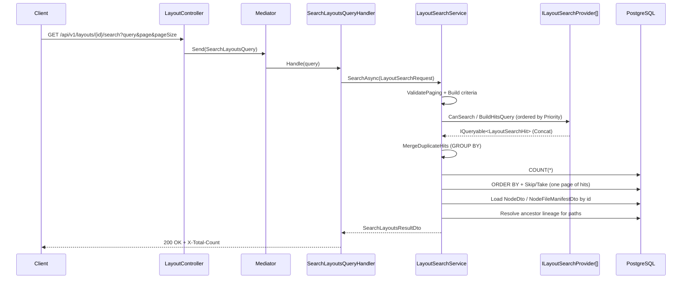
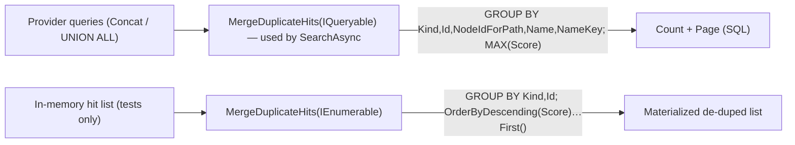

# 19. Search

Cotton's search subsystem provides **layout-scoped search** over a single user's file tree: within one layout it finds folder-like nodes and visible file entries by their normalized display names and by identifier (entity GUID or content/manifest GUID). The whole feature lives in `src/Cotton.Server/Services/Search/` and is deliberately built as a *pluggable provider model* so that a future semantic / vector search can be added without changing the orchestration, paging, or path-resolution logic. Today there is exactly one functional provider (name/identifier matching backed by PostgreSQL `LIKE` plus equality) and a registered no-op placeholder that reserves the eligibility contract for vector search but returns no rows.

This section documents the service (`ILayoutSearchService` / `LayoutSearchService`), the provider contract (`ILayoutSearchProvider`, `NameLayoutSearchProvider`, `NoOpVectorLayoutSearchProvider`), the query/criteria model, the hit and scoring model, hit merging/dedup, the mediator handler (`SearchLayoutsQuery`), the result DTOs, and how all of this maps to SQL. It also covers four recent commits that shaped the current design.

## Purpose & overview

Search answers one question: *"within layout L owned by user U, which nodes and files match this query string?"* It does **not** search across layouts, does **not** search other users' data, and does **not** index file *contents* — only names (and identifiers). Every provider query is scoped by `OwnerId` + `LayoutId`, so search is a per-user, per-layout operation.

The `README.md` (line 253) describes search as "debounced client queries with normalized key matching on the server" — this matches the code: the React client debounces (`useLayoutSearch`) and the server matches on a normalized `NameKey`. The README mentions "semantic" only in the context of dedup/compression (lines 178, 648), never search; there is **no** README claim of working semantic/vector search, which matches reality — `NoOpVectorLayoutSearchProvider` is a stub that returns no rows.

Key design properties:

- **Database-side composition.** Each provider returns an `IQueryable<LayoutSearchHit>` (a projection over EF Core entities), not materialized objects. The service `Concat`s providers, applies a dedup `GroupBy`, counts, orders, and pages — all translated to SQL. Only the final page of hits is materialized; DTO loading and path resolution then run as separate queries.
- **Normalized name keys.** Matching is done against a case- and diacritic-folded `NameKey` column (see *Naming & Validation*), never the raw display `Name`. The `name_key` columns are additionally typed as PostgreSQL `citext` (`[Column("name_key", TypeName = "citext")]` on both `Node` and `NodeFile`; the extension is enabled in the initial migration `src/Cotton.Database/Migrations/20260102064107_Initial.cs`), so equality and `LIKE` against them are case-insensitive at the database level too.
- **Trash exclusion.** Every provider query filters `Type == NodeType.Default`, so trashed items (`NodeType.Trash`) never appear in results.

## Key components & responsibilities

| Component | File | Responsibility |
| --- | --- | --- |
| `ILayoutSearchService` | `src/Cotton.Server/Services/Search/ILayoutSearchService.cs` | Service contract: `SearchAsync(LayoutSearchRequest, CancellationToken) → SearchLayoutsResultDto`. |
| `LayoutSearchService` | `src/Cotton.Server/Services/Search/LayoutSearchService.cs` | Orchestrates providers, dedups, counts, pages, loads DTOs, resolves paths. |
| `ILayoutSearchProvider` | `src/Cotton.Server/Services/Search/ILayoutSearchProvider.cs` | Provider contract: `Priority`, `CanSearch(criteria)`, `BuildHitsQuery(context)`. |
| `NameLayoutSearchProvider` | `src/Cotton.Server/Services/Search/NameLayoutSearchProvider.cs` | The only functional provider; name/identifier matching via `LIKE` and equality. `Priority = 0`. |
| `NoOpVectorLayoutSearchProvider` | `src/Cotton.Server/Services/Search/NoOpVectorLayoutSearchProvider.cs` | Placeholder for vector search; `Priority = 100`; always returns an empty query. |
| `LayoutSearchProviderContext` | `src/Cotton.Server/Services/Search/LayoutSearchProviderContext.cs` | Immutable carrier of `(Request, Criteria)` passed into a provider. |
| `LayoutSearchRequest` | `src/Cotton.Server/Services/Search/LayoutSearchRequest.cs` | Scoped request record: `UserId`, `LayoutId`, `Query`, `Page`, `PageSize`. |
| `LayoutSearchCriteria` | `src/Cotton.Server/Services/Search/LayoutSearchCriteria.cs` | Normalized, provider-shared query model (name key, LIKE patterns, tokens, GUIDs). |
| `LayoutSearchCriteriaBuilder` | `src/Cotton.Server/Services/Search/LayoutSearchCriteriaBuilder.cs` | Parses raw query text → `LayoutSearchCriteria` (GUID extraction, normalization, tokenization, LIKE escaping). |
| `LayoutSearchToken` | `src/Cotton.Server/Services/Search/LayoutSearchToken.cs` | One normalized text token + its `%token%` / `token%` patterns + `HasLetters`. |
| `LayoutSearchScores` | `src/Cotton.Server/Services/Search/LayoutSearchScores.cs` | Constant relevance tiers (1.0 / 0.8 / 0.6 / 0.4 / 0.2). |
| `LayoutSearchHit` | `src/Cotton.Server/Services/Search/LayoutSearchHit.cs` | A single ranked hit projected by a provider. |
| `LayoutSearchHitKind` | `src/Cotton.Server/Services/Search/LayoutSearchHitKind.cs` | `Node = 0` / `File = 1`. |
| `LayoutSearchHitMerger` | `src/Cotton.Server/Services/Search/LayoutSearchHitMerger.cs` | Keeps the strongest hit per entity (two overloads: `IQueryable` and in-memory). |
| `SearchLayoutsQuery` / `SearchLayoutsQueryHandler` | `src/Cotton.Server/Handlers/Layouts/SearchLayoutsQuery.cs` | Mediator request + handler that maps to `LayoutSearchRequest` and delegates to the service. |
| `SearchResultDto` / `SearchLayoutsResultDto` | `src/Cotton.Server/Models/Dto/SearchResultDto.cs`, `src/Cotton.Server/Models/Dto/SearchLayoutsResultDto.cs` | API payload: nodes, files, resolved paths, total count. |

### Dependency injection & registration

Providers and the service are registered scoped in `src/Cotton.Server/Extensions/ServiceCollectionExtensions.cs` via `AddLayoutSearchServices()`, which is called from the registration chain in `src/Cotton.Server/Program.cs` (line 202, `.AddLayoutSearchServices()`):

```csharp
public static IServiceCollection AddLayoutSearchServices(this IServiceCollection services)
{
    services.AddScoped<ILayoutSearchService, LayoutSearchService>();
    services.AddScoped<ILayoutSearchProvider, NameLayoutSearchProvider>();
    services.AddScoped<ILayoutSearchProvider, NoOpVectorLayoutSearchProvider>();
    return services;
}
```

Because both providers are registered against the same `ILayoutSearchProvider` service type, `LayoutSearchService` receives them as an `IEnumerable<ILayoutSearchProvider>` (constructor injection: `LayoutSearchService(CottonDbContext _dbContext, IEnumerable<ILayoutSearchProvider> _providers)`) and iterates them in `Priority` order. The registration is asserted by the integration test `AddLayoutSearchServices_RegistersServiceAndProviders`.

## Entry point & request flow

The HTTP entry point is `GET /api/v1/layouts/{layoutId:guid}/search` in `src/Cotton.Server/Controllers/LayoutController.cs` (action `SearchLayouts`, `[Authorize]`). The controller is routed with `[Route(Routes.V1.Layouts)]`, where `Routes.V1.Layouts == "/api/v1/layouts"` (`src/Cotton.Shared/Routes.cs`), so the full route includes the `/api/v1` base.

```csharp
[Authorize]
[HttpGet("{layoutId:guid}/search")]
public async Task<IActionResult> SearchLayouts(
    [FromRoute] Guid layoutId,
    [FromQuery] string query,
    [FromQuery] int page = 1,
    [FromQuery] int pageSize = 20)
{
    Guid userId = User.GetUserId();
    SearchLayoutsQuery request = new(userId, layoutId, query, page, pageSize);
    var result = await _mediator.Send(request);
    Response.Headers.Append("X-Total-Count", result.TotalCount.ToString());
    return Ok(result);
}
```

Notes:

- Default page size is **20** at the controller; the *maximum* enforced by the service is **100** (`MaxPageSize`).
- `userId` is taken from the authenticated principal (`User.GetUserId()`), never from the client — search cannot be scoped to another user.
- `TotalCount` is echoed in the `X-Total-Count` response header *and* in the JSON body. The React client reads the header (`src/cotton.client/src/shared/api/layoutsApi.ts`, `layoutsApi.search`, via `response.headers["x-total-count"]`).
- The client hook (`src/cotton.client/src/pages/search/hooks/useLayoutSearch.ts`) trims the query (`trimmedQuery = query.trim()`), requires a non-empty trimmed string before issuing a request (`canSearch = Boolean(layoutId && trimmedQuery)`), and debounces by a configurable interval defaulting to 300 ms (`debounceMs = 300`).



## How it works — control flow inside `LayoutSearchService.SearchAsync`

`SearchAsync` (`src/Cotton.Server/Services/Search/LayoutSearchService.cs`) executes the following steps:

1. **`ValidatePaging(request.Page, request.PageSize)`** — throws `ArgumentOutOfRangeException` if `page` or `pageSize` is zero/negative (`ArgumentOutOfRangeException.ThrowIfNegativeOrZero`), or if `pageSize > MaxPageSize` (`MaxPageSize = 100`).
2. **Build criteria** — `LayoutSearchCriteriaBuilder.Build(request.Query)`. If the result has neither text nor IDs (`!criteria.HasText && !criteria.HasIds`), return a default empty `SearchLayoutsResultDto` (`TotalCount` defaults to 0). Note: `Build` itself throws `BadHttpRequestException("Query cannot be empty.")` for a null/whitespace query, so the only way the "no text and no IDs" branch is reached is a non-empty query that folds away to nothing and contains no GUID.
3. **Compose provider queries** (`BuildHitsQuery`) — construct a `LayoutSearchProviderContext`, iterate `_providers.OrderBy(x => x.Priority)`, skip any whose `CanSearch(criteria)` is false, and `Concat` each remaining provider's `IQueryable<LayoutSearchHit>`. If no provider contributes (`hitsQuery is null`), return an empty result.
4. **Dedup** — `LayoutSearchHitMerger.MergeDuplicateHits(hitsQuery)` collapses duplicate rows for the same entity, keeping the **maximum** score (still as an `IQueryable`, i.e. still SQL).
5. **Count** — `await hitsQuery.CountAsync(cancellationToken)`. If `totalCount == 0`, return `CreateEmptySearchResult(0)`.
6. **Page** — compute `skip = checked((request.Page - 1) * request.PageSize)` and call `LoadPagedHitsAsync`, which orders and pages (see *Ordering & paging* below). If the page is empty (e.g. page beyond the end), return `CreateEmptySearchResult(totalCount)` that still carries the true `TotalCount`.
7. **Load DTOs** — `LoadHitModelsAsync` splits hits into node ids / file ids (`Distinct`), loads `NodeDto`s and `NodeFileManifestDto`s, and re-orders them to match the hit order.
8. **Resolve paths** — `ResolvePathsAsync` walks ancestor lineage to produce absolute in-layout paths for both nodes and files.
9. **Return** `SearchLayoutsResultDto { Nodes, Files, NodePaths, FilePaths, TotalCount }`.

### Provider composition

```csharp
foreach (ILayoutSearchProvider provider in _providers.OrderBy(x => x.Priority))
{
    if (!provider.CanSearch(criteria)) continue;
    IQueryable<LayoutSearchHit> providerQuery = provider.BuildHitsQuery(context);
    hitsQuery = hitsQuery is null ? providerQuery : hitsQuery.Concat(providerQuery);
}
```

`Concat` translates to SQL `UNION ALL` (it keeps duplicates; dedup is a separate, deliberate step). `Priority` orders the composition deterministically: `NameLayoutSearchProvider` (0) before `NoOpVectorLayoutSearchProvider` (100).

### Ordering & paging

`LoadPagedHitsAsync` materializes only the requested page, ordering by a stable, deterministic key chain (all in SQL):

```csharp
hitsQuery
    .OrderByDescending(x => x.Score)   // best relevance first
    .ThenBy(x => x.Kind)               // Node (0) before File (1) at equal score
    .ThenBy(x => x.NameKey)            // alphabetical by normalized key
    .ThenBy(x => x.Id)                 // final tiebreaker for determinism
    .Skip(skip)
    .Take(pageSize)
    .ToListAsync(...)
```

The four-level sort guarantees stable paging across requests (important for `Skip`/`Take` correctness).

### Result-set ordering preservation

After paging, the service loads the actual `NodeDto`/`NodeFileManifestDto` rows by id with `Contains(...)` (translated to a SQL `WHERE … IN (…)` / `= ANY (…)`), using Mapster's `ProjectToType<...>`. Because `IN` does not preserve order, `OrderNodesLikeHits` / `OrderFilesLikeHits` re-sort the materialized DTOs back into the original ranked hit order using a position dictionary (`order.GetValueOrDefault(x.Id, int.MaxValue)` for unexpected/missing ids). Both helpers short-circuit when the list has `Count <= 1`. This keeps the API's `Nodes` and `Files` arrays in relevance order. Files are loaded with `.Include(x => x.FileManifest)` so the manifest projection is available.

## The query / criteria model

### `LayoutSearchCriteriaBuilder.Build`

`Build` (`src/Cotton.Server/Services/Search/LayoutSearchCriteriaBuilder.cs`) turns the raw query string into a `LayoutSearchCriteria`:

1. Reject null/whitespace with `BadHttpRequestException("Query cannot be empty.")`.
2. NFC-normalize and trim: `query.Normalize(NormalizationForm.FormC).Trim()`.
3. **Extract GUIDs** with `GuidRegex`. The pattern matches canonical hyphenated GUIDs *and* 32-hex-digit forms, with negative hex look-arounds (`(?<![0-9a-fA-F])` … `(?![0-9a-fA-F])`) so a GUID embedded in a longer hex run is not matched. Matches are de-duplicated via `Guid.TryParse` + `!result.Contains(...)` into `Guid[] IdQueries`. As a fallback, if no regex match is found but the whole trimmed value parses as a GUID, that single GUID is used.
4. **Strip GUIDs from the text** (`GuidRegex.Replace(rawQuery, " ").Trim()`) so identifiers do not pollute name matching.
5. **Fold to a name key**: `NameValidator.GetNameKey(textWithoutGuids)` (`src/Cotton.Validators/NameValidator.cs`). This enumerates grapheme clusters, decomposes each to `NormalizationForm.FormD`, drops `NonSpacingMark` / `SpacingCombiningMark` / `EnclosingMark` runes, lowercases with `ToLowerInvariant`, and re-composes to `FormC` — i.e. case- and diacritic-insensitive folding. This is the same folding applied to populate the stored `NameKey` columns (via `Node.SetName` / `NodeFile.SetName`), which is why equality and `LIKE` matches line up.
6. **Build LIKE patterns** from the *escaped* name key: `ContainsPattern = "%key%"`, `PrefixPattern = "key%"`. If the name key is empty, both patterns are `string.Empty`.
7. **Tokenize** the name key into `LayoutSearchToken[]` (see below).

### Field reference — `LayoutSearchCriteria`

`LayoutSearchCriteria` is a `sealed record` with the following members (the last five are computed properties):

| Member | Type | Meaning |
| --- | --- | --- |
| `NameKey` | `string` | Folded text (GUIDs removed); empty if no text. |
| `ContainsPattern` | `string` | Escaped `%key%` LIKE pattern; empty if no text. |
| `PrefixPattern` | `string` | Escaped `key%` LIKE pattern; empty if no text. |
| `LikeEscape` | `string` | LIKE escape character, constant `"\\"`. |
| `TextTokens` | `LayoutSearchToken[]` | One entry per distinct alphanumeric run in the name key. |
| `IdQueries` | `Guid[]` | GUIDs extracted from the query. |
| `HasText` (computed) | `bool` | `NameKey.Length > 0`. |
| `HasIds` (computed) | `bool` | `IdQueries.Length > 0`. |
| `HasOnlyIds` (computed) | `bool` | `HasIds && !HasText`. |
| `HasVectorSearchText` (computed) | `bool` | Any token has letters (`TextTokens.Any(x => x.HasLetters)`) — the vector-eligibility gate. |
| `HasMultipleTextTokens` (computed) | `bool` | `TextTokens.Length > 1` — switches name matching to per-token AND. |

### Tokenization — `LayoutSearchToken`

`BuildTextTokens` applies `TextTokenRegex = [\p{L}\p{N}]+` to the *folded* name key, taking distinct (`StringComparer.Ordinal`) runs of Unicode letters/numbers. Each token (`sealed record LayoutSearchToken`) records:

| Field | Meaning |
| --- | --- |
| `NameKey` | The token text (already folded). |
| `ContainsPattern` | `%token%` (escaped). |
| `PrefixPattern` | `token%` (escaped). |
| `HasLetters` | `token.Any(char.IsLetter)` — used to decide vector eligibility and (implicitly) to distinguish text like "report" from a pure-numeric "123456". |

This token model is what makes multi-term, order-independent name search work: `"Пупкин Вася"` yields two tokens `пупкин` and `вася`, and a node/file matches only if its `NameKey` contains *both* (each token contributes a separate `LIKE … AND …` predicate — see `ApplyTextCriteria`). The integration test `BuildCriteria_SplitsFileNameTermsForOrderIndependentSearch` asserts exactly these two tokens and their `%пупкин%` / `%вася%` patterns.

### LIKE escaping

`EscapeLike` escapes the LIKE metacharacters before patterns are assembled: `\` → `\\`, `%` → `\%`, `_` → `\_`. The escape character (`LikeEscape = "\\"`) is then passed to `EF.Functions.Like(value, pattern, escapeCharacter)` so user input like `100%_ready` is matched literally rather than as wildcards. The test `BuildCriteria_EscapesLikeWildcards` asserts that `"100%_ready"` produces `ContainsPattern == "%100\%\_ready%"` and `PrefixPattern == "100\%\_ready%"`.

## Matching & scoring — `NameLayoutSearchProvider`

`NameLayoutSearchProvider.BuildHitsQuery` builds two queries — one over `Nodes` (`BuildNodeHitsQuery`), one over `NodeFiles` (`BuildFileHitsQuery`) — and `Concat`s them. Both apply the same scope and criteria logic. `CanSearch` returns `criteria.HasText || criteria.HasIds`.

### Scope predicates

- **Nodes**: `OwnerId == request.UserId && LayoutId == request.LayoutId && Type == NodeType.Default`.
- **Files**: `OwnerId == request.UserId && Node.LayoutId == request.LayoutId && Node.Type == NodeType.Default` (file scope is derived through its parent `Node` navigation).

`Type == NodeType.Default` is what excludes trashed items from search (commit `bf391566`, "fix(search): exclude trashed items from layout search").

### Criteria application (`ApplyCriteria`)

The matching predicate is chosen by **identifier-vs-text precedence**:

```csharp
private static IQueryable<Node> ApplyCriteria(IQueryable<Node> query, LayoutSearchCriteria criteria)
{
    if (criteria.HasIds)
        return query.Where(x => criteria.IdQueries.Contains(x.Id));   // identifier WINS
    return ApplyTextCriteria(query, criteria);
}
```

For files, identifier matching also matches the **content/manifest id**:

```csharp
private static IQueryable<NodeFile> ApplyCriteria(IQueryable<NodeFile> query, LayoutSearchCriteria criteria)
{
    if (criteria.HasIds)
        return query.Where(x => criteria.IdQueries.Contains(x.Id)
                             || criteria.IdQueries.Contains(x.FileManifestId));
    return ApplyTextCriteria(query, criteria);
}
```

This is the result of the **"Fix identifier search precedence"** fix (commit `ef9859de`). Previously, when a query contained *both* a GUID and text (`HasIds && HasText`), the provider issued a `.Where(id).Union(ApplyTextCriteria(...))` — i.e. it OR-ed the identifier and text predicates. That branch was removed from both overloads. Now, **if any GUID is present, identifier matching takes exclusive precedence and the text tokens are ignored for filtering.** The integration test `NameProvider_QueryWithIdsAndText_UsesIdentifierPredicateOnly` builds the SQL for the query `"{guid} why"` via `.ToQueryString()` and asserts every `WHERE` line `Has.All.Not.Contains("name_key")`. (The leftover text tokens still affect `HasVectorSearchText`, but with IDs present the name provider's `HasIds` branch wins regardless.)

### Text matching (`ApplyTextCriteria`)

```csharp
if (criteria.HasMultipleTextTokens)
{
    foreach (LayoutSearchToken token in criteria.TextTokens)
        query = query.Where(x => EF.Functions.Like(x.NameKey, token.ContainsPattern, criteria.LikeEscape));
    return query;                                  // AND of per-token %token%
}
return query.Where(x => EF.Functions.Like(x.NameKey, criteria.ContainsPattern, criteria.LikeEscape));
```

- **Single token**: one `LIKE '%key%'`.
- **Multiple tokens**: one `LIKE '%token%'` per token, chained — order-independent AND semantics. (`Node` and `NodeFile` have two overloads of `ApplyTextCriteria` with identical bodies.)

### Scoring

The `Score` for each row is computed *inside the SQL projection* (`Select(x => new LayoutSearchHit { ... })`) using a ternary ladder evaluated in order:

```csharp
Score =
    criteria.HasIds && criteria.IdQueries.Contains(x.Id)                                  ? LayoutSearchScores.ExactIdentifier :
    criteria.HasText && x.NameKey == criteria.NameKey                                     ? LayoutSearchScores.ExactName :
    criteria.HasText && EF.Functions.Like(x.NameKey, criteria.PrefixPattern, ...)         ? LayoutSearchScores.PrefixName :
    criteria.HasMultipleTextTokens                                                        ? LayoutSearchScores.TokenName :
    LayoutSearchScores.SubstringName,
```

For files, the identifier branch also credits `criteria.IdQueries.Contains(x.FileManifestId)`.

| Tier (`LayoutSearchScores`) | Value | Condition |
| --- | --- | --- |
| `ExactIdentifier` | `1.0` | Row id (or, for files, file-manifest id) is in `IdQueries`. |
| `ExactName` | `0.8` | `NameKey` equals the query name key exactly. |
| `PrefixName` | `0.6` | `NameKey` starts with the query (`PrefixPattern`). |
| `TokenName` | `0.4` | Multi-token match (only reached when `HasMultipleTextTokens`). |
| `SubstringName` | `0.2` | Fallback substring `%key%` match. |

Because filtering already guaranteed the row matched, the score ladder only *classifies* the strength of that match. The score is a `double` column produced by SQL and is what `OrderByDescending(x => x.Score)` later sorts on. The test `ExactIdentifierScore_IsCertainMatch` pins `ExactIdentifier == 1.0`.

## The placeholder vector provider — `NoOpVectorLayoutSearchProvider`

`NoOpVectorLayoutSearchProvider` (`Priority = 100`) exists to **define and reserve the eligibility contract** for a future semantic/vector search without implementing it. Its `CanSearch` returns `criteria.HasVectorSearchText` (true only when at least one token contains letters — i.e. natural-language text, not bare numbers or a pure-GUID query). Its `BuildHitsQuery` returns an intentionally empty, type-correct query:

```csharp
return _dbContext.NodeFiles
    .AsNoTracking()
    .Where(_ => false)          // never matches; SQL-translatable; contributes 0 rows
    .Select(x => new LayoutSearchHit
    {
        Kind = LayoutSearchHitKind.File,
        Id = x.Id,
        NodeIdForPath = x.NodeId,
        Name = x.Name,
        NameKey = x.NameKey,
        Score = 0,
    });
```

The `Where(_ => false)` keeps the shape valid for `Concat`/`UNION ALL` while guaranteeing it adds no hits. The eligibility test `VectorProvider_CanSearchOnlyNaturalLanguageText` confirms: a GUID-only query and `"123456"` are *not* eligible; `"report 123456"` and `"quarterly report"` *are*.

This is the seam an implementer extends: replace the `Where(_ => false)` body with a real embedding/ANN query while leaving `CanSearch`, the priority, and the orchestration untouched.

## Hit model & merging

### `LayoutSearchHit`

| Field | Type | Meaning |
| --- | --- | --- |
| `Kind` | `LayoutSearchHitKind` | `Node` or `File`. |
| `Id` | `Guid` | Entity id (`Node.Id` or `NodeFile.Id`). |
| `NodeIdForPath` | `Guid` | Node id used to resolve the hit's path. For a node hit this is the node itself (`x.Id`); for a file hit it is the parent `NodeId`. |
| `Name` | `string` | Display name. |
| `NameKey` | `string` | Folded name key (used for ordering and grouping). |
| `Score` | `double` | Relevance score from `LayoutSearchScores`. |

### `LayoutSearchHitMerger` — two overloads

The same entity can be produced more than once (e.g. across `Node` vs `NodeFile` projections that share an id space, or across contributing providers). The merger keeps the strongest hit per entity. There are two overloads:



**`IQueryable` overload** (the one actually used by `SearchAsync`; must translate to SQL):

```csharp
hits.GroupBy(x => new { x.Kind, x.Id, x.NodeIdForPath, x.Name, x.NameKey })
    .Select(x => new LayoutSearchHit
    {
        Kind = x.Key.Kind, Id = x.Key.Id, NodeIdForPath = x.Key.NodeIdForPath,
        Name = x.Key.Name, NameKey = x.Key.NameKey,
        Score = x.Max(hit => hit.Score),
    });
```

**`IEnumerable` overload** (for already-materialized sets; groups by `{ Kind, Id }` and orders within each group). Note: in the current code this overload is **only exercised by the unit test `MergeDuplicateHits_KeepsBestScorePerEntity`** — production `SearchAsync` calls the `IQueryable` overload exclusively:

```csharp
hits.GroupBy(x => new { x.Kind, x.Id })
    .Select(x => x.OrderByDescending(h => h.Score)
                  .ThenBy(h => h.NameKey, StringComparer.Ordinal)
                  .ThenBy(h => h.NodeIdForPath)
                  .First())
    .ToList();
```

The two overloads group on **different keys** by necessity: the in-memory version can group on `{ Kind, Id }` and pick a representative row via ordering; the SQL version groups on the full projected tuple and aggregates `Score` with `MAX`, because PostgreSQL/EF Core cannot translate "take the first row of a group ordered by an arbitrary column" into a single `GROUP BY`. See the next section.

## Recent commits and what they imply

Four consecutive commits built and then hardened this subsystem. Together the last three reveal its central tension: **everything before paging must stay an `IQueryable` that EF Core can translate to one SQL statement.**

| Commit | Title | What changed | Implication |
| --- | --- | --- | --- |
| `05a7d7da` | Add search provider eligibility | Introduced `CanSearch` / the eligibility model (`HasVectorSearchText`) so the `NoOpVectorLayoutSearchProvider` is only selected for natural-language queries. | Provider selection became criteria-driven; vector eligibility is decided per query. |
| `89814350` | Fix layout search duplicate hits | Added `LayoutSearchHitMerger`; inserted `MergeDuplicateHits(hitsQuery)` into `SearchAsync` before counting; added `.Distinct()` when collecting node/file ids in `LoadHitModelsAsync`. | The same entity could appear multiple times, inflating `TotalCount` and duplicating rows. Dedup is now an explicit pipeline stage. (This commit also touched `src/cotton.client/src/pages/files/components/PageHeader.tsx`, but that change adds a "New File" button — `showNewFile` / `onNewFileClick` / `isCreatingFile` — and is unrelated to search dedup.) |
| `45ad1344` | Fix search hit merge SQL translation | Rewrote the `IQueryable` overload from `GroupBy{Kind,Id}.Select(g => g.OrderBy…First())` to `GroupBy{full tuple}.Select(g => new LayoutSearchHit { … Score = g.Max(...) })`. | The original `…First()` form does **not** translate to PostgreSQL `GROUP BY` and threw at query time. The fix uses an aggregate (`MAX(Score)`) over a full-tuple grouping, which is translatable. The in-memory overload kept the `…First()` form (it runs in LINQ-to-objects). Test `MergeDuplicateHits_QueryableTranslatesForNameProvider` asserts the generated SQL contains `GROUP BY`. |
| `ef9859de` | Fix identifier search precedence | Removed the `HasIds && HasText` branch that `Union`-ed identifier and text predicates in both `ApplyCriteria` overloads. | When a GUID is present, identifier matching is now exclusive — a mixed `"{guid} text"` query filters on the id only. Test `NameProvider_QueryWithIdsAndText_UsesIdentifierPredicateOnly` asserts no `name_key` appears in the SQL `WHERE`. |

### EF Core / SQL translation considerations (for contributors)

When adding or modifying anything in this subsystem, keep these constraints in mind:

- **Stay queryable until paging.** `BuildHitsQuery`, `Concat`, `MergeDuplicateHits` (queryable overload), `CountAsync`, and `LoadPagedHitsAsync` all run in the database. Do not introduce client-evaluable expressions (custom C# methods, `StringComparer`, `.First()` over an ordered group, etc.) into these stages — they will fail to translate.
- **Use aggregates, not `GroupBy(...).First()`, for SQL grouping.** PostgreSQL via Npgsql translates `GROUP BY` + aggregate (`Max`, `Min`, `Count`), but not "first row per group ordered by X". This is exactly the trap `45ad1344` fixed.
- **`Concat` = `UNION ALL`** (keeps duplicates); dedup is deliberate and separate.
- **`Contains(collection, column)`** translates to SQL `IN (…)` / `= ANY (…)`; order is not preserved, hence `OrderNodesLikeHits` / `OrderFilesLikeHits`.
- **`EF.Functions.Like(col, pattern, escape)`** is the LIKE primitive; always pass `criteria.LikeEscape` and pre-escape user input via `EscapeLike`.
- **Indexing.** `Node` has a *unique* composite index on `(LayoutId, ParentId, Type, NameKey)` (`[Index(..., IsUnique = true)]` in `src/Cotton.Database/Models/Node.cs`) and `NodeFile` has non-unique indexes on `(NodeId, NameKey)` and `(FileManifestId, NodeId)` (`src/Cotton.Database/Models/NodeFile.cs`). Because `name_key` is a `citext` column, equality and prefix (`key%`) matches are case-insensitive and index-friendly, but `LIKE '%key%'` (a leading wildcard, the substring/contains case) cannot use a B-tree index efficiently. Substring search therefore scans within the scoped (`OwnerId`/`LayoutId`/`Type`) subset.

## Path resolution

`ResolvePathsAsync` produces absolute, in-layout paths for the page's hits, using `Constants.DefaultPathSeparator` (`'/'`, from `src/Cotton.Shared/Constants.cs`, in namespace `Cotton`).

- It collects the node ids of node hits plus the parent node ids (`NodeIdForPath`) of file hits, then resolves the full ancestor lineage in one breadth-first sweep (`LoadNodeLineageAsync`): repeatedly query `Nodes` for the current frontier (scoped by `OwnerId` + `LayoutId`), recording `(ParentId, Name, Type)` and pushing not-yet-seen parents onto the next frontier until the frontier empties.
- After loading, it severs any parent link whose `Type` differs from the child's (`parent.Type != info.Type` → the child's `ParentId` is replaced with `null`, treating it as a root). This prevents a path from crossing a `NodeType` boundary (e.g. Default vs Trash).
- `ResolveNodePath` walks parent links into a `Stack<string>`, guarding against cycles (`HashSet` of visited ids) and runaway depth (`MaxDepth = 256`), then joins the parts with `Constants.DefaultPathSeparator`, prefixed by a leading separator.
- For files, `CombinePath(parentPath, hit.Name)` appends the filename as the last segment (`parentPath.TrimEnd(separator) + separator + name`); a blank parent path defaults to the root separator.
- Missing lineage falls back to the root separator (`"/"`).

`NodePaths` maps node-hit id → path; `FilePaths` maps file-hit id → path including the filename.

## Result DTOs

`SearchLayoutsResultDto` (`src/Cotton.Server/Models/Dto/SearchLayoutsResultDto.cs`) extends `SearchResultDto` (`src/Cotton.Server/Models/Dto/SearchResultDto.cs`):

| Field | Type | Source |
| --- | --- | --- |
| `Nodes` | `IEnumerable<NodeDto>` | Matched node hits, in relevance order (defaults to empty). |
| `Files` | `IEnumerable<NodeFileManifestDto>` | Matched file hits, in relevance order (defaults to empty). |
| `NodePaths` | `IDictionary<Guid,string>` | Node id → resolved absolute in-layout path. |
| `FilePaths` | `IDictionary<Guid,string>` | File id → resolved absolute path (includes filename as last segment). |
| `TotalCount` | `int` | Total matching (de-duped) entities across all pages. |

Empty results return a default `SearchLayoutsResultDto` (empty collections, `TotalCount = 0`); a "no rows on this page but rows exist" case (`CreateEmptySearchResult(totalCount)`) returns empty collections with the real `TotalCount` preserved.

## Concurrency, failure modes, edge cases & security

- **Authorization & isolation.** The endpoint is `[Authorize]`; `UserId` comes from the principal (`User.GetUserId()`). All provider queries filter `OwnerId == request.UserId`, so a user cannot search another user's layout even with a guessed `LayoutId`. There is no separate ownership check on `LayoutId` itself in the search path — isolation rests on the `OwnerId` predicate, which yields zero hits for a foreign/unknown layout.
- **Identifier disclosure.** Because identifier search matches both the entity id and the file's `FileManifestId`, and is always scoped to the caller's data, it cannot reveal whether another user owns a given GUID.
- **Input validation.** Empty/whitespace query → `BadHttpRequestException`. `page`/`pageSize` ≤ 0 → `ArgumentOutOfRangeException`. `pageSize > 100` → `ArgumentOutOfRangeException`. `skip` uses `checked(...)` so an absurd `(page - 1) * pageSize` overflows loudly rather than silently wrapping.
- **LIKE injection / wildcard abuse** is prevented by `EscapeLike` + an explicit escape character passed to `EF.Functions.Like`.
- **Trash leakage** is prevented by `Type == NodeType.Default` in every provider query.
- **Concurrency.** Service and providers are scoped (one instance per request); `CottonDbContext` is not shared across requests. Read queries use `.AsNoTracking()`. There is no caching layer — every search hits the database.
- **Pathological paths** (cycles, very deep trees) are bounded by the cycle guard and `MaxDepth = 256`; such a path is simply truncated rather than looping forever.
- **No relevance beyond tiers.** Scoring is coarse (five fixed tiers); there is no TF/IDF, fuzzy distance, or learned ranking. Ties within a tier are broken deterministically by `Kind`, then `NameKey`, then `Id`.

## Non-obvious design decisions & gotchas

- **Identifier presence is exclusive.** A query like `"<guid> annual report"` filters on the GUID *only* — the words are dropped from filtering. This is intentional (commit `ef9859de`) but surprising if you expect OR semantics.
- **The two merge overloads group on different keys for a reason.** SQL needs an aggregate over a full-tuple group; the in-memory overload can pick a representative row via `…First()`. Don't "unify" them — the queryable one must not use `…First()`. (Note the in-memory overload is currently only used by tests.)
- **`NoOpVectorLayoutSearchProvider` still defines real eligibility.** It is registered and *will* be selected for natural-language queries; it just returns nothing today. The `HasVectorSearchText` gate is the live contract for the future implementation.
- **Substring search is not index-accelerated.** `%key%` cannot use the B-tree on `NameKey`; only exact and prefix matches are. Large layouts pay a scan cost for substring hits within the user's scope.
- **`HasMultipleTextTokens` changes semantics.** Single-token queries use one `%key%`; multi-token queries AND each token. A query that folds to a single token never reaches the `TokenName` (0.4) score tier.
- **Folding parity is load-bearing.** Search matching only works because `LayoutSearchCriteriaBuilder` folds the query with the same `NameValidator.GetNameKey` that `Node.SetName` / `NodeFile.SetName` use to populate their `NameKey` columns. Changing one without the other silently breaks matching.

## Related sections

- *Naming & Validation* — `NameValidator.GetNameKey` / `NormalizeAndGetNameKey`, the grapheme-cluster folding rules and name policy that the `NameKey` columns and search criteria share.
- *Layouts, Nodes & the File Tree* — the `Node` / `NodeFile` entities, `NodeType` (Default vs Trash), parent/child topology, and the indexes search relies on.
- *Trash & Restore* — why `NodeType.Trash` exists and why search excludes it.
- *Mediator Pipeline & Handlers* — how `SearchLayoutsQuery` is dispatched.
- *Web API & Controllers* — the `LayoutController` surface, `[Authorize]`, route base `/api/v1`, and the `X-Total-Count` paging convention.
- *Frontend File Browser* — the React search page/hook (`useLayoutSearch`, 300 ms debounce) that consumes this endpoint.
