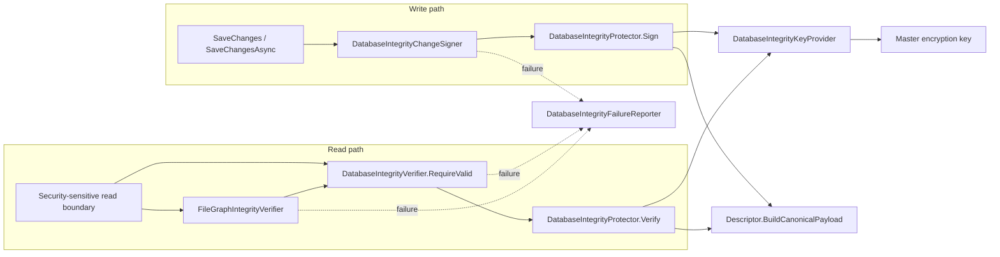
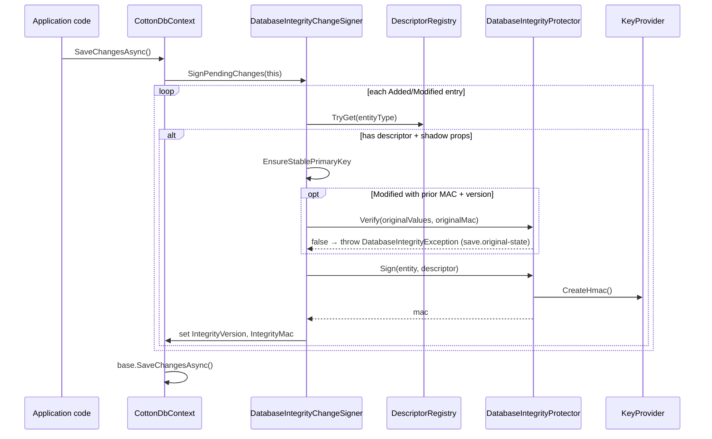
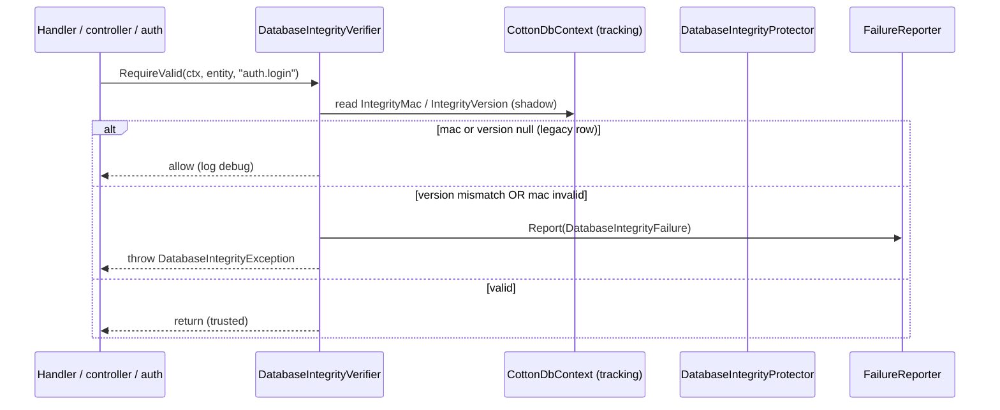
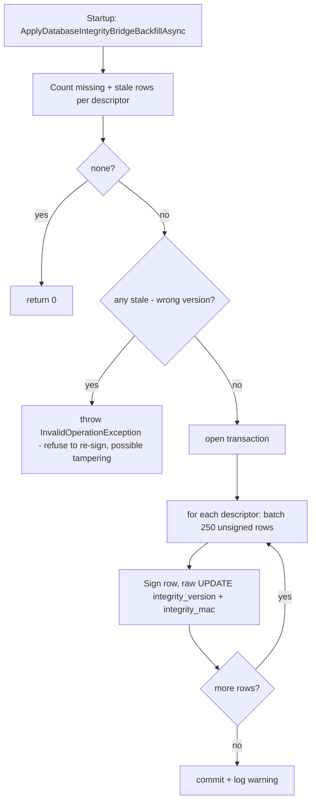

# 20. Database Integrity & Tamper Evidence

Cotton stores most of its security-critical state in PostgreSQL: user accounts, password hashes, TOTP secrets, refresh-token sessions, passkey credentials, OIDC links, share/download tokens, server settings, and the file metadata graph that maps logical files to encrypted content chunks. Because Cotton is self-hosted, an attacker (or a careless operator with `psql` access) could in principle edit a row directly in the database to escalate privileges, restore a revoked session, retarget a public share link, or swap the bytes served for a file — completely bypassing the application's authorization logic. The **Database Integrity & Tamper-Evidence** subsystem defends against exactly that: it attaches a keyed MAC (HMAC-SHA256) to every protected row, computed over a deterministic canonical serialization of the row's security-sensitive fields. The MAC key is derived from the master encryption key and never persisted, so a database-only attacker cannot forge it. Cotton signs rows automatically on `SaveChanges` and verifies them at security-sensitive read boundaries; a mismatch raises `DatabaseIntegrityException` and notifies admins.

This is *tamper evidence*, not tamper prevention. It does not stop someone with database access from corrupting a row; it guarantees that Cotton will *refuse to trust* a row whose protected fields were changed outside the application, and that it will tell operators about it.

## Purpose and overview

The subsystem is split across two assemblies:

- `Cotton.Database/Integrity/` holds the minimal, EF-facing contract: the shadow-column names (`DatabaseIntegrityColumns`) and the save-time signer interface (`IDatabaseIntegrityChangeSigner`). The database project deliberately knows *nothing* about which fields are protected or how the key is derived — it only knows that two shadow columns exist and that "someone" signs pending changes before save.
- `Cotton.Server/Services/DatabaseIntegrity/` holds the full implementation: descriptors (per-entity policy), the canonical writer, the key provider, the protector (the actual HMAC), the save-time signer, the read-time verifier, the file-graph verifier, the rollout bridge, failure reporting, and diagnostics.

Two metadata columns are added to every protected table. Their names are centralized in `src/Cotton.Database/Integrity/DatabaseIntegrityColumns.cs`:

| Constant (`DatabaseIntegrityColumns`) | Value | Meaning |
|---|---|---|
| `VersionProperty` | `IntegrityVersion` | EF shadow property holding the descriptor schema version |
| `MacProperty` | `IntegrityMac` | EF shadow property holding the row MAC |
| `VersionColumn` | `integrity_version` | DB column (PostgreSQL `integer`, nullable) |
| `MacColumn` | `integrity_mac` | DB column (PostgreSQL `bytea`, nullable) |

Both are mapped as **EF shadow properties** (no CLR property on the entity), so they never appear in DTOs and cannot be accidentally set by domain code. Both are **nullable**, which is what makes the rollout bridge and legacy-row tolerance possible (see *Bridge mode — backfilling legacy rows* below).



## Key components and responsibilities

| Component | File | Lifetime | Responsibility |
|---|---|---|---|
| `DatabaseIntegrityColumns` | `src/Cotton.Database/Integrity/DatabaseIntegrityColumns.cs` | static | Canonical shadow-property and DB column names |
| `IDatabaseIntegrityChangeSigner` | `src/Cotton.Database/Integrity/IDatabaseIntegrityChangeSigner.cs` | — | DB-layer contract invoked from `SaveChanges` |
| `IDatabaseIntegrityDescriptor` / `IDatabaseIntegrityDescriptor<T>` | `src/Cotton.Server/Services/DatabaseIntegrity/IDatabaseIntegrityDescriptor.cs` | — | Per-entity policy: which fields are signed |
| `DatabaseIntegrityDescriptor<T>` | `src/Cotton.Server/Services/DatabaseIntegrity/DatabaseIntegrityDescriptor.cs` | — | Abstract base; writes entity header + casts |
| `DatabaseIntegrityCanonicalWriter` | `src/Cotton.Server/Services/DatabaseIntegrity/DatabaseIntegrityCanonicalWriter.cs` | per-call | Deterministic binary serialization |
| `DatabaseIntegrityFieldType` | `src/Cotton.Server/Services/DatabaseIntegrity/DatabaseIntegrityFieldType.cs` | — | Field-type tag byte enum (part of signed format) |
| `DatabaseIntegrityDescriptorRegistry` | `src/Cotton.Server/Services/DatabaseIntegrity/DatabaseIntegrityDescriptorRegistry.cs` | singleton | Type → descriptor lookup |
| `DatabaseIntegrityKeyProvider` | `src/Cotton.Server/Services/DatabaseIntegrity/DatabaseIntegrityKeyProvider.cs` | singleton | Derives + holds the HMAC subkey |
| `DatabaseIntegrityProtector` | `src/Cotton.Server/Services/DatabaseIntegrity/DatabaseIntegrityProtector.cs` | singleton | `Sign` / `Verify` / `RequireValid` over payloads |
| `DatabaseIntegrityChangeSigner` | `src/Cotton.Server/Services/DatabaseIntegrity/DatabaseIntegrityChangeSigner.cs` | scoped | Signs Added/Modified protected entities at save |
| `DatabaseIntegrityVerifier` | `src/Cotton.Server/Services/DatabaseIntegrity/DatabaseIntegrityVerifier.cs` | scoped | Verifies one tracked entity at a read boundary |
| `FileGraphIntegrityVerifier` | `src/Cotton.Server/Services/DatabaseIntegrity/FileGraphIntegrityVerifier.cs` | scoped | Verifies the file metadata/content graph |
| `DatabaseIntegrityBridgeBackfillService` | `src/Cotton.Server/Services/DatabaseIntegrity/DatabaseIntegrityBridgeBackfillService.cs` | scoped | Signs legacy/unsigned rows at startup |
| `DatabaseIntegrityFailureReporter` | `src/Cotton.Server/Services/DatabaseIntegrity/DatabaseIntegrityFailureReporter.cs` | singleton + hosted | Async, deduped admin notifications |
| `NullDatabaseIntegrityFailureReporter` | `src/Cotton.Server/Services/DatabaseIntegrity/NullDatabaseIntegrityFailureReporter.cs` | singleton | No-op fallback reporter |
| `DatabaseIntegrityFailure` | `src/Cotton.Server/Services/DatabaseIntegrity/DatabaseIntegrityFailure.cs` | record | Immutable failure event |
| `DatabaseIntegrityException` | `src/Cotton.Server/Services/DatabaseIntegrity/DatabaseIntegrityException.cs` | exception | Thrown when a row fails verification |
| `DatabaseIntegrityDiagnosticsService` | `src/Cotton.Server/Services/DatabaseIntegrity/DatabaseIntegrityDiagnosticsService.cs` | scoped | Coverage/rollout counts for security check-up |
| `DatabaseIntegrityApplicationExtensions` | `src/Cotton.Server/Extensions/DatabaseIntegrityApplicationExtensions.cs` | — | Runs the bridge backfill during startup |

DI registration lives in `AddDatabaseIntegrity()` in `src/Cotton.Server/Extensions/ServiceCollectionExtensions.cs`, called from `src/Cotton.Server/Program.cs` (line 199). Note the lifetimes: the key provider, protector, registry, and all 14 descriptors are **singletons** (stateless or holding the immutable key); the signer, verifier, bridge, diagnostics, and `FileGraphIntegrityVerifier` are **scoped** (they touch the per-request `CottonDbContext`). The failure reporter is registered once as a concrete singleton (`DatabaseIntegrityFailureReporter`), re-exposed as `IDatabaseIntegrityFailureReporter` resolving to the same instance, and registered a third time via `AddHostedService` so its background drain loop runs.

## The descriptor model

A descriptor is the boundary between *domain policy* and *cryptography*. It answers one question for an entity type: which fields are security-sensitive enough that a silent database edit to them must be detectable? Adding a field to a descriptor means a database-only attacker can no longer change that field without also knowing the integrity key. Conversely, fields deliberately left out (display names, avatars, retry/scheduling state) can be edited or repaired directly in the database without tripping the MAC.

`IDatabaseIntegrityDescriptor` (the non-generic interface) exposes:

- `Type EntityType` — the EF entity CLR type the descriptor handles.
- `string EntityName` — a stable table-like name (e.g. `"users"`) written into the signed payload and into diagnostics/failure reports. It is *not* necessarily the EF table name; it is the descriptor's own stable identifier.
- `int SchemaVersion` — the descriptor format version expected in the row's `integrity_version`.
- `string GetEntityKey(object entity)` — a stable row key (usually the GUID id) written into the payload and failure reports.
- `byte[] BuildCanonicalPayload(object entity)` — produces the bytes that get MACed.

The generic interface `IDatabaseIntegrityDescriptor<in T>` adds the strongly typed `GetEntityKey(T entity)` and `WriteCanonicalData(DatabaseIntegrityCanonicalWriter writer, T entity)`. The abstract base class `DatabaseIntegrityDescriptor<T>` implements `BuildCanonicalPayload` by writing a common header and then delegating the field list to the concrete descriptor's `WriteCanonicalData`:

```csharp
public byte[] BuildCanonicalPayload(object entity)
{
    T typedEntity = Cast(entity);
    return DatabaseIntegrityCanonicalWriter.Build(writer =>
    {
        writer.WriteEntityHeader(EntityName, SchemaVersion, GetEntityKey(typedEntity));
        WriteCanonicalData(writer, typedEntity);
    });
}
```

`Cast` throws `ArgumentException` if the supplied object is not assignable to `T`, and `ArgumentNullException` if it is null. Because `EntityName`, `SchemaVersion`, and the entity key are all part of the signed bytes (written by `WriteEntityHeader` as the `$entity`, `$schema`, and `$key` fields), a MAC computed for one entity type/version/row cannot be replayed onto another — the payload binds those facts.

### Protected entities → descriptor

There are **14** descriptors (one per protected entity type), all registered as `IDatabaseIntegrityDescriptor` in `AddDatabaseIntegrity()`. All are `SchemaVersion = 1` except `server_settings`, which is `SchemaVersion = 2`. Descriptor source files live under `src/Cotton.Server/Services/DatabaseIntegrity/Descriptors/`. The entities themselves are in `Cotton.Database.Models` **except** `ExtendedRefreshToken`, which is the `EasyExtensions.EntityFrameworkCore.Database` base type used as Cotton's refresh-token row.

| Entity | Descriptor | `EntityName` | `SchemaVersion` | Entity key | Signed fields (canonical order) |
|---|---|---|---|---|---|
| `User` | `UserIntegrityDescriptor` | `users` | 1 | `Id` ("D") | Id, Username, PasswordPhc, WebDavTokenPhc, Email, IsEmailVerified, EmailVerificationToken, EmailVerificationTokenSentAt, PasswordResetToken, PasswordResetTokenSentAt, Role, IsTotpEnabled, TotpSecretEncrypted, TotpEnabledAt, TotpFailedAttempts |
| `UserPasskeyCredential` | `UserPasskeyCredentialIntegrityDescriptor` | `user_passkey_credentials` | 1 | `Id` ("D") | Id, UserId, CredentialId, PublicKey, UserHandle, SignatureCounter, Transports, AaGuid, IsBackupEligible, IsBackedUp |
| `OidcProvider` | `OidcProviderIntegrityDescriptor` | `oidc_providers` | 1 | `Id` ("D") | Id, Name, Slug, Issuer, ClientId, ClientSecretEncrypted, Scopes, IsEnabled, AllowAccountCreation, RequireVerifiedEmail, DefaultRole, AllowedEmailDomains, SyncProfile, SyncAvatar |
| `UserExternalIdentity` | `UserExternalIdentityIntegrityDescriptor` | `user_external_identities` | 1 | `Id` ("D") | Id, UserId, ProviderId, Issuer, Subject, Email, EmailVerified, DisplayName, PictureUrl |
| `OidcLoginState` | `OidcLoginStateIntegrityDescriptor` | `oidc_login_states` | 1 | `Id` ("D") | Id, ProviderId, StateHash, CodeVerifierEncrypted, NonceEncrypted, ReturnUrl, LinkUserId, TrustDevice, ExpiresAt |
| `ExtendedRefreshToken` | `ExtendedRefreshTokenIntegrityDescriptor` | `refresh_tokens` | 1 | `Id` ("D") | Id, UserId, Token, SessionId, RevokedAt, IsTrusted, AuthType |
| `DownloadToken` | `DownloadTokenIntegrityDescriptor` | `download_tokens` | 1 | `Id` ("D") | Id, Token, NodeFileId, CreatedByUserId, ExpiresAt, DeleteAfterUse |
| `NodeShareToken` | `NodeShareTokenIntegrityDescriptor` | `node_share_tokens` | 1 | `Id` ("D") | Id, Token, NodeId, CreatedByUserId, ExpiresAt |
| `CottonServerSettings` | `CottonServerSettingsIntegrityDescriptor` | `server_settings` | 2 | `Id` ("D") | Id, InstanceId, PublicBaseUrl, and ~35 more security/posture settings (see below) |
| `Node` | `NodeIntegrityDescriptor` | `nodes` | 1 | `Id` ("D") | Id, OwnerId, LayoutId, ParentId, Type, Name, NameKey, Metadata |
| `NodeFile` | `NodeFileIntegrityDescriptor` | `node_files` | 1 | `Id` ("D") | Id, OwnerId, FileManifestId, NodeId, OriginalNodeFileId, Name, NameKey, Metadata |
| `FileManifest` | `FileManifestIntegrityDescriptor` | `file_manifests` | 1 | `Id` ("D") | Id, ComputedContentHash, ProposedContentHash, ContentType, SizeBytes, SmallFilePreviewHashEncrypted, SmallFilePreviewHash, LargeFilePreviewHash |
| `FileManifestChunk` | `FileManifestChunkIntegrityDescriptor` | `file_manifest_chunks` | 1 | `Id` ("D") | Id, FileManifestId, ChunkOrder, ChunkHash |
| `Chunk` | `ChunkIntegrityDescriptor` | `chunks` | 1 | `Hasher.ToHexStringHash(Hash)` | Hash, PlainSizeBytes, StoredSizeBytes, CompressionAlgorithm |

`Chunk` is the only descriptor whose entity key is not a GUID — chunks are content-addressed, so the key is the lowercase hex-encoded content hash produced by `Hasher.ToHexStringHash` (`src/Cotton.Server/Services/Hasher.cs`). Note the descriptor's `WriteCanonicalData` signs the raw `Hash` bytes field, while the *entity key* is the hex string form of the same hash.

Several descriptors document *deliberate exclusions*, which are as load-bearing as the inclusions:

- `UserIntegrityDescriptor` excludes cosmetic profile fields (avatar, display name) so editing them does not rotate the security MAC.
- `FileManifestIntegrityDescriptor` excludes `PreviewGenerationError` and `PreviewGeneratorVersion` — they are retry/scheduling state, so operators can clear preview failures and a generator-version bump can reschedule work without invalidating the MAC. (`PreviewGeneratorVersion` is also given a default value of `0` in `OnModelCreating`.)
- `ChunkIntegrityDescriptor` excludes the GC schedule (mutable housekeeping). Chunk reference correctness is instead enforced structurally by `FileGraphIntegrityVerifier`.
- `UserPasskeyCredentialIntegrityDescriptor`, `DownloadTokenIntegrityDescriptor`, and `NodeShareTokenIntegrityDescriptor` exclude user-facing display/filename labels, because changing a label cannot grant access.

For `CottonServerSettings` the full signed set (from `CottonServerSettingsIntegrityDescriptor.cs`, in this exact order) is: `Id`, `InstanceId`, `PublicBaseUrl`, `EncryptionThreads`, `CipherChunkSizeBytes`, `CompressionLevel`, `MaxChunkSizeBytes`, `SessionTimeoutHours`, `TelemetryEnabled`, `Timezone`, `AllowCrossUserDeduplication`, `AllowGlobalIndexing`, `EmailMode`, `SmtpServerAddress`, `SmtpServerPort` (null → `-1`), `SmtpUsername`, `SmtpSenderEmail`, `SmtpUseSsl`, `SmtpPasswordEncrypted`, `ComputionMode`, `StorageType`, `StorageSpaceMode`, `ServerUsage`, `S3AccessKeyId`, `S3BucketName`, `S3Region`, `S3EndpointUrl`, `S3SecretAccessKeyEncrypted`, `CloudServicesTokenEncrypted`, `OidcClientId`, `OidcIssuer`, `OidcClientSecretEncrypted`, `TotpMaxFailedAttempts`, `GeoIpLookupMode`, `CustomGeoIpLookupUrl`, `DefaultUserStorageQuotaBytes` (null → `-1`), `DefaultUserTemplateNodeId`. Enum-valued settings (`EmailMode`, `ComputionMode`, `StorageType`, `StorageSpaceMode`, `GeoIpLookupMode`) are signed as their `int` value; `ServerUsage` (a collection of enum values) is written as a single string-array field where each value is rendered as an invariant-culture integer string and the array is ordinal-sorted before writing. Its bump to `SchemaVersion = 2` indicates the protected field set changed at least once since the original version 1.

## Canonical serialization

`DatabaseIntegrityCanonicalWriter` produces a deterministic, machine/provider/serializer-independent byte stream so the same logical row always yields the same MAC. Its design goal, in the source comment's words, is to be "intentionally boring":

- Every payload begins with the ASCII magic `Cotton.DbIntegrity.Row.v1` (a format marker, distinct from the per-descriptor `SchemaVersion`), written by `Build` before the descriptor delegate runs.
- Each field is written as: UTF-8, length-prefixed field name → a single field-type tag byte → the value encoding.
- Strings: big-endian Int32 length prefix, then UTF-8 bytes.
- GUIDs: written as their `"D"` (dashed) string form.
- Integers: big-endian (`Int32`/`Int64`).
- Booleans: a single `0`/`1` byte.
- `DateTime`: normalized to UTC, truncated to **microsecond** precision (to match PostgreSQL's storage precision), then stored as big-endian Int64 ticks. The microsecond truncation is critical — without it, a value would sign with sub-microsecond ticks but verify against the truncated value read back from PostgreSQL and fail.
- Nullable values carry an explicit presence byte (`0` = null, `1` = present) before the value, so `null` is distinguishable from an empty value. This applies to nullable strings, nullable GUIDs, nullable byte arrays, nullable `DateTime`, nullable string arrays, and nullable string dictionaries.
- String dictionaries are sorted by **ordinal key** before writing; string arrays are written in the order the descriptor supplies them (descriptors are expected to pre-sort if order is not meaningful — as `CottonServerSettings.ServerUsage` does explicitly).

The field-type tag is `DatabaseIntegrityFieldType` (an `internal byte` enum):

| Name | Value |
|---|---|
| `String` | 1 |
| `Guid` | 2 |
| `Bytes` | 3 |
| `Boolean` | 4 |
| `Int32` | 5 |
| `Int64` | 6 |
| `DateTime` | 7 |
| `StringArray` | 8 |
| `StringDictionary` | 9 |

Both the magic string and the type-tag numeric values are part of the on-disk signed format: changing an existing tag value or the magic invalidates every stored MAC. The comment in `DatabaseIntegrityFieldType.cs` states this explicitly — new tags must be appended only.

## The signing key

`DatabaseIntegrityKeyProvider` derives the HMAC key from Cotton's master encryption key (`CottonEncryptionSettings.MasterEncryptionKey`, base64-decoded; the settings type lives in `src/Cotton.Shared/CottonEncryptionSettings.cs`). It uses HKDF (`KeyDerivation.DeriveSubkey`, HKDF-SHA256 per RFC 5869, in `src/Cotton.Crypto/KeyDerivation.cs`) with:

- **Purpose / HKDF `info` parameter:** `"CottonDbIntegrityKey:v1"` (the `Purpose` constant), UTF-8 encoded — this domain-separates the integrity subkey from every other master-key derivation so the same master key produces independent subkeys for different uses. No HKDF salt is supplied, so HKDF-Extract uses the RFC 5869 default of `HashLen` zero bytes.
- **Key length:** `KeySizeBytes = 32` (HMAC-SHA256).

The derived key is held in a private `byte[]` and **never persisted**. The master key bytes and the purpose bytes are zeroed (`CryptographicOperations.ZeroMemory`) in a `finally` immediately after derivation, and the derived key itself is zeroed on `Dispose`. `CreateHmac()` returns a fresh `HMACSHA256` per signing/verification call (and throws `ObjectDisposedException` after disposal). If `MasterEncryptionKey` is unset/whitespace, the constructor throws `InvalidOperationException` — integrity cannot operate without the master key.

The security consequence: a database-only attacker who can read and write every table still cannot forge a valid `integrity_mac`, because the key exists only in the running process's memory, derived from a secret they do not have. Conversely, anyone who has the master key (or can run code in the process) *can* forge MACs — this protects against database compromise, not full host compromise.

## The protector

`DatabaseIntegrityProtector` is the thin cryptographic core (`src/Cotton.Server/Services/DatabaseIntegrity/DatabaseIntegrityProtector.cs`):

- `Sign(entity, descriptor)` → builds the canonical payload, computes `HMACSHA256.ComputeHash`, and zeroes the payload buffer in a `finally`.
- `Verify(entity, descriptor, expectedMac)` → re-signs and compares using `CryptographicOperations.FixedTimeEquals` (constant-time), zeroing the recomputed MAC afterward.
- `RequireValid(entity, descriptor, expectedMac)` → throws `DatabaseIntegrityException(descriptor.EntityName, descriptor.GetEntityKey(entity))` when `Verify` returns false.

It is keyed only via `IDatabaseIntegrityKeyProvider`; it has no knowledge of EF, of descriptors beyond the `IDatabaseIntegrityDescriptor` interface, or of read boundaries.

## Write path — signing on SaveChanges

`CottonDbContext` overrides all four `SaveChanges`/`SaveChangesAsync` overloads to call `integrityChangeSigner?.SignPendingChanges(this)` *before* `base.SaveChanges*` (`src/Cotton.Database/CottonDbContext.cs`, lines 63–90). The signer is an optional constructor dependency (`IDatabaseIntegrityChangeSigner? integrityChangeSigner = null`), so the database project compiles and tests run without the server's implementation; when it is null, signing is silently skipped. In the server composition it is wired as a scoped service.

`OnModelCreating` registers the two shadow properties for all 14 protected entity types via `ConfigureIntegrityShadowProperties<TEntity>` (`int?` → `integrity_version`, `byte[]?` → `integrity_mac`).

`DatabaseIntegrityChangeSigner.SignPendingChanges` walks the change tracker and, for each `Added` or `Modified` entry that (a) has a registered descriptor and (b) actually has the integrity shadow properties on its EF metadata:

1. **`EnsureStablePrimaryKey`** — refuses to sign if the `Id` is `Guid.Empty` or still an EF *temporary* key. Because the primary key is part of the signed payload, signing against a temporary key would produce a MAC that can never verify once EF assigns the real key. This throws `InvalidOperationException` (not a tamper failure).
2. For `Modified` entries only, **`RequireOriginalStateValid`** — reads the *original* MAC and version from the entry. If both are present, it verifies the *original* row against the original values via `_protector.Verify(entry.OriginalValues.ToObject(), …)`. If the original version differs from the descriptor's `SchemaVersion`, or the original MAC does not verify, it reports a failure and throws `DatabaseIntegrityException` with boundary `save.original-state`. This is the key anti-laundering guard: an attacker who tampers with a row directly cannot "launder" their change by triggering any legitimate update — the update itself detects that the row it is about to overwrite was already invalid. (If the original row had no MAC/version at all — a legacy row — this check is skipped so the update can proceed and the new row will be signed.)
3. Finally it computes the new MAC and sets the shadow properties: `IntegrityVersion = descriptor.SchemaVersion`, `IntegrityMac = mac`.

The registry's `TryGet` resolves derived EF proxy/runtime CLR types back to the descriptor for the mapped base entity, so signing works even when EF hands back a proxy subtype.



## Read path — verifying at trust boundaries

Signing only guarantees Cotton never *writes* an unsigned change. Read-time verification is what makes the signatures meaningful: it is applied exactly where the application is about to *trust* a row — authenticate a user, consume a token, serve file bytes, apply server settings, etc. `DatabaseIntegrityVerifier.RequireValid<TEntity>(dbContext, entity, boundary)`:

1. Resolves the descriptor; if none, returns (the entity is unprotected — a no-op).
2. Requires the entity to be **tracked** (not `Detached`) — the MAC/version live in EF shadow properties on the tracked entry, so a detached DTO-like instance has no metadata to check. A detached entity throws `InvalidOperationException`.
3. Reads `IntegrityMac` and `IntegrityVersion` from the tracked entry.
4. **Legacy tolerance:** if either is `null`, it logs at Debug and *allows* the row. This is the rollout-window allowance so old, not-yet-backfilled rows do not brick authentication during the transition (see *Bridge mode — backfilling legacy rows*).
5. If the stored version ≠ the descriptor's `SchemaVersion`, it logs Error and calls `Fail`.
6. If `_protector.Verify` returns false, it logs Error and calls `Fail`.

`Fail` reports a `DatabaseIntegrityFailure(EntityName, EntityKey, boundary, DateTime.UtcNow)` to the failure reporter and throws `DatabaseIntegrityException`. It is annotated `[DoesNotReturn]`.



### Where verification is invoked

The verifier is consumed at many boundaries; the `boundary` string is a stable label used in logs and admin notifications. The full set of single-entity call sites is enumerated below (file-graph call sites are listed separately in *File-graph verification*).

| Boundary string(s) | Entity | File |
|---|---|---|
| `auth.login`, `auth.me`, `auth.refresh-user`, `auth.webdav-token`, `auth.setup-totp`, `auth.confirm-totp`, `auth.disable-totp` | `User` | `src/Cotton.Server/Controllers/AuthController.cs` |
| `auth.refresh-token`, `auth.logout` | `ExtendedRefreshToken` | `src/Cotton.Server/Controllers/AuthController.cs` |
| `auth.access-token-session` | `ExtendedRefreshToken` | `src/Cotton.Server/Services/SessionAccessTokenRevocationStore.cs` |
| `webdav.auth` | `User` | `src/Cotton.Server/Auth/WebDavBasicAuthenticationHandler.cs` |
| `user.email-verification` | `User` | `src/Cotton.Server/Handlers/Users/ConfirmEmailVerificationRequest.cs` |
| `user.password-reset` | `User` | `src/Cotton.Server/Handlers/Users/ConfirmPasswordResetRequest.cs` |
| `passkey.registration-options`, `passkey.assertion-options`, `passkey.assertion-user`, `passkey.rename`, `passkey.delete` | `User` / `UserPasskeyCredential` | `src/Cotton.Server/Services/PasskeyService.cs` |
| `passkey.assertion-credential` | `UserPasskeyCredential` | `src/Cotton.Server/Services/PasskeyService.cs` |
| `oidc.callback-state`, `oidc.callback-provider`, `oidc.link-list`, `oidc.link-list-provider`, `oidc.unlink`, `oidc.provider`, `oidc.signin-link`, `oidc.signin-user`, `oidc.link-user`, `oidc.link-existing-provider`, `oidc.unlink-user` | `OidcLoginState`, `OidcProvider`, `UserExternalIdentity`, `User` | `src/Cotton.Server/Services/OidcAuthenticationService.cs` |
| `oidc.admin-list`, `oidc.admin-update`, `oidc.admin-delete` | `OidcProvider` | `src/Cotton.Server/Services/OidcProviderService.cs` |
| `file.download-token`, `file.hls-token` | `DownloadToken` | `src/Cotton.Server/Controllers/FileController.cs` |
| `share.download-token`, `share.node-token` | `DownloadToken`, `NodeShareToken` | `src/Cotton.Server/Handlers/Files/ShareFileQuery.cs` |
| `shared-folder.node-token`, `shared-folder.root-node`, and a parameterized boundary for a shared default `Node` | `NodeShareToken`, `Node` | `src/Cotton.Server/Controllers/LayoutController.cs` |
| `preview.file-manifest`, `preview.avatar-user` | `FileManifest`, `User` | `src/Cotton.Server/Controllers/PreviewController.cs` |
| `settings.cache-load`, `settings.load` | `CottonServerSettings` | `src/Cotton.Server/Providers/SettingsProvider.cs` |

In `SettingsProvider` the verifier is an *optional* (`?`) dependency and is null-conditionally invoked (`_integrity?.RequireValid(...)`), so settings loading degrades gracefully if integrity is not wired (e.g. in tooling contexts).

### File-graph verification

Serving file bytes touches several joined rows (`NodeFile` → `Node`, `NodeFile` → `FileManifest` → ordered `FileManifestChunk` → `Chunk`). Verifying each one individually at every call site would be error-prone, so `FileGraphIntegrityVerifier` (`src/Cotton.Server/Services/DatabaseIntegrity/FileGraphIntegrityVerifier.cs`) does it as a unit. It depends on `IDatabaseIntegrityVerifier` (for per-row MACs) and `IDatabaseIntegrityFailureReporter` (for structural failures), and has two entry points:

- **`RequireValidMetadata(dbContext, nodeFile, boundary)`** — requires the loaded `Node` and `FileManifest` navigations to be present (otherwise `InvalidOperationException`), checks the foreign keys are *structurally consistent* (`NodeFile.NodeId == Node.Id`, `NodeFile.OwnerId == Node.OwnerId`, `NodeFile.FileManifestId == FileManifest.Id`), then runs `RequireValid` on the `Node`, the `FileManifest`, and the `NodeFile` (with boundary suffixes `.node`, `.manifest`, `.node-file`).
- **`RequireValidContent(dbContext, nodeFile, boundary)`** — first does everything `RequireValidMetadata` does, then walks the manifest's chunks ordered by `ChunkOrder` and for each: requires the `Chunk` navigation, checks `FileManifestChunk.FileManifestId == manifest.Id`, checks the order is dense and zero-based (`ChunkOrder == i`), checks `FileManifestChunk.ChunkHash` byte-equals `Chunk.Hash` (`SequenceEqual`), accumulates `Chunk.PlainSizeBytes` with `checked` arithmetic, and verifies the `FileManifestChunk` and `Chunk` MACs (boundary suffixes `.manifest-chunk` and `.chunk`). Finally it asserts the summed plaintext size equals `FileManifest.SizeBytes`.

Structural mismatches (FK inconsistency, wrong order, hash mismatch, size mismatch) are reported under the synthetic entity name `file_graph` (the private `StructuralGraphEntityName` constant) with a boundary suffixed by the offending field name (e.g. `file.download.ChunkOrder`), and raise `DatabaseIntegrityException`. This catches *relational* tampering (e.g. repointing a `NodeFile` at a different manifest, or reordering chunks) that per-row MACs alone would not, because each individual row could still be self-consistent.

Callers of the file-graph verifier:

| Boundary string(s) | Method | File |
|---|---|---|
| `file.preview` | `RequireValidMetadata` | `src/Cotton.Server/Controllers/FileController.cs` |
| `file.download`, `file.hls-source` | `RequireValidContent` | `src/Cotton.Server/Controllers/FileController.cs` |
| `shared-folder.preview` | `RequireValidMetadata` | `src/Cotton.Server/Controllers/LayoutController.cs` |
| `shared-folder.download` | `RequireValidContent` | `src/Cotton.Server/Controllers/LayoutController.cs` |
| `webdav.get` | `RequireValidContent` | `src/Cotton.Server/Handlers/WebDav/WebDavGetFileQuery.cs` |
| `share.file-metadata` | `RequireValidMetadata` | `src/Cotton.Server/Handlers/Files/ShareFileQuery.cs` |
| `share.file-download` | `RequireValidContent` | `src/Cotton.Server/Handlers/Files/ShareFileQuery.cs` |
| `archive.selected-file`, `archive.folder-file` | `RequireValidContent` | `src/Cotton.Server/Services/ArchiveDownloadService.cs` |

As the class remarks note, folder *listing* does not walk every child signature — verification happens only when Cotton actually opens a specific file, archive entry, preview, or stream.

## Bridge mode — backfilling legacy rows

Integrity was added to an existing product, so deployed databases contain rows that predate the `integrity_*` columns (the columns are nullable and start `NULL`). The bridge is the one-release migration that signs those rows on startup so they become trusted.

`DatabaseIntegrityApplicationExtensions.ApplyDatabaseIntegrityBridgeBackfillAsync` is awaited from `Program.cs` (line 220) immediately after `app.ApplyMigrations<CottonDbContext>()` (line 219) and before the app starts serving (`await app.RunAsync()` on line 228). It creates a scope and calls `IDatabaseIntegrityBridgeBackfillService.BackfillUnsignedPhaseOneRowsAsync`.

`DatabaseIntegrityBridgeBackfillService.BackfillUnsignedPhaseOneRowsAsync`:

1. Computes a `BridgeState`: across all descriptors, counts **missing** rows (MAC `NULL` *or* version `NULL`) and **stale** rows (both non-null, but version ≠ descriptor `SchemaVersion`).
2. If there are no missing and no stale rows → returns `0` (nothing to do).
3. If there are any **stale** rows → throws `InvalidOperationException`. This is a hard stop: a non-null-but-wrong version means the signed payload format is known to have changed, and re-signing would *bless* whatever is currently in the row (possibly tampered data). Cotton refuses rather than silently re-sign existing metadata.
4. Otherwise it opens a transaction and, for each descriptor, batches through unsigned rows (`BatchSize = 250`): for each row it computes the MAC via the protector and writes `integrity_version` + `integrity_mac` with a parameterized raw `UPDATE` keyed on the entity's primary key, asserting exactly one row is updated (otherwise `InvalidOperationException`). After each batch the change tracker is cleared. It logs a Warning per entity type and commits.

The raw-SQL update path (rather than EF `Update` + `SaveChanges`) is used to set only the two shadow columns without re-validating or re-touching the entity, and it resolves real column/table names through the EF model (`Model.FindEntityType`, `FindPrimaryKey`, `StoreObjectIdentifier.Table`, `IProperty.GetColumnName`), quoting identifiers for PostgreSQL (double-quote escaping via `QuoteIdentifier`). Generic `Set<TEntity>()` queries are reached via reflected open generic methods (`LoadUnsignedBatchCoreAsync<TEntity>`, `CountMissingRowsCoreAsync<TEntity>`, `CountStaleRowsCoreAsync<TEntity>`) because descriptors are discovered at runtime.

Note the asymmetry in what counts as "load a batch to sign": `LoadUnsignedBatchCoreAsync` selects rows where MAC is `NULL` **or** version ≠ `SchemaVersion`. But because step 3 already hard-stops when any stale (non-null/wrong-version) rows exist, in practice the bridge only ever signs genuinely missing rows; the version predicate in the loader is a belt-and-braces filter.



There is **no configuration flag** that toggles bridge mode or integrity overall in the current code. `AddDatabaseIntegrity()` is unconditional in `Program.cs`, the bridge backfill is always invoked at startup, and `DatabaseIntegrityDiagnosticsService` hardcodes `Enabled = true` and `BridgeBackfillEnabled = true`. The "disable bridge mode after the upgrade window" guidance surfaced in the security check-up (and the README) describes the *intended* operational lifecycle, but as of this code there is no switch to disable it — see *Non-obvious design decisions and gotchas* below.

## Failure handling and admin notification

When a read boundary (or the save-time original-state check, or the file-graph verifier) detects tampering, two things happen: a `DatabaseIntegrityException` is thrown (failing the request — it propagates through `app.UseExceptionHandler()`, registered in `Program.cs`), and a `DatabaseIntegrityFailure` is reported asynchronously to admins.

`DatabaseIntegrityFailure` is an immutable record of `(string EntityName, string EntityKey, string Boundary, DateTime DetectedAtUtc)`.

`DatabaseIntegrityException(entityName, entityKey)` carries those identifiers and a message of the form `Database integrity verification failed for {entityName} '{entityKey}'.`. There is no integrity-specific exception handler — it flows through the generic exception handler like any unhandled exception, so the failing request fails. The exception message intentionally identifies the entity/row but not the failed field.

`DatabaseIntegrityFailureReporter` (a `BackgroundService` that is also the `IDatabaseIntegrityFailureReporter` singleton) must never become a second failure mode for authentication, so reporting is decoupled from the request:

- It holds a **bounded** channel (`QueueCapacity = 256`, `FullMode = DropWrite`, `SingleReader = true`, `SingleWriter = false`). If the queue is full, the write is dropped and logged at Error — but the protected operation has *already failed* via the thrown exception, so a dropped notification never weakens enforcement.
- Failures are **deduplicated** within a `DedupeWindow = 6 hours` keyed on `EntityName|EntityKey|Boundary`, via a `ConcurrentDictionary` that is pruned on each report. This prevents a tampered row that is read in a tight loop from flooding admins.
- The background `ExecuteAsync` drains the channel and, in a fresh DI scope, loads all `UserRole.Admin` user ids (ordered by `Id`) and sends each a high-priority notification (`NotificationPriority.High`, from `Cotton.Database.Models.Enums`) through `INotificationsProvider.SendNotificationAsync`. If there are no admins it logs a Warning. Per-notification exceptions are caught and logged; `OperationCanceledException` during shutdown is rethrown.
- The notification carries metadata built by `NotificationTemplateMetadata.Create` (in `src/Cotton.Server/Services/NotificationTemplateMetadata.cs`): a `Dictionary<string,string>` keyed by the i18n template keys `NotificationTemplateKeys.DatabaseIntegrityFailureTitle` / `…Content` (`notifications:server.databaseIntegrityFailure.title` / `.content`, in `src/Cotton.Server/Services/NotificationTemplateKeys.cs`) plus the substitution values `entityName`, `entityKey`, `boundary`, and `detectedAtUtc` (round-trip "O" format). The plain-text fallback body comes from `NotificationTemplates.DatabaseIntegrityFailureContent` (`src/Cotton.Localization/NotificationTemplates.cs`) and advises restoring the row from a trusted backup or re-applying the change through Cotton; the title is `NotificationTemplates.DatabaseIntegrityFailureTitle` ("Database integrity issue detected").

`NullDatabaseIntegrityFailureReporter` is a singleton no-op (exposed via its static `Instance`) used where notifications are intentionally unavailable; it is the default fallback in `DatabaseIntegrityChangeSigner` when no reporter is injected.

## Diagnostics

`DatabaseIntegrityDiagnosticsService.GetSnapshotAsync` produces a `DatabaseIntegrityDiagnosticsDto` (declared in `src/Cotton.Server/Models/Dto/SecurityDiagnosticsDto.cs`) for the admin security check-up. It deliberately **counts metadata state rather than recomputing MACs** — folders and admin screens can hold tens of thousands of rows, and full verification stays on the trust boundaries. For each descriptor it counts rows where MAC is `NULL` *or* version ≠ `SchemaVersion` (via the reflected `CountUnsignedRowsCoreAsync<TEntity>`), and returns:

| Field | Value in current code |
|---|---|
| `Enabled` | `true` (hardcoded) |
| `BridgeBackfillEnabled` | `true` (hardcoded) |
| `ProtectedEntityTypes` | `_descriptors.All.Count` (14) |
| `UnsignedProtectedRows` | summed unsigned/mis-versioned row count |

`SecurityDiagnosticsService` (`src/Cotton.Server/Services/SecurityDiagnosticsService.cs`) consumes this via `AddDatabaseIntegrityWarnings` and emits two warnings: a **critical** `db-integrity-unsigned-rows` warning when `UnsignedProtectedRows > 0` (message: "… protected database rows are missing valid integrity signatures. Run the bridge release backfill before trusting this instance."), and a **warning**-level `db-integrity-bridge-mode` whenever `BridgeBackfillEnabled` is true (which, given the hardcoding, is always shown) advising operators to disable bridge mode after the upgrade window.

## Schema and migrations

The `integrity_mac` (`bytea`, nullable) and `integrity_version` (`integer`, nullable) columns are added to all 14 protected tables across the following migrations (no separate index or constraint is created):

| Migration | Tables |
|---|---|
| `20260522021312_AddDatabaseIntegrityColumns` | `users`, `user_passkey_credentials`, `server_settings`, `refresh_tokens`, `node_share_tokens`, `download_tokens` |
| `20260522200207_AddFileGraphIntegrityColumns` | `nodes`, `node_files`, `file_manifests`, `file_manifest_chunks`, `chunks` |
| `20260526073016_AddOidcProviders` | `oidc_providers`, `oidc_login_states`, `user_external_identities` (integrity columns created inline with the new tables) |

Each migration's `Down` drops both columns from the same tables.

## Concurrency, failure modes, edge cases, security considerations

- **Key lifetime / disposal.** The integrity key lives only in process memory and is zeroed on `Dispose`. The protector and key provider are singletons, so the key is derived once per process. Rotating the master key would invalidate every existing MAC (they would all fail verification), so master-key rotation requires re-signing — there is no MAC re-keying path in this subsystem today.
- **Constant-time comparison.** `Verify` uses `CryptographicOperations.FixedTimeEquals`, avoiding MAC-comparison timing oracles. Payload and recomputed-MAC buffers are zeroed after use.
- **Temporary-key guard.** Signing before EF assigns a real primary key would create an unverifiable MAC; the signer hard-throws `InvalidOperationException` instead, surfacing programming errors (e.g. signing a graph with unassigned ids) rather than silent corruption.
- **Original-state laundering protection.** On `Modified`, the signer re-verifies the *original* row before overwriting it (boundary `save.original-state`). Without this, an attacker could tamper with a row directly and then trigger any benign update to re-sign it with a valid MAC. This check is skipped only when the original row carried no MAC/version at all (a legacy row).
- **Legacy-row tolerance is a deliberate, time-bounded weakness.** Both the read verifier (null MAC/version → allow) and the bridge (sign missing rows) accept unsigned rows during the rollout window. Until the bridge backfills (or while the allowance stands), a freshly inserted row written *outside* Cotton with `NULL` integrity columns would be *trusted* at read time. The security check-up flags this via `db-integrity-unsigned-rows`. Operators should confirm zero unsigned protected rows after upgrading.
- **DateTime precision.** Signing truncates to microseconds to match PostgreSQL; any code that compares or rounds timestamps differently could otherwise cause spurious verification failures.
- **Notification queue saturation.** Under a flood of failures the bounded channel drops notifications (logged at Error), but enforcement is unaffected because the request already failed. The 6-hour dedupe prevents a single tampered hot row from drowning the queue.
- **Structural-only attacks.** Per-row MACs do not protect relationships; `FileGraphIntegrityVerifier` adds explicit structural checks (FK consistency, dense zero-based chunk ordering, hash and total-size agreement) precisely to close that gap on the content-serving path.
- **Detached entities.** The verifier requires a tracked entry; passing a detached/projected object throws `InvalidOperationException`. Verification must therefore happen against entities loaded (and still tracked) by the same `CottonDbContext`.

## Non-obvious design decisions and gotchas

- **`EntityName` is a stable descriptor identifier, not the EF table name.** It happens to match the EF table names today, but it is signed payload data and changing it would invalidate every MAC for that entity.
- **Schema version vs. format magic are different versions.** `Cotton.DbIntegrity.Row.v1` is the canonical-writer format marker; each descriptor's `SchemaVersion` is the per-entity protected-field-set version (e.g. `server_settings` is at 2). Bumping a descriptor's `SchemaVersion` is the correct way to evolve its field set, and old rows at the previous version become *stale* — which the bridge refuses to auto-resign and the verifier rejects.
- **No global enable/disable or bridge toggle exists in code.** Despite the security-check-up message and README language about disabling bridge mode after the upgrade window, `AddDatabaseIntegrity()` and the startup backfill are unconditional and the diagnostics flags are hardcoded `true`. Treat "disable bridge mode" as forward-looking operational guidance, not a current setting. This is a **README/diagnostics-vs-code discrepancy** worth noting for operators.
- **The signer is an optional DB-layer dependency.** `CottonDbContext` works without it (null-conditional call). Any non-server consumer of the context (migrations tooling, certain tests) will *not* sign — which is fine for those paths but means signing is a property of the server composition, not the context itself.
- **Bridge uses raw parameterized SQL,** resolving column/table names from the EF model and quoting identifiers, to update only the two shadow columns without materializing or re-validating the entity through normal save. It asserts that each `UPDATE` affects exactly one row.
- **`Chunk` keys on its content hash,** not a GUID, because chunks are content-addressed; this is the only descriptor whose entity key is non-GUID (`Hasher.ToHexStringHash(Chunk.Hash)`).
- **`ExtendedRefreshToken` is not a `Cotton.Database.Models` type.** It is the `EasyExtensions.EntityFrameworkCore.Database` refresh-token base type, mapped to the `refresh_tokens` table; its descriptor still treats it like any other protected entity.

## Related sections

- *Cryptography Engine* — the master encryption key, `KeyDerivation` (HKDF), and `CottonEncryptionSettings` that this subsystem derives its HMAC key from.
- *Authentication & Sessions* — the refresh-token, passkey, TOTP, and OIDC flows whose entities are protected and verified at boundaries like `auth.login` and `passkey.assertion-credential`.
- *File Storage & Content Addressing* — the `NodeFile`/`FileManifest`/`FileManifestChunk`/`Chunk` graph that `FileGraphIntegrityVerifier` validates before serving bytes.
- *Server Settings* — the `CottonServerSettings` row protected by the most extensive descriptor and verified on settings load.
- *Security Check-up / Diagnostics* — the admin-facing surface that consumes `DatabaseIntegrityDiagnosticsService`.
- *Notifications* — the `INotificationsProvider` and template machinery used to alert admins on a detected failure.
