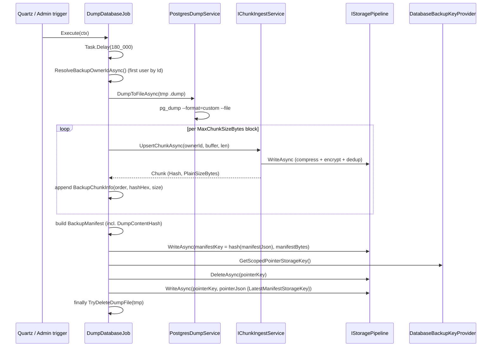
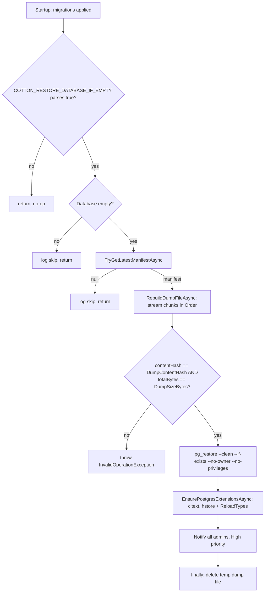
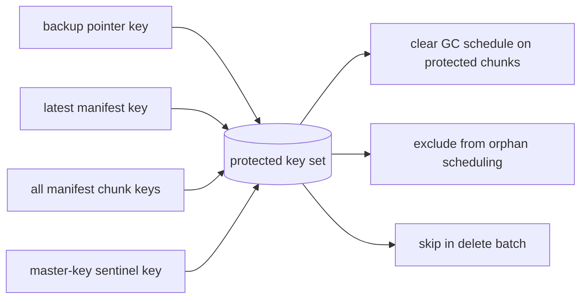

# 21. Database Backup & Auto-Restore

Cotton periodically dumps the PostgreSQL database with `pg_dump`, splits the dump into fixed-size content-addressed chunks, pushes those chunks through the same encrypted storage pipeline that holds user data, and records a JSON manifest plus a single "latest" pointer object so the backup can be discovered and rebuilt later. The manifest's chunks, the manifest object itself, and the pointer object are all marked as **protected live references** so the chunk garbage collector will never reclaim them. When an operator sets `COTTON_RESTORE_DATABASE_IF_EMPTY=true` and starts Cotton against an empty database, the server fetches the latest manifest, reassembles the dump from the stored chunks (verifying hash and size), and restores it with `pg_restore` before the application begins serving traffic. This subsystem is what makes the storage volume — not the database — the authoritative durable state of a Cotton deployment.

## Purpose & overview

Cotton's design treats the encrypted, content-addressed object store (`/app/files` on disk, or an S3 backend) as the durable source of truth. User file content, previews, avatars, the master-key sentinel, and — through this subsystem — **the database itself** all live there. The database holds the layout, manifests, ownership, users, and settings, but it can be rebuilt from a dump that is itself stored as ordinary Cotton chunks. This gives two concrete capabilities:

1. **Storage-native backups.** A scheduled Quartz job produces a `pg_dump` custom-format archive, chunks it, and stores the chunks via `IStoragePipeline`, so each backup chunk is Zstd-compressed and AES-GCM encrypted at rest exactly like any user chunk, and is automatically deduplicated against existing chunks by content hash.
2. **Zero-touch disaster recovery.** A fresh container pointed at an empty Postgres plus the existing storage volume can bootstrap itself back to the last backup at startup, with no manual `pg_restore` and no plaintext dump ever leaving the host except as a transient temp file.

The README's "Database Backup & Auto-Restore" section accurately describes the shipped behavior. The README's broader "Master Key & Deployment Security" claim that the master key "protects storage-level encrypted data and database backup artifacts" also holds: backup chunks, the manifest, and the pointer are all encrypted/located via master-key-derived material (see *How "encryption with the master-key-derived key" actually works*). The only subtle implementation details worth flagging are collected under *Non-obvious design decisions & gotchas*.

## Key components & responsibilities

| Component | File | DI lifetime | Responsibility |
| --- | --- | --- | --- |
| `DumpDatabaseJob` | `src/Cotton.Server/Jobs/DumpDatabaseJob.cs` | Quartz job | Runs `pg_dump`, chunks the dump into storage, writes the manifest + pointer. |
| `PostgresDumpService` (`IPostgresDumpService`) | `src/Cotton.Server/Services/PostgresDumpService.cs`, `src/Cotton.Server/Abstractions/IPostgresDumpService.cs` | Scoped | Wraps the `pg_dump` and `pg_restore` external processes. |
| `DatabaseBackupKeyProvider` | `src/Cotton.Server/Services/DatabaseBackupKeyProvider.cs` | Singleton | Derives the master-key-scoped storage key for the backup pointer object. |
| `DatabaseBackupManifestService` (`IDatabaseBackupManifestService`) | `src/Cotton.Server/Services/DatabaseBackupManifestService.cs`, `src/Cotton.Server/Abstractions/IDatabaseBackupManifestService.cs` | Scoped | Resolves the pointer → manifest into a `ResolvedBackupManifest`. |
| `DatabaseAutoRestoreService` (`IDatabaseAutoRestoreService`) | `src/Cotton.Server/Services/DatabaseAutoRestoreService.cs`, `src/Cotton.Server/Abstractions/IDatabaseAutoRestoreService.cs` | Scoped | Startup hook: detects empty DB, rebuilds and restores the dump, ensures extensions, notifies admins. |
| `ChunkUsageService.GetProtectedStorageKeysAsync` | `src/Cotton.Server/Services/ChunkUsageService.cs` | Scoped | Treats the pointer, manifest, and all manifest chunks as protected so GC cannot delete them. |
| Backup models | `src/Cotton.Server/Models/DatabaseBackup/DatabaseBackupModels.cs` | — | `BackupChunkInfo`, `BackupManifest`, `BackupManifestPointer`, `ResolvedBackupManifest`. |
| `GetLatestDatabaseBackupInfoQuery` / handler | `src/Cotton.Server/Handlers/Server/GetLatestDatabaseBackupInfoQuery.cs` | — | Mediator query returning `LatestDatabaseBackupDto?`. |
| `TriggerDatabaseBackupRequest` / handler | `src/Cotton.Server/Handlers/Server/TriggerDatabaseBackupRequest.cs` | — | Mediator request that fires `DumpDatabaseJob` immediately. |
| `EmergencyShutdownRequest` / handler | `src/Cotton.Server/Handlers/Server/EmergencyShutdownRequest.cs` | — | Mediator request that calls `Environment.Exit(1)`. |
| `LatestDatabaseBackupDto` | `src/Cotton.Server/Models/Dto/LatestDatabaseBackupDto.cs` | — | API payload for the latest backup. |
| `ServerController` | `src/Cotton.Server/Controllers/ServerController.cs` | — | HTTP surface for trigger / latest / emergency-shutdown. |
| Admin UI | `src/cotton.client/src/pages/admin/database-backup/AdminDatabaseBackupPage.tsx`, `src/cotton.client/src/shared/api/adminApi.ts` | — | React admin page to view/trigger backups. |

Service registrations live in `src/Cotton.Server/Program.cs`: `IPostgresDumpService`, `IDatabaseBackupManifestService`, `IDatabaseAutoRestoreService`, and `ChunkUsageService` are scoped; `DatabaseBackupKeyProvider` is a singleton.

The backup chunks themselves are written and re-read through the shared chunk-ingest and storage pipeline (`IChunkIngestService` in `src/Cotton.Server/Services/ChunkIngestService.cs`; `IStoragePipeline` / `FileStoragePipeline` with `CompressionProcessor` and `CryptoProcessor`). See the *Storage Pipeline & Processors*, *Cryptography Engine*, and *Chunk Ingest & Deduplication* sections.

## How it works — scheduled backup

### Schedule and triggering

`DumpDatabaseJob` is annotated `[JobTrigger(days: 7)]`. The `JobTriggerAttribute` (in `EasyExtensions.Quartz`, `Sources/EasyExtensions.Quartz/Attributes/JobTriggerAttribute.cs`) defaults to `startNow: true`, `repeatForever: true`, and `disallowConcurrentExecution: true`. `AddQuartzJobs()` (called in `src/Cotton.Server/Program.cs`) reflects over every `IJob` carrying the attribute and registers a Quartz **simple schedule**: `WithInterval(7 days)`, `WithMisfireHandlingInstructionFireNow()`, `RepeatForever()`, and `StartNow()`. Because `DisallowConcurrentExecution` is true, the job is registered with `.DisallowConcurrentExecution(true)`, so two backup runs cannot overlap.

Two timing details matter for operators:

- The Quartz hosted service (`AddQuartzServer` inside `AddQuartzJobs`) is configured with `WaitForJobsToComplete = false`, `AwaitApplicationStarted = true`, and `StartDelay = TimeSpan.FromSeconds(5)`.
- Inside `Execute`, the job's very first statement is `await Task.Delay(180_000)` — a hard 3-minute wait "for the server to start up and stabilize" — **before** doing any work. So even a manually triggered backup will not start producing a dump until ~3 minutes after the trigger fires.

Quartz is configured with the **in-memory** store: `AddQuartzJobs()` is called in `Program.cs` with no arguments, so its `postgresConnectionString` parameter is null and no `UsePersistentStore`/Postgres store is wired. Trigger schedules are therefore not persisted across restarts; each process start re-registers the 7-day repeating trigger fresh, starting now.

An admin can force a run via `PATCH /api/v1/server/database-backup/trigger` (`ServerController.TriggerDatabaseBackup`, decorated `[Authorize(Roles = nameof(UserRole.Admin))]`, i.e. role `"Admin"`). The handler `TriggerDatabaseBackupRequestHandler` simply calls `ISchedulerFactory.TriggerJobAsync<DumpDatabaseJob>()`. The trigger only enqueues the existing job; the 3-minute internal delay still applies and `DisallowConcurrentExecution` still prevents overlap with a run already in progress.

### Dump → chunk → manifest → pointer



Step by step (`DumpDatabaseJob.Execute`):

1. **Owner resolution.** `ResolveBackupOwnerIdAsync` selects the first user ordered by `Id` (`_dbContext.Users.AsNoTracking().OrderBy(x => x.Id)`). Chunks require an owner, so the backup chunks are attributed to that user via `ChunkOwnership`. If no user exists (or the id is `Guid.Empty`), it throws `InvalidOperationException("Cannot create backup chunks because no users exist yet.")` — a brand-new instance with no users cannot back up.
2. **Dump.** `PostgresDumpService.DumpToFileAsync` writes a temp file built by `BuildDumpFilePath` at `{Path.GetTempPath()}/cotton/db-dumps/db-{startedAtUtc:yyyyMMdd-HHmmss}-{backupId}.dump`, where `backupId = Guid.NewGuid().ToString("N")`.
3. **Chunking.** `UploadDumpWithChunkerAsync` reads the dump in fixed blocks of `MaxChunkSizeBytes` (read from server settings via `SettingsProvider.GetServerSettings().MaxChunkSizeBytes`; the job throws `InvalidOperationException("MaxChunkSizeBytes must be positive.")` if it is `<= 0`). A private `ReadExactlyAsync` helper fills each block fully, so every chunk except the last is exactly `MaxChunkSizeBytes`. Each block is fed to `IChunkIngestService.UpsertChunkAsync(ownerId, buffer, bytesRead, ct)`, which hashes (SHA-256), deduplicates, compresses, encrypts, and stores it. A running `IncrementalHash` (over the SHA-256 algorithm) over the whole dump computes `DumpContentHash`. Each stored chunk is recorded as `BackupChunkInfo(order, Hasher.ToHexStringHash(chunk.Hash), (int)chunk.PlainSizeBytes)` in increasing `Order`. If the dump produces zero blocks, a single empty chunk is upserted (`UpsertChunkAsync(ownerId, [], 0, ct)`) so the manifest always has at least one entry.
4. **Manifest.** A `BackupManifest` (`SchemaVersion: 1`, `Contains: "postgres_database_dump"`, `DumpFormat: "pg_dump_custom"`, `HashAlgorithm: Hasher.SupportedHashAlgorithm`, which resolves to the literal `"SHA256"`) is serialized with web JSON options (`new JsonSerializerOptions(JsonSerializerDefaults.Web)`). Its storage key is the **hash of the manifest bytes** (`Hasher.ToHexStringHash(Hasher.HashData(manifestBytes))`), so the manifest object is itself content-addressed, and it is written via `IStoragePipeline.WriteAsync`.
5. **Pointer.** A `BackupManifestPointer` (`SchemaVersion: 1`, `LogicalKey: DatabaseBackupKeyProvider.ManifestPointerLogicalKey` = `"database.ctn"`, `UpdatedAtUtc`, `LatestManifestStorageKey`, `LatestBackupId`) is serialized. Its storage key is **not** content-addressed; it is the fixed, master-key-scoped key from `DatabaseBackupKeyProvider.GetScopedPointerStorageKey()`. The job first `DeleteAsync(pointerKey)` then writes the new pointer — the pointer is a single mutable "latest" slot that is overwritten each backup.

Because chunk and manifest storage keys are content hashes, re-running the backup deduplicates: unchanged regions of the dump map to chunks that already exist in storage. `FileStoragePipeline.WriteAsync` checks `backend.ExistsAsync(uid)` and skips writing when the object is already present, so identical content is never re-encrypted or re-written.

### How "encryption with the master-key-derived key" actually works

There is no separate backup cipher. Confidentiality of the dump comes from two places:

- **The chunk payloads** are written through `IStoragePipeline` (`FileStoragePipeline`), whose registered processors are `CompressionProcessor` (`Priority => 10000`, Zstd) and `CryptoProcessor` (`Priority => 1000`, AES-GCM). On write the pipeline orders processors by **descending** priority (`OrderByDescending(p => p.Priority)`), so the plaintext dump bytes are compressed then AES-GCM encrypted before hitting the backend; on read it orders **ascending** (`OrderBy(p => p.Priority)`), decrypting then decompressing. Encryption uses the derived `MasterEncryptionKey` (see *Cryptography Engine* and *Storage Pipeline & Processors*). The manifest and pointer JSON objects go through the same pipeline and are likewise compressed + encrypted at rest.
- **The pointer's storage key is scoped to the master key.** `DatabaseBackupKeyProvider`:

```csharp
public const string ManifestPointerLogicalKey = "database.ctn";

public string GetScopedPointerStorageKey()
{
    string scopedLogicalKey = $"{ManifestPointerLogicalKey}:{encryptionSettings.MasterEncryptionKey}";
    return Hasher.ToHexStringHash(Hasher.HashData(Encoding.UTF8.GetBytes(scopedLogicalKey)));
}
```

`encryptionSettings.MasterEncryptionKey` is itself the subkey derived from the root `COTTON_MASTER_KEY` (`KeyDerivation.DeriveSubkeyBase64(rootMasterEncryptionKey, "CottonMasterEncryptionKey", DefaultKeyLength)` with `DefaultKeyLength = 32`, in `src/Cotton.Autoconfig/Extensions/ConfigurationBuilderExtensions.cs`; the sibling subkey `Pepper` is derived with label `"CottonPepper"`). The practical effect: the pointer for a given instance lives at a key only that master key can compute, so a different master key cannot find or clobber another instance's backup pointer in shared storage, and the same instance always resolves the same pointer key deterministically. The root `COTTON_MASTER_KEY` env var (and `COTTON_PG_PASSWORD`) are wiped from the Process and User environment after startup; only the derived `MasterEncryptionKey` lives on in `CottonEncryptionSettings`.

## How it works — startup auto-restore

Auto-restore is wired in `src/Cotton.Server/Program.cs`, after startup transition validation, after `app.MapControllers()` / `MapFallbackToFile`, after migrations, inside a service scope, executed **synchronously** before SignalR hub mapping and `app.RunAsync()`:

```csharp
app.ApplyMigrations<CottonDbContext>();
using (IServiceScope scope = app.Services.CreateScope())
{
    var autoRestore = scope.ServiceProvider.GetRequiredService<IDatabaseAutoRestoreService>();
    autoRestore.TryRestoreIfEmptyAsync().GetAwaiter().GetResult();
    scope.ServiceProvider.GetRequiredService<SettingsProvider>().GetServerSettings();
}
app.MapHub<EventHub>(Routes.V1.EventHub);
await app.RunAsync();
```



### Restore enablement and empty detection

`DatabaseAutoRestoreService.TryRestoreIfEmptyAsync`:

1. **Enablement.** `IsRestoreEnabled()` returns true only if `bool.TryParse(configuration[RestoreEnvKey])` succeeds and is `true`. The const key (`RestoreEnvKey`) is `"COTTON_RESTORE_DATABASE_IF_EMPTY"`.
2. **Empty detection** (`IsDatabaseEmptyAsync`):
   - If `__EFMigrationsHistory` has no rows → empty. (Note: migrations are applied *before* this runs, so on a real fresh start this table will already be populated; this branch primarily catches the case where the table is absent or unpopulated.)
   - Otherwise, if **both** `users` and `server_settings` have no rows → empty.
   - Otherwise → not empty, and restore is skipped with an info log.
   Table existence is probed against `information_schema.tables` filtered to `table_schema = 'public'` via a parameterized query; a missing table counts as "no rows." Row presence is checked with `SELECT EXISTS (SELECT 1 FROM public."<table>" LIMIT 1)`, and identifiers are quoted defensively via `QuoteIdentifier` (double-quote escaping). The raw connection is opened via `EnsureConnectionOpenAsync` if not already open.

This two-part check is the real safety gate: because `ApplyMigrations` always seeds `__EFMigrationsHistory`, the operative condition for "empty" at startup is "no users and no server settings." Restore therefore runs on a freshly migrated-but-unseeded database and is skipped the moment a single user or server-settings row exists, which prevents an accidental restore from overwriting a live instance.

### Rebuild, verify, restore

- `TryGetLatestManifestAsync` (`DatabaseBackupManifestService`) first calls `storage.ExistsAsync(GetScopedPointerStorageKey())`; if the pointer object is absent → `null`. Otherwise it reads and deserializes `BackupManifestPointer`. If the pointer is null or its `LatestManifestStorageKey` is blank → `null` (no warning). It then reads and deserializes the `BackupManifest` at `LatestManifestStorageKey`. If the pointer exists but the manifest cannot be loaded, it logs a warning and returns `null`. Success yields `ResolvedBackupManifest(pointer.LatestManifestStorageKey, pointer, manifest)`.
- `RebuildDumpFileAsync` writes the dump to `{Path.GetTempPath()}/cotton/db-restore/restore-{backupId}.dump`. It streams each `BackupChunkInfo` in `OrderBy(x => x.Order)`, reading each chunk through `IStoragePipeline.ReadAsync(chunk.StorageKey)` (which decrypts and decompresses), appending to an `IncrementalHash` and to the output file with a pooled 81920-byte (80 KiB) buffer. After assembly it enforces two invariants and throws if either fails:
  - `contentHash == manifest.DumpContentHash` (case-insensitive) → else `InvalidOperationException("Restored dump hash does not match backup manifest hash.")`
  - `totalBytes == manifest.DumpSizeBytes` → else `InvalidOperationException("Restored dump size does not match backup manifest size.")`
- `PostgresDumpService.RestoreFromFileAsync` first asserts the dump file exists (else `FileNotFoundException`), then runs `pg_restore --clean --if-exists --no-owner --no-privileges --no-password` against the configured DB (see argument table below). A non-zero exit code throws `InvalidOperationException` with captured stderr/stdout.
- `EnsurePostgresExtensionsAsync` runs `CREATE EXTENSION IF NOT EXISTS citext;` and `CREATE EXTENSION IF NOT EXISTS hstore;`, then, if the live connection is an `NpgsqlConnection`, calls `NpgsqlConnection.ReloadTypesAsync` so the Npgsql type cache picks up the restored custom types. The connection is opened if needed and closed afterward only if it was opened here.
- `NotifyAdminsAboutRestoreAsync` loads the ids of all `UserRole.Admin` users and sends each a `NotificationPriority.High` notification (`INotificationsProvider.SendNotificationAsync`) using `NotificationTemplates.DatabaseRestoreCompletedTitle` and `NotificationTemplates.DatabaseRestoreCompletedContent(...)`, attaching template metadata built via `NotificationTemplateMetadata.Create` with the template keys `NotificationTemplateKeys.DatabaseRestoreCompletedTitle` (`notifications:server.databaseRestoreCompleted.title`) and `...Content` (`notifications:server.databaseRestoreCompleted.content`). The metadata dictionary includes `backupId`, `sourceDatabase`, `sourceHost`, `sourcePort`, `serverTimezone`, `manifestStorageKey`, and both ISO-8601 (`createdAtUtc`, `createdAtLocal`, `restoreCompletedUtc`, `restoreCompletedLocal`) and display-formatted (`backupCreatedUtc`, `backupCreatedLocal`, `restoreCompletedUtcDisplay`, `restoreCompletedLocalDisplay`) timestamps. The server timezone comes from `ResolveServerTimeZoneAsync`, which reads the latest `ServerSettings.Timezone` (ordered by `CreatedAt` descending) and falls back to `TimeZoneInfo.Utc` when missing or unparseable. If there are no admins, it logs a warning and sends nothing.
- A `finally` block always deletes the temp restore file via `TryDeleteDumpFile` (best-effort, swallows errors).

Because this all runs synchronously with `.GetAwaiter().GetResult()` before the host starts serving requests, a failed restore (e.g. hash/size mismatch or a `pg_restore` error) throws out of `Main` and the process fails to start — restore is fail-closed.

## Protection from garbage collection

The chunk GC (`GarbageCollectorJob`, `[JobTrigger(hours: 6)]`, see *Garbage Collection*) must never delete backup artifacts. Protection is centralized in `ChunkUsageService.GetProtectedStorageKeysAsync`, which builds a case-insensitive (`StringComparer.OrdinalIgnoreCase`) set of protected storage keys:

- the backup **pointer** key (`GetScopedPointerStorageKey()`), always;
- the **master-key sentinel** key (`MasterKeySentinelStore.SentinelStorageKey`), always;
- if the pointer object exists, the **latest manifest** storage key plus **every non-empty chunk** `StorageKey` listed in that manifest.

A critical fail-safe: if the pointer object exists but `TryGetLatestManifestAsync` returns `null`, the method **throws**:

> `"Database backup pointer exists, but the latest backup manifest could not be resolved. Aborting chunk garbage collection to avoid deleting backup data."`

This deliberately aborts the entire GC pass rather than risk reclaiming chunks that a (currently unreadable) backup still references.

`GarbageCollectorJob.RunOnceAsync` resolves the protected set once per pass and consumes it at three points (`src/Cotton.Server/Jobs/GarbageCollectorJob.cs`):

- `ClearGcSchedulesForProtectedChunksAsync` (via `ClearSchedulesForReferencedChunksAsync`) clears any pending `GCScheduledAfter` on protected chunks, so a chunk that becomes a backup chunk is un-scheduled from deletion;
- `WhereNotProtectedByStorageKeys` excludes protected chunks when scheduling orphans in `ScheduleOrphanedChunksAsync`;
- the delete path double-checks `protectedStorageKeys.Contains(uid)` — first in `DeleteScheduledChunksAsync` (where matches are routed back through schedule-clearing instead of deletion) and again in `DeleteEligibleBatchAsync` before the actual `ChunkOwnerships`/`Chunks` deletes and storage `DeleteAsync`.

Mapping storage keys back to chunk hashes uses `Hasher.FromHexStringHash` inside `GetChunkHashesFromStorageKeys`. **Note:** the pointer, sentinel, and manifest keys are themselves SHA-256 hex strings (64 chars, produced by `Hasher.ToHexStringHash(Hasher.HashData(...))`), so `FromHexStringHash` parses them successfully into 32-byte arrays — it does *not* throw for them. They are still safe because those byte arrays simply never equal any real `Chunk.Hash` (no stored chunk content hashes to the manifest-pointer or sentinel logical strings), so the database "protected hash" filters never match a live chunk. Only the manifest's listed chunk keys are real `Chunk.Hash` values that match and must be excluded. `GetChunkHashesFromStorageKeys` does wrap `FromHexStringHash` in a `try/catch (ArgumentException)` for non-hash-shaped keys, but that catch is defensive and is not exercised by the backup-protection key set, which is entirely 64-char hex. The delete loop also protects at the raw storage-key layer (`protectedStorageKeys.Contains(uid)`), so even keys that are not chunk-hash-shaped would be skipped at delete time. The same protected-key set is also consumed by the GC timeline analytics (`GetGcChunksTimelineQuery`, which calls `GetProtectedStorageKeysAsync` and feeds it into `BuildGcBaseQuery`), so the admin "pending GC" figures exclude protected backup data.



## Data structures, types, configuration, defaults

### Backup models (`Models/DatabaseBackup/DatabaseBackupModels.cs`)

All four are `sealed record` types.

| Type | Fields (in declaration order) |
| --- | --- |
| `BackupChunkInfo` | `int Order`, `string StorageKey` (hex content hash), `int SizeBytes` (plain size). |
| `BackupManifest` | `int SchemaVersion`, `string BackupId`, `DateTime CreatedAtUtc`, `string Contains`, `string DumpFormat`, `string SourceDatabase`, `string SourceHost`, `string SourcePort`, `string HashAlgorithm`, `int ChunkSizeBytes`, `long DumpSizeBytes`, `string DumpContentHash`, `int ChunkCount`, `TimeSpan Elapsed`, `IReadOnlyList<BackupChunkInfo> Chunks`. |
| `BackupManifestPointer` | `int SchemaVersion`, `string LogicalKey` (`"database.ctn"`), `DateTime UpdatedAtUtc`, `string LatestManifestStorageKey`, `string LatestBackupId`. |
| `ResolvedBackupManifest` | `string ManifestStorageKey`, `BackupManifestPointer Pointer`, `BackupManifest Manifest`. |

Constant values emitted by `DumpDatabaseJob`: `SchemaVersion = 1`, `Contains = "postgres_database_dump"`, `DumpFormat = "pg_dump_custom"`, `HashAlgorithm = Hasher.SupportedHashAlgorithm` (= `"SHA256"`). `SourceDatabase` / `SourceHost` / `SourcePort` come from the `DatabaseSettings:*` config via the job's `GetConfigOrDefault` with fallbacks `"cotton_dev"`, `"localhost"`, `"5432"` respectively (these defaults are only used if the config key is blank; in normal operation they are already populated from `COTTON_PG_*`). `ChunkSizeBytes` records the `MaxChunkSizeBytes` used at dump time; `DumpSizeBytes` is the on-disk dump length; `Elapsed` is the wall-clock time of the dump+upload phase.

### `LatestDatabaseBackupDto` (`Models/Dto/LatestDatabaseBackupDto.cs`)

A plain `class` of `get; set;` properties. The query handler maps it from the resolved manifest/pointer:

| Field | Type | Source |
| --- | --- | --- |
| `BackupId` | `string` | `Manifest.BackupId` |
| `CreatedAtUtc` | `DateTime` | `Manifest.CreatedAtUtc` |
| `PointerUpdatedAtUtc` | `DateTime` | `Pointer.UpdatedAtUtc` |
| `DumpSizeBytes` | `long` | `Manifest.DumpSizeBytes` |
| `ChunkCount` | `int` | `Manifest.ChunkCount` |
| `DumpContentHash` | `string` | `Manifest.DumpContentHash` |
| `SourceDatabase` / `SourceHost` / `SourcePort` | `string` | `Manifest.Source*` |

### `pg_dump` / `pg_restore` invocation (`PostgresDumpService`)

Both processes run with `UseShellExecute = false`, `CreateNoWindow = true`, redirected stdout/stderr, and `PGPASSWORD` injected via `ProcessStartInfo.Environment` (never on the command line). Arguments are added via `ArgumentList`, so they are not subject to shell quoting. Connection settings come from required config keys `DatabaseSettings:{Host,Port,Database,Username,Password}` (read by `ReadDbSettings`; a missing/blank key throws `InvalidOperationException`, and a non-`ushort` port throws `InvalidOperationException("DatabaseSettings:Port must be a valid unsigned 16-bit integer.")`). On cancellation each call kills the entire process tree (`TryKillProcess`, `process.Kill(entireProcessTree: true)`).

| Operation | Fixed arguments (in order) |
| --- | --- |
| `pg_dump` | `--format=custom --no-password --host <h> --port <p> --username <u> --dbname <db> --file <out>` |
| `pg_restore` | `--clean --if-exists --no-owner --no-privileges --no-password --host <h> --port <p> --username <u> --dbname <db> <in>` |

`--format=custom` is required so the dump can be restored with `pg_restore`; `--clean --if-exists` drops existing objects first (relevant if restore ever runs against a partially populated DB), and `--no-owner --no-privileges` make the dump portable across roles. `pg_dump` and `pg_restore` must be on the container `PATH`; they are invoked by bare name (`FileName = "pg_dump"` / `"pg_restore"`).

### Configuration & environment

| Key | Where | Default | Effect |
| --- | --- | --- | --- |
| `COTTON_RESTORE_DATABASE_IF_EMPTY` | env / config | unset (treated as false) | When it parses to `true`, enables startup auto-restore. |
| `DatabaseSettings:Host` / `:Port` / `:Database` / `:Username` / `:Password` | config (populated from `COTTON_PG_HOST/PORT/DATABASE/USERNAME/PASSWORD`) | `localhost` / `5432` / `cotton_dev` / `postgres` / `postgres` | Connection for `pg_dump`/`pg_restore`; password also used by the EF connection. `COTTON_PG_PASSWORD` is wiped from the env after startup. |
| `MaxChunkSizeBytes` (server settings) | DB-backed server settings (`SettingsProvider.GetServerSettings()`) | per server settings | Block size used when chunking the dump; must be positive. |
| `COTTON_MASTER_KEY` (root) | env (consumed and wiped at startup) | — must be exactly 32 chars | Root key from which `MasterEncryptionKey` (label `"CottonMasterEncryptionKey"`) and `Pepper` (label `"CottonPepper"`) are derived; scopes the pointer key and encrypts all chunks. |
| `[JobTrigger(days: 7)]` | `DumpDatabaseJob` | every 7 days, start now, repeat forever, no concurrent execution | Backup cadence. |

### Temp paths

| Phase | Path pattern |
| --- | --- |
| Dump (backup) | `{Path.GetTempPath()}/cotton/db-dumps/db-{yyyyMMdd-HHmmss}-{backupId}.dump` |
| Restore | `{Path.GetTempPath()}/cotton/db-restore/restore-{backupId}.dump` |

Both directories are created on demand (`Directory.CreateDirectory`) and both files are best-effort deleted in a `finally` (`TryDeleteDumpFile`).

## Server handlers & HTTP surface

All three handlers live in `src/Cotton.Server/Handlers/Server/` and run through the EasyExtensions mediator pipeline (`IMediator.Send`); they are invoked from `ServerController`, which is decorated `[ApiController]` and `[Route(Routes.V1.Server)]` — `Routes.V1.Server` = `/api/v1` + `/server` = `/api/v1/server` (`src/Cotton.Shared/Routes.cs`).

| Handler | Endpoint | Auth | Behavior |
| --- | --- | --- | --- |
| `GetLatestDatabaseBackupInfoQueryHandler` | `GET /api/v1/server/database-backup/latest` | `Admin` | Resolves the latest manifest → `LatestDatabaseBackupDto`; controller returns `404 NotFound` when the query result is `null` (no backup yet), else `200 OK`. |
| `TriggerDatabaseBackupRequestHandler` | `PATCH /api/v1/server/database-backup/trigger` | `Admin` | `ISchedulerFactory.TriggerJobAsync<DumpDatabaseJob>()`; controller returns `200 OK`. |
| `EmergencyShutdownRequestHandler` | `POST /api/v1/server/emergency-shutdown` | `Admin` | Calls `Environment.Exit(1)` (hard process exit, non-zero code). |

All three controller actions use `[Authorize(Roles = nameof(UserRole.Admin))]` (role string `"Admin"`).

`EmergencyShutdownRequest` is in scope here because it shares the Server handlers folder and is an operator disaster-recovery lever (force the process down, e.g. for a planned restore/restart), but it has **no backup-specific logic**: the handler just exits the process with code 1 and returns `Task.CompletedTask`. There is currently **no client UI** that calls `emergency-shutdown`; it is a backend-only endpoint.

(For context, the same `ServerController` also exposes `GET info`, `GET security/status`, `PATCH gc/trigger`, and `GET gc/chunks/timeline`; only the three above are part of this subsystem.)

## Admin backup UI surface

The admin page is `src/cotton.client/src/pages/admin/database-backup/AdminDatabaseBackupPage.tsx`, lazily loaded and mounted at the admin route `database-backup` (`src/cotton.client/src/app/routes.tsx`). It uses React Query hooks `useLatestDatabaseBackupQuery` and `useTriggerDatabaseBackupMutation` (`src/cotton.client/src/shared/api/queries/admin.ts`) over `adminApi.getLatestDatabaseBackup` / `adminApi.triggerDatabaseBackup` (`src/cotton.client/src/shared/api/adminApi.ts`).

Behavior:

- `getLatestDatabaseBackup` calls `GET server/database-backup/latest` and maps an axios `404` to `null` (`error.response?.status === 404`), so the UI shows an empty-state info alert (`databaseBackup.state.empty`) when no backup exists yet.
- The page renders cards for backup id (monospace), created-at, pointer-updated-at, dump size (`formatBytes`), chunk count, dump content hash (monospace), source database, and source host. Timestamps are parsed with a local `formatDateTime` helper that appends `Z` if the value has no explicit timezone, then formats in the browser's locale/timezone. `sourcePort` is present in the DTO but not rendered as a card.
- A **Trigger** button (`databaseBackup.actions.trigger`) calls `PATCH server/database-backup/trigger` and toasts success (`databaseBackup.state.triggerSuccess`); a **Refresh** button (`databaseBackup.actions.refresh`) refetches the latest backup. A persistent info alert reminds operators about the restore-if-empty behavior (`databaseBackup.state.restoreIfEmptyHint`, which mentions `COTTON_RESTORE_DATABASE_IF_EMPTY=true` and that the DB must be empty). All localized strings live under the `databaseBackup.*` keys in the `admin` namespace of `src/cotton.client/src/locales/<lang>.json` (e.g. `en.json`).

The DTO interface mirrored on the client (`LatestDatabaseBackupDto` in `adminApi.ts`) types `sourcePort` as `number`, whereas the server DTO and manifest model it as a `string`; in practice the JSON value is the configured port string (e.g. `"5432"`), and the UI does not render that field, so the type mismatch is inconsequential at runtime.

## Concurrency, failure modes, edge cases, security

- **No users → no backup.** `ResolveBackupOwnerIdAsync` throws if there are zero users (or only `Guid.Empty`), because chunks need an owner. Backups only begin after the first admin exists.
- **Restore is fail-closed and blocks startup.** It runs synchronously before the host serves traffic; integrity-check failure (hash or size mismatch) or `pg_restore` failure throws and the process does not start.
- **GC abort on unresolved pointer.** A present-but-unreadable pointer aborts the whole GC pass (and the GC timeline query) to avoid deleting backup chunks (see *Protection from garbage collection*).
- **Single mutable pointer.** Each backup `DeleteAsync` + `WriteAsync` the same pointer key. Only the latest backup's manifest and chunks are protected; manifests and chunks unique to **older** backups lose protection once the pointer advances and become eligible for GC. There is no retention of multiple historical backups — "latest" is the only first-class backup.
- **Concurrency.** `DisallowConcurrentExecution = true` prevents overlapping dump jobs. Chunk ingest itself is concurrency-safe (`ChunkIngestService` handles unique-violation races via `IsConcurrentChunkUpsertConflict` and waits out in-flight GC deletes via `WaitForGarbageCollectionAsync`).
- **Master-key coupling.** Restore (and even discovering the pointer) requires the correct master key: the pointer key is derived from `MasterEncryptionKey`, and the chunk payloads are AES-GCM encrypted with it. A lost master key means the backup cannot be located or decrypted — consistent with the README's "Lost key warning" that encrypted Cotton data can become unrecoverable.
- **Plaintext exposure window.** The dump exists in plaintext as a temp file only during dump/restore and is deleted in `finally`. `PGPASSWORD` is passed via the process environment, not the argv, so it does not appear in process listings; however, failure messages do include captured `pg_dump`/`pg_restore` stderr/stdout, which could surface schema/object names in logs.
- **Integrity guarantees.** Restore verifies both the whole-dump SHA-256 content hash and the total byte count against the manifest before invoking `pg_restore`, catching truncated or tampered chunk reassembly.
- **In-memory Quartz store.** Trigger schedules are not persisted; a restart re-arms the 7-day trigger from `StartNow`. Combined with the internal 3-minute delay, expect the first backup of a given process lifetime roughly 3 minutes after start.

## Non-obvious design decisions & gotchas

- **The 3-minute internal delay** (`Task.Delay(180_000)`) is the first statement in `DumpDatabaseJob.Execute` and applies to manual triggers too. An admin pressing "Trigger" will not see a new backup appear immediately.
- **Empty-detection precedence is migration-then-data.** Since migrations run before restore, the effective "empty" predicate is "no `users` and no `server_settings` rows." This is what lets a freshly migrated container still auto-restore.
- **`server_settings` is read twice on a restored DB** — once via `ResolveServerTimeZoneAsync` in the restore notification, and again by the `SettingsProvider.GetServerSettings()` warm-up call immediately after restore in `Program.cs`. On a just-restored DB those rows now exist.
- **Manifest is content-addressed, pointer is not.** The manifest object's key is the hash of its own bytes (immutable, dedup-friendly), while the pointer is a fixed master-scoped key that is `DeleteAsync`-ed then re-written each run.
- **Protected keys are SHA-256-shaped but harmless as chunk hashes.** The pointer/sentinel/manifest keys are valid 64-char hex and parse into byte arrays, but they never equal a real `Chunk.Hash`; protection ultimately relies on storage-key-level `Contains` checks in the delete loop, not on `FromHexStringHash` throwing.
- **`EmergencyShutdownRequest` does `Environment.Exit(1)`** with no graceful drain. It is intended as a break-glass control, not a normal shutdown path, and is not surfaced in the UI.
- **Scope-assignment note:** `RestoreOutcomeDto` (`src/Cotton.Server/Models/Dto/RestoreOutcomeDto.cs`) and its `RestoreStatus` / `RestoreConflictKind` enums belong to **trash/node/file restore** (used by `RestoreNodeQuery`, `RestoreFileQuery`, `TrashRestoreCoordinator`, `LayoutController`, `FileController`, and the trash UI), not to database backup/restore. Database backup/restore has no DTO of its own beyond `LatestDatabaseBackupDto`. Those types are documented in the *Trash & Restore* section, not here.

## Related sections

- *Cryptography Engine* — AES-GCM streaming cipher, `MasterEncryptionKey` derivation, the master-key sentinel.
- *Storage Pipeline & Processors* — `IStoragePipeline` / `FileStoragePipeline`, `CompressionProcessor` (Zstd, priority 10000) and `CryptoProcessor` (AES-GCM, priority 1000), content-addressed write/read and existence-based dedup.
- *Chunk Ingest & Deduplication* — `IChunkIngestService.UpsertChunkAsync`, ownership, GC-wait coordination.
- *Garbage Collection* — `GarbageCollectorJob`, `ChunkUsageService`, how protected storage keys gate reclamation.
- *Background Jobs & Scheduling* — the Quartz `[JobTrigger]` model and in-memory scheduling.
- *Startup & Lifecycle* — migration application, master-key unlock, and where auto-restore sits in `Program.cs`.
- *Trash & Restore* — `RestoreOutcomeDto`, node/file restore (unrelated to database restore despite the name overlap).
