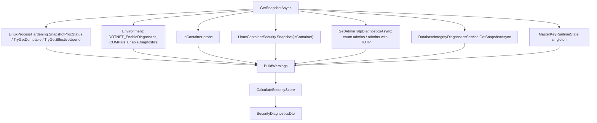
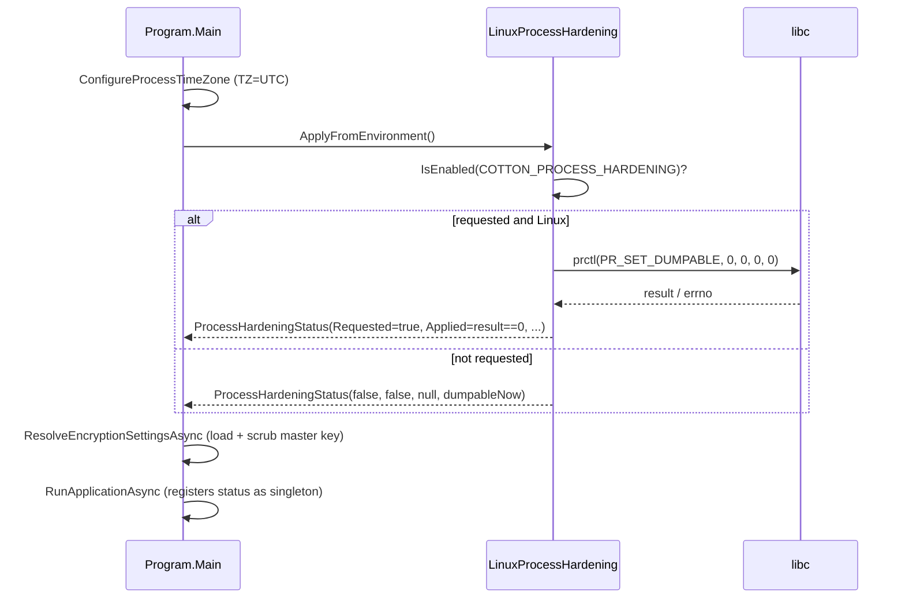
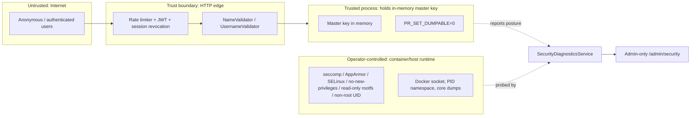

# 22. Security Hardening, Diagnostics & Validation

Cotton Cloud is a self-hosted system that holds encrypted user data and, in normal operation, keeps a master-derived key in process memory while the server runs. This section documents the three defense-in-depth layers that protect that posture: a read-only **security check-up** that scores a running instance and explains concrete misconfigurations to operators (`SecurityDiagnosticsService`), the **runtime hardening** applied at process start and the procfs/sysfs probes that report it (`LinuxProcessHardening`, `LinuxContainerSecurity`), and the **input-hygiene** layer that normalizes and validates every file/folder name and username before it touches the database (`Cotton.Validators`). It closes with the system-wide threat model and trust boundaries these pieces serve.

## Purpose & overview

The hardening subsystem assumes a hostile-internet deployment and a master key that lives in memory while the process runs. Its goals are:

1. **Tell operators the truth about their deployment.** The instance cannot fix its own container runtime, kernel knobs, or compose file, so `SecurityDiagnosticsService` reads those facts at request time, turns each risky one into a coded warning with a severity, and produces a 0–10 score the admin UI renders. It is explicitly an operator-only check, not a public healthcheck.
2. **Shrink the window in which the in-memory key can be exfiltrated.** `LinuxProcessHardening` requests `PR_SET_DUMPABLE=0` at startup; the diagnostics layer additionally flags `.NET` diagnostics endpoints, core-dump configuration, `CAP_SYS_PTRACE`, the Docker socket, host PID namespace sharing, and writable root filesystems — all of which are paths to reading another process's (or this process's) memory.
3. **Keep adversarial names out of the namespace.** `NameValidator` and `UsernameValidator` reject control characters, zero-width/format trickery, path traversal, Windows-reserved names, and oversized inputs, and `NameValidator` derives a case-folded, diacritic-stripped `NameKey` so sibling-collision checks are homograph-resistant.

## Key components & responsibilities

| Component | File | Responsibility |
|---|---|---|
| `SecurityDiagnosticsService` | `src/Cotton.Server/Services/SecurityDiagnosticsService.cs` | Builds the full diagnostics snapshot, derives warnings, computes the score. Registered scoped in `Program.cs`. |
| `LinuxProcessHardening` | `src/Cotton.Server/Services/LinuxProcessHardening.cs` | Applies `PR_SET_DUMPABLE=0` from env at startup; reads `geteuid`, `/proc/self/status`, dumpable flag, effective capabilities. Static class. |
| `LinuxContainerSecurity` | `src/Cotton.Server/Services/LinuxContainerSecurity.cs` | Reads container boundary facts from procfs/sysfs: rootfs mount options, Docker socket, host PID namespace heuristic, core-dump limits, `core_pattern`, AppArmor/SELinux LSM context. Static class. |
| `MasterKeyRuntimeState` | `src/Cotton.Server/Services/MasterKeyRuntimeState.cs` | Immutable record (registered as a singleton) recording how the master key was supplied (`Unlock` vs `Environment`) and whether `COTTON_MASTER_KEY` survived scrubbing. |
| `ProcessHardeningStatus` | `src/Cotton.Server/Services/LinuxProcessHardening.cs` | Record `(Requested, Applied, Error, DumpableAfter)` produced at startup and registered as a singleton. |
| `DatabaseIntegrityDiagnosticsService` | `src/Cotton.Server/Services/DatabaseIntegrity/DatabaseIntegrityDiagnosticsService.cs` | Counts unsigned/stale protected rows for the integrity warnings (see *Database Integrity*). |
| `SecurityDiagnosticsDto` and nested DTOs | `src/Cotton.Server/Models/Dto/SecurityDiagnosticsDto.cs` | The API payload shape. |
| `ServerController.GetSecurityDiagnostics` | `src/Cotton.Server/Controllers/ServerController.cs` | `GET /api/v1/server/security/status`, admin-only. |
| `Constants.IsPublicInstance` | `src/Cotton.Shared/Constants.cs` | Public/demo flag parsed from `COTTON_PUBLIC_INSTANCE`. |
| `AdminSecurityDiagnosticsPage` | `src/cotton.client/src/pages/admin/security/AdminSecurityDiagnosticsPage.tsx` | Renders score, warnings, threat-vector copy, and per-field diagnostic rows. |
| `NameValidator` | `src/Cotton.Validators/NameValidator.cs` | File/folder name policy + `NameKey` folding. |
| `UsernameValidator` | `src/Cotton.Validators/UsernameValidator.cs` | Account username policy. |
| `AuthHardeningExtensions` | `src/Cotton.Server/Extensions/AuthHardeningExtensions.cs` | Rate limiting + session-token revocation (cross-cutting; see *Authentication & Sessions*). |

## Security diagnostics

### Endpoint and access control

The snapshot is exposed at `GET /api/v1/server/security/status` (`ServerController.GetSecurityDiagnostics`), guarded by `[Authorize(Roles = nameof(UserRole.Admin))]`. The controller route prefix is `Routes.V1.Server` (`src/Cotton.Shared/Routes.cs`), which resolves to `/api/v1/server`, and the action is `[HttpGet("security/status")]`. The frontend calls it as `server/security/status` via `adminApi.getSecurityDiagnostics` (`src/cotton.client/src/shared/api/adminApi.ts`) and the `useSecurityDiagnosticsQuery` hook (`src/cotton.client/src/shared/api/queries/admin.ts`). There is no anonymous variant — the snapshot deliberately leaks deployment posture, so it is admin-only by design. The README explicitly notes it is intentionally **not** public: "it is an operator check, not a healthcheck endpoint."

### How the snapshot is assembled

`GetSnapshotAsync(CancellationToken)` gathers raw signals, packs them into typed DTO sub-objects, builds the warning list, then computes the score:

Container detection (`IsContainer`) returns true when any of these hold: `DOTNET_RUNNING_IN_CONTAINER == "true"` (case-insensitive); `/.dockerenv` exists; or `/proc/1/cgroup` exists and any line contains `docker`, `kubepods`, or `containerd` (case-insensitive). If `/proc/1/cgroup` does not exist and neither earlier check matched, it returns false.

### The score

`CalculateSecurityScore` starts at **10** and subtracts a per-warning penalty by severity:

| Severity | Penalty | UI color (`getSeverityColor`) |
|---|---|---|
| `critical` | 3 | error (red) |
| `warning` | 2 | warning (amber) |
| `info` | 1 | info (blue) |
| anything else | 0 | info |

The result is clamped to a floor of 0: `Math.Max(0, 10 - penalty)`. `MaxSecurityScore` is fixed at 10 in the DTO. The UI helper `getSecurityLevel` normalizes `(score / maxScore) * 10` into five bands: ≥9 *strong* (success), ≥7 *good* (success), ≥5 *home* (warning), ≥3 *exposed* (warning), else *unsafe* (error). The exact title/summary strings are localized under `securityDiagnostics.levels.*`.

### Warning vectors

`BuildWarnings` invokes a fixed sequence of detectors in this order: public-instance, master-key, admin-TOTP, .NET diagnostics, temp-directory, Linux-process group (`AddLinuxProcessWarnings`), Linux-container group (`AddLinuxContainerWarnings`), hardening-failure, and database-integrity. Each detector emits at most one `SecurityDiagnosticWarningDto { Code, Severity, Message }`. The complete catalog:

| Code | Severity | Trigger condition | Notes |
|---|---|---|---|
| `public-instance` | warning | `Constants.IsPublicInstance` (env `COTTON_PUBLIC_INSTANCE` parses to `true`) | Public/demo account creation is on. |
| `master-key-from-environment` | warning | `MasterKeyRuntimeState.EnvironmentVariableWasConfigured` | Key came from `COTTON_MASTER_KEY`; container metadata may still expose it. |
| `admins-without-2fa` | warning | `AdminTotpDiagnosticsDto.AdminsWithoutTotp > 0` | Message reads "N of M admin accounts do not have 2FA enabled." |
| `dotnet-diagnostics-enabled` | warning | `.NET` diagnostics **not** disabled | See OR semantics below. |
| `temp-directory-not-writable` | **critical** | `Path.GetTempPath()` cannot create/write/delete a probe file | Blocks startup too; mount writable scratch storage at `/tmp` (`tmpfs` or a fast-disk bind mount). |
| `process-dumpable` | warning | `LinuxProcessSecurityDto.Dumpable != 0` (Linux only) | Recommends `COTTON_PROCESS_HARDENING=true`. |
| `sys-ptrace-capability` | **critical** | `HasSysPtraceCapability == true` (Linux only) | `CAP_SYS_PTRACE` effective. Skipped when the value is `null` (unparseable `CapEff`). |
| `new-privileges-allowed` | warning if container, else info | `NoNewPrivileges == 0` (Linux only) | Recommends `no-new-privileges:true`. |
| `seccomp-disabled` | warning | `SeccompMode == 0` (Linux only) | Avoid `seccomp=unconfined`. |
| `running-as-root` | info | `RunningAsRoot == true` (Linux only) | `euid == 0`. |
| `root-filesystem-writable` | info | container AND `RootFilesystemReadOnly == false` | Recommends `read_only: true` plus writable `/app/files` and writable `/tmp`. |
| `docker-socket-mounted` | **critical** | container AND `DockerSocketMounted` | Effectively host-root from the web process. |
| `host-pid-namespace` | **critical** | container AND `HostPidNamespaceLikely == true` | Remove `pid: host`. |
| `mandatory-access-control-unconfined` | warning | container AND no enforcing AppArmor/SELinux detected | See MAC logic below. |
| `core-dumps-enabled` | warning | `CoreDumpSoftLimitDisabled == false` AND `Dumpable != 0` (Linux only) | Set `ulimit core=0`. Runs on any Linux host, not only containers. |
| `process-hardening-failed` | warning | `HardeningRequested && !HardeningApplied` | Message is `HardeningError` when present, else a generic fallback. |
| `db-integrity-unsigned-rows` | **critical** | `UnsignedProtectedRows > 0` | Restore affected rows from backup or run the required transition version before upgrading. |

Important guards:

- The temp-directory check runs on every platform because it validates the active OS temp path, not a Linux-only hardening signal.
- All Linux process warnings (`AddLinuxProcessWarnings`: dumpable, ptrace, no-new-privileges, seccomp, root) and all container warnings (`AddLinuxContainerWarnings`) are skipped entirely unless `OperatingSystem.IsLinux()`. On Windows/macOS those vectors never fire and the corresponding fields are `null`.
- The four container-only checks (`root-filesystem-writable`, `docker-socket-mounted`, `host-pid-namespace`, `mandatory-access-control-unconfined`) require `isContainer == true`. The core-dump check (`AddCoreDumpLimitWarning`) runs on any Linux host regardless of `isContainer`.
- The ptrace check uses `HasSysPtraceCapability != true` to decide skipping, so a `null` (unknown) value never raises the critical warning.

#### .NET diagnostics OR semantics

`dotnetDiagnosticsDisabled = IsZero(DOTNET_EnableDiagnostics) || IsZero(COMPlus_EnableDiagnostics)` where `IsZero` is an exact ordinal match to `"0"`. The `dotnet-diagnostics-enabled` warning fires only when **neither** variable is `"0"`. This means setting **either** variable to `0` suppresses the warning, which is slightly permissive: if `DOTNET_EnableDiagnostics=0` but `COMPlus_EnableDiagnostics=1` it still reports "disabled" and stays quiet. Operators should set `DOTNET_EnableDiagnostics=0` (the official image does). Disabling .NET diagnostics turns off the debugger attach, profiler, EventPipe, and dump-collection endpoints — all in-memory-secret read vectors.

#### Mandatory-access-control logic

`AddMandatoryAccessControlWarning` reads the single value `/proc/self/attr/current` (captured once by `LinuxContainerSecurity.Snapshot`). `LinuxContainerSecurity` classifies it: a value containing a `:` is treated as an SELinux context (`SelinuxContext`), otherwise as an AppArmor profile name (`AppArmorProfile`). The warning is **suppressed** only when all three hold: a MAC profile is present (`AppArmorProfile` or `SelinuxContext` non-empty), the AppArmor profile does not start with `unconfined` (case-insensitive), and SELinux is not permissive (`SelinuxEnforcing != false`). SELinux enforcing state comes from `/sys/fs/selinux/enforce` (`0` → false, `1` → true, anything else → null).

#### Database-integrity strict mode

`DatabaseIntegrityDiagnosticsService.GetSnapshotAsync` returns a DTO with `Enabled = true` and **`BridgeBackfillEnabled = false` hardcoded**. `UnsignedProtectedRows` is a live count, summed across every registered descriptor, of protected rows whose MAC property (`IntegrityMac` column, `DatabaseIntegrityColumns.MacProperty`) is null or whose version property (`IntegrityVersion`, `DatabaseIntegrityColumns.VersionProperty`) differs from the descriptor `SchemaVersion`. Those rows are hard failures at read boundaries and during save-time original-state verification. `ProtectedEntityTypes` is the count of descriptors in `IDatabaseIntegrityDescriptorRegistry.All` (currently 14). See the *Database Integrity* section for the signing model and the startup transition guard that blocks unsafe upgrades before normal traffic is served.

### SecurityDiagnosticsDto shape

`SecurityDiagnosticsDto` (init-only properties, serialized camelCase to the client) aggregates:

| Field | Type | Source |
|---|---|---|
| `OperatingSystem` | string | `Environment.OSVersion.ToString()` |
| `IsLinux` | bool | `OperatingSystem.IsLinux()` |
| `IsContainer` | bool | `IsContainer()` probe |
| `IsPublicInstance` | bool | `Constants.IsPublicInstance` |
| `SecurityScore` / `MaxSecurityScore` | int / int (=10) | computed / constant |
| `MasterKeySource` | string | `"Unlock"` or `"Environment"` |
| `MasterKeyEnvironmentVariableWasConfigured` | bool | key supplied via env |
| `MasterKeyEnvironmentVariablePresentInProcess` | bool | env var survived after resolution (`EnvironmentVariablePresentAfterResolution`) |
| `DotNetDiagnostics` | `DotNetDiagnosticsDto` | `Disabled`, raw `DotNetEnableDiagnostics`, `ComPlusEnableDiagnostics` |
| `LinuxProcess` | `LinuxProcessSecurityDto` | hardening status + procfs facts |
| `LinuxContainer` | `LinuxContainerSecurityDto` | container boundary facts |
| `AdminTotp` | `AdminTotpDiagnosticsDto` | `AdminCount`, `AdminsWithTotp`, `AdminsWithoutTotp` |
| `DatabaseIntegrity` | `DatabaseIntegrityDiagnosticsDto` | `Enabled`, `BridgeBackfillEnabled`, `ProtectedEntityTypes`, `UnsignedProtectedRows` |
| `Warnings` | `IReadOnlyList<SecurityDiagnosticWarningDto>` | the catalog above |

`LinuxProcessSecurityDto` carries `HardeningRequested`, `HardeningApplied`, `HardeningError`, `Dumpable` (`int?`), `EffectiveUserId` (`uint?`), `RunningAsRoot` (`bool?`), `NoNewPrivileges` (`int?`), `SeccompMode` (`int?`), `SeccompFilters` (`int?`), `EffectiveCapabilitiesHex` (`string?`), `HasSysPtraceCapability` (`bool?`). `LinuxContainerSecurityDto` carries `RootFilesystemReadOnly` (`bool?`), `DockerSocketMounted` (`bool`), `HostPidNamespaceLikely` (`bool?`), `ProcOneCommandLine` (`string?`), `CoreDumpSoftLimit`/`CoreDumpHardLimit` (strings, e.g. `"unlimited"`), `CoreDumpSoftLimitDisabled` (`bool?`), `CorePattern` (`string?`), `AppArmorProfile` (`string?`), `SelinuxContext` (`string?`), `SelinuxEnforcing` (`bool?`). `SecurityDiagnosticWarningDto` is a class with `Code`, `Severity`, and `Message` strings.

### Admin security page

`AdminSecurityDiagnosticsPage` (route `/admin/security`, registered in `src/cotton.client/src/app/routes.tsx` and linked from `src/cotton.client/src/pages/admin/AdminLayoutPage.tsx`) consumes the snapshot via `useSecurityDiagnosticsQuery` and renders, in order: a score summary (`Alert` + `LinearProgress` with the level band from `getSecurityLevel`, including summary chips for public-vs-private, env-key-vs-memory-unlock, and admin-TOTP coverage), the risk list (`SecurityRiskSection`), and per-field diagnostic sections — `InstanceDiagnosticsSection`, `MasterKeyDiagnosticsSection`, `MemoryDiagnosticsSection`, `ContainerDiagnosticsSection`, `RuntimeDiagnosticsSection`.

The page maintains its **own** allow-list `knownThreatVectorCodes` (a `Set` of all 17 codes) and looks up localized "threat vector" explanation copy via `securityDiagnostics.threatVectors.${warning.code}` only when `knownThreatVectorCodes.has(warning.code)` (`getThreatVector`). If the backend ever introduces a new warning code that is not added to this client-side set, the warning's `message` still renders but the extra threat-vector paragraph is silently omitted — keep the set in sync with `BuildWarnings`. Severity-to-color mapping mirrors the backend: `critical` → error, `warning` → warning, else info (`getSeverityColor`).

## Runtime hardening

### Process hardening at startup

`LinuxProcessHardening.ApplyFromEnvironment()` is invoked from `Program.Main` immediately after `ConfigureProcessTimeZone()` (which pins `TZ=UTC`) and **before** encryption settings are resolved or the master key is loaded, so the dumpable flag is cleared before any secret enters memory:

Details:

- The env var is `COTTON_PROCESS_HARDENING` (`LinuxProcessHardening.EnvironmentVariable`). `IsEnabled` accepts `1`, `true`, `yes`, `on` (case-insensitive); anything else (including unset) means not requested.
- The single hardening action is `prctl(PR_SET_DUMPABLE, 0, 0, 0, 0)` via a `[DllImport("libc", SetLastError = true)]` P/Invoke — option `PR_SET_DUMPABLE` (constant 4), with the dumpable value argument set to `0`. (`PR_GET_DUMPABLE` is constant 3.) Setting dumpable to 0 prevents ptrace attach by non-root, blocks `/proc/<pid>/mem` reads by other users, and prevents kernel core-dump generation for this process — directly protecting the in-memory master key.
- On a non-Linux OS with hardening requested, it returns `Applied=false` with error `"Process dump hardening is only supported on Linux."`
- On `prctl` failure (`result != 0`) it captures `Marshal.GetLastPInvokeError()` and reports `"prctl(PR_SET_DUMPABLE, 0) failed with errno {errno}."` This becomes the `process-hardening-failed` warning message.
- `ProcessHardeningStatus(Requested, Applied, Error, DumpableAfter)` is registered as a singleton in `Program.cs` and injected into `SecurityDiagnosticsService`. **This is the only thing the process does to harden itself**; everything else (read-only rootfs, seccomp, no-new-privileges, dropping `CAP_SYS_PTRACE`, non-root UID) is the operator's responsibility via the container runtime, and the diagnostics layer only *reports* on it.

Strictly speaking, `ConfigureProcessTimeZone()` is the very first statement in `Program.Main`; `ApplyFromEnvironment()` is the first *security* action and runs before `ResolveEncryptionSettingsAsync` loads or derives the key. The README claims the official Docker image runs as the non-root `.NET` `app` user, sets `DOTNET_EnableDiagnostics=0`, and `COTTON_PROCESS_HARDENING=true` by default. Those are image/compose concerns outside this C# code; the code itself defaults `COTTON_PROCESS_HARDENING` to off — `IsEnabled` returns false for an unset variable, so no hardening is requested unless the env var is set.

### Process and container probes

`LinuxProcessHardening` also exposes read helpers used by diagnostics, all returning `null` off-Linux:

- `TryGetDumpable()` — `prctl(PR_GET_DUMPABLE)`, returns the flag, or null if `< 0`. `SecurityDiagnosticsService` falls back to `hardeningStatus.DumpableAfter` when this returns null (`TryGetDumpable() ?? hardeningStatus.DumpableAfter`).
- `TryGetEffectiveUserId()` — `geteuid()` P/Invoke; `RunningAsRoot` is computed as `euid == 0` (null when `euid` is unavailable).
- `SnapshotProcStatus()` — parses `/proc/self/status` into `LinuxProcStatus(NoNewPrivileges, SeccompMode, SeccompFilters, EffectiveCapabilitiesHex, HasSysPtraceCapability)`. `NoNewPrivs`, `Seccomp`, and `Seccomp_filters` are parsed as ints (null when absent/unparseable); `CapEff` is kept as its raw hex string. `HasSysPtraceCapability` is computed by `HasCapability(capEff, 19)` — bit 19 is `CAP_SYS_PTRACE` — via `(capEff & (1UL << 19)) != 0`, returning `null` when `CapEff` is missing or fails hex parsing. Off-Linux or when `/proc/self/status` is missing it returns `LinuxProcStatus.Empty` (all null).

`LinuxContainerSecurity.Snapshot(isContainer)` reads the container boundary and returns an immutable `LinuxContainerSecuritySnapshot`. Off-Linux it returns an all-null snapshot (`DockerSocketMounted = false`). Sources and parsing:

| Signal | Source | Parsing |
|---|---|---|
| `RootFilesystemReadOnly` | `/proc/self/mountinfo` | the `/` mount's option list contains `ro` (ordinal). null if no `/` entry. |
| `DockerSocketMounted` | `/proc/self/mountinfo` + filesystem | true if a mount point or mount source equals `/var/run/docker.sock` or `/run/docker.sock`, or any mount source ends with `/docker.sock`, **or** either of those paths exists on disk. |
| `HostPidNamespaceLikely` | `/proc/1/cmdline` | heuristic, see below; null off-container or when undecidable. |
| `ProcOneCommandLine` | `/proc/1/cmdline` | NUL-separated args joined with spaces. |
| `CoreDumpSoftLimit` / `CoreDumpHardLimit` | `/proc/self/limits` line `Max core file size` | the soft/hard columns (`"unlimited"` or a byte-count string), split on runs of 2+ whitespace. |
| `CoreDumpSoftLimitDisabled` | derived from soft limit | true if it parses to `0`; false for `unlimited` or non-zero; null otherwise. |
| `CorePattern` | `/proc/sys/kernel/core_pattern` | trimmed text. |
| `AppArmorProfile` / `SelinuxContext` | `/proc/self/attr/current` | value containing `:` → SELinux context, else AppArmor profile name. |
| `SelinuxEnforcing` | `/sys/fs/selinux/enforce` | `0` → false, `1` → true, else null. |

The host-PID-namespace heuristic (`TryDetectHostPidNamespace`) inspects the lowercased PID-1 command line: if it contains `systemd` or `/sbin/init`, equals `init`, or starts with `init ` (ordinal), it returns **true** (the container appears to see the host's init); if it contains `dotnet`, `cotton`, `docker-entrypoint`, `tini`, `dumb-init`, or `s6-svscan`, it returns **false** (a normal container init); otherwise null. This is a best-effort signal, not a definitive namespace check. File reads degrade to null via `TryReadTrimmed`/`PathExists`, which swallow `IOException` and `UnauthorizedAccessException`, so a confined or read-restricted procfs simply yields "unknown" rather than throwing.

## Input validation

`Cotton.Validators` is a standalone library (no server dependencies) so the same policy can be reused anywhere. Both validators expose a `TryNormalizeAndValidate(input, out normalized, out errorMessage)` and a boolean convenience overload (`NameValidator.IsValidName`, `UsernameValidator.IsValid`).

### NameValidator (files and folders)

`NameValidator.TryNormalizeAndValidate` enforces a cross-platform segment policy in this order:

1. **Reject empty/whitespace** input up front.
2. **Unicode NFC** normalization (`Normalize(NormalizationForm.FormC)`).
3. **Trim** leading/trailing whitespace, then strip **trailing dots** in a loop. If the result is empty, reject.
4. **Reject `.` and `..`** (path-traversal segment names).
5. **Reject control characters** (`char.IsControl`, covering C0/C1) and explicit forbidden ASCII via a `SearchValues<char>`: `/ \ < > : " | ? *` and NUL (`\0`).
6. **Reject zero-width/format characters** from an explicit list: U+200B ZERO WIDTH SPACE, U+200C ZWNJ, U+200D ZWJ, U+2060 WORD JOINER, U+FEFF BOM. (The code deliberately does *not* ban the whole Unicode `Cf` category, to avoid over-blocking legitimate names.)
7. **Reject trailing space/dot** as a defensive recheck after normalization (catches non-standard whitespace).
8. **UTF-8 byte length** ≤ `MaxSegmentBytes` = **255**.
9. **Grapheme-cluster count** ≤ `MaxGraphemes` = **255**, counted via `StringInfo.GetTextElementEnumerator` — this caps user-perceived characters so combining-mark abuse cannot blow up rendering despite passing the byte check.
10. **Windows reserved base names** (case-insensitive): `CON`, `PRN`, `AUX`, `NUL`, `CLOCK$`, `COM1`–`COM9`, `LPT1`–`LPT9`. The base name is taken up to the first `.` after trimming trailing spaces/dots, so `CON.txt` is rejected.

On success it returns the normalized name. `IsValidName` is the boolean-only wrapper that discards the normalized value.

#### NameKey derivation

`GetNameKey(normalized)` folds an already-normalized name into a collision-safe lookup key, per grapheme cluster:

1. Decompose each text element to NFD (`FormD`).
2. Drop combining marks: `NonSpacingMark`, `SpacingCombiningMark`, `EnclosingMark` (this strips diacritics — `École` → `ecole`).
3. Lowercase each remaining rune with `ToLowerInvariant`.
4. Recompose to NFC and concatenate.

`NormalizeAndGetNameKey(name)` first runs full validation and **throws `ArgumentException`** on an invalid name (e.g. `..`), then returns `GetNameKey`. The resulting `NameKey` is stored on nodes and node files and used for **case-insensitive, diacritic-insensitive sibling-collision checks** across the topology. `LayoutNavigator` (`src/Cotton.Topology/LayoutNavigator.cs`) and the WebDAV path resolution layer resolve path parts by `NameKey`; the node/file create and move/restore handlers — `CreateFileRequest`, `MoveNodeCommand`, `MoveFileCommand` (`src/Cotton.Server/Handlers/...`), `RestoreNodeQuery`, `RestoreFileQuery`, plus the WebDAV `MKCOL` (`WebDavMkColRequest`) and `PUT` (`WebDavPutFileRequest`) handlers — enforce per-parent uniqueness on `NameKey`, throwing `DuplicateException` (or returning a conflict) when a sibling with the same key already exists. The WebDAV `COPY` and `MOVE` handlers (`WebDavCopyRequest`, `WebDavMoveRequest`) resolve their destinations through the same `NameKey`-based path resolution but follow WebDAV overwrite semantics: an existing destination is deleted rather than rejected. This folding makes `École` and `ecole` collide within a parent, defeating homograph/case confusion. (Note: migration `20260516005639_DropNodeFilesNameKeyUniqueness` in `src/Cotton.Database/Migrations/` dropped the DB-level **unique** index on `node_files (node_id, name_key)` and recreated it as a plain non-unique index; collision enforcement is therefore done in application code at the per-parent level rather than by a database constraint.)

### UsernameValidator

`UsernameValidator.TryNormalizeAndValidate` trims and **lowercases** (`ToLowerInvariant`) before validating:

- Length **2–32** (`MinLength`=2, `MaxLength`=32).
- Single source-of-truth regex (`GeneratedRegex`, `CultureInvariant`): `^[a-z](?:[a-z0-9]|[._-](?=[a-z0-9])){1,31}$`.

That regex encodes: must **start with a lowercase latin letter**; subsequent characters are lowercase latin letters/digits, or one of `_ . -` **only as a separator** that must be immediately followed by an alphanumeric (the lookahead forbids consecutive separators and trailing separators). Non-ASCII (e.g. Cyrillic `йцукен`), `@`, leading digits/underscores, and `john__doe` / `john..doe` / `john--doe` / `john.-doe` / `john.` / `john-` are all rejected, while `john.doe` and `john-doe` are accepted (verified in `src/Cotton.Validators.Tests/NameAndUsernameValidatorTests.cs`). `MinLength`/`MaxLength` are reused by OIDC username generation/padding (`UsernameHelpers`) and `OidcProviderService` slug validation.

## Concurrency, failure modes, edge cases

- **Snapshot is read-only and per-request.** `SecurityDiagnosticsService` is scoped, takes a `CancellationToken`, performs two read-only `CountAsync` queries for admin TOTP plus one `CountAsync` per protected entity descriptor for unsigned rows, and otherwise reads procfs/sysfs/env. It mutates no state, so concurrent admin requests are safe. The integrity row counts run a `CountAsync` per protected entity type, each an index/table scan on large tables — acceptable for an admin screen but not a hot path. The service's remarks note it intentionally counts metadata rather than recomputing every row MAC.
- **Degraded signals are "unknown", not errors.** Every procfs/sysfs read in `LinuxContainerSecurity` swallows `IOException`/`UnauthorizedAccessException` and returns null; the UI renders those as the localized "unknown" value. A read-only or restricted `/proc` (good hardening) therefore lowers visibility, not availability.
- **Hardening is best-effort and observable.** If `prctl` fails (e.g. unusual kernel, missing libc symbol), the process still starts; the failure surfaces as `process-hardening-failed`. The `Dumpable` field in diagnostics falls back to `hardeningStatus.DumpableAfter` when a live `TryGetDumpable()` read returns null.
- **Score is monotonic in warning count/severity only.** It cannot exceed 10 or drop below 0. There is no always-on database-integrity bridge warning in strict releases; a clean hardened private instance can reach 10/10 when all measured checks pass.
- **Validator throw vs. boolean.** `NameValidator.NormalizeAndGetNameKey` re-validates and throws `ArgumentException` on invalid input; callers that derive a `NameKey` validate first (handlers call `TryNormalizeAndValidate` before deriving the key). The boolean overloads (`IsValidName`, `IsValid`) never throw.

## Security considerations & non-obvious design decisions

- **Diagnostics endpoint is intentionally information-rich and admin-gated.** It reveals `euid`, capability hex, `core_pattern`, PID-1 command line, master-key source, etc. — useful to a defender and to an attacker. The `Admin` role requirement and the absence of any public alias are the control; do not expose it as a healthcheck or proxy it unauthenticated.
- **Hardening runs before key load by construction.** The ordering in `Program.Main` (`ConfigureProcessTimeZone` → `ApplyFromEnvironment` → `ResolveEncryptionSettingsAsync`) is a deliberate invariant: `PR_SET_DUMPABLE=0` must precede the master key entering memory, or there is a window where another process could read it.
- **Master-key env scrubbing is layered with diagnostics.** `ResolveEncryptionSettingsAsync` calls `ConfigurationBuilderExtensions.ClearMasterKeyEnvironmentVariable()` (`src/Cotton.Autoconfig/Extensions/ConfigurationBuilderExtensions.cs`), which clears `COTTON_MASTER_KEY` from the `Process` and `User` environment targets; the same extensions class also nulls `COTTON_PG_PASSWORD` (Process and User targets) while building configuration. `MasterKeyRuntimeState` records both whether the key was env-supplied (`FromEnvironment` vs `FromUnlock`) and whether the variable survived (`EnvironmentVariablePresentAfterResolution`), feeding `MasterKeyEnvironmentVariableWasConfigured` / `MasterKeyEnvironmentVariablePresentInProcess`. The `master-key-from-environment` warning is honest that scrubbing the **process** environment cannot scrub the **runtime's** stored deployment metadata (compose env, `docker inspect`, `docker exec` inheritance). See the *Master Key & Unlock* section for the full lifecycle.
- **Validators are a parsing/canonicalization boundary, not just a filter.** Rejecting `.`/`..`, path separators, and control/NUL bytes prevents traversal and injection into any downstream path or protocol surface (WebDAV in particular). NFC + grapheme caps + zero-width banning + diacritic/case folding into `NameKey` together close homograph and combining-character collision attacks within a folder.
- **The MAC bit index (19) and `prctl` constants (3/4) are hardcoded.** They are stable Linux ABI values, but a contributor changing them would silently break detection/hardening — they are not behind config.

## Threat model & trust boundaries

Cotton's hardening posture targets these adversaries and boundaries:

- **Internet → HTTP edge.** Untrusted input crosses into the app through controllers. The validators canonicalize/reject names and usernames; auth hardening (`AuthHardeningExtensions`) gates authenticated state with per-remote-IP fixed-window rate limiting — `AuthRateLimitPolicies.Interactive` at 10 requests/minute and `AuthRateLimitPolicies.Refresh` at 60 requests/minute, both rejecting with HTTP 429 — plus JWT validation and session-token revocation (`OnTokenValidated`). The `public-instance` flag widens this boundary (anyone can create an account) and is surfaced as a warning.
- **App process ↔ in-memory secret.** The most sensitive asset is the master key in process memory. The app defends it directly only via `PR_SET_DUMPABLE=0`; everything else that could read process memory (ptrace, `/proc/<pid>/mem`, core dumps, .NET diagnostics endpoints, debugger attach) is detected and reported, with critical severity for the worst escalation paths (`CAP_SYS_PTRACE`, Docker socket, host PID namespace).
- **App ↔ container/host runtime (operator-controlled).** The runtime is *trusted to be configured correctly* but the app cannot enforce it, so the diagnostics layer treats it as a thing to be **measured and reported**: writable OS temp, seccomp, MAC confinement, no-new-privileges, read-only rootfs, non-root UID, core-dump limits, and namespace/socket isolation. With `read_only: true`, `/tmp` must still be mounted as writable scratch storage; either a `tmpfs` mount or a bind mount from a fast writable disk is valid. The README is explicit that aggressive runtime hardening (custom seccomp/AppArmor, `kernel.yama.ptrace_scope`, TPM/HSM/KMS, encrypted swap) is an expert second pass that can break volume permissions, debugging, previews, or restores, so the app ships the cheap defaults and leaves the rest opt-in.
- **App ↔ database.** Protected rows carry integrity signatures verified at security-sensitive reads; the diagnostics layer reports unsigned or stale protected rows (`db-integrity-unsigned-rows`, critical), and startup transition validation blocks unsafe version jumps before normal traffic is served. See the *Database Integrity* section.

## Related sections

- *Master Key & Unlock* — full master-key lifecycle, env scrubbing (`ClearMasterKeyEnvironmentVariable`), `MasterKeyRuntimeState`, and the unlock server.
- *Database Integrity* — row MAC signing, descriptors, the verifier, strict unsigned-row handling, and startup transition validation.
- *Authentication & Sessions* — JWT, TOTP/2FA, passkeys, rate limiting, and session revocation (`AuthHardeningExtensions`).
- *Cryptography Engine* — key derivation (`ConfigurationBuilderExtensions`) that consumes the master key the hardening layer protects.
- *Storage Topology & Layouts* — how `NameKey` is used for collision-safe navigation and sibling uniqueness.
