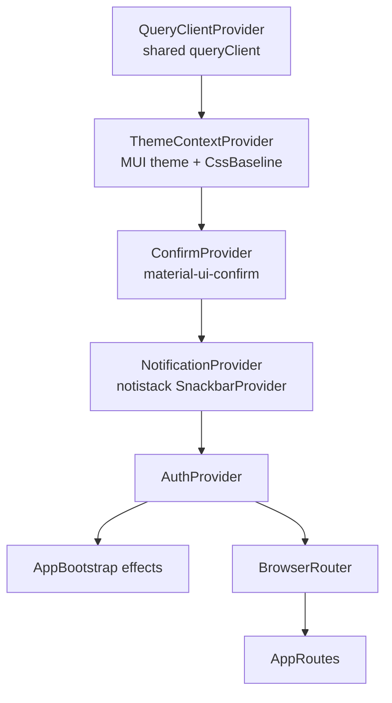
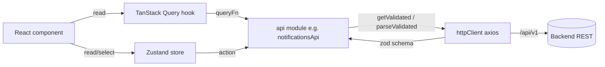
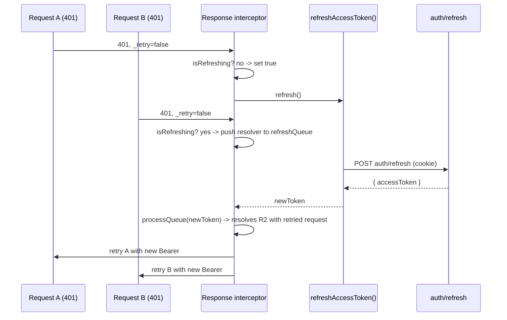
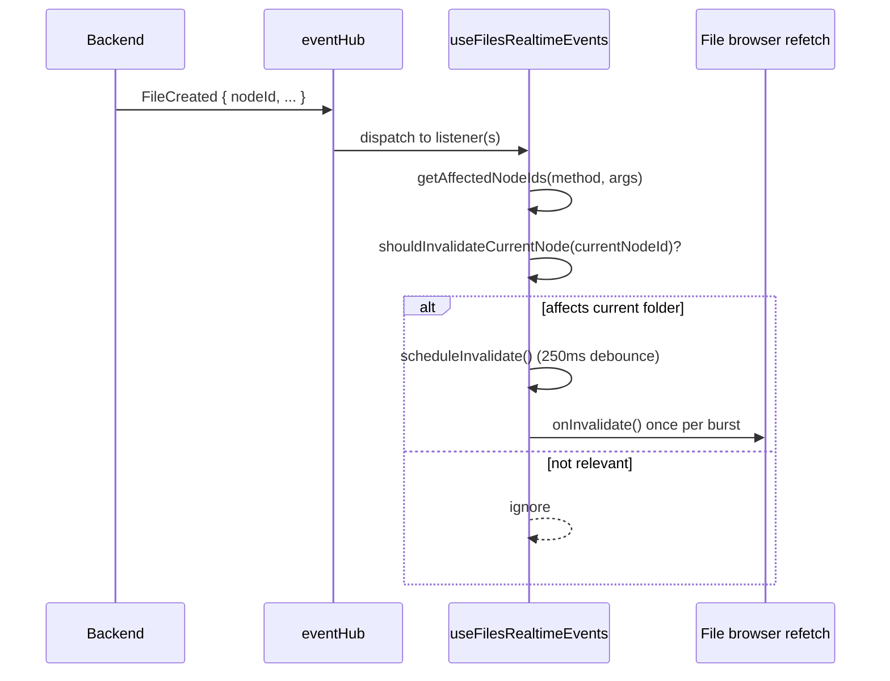

# 23. Frontend: Architecture, State & API Layer

The Cotton Cloud web client is a single-page React/TypeScript application built with Vite. It is the only first-party UI for the system and talks to the backend exclusively through the versioned REST surface (`/api/v1`) plus a single SignalR hub (`/api/v1/hub/events`). This section documents the application's *foundation*: how the app is composed and bootstrapped, how client state is split between TanStack Query (server cache) and Zustand (UI/identity state), how the HTTP transport handles auth refresh and schema validation, how realtime events flow back into the cache, and what the client-side cryptography layer actually does. Feature-page internals (the file browser, upload pipeline, preview engine, admin pages) live in their own sections; here we cover the shared scaffolding under `src/cotton.client/src/app` and `src/cotton.client/src/shared`.

> Note: the package is named `reacttemplate` in `src/cotton.client/package.json`; the product name "Cotton Cloud" only appears in the PWA manifest (`src/cotton.client/vite.config.ts`). The codebase is the canonical Cotton web client despite the generic package name.

## Stack & versions

All versions below are taken verbatim from `src/cotton.client/package.json`.

| Concern | Library | Version (semver range) |
| --- | --- | --- |
| UI runtime | `react`, `react-dom` | `^19.2.0` |
| Build tool | `vite` | `^8.0.13` (dev plugin `@vitejs/plugin-react ^6.0.2`) |
| Routing | `react-router-dom` | `^7.10.1` |
| Component library | `@mui/material`, `@mui/icons-material`, `@mui/styled-engine` | `^7.3.6` |
| Data grid | `@mui/x-data-grid` | `^8.26.0` |
| Styling engine | `@emotion/react ^11.14.0`, `@emotion/styled ^11.14.1` | (MUI peer) |
| Server-state cache | `@tanstack/react-query` | `^5.100.10` |
| Client state | `zustand` | `^5.0.9` |
| HTTP client | `axios` | `^1.13.2` |
| Realtime | `@microsoft/signalr` | `^10.0.0` |
| i18n | `i18next ^26.2.0`, `react-i18next ^17.0.8`, `i18next-browser-languagedetector ^8.2.0` | |
| Validation | `zod` | `^4.3.6` |
| PWA | `vite-plugin-pwa` | `^1.2.0` |
| Hashing (KDF) | `hash-wasm` | `^4.12.0` |
| Recovery phrase (BIP39) | `@scure/bip39` | `^2.2.0` |
| Media / preview | `hls.js ^1.6.16`, `pdfjs-dist ^5.7.284`, `@monaco-editor/react ^4.7.0`, `three ^0.184.0` + `@react-three/fiber ^9.6.0` + `@react-three/drei ^10.7.7`, `heic2any ^0.0.4`, `yet-another-react-lightbox ^3.32.0`, `react-h5-audio-player ^3.10.1`, `@uiw/react-md-editor ^4.0.11` |
| Toasts / dialogs | `notistack ^3.0.2`, `material-ui-confirm ^4.0.0` |
| Misc | `react-virtuoso ^4.18.1`, `react-qr-code ^2.0.18` |

TypeScript is `^6.0.3`; ESLint is `^10.4.0` with `typescript-eslint ^8.46.4` and `eslint-plugin-react-hooks ^7.0.1`. Tests run on Vitest `^4.1.6` (+ `@vitest/coverage-v8`) with `@testing-library/react` and `jsdom`. The `overrides` block pins `dompurify` to `3.4.1` and `serialize-javascript` to `7.0.5` (transitive security pins for the markdown editor / Workbox toolchain).

### Build configuration

`src/cotton.client/vite.config.ts` defines:

- **Path aliases**: `@app`, `@features`, `@pages`, `@shared` map to the corresponding `src/` subfolders (resolved via `fileURLToPath`/`new URL`).
- **Dev proxy**: `/api`, `^/s/[^/]+` (public short share links), and `/api/v1/hub` are proxied to `VITE_API_TARGET` (default `http://localhost:5182`) with `changeOrigin: true`, `secure: true`, and `ws: true` (WebSocket upgrade for SignalR).
- **Manual chunking**: `build.rollupOptions.output.manualChunks` splits `node_modules` into named vendor bundles — `vendor-react`, `vendor-three`, `vendor-monaco`, `vendor-pdfjs`, `vendor-mui-datagrid`, `vendor-mui-icons`, `vendor-mui`, `vendor-signalr`, and `vendor-markdown`. The helper `getNodeModulePath` normalizes paths (replacing `\\` with `/`, slicing after the last `/node_modules/`) so the split works on Windows too.
- **PWA**: `VitePWA` with `registerType: "prompt"` and `injectRegister: false` (registration is done manually — see *PWA & service worker* below). The Workbox `navigateFallbackDenylist` excludes `/s/`, `/api/`, `/files/`, `/chunks/`, `/preview/` so that share/download navigations always hit the network instead of being served `index.html`. `maximumFileSizeToCacheInBytes` is raised to `6 * 1024 * 1024` (6 MiB), `cleanupOutdatedCaches: true`, `sourcemap: true`. The manifest sets `name: "Cotton Cloud"`, `short_name: "Cotton"`, `theme_color: "#c6ff00"`, `background_color: "#2c2d2e"`.

## App composition & bootstrap

### Entry point

`src/cotton.client/src/main.tsx` imports `./i18n.ts` (side-effecting i18next init) and `./index.css`, then calls `registerServiceWorker()` and `installStaleChunkReloadHandler()` *before* mounting. It renders `<App />` inside React `StrictMode` into `#root`.

### Provider tree

`src/cotton.client/src/App.tsx` establishes the provider nesting. Order matters:

- `QueryClientProvider` receives the singleton `queryClient` from `src/cotton.client/src/shared/api/queries/queryClient.ts`.
- `ThemeContextProvider` (`src/cotton.client/src/app/providers/ThemeProvider.tsx`) supplies the MUI theme and `<CssBaseline />`.
- `ConfirmProvider` is configured with `safeConfirmFocusOptions` (from `@shared/ui/confirmOptions`, which sets the confirm button `autoFocus: false` and cancel button `autoFocus: true`) and `dialogProps.sx.zIndex = 10000` so confirmation dialogs render above overlays.
- `NotificationProvider` (`src/cotton.client/src/shared/ui/notifications/NotificationProvider.tsx`) wraps notistack's `SnackbarProvider` (`maxSnack={4}`, `autoHideDuration={4500}`, bottom-right anchor, `preventDuplicate`, `hideIconVariant`) with a fully themed custom content component.
- `AuthProvider` exposes auth context. `AppBootstrap` and `BrowserRouter`/`AppRoutes` are siblings inside it.

### AppBootstrap

`src/cotton.client/src/app/AppBootstrap.tsx` renders `null`; it is a side-effect host. It:

1. Calls `useEventHub()` (from `src/cotton.client/src/features/notifications`, which starts the SignalR connection and wires notification events) and `useUserPreferencesRealtimeEvents()`.
2. Restores the client-encryption vault from the session when authenticated, preferences are loaded, the `clientEncryptionLockOnRefresh` preference is off, and the vault is not already unlocked — via `restoreVaultFromSession()`. On success it triggers `useNodesStore.getState().refreshCachedFileDisplayMetadata()` to re-decrypt cached file display names.
3. Persists or clears the vault session key in response to the lock-on-refresh preference and vault state (`persistCurrentVaultSession()` / `clearVaultSession()`).
4. Applies the user's preferred UI language by calling `i18n.changeLanguage(preferredLanguage)` (best-effort, errors swallowed) when it differs from `i18n.language`.

### Routing

`src/cotton.client/src/app/routes.tsx` (`AppRoutes`) is the routing brain. Every page is `lazy()`-imported and wrapped in `withRouteSuspense` (a `<Suspense fallback={<Loader />}>`). The component layers three gates in sequence:

1. **Server lock gate** — on mount it calls `unlockApi.getStatus()` (`src/cotton.client/src/shared/api/unlockApi.ts`, a raw `fetch` to `/api/v1/unlock/status`). While `lockCheckState === "checking"` it shows a full-screen `Loader`. A non-null status is treated as locked: only `/unlock` (`UnlockPage`, receiving `initialStatus`) renders under `PublicLayout`; everything else `Navigate`s to `/unlock` carrying `{ from, status }` route state.
2. **Auth bootstrap gate** — once unlocked, for non-public routes it calls `ensureAuth()` and, while the bootstrap is pending, shows a "restoring session" `Loader`. The exact pending condition (`isAuthBootstrapPending`) is `!isPublicRoute && (!hydrated || isInitializing || (!isAuthenticated && refreshEnabled && !hasChecked))`.
3. **Route tree** — public routes under `PublicLayout`; protected routes under `RequireAuth → SetupGate → AppLayout`; the admin subtree under `RequireAdmin`.

`RouteConfig` is defined in `src/cotton.client/src/app/types.ts` (`path`, optional `displayName`/`translationKey`/`icon`, `element`, optional `protected`).

| Path | Component | Access | Notes |
| --- | --- | --- | --- |
| `/unlock` | `UnlockPage` | public | server master-key unlock page |
| `/login` | `LoginPage` | public | |
| `/s/:token` | `RedirectSToShare` | public | redirects to `/share/:token` |
| `/share/:token` | `SharePage` | public | anonymous public share |
| `/reset-password` | `ResetPasswordPage` | public | |
| `/verify-email` | `VerifyEmailPage` | public | |
| `/` | `HomePage` | auth | nav item `home` |
| `/files`, `/files/:nodeId` | `FilesPage` | auth | nav item `files`, deep link by node id |
| `/trash`, `/trash/:nodeId` | `TrashPage` | auth | nav item `trash` |
| `/search` | `SearchPage` | auth | |
| `/settings` | `SettingsPage` | auth | `/profile` redirects here |
| `/admin/*` | `AdminLayoutPage` | admin | nested routes below |
| `/admin` (index) | → `general-settings` | admin | |
| `/admin/users`, `/admin/groups`, `/admin/database-backup`, `/admin/storage-statistics`, `/admin/storage-settings`, `/admin/general-settings`, `/admin/privacy-settings`, `/admin/security`, `/admin/identity-providers`, `/admin/notifications-settings` | respective admin pages (`AdminUsersPage`, `AdminGroupsPage`, `AdminDatabaseBackupPage`, `AdminStorageStatisticsPage`, `AdminStorageSettingsPage`, `AdminGeneralSettingsPage`, `AdminPrivacySettingsPage`, `AdminSecurityDiagnosticsPage`, `AdminIdentityProvidersPage`, `AdminNotificationsSettingsPage`) | admin | `/admin/email-settings` redirects to `/admin/notifications-settings` |
| `/setup` | `SetupWizardPage` | auth + `SetupGate` | first-run wizard |
| `/onboarding` | `OnboardingPage` | auth only (no `SetupGate`) | |
| `*` | `NotFoundPage` | — | |

The three top nav items (`/`, `/files`, `/trash`) are declared inline as `appRoutes` (each with an MUI icon and `translationKey`) and passed into `AppLayout` to render the toolbar.

### Layouts

- `src/cotton.client/src/app/layouts/AppLayout.tsx` — the authenticated shell: a `position="static"` `AppBar`/`Toolbar` with responsive nav buttons (icon-only on `xs`, text+icon on `sm+`), a search `IconButton`, `NotificationsMenu`, `UserMenu`, then a scrollable `Container` hosting `<Outlet />` inside an `ErrorBoundary`. It mounts the global `AudioPlayerBar`, `UploadFilePicker`, `TaskQueueWidget` (exported from `./components/UploadQueueWidget`), and `SearchModal`. It primes `useServerSettingsQuery({ enabled: isAuthenticated })`. A global `keydown` listener and the custom `OPEN_SEARCH_EVENT` (from `@features/search`) both open the search modal; the keyboard shortcut is gated by `isSystemKeyboardShortcut(event, "search")`.
- `src/cotton.client/src/app/layouts/PublicLayout.tsx` — a minimal flex column wrapping `<Outlet />` for login/share/unlock pages.

### Auth guards & provider

`src/cotton.client/src/features/auth/AuthProvider.tsx` owns the auth lifecycle and exposes `AuthContextValue` (`user`, `isAuthenticated`, `isInitializing`, `refreshEnabled`, `hydrated`, `hasChecked`, `ensureAuth`, `setAuthenticated`, `logout`) via `useAuth()`.

- `ensureAuth()` performs the silent session restore: it calls `restoreAuthSession()` which does `authApi.refresh()` then `authApi.me()`. If a "just unlocked" `sessionStorage` marker (`JUST_UNLOCKED_STORAGE_KEY`) is present, it instead polls `waitForAuthSessionAfterUnlock()` (retry every `AUTH_RETRY_AFTER_UNLOCK_INTERVAL_MS = 350` ms for up to `AUTH_RETRY_AFTER_UNLOCK_TIMEOUT_MS = 10000` ms) because backend auth endpoints can lag behind a fresh server unlock. An OIDC sign-in pending marker (`consumeOidcSignInPending()`) allows restore even when `refreshEnabled` is false, via `allowWhenRefreshDisabled`.
- It listens for the `auth:logout` window event (dispatched by the HTTP interceptor) and calls `logoutLocal()` + `resetUserScopedStores(null)`.
- On any identity change it calls `resetUserScopedStores(userId)` to purge cross-user cached data (see *Cross-user cache isolation* below). The reset is deferred until the first auth check completes (`!hasChecked && refreshEnabled` short-circuits the effect).
- `RequireAuth` (`features/auth/RequireAuth.tsx`) calls `ensureAuth()` on mount, blocks rendering with loaders while `!hydrated`, `isInitializing`, or `!isAuthenticated && !hasChecked`, and otherwise `Navigate`s to `/login` preserving `from` via `getSafeAuthReturnPath(location.pathname)` when unauthenticated. `RequireAdmin` (`features/auth/RequireAdmin.tsx`) renders `null` while `user` is null and redirects non-`UserRole.Admin` users to `/`.
- `SetupGate` (`features/settings/SetupGate.tsx`) fetches server-initialization status for admins via `useSetupStatusStore`, shows a loader while loading, redirects to `/setup` when not initialized, and redirects away from `/setup` once initialized (with a `?preview=1` escape hatch). Non-admins are treated as initialized.

`UserRole` is a const object — `User: 1`, `Admin: 2` (`features/auth/types.ts`).

## State architecture

Cotton splits state along a strict line:

- **Server data** lives in TanStack Query (`queryClient`), keyed by `queryKeys`.
- **Identity, UI, and crypto state** live in Zustand stores under `src/cotton.client/src/shared/store` and `src/cotton.client/src/shared/crypto`.

Per the repository `AGENTS.md` ("Do not use localStorage. Use Zustand stores or TanStack Query."), components must not touch `localStorage`/`sessionStorage` directly. Some Zustand stores *do* persist (the auth flag → `localStorage`; everything else user-scoped → `sessionStorage`), but always through guarded wrappers, never ad-hoc.

### Zustand stores

`src/cotton.client/src/shared/store/index.ts` re-exports `authStore`, `nodesStore`, `userPreferencesStore`, `localPreferencesStore`, `audioPlayerStore`. The other stores in the same folder are imported directly by their files.

| Store | File | Persistence | Responsibility |
| --- | --- | --- | --- |
| `useAuthStore` | `authStore.ts` | `localStorage` (`ctn-auth`), **partialized to `{ refreshEnabled }` only** | Auth gate flags: `user`, `isAuthenticated`, `isInitializing`, `refreshEnabled`, `hydrated`, `hasChecked`. Only `refreshEnabled` survives reloads (so an explicit logout is remembered). `getRefreshEnabled()` returns `hydrated && refreshEnabled`. |
| `useUserPreferencesStore` | `userPreferencesStore.ts` | in-memory (server-backed) | Server-synced user preferences. Optimistic `updatePreferences` writes through `userPreferencesApi.update`, rolling back on error. Selectors parse the string-valued preference map into typed values with defaults. |
| `useLocalPreferencesStore` | `localPreferencesStore.ts` | `sessionStorage` (`ctn-local-prefs`) | Device-local view state: files/trash layout type + tile size, per-file `editorModes`/`languageOverrides`, and the hidden "developer settings" unlock (3 clicks within 10 min). |
| `useNodesStore` | `nodesStore.ts` | `sessionStorage` (`ctn-nodes`) | Folder-tree cache: `currentNode`, `ancestors`, `contentByNodeId`, `ancestorsByNodeId`, `rootNodeId`, `lastUpdatedByNodeId`, plus the owning `cacheOwnerUserId`. Holds optimistic mutators and `refreshCachedFileDisplayMetadata`. |
| `useAudioPlayerStore` | `audioPlayerStore.ts` | in-memory | Global audio player queue/playback state for `AudioPlayerBar`; recursive folder scan bounded by `MAX_SCAN_DEPTH = 256`, `MAX_FOLDERS_TO_SCAN = 2500`, `MAX_AUDIO_FILES = 25000`. |
| `useMoveClipboardStore` | `moveClipboardStore.ts` | in-memory | Cut/paste clipboard for move operations (`items` of `{ id, kind, sourceParentId, file? }`). |
| `useServerInfoStore` | `serverInfoStore.ts` | in-memory | Lazily-fetched public server info (`settingsApi.getPublicInfo`) with `loaded`/`force` guards. |
| `useSetupStatusStore` | `setupStatusStore.ts` | in-memory | Server-initialization status (`settingsApi.getIsSetupComplete`) for `SetupGate`; treats a 403 (non-admin) as initialized. |

`useServerSettings.ts` and `useUserPreferencesRealtimeEvents.ts` live in the same folder but are hooks, not stores.

#### authStore details

The persist storage is a hand-written `safeLocalStorage` `StateStorage` that swallows all exceptions (private-mode / blocked storage must not break auth). `partialize` persists only `refreshEnabled`; `onRehydrateStorage` flips `hydrated` true after load. State transitions:

- `setAuthenticated(user)` → authenticated, `refreshEnabled: true`, `hasChecked: true`.
- `setUnauthenticated()` → cleared, `hasChecked: true` (leaves `refreshEnabled` so a refresh can still be attempted next time).
- `logoutLocal()` → cleared **and `refreshEnabled: false`** (explicit logout blocks future refresh attempts).

#### userPreferencesStore details

Preferences are a flat `Record<string, string>` (`UserPreferences`). Keys are enumerated in `USER_PREFERENCE_KEYS` and stored as strings; booleans are `"true"`/`"false"`.

| Key | Default | Selector |
| --- | --- | --- |
| `themeMode` | `"system"` | `selectThemeMode` |
| `uiLanguage` | none (selector returns `null`, falls back to detector) | `selectUiLanguage` |
| `notificationSoundEnabled` | `true` | `selectNotificationSoundEnabled` |
| `notificationsShowOnlyUnread` | `false` | `selectNotificationsShowOnlyUnread` |
| `shareLinkExpireAfterMinutes` | `43200` (= 60×24×30, 30 days) | `selectShareLinkExpireAfterMinutes` |
| `gallerySmoothTransitions` | `true` | `selectGallerySmoothTransitions` |
| `galleryPreferPreview` | `true` | `selectGalleryPreferPreview` |
| `clientEncryptionLockOnRefresh` | `false` | `selectClientEncryptionLockOnRefresh` |

The crypto envelope is *also* stored on the same server-side preferences map under the key `cryptoEnvelope` (`ENVELOPE_PREFERENCE_KEY` in `crypto/envelope.ts`), but it is **not** in `USER_PREFERENCE_KEYS` and is read/written through `crypto/envelopeStorage.ts`, not through this store's typed selectors.

`hydrateFromUser` / `hydrateFromRemote` skip while `syncing` is true to avoid clobbering an in-flight optimistic update.

#### nodesStore persistence subtleties

`partialize` runs `buildPersistedContentSnapshot`: it persists only the currently relevant nodes (root, current node, ancestors), and **skips any folder whose `nodes.length + files.length` exceeds `MAX_PERSISTED_NODE_CONTENT_ITEMS` (10000)** so the ~5 MB `sessionStorage` quota is not exceeded (those folders are refetched on reload). File entries are reduced via `toPersistableFileDisplayMetadata` (dropping decrypted display values). The `safeSessionStorage.setItem` wrapper catches `QuotaExceededError` / `NS_ERROR_DOM_QUOTA_REACHED`, removes the key, and warns instead of throwing. Optimistic mutators include `updateNode`, `moveFolderInCache`, `moveFileInCache`, `addFolderToCache`, `updateFileInCache`, `optimisticRenameFile`, `optimisticSetFilePreviewHash`, and `optimisticDeleteFile`.

### TanStack Query layer

The singleton client (`queryClient.ts`) uses these defaults: queries `staleTime: 30_000`, `refetchOnWindowFocus: false`, `retry: 1`; mutations `retry: 0`. Individual queries override as needed (e.g. server settings use a 5-minute stale time, `SERVER_SETTINGS_STALE_TIME_MS = 5 * 60_000`, in `serverSettings.ts`).

`src/cotton.client/src/shared/api/queries/queryKeys.ts` centralizes all query keys under a single `queryKeys` const object (roots: `notifications`, `layouts`, `admin`, `audio`, `trash`, `serverSettings`, `storageQuota`, `fileVersions`, `oidc`). Each query module under `shared/api/queries/` pairs hooks with cache helpers — e.g. `notifications.ts` exposes `useNotificationsQuery` (a `useInfiniteQuery`, `PAGE_SIZE = 20`), `useUnreadCountQuery`, `useMarkAsReadMutation`/`useMarkAllAsReadMutation` that patch the infinite cache in place via `setQueryData`, and `prependCachedNotification` / `invalidateNotificationQueries` / `clearNotificationCaches` used by the realtime layer and reset logic.

## HTTP transport layer

`src/cotton.client/src/shared/api/httpClient.ts` is the central axios instance and the most load-bearing module in the API layer.

- **Instance**: `baseURL: "/api/v1"`, `timeout: 60000`, `withCredentials: true` (the refresh token is an httpOnly cookie), default `Content-Type: application/json`.
- **Access token** is held in a module-level `let accessToken` (never persisted). `getAccessToken`/`setAccessToken`/`clearAccessToken` manage it. The request interceptor attaches `Authorization: Bearer <token>` when present and an `X-Timezone` header resolved once at module load from `Intl.DateTimeFormat().resolvedOptions().timeZone`.

### Schema-validated responses

`parseValidated(url, data, schema)` runs `schema.safeParse`; on failure it logs and shows a single deduped error toast (`api-schema-validation:<url>`) via `translateError("common", "errors.schemaValidationFailed")`, then throws the `ZodError`. `getValidated(url, schema, config)` is the GET+validate convenience used throughout the API modules. This is how zod (`shared/api/schemas/*`) is enforced at the transport boundary rather than per-call.

### Error message extraction & toasts

`extractApiErrorMessage` walks a response body for `detail` → `message` → validation `errors` (recursively, via `collectStringMessages`) → `title`, returning the first usable string. `getApiErrorMessage(error)` is the public helper. The response interceptor calls `tryDispatchApiErrorToast` for validation-style errors (those with an `errors` payload, excluding `auth/refresh`), deduped per `api-error:<status>:<url>:<message>` and marked on the error object via `_apiErrorToastDispatched` so a given error never toasts twice. `showApiErrorToast(error, fallback, toastId)` is the explicit per-call variant used by mutations.

### The refresh-token queue (thundering-herd prevention)

The response interceptor handles `401` with a single-flight refresh and a waiting queue, so N simultaneous 401s trigger exactly one `auth/refresh` call:

Mechanics:

- Module state: `isRefreshing` (boolean) and `refreshQueue` (array of `(token: string | null) => void`). When a 401 arrives and a refresh is already in flight, the request returns a Promise that pushes a resolver into `refreshQueue`. `processQueue(token)` later resolves every queued request (re-issuing it with the new Bearer) or rejects them all if refresh failed.
- The `_retry` flag on the original request prevents infinite retry loops.
- **Exclusions** that never trigger refresh/logout: requests whose URL includes `auth/login`, `auth/refresh` (the refresh call itself), and `/layouts/shared/` (anonymous public share endpoints). These just surface a toast and reject.
- **Refresh disabled / blocked**: if `getRefreshEnabled()` is false (explicit logout) or `refreshBlocked` is set, the interceptor calls `disableRefreshAndLogout()` (clears token, `logoutLocal()`, dispatches the one-time `auth:logout` event via `dispatchLogoutEventOnce`) and rejects.
- **Terminal refresh failures**: `isTerminalRefreshFailure` treats `400/401/403/404` from `auth/refresh` as permanent — it sets `refreshBlocked = true` and logs out. Other refresh errors just clear the token and return `null` (transient).
- **Server-locked (HTTP 423)**: `isServerLockedResponse` detects `status === 423 && body.locked === true`; the interceptor calls `redirectToUnlockOnce()` (a one-shot `window.location.assign("/unlock")` guarded so it does not loop when already on `/unlock`).

`refreshAccessToken(options)` itself is reused by the SignalR `accessTokenFactory` and by `authApi.refresh`; its `allowWhenRefreshDisabled` option lets the OIDC sign-in flow obtain a token even though `refreshEnabled` is false post-logout. `setAccessToken` resets the transport's terminal-failure/logout flags when a fresh token arrives.

`isAxiosError` is re-exported from this module.

### API modules, types, schemas

- **API modules** (`shared/api/*.ts`): one object per domain — `authApi`, `nodesApi`, `filesApi`, `layoutsApi`, `notificationsApi`, `settingsApi`, `adminApi`, `chunksApi`, `archiveApi`, `oidcApi`, `passkeysApi`, `sessionsApi`, `totpApi`, `unlockApi`, `userPreferencesApi`, `sharedFoldersApi`, `storageQuotaApi`. Each wraps `httpClient` calls and validates with zod where a schema exists. (`unlockApi` is the exception: it uses raw `fetch` against `/api/v1/unlock/*` and `/api/v1/server/info`.)
- **Schemas** (`shared/api/schemas/*.ts`): zod schemas + inferred types. `node.ts` defines `baseDtoSchema`, `nodeDtoSchema`, `nodeFileManifestSchema`, `nodeContentSchema`, and the restore-outcome enums (`restoreStatusSchema` = `Restored`/`ParentMissing`/`Conflict`/`NotRestorable`, `restoreConflictKindSchema` = `Folder`/`File`, `restoreOutcomeSchema`). `serverSettings.ts` builds tolerant enum schemas via `makeEnumSchema` (accepts numeric *or* string enum values from the backend, falling back to a default) for `StorageType`, `EmailMode`, `ComputionMode`, `StorageSpaceMode`, `GeoIpLookupMode`, `ServerUsage`, and normalizes chunk-size / pipeline settings. `userPreferences.ts` is just `z.record(z.string(), z.string())`. `notification.ts` validates incoming SignalR notification payloads (`notificationSchema`) plus list/unread-count response shapes.
- **Types** (`shared/api/types/`): `BaseDto<TId>` mirrors the backend base entity (`id`, `createdAt`, `updatedAt`); `InterfaceLayoutType` is a const object (`Tiles: 0`, `List: 1`) matching the backend enum.
- **Utils** (`shared/api/utils/headerUtils.ts`): `readRequiredIntHeader` reads case-insensitive headers (direct, lowercase, or via a `get()` accessor), used for chunk-size headers in the upload path.

Tolerant enum value sets (`shared/api/schemas/serverSettings.ts`):

| Enum | Values | Fallback |
| --- | --- | --- |
| `StorageType` | `Local`, `S3` | `Local` |
| `EmailMode` | `None`, `Cloud`, `Custom` | `None` |
| `ComputionMode` | `Local`, `Cloud`, `Remote` | `Local` |
| `StorageSpaceMode` | `Optimal`, `Limited`, `Unlimited` | `Optimal` |
| `GeoIpLookupMode` | `Disabled`, `CottonCloud`, `MaxMindLocal`, `CustomHttp` | `Disabled` |
| `ServerUsage` | `Other`, `Photos`, `Documents`, `Media` | `Other` |

### userPreferencesApi self-update token

`userPreferencesApi.update` (PATCH `users/me/preferences`) sends a per-tab random `token` query param generated once via `crypto.randomUUID()` (with a `pref_<ts>_<rand>` fallback). The backend echoes this token on the `PreferencesUpdated` SignalR broadcast, and `isSelfPreferenceUpdateToken` lets the originating tab ignore its own echo (so optimistic state is not double-applied). See *Realtime layer* below.

## Realtime layer (SignalR)

`src/cotton.client/src/shared/signalr/eventHub.ts` exposes a singleton `eventHub` (`EventHubService`). It manages one `HubConnection` to `/api/v1/hub/events`.

- **Auth**: `accessTokenFactory` returns the current access token, or transparently calls `refreshAccessToken()` if none, throwing when `getRefreshEnabled()` is false or no token can be obtained.
- **Transport fallback**: it tries `WebSockets` with `skipNegotiation: true` first (avoids `/negotiate`, which some proxies reject), then falls back to `WebSockets | LongPolling` with normal negotiation.
- **Reconnect**: `withAutomaticReconnect` with a custom `nextRetryDelayInMilliseconds` policy keyed on `previousRetryCount` — 1000 ms for the first five retries (`< 5`), 5000 ms for the next ten (`< 15`), then 30000 ms. On `onreconnected` it re-subscribes all listeners (`resubscribeAll`) and notifies `onConnected` callbacks.
- **Subscription model**: `on(method, cb)` registers a listener even before/while the connection is starting (registering only when `Connected` would miss events during the `Connecting` window). `onConnected(cb)` fires on (re)connect — `useEventHub` uses this to invalidate notification queries after a reconnect so missed events are reconciled.
- **Hardening**: the `SessionRevoked` handler clears the token, calls `logoutLocal()`, and disposes the connection. No-op handlers are registered for every `SILENCED_HUB_METHODS` variant (the file/node mutation methods plus `PreviewGenerated`, each in canonical and lowercase form) to suppress SignalR "no handler" warnings on pages that do not subscribe.

`src/cotton.client/src/shared/signalr/hubMethods.ts` defines `HUB_METHODS` (canonical wire names) and the `HubMethodOrLower` type. Because older server builds emitted lowercased method names, `getHubMethodVariants` returns both the canonical and lowercased variant for each method, and consumers subscribe to both.

| Hub method (constant → wire name) | Consumer | Effect |
| --- | --- | --- |
| `NotificationReceived` → `OnNotificationReceived` | `useEventHub` | validate via `notificationSchema`, `prependCachedNotification`, play sound if `notificationSoundEnabled` |
| `SessionRevoked` → `SessionRevoked` | `eventHub` | force local logout + dispose |
| `PreferencesUpdated` → `PreferencesUpdated` | `useUserPreferencesRealtimeEvents` | ignore self-token, else `hydrateFromRemote` |
| `PreviewGenerated` → `PreviewGenerated` | `useFilesRealtimeEvents` | optimistically set preview hash or invalidate |
| `FileCreated/Updated/Deleted/Moved/Renamed/Restored`, `NodeCreated/Deleted/MetadataUpdated/Moved/Renamed/Restored` (`FILE_AND_NODE_MUTATION_HUB_METHODS`) | `useFilesRealtimeEvents` | coalesced refresh of the affected folder |

The canonical wire names are identical to the constant names except `NotificationReceived`, which is sent on the wire as `OnNotificationReceived`.

### Event → cache invalidation flow

The file browser's `src/cotton.client/src/pages/files/hooks/useFilesRealtimeEvents.ts` is the model for targeted invalidation:

`getAffectedNodeIds` maps each (canonicalized) method to the payload fields that identify the affected folder, and `shouldInvalidateCurrentNode` triggers only when the affected set contains the currently viewed node id:

| Method | Payload fields collected |
| --- | --- |
| `FileCreated`, `FileUpdated`, `FileRenamed`, `FileRestored` | `nodeId` |
| `FileDeleted` | `parentNodeId` |
| `FileMoved` | `oldParentId`, `newParentId`, nested `file.nodeId` |
| `NodeCreated`, `NodeMetadataUpdated`, `NodeRenamed`, `NodeRestored` | `id`, `parentId` |
| `NodeDeleted` | `nodeId`, `parentNodeId` |
| `NodeMoved` | `oldParentId`, `newParentId`, nested `node.id`, nested `node.parentId` |

`scheduleInvalidate` debounces 250 ms to coalesce bursts (bulk uploads/renames) into a single `onInvalidate()` call. `PreviewGenerated` is handled separately: with payload `[nodeId, nodeFileId, hex]`, the hook calls the supplied `onPreviewGenerated(nodeFileId, hex)` (which the files page wires to `useNodesStore.optimisticSetFilePreviewHash`) and only falls back to `scheduleInvalidate()` if that returns `false` (the cache entry was missing).

This is why the system uses a hybrid: realtime events sometimes patch the Zustand `nodesStore` directly (optimistic, cheap) and sometimes invalidate/refetch via TanStack Query, depending on how much data the event carries.

## Theming

`src/cotton.client/src/shared/theme/index.ts` exports `darkTheme`, `lightTheme`, and the `ThemeMode` type (`"light" | "dark" | "system"`). Both are MUI `createTheme` results. The dark theme uses primary `#96be02ff`, secondary `#1bcea7ff`, dark `background.default` `#1f2022` / `paper` `#151A21`, `text.primary #eeeeee`, `shape.borderRadius: 12`, plus component overrides: `MuiDialogActions` padding (`16px 24px`), tinted standard `MuiAlert` variants, and `MuiCssBaseline` rules that neutralize Chrome autofill yellow and set `color-scheme: dark`.

`ThemeContextProvider` (`app/providers/ThemeProvider.tsx`) reads `themeMode` from `useUserPreferencesStore` (so theme choice is server-synced), resolves `"system"` against `window.matchMedia("(prefers-color-scheme: dark)").matches`, picks `lightTheme`/`darkTheme`, and wires `setTheme` to `useUserPreferencesStore`'s `setThemeMode`. It renders MUI `ThemeProvider` + `CssBaseline`. `useTheme()` (`app/providers/useTheme.ts`) returns `{ mode, resolvedMode, setTheme }` and throws if used outside the provider. (Note: this is the *app* theme-mode hook; components that just need the MUI theme object import MUI's own `useTheme` from `@mui/material/styles`.)

## Internationalization

`src/cotton.client/src/i18n.ts` initializes i18next with `LanguageDetector` + `initReactI18next`. Detection order is `querystring → sessionStorage → navigator → htmlTag`, cached to `sessionStorage` under `LANGUAGE_STORAGE_KEY` (`ctn-language`) — **not** `localStorage`, consistent with the no-localStorage convention. `convertDetectedLanguage` collapses regional variants (`lng.toLowerCase().split("-")[0]`, e.g. `en-US → en`), with `load: "languageOnly"`, `nonExplicitSupportedLngs: true`, `interpolation.escapeValue: false`.

`src/cotton.client/src/locales/index.ts` eagerly globs `./*.json` via `import.meta.glob` (`eager: true`), deriving `supportedLanguages` and `allNamespaces` from the files themselves. Bundled languages: `en` (the fallback, `fallbackLng`), `cs`, `de`, `es`, `fr`, `it`, `nl`, `pl`, `pt`, `ru`, `uk`, `zh`. `defaultNS` is `"common"`. Each JSON is split into namespaces (e.g. `common`, `login`, `unlock`, `routes`, `search`, `files`, `trash`, `admin`, `profile`, `setup`, `onboarding`, `home`, `tasks`, `notifications`, `audioPlayer`, `share`, `resetPassword`, `verifyEmail`, `notFound`).

`src/cotton.client/src/shared/i18n/translateError.ts` provides `translateError(namespace, key)`: it resolves an English fallback directly from the imported `en.json` and returns the translated string only if i18next is initialized and the key exists — making it safe to call from non-React code (the HTTP interceptor) before React/i18n is ready. A repo script `npm run i18n:check` (`scripts/check-locales.mjs`) validates locale completeness.

## Notifications & toasts

Two distinct concepts share the word "notification":

1. **Toasts** (transient UI): `shared/ui/notifications/toast.ts` wraps notistack with a `toast(...)`/`toast.success/error/info/warning/dismiss/isActive` API and an `activeToastIds` set that enforces id-based deduplication. `shared/ui/notifications/NotificationProvider.tsx` themes notistack with a custom MUI `Paper`-based content component, icons per variant, and a tone mapping (`success → palette.primary`, `info`/`default → palette.secondary`, `warning → palette.warning`, `error → palette.error`).
2. **Server notifications** (persisted, bell menu): fetched/cached via `shared/api/queries/notifications.ts`, rendered through `renderNotificationText` in `shared/notifications/renderNotification.ts`, which resolves i18n template keys from a notification's `metadata` (`i18n.titleKey`, `i18n.contentKey`, and `i18n.param.*` interpolation params) so server-sent notifications are localized client-side rather than pre-translated on the server, with the raw `title`/`content` as fallback.

## PWA & service worker

`shared/pwa/registerServiceWorker.ts` is a no-op in `import.meta.env.DEV`. In production it calls `registerSW({ immediate: true })` from `virtual:pwa-register`; `onNeedRefresh` shows an update toast (`shared/pwa/ServiceWorkerUpdateToast.tsx`, with messages `common:pwa.updateAvailable`/`common:pwa.updateAction`) whose action calls `updateSW(true)` to activate the new worker. `onOfflineReady` is intentionally silent. The companion `shared/utils/staleChunkReload.ts` (installed from `main.tsx`) detects dynamic-import / chunk-load failures (stale cached `index.html` referencing rotated chunk hashes after a deploy — matched by messages like "Failed to fetch dynamically imported module", "Loading chunk", "ChunkLoadError") via `unhandledrejection`/`error` window listeners and reloads once, throttled by a 60 s cooldown persisted in `sessionStorage` (key `cottonStaleChunkReloadAtMs`) plus an in-memory guard, to break the white-screen-on-deploy cycle.

## Client-side cryptography

`src/cotton.client/src/shared/crypto` implements optional **client-side encryption (CSE)**: file contents and display metadata can be encrypted in the browser with a master key that the server never sees in plaintext. This is distinct from the server's own at-rest master key (see the *Cryptography Engine* and *Server Bootstrap & Unlock* sections). The CSE master key is held only in memory in a Zustand store and, optionally, mirrored to `sessionStorage` for the tab's lifetime.

### The vault

`crypto/vault.ts` defines `useVault` (Zustand): `{ masterKey: CryptoKey | null, isUnlocked, unlock(masterKey, { persistToSession? }), lock() }`.

- `unlock` stores the `CryptoKey`, clears the cached metadata key, and (unless `persistToSession === false`) persists the raw key to `sessionStorage` under `CLIENT_ENCRYPTION_SESSION_KEY` (`ctn-client-encryption-session-key`). A `sessionPersistenceVersion` counter guards against late writes after a subsequent lock/unlock.
- `lock` clears the session and zeroes the in-memory key (`set({ masterKey: null, isUnlocked: false })`).
- `requireMasterKey()` throws `NoKeyError` when locked. `requireMetadataKey()` lazily derives (and caches per master key) an HKDF-SHA-256 metadata key with `info = "cotton:display-meta:v1"`.
- `restoreVaultFromSession()` (called by `AppBootstrap`) decodes the base64 raw key, imports it via `importMasterKey`, and unlocks *without* re-persisting. All transient `Uint8Array` buffers are `.fill(0)`-zeroed in `finally` blocks.

The `clientEncryptionLockOnRefresh` preference governs whether the session key survives a reload: when true, `AppBootstrap` calls `clearVaultSession()` and the vault must be re-unlocked after every refresh.

### Key derivation, wrapping, and the envelope

`crypto/keys.ts`:

- KDF is **Argon2id** via `hash-wasm`. `DEFAULT_ARGON2ID = { memoryKiB: 64*1024 (64 MiB), iterations: 3, parallelism: 1 }`. Parameters are validated/bounded: `MIN_ARGON2ID_MEMORY_KIB = 8`, `MAX_ARGON2ID_MEMORY_KIB = 256*1024` (256 MiB), `MAX_ARGON2ID_ITERATIONS = 10`, `MAX_ARGON2ID_PARALLELISM = 4`.
- `deriveKek(passphrase, salt, params)` derives a 32-byte key (`MASTER_KEY_BYTES`) and imports it as a non-extractable `AES-KW` key used to wrap/unwrap the master key. The salt is 16 bytes (`KDF_SALT_BYTES`).
- The master key is `AES-GCM` 256-bit. `wrapMasterKey`/`unwrapMasterKey` use `AES-KW`; a failed unwrap throws `WrongUnlockError`. Per-file keys are wrapped under the master key with `AES-GCM` (`wrapFileKey`/`unwrapFileKey`, 16-byte GCM tag = `GCM_TAG_BYTES`).
- `deriveMetadataKey` exports the raw master key, imports it as an `HKDF` key, and derives an `AES-GCM` 256-bit metadata key (SHA-256, empty salt, `info = "cotton:display-meta:v1"`).

`crypto/envelope.ts` defines the **envelope** — a versioned binary blob (`ENVELOPE_VERSION = 1`, `KDF_ARGON2ID = 1`) holding two independently-wrapped copies of the same master key: one wrapped by the password-derived KEK and one by the recovery-phrase-derived KEK, each section carrying its own salt and Argon2id parameters. `setupEnvelope(password)` generates a fresh master key + recovery phrase, derives both KEKs, wraps the master key twice, and returns `{ envelope, masterKey, recoveryPhrase }`. `unlockWithPassword` / `unlockWithRecovery` re-derive the relevant KEK and unwrap. `rewrapForNewPassword` re-wraps the password section while preserving the recovery section. The envelope is persisted as the `cryptoEnvelope` user preference via `crypto/envelopeStorage.ts` (`hasEnvelopePreference`, `readEnvelopeFromPreferences`, `persistEnvelope`).

### Recovery phrase (BIP39)

`crypto/recoveryKey.ts` uses `@scure/bip39` with the English wordlist. The recovery phrase is a **24-word, 256-bit-entropy** BIP39 mnemonic (`RECOVERY_WORD_COUNT = 24`, `RECOVERY_ENTROPY_BITS = 256`). `generateRecoveryPhrase()` creates one; `normalizeAndValidateRecoveryPhrase` trims/lowercases/collapses whitespace and validates word count + BIP39 checksum (throwing `InvalidRecoveryPhraseError`). `recoveryPhraseToKdfSecret` converts the validated mnemonic to its raw entropy as a hex string, which is then fed to `deriveKek` as the "passphrase" for the recovery KEK. This is the precise mechanism by which a user can unlock the master key without the password.

### File & metadata encryption

- `crypto/container.ts` defines the on-the-wire container format: magic `CTN2` (`0x43 0x54 0x4e 0x32`), `CONTAINER_VERSION = 2`; legacy `CTN1`/version 1 is still readable. AES-256-GCM (`ALG_AES_256_GCM = 1`), chunked with a per-file key, 12-byte GCM nonces (`GCM_NONCE_BYTES`, a 4-byte `GCM_NONCE_PREFIX_BYTES` prefix + a little-endian chunk-index counter), 16-byte tags, default chunk size 1 MiB (`DEFAULT_CHUNK_SIZE`), bounded by `MIN_CHUNK_SIZE = 8 KiB` and `MAX_CHUNK_SIZE = 64 MiB`. Version-2 containers require an authenticated zero-length terminator chunk.
- `crypto/fileCipher.ts` encrypts/decrypts a `Blob` to a `Blob` (`encryptFileToBlob` / `decryptBlobToBlob`), generating a per-file key, wrapping it under the master key, and writing the chunked container. It defines the metadata flag keys `ENCRYPTED_FLAG_KEY = "isClientEncrypted"` and `ORIGINAL_CONTENT_TYPE_KEY = "originalContentType"`, plus `ENCRYPTED_CONTENT_TYPE = "application/octet-stream"`.
- `crypto/metadataFlags.ts` consumes those keys (`isFileEncrypted`, `getOriginalContentType`) and additionally implements the **folder-level CSE policy**: `FOLDER_ENCRYPTION_POLICY_KEY = "isClientEncryptionEnabled"`, with `isFolderEncryptionPolicyEnabled` and `getFolderEncryptionPolicyState` (and a parent-resolver variant) computing `explicitEnabled` / `inheritedEnabled` / `effectiveEnabled` so an encryption policy set on a folder is inherited by descendants.
- `crypto/downloadDecrypt.ts` (`getReadableFileUrl`) returns a plain signed download URL (via `filesApi.getDownloadLink`) for non-encrypted files, or for encrypted files fetches the ciphertext, decrypts it to a plaintext `Blob`, and returns an object URL plus a `revoke()` callback. The convenience `downloadReadableFile` triggers a browser download and schedules the object-URL revoke after `DOWNLOAD_BLOB_REVOKE_DELAY_MS = 60_000` (60 s).
- `crypto/displayMeta.ts` encrypts the file *name* and *content type* together (as JSON `{ n, c }`) under the HKDF-derived metadata key (AES-GCM, 12-byte IV), stored in the `DISPLAY_META_KEY = "en"` metadata field, so even file names are not exposed server-side. `applyDisplayMetaToFiles` decorates cached files with decrypted names (keeping the opaque server values on a non-enumerable symbol), and `useNodesStore.refreshCachedFileDisplayMetadata` re-applies this after unlock. `toPersistableFileDisplayMetadata` strips the decrypted values before persistence.
- `crypto/limits.ts` enforces a temporary `CLIENT_ENCRYPTION_BLOB_PIPELINE_MAX_BYTES = 512 MiB` per-blob ceiling (the browser pipeline is Blob-based, not yet streaming), via `assertClientEncryptionBlobPipelineSize` throwing `ClientEncryptionSizeLimitError` beyond it.

All crypto errors derive from a `CryptoError` base (`crypto/errors.ts`): `InvalidCryptoInputError`, `NoKeyError`, `UnsupportedVersionError`, `NotAContainerError`, `CorruptedContainerError`, `WrongUnlockError`, `InvalidRecoveryPhraseError`, `ClientEncryptionSizeLimitError`.

## Configuration & validation

- `shared/config/storageKeys.ts`: all browser-storage keys share the prefix `STORAGE_KEY_PREFIX = "ctn-"` — `AUTH_STORAGE_KEY = ctn-auth`, `NODES_STORAGE_KEY = ctn-nodes`, `LANGUAGE_STORAGE_KEY = ctn-language`, `CLIENT_ENCRYPTION_SESSION_KEY = ctn-client-encryption-session-key`, plus `PREFERENCES_STORAGE_KEY = ctn-preferences` and `LAYOUTS_STORAGE_KEY = ctn-layouts`. (`useLocalPreferencesStore` composes its own key `ctn-local-prefs` inline; `staleChunkReload` uses the un-prefixed `cottonStaleChunkReloadAtMs`.)
- `shared/config/previewConfig.ts`: preview size ceilings — `MAX_PREVIEW_SIZE_BYTES = 512 KiB`, `MAX_TEXT_PREVIEW_SIZE_BYTES = 512 KiB`, `MAX_CODE_FILE_SIZE = 5 MiB`, `MAX_PDF_PREVIEW_SIZE_BYTES = 100 MiB`, plus share-mode variants `MAX_SHARE_TEXT_PREVIEW_SIZE_BYTES = 2 MiB`, `MAX_SHARE_PDF_PREVIEW_SIZE_BYTES = 100 MiB`.
- `shared/config/documentationLinks.ts`: `DOCUMENTATION_LINKS` external doc URLs (currently `oidcSetup`).
- `shared/validation/username.ts`: `USERNAME_REGEX = /^[a-z](?:[a-z0-9]|[._-](?=[a-z0-9])){1,31}$/`, length 2–32 (`USERNAME_MIN_LENGTH`/`USERNAME_MAX_LENGTH`), `normalizeUsername` (trim + lowercase), `isValidUsername`, `getUsernameError`.

## Concurrency, failure modes & security considerations

- **Single-flight refresh**: the `isRefreshing`/`refreshQueue` design guarantees one refresh per 401 burst; a failed refresh rejects all queued requests and logs out once via the deduped `auth:logout` event (`dispatchLogoutEventOnce`).
- **Cross-user cache isolation**: `shared/store/resetUserScopedStores.ts` is invoked on every identity change (login, logout, switch). It clears persisted *and* in-memory user-scoped caches (`nodesStore` persisted storage + reset, notification/layout/admin/audio/trash query caches, user preferences, audio, setup status, move clipboard, developer-settings unlock) and removes the cached language on logout. It **locks the vault** when the next user is `null` (logout) or differs from the `nodesStore.cacheOwnerUserId` — preventing one user's decrypted data or master key from leaking to another on a shared browser.
- **Storage quota safety**: both `nodesStore` and the auth store wrap `sessionStorage`/`localStorage` to swallow quota and access errors so a hardened/blocked-storage browser never breaks core flows.
- **Schema validation as a trust boundary**: responses are zod-validated; malformed payloads surface a deduped toast and reject rather than corrupting state. Server settings schemas tolerate both numeric and string enum encodings, decoupling the client from backend serialization choices.
- **Realtime self-echo suppression**: the per-tab preference update token prevents an optimistic preference change from being re-applied when the server broadcasts it back.
- **Master key handling**: the CSE master key lives only in memory and, optionally, `sessionStorage`; raw key buffers are zeroed after use; `clientEncryptionLockOnRefresh` lets security-conscious users require re-unlock every reload.
- **Server-lock redirect**: an `HTTP 423 { locked: true }` from any API call performs a one-shot hard navigation to `/unlock`, matching the backend's bootstrap-unlock model.

## Non-obvious design decisions & gotchas

- **`refreshEnabled` is the only persisted auth state.** Everything else (the `user` object, `isAuthenticated`) is rebuilt each load via the refresh-cookie + `auth/me` flow; persisting only the explicit-logout flag avoids stale-identity rendering.
- **Two `useTheme` hooks coexist.** `@app/providers/useTheme` returns app theme-*mode* context (`{ mode, resolvedMode, setTheme }`); `@mui/material/styles`' `useTheme` returns the MUI theme object. `AppLayout` uses the MUI one.
- **Lowercase hub-method variants** are registered defensively for backward compatibility with older servers; new code should use the canonical `HUB_METHODS` constants.
- **Large folders are deliberately not persisted** (> 10000 items) to stay within the ~5 MB `sessionStorage` quota; they refetch on reload, which is correct but can look like a "cache miss" when debugging.
- **`vite-plugin-pwa` uses `prompt` + manual register**, so SW updates are surfaced via a toast rather than silently auto-applied; combined with `staleChunkReload`, this is the deploy-rollover strategy.
- **System theme changes are resolved once** in a `useMemo` keyed on the chosen `mode`; there is no live `matchMedia` change listener, so switching the OS theme while the tab is open with `themeMode: "system"` is not reflected until a re-render that re-evaluates the memo.

## README vs. code notes

- The README presents Cotton's encryption story mostly around the **server-side** streaming pipeline and the server bootstrap/unlock master key. The **client-side encryption** documented above (browser-held master key, BIP39 recovery, encrypted display metadata, folder-level CSE policy, `cryptoEnvelope` preference) is real, present, and tested in `src/cotton.client/src/shared/crypto`, but is not prominently described in the README; treat this section as the authoritative client-side reference.
- `crypto/limits.ts` explicitly caps the client encryption pipeline at 512 MiB per blob and comments that the cap holds "until streaming support is available," whereas the README markets "streaming encryption" — accurate for the server, but the **browser** CSE path is Blob-based and size-limited today.
- The npm package name is `reacttemplate` (not `cotton-client` or similar); the product identity is set only in the PWA manifest in `vite.config.ts`.

## Related sections

See the *Cryptography Engine* and *Server Bootstrap & Unlock* sections for the server-side master key and at-rest encryption; the *Authentication & Sessions* section for the backend refresh/session model behind `authApi`; the *Realtime / SignalR Hub* (server) section for the event source; the *Files & Nodes / Storage Pipeline* sections for the upload pipeline and node DTOs cached by `nodesStore`; and the *Notifications* and *User Preferences* sections for the server endpoints behind those query/store modules.
