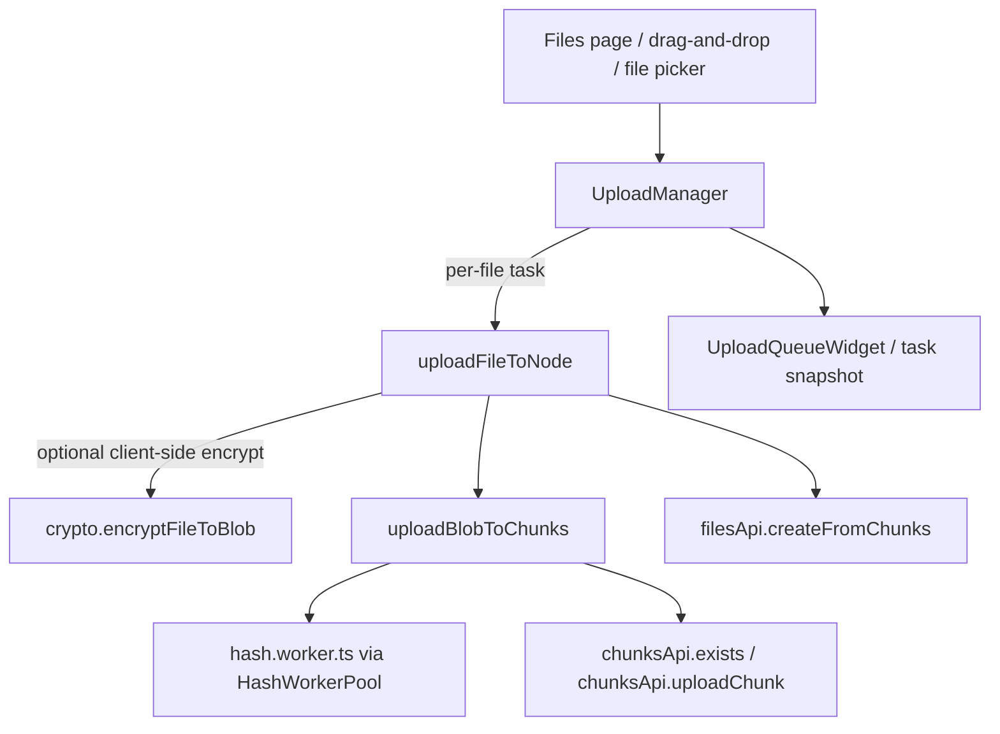
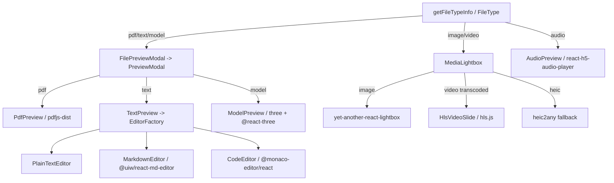

# 24. Frontend: Features & Upload Pipeline

This section documents the Cotton Cloud React/TypeScript frontend's *feature surface* and its *client upload pipeline*. The frontend lives under `src/cotton.client/`. It is organized into three concentric layers: `shared/` (cross-cutting building blocks — API clients, crypto, stores, the upload pipeline, the preview UI, notifications), `features/` (self-contained capability modules — auth, search, notifications, settings gate), and `pages/` (route-level screens that compose the above). This document covers (a) the client-side upload pipeline that splits, hashes, deduplicates, and parallelizes chunk uploads; (b) a structured map of every page/feature area; and (c) the media/preview UI. For the encryption that wraps uploads, see the *Cryptography Engine* (client-side) section; for the server endpoints these clients call, see the *Chunk & File Ingest* and *Search* server sections.

## Upload pipeline

The upload pipeline turns a browser `File`/`Blob` into a content-addressed file on the server: it splits the blob into chunks, hashes each chunk and the whole file in one streaming pass, skips chunks the server already owns (deduplication), uploads the rest, and finally finalizes the file from its ordered list of chunk hashes. The pipeline is entirely under `src/cotton.client/src/shared/upload/`.

### Layered structure



| Concern | File | Responsibility |
| --- | --- | --- |
| Per-file queue, concurrency, progress, quota, task model | `src/cotton.client/src/shared/upload/UploadManager.ts` | Singleton `uploadManager`; orchestrates multiple files, emits `AppTaskSnapshot` |
| Single-file orchestration | `src/cotton.client/src/shared/upload/uploadFileToNode.ts` | Optional client-side encryption, then chunk upload, then `filesApi.createFromChunks` |
| Chunk splitting, hashing, dedup, parallelism, retries | `src/cotton.client/src/shared/upload/uploadBlobToChunks.ts` | Core engine; returns `{ chunkHashes, fileHash }` |
| Adaptive parallelism | `src/cotton.client/src/shared/upload/AdaptiveConcurrencyController.ts` | Additive-increase / multiplicative-decrease lane controller |
| Speed estimation | `src/cotton.client/src/shared/upload/RollingBytesPerSecondEstimator.ts` | Rolling + average bytes/sec from a monotonic counter |
| Hashing primitives | `src/cotton.client/src/shared/upload/hash/hashing.ts` | `hash-wasm` + WebCrypto helpers, algorithm normalization |
| Web Worker hashing | `src/cotton.client/src/shared/upload/hash/hash.worker.ts`, `hashWorkerClient.ts`, `HashWorkerPool.ts` | Off-main-thread per-chunk + whole-file hashing with a worker pool |
| Tunables | `src/cotton.client/src/shared/upload/config.ts` | `uploadConfig` constants |
| Types | `src/cotton.client/src/shared/upload/types.ts` | `UploadServerParams`, `UploadProgressSnapshot`, `UploadFileToNodeCallbacks` |
| In-place re-encrypt / decrypt | `src/cotton.client/src/shared/upload/encryptExistingFileInPlace.ts`, `decryptExistingFileInPlace.ts` | Download → transform → re-upload existing file content |
| Legacy serial queue (unused by the manager) | `src/cotton.client/src/shared/upload/UploadQueue.ts` | Simple FIFO queue calling `uploadFileToNode` |
| Task model & shared task-manager alias | `src/cotton.client/src/shared/tasks/*` | Re-exports `uploadManager` as `taskManager`; defines `AppTask*` types and the encrypt/decrypt task wrappers |
| Queue widget UI | `src/cotton.client/src/app/layouts/components/UploadQueueWidget.tsx`, `uploadQueueUtils.ts`, `UploadFilePicker.tsx` | Bottom-right floating task widget; programmatic file picker |

> README note: the high-level README describes the upload path generically as "split by `server.maxChunkSizeBytes`, parallelize via `maxConcurrency` using a Set + `Promise.race` throttle, send only missing chunks." The code is more sophisticated: it does keep a `Set<Promise<void>>` of in-flight uploads and `await Promise.race(inFlight)`, but parallelism is governed by an *adaptive* controller (not a fixed `maxConcurrency`), chunk size is adaptive on network failure, and per-chunk dedup uses a pre-upload existence probe plus a server-side hash validation on ingest. Where this section and the README differ, the behavior below reflects the code.

### `uploadBlobToChunks` — the core engine

`uploadBlobToChunks` (in `src/cotton.client/src/shared/upload/uploadBlobToChunks.ts`) is the heart of the pipeline. Its signature returns `Promise<{ chunkHashes: string[]; fileHash: string }>`. The caller passes the `blob`, a display `fileName`, `server` params (`maxChunkSizeBytes`, `supportedHashAlgorithm`), optional `client` options (`UploadFileToNodeOptions`: `sendChunkHashForValidation`, `concurrency`), and an `onProgress` callback.

Key internal concepts:

- **Segments.** Work is modeled as `ChunkSegment` objects (`{ id, start, end, updateFileHash, networkFailures, availableAt, knownHash? }`). Initial segments are cut sequentially via `createNextInitialSegment()` using `activeChunkSize` (starting at `Math.max(1, server.maxChunkSizeBytes)`). Only initial segments carry `updateFileHash: true`; retry/verification segments do not (the whole-file hash is fed exactly once, in order, by the original covering segments).
- **Dedup probe.** When `sendChunkHashForValidation` is true (default), `uploadHashedChunk` first calls `chunksApi.exists(chunkHash, signal)` (`GET chunks/{hash}/exists`, with the hash URL-encoded and HTTP 404 treated as "not present") and, if the chunk already exists server-side, skips the body upload. Otherwise it `POST`s the raw bytes to `chunks/raw?hash=...` with `Content-Type: application/octet-stream` (`chunksApi.uploadChunk` in `src/cotton.client/src/shared/api/chunksApi.ts`). The server re-validates the body against the hash on ingest.
- **Ordered chunk hashes.** Completed segments are recorded in `uploadedSegments`; `buildOrderedChunkHashes()` sorts by `start` and asserts the segments cover `[0, blob.size)` contiguously, throwing `"Uploaded chunks do not cover the file contiguously."` / `"…do not cover the complete file."` on a gap or overlap, then returns the ordered hash list passed to `filesApi.createFromChunks`.

#### Concurrency and the in-flight throttle

Parallelism is driven by an `AdaptiveConcurrencyController` (`chunkUploadConcurrency`) whose `maxConcurrency` defaults to `uploadConfig.maxChunkUploadConcurrency` (4), with `rampUpDurationMs` set from `uploadConfig.concurrencyRampUpMs` (1200 ms). The main loop:

```ts
while (!fatalError) {
  const startedAny = startReadyUploads();          // fill lanes up to .current
  if (!(await waitForNextUploadActivity(startedAny))) break;
}
```

`startReadyUploads()` keeps starting uploads while `inFlight.size < chunkUploadConcurrency.current`, pulling a ready pending (retry) segment via `takeReadyPendingSegment(now)` or else a fresh initial segment via `createNextInitialSegment()`. Each upload promise is added to the `inFlight: Set<Promise<void>>` and self-removes on settle. `waitForNextUploadActivity` blocks on `Promise.race(inFlight)` when lanes are busy, or `delay`s until the next retry's `availableAt` (and then `waitForBrowserOnline()`) when only delayed retries remain. After the loop, it drains the remaining `inFlight` set and then the `fileHashUpdates` set before computing the digest.

#### Adaptive concurrency (`AdaptiveConcurrencyController`)

`src/cotton.client/src/shared/upload/AdaptiveConcurrencyController.ts` implements additive-increase / multiplicative-decrease. It starts at `minConcurrency` (default 1) and is clamped to `maxConcurrency`. On each `observe(sample)`:

- failed sample → halve concurrency (`Math.max(min, Math.ceil(current/2))`);
- successful sample with `bytes > 0` and `durationMs <= rampUpDurationMs` → `tryIncrease()` by one (a fast transfer means a single lane is not saturating the link);
- successful but slow (or zero-byte) → hold steady.

`uploadBlobToChunks` feeds samples from `completeSegment` (success) and `handleSegmentUploadFailure` (failure), both using `performance.now() - startedAt` as the duration.

#### Adaptive chunk sizing & retries

On a *connection interruption* (`isConnectionInterruption`: an Axios error with no `response`, code in `ERR_NETWORK`/`ECONNABORTED`/`ETIMEDOUT`/`ERR_NETWORK_CHANGED`, or a bare `request`; explicitly excludes `ERR_CANCELED`), the failed byte range is re-queued rather than failing the upload:

- `reduceChunkSize()` halves `activeChunkSize` down to `minChunkSize` (`Math.max(1, Math.min(uploadConfig.minAdaptiveChunkSizeBytes = 128 KiB, initialChunkSize))`), and `queueRetrySegments` splits the failed range into `activeChunkSize`-sized retry segments scheduled at `availableAt = Date.now() + getRetryDelayMs(failures)`.
- Backoff: `getRetryDelayMs(n) = Math.min(5000, 250 * 2 ** Math.min(Math.max(0, n-1), 4))` — exponential to a 5 s ceiling.
- If `sendChunkHashForValidation` was on and a chunk hash had already been computed, the failure path instead enqueues a *verification* segment (`queueVerificationSegment` → handled by `verifyKnownHashSegment`): it re-probes `chunksApi.exists(knownHash)` to see whether the interrupted POST actually landed, completing the segment without re-sending if so. This avoids redundant re-uploads after a flaky network blip.

Any non-interruption error (e.g. an HTTP 4xx/5xx response, or an encryption failure upstream) calls `failUpload(error)`, which records the first `fatalError`, aborts the shared `AbortController` (cancelling in-flight chunk requests), and wakes all hash waiters so the upload rejects.

#### Single-pass whole-file hashing with backpressure

A subtle part of the engine is that the *per-chunk* hash and the *whole-file* hash are produced from the same bytes without a second read. For each initial segment, after reading `chunk.arrayBuffer()`, it (1) kicks off `hashBuffer(buffer, algorithm)` for the chunk hash and (2) calls `queueFileHashUpdate` to feed the buffer into the rolling whole-file hasher *in start order*.

Whole-file ordering is enforced by `waitForFileHashTurn(segment)` (a segment may only update the file hash when `segment.start === nextFileHashOffset`) and `advanceFileHashOffset`. Because chunks are read ahead of being hashed, a byte budget (`maxQueuedFileHashBytes`, computed as `Math.max(initialChunkSize, Math.min(initialChunkSize * chunkUploadConcurrency.max, 64 MiB))`) applies backpressure via `reserveFileHashQueueBytes`/`releaseFileHashQueueBytes`, preventing unbounded memory growth while many buffers wait their turn. After draining, a `nextFileHashOffset !== blob.size` check throws `"File hash did not cover the complete file."`.

### `hash.worker.ts`, `HashWorkerClient`, and `HashWorkerPool`

Hashing runs off the main thread when `canUseHashWorker()` returns true (i.e. `typeof Worker !== "undefined"`). `src/cotton.client/src/shared/upload/hash/hash.worker.ts` maintains two `hash-wasm` hashers — `fileHasher` (incremental, spans the whole file) and `chunkHasher` (re-`init()`ed per chunk). It handles four message types: `init` (lazily creates/resets both hashers via `ensureInitialized`), `hashChunk` (updates the file hash unless `updateFileHash === false`, then `init→update→digest` for the chunk hash), `updateFileHash`, and `digestFile` (finalizes and `init()`s the file hasher again so the worker is reusable). It supports `SHA-1`/`SHA-256`/`SHA-384`/`SHA-512`, defaulting to `SHA-256`.

`HashWorkerClient` (`hashWorkerClient.ts`) wraps a `new Worker(new URL("./hash.worker.ts", import.meta.url), { type: "module" })`, correlates requests by `requestId`, and stores an `initBarrier` promise so `hashChunk`/`updateFileHash`/`digestFile` await `ensureInitialized()` before running.

`HashWorkerPool` (`HashWorkerPool.ts`) exists specifically to avoid `"Out of memory: Cannot allocate Wasm memory"` when uploading thousands of files: rather than spawning a worker per file, a global singleton pool (`globalHashWorkerPool`, `maxWorkers = 4`) reuses workers. `acquire(algorithm)` reuses an available worker (re-`init`ing it first), creates one if under the cap, or polls every 50 ms (`setInterval`) for a free worker; `release(worker)` returns it to the pool (it does *not* terminate). `uploadBlobToChunks` acquires a worker at the start (or, when workers are unavailable, falls back to a main-thread `createIncrementalHasher`) and releases the worker in a `finally`. `UploadManager.destroy()` calls `globalHashWorkerPool.destroy()`, which terminates all workers.

Note that `updateFileHashFromBuffer` in `uploadBlobToChunks` uses the worker (`worker.updateFileHash`) when available, but the *chunk* hash (`hashBuffer`) prefers `crypto.subtle.digest` on the main thread (with a `hash-wasm` fallback when `crypto.subtle` is unavailable) — so chunk hashing and file hashing can use different code paths even within one upload.

### `UploadManager` and the task model

`UploadManager` (`src/cotton.client/src/shared/upload/UploadManager.ts`) is exported as the `uploadManager` singleton and re-exported as `taskManager` from `src/cotton.client/src/shared/tasks/taskManager.ts`. It is the multi-file orchestrator, the progress/speed/error tracker, and the source of the UI's `AppTaskSnapshot`. It is an external store: components subscribe via `subscribe(listener)` and read `getSnapshot()` (consumed through React's `useSyncExternalStore`).

It tracks two task arrays: real upload tasks (`UploadTaskInternal`, extending `UploadTask` with private `_file`, `_encrypt`, lane-probe, speed, and quota fields) and *external* tasks (`ExternalTaskInternal`) created via `createTask()` for non-upload work (encrypt/decrypt/etc.). Both are projected to the public `AppTask` shape in `emit()`.

`AppTask` (`src/cotton.client/src/shared/tasks/types.ts`):

| Field | Type | Notes |
| --- | --- | --- |
| `id` | string | task id |
| `kind` | `"upload" \| "encrypt" \| "decrypt" \| "convert" \| "delete" \| "system"` | task category (`AppTaskKind`) |
| `label` | string | upload tasks use the file name |
| `scopeLabel` | string | upload tasks use the target node label |
| `status` | `"queued" \| "running" \| "finalizing" \| "completed" \| "failed"` | upload tasks map their internal `"uploading"` → `"running"` (`toAppTaskStatus`) |
| `bytesTotal` / `bytesCompleted` / `progress01` | number | progress |
| `speedBytesPerSec` | number \| null | per-task rolling speed |
| `error` / `errorKey` / `errorParams` | string / i18n key / params | localizable failure |
| `completedAt` | number | used for pruning |

`AppTaskHandle` returned by `createTask` exposes `id`, `update(UpdateAppTaskOptions)`, `complete()`, and `fail({ message, key, params })`.

#### Enqueue → pump → start flow

```mermaid
sequenceDiagram
  participant UI as useFileUpload
  participant M as UploadManager
  participant Q as storageQuotaApi
  participant F as uploadFileToNode
  UI->>M: enqueue(files, nodeId, nodeLabel, {encrypt})
  M->>M: pump()
  M->>Q: getCurrent() (if snapshot stale > 30s)
  M->>M: tryReserveQuotaForTask(next)
  M->>F: startTask -> uploadFileToNode(...)
  F-->>M: onEncryptProgress / onProgress / onFinalizing
  F-->>M: resolve (manifest) or throw
  M->>M: status completed/failed; fileConcurrency.observe; pump()
```

- **`enqueue(files, nodeId, nodeLabel, options?)`** unshifts new `queued` tasks (carrying `_encrypt` from `options?.encrypt`), opens the widget, prunes finished tasks, emits, and pumps. When no tasks were active (`!hasActiveTasks()`), overall counters and `fileConcurrency` are reset first.
- **`pump`** is re-entrancy-guarded (`pumping`). While `activeUploads < fileConcurrency.current`, it finds the next `queued` task. It requires cached server settings (`getCachedServerSettings()`; otherwise the task fails with `errorKey: "serverSettingsNotLoaded"`). If the quota snapshot is older than `QUOTA_SNAPSHOT_TTL_MS` (30 s) it calls `refreshQuotaSnapshot()` and returns (pump resumes from the refresh's `finally`). Otherwise it attempts a quota reservation, then starts the task with `{ maxChunkSizeBytes, supportedHashAlgorithm }` from settings.
- **Quota.** `tryReserveQuotaForTask` short-circuits to `true` (no reservation) when there is no quota snapshot, `quota.quotaBytes` is falsy, or `quota.availableBytes === null` (unlimited). Otherwise it reserves `_file.size` against `Math.max(0, quota.availableBytes - pendingQuotaBytes)`; if insufficient it fails the task with `errorKey: "storageQuotaExceeded"` and `errorParams.available` (a `formatBytes` string). `releaseQuotaReservation(task, committed)` releases pending bytes and, on commit, optimistically increments `usedBytes`/decrements `availableBytes` in the local snapshot.
- **`startTask`** sets status `uploading`, starts a per-task `RollingBytesPerSecondEstimator` (`windowMs: 1500`, `minDurationMs: 250`), arms a head-of-line lane probe (`setTimeout` of `uploadConfig.fileHeadOfLineProbeMs = 1500 ms`), and runs `uploadFileToNode` with callbacks that translate `onEncryptProgress`/`onEncryptComplete` into a child `encrypt` external task, `onProgress` into byte/speed/overall updates (throttled to `uploadConfig.progressEmitIntervalMs = 100 ms`, but emitted immediately on a regress or on completion), and `onFinalizing` into status `finalizing`. The overall speed uses a separate `RollingBytesPerSecondEstimator` (`windowMs: 2000`, `minDurationMs: 300`). On success it calls `scheduleNodeRefresh(task.nodeId)` (debounced 300 ms → `refreshNodeContent`).

#### File-level adaptive concurrency & head-of-line probe

A second `AdaptiveConcurrencyController` (`fileConcurrency`, `maxConcurrency = uploadConfig.maxConcurrentFileUploads = 4`) governs how many *files* upload at once. It starts at 1 (so a single large file gets full chunk-level parallelism). On completion/failure, `fileConcurrency.observe(...)` is fed the file's total bytes and its end-to-end duration. Additionally, `maybeOpenLaneForHeadOfLine` cautiously opens a *second* file lane when the first file has shown progress (`_sawProgress`), has been running at least `fileHeadOfLineProbeMs`, `fileConcurrency.current` is still 1, and there are still queued files — so small files are not stuck behind one large in-flight upload.

#### Error mapping

On `uploadFileToNode` throw, the upload task is marked `failed` with an `errorKey`: `NoKeyError` → `"encryptionVaultLocked"`; `ClientEncryptionSizeLimitError` → `"clientEncryptionFileTooLarge"` (with a `maxSize` param via `formatBytes(e.maxBytes)`); otherwise `"uploadFailed"`. A child `encrypt` task, if still running, is failed with the same `NoKeyError`/`ClientEncryptionSizeLimitError` keys but with `"encryptionFailed"` as its fallback (rather than `"uploadFailed"`).

#### Pruning & lifecycle

Finished tasks (`completed`/`failed`) are pruned by a `setInterval` every `PRUNE_INTERVAL_MS` (5 min): tasks older than `FINISHED_TASK_TTL_MS` (30 min) are dropped, and at most `MAX_FINISHED_TASKS` (10 000) finished tasks are retained per array. `clearFinished({ includeCompleted, includeFailed })` (both default `true`) is the widget's close action. `destroy()` clears the prune interval and tears down the worker pool.

### `uploadFileToNode` and in-place transforms

`uploadFileToNode` (`src/cotton.client/src/shared/upload/uploadFileToNode.ts`) orchestrates one file:

1. It computes `originalContentType` as `file.type` when non-empty, otherwise the `ENCRYPTED_CONTENT_TYPE` constant. If `encrypt` is set, it asserts the blob-pipeline size limit (`assertClientEncryptionBlobPipelineSize(file.size, "encrypt")`), requires the master key (`requireMasterKey()`), builds `encryptDisplayMeta({ name: file.name, contentType: originalContentType })`, encrypts via `encryptFileToBlob` (emitting `onEncryptProgress`, then firing `onEncryptComplete`), sets `contentType = ENCRYPTED_CONTENT_TYPE`, replaces the server-visible name with an opaque UUID (`createOpaqueServerFileName`), and attaches metadata `{ [ENCRYPTED_FLAG_KEY]: "true", [DISPLAY_META_KEY]: <encrypted meta> }`.
2. Calls `uploadBlobToChunks` to get `{ chunkHashes, fileHash }` (passing `fileName: file.name`).
3. Calls `onFinalizing`, then `filesApi.createFromChunks({ nodeId, chunkHashes, name, contentType, hash: fileHash, originalNodeFileId: null, metadata })` (`POST files/from-chunks`), returning the `NodeFileManifestDto`.

`encryptExistingFileInPlace` / `decryptExistingFileInPlace` re-encode an already-stored file: they obtain a download link (`filesApi.getDownloadLink`), `fetch` the current content, transform it (`encryptFileToBlob` / `decryptBlobToBlob`), re-run `uploadBlobToChunks`, and finalize via `filesApi.updateFileContent(file.id, ...)` (`PATCH files/{nodeFileId}/update-content`). The encrypt path writes the opaque name and encrypted metadata; the decrypt path restores the display name/content-type (resolved through `applyDisplayMetaToFile` / `getOriginalContentType`) and clears metadata. The `encryptExistingFileWithTask` / `decryptExistingFileWithTask` wrappers in `src/cotton.client/src/shared/tasks/encryptExistingFileTask.ts` drive these through a `taskManager.createTask({ kind: "encrypt" | "decrypt" })` handle, reporting encrypt/decrypt and upload progress and mapping failures to `"encryptionVaultLocked"` / `"clientEncryptionFileTooLarge"` (with `maxSize`) / `"encryptionFailed"` or `"decryptionFailed"`. These power the folder-encryption "encrypt existing files / decrypt existing files" prompts on the files page.

### Upload queue widget & file picker

`UploadQueueWidget.tsx` (component `TaskQueueWidget`, also re-exported as `UploadQueueWidget`) renders a fixed bottom-right `Paper` widget when `snapshot.open && stats.total > 0`. It reads the manager via `useSyncExternalStore`, sorts tasks by priority (`sortTasksByPriority` in `uploadQueueUtils.ts`: `failed → active → queued → completed → rest`), computes stats and an i18n title (with overall speed via `formatBytes`), and shows a collapsible task list. Its close button calls `taskManager.clearFinished({ includeCompleted: true, includeFailed: true })` (hidden while tasks are active).

`UploadFilePicker.tsx` registers a callback with `uploadManager.setFilePickerOpen`. When the manager calls `openFilePicker(context)`, the picker prefers the File System Access API (`window.showOpenFilePicker`) and falls back to a hidden `<input type="file">` on cancel/denial; selected files flow back through `uploadManager.handleFilePickerSelection` → `enqueue`.

## Feature areas (page & feature map)

This is the canonical map of the route-level pages (`src/cotton.client/src/pages/**`) and capability modules (`src/cotton.client/src/features/**`). Each entry names the entry component and the most load-bearing supporting files.

### Files browser (`pages/files`)

The primary screen. `src/cotton.client/src/pages/files/FilesPage.tsx` (component `FilesPage`, rendering the split-view component `FilesPageView`) composes the node store, layout, data loading, real-time events, selection, move/clipboard, upload, preview, and client-encryption flows.

- **Views & view hooks.** `components/views/FileListViewFactory.tsx` switches on `InterfaceLayoutType` (from `shared/api/layoutsApi`) between `TilesView.tsx` and `ListView.tsx` (the latter using `createFileListColumns` from `fileListColumns.tsx` over `@mui/x-data-grid`'s `DataGrid`). Tile drag-and-drop (intra-folder move) is `components/views/hooks/useTileDragAndDrop.ts`; grid layout is `useTileGridLayout.ts`. `TileItem.tsx`, `NewFolderCard.tsx`, and `BlurredPreviewImage.tsx` render individual tiles; `dragPreview.ts` builds the drag image.
- **Card & marquee.** `components/FileSystemItemCard.tsx` is the shared item card. Its `HoverMarqueeText` subcomponent measures text overflow with a `ResizeObserver` and, after a 300 ms hover delay, animates a CSS `@keyframes fsCardMarquee` scroll (`~40 px/s`, clamped to 4–14 s via `Math.max(4, Math.min(14, distancePx / 40))`) for long names. `FolderCard.tsx`, `RenamableItemCard.tsx`, and `InlineRenameField.tsx` build on it.
- **File versions.** `components/FileVersionsDialog.tsx` lists versions via `useFileVersionsQuery`, with restore/delete/download per version (`useRestoreFileVersionMutation`, `useDeleteFileVersionMutation`, `filesApi.getVersionDownloadLink`), guarded by `material-ui-confirm` (`useConfirm`). Current/original versions are chipped (`isCurrent`/`isOriginal` from `FileVersionDto`); only `canDelete` versions can be deleted; current versions cannot be restored.
- **Drag-and-drop upload.** `hooks/useFileUpload.ts` is large and central: it tracks drag depth, recursively walks `DataTransferItem` directory trees (`getAllFilesFromItems`, `webkitGetAsEntry`), recreates the folder structure server-side (`ensureFolderPath`/`ensureFolder`, propagating the folder-encryption policy), resolves name conflicts (`resolveUploadConflicts` with a `FileConflictDialog`/`useFileConflictDialog`), tracks a `DropPreparationState` machine (`DropPreparationStep`: `idle → scanning → mapping → folders → conflicts → enqueue`), reports skipped `NotFoundError` entries via a `SkippedUploadItemsDialog` (defined inside `FilesPage.tsx`), decides per-target encryption (`decideEncrypt`/vault-locked check), and finally calls `uploadManager.enqueue(...)`. A simpler flat multi-file `<input>` path handles the upload button.
- **Encryption prompts.** `FolderEncryptionActionPrompt.tsx`, `ClientEncryptionUnlockForm` (imported from `../profile/components/ClientEncryptionUnlockForm`), and `useFolderClientEncryptionActions.ts` drive the "encrypt/decrypt existing files" and folder-unlock flows; `FilesPage` gates folder navigation and markdown-file creation on vault unlock when a folder's `FOLDER_ENCRYPTION_POLICY_KEY` (`"isClientEncryptionEnabled"`) policy is effective.
- **Other.** `PageHeader.tsx` (breadcrumbs, view-mode toggle, upload/new-file/new-folder, selection actions), `FileBreadcrumbs.tsx`, `DraggingOverlay.tsx`, `useFileMoveController.ts` (cut/paste/move), `useDeleteSelectedItems.ts`, `useFilesRealtimeEvents.ts` (SignalR-driven query invalidation on `HUB_METHODS.FileCreated`/`FileUpdated`/`FileRenamed`/`FileRestored` and preview-hash updates on `HUB_METHODS.PreviewGenerated`). Huge folders (children count `> HUGE_FOLDER_THRESHOLD = 100 000`) are forced into list view. The new-folder shortcut is Ctrl/Cmd+Shift+N (`isCreateFolderShortcut`). Markdown file creation uploads an empty `new File([""], name, { type: "text/markdown" })` through `uploadFileToNode`, honoring the folder's effective encryption policy.

### Search (`features/search` + `pages/search`)

Two surfaces share search infrastructure. `features/search/SearchModal.tsx` is a global modal (opened via the `openSearchModal()` helper / `OPEN_SEARCH_EVENT = "cotton:open-search"` window event in `searchEvents.ts`) that searches the current root layout (`layoutId` from `useRootNodeQuery`), paginates with `react-virtuoso` (`Virtuoso` + `hooks/useSearchPagination.ts`), highlights dictionary matches (`hooks/useDictionaryMatch.ts`, `utils/normalizeSearch.ts`), and renders `components/SearchResultRow.tsx` / `SearchResultsScroller.tsx` with file icons (`utils/fileIcon.tsx`). It can open results directly into `FilePreviewModal`/`MediaLightbox`. `pages/search/SearchPage.tsx` is the full-page equivalent: it uses `hooks/useLayoutSearch.ts` and reuses the files' `FileListViewFactory`, `useFileListPageLogic`, and preview layers, with a `components/SearchBar.tsx`.

### Share (`pages/share`)

`pages/share/SharePage.tsx` resolves a public share token (route param `:token`) into either a single shared file or a shared folder. It uses `sharedFoldersApi.getInfo`, the `shareLinks`/`shareLinkAction` utilities, `hooks/useShareFileInfo.ts`, and renders `components/ShareFileViewer.tsx`, `SharedFolderViewer.tsx`, and `ShareHeaderBar.tsx`. `utils/sharePageViewState.ts` computes the `SharePageViewState` (`folder` / `file` / `file-error`). Share previews reuse the same preview components with `kind: "url"` sources whose `getPreviewUrl` resolves an inline URL built by `shareLinks.buildTokenDownloadUrl(token, "inline")` (i.e. `/s/{token}?view=inline`).

### Trash (`pages/trash`)

`pages/trash/TrashPage.tsx` browses soft-deleted nodes via the trash query layer (`useTrashRootQuery`, `useTrashChildrenQuery`, `useTrashNodeMetaQuery`, `invalidateTrashChildren`). It reuses the files `FileListViewFactory`/`PageHeader`, adds bulk/restore actions (`hooks/useTrashBulkActions`, `useTrashRestoreActions`, `useTrashListData`, plus `useTrashFileOperations`/`useTrashFolderOperations`), and handles restore conflicts (`components/RestoreConflictDialog.tsx`). Layout preference is stored locally (`useLocalPreferencesStore`).

### Login & auth (`pages/login` + `features/auth`)

`pages/login/LoginPage.tsx` composes `components/CredentialsFields`, `TwoFactorFields`, `TrustDeviceToggle`, `ForgotPasswordLink`, `FirstRunAlert`, and `OidcProviderButtons`; form logic is in `useLoginForm.ts`/`loginUtils.ts`. **Demo credentials**: `demoCredentials.ts` generates/persists deterministic-shape demo accounts — username `u_` + 6 lowercase-alphanumerics (validated by `/^u_[a-z0-9]{6}$/`), a 32-char password (`passwordLength = 32`), themed first/last names from fixed word lists, validated by `isDemoCredentials`, stored under `DEMO_CREDENTIALS_STORAGE_KEY = STORAGE_KEY_PREFIX + "demo-credentials"` (via `generateDemoCredentials`/`getOrCreateDemoCredentials`).

`features/auth` provides the auth context: `AuthProvider.tsx` (session restore via `authApi.refresh` + `authApi.me`, the `auth:logout` event handler, user-scoped store resets (`resetUserScopedStores`) on identity change, and a post-unlock retry keyed off `JUST_UNLOCKED_STORAGE_KEY`), `useAuth.ts`, route guards `RequireAuth.tsx`/`RequireAdmin.tsx`, OIDC sign-in session helpers (`oidcSignInSession.ts`), `authStorageKeys.ts`, and `types.ts` (`User`, `UserRole`, `AuthContextValue`).

### Onboarding, setup, and the setup gate (`pages/onboarding`, `pages/setup`, `features/settings`)

`pages/onboarding/OnboardingPage.tsx` is a rotating feature carousel shown before first use, with a "skip" action. `pages/setup/SetupWizardPage.tsx` is the first-run admin wizard: step definitions live in `setupQuestions.tsx` (exported as `setupStepDefinitions`), step orchestration in `useSetupSteps.tsx`, and answers are converted to server values and posted via `settingsApi` (`saveSetupStep`). `features/settings/SetupGate.tsx` guards routing: for admins it fetches `useSetupStatusStore` status and redirects to `/setup` until the server is initialized (and away from `/setup` once it is, except in `?preview=1` mode); non-admins are treated as initialized (`UserRole.Admin` check).

### Unlock (`pages/unlock`)

`pages/unlock/UnlockPage.tsx` is the **server master-key unlock UI** for the at-rest encryption boot flow (not the client vault). It calls `unlockApi.getStatus()`/`generateKey()`/`unlock()`/`waitUntilAppReady()`, validates a 32-character master key (`masterKeyLength = 32`), optionally requires a bootstrap token (`requiresBootstrapToken`, with a formatted `firstUnlockExpiresAtUtc` expiry), and on success records `JUST_UNLOCKED_STORAGE_KEY` (`rememberJustUnlocked`) and calls `window.location.replace("/")`.

> BIP39 clarification: the README/spec for this section mentions "bip39" near the unlock UI. In the code, BIP39 is *not* part of the server `UnlockPage`. The 24-word BIP39 recovery phrase belongs to the **client-side encryption vault** and lives in `shared/crypto/recoveryKey.ts` (`@scure/bip39`, `RECOVERY_WORD_COUNT = 24`, `RECOVERY_ENTROPY_BITS = 256`, `generateRecoveryPhrase`/`validateRecoveryPhrase`), surfaced in `pages/profile/components/ClientEncryptionSetupForm.tsx`. See the *Cryptography Engine* (client-side) section for that flow.

### Email verification & password reset (`pages/verify-email`, `pages/reset-password`)

`pages/verify-email/VerifyEmailPage.tsx` consumes a `?token=` query param and posts to `authApi` to verify, guarding against double-submit with a ref. `pages/reset-password/ResetPasswordPage.tsx` is a token-driven new-password form (with confirm/match validation) calling `authApi`.

### Profile (`pages/profile`)

`pages/profile/ProfilePage.tsx` (the component is exported as `SettingsPage`) stacks accordion cards (`ProfileAccordionCard.tsx`):

- `UserInfoCard.tsx` + `components/user-info/*` — identity header (`UserInfoHeader.tsx`), avatar upload (`AvatarUploadControl.tsx`, `avatarUploadUtils.ts` with HEIC/HEIF handling via dynamic `heic2any` import), info rows (`InfoRow.tsx`).
- `PasskeysCard.tsx` — WebAuthn passkey management via `passkeysApi` plus `isPasskeySupported`, `toCredentialCreationOptions`, `serializeAttestationCredential`; register/rename/delete credentials.
- `SessionsCard.tsx` + `SessionItem.tsx` + `sessionUtils.tsx`/`deviceIcons.tsx` — active session list via `sessionsApi.getSessions`, with revoke (`sessionsApi.revokeSession`) confirmed via `material-ui-confirm`.
- `TotpSettingsCard.tsx` + `TotpSetupForm.tsx` — TOTP 2FA enable/disable.
- `ChangePasswordCard.tsx`, `EditProfileCard.tsx`, `ConnectedAccountsCard.tsx` (linked OIDC), `WebDavTokenCard.tsx` (WebDAV access token), `ShareLinkSettingsCard.tsx`, `AppearanceSettingsCard.tsx` (theme/preferences).
- `ClientEncryptionCard.tsx` + `ClientEncryptionSetupForm.tsx` / `ClientEncryptionUnlockForm.tsx` — client vault setup (BIP39 recovery phrase) and unlock.

### Home & not-found (`pages/home`, `pages/not-found`)

`pages/home/HomePage.tsx` is the dashboard: root layout resolution (`useRootNodeQuery`), storage stats (`useLayoutStatsQuery`, `formatBytes`), and recent files (`useRecentFilesQuery` → `components/RecentFilesCard.tsx` / `RecentFileItem.tsx`, which can deep-link a file into the files page via router state `selectedFileId`). `pages/not-found/NotFoundPage.tsx` is a static localized 404.

### Admin pages (`pages/admin`)

`pages/admin/AdminLayoutPage.tsx` is an icon rail + `<Outlet/>` shell over a fixed-width surface (`components/AdminPageSurface.tsx`). Sub-pages:

| Page | Entry component | Notes |
| --- | --- | --- |
| Users | `users/AdminUsersPage.tsx` | `@mui/x-data-grid` `DataGrid`; `useAdminUsersData`/`useAdminUsersColumns`; create/edit dialogs (`CreateUserDialog`/`EditUserDialog`); `UserRoleSelect` |
| Groups | `groups/AdminGroupsPage.tsx` | Informational placeholder (an `Alert`; no grid in code) |
| General/Privacy/Notifications/Storage settings | `settings/AdminGeneralSettingsPage.tsx`, `AdminPrivacySettingsPage.tsx`, `AdminNotificationsSettingsPage.tsx`, `AdminStorageSettingsPage.tsx` | Auto-saved settings via `useAutoSavedSetting.ts`; SMTP/email mode, GeoIP lookup mode, timezone, public base URL, server-usage, storage backend |
| Security diagnostics | `security/AdminSecurityDiagnosticsPage.tsx` | Read-only security posture checks with status chips |
| Storage statistics | `storage-statistics/AdminStorageStatisticsPage.tsx` | Charts + timeline |
| Database backup | `database-backup/AdminDatabaseBackupPage.tsx` | Trigger/download backups |
| Identity providers | `identity-providers/AdminIdentityProvidersPage.tsx` | OIDC providers grid (`useAdminOidcProvidersQuery`, `useOidcProviderColumns`), `OidcProviderFormDialog`, `oidcProviderForm.ts` |

## Media & preview UI (`shared/ui/preview`)

The preview layer renders rich previews for documents, code/text, 3D models, audio, video, and images. It is split into a document/model modal (`FilePreviewModal`) and an image/video gallery (`MediaLightbox`). Heavy renderers are `React.lazy`-loaded so their large dependencies (Monaco, three.js, pdf.js, hls.js, heic2any) are code-split. Routing between modal and lightbox is driven by `getFileTypeInfo` / `FileType` (`shared/utils/fileTypes.ts`, values `"image" | "model" | "pdf" | "video" | "audio" | "text"`) at the call sites.



`shared/ui/preview/index.ts` exports `PreviewModal`, `PdfPreview`, `TextPreview`, `ModelPreview`, `FilePreviewModal`, and `MediaLightbox`.

### Document/model modal — `FilePreviewModal` + factories

`FilePreviewModal.tsx` chooses a renderer by `FileType` (`pdf` / `text` / `model`), lazy-loads `PdfPreview`/`TextPreview`/`ModelPreview` behind a `CircularProgress` `Suspense` fallback, and wraps them in `PreviewModal.tsx`. `getPreviewLayout` selects a `"header"` layout for PDF and models, otherwise `"overlay"`; models also `forceFullScreen` and add a header toolbar (`ModelHeaderActions`) of: cycle lighting, toggle shadows, cycle surface, flip, auto-orient, auto-align, and a color-palette popover (`ModelPalettePopover`, with a reset-color action).

- **PDF** — `PdfPreview.tsx` resolves an inline-capable URL. For a `fileId` source it gets a download link (`filesApi.getDownloadLink`, 1440 min) and appends `download=false`; for a `url` source (shares) it calls `getPreviewUrl`. It fetches the URL as a blob (avoiding SPA route interception) and renders via a same-origin `<iframe>` by default; on mobile (`forcePdfJs` initialized from the UA test) or on iframe error it falls back to manual `pdfjs-dist/legacy/build/pdf.mjs` rendering (`getDocument`, per-page canvas + selectable `TextLayer`, worker from `pdfjs-dist/legacy/build/pdf.worker.min.mjs?url`). Blob URLs are cached per source key (`blobUrlCache`). Files over `previewConfig.MAX_PDF_PREVIEW_SIZE_BYTES` (100 MiB) show a "too large" message.
- **Text/code/markdown** — `TextPreview.tsx` loads content (`hooks/useTextFileContent.ts`). The size ceiling is `previewConfig.MAX_TEXT_PREVIEW_SIZE_BYTES` (512 KiB) for plaintext, but `CLIENT_ENCRYPTION_BLOB_PIPELINE_MAX_BYTES` for client-encrypted files; over the limit it shows a "too large" error. It chooses an editor mode (`hooks/useEditorMode.ts`, `EditorMode` enum) and language (`hooks/useLanguageSelection.ts`) and renders via `factories/EditorFactory.tsx`. The factory maps `EditorMode.Text → PlainTextEditor` (eager), `EditorMode.Markdown → MarkdownEditor` (lazy, `@uiw/react-md-editor`), or `EditorMode.Code → CodeEditor` (lazy, `@monaco-editor/react`, language from `detectMonacoLanguageFromFileName`, theme following MUI mode). Editing is disabled for client-encrypted files (`isFileEncrypted(sourceFile.metadata)`); saving goes through `hooks/useTextFileSave.ts`. Toolbar/state components are `components/TextPreviewToolbar.tsx`, `TextPreviewStates.tsx`, and editor selectors under `editors/`.
- **3D models** — `ModelPreview.tsx` resolves the model format (`resolveModelFormat` from `shared/utils/modelFormats`, supporting `stl`/`ply`/`obj`/`fbx`/`3mf`/`gltf`/`glb`) and a quality mode (`resolveQualityMode` → `"normal" | "reduced"`, by file size), then renders `components/ModelPreviewScene.tsx` (`@react-three/fiber` `Canvas` + `@react-three/drei` helpers over `three`). Loading/parsing/orientation live in `loader.ts`, `materials.ts`, `lighting.ts`, `orientation.ts`, `modelPreviewCore.ts`, with controls/state in `hooks/useModelPreviewControls.ts`, `useModelPreviewState.ts`, and palette in `modelPalette.ts`. `LIGHTING_PRESET_CONFIG` (in `lighting.ts`) supplies `balanced`/`studio`/`dramatic` presets.

### Image/video gallery — `MediaLightbox`

`MediaLightbox.tsx` wraps `yet-another-react-lightbox` with the `Video`, `Zoom`, `Slideshow`, `Thumbnails` (desktop/non-touch only), `Download`, and `Share` plugins. Highlights:

- **Slide sourcing & prefetch.** `useMediaLightboxUrls.ts` lazily fetches signed media URLs (`getSignedMediaUrl`) and, for images, rewrites the `preview` query param to `true`/`false` (`applyPreviewModeToUrl`) from the user's `galleryPreferPreview` preference (read in `MediaLightbox.tsx` via `selectGalleryPreferPreview` and passed down). The lightbox prefetches `LIGHTBOX_PREFETCH_OFFSETS = [-1, 0, 1]` around the current index (`ensureSlideHasOriginal`) and de-dupes in-flight loads. `buildSlidesFromItems` (`mediaLightboxSlides.ts`) constructs lightbox slides.
- **HEIC fallback.** When an image slide errors and the item is a `.heic`, `handleSlideImageError` runs `convertHeicToJpeg` (`shared/utils/heicConverter.ts`): it first tries a native browser `` decode, otherwise dynamically imports `heic2any` to transcode to JPEG (`quality: 0.92`) and swaps in a blob URL. Results are cached (`heicUrlCache`); `cleanupHeicUrl` revokes them.
- **Transcoded video (HLS).** Slides of type `HLS_VIDEO_SLIDE_TYPE` render the lazy `HlsVideoSlide.tsx`, which dynamically injects `hls.js` via a `<script>` tag (from `hls.js/dist/hls.min.js?url`) only when needed, attaches it to a `<video>` (or falls back to native `application/vnd.apple.mpegurl` playback), and shows a transient "transcoding" notice (`TRANSCODE_NOTICE_MS = 7000` ms) or an error message. Playback is force-stopped on close/exit via `mediaLightboxPlayback.ts`.
- **Native share.** A custom share handler uses `navigator.canShare`/`navigator.share` with a share-link URL (`shareLinks.buildShareUrl` from an extracted token) when available; the custom download uses the plugin's `saveAs`.
- **Controls auto-hide.** On pointer devices, `useActivityDetection(2500)` (`shared/hooks/useActivityDetection.ts`) hides controls after 2.5 s of `mousemove`/`mousedown`/`wheel` inactivity (deliberately ignoring `keydown` and touch events). On touch devices, controls toggle on tap with a 2.5 s auto-hide timer (`TOUCH_CONTROLS_AUTOHIDE_MS = 2500`). Optional in-lightbox delete (`onDelete`, also bound to the `Delete` key) rounds it out.

### Audio

`AudioPreview.tsx` uses `react-h5-audio-player`, themed to the MUI palette. It builds an inline URL (`download=false` via `buildInlineAudioUrl`) from `filesApi.getDownloadLink` (cached, `EXPIRE_AFTER_MINUTES = 60 * 24 = 1440`) and supports a playlist with prev/next/auto-advance when more than one item is provided. (The global audio player store `audioPlayerStore` and `FilesPage`'s `setScanRootNodeId` feed playlist context.)

### Notifications UI

`shared/ui/notifications/` provides the toast system. `NotificationProvider.tsx` wraps `notistack`'s `SnackbarProvider` (`maxSnack={4}`, `autoHideDuration={4500}`, `anchorOrigin={{ vertical: "bottom", horizontal: "right" }}`, `preventDuplicate`) with a custom themed content component (per-variant tone/icon, close button). `toast.ts` exposes a small `toast(message, options)` facade (`success`/`error`/`info`/`warning`/`dismiss`/`isActive`) over `enqueueSnackbar`, with an `activeToastIds` set to honor `toastId` dedup and `autoClose: false` → persistent.

`features/notifications/useEventHub.ts` is the real-time bridge: while authenticated it starts the SignalR `eventHub` (disposing it when not), invalidates notification queries on (re)connect (`onConnected` → `invalidateNotificationQueries`), and on `HUB_METHODS.NotificationReceived` validates the payload (`notificationSchema.safeParse`), prepends it to the cached list (`prependCachedNotification`), and plays `/assets/sounds/notification-3.mp3` (volume 0.5) if the user's notification-sound preference is on.

## Concurrency, failure modes & security notes

- **Single-pass hashing correctness.** The whole-file hash is fed strictly in byte order from initial segments only; retries and verification segments never touch it. A final `nextFileHashOffset !== blob.size` check guards against a missed range, and `buildOrderedChunkHashes` asserts contiguous coverage — so a partial/corrupted upload fails loudly rather than producing a wrong `fileHash`.
- **Dedup is opportunistic, not trusted.** The client probes `chunks/{hash}/exists` and may skip the body, but the raw upload always carries the hash so the server validates the bytes on ingest. A `true` from `exists` only saves bandwidth.
- **Network resilience.** Interruptions trigger exponential backoff (`getRetryDelayMs`, ceiling 5 s), chunk-size halving (down to 128 KiB), browser-online waiting (`waitForBrowserOnline`), and existence re-probing (verification segments) to avoid double-sends; HTTP error responses are fatal.
- **Memory.** The `HashWorkerPool` (max 4 workers reused) prevents WASM OOM during bulk uploads; the file-hash byte budget (`maxQueuedFileHashBytes`, ≤ 64 MiB) bounds read-ahead memory.
- **Quota.** Reservations are *optimistic and client-side* (snapshot TTL 30 s); the authoritative check is the server. Concurrent enqueues share `pendingQuotaBytes` so a batch cannot over-commit against a stale snapshot. Unlimited quotas (`availableBytes === null` or falsy `quotaBytes`) skip reservation.
- **Encryption gating.** Uploads into encryption-policy folders require an unlocked vault; a locked vault fails fast (`NoKeyError` → `"encryptionVaultLocked"`). Oversized client-encrypted blobs fail with `ClientEncryptionSizeLimitError` → `"clientEncryptionFileTooLarge"`. Encrypted uploads hide the real filename behind an opaque UUID and stash the display name/content-type in encrypted metadata.
- **Cross-user cache safety.** `AuthProvider` resets all user-scoped stores (`resetUserScopedStores`) when the auth identity changes, preventing one user's cached nodes/preferences from leaking to another after a re-login.
- **External resource URLs.** PDF/audio inline rendering, lightbox media, and HLS all rely on signed/expiring download links (`filesApi.getDownloadLink`, default `expireAfterMinutes = 1440`) and blob URLs to keep content out of the SPA router and to control expiry.

## Non-obvious gotchas

- `shared/tasks` is mostly an alias layer: `taskManager` *is* `uploadManager`. There is no separate task engine — encrypt/decrypt/convert/delete/system tasks are "external" tasks living inside `UploadManager`. The `AppTaskKind` union includes `"delete"` even though the visible upload/encrypt/decrypt flows are the common ones.
- `UploadQueue.ts` is a simpler, serial FIFO that is exported (from `shared/upload/index.ts`) but not used by `UploadManager`; do not confuse it with the manager's adaptive multi-file pump.
- Chunk hashing prefers `crypto.subtle` on the main thread while the *file* hash uses the worker — two different hashing paths in one upload, both normalized to the server's `supportedHashAlgorithm` (via `toWebCryptoAlgorithm`, defaulting to `SHA-256`).
- `useActivityDetection` intentionally excludes `keydown` and touch events; lightbox touch visibility is handled separately by an explicit tap toggle.
- The `UnlockPage` is the server boot master-key unlock, *not* the client BIP39 vault — these are distinct mechanisms despite both being "unlock."
- `previewConfig` carries several size ceilings (`MAX_TEXT_PREVIEW_SIZE_BYTES` 512 KiB, `MAX_PDF_PREVIEW_SIZE_BYTES` 100 MiB, plus separate `MAX_SHARE_TEXT_PREVIEW_SIZE_BYTES` 2 MiB and `MAX_SHARE_PDF_PREVIEW_SIZE_BYTES` 100 MiB) that silently switch previews to "too large" states; encrypted text uses the larger `CLIENT_ENCRYPTION_BLOB_PIPELINE_MAX_BYTES` limit instead.

## Related sections

- *Cryptography Engine* (client-side) — `encryptFileToBlob`, master key, display metadata, the BIP39 vault recovery flow.
- *Chunk & File Ingest* (server) — `chunks/{hash}/exists`, `chunks/raw`, `files/from-chunks` create-from-chunks endpoints.
- *Search* (server & client) — layout search backing `SearchModal`/`SearchPage`.
- *Real-time / SignalR* — the `eventHub` powering notifications and files-page invalidation.
- *State Management & Stores* — `nodesStore`, `authStore`, `userPreferencesStore`, `setupStatusStore`, and friends referenced throughout.
- *Routing & App Shell* — `AppLayout`, route guards (`RequireAuth`/`RequireAdmin`/`SetupGate`), and where the upload widget and pickers mount.
