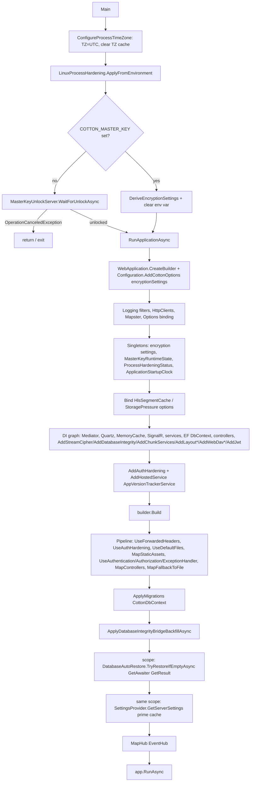

# 25. Configuration, Settings & Server Startup

This section documents how a Cotton Cloud server is configured and how it boots. It covers three layers: (a) the runtime, admin-editable settings stored in the `server_settings` table and exposed through the settings API; (b) the process-level environment variables that govern the database connection, the master key, and process hardening; and (c) the ordered startup sequence in `Program.cs` together with the bootstrap-support services. Throughout, the code in the repository is authoritative; where the marketing `README.md` and the code diverge, the behavior described here is what the code actually does.

Cotton draws a deliberate line between *deployment-fixed* configuration (master key, database endpoint, process hardening — supplied via environment variables and never editable at runtime) and *operational* configuration (compression level, storage backend, email mode, quotas — stored in the database and editable by admins through the API). The first group is read once at startup; the second group lives in `CottonServerSettings` and is cached in-process.

## Runtime settings — `CottonServerSettings`

The single source of truth for operational configuration is the entity `CottonServerSettings` (`src/Cotton.Database/Models/CottonServerSettings.cs`), mapped to the table `server_settings`. It derives from `BaseEntity<Guid>` (from `EasyExtensions.EntityFrameworkCore.Abstractions`), so it carries `Id`, `CreatedAt`, and `UpdatedAt` from the base type. The server keeps a *history* of settings rows; the "current" settings are always the row with the most recent `CreatedAt` (see `SettingsProvider.LoadLatestSettingsAsync`, which uses `OrderByDescending(s => s.CreatedAt)`). Four columns are marked `[Encrypted]` (`Cotton.Database.Models.Attributes`) and are transparently encrypted at rest with the derived master key (see the *Cryptography Engine* and *Database Integrity* sections).

### Fields

| Property | Column | Type | Meaning |
| --- | --- | --- | --- |
| `EncryptionThreads` | `encryption_threads` | `int` | Number of worker threads the AES-GCM stream cipher uses. Mirrored into a process-wide cache and consumed by `StreamCipherFactory.Create`. |
| `CipherChunkSizeBytes` | `cipher_chunk_size_bytes` | `int` | Plaintext chunk size of the AES-GCM cipher pipeline. Read by `SettingsEncryptionChunkSizeProvider`. |
| `CompressionLevel` | `compression_level` | `int` | Zstandard compression level used by the storage pipeline. Read by `SettingsCompressionLevelProvider`. |
| `MaxChunkSizeBytes` | `max_chunk_size_bytes` | `int` | Largest upload chunk the server will accept. Surfaced to clients via `GET /api/v1/settings`. |
| `SessionTimeoutHours` | `session_timeout_hours` | `int` | Refresh-session lifetime in hours. Field initializer `30 * 24` (720 h / 30 days). |
| `AllowCrossUserDeduplication` | `allow_cross_user_deduplication` | `bool` | Whether identical chunks may be deduplicated across users. |
| `AllowGlobalIndexing` | `allow_global_indexing` | `bool` | Whether server-side indexing is globally permitted. |
| `TelemetryEnabled` | `telemetry_enabled` | `bool` | Whether optional telemetry is enabled. Gates the three Cotton Bridge "Cloud" modes. |
| `Timezone` | `timezone` | `string` | IANA/Windows timezone id for admin-facing timestamps. `GetTimezoneInfo()` falls back to UTC if unresolvable. |
| `InstanceId` | `instance_id` | `Guid` | Stable per-installation identifier. Never exposed raw — `GetInstanceIdHash()` returns its SHA-256. |
| `PublicBaseUrl` | `public_base_url` | `string` | Externally reachable base URL for generated links/callbacks. |
| `SmtpServerAddress` | `smtp_server_address` | `string?` | Custom SMTP host. |
| `SmtpServerPort` | `smtp_server_port` | `int?` | Custom SMTP port. |
| `SmtpUsername` | `smtp_username` | `string?` | Custom SMTP username. |
| `SmtpSenderEmail` | `smtp_sender_email` | `string?` | Outgoing "From" address. |
| `SmtpUseSsl` | `smtp_use_ssl` | `bool` | Whether SMTP uses SSL/TLS. |
| `S3AccessKeyId` | `s3_access_key_id` | `string?` | S3 access key id. |
| `S3BucketName` | `s3_bucket_name` | `string?` | S3 bucket. |
| `S3Region` | `s3_region` | `string?` | S3 region. |
| `S3EndpointUrl` | `s3_endpoint_url` | `string?` | S3-compatible endpoint URL. |
| `EmailMode` | `email_mode` | `EmailMode` | Email delivery mode. |
| `ComputionMode` | `compution_mode` | `ComputionMode` | Compute execution mode (note the deliberate spelling). |
| `StorageType` | `storage_type` | `StorageType` | Physical storage backend. |
| `ServerUsage` | `server_usage` | `ServerUsage[]` | Declared usage categories (array column). |
| `StorageSpaceMode` | `storage_space_mode` | `StorageSpaceMode` | Storage-capacity policy. |
| `DefaultUserStorageQuotaBytes` | `default_user_storage_quota_bytes` | `long?` | Quota applied to new users (`null` = unlimited). |
| `DefaultUserTemplateNodeId` | `default_user_template_node_id` | `Guid?` | Template content node copied into new accounts (see `DefaultUserContentSeeder`). |
| `TotpMaxFailedAttempts` | `totp_max_failed_attempts` | `int` | Failed TOTP attempts before lockout. |
| `OidcClientId` | `oidc_client_id` | `string?` | OIDC client id. |
| `OidcIssuer` | `oidc_issuer` | `string?` | OIDC issuer URL. |
| `CloudServicesTokenEncrypted` | `cloud_services_token_encrypted` | `string?` `[Encrypted]` | Cotton Bridge access token, encrypted at rest. |
| `OidcClientSecretEncrypted` | `oidc_client_secret_encrypted` | `string?` `[Encrypted]` | OIDC client secret, encrypted. |
| `S3SecretAccessKeyEncrypted` | `s3_secret_access_key_encrypted` | `string?` `[Encrypted]` | S3 secret key, encrypted. |
| `SmtpPasswordEncrypted` | `smtp_password_encrypted` | `string?` `[Encrypted]` | SMTP password, encrypted. |
| `GeoIpLookupMode` | `geo_ip_lookup_mode` | `GeoIpLookupMode` | Geolocation lookup mode. |
| `CustomGeoIpLookupUrl` | `custom_geo_ip_lookup_url` | `string?` | Custom HTTP geolocation endpoint. |

### Defaults

When no row exists yet, two code paths in `SettingsProvider` supply defaults. `GetServerSettings()` returns an *in-memory, non-persisted* default object (with `InstanceId = Guid.Empty`); `CreateDefaultSettings(fallbackPublicBaseUrl)` produces the *persisted* first row (with `InstanceId = Guid.NewGuid()` and `PublicBaseUrl = NormalizePublicBaseUrl(fallbackPublicBaseUrl)`). The two default objects are otherwise identical and built from the `private const` defaults in `SettingsProvider`:

| Constant / field | Value |
| --- | --- |
| `defaultPublicBaseUrl` | `http://localhost` |
| `defaultTimezone` | `UTC` |
| `defaultSessionTimeoutHours` | `24 * 30` = 720 |
| `defaultTotpMaxFailedAttempts` | `64` |
| `defaultEncryptionThreads` | `2` |
| `defaultMaxChunkSizeBytes` | `4 * 1024 * 1024` (4 MiB) |
| `defaultCipherChunkSizeBytes` | `1 * 1024 * 1024` (1 MiB) |
| `defaultCompressionLevel` | `CompressionProcessor.DefaultCompressionLevel` (= `1`) |
| `EmailMode` | `None` |
| `ComputionMode` | `Local` |
| `StorageType` | `Local` |
| `ServerUsage` | `[ServerUsage.Other]` |
| `StorageSpaceMode` | `Optimal` |
| `GeoIpLookupMode` | `Disabled` |
| `AllowCrossUserDeduplication` / `AllowGlobalIndexing` / `TelemetryEnabled` | `false` |
| `DefaultUserStorageQuotaBytes` / `DefaultUserTemplateNodeId` | `null` |

### Configuration enums

All in `src/Cotton.Database/Models/Enums/`.

| Enum | Values |
| --- | --- |
| `StorageType` | `Local = 0`, `S3 = 1` |
| `StorageSpaceMode` | `Optimal = 0`, `Limited = 1`, `Unlimited = 2` |
| `GeoIpLookupMode` | `Disabled = 0`, `CottonCloud = 1`, `MaxMindLocal = 2`, `CustomHttp = 3` |
| `ServerUsage` | `Other = 0`, `Photos = 1`, `Documents = 2`, `Media = 3` |
| `ComputionMode` | `Local = 0`, `Cloud = 1`, `Remote = 2` |
| `EmailMode` | `None = 0`, `Cloud = 1`, `Custom = 2` |

The three "Cloud" modes (`EmailMode.Cloud`, `ComputionMode.Cloud`, `GeoIpLookupMode.CottonCloud`) all require `TelemetryEnabled == true`; `SettingsProvider.ValidateTelemetryChange`, `ValidateEmailModeAsync`, `ValidateComputionMode`, and `ValidateGeoIpLookupMode` enforce this. In addition, `ValidateEmailModeAsync(EmailMode.Cloud)` performs a live Cotton Bridge health probe, and `EmailMode.Custom` requires the SMTP fields to be complete (`IsEmailConfigComplete`). `GeoIpLookupMode.CustomHttp` requires `CustomGeoIpLookupUrl` to be set, and `GeoIpLookupMode.MaxMindLocal` is rejected with the message `"MaxMind local lookup is not configurable yet."` — i.e. defined but not yet usable.

## `SettingsProvider` and the runtime cache

`SettingsProvider` (`src/Cotton.Server/Providers/SettingsProvider.cs`, registered scoped in `Program.cs`) is the central read/write gateway for settings. Its constructor takes the `CottonDbContext` plus two optional dependencies: an `IStorageBackendTypeCache?` and an `IDatabaseIntegrityVerifier?`.

- **In-process cache.** A `static CottonServerSettings? _cache` holds the current settings; `GetServerSettings()` uses double-checked locking on a `static Lock _cacheLock`. Because the cache is static, it is shared across all scopes/requests in the process. Writes (`UpdateSettingsAsync`, `SetPropertyAsync`, `EnsureServerSettingsAsync`) call `InvalidateSettingsCache(serverIsInitialized: true)`, which nulls `_cache`, resets the injected `IStorageBackendTypeCache`, and marks the server as initialized in the boolean cache.
- **Runtime pipeline cache.** `CacheRuntimePipelineSettings` mirrors `EncryptionThreads` into a `static int _cachedEncryptionThreads` via `Volatile.Write`. `GetCachedEncryptionThreads()` exposes it (returning `null` when zero) to `AddStreamCipher`, so the cipher factory can pick a thread count even outside a DI scope.
- **Short-TTL boolean caches.** `IsServerInitializedAsync()` (any `server_settings` row exists) and `ServerHasUsersAsync()` (any `users` row exists) cache their boolean result for `_boolCacheTtl = TimeSpan.FromMinutes(1)`. Note `InvalidateSettingsCache` proactively sets the *initialized* cache to `true` but does not reset the *has-users* cache, which therefore tolerates up to one minute of staleness after the first user is created.
- **Missing-table tolerance.** Every query catches `PostgresException` where `SqlState == PostgresErrorCodes.UndefinedTable` and treats it as "not initialized" — important during the first migrate-on-startup, before tables exist.
- **Integrity binding.** When an `IDatabaseIntegrityVerifier` is injected, tracked loads call `_integrity.RequireValid(_dbContext, settings, ...)` to verify the row's integrity signature (descriptor labels `settings.cache-load` in `GetServerSettings()` and `settings.load` in `LoadLatestSettingsAsync` when not `AsNoTracking`). See the *Database Integrity* section.
- **Creation lock.** `EnsureServerSettingsAsync` serializes first-row creation through a `static SemaphoreSlim _settingsCreationLock(1, 1)` and re-checks under the lock to avoid duplicate rows.
- **Validation helpers.** The provider centralizes validation used by the controller: `ValidateTimezone`; `ValidatePublicBaseUrl` / `NormalizePublicBaseUrl` (absolute http/https, trimmed and trailing slash removed; invalid normalizes to `http://localhost`); `ValidateCustomGeoIpLookupUrl` (same absolute-URL rule); `ValidateS3ConfigAsync` (shape check, then a real connectivity round-trip via `ValidateS3Async`: `PutObjectAsync` a test object, `GetObjectAsync` and compare body, `ListObjectsV2Async` with `MaxKeys = 1`, then `DeleteObjectAsync`); `ValidateEmailConfig`; `ValidateDefaultUserStorageQuotaBytes`; and `ValidateDefaultUserTemplateNodeIdAsync` (the node must exist, be owned by the caller, and be `NodeType.Default`). `CheckCottonBridgeHealthAsync` issues a 10-second-timeout GET against `Constants.CottonBridgeHealthUrl` and requires the response `Status == "Healthy"`.
- **S3-from-stored-secret nuance.** `ValidateStorageTypeAsync(StorageType.S3)` builds an `S3Config` from the *stored* settings, setting `SecretKey = settings.S3SecretAccessKeyEncrypted` (the already-encrypted column value, not a plaintext secret), then — provided the shape check passes — *always* runs the same connectivity round-trip. `S3Config.SecretKey` is therefore reused for two different meanings (plaintext on `PATCH s3-config`, ciphertext here).

### Settings consumers

| Consumer | File | Reads |
| --- | --- | --- |
| `SettingsCompressionLevelProvider` (`ICompressionLevelProvider`) | `src/Cotton.Server/Services/SettingsCompressionLevelProvider.cs` | `CompressionLevel` |
| `SettingsEncryptionChunkSizeProvider` (`IEncryptionChunkSizeProvider`) | `src/Cotton.Server/Services/SettingsEncryptionChunkSizeProvider.cs` | `CipherChunkSizeBytes` |
| `AddStreamCipher` → `StreamCipherFactory.Create` | `src/Cotton.Server/Extensions/ServiceCollectionExtensions.cs`, `src/Cotton.Server/Services/StreamCipherFactory.cs` | cached `EncryptionThreads` (clamped to `[1, ProcessorCount * 2]` in the factory) |
| `DefaultUserContentSeeder` | `src/Cotton.Server/Services/DefaultUserContentSeeder.cs` | `DefaultUserTemplateNodeId` |

## Settings & server API surface

`SettingsController` (`src/Cotton.Server/Controllers/SettingsController.cs`) is dual-routed at `Routes.V1.Settings` (`/api/v1/settings`) and `Routes.V1.Server + "/settings"` (`/api/v1/server/settings`). Most endpoints require `[Authorize(Roles = nameof(UserRole.Admin))]`; the only endpoints needing just an authenticated user (`[Authorize]`) are `GET /`, `GET chunk-size`, and `GET supported-hash-algorithms`. `GET is-setup-complete` is admin-only. Mutations call `_settings.SetPropertyAsync(x => x.Field, value, GetFallbackPublicBaseUrl(), ct)` (the fallback base URL is `{scheme}://{host}` from the current request), which persists the field and invalidates the cache; `s3-config` and `email-config` use `UpdateSettingsAsync` to write several fields at once.

Validation constants worth noting:

- `SupportedMaxChunkSizeBytes = [4 MiB, 8 MiB, 16 MiB]` — `PATCH chunk-size/{n}` rejects anything else.
- Compression level is validated by `CompressionProcessor.ThrowIfInvalidLevel` (bounded by `MinCompressionLevel`/`MaxCompressionLevel`, which come from the underlying `Compressor`).
- Cipher chunk size is bounded by `AesGcmStreamCipher.MinChunkSize` (8 KiB) and `AesGcmStreamCipher.MaxChunkSize` (64 MiB). The controller also advertises a curated `DefaultSupportedCipherChunkSizeBytes` set (≈128 KiB, 1 MiB, 4 MiB, 16 MiB, and the cipher max).
- Encryption threads are bounded by `[1, GetMaxEncryptionThreads()]` where `GetMaxEncryptionThreads() = Math.Max(1, Environment.ProcessorCount)`.

`GET /` (`GetClientSettings`) returns the running `Version` (from `APP_VERSION`), `MaxChunkSizeBytes`, and `Hasher.SupportedHashAlgorithm`.

The settings endpoints (relative to either base route):

| Method & path | Auth | Purpose |
| --- | --- | --- |
| `GET /` | authenticated | Client-facing version, max chunk size, supported hash algorithm |
| `GET is-setup-complete` | Admin | `IsServerInitialized` flag |
| `GET chunk-size` | authenticated | Current + supported max chunk sizes |
| `PATCH chunk-size/{maxChunkSizeBytes:int}` | Admin | Set max upload chunk size |
| `GET storage-pipeline` | Admin | Compression / cipher-chunk / thread tunables + bounds |
| `PATCH compression-level/{compressionLevel:int}` | Admin | Set Zstandard level |
| `PATCH cipher-chunk-size/{cipherChunkSizeBytes:int}` | Admin | Set AES-GCM plaintext chunk size |
| `PATCH encryption-threads/{encryptionThreads:int}` | Admin | Set cipher worker-thread count |
| `GET supported-hash-algorithms` | authenticated | Supported hash algorithm list |
| `GET` / `PATCH geoip-lookup-mode` (`/{mode}` on PATCH) | Admin | Read / set GeoIP mode |
| `GET` / `PATCH` / `POST custom-geoip-lookup-url` (`/test` on POST) | Admin | Read / set / test custom GeoIP URL |
| `GET` / `PATCH server-usage` | Admin | Read / set declared usage categories |
| `GET` / `PATCH telemetry` | Admin | Read / set telemetry toggle |
| `GET` / `PATCH storage-space-mode` (`/{mode}` on PATCH) | Admin | Read / set capacity policy |
| `GET` / `PATCH default-user-storage-quota-bytes` | Admin | Read / set default quota |
| `GET` / `PATCH default-user-template-node` | Admin | Read / set onboarding template node |
| `GET` / `PATCH timezone` | Admin | Read / set timezone |
| `GET` / `PATCH public-base-url` | Admin | Read / set public base URL |
| `GET` / `PATCH compution-mode` (`/{mode}` on PATCH) | Admin | Read / set compute mode |
| `GET` / `PATCH email-mode` (`/{mode}` on PATCH) | Admin | Read / set email mode |
| `GET` / `PATCH allow-cross-user-deduplication` | Admin | Read / set cross-user dedup flag |
| `GET` / `PATCH allow-global-indexing` | Admin | Read / set global indexing flag |
| `GET` / `PATCH storage-type` (`/{type}` on PATCH) | Admin | Read / set storage backend |
| `GET` / `PATCH s3-config` | Admin | Read (secret blanked) / set S3 config |
| `GET` / `PATCH` / `POST email-config` (`/test` on POST) | Admin | Read (password blanked) / set / send test email |

`ServerController` (`src/Cotton.Server/Controllers/ServerController.cs`, route `Routes.V1.Server` = `/api/v1/server`) exposes operational endpoints:

| Method & path | Auth | Purpose |
| --- | --- | --- |
| `POST emergency-shutdown` | Admin | Sends `EmergencyShutdownRequest` via the mediator |
| `GET info` | public | Returns `PublicServerInfo { InstanceIdHash, CanCreateInitialAdmin = !ServerHasUsersAsync(), Product = Constants.ProductName }` |
| `GET security/status` | Admin | `SecurityDiagnosticsService.GetSnapshotAsync` |
| `PATCH database-backup/trigger` | Admin | Sends `TriggerDatabaseBackupRequest` |
| `PATCH gc/trigger` | Admin | Triggers `GarbageCollectorJob` via the Quartz scheduler |
| `GET database-backup/latest` | Admin | `GetLatestDatabaseBackupInfoQuery` (404 when none) |
| `GET gc/chunks/timeline` | Admin | `GetGcChunksTimelineQuery` (honors the `X-Timezone` header and `bucket` query, default `hour`) |

### DTOs

`S3Config` (`src/Cotton.Server/Models/Dto/S3Config.cs`): `AccessKey`, `SecretKey`, `Endpoint`, `Region`, `Bucket` (all `init`-only `string`). `EmailConfig` (`src/Cotton.Server/Models/Dto/EmailConfig.cs`): `Username`, `Password`, `SmtpServer`, `Port` (a `string`, parsed/validated via `SettingsProvider.TryParsePort` to 1–65535), `FromAddress`, and `UseSSL` (`bool`). `GET s3-config` and `GET email-config` always return the secret (`SecretKey` / `Password`) blanked.

### `StoragePressureOptions`

`src/Cotton.Server/Models/Configuration/StoragePressureOptions.cs` is bound from the `StoragePressure` configuration section in `Program.cs`. This is *file/JSON* configuration (not in the DB settings table), consumed by `StoragePressureGuard`.

| Field | Default | Notes |
| --- | --- | --- |
| `Enabled` | `true` | |
| `MinFreePercent` | `5` | clamped to 0–100 in `GetRequiredFreeBytes` |
| `MinFreeBytes` | `512 MiB` (`512L * 1024 * 1024`) | clamped to ≥ 0 |
| `CheckIntervalSeconds` | `10` | `CheckInterval` clamps to 1–300 s |
| `AdminNotificationCooldownMinutes` | `60` | `AdminNotificationCooldown` clamps to 1–1440 min |

`GetRequiredFreeBytes(total) = max(MinFreeBytes, ceil(total * MinFreePercent / 100))`. A sibling options class `HlsSegmentCacheOptions` (declared in `src/Cotton.Server/Services/HlsSegmentCache.cs`, default `SizeLimitBytes = 512 MiB`) is bound from the `HlsSegmentCache` section in the same `Program.cs` block.

## Environment variables

The table below lists every `COTTON_*` literal and the other environment variables read by production code under `src/` (test-only variables are noted as such). The `COTTON_PG_*` group is read in three places that must stay in sync: `ConfigurationBuilderExtensions.AddCottonOptions`, `MasterKeyCompatibilityProbe.BuildConnectionStringFromEnvironment`, and `CottonDbContextDesignTimeFactory` (design-time migrations) — all with the same names and defaults.

| Variable | Default | Read in | Meaning |
| --- | --- | --- | --- |
| `COTTON_MASTER_KEY` | (none) | `Program.cs`, `ConfigurationBuilderExtensions` | Root master key. Must be exactly **32** characters (`DefaultKeyLength`). If absent, the server enters interactive unlock mode. Cleared from Process and User env after derivation. |
| `COTTON_PG_HOST` | `localhost` | `ConfigurationBuilderExtensions`, `MasterKeyCompatibilityProbe`, design-time factory | PostgreSQL host. |
| `COTTON_PG_PORT` | `5432` | same | PostgreSQL port (parsed as `ushort` in `AddCottonOptions`, as `int` elsewhere). |
| `COTTON_PG_DATABASE` | `cotton_dev` | same | PostgreSQL database name. |
| `COTTON_PG_USERNAME` | `postgres` | same | PostgreSQL user. |
| `COTTON_PG_PASSWORD` | `postgres` | same | PostgreSQL password. **Erased** from Process and User env immediately after being read in `AddCottonOptions`. |
| `COTTON_RESTORE_DATABASE_IF_EMPTY` | `false` | `DatabaseAutoRestoreService` (via `IConfiguration[...]`, `bool.TryParse`) | If `true`, restore the latest backup when the DB is empty on startup. |
| `COTTON_PROCESS_HARDENING` | (off) | `LinuxProcessHardening` | If truthy (`1`/`true`/`yes`/`on`, case-insensitive), call `prctl(PR_SET_DUMPABLE, 0)` on Linux to block core dumps/ptrace. |
| `COTTON_PUBLIC_INSTANCE` | `false` | `Constants.IsPublicInstance` (`bool.TryParse`) | Marks the process as a public/demo instance (alters auth, sharing, WebDav, diagnostics behavior). |
| `COTTON_FFMPEG_PATH` | (none) | `Cotton.Previews/FfmpegBinary.cs` | Explicit ffmpeg executable path. |
| `COTTON_FFPROBE_PATH` | (none) | `FfmpegBinary.cs` | Explicit ffprobe executable path. |
| `COTTON_FFMPEG_DIR` | (none) | `FfmpegBinary.cs` | Directory to download/resolve ffmpeg/ffprobe from. |
| `APP_VERSION` | (none) | `AppVersionHelpers.GetAppVersion()` | App version string (set by the container image); drives version tracking and update notifications. |
| `TZ` | set to `UTC` by Cotton | `Program.ConfigureProcessTimeZone` | Forced to `UTC` so the process clock never drifts with user timezone settings. |
| `DOTNET_EnableDiagnostics` / `COMPlus_EnableDiagnostics` | (read) | `SecurityDiagnosticsService` | Inspected (not set) to report whether the .NET diagnostics IPC is disabled. |
| `DOTNET_RUNNING_IN_CONTAINER` | (read) | `SecurityDiagnosticsService` | Compared against `"true"` to detect container runtime. |
| `PATH` | (read) | `FfmpegBinary` | Used only for ffmpeg/ffprobe discovery. |
| `DISPLAY` | (read) | `Cotton.Previews/StlThumbPreviewGenerator.cs` | Detects an X display for headless STL thumbnail rendering. |
| `PROCESSOR_IDENTIFIER` | (read) | `Cotton.Benchmark/Regression/HardwareFingerprint.cs` | Benchmark hardware fingerprint only — not server runtime. |
| `COTTON_TEST_PG_*`, `COTTON_PREVIEW_FIXTURES_DIR` | — | integration tests only | Test fixtures; not used by the server runtime. |

> The Docker entrypoint also recognizes `COTTON_PERMISSION_FIX` (`never`/`always`) for volume-ownership handling, but that is a shell-script variable in the image entrypoint — it is **not** read anywhere in the C# server code.

Two non-`COTTON_` config keys are injected programmatically by `AddCottonOptions` (via `AddInMemoryCollection`) rather than read from env: `JwtSettings:Key` (a fresh random 32-char string generated **per process start** via `StringHelpers.CreateRandomString(DefaultKeyLength)`), and `DatabaseSettings:Host|Port|Database|Username|Password` together with the derived `CottonEncryptionSettings` keys (`Pepper`, `MasterEncryptionKey`, `MasterEncryptionKeyId`, added under their `nameof(...)` names). Because the JWT signing key is regenerated on every restart, all previously issued access tokens are invalidated by a restart.

## Master key resolution & process hardening

The master key never enters EF configuration directly. Instead, `Program.Main` derives `CottonEncryptionSettings` from the 32-char root key using `ConfigurationBuilderExtensions.DeriveEncryptionSettings` (`src/Cotton.Autoconfig/Extensions/ConfigurationBuilderExtensions.cs`, namespace `Cotton.Autoconfig.Extensions`), which derives two subkeys with `KeyDerivation.DeriveSubkeyBase64(rootKey, label, DefaultKeyLength)`:

- `Pepper` ← subkey labeled `"CottonPepper"`
- `MasterEncryptionKey` ← subkey labeled `"CottonMasterEncryptionKey"`
- `MasterEncryptionKeyId` ← `DefaultMasterKeyId = 1`

`ValidateRootMasterKey` enforces the exact 32-character length (`DefaultKeyLength`); the source comment is emphatic that `DefaultKeyLength` must never change for a deployment, as it would make all derived-key data (including hashed passwords) unrecoverable. After derivation, `ClearMasterKeyEnvironmentVariable()` removes `COTTON_MASTER_KEY` from both the `Process` and `User` env targets.

`LinuxProcessHardening.ApplyFromEnvironment()` (`src/Cotton.Server/Services/LinuxProcessHardening.cs`) runs first in `Main` and returns a `ProcessHardeningStatus(bool Requested, bool Applied, string? Error, int? DumpableAfter)` record (later registered as a singleton). When `COTTON_PROCESS_HARDENING` is truthy and the OS is Linux, it P/Invokes `prctl(PR_SET_DUMPABLE, 0)`; on non-Linux it records the error `"Process dump hardening is only supported on Linux."` rather than crashing. The class also exposes `TryGetDumpable()`, `TryGetEffectiveUserId()` (`geteuid`), and `SnapshotProcStatus()` — which parses `/proc/self/status` for `NoNewPrivs`, `Seccomp`, `Seccomp_filters`, `CapEff`, and derives whether `CAP_SYS_PTRACE` (capability bit 19) is set, returning a `LinuxProcStatus` record used by `SecurityDiagnosticsService`.

### `MasterKeyRuntimeState`

`MasterKeyRuntimeState` (`src/Cotton.Server/Services/MasterKeyRuntimeState.cs`) is a singleton `record` recording how the key was obtained: `FromEnvironment(...)` sets `Source = "Environment"` (and `EnvironmentVariableWasConfigured = true`) when `COTTON_MASTER_KEY` was set, or `FromUnlock(...)` sets `Source = "Unlock"` when the interactive unlock server was used.

### Interactive unlock & compatibility probe

If `COTTON_MASTER_KEY` is empty, `MasterKeyUnlockServer.WaitForUnlockAsync` (`src/Cotton.Server/Services/MasterKeyUnlockServer.cs`) starts a *minimal* `WebApplication` that serves only the `/unlock` UI and unlock endpoints and returns `423 Locked` for every other `/api/v1` request. It:

- generates a one-time hex **bootstrap token** (16 random bytes, lower-case hex) and logs it together with the unlock URL(s);
- exposes `GET /api/v1/unlock/status`, `GET /api/v1/unlock/key` (suggests a random 32-char key, base64 of 24 random bytes), and `POST /api/v1/unlock`;
- requires the bootstrap token for the first unlock when `RequiresBootstrapTokenAsync` returns true — i.e. *not* a Development environment **and** no existing Cotton data — within a window of `Constants.AdminAutocreateMinutesDelay` (= 5) minutes, comparing tokens with `CryptographicOperations.FixedTimeEquals`;
- on submit, derives encryption settings (rejecting a wrong-length key with the same `DefaultKeyLength` validation) and validates them with `MasterKeySentinelStore.ValidateOrInitializeAsync(..., MasterKeySentinelInitializationMode.RequireCompatibilityEvidenceForExistingData)`. Only on success does it complete the `TaskCompletionSource` (after a short delay), stop the unlock app, and let `Program` proceed to the real application. If `ApplicationStopping` fires first, the completion is canceled and `Main` exits.

The sentinel validation is backed by `MasterKeyCompatibilityProbe` (`src/Cotton.Server/Services/MasterKeyCompatibilityProbe.cs`, interface `IMasterKeyCompatibilityProbe`). Its `ValidateAsync(settings, MasterKeyCompatibilityMode mode, ...)` first checks whether the database already holds Cotton data — any row in `users`, `nodes`, `file_manifests`, `chunks`, or `server_settings` — and, if so, tries to decrypt real evidence to prove the submitted key matches:

1. **Encrypted-column probe.** Up to 8 candidates from each `[Encrypted]` column: `users.totp_secret_encrypted`, `users.avatar_hash_encrypted`, `file_manifests.small_file_preview_hash_encrypted` (all `bytea`), and the four `server_settings.*_encrypted` columns (`base64` text). A successful decrypt of any candidate proves compatibility.
2. **Storage-chunk probe.** Only if the encrypted-column probe found no usable evidence *and* the storage backend is **not** `IStorageBackendUsesEncryptedConfiguration` (so its own config secret is trustworthy): up to 16 stored chunks (ordered by `stored_size_bytes asc nulls last` when that column exists), decrypted from the configured storage backend.

The result is a `MasterKeyCompatibilityResult(Success, ExistingDataFound, EvidenceFound, Error)` built via `Compatible(...)` or `Fail(...)`:

- decrypt succeeded → `Compatible(existingDataFound: true, evidenceFound: true)`;
- a candidate failed to decrypt (wrong key) → `Fail("Master key does not match existing encrypted Cotton data.")`;
- existing data but no decryptable evidence → under `MasterKeyCompatibilityMode.RequireEvidenceForExistingData` this is a `Fail` instructing the operator to boot once with the original `COTTON_MASTER_KEY`; under `AllowMissingEvidence` it returns a "compatible without evidence" result (`Compatible(existingDataFound: true, evidenceFound: false)`) that trusts the existing sentinel.

`MasterKeyStartupStorage` (`src/Cotton.Server/Services/MasterKeyStartupStorage.cs`) builds the storage backend the probe needs (`FileSystemStorageBackend`, or `S3StorageBackend` over a `StaticS3Provider` that decrypts `s3_secret_access_key_encrypted` with the candidate key) directly from a **raw SQL** read of the latest `server_settings` row, so the probe can run before EF/DI exist. `BuildConnectionStringFromEnvironment` and `HasExistingCottonDataAsync` are the static helpers used both here and by the unlock server.

## Server startup sequence — `Program.cs`

`Program.Main` (`src/Cotton.Server/Program.cs`) is the single entry point. The ordering matters; here is the full walk.

### Step-by-step

1. **`ConfigureProcessTimeZone()`** — sets `TZ=UTC` via `Environment.SetEnvironmentVariable` and calls `TimeZoneInfo.ClearCachedData()`. The process clock stays UTC; per-user timezones are applied per request only.
2. **`LinuxProcessHardening.ApplyFromEnvironment()`** — applied before anything sensitive is in memory, returning the `ProcessHardeningStatus` later registered as a singleton.
3. **`ResolveEncryptionSettingsAsync(args)`** — the master-key gate described above. If `COTTON_MASTER_KEY` is set, `DeriveEncryptionSettings` runs and the env var is cleared in a `finally`; otherwise `MasterKeyUnlockServer.WaitForUnlockAsync` blocks until unlocked. If unlock is canceled (`OperationCanceledException`), `Main` returns and the process exits cleanly.
4. **`RunApplicationAsync`** builds the `WebApplication`:
   - `builder.Configuration.AddCottonOptions(encryptionSettings)` re-reads `COTTON_PG_*` (and erases `COTTON_PG_PASSWORD`), generates a fresh `JwtSettings:Key`, and injects `DatabaseSettings:*` plus the derived `CottonEncryptionSettings` keys into in-memory config.
   - Logging: on Windows non-production it resets providers to console/debug; it always lowers `Microsoft.AspNetCore.DataProtection.KeyManagement.XmlKeyManager` logging to `Error`.
   - HTTP clients: a named GitHub client (`AppVersionTrackerService.GitHubHttpClientName` = `"Cotton.GitHub"`, base address `https://api.github.com/`), a named `OidcDiscoveryService.HttpClientName` client, and a typed `OidcAvatarImportService` client.
   - `ForwardedHeadersOptions` is configured to honor `X-Forwarded-Proto` and `X-Forwarded-Host`, and **clears** `KnownIPNetworks`/`KnownProxies` (the server trusts the headers from any proxy — it is expected to run behind a controlled reverse proxy).
   - Singletons: the bound `CottonEncryptionSettings`, `MasterKeyRuntimeState`, `ProcessHardeningStatus`, and `new ApplicationStartupClock(DateTimeOffset.UtcNow)`.
   - Options binding: `HlsSegmentCacheOptions` ← `HlsSegmentCache` section; `StoragePressureOptions` ← `StoragePressure` section.
   - The large fluent block registers Mediator (`AddMediator`), Quartz jobs (`AddQuartzJobs`), `AddMemoryCache`, SignalR, the HTTP context accessor, and the full service graph (settings, security diagnostics, storage probe, passkey/OIDC/auth, backup/restore, archive/zip, storage-pressure guard, default-user seeder, the storage pipeline processors `CryptoProcessor` + `CompressionProcessor` and `FileStoragePipeline`, the EF `CottonDbContext` via `AddPostgresDbContext` with `UseLazyLoadingProxies = false`, layout services, the PBKDF2 password hash service via `AddPbkdf2PasswordHashService`, controllers). It then chains the project extension methods `AddStreamCipher`, `AddDatabaseIntegrity`, `AddChunkServices`, `AddLayoutPathServices`, `AddLayoutSearchServices`, `AddWebDavServices`, and `AddWebDavAuth` (all defined in `src/Cotton.Server/Extensions/ServiceCollectionExtensions.cs`), and finally `AddJwt` (from the external EasyExtensions packages; `AddPbkdf2PasswordHashService` is likewise external).
   - `builder.Services.AddAuthHardening()` registers the rate limiter and the session-revocation JWT validation hook; `AddHostedService<AppVersionTrackerService>()` registers the background version tracker.
5. **Middleware pipeline** (order is significant): `UseForwardedHeaders` → `UseAuthHardening` → `UseDefaultFiles` → `MapStaticAssets` → `UseAuthentication` → `UseAuthorization` → `UseExceptionHandler` → `MapControllers` → `MapFallbackToFile("/index.html")` (SPA fallback).
6. **`ApplyMigrations<CottonDbContext>()`** — migrate-on-startup; EF migrations are applied automatically every boot.
7. **`ApplyDatabaseIntegrityBridgeBackfillAsync()`** (`src/Cotton.Server/Extensions/DatabaseIntegrityApplicationExtensions.cs`) — in a fresh scope, resolves `IDatabaseIntegrityBridgeBackfillService` and calls `BackfillUnsignedPhaseOneRowsAsync` to sign unsigned phase-one rows. See the *Database Integrity* section.
8. **Restore-if-empty** — in a fresh `IServiceScope`, `IDatabaseAutoRestoreService.TryRestoreIfEmptyAsync()` is awaited synchronously (`GetAwaiter().GetResult()`).
9. **Prime the settings cache** — still in that scope, `SettingsProvider.GetServerSettings()` is called once to warm the static cache (and, when settings exist, to verify their integrity).
10. **`MapHub<EventHub>(Routes.V1.EventHub)`** (`/api/v1/hub/events`) then **`app.RunAsync()`**.

> Ordering note: `MapHub` is registered *after* `MapControllers`/`MapFallbackToFile` and after the DB bootstrap, not in the earlier middleware block. Functionally this is fine — hub mapping just adds an endpoint — but it is later in `Program.cs` than one might expect.

### `DatabaseAutoRestoreService`

`src/Cotton.Server/Services/DatabaseAutoRestoreService.cs`. Restore proceeds only when **all** of these hold: `COTTON_RESTORE_DATABASE_IF_EMPTY` parses to `true` (`bool.TryParse` over `IConfiguration`); the DB is "empty" (no `__EFMigrationsHistory` rows, **or** no `users` and no `server_settings` rows); and a latest backup manifest exists (`IDatabaseBackupManifestService.TryGetLatestManifestAsync`). It rebuilds the dump file from storage chunks (ordered by `Chunk.Order`), verifies the reconstructed file's hash (`DumpContentHash`) and size (`DumpSizeBytes`) against the manifest, restores via `IPostgresDumpService.RestoreFromFileAsync`, ensures the `citext` and `hstore` extensions (`CREATE EXTENSION IF NOT EXISTS`) and reloads Npgsql types, then notifies admins. The temp dump under `{Path.GetTempPath()}/cotton/db-restore/` is always deleted in a `finally`.

## Startup-support services summary

| Service | File | Role |
| --- | --- | --- |
| `ApplicationStartupClock` | `Services/ApplicationStartupClock.cs` | Singleton capturing `StartedAtUtc`; exposes `Uptime`. `AuthController` uses `_startupClock.Uptime.TotalMinutes > Constants.AdminAutocreateMinutesDelay` (5 min) to decide whether the initial-admin bootstrap window is still open. |
| `AppVersionTrackerService` | `Services/AppVersionTrackerService.cs` | Hosted `BackgroundService`. After a 45 s startup delay it records the running version (`APP_VERSION`) into `app_versions`, then (unless in a `Testing`/`IntegrationTests` environment or `AppVersionTracker:ReleaseCheckEnabled=false`) GETs GitHub `repos/bvdcode/cotton/releases/latest` and notifies admins of newer non-draft, non-prerelease releases. Logs a warning on a detected downgrade (`SemanticVersionComparer.IsDowngrade`). |
| `StoragePipelineProbeService` | `Services/StoragePipelineProbeService.cs` | Scoped service that pushes a 64 MiB (`PayloadSizeBytes`) synthetic random blob through the *real* storage pipeline (one warmup + one measured iteration), verifying the read-back SHA-256 with `FixedTimeEquals`, then deletes the probe blob. Serialized by a static `ProbeLock`. Invoked by `CollectPerformanceJob`, not at boot. |
| `DefaultUserContentSeeder` | `Services/DefaultUserContentSeeder.cs` | Scoped service; entry point `SeedAsync(userId, ct)`. When `DefaultUserTemplateNodeId` is set and the template node exists (`NodeType.Default`), recursively copies the template's folders and files (referencing the same `FileManifestId`, i.e. zero re-upload) into a new user's default layout inside a single transaction (via an EF execution strategy). Called from guest signup (`AuthController`), admin user creation (`AdminCreateUserRequest` handler), and OIDC login (`OidcAuthenticationService`). |
| `MasterKeyCompatibilityProbe` / `IMasterKeyCompatibilityProbe` | `Services/MasterKeyCompatibilityProbe.cs` | Validates a candidate master key against existing encrypted DB/storage evidence during unlock; also exposes `HasExistingCottonDataAsync` and `BuildConnectionStringFromEnvironment`. |
| `MasterKeyStartupStorage` | `Services/MasterKeyStartupStorage.cs` | Builds the pre-DI storage backend + `MasterKeySentinelStore` from a raw SQL read of `server_settings`. |

## Concurrency, failure modes & security considerations

- **Static settings cache.** `SettingsProvider._cache` and `_cachedEncryptionThreads` are `static`, deliberately shared process-wide across DI scopes. All access is guarded by a `Lock`/`Volatile`. Any write path must call `InvalidateSettingsCache` or stale reads will persist until process restart; the boolean caches additionally tolerate up to 1 minute of staleness.
- **Master key never persists in config or env.** It is cleared from Process/User env after derivation; `COTTON_PG_PASSWORD` is likewise erased after the connection string is built. Encrypted settings columns are `[Encrypted]` at rest, and the compatibility probe proves key/data match before the full app starts.
- **JWT key per restart.** A fresh `JwtSettings:Key` per boot means every restart logs everyone out — intentional, but operators should expect it.
- **Forwarded headers trust.** `KnownProxies`/`KnownIPNetworks` are cleared, so the server unconditionally trusts `X-Forwarded-Proto`/`X-Forwarded-Host`. Cotton must be deployed behind a trusted reverse proxy that strips client-supplied forwarded headers.
- **Migrate-on-startup.** `ApplyMigrations` runs on every boot; concurrent instances against one database can race on migrations and should not start simultaneously against an unmigrated schema.
- **Synchronous restore.** `TryRestoreIfEmptyAsync().GetAwaiter().GetResult()` blocks startup; a hang or failure here blocks the whole server from accepting traffic. Restore is also strictly opt-in via `COTTON_RESTORE_DATABASE_IF_EMPTY`.
- **First-table-missing tolerance.** Many provider/probe queries swallow `UndefinedTable`/`InvalidCatalogName` so the pre-migration boot does not crash; this is correct but means errors during early boot can look like "uninitialized" rather than "broken".
- **Process hardening is best-effort.** A failed `prctl` is reported via `ProcessHardeningStatus.Error` and surfaced in `GET /api/v1/server/security/status`, but does not stop startup.

## Non-obvious design decisions & gotchas

- The enum and column are spelled **`ComputionMode`** / `compution_mode` (not "Computation"). Use the exact identifier.
- `GetServerSettings()` returns a non-persisted default with `InstanceId = Guid.Empty`; only the persisted-creation path (`CreateDefaultSettings`) assigns a real `Guid.NewGuid()`. Code that needs a stable instance id must go through `EnsureServerSettingsAsync`, not `GetServerSettings`.
- The 32-character master-key length (`DefaultKeyLength`) is a hard, immutable contract — changing it bricks all derived-key data.
- `GeoIpLookupMode.MaxMindLocal` and `ComputionMode.Remote` exist in the enums but are not fully wired (`ValidateGeoIpLookupMode` explicitly rejects MaxMind as "not configurable yet").
- Two distinct mode enums govern the unlock flow: `MasterKeySentinelInitializationMode.RequireCompatibilityEvidenceForExistingData` (passed by `MasterKeyUnlockServer`) and `MasterKeyCompatibilityMode` (`AllowMissingEvidence` / `RequireEvidenceForExistingData`, used by the probe itself). Do not confuse them.
- `ValidateStorageTypeAsync` reuses the *encrypted* `s3_secret_access_key_encrypted` value as `S3Config.SecretKey` and still runs a full S3 connectivity round-trip — the same `S3Config.SecretKey` field carries plaintext on `PATCH s3-config` and ciphertext here.
- `StoragePipelineProbeService` and the `MasterKeyCompatibilityProbe` operate on the **real** storage backend; the probe is sized 64 MiB and is meant to run only on demand (performance collection / unlock), not on every request.
- The unlock mini-server and the main app are two distinct `WebApplication` instances; the unlock app fully stops before the real app starts, so they never bind the listener simultaneously.

## Related sections

See the *Cryptography Engine* section (key derivation, `AesGcmStreamCipher`, `[Encrypted]` columns), the *Database Integrity* section (`RequireValid`, bridge backfill, integrity descriptors), the *Storage Pipeline & Backends* section (`IStoragePipeline`, `CryptoProcessor`/`CompressionProcessor`, S3 vs local backends), the *Background Jobs (Quartz)* section (job triggers including `CollectPerformanceJob`, `GarbageCollectorJob`, and the database dump job), the *Authentication & Sessions* section (JWT, rate limiting, session revocation, initial-admin bootstrap), and the *Telemetry & Cotton Bridge* section (telemetry-gated Cloud modes).
