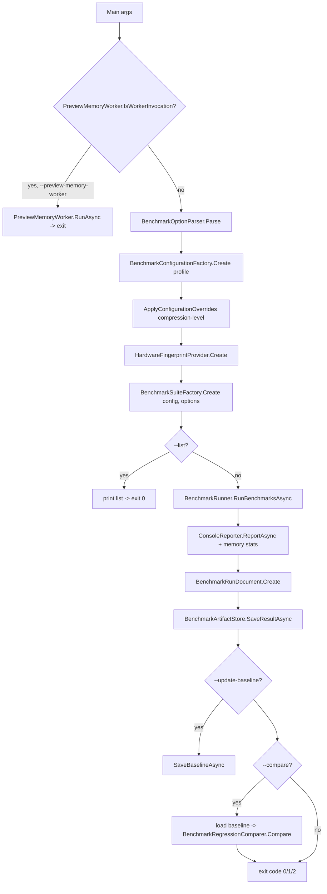
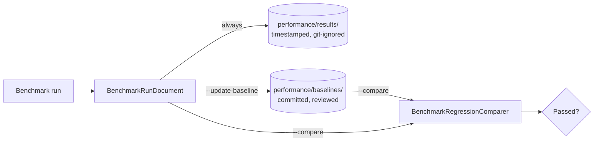
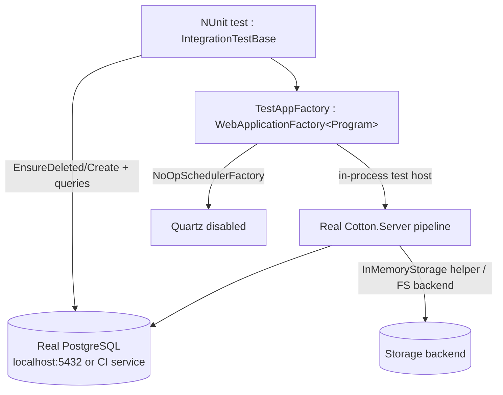

# 26. Performance, Benchmarking & Testing

Cotton Cloud treats throughput as a first-class product requirement, and its quality-engineering surface reflects that: a dedicated benchmark harness (`Cotton.Benchmark`) with committed per-hardware baselines, an opt-in runtime storage-pipeline probe wired into telemetry, and a set of NUnit / Vitest test projects covering the cryptography, storage, preview, validation, and server layers. This section documents how performance is measured, how regressions are gated, where benchmark data lives, and what the test suite actually covers versus where the gaps are. Throughout, README throughput claims are reported explicitly as "developer-hardware" figures and contrasted with the real, committed artifacts.

## Purpose & overview

There are three distinct performance/quality subsystems in Cotton, which are easy to conflate but are independent:

1. **`Cotton.Benchmark`** — a standalone console application (not a unit-test project) that runs portable micro/pipeline benchmarks and produces JSON run documents. It is the canonical performance harness. It is **not** BenchmarkDotNet; it is a hand-rolled harness built on `Microsoft.Extensions.DependencyInjection`/`Logging` plus the production storage code it project-references.
2. **The runtime storage-pipeline probe** — `StoragePipelineProbeService` plus `CollectPerformanceJob`, which (only when telemetry is enabled) runs a small synthetic round-trip through the *live* configured storage pipeline and reports read/write throughput to Cotton Bridge.
3. **The test projects** — six .NET NUnit projects plus the Vitest frontend suite, exercising correctness (and, in a few `[Explicit]` cases, ad-hoc performance).

A fourth artifact, the `Benchmark` entity / `BenchmarkType` enum in `Cotton.Database`, exists in the schema but is currently **dead code** at runtime (see *Benchmark entity: reserved but unused* below).

## The Cotton.Benchmark harness

### Project shape

`src/Cotton.Benchmark/Cotton.Benchmark.csproj` is an `Exe` targeting `net10.0`. Its only NuGet dependencies are `Microsoft.Extensions.DependencyInjection`, `Microsoft.Extensions.Logging`, `Microsoft.Extensions.Logging.Console` (all `10.0.8`) and `ZstdSharp.Port` `0.8.8`; it project-references `Cotton.Crypto`, `Cotton.Previews`, and `Cotton.Storage` so benchmarks exercise **production code paths**, not mocks. The repo's `src/Cotton.Benchmark/README.md` lists `ZstdSharp.Port 0.8.6`, but the csproj pins `0.8.8` — the csproj is authoritative. (The README also says new benchmarks are registered "in `Program.CreateBenchmarks()`"; the real registration entry point is `BenchmarkSuiteFactory.Create`, so treat that README line as stale.)

The entry point is `src/Cotton.Benchmark/Program.cs`. Control flow:

### Command-line interface

Options are parsed by `BenchmarkOptionParser.Parse` (`src/Cotton.Benchmark/Infrastructure/BenchmarkOptionParser.cs`):

| Option | Effect | Default |
| --- | --- | --- |
| `-h`, `--help` | Print help and exit 0 | — |
| `--mode <value>` | `machine` or `development` (`BenchmarkMode`) | `machine` |
| `--profile <value>` | `quick`, `standard`, or `full` (`BenchmarkProfile`) | `standard` |
| `--scenario <filter>` | Comma-separated name filters; case-insensitive substring or slug match | none (all) |
| `--compression-level <n>` | Override Zstd level for configured pipeline benchmarks; validated by `CompressionProcessor.ThrowIfInvalidLevel` | profile default |
| `--list` | List benchmarks for the selected mode and exit | false |
| `--compare` / `--compare-baseline` | Compare run vs committed baseline for this hardware key | false |
| `--update-baseline` | Save run as the reviewed baseline | see below |
| `--no-update-baseline` | Save only an unreviewed result | — |
| `--baseline-dir <path>` | Override baseline directory | `<repo>/performance/baselines` |
| `--results-dir <path>` | Override unreviewed-results directory | `<repo>/performance/results` |

An unknown option throws `ArgumentException`, which `Program.Main` catches to print help and exit with code `2`.

The default-baseline rule (`ShouldUpdateBaselineByDefault`) is non-obvious: `--update-baseline` defaults to **true** only when none of `--list`, `--compare`, or `--scenario` are present. So a bare `dotnet run --project src/Cotton.Benchmark -c Release` writes a reviewed baseline, but any scenario filter or `--compare` flips that off. The help text summarizes this as "default for full non-compare runs". An explicit `--update-baseline` / `--no-update-baseline` always overrides the default.

### Modes and the suite factory

`BenchmarkSuiteFactory.Create` (`src/Cotton.Benchmark/Infrastructure/BenchmarkSuiteFactory.cs`) selects the benchmark set by mode, then applies `--scenario` filters (substring or slug match against each benchmark's `Name`).

**`machine` mode** (portable, no PostgreSQL) builds twelve benchmarks:

| Benchmark class | `Name` | What it measures |
| --- | --- | --- |
| `MemoryStreamBenchmark` | `Memory Stream Operations` | Baseline memory-alloc + stream-copy throughput |
| `HashingBenchmark` | `Hashing (SHA-256)` | Content-addressing hash throughput |
| `ChunkUploadProcessingBenchmark` (CompressibleText) | `Chunk Upload Processing - Compressible text (SHA-256 + Compression + Encryption)` | Combined server write-path (SHA-256 + buffer copy + compress + encrypt) on compressible text |
| `ChunkUploadProcessingBenchmark` (MixedContent) | `Chunk Upload Processing - Mixed content (SHA-256 + Compression + Encryption)` | Same path on semi-compressible content |
| `ChunkUploadProcessingBenchmark` (RandomBinary) | `Chunk Upload Processing - Random binary (SHA-256 + Compression + Encryption)` | Same path on incompressible content |
| `CompressionBenchmark` | `Cotton.Storage Zstd Compression` | `CompressionProcessor` on log-like text |
| `DecompressionBenchmark` | `Cotton.Storage Zstd Decompression` | Zstd decompression |
| `MultiSizeCompressionBenchmark` | `ZstdSharp Level Sweep 1-5` | Direct `ZstdSharp` compression across levels 1..5 |
| `EncryptionBenchmark` | `Cotton.Storage AES-GCM Encryption` | `CryptoProcessor` + `AesGcmStreamCipher` write path |
| `DecryptionBenchmark` | `Cotton.Storage AES-GCM Decryption` | AES-GCM streaming decrypt |
| `FileSystemBenchmark` | `Filesystem Backend I/O` | `FileSystemStorageBackend` write+read+delete |
| `PipelineBenchmark` | `Storage Pipeline (Compression + Encryption)` | `FileStoragePipeline` full cycle |

`CompressionLevelsBenchmark` (the expensive Zstd extreme-level sweep, named `ZstdSharp Extreme Level Sweep (-5..22)`) is **only** appended when a `--scenario` filter matches one of the aliases `compression-levels`, `extreme-level-sweep`, `zstd-extreme`, or the full name (`ShouldIncludeExtremeLevelSweep`). It is excluded from default runs because it is slow.

The `ChunkUploadProcessingBenchmark` constructs a real `FileStoragePipeline` over an `InMemoryStorageBackend` with processors `[CryptoProcessor(AesGcmStreamCipher), CompressionProcessor]`, single-passes the chunk (SHA-256 via `IncrementalHash`, a buffered copy, then `WriteAsync`), and deletes the stored blob each iteration. It records extra metrics including `Path`, `StorageBackend` (`"In-memory benchmark backend"`), `ServerHashPasses = 1`, `ReadBack = false`, `DataType`, and `CompressionLevel`.

**`development` mode** (local Cotton regression suite) builds a smaller set: `FileSystemBenchmark`, `ChunkUploadProcessingBenchmark(MixedContent)`, `PipelineBenchmark`, and `ImagePreviewMemoryBenchmark`. The roadmap in `performance/README.md` lists PostgreSQL-backed listing/upload/download/WebDAV/archive/integrity scenarios as **not yet implemented** here — only the image-preview memory capacity item is checked off.

### Execution model and metrics

`BenchmarkBase` (`src/Cotton.Benchmark/Benchmarks/BenchmarkBase.cs`) is a Template-Method base: `RunAsync` runs `WarmupIterations` calls to `ExecuteIterationAsync` (no measurement, to flush JIT), then `MeasuredIterations` calls to `MeasureIterationAsync`. For each measured iteration it captures managed allocations via `GC.GetTotalAllocatedBytes(precise: false)` (delta, floored at 0) and process working-set/peak working-set via `Process.GetCurrentProcess().Refresh()`. `RunAsync` is itself wrapped in try/catch so a throwing benchmark becomes a `BenchmarkResult.Failure`. `AggregateMetrics` emits this dictionary (keys are load-bearing — the regression comparer reads them by exact name):

| Metric key | Meaning | Direction |
| --- | --- | --- |
| `AvgThroughputMBps`, `MinThroughputMBps`, `MaxThroughputMBps` | MiB/s across iterations | higher better |
| `AvgDurationMs`, `P50DurationMs`, `P95DurationMs` | duration + percentiles (linear interpolation) | lower better |
| `Iterations` | measured-iteration count | gate input |
| `DataSizeBytes`, `DataSize` | configured payload size (numeric + human) | — |
| `AvgManagedAllocatedBytes`, `MaxManagedAllocatedBytes` | managed allocation | lower better |
| `MaxWorkingSetBytes`, `MaxPeakWorkingSetBytes` | process memory | lower better |

Throughput in `PerformanceMetrics` (`src/Cotton.Benchmark/Models/PerformanceMetrics.cs`) is computed against `1024*1024` (MiB) — i.e., the "MB/s" labels are mebibytes per second; the `GigabytesPerSecond` helper likewise divides by `1024^3`. Individual benchmarks add their own metrics. For example `EncryptionBenchmark` adds text metrics `Implementation` (`"Cotton.Storage.Processors.CryptoProcessor"`), `Cipher` (`"AesGcmStreamCipher"`), and `KeySize` (e.g. `"256 bits"`), plus a numeric `EncryptionThreads`. `BenchmarkRunner` (`src/Cotton.Benchmark/Infrastructure/BenchmarkRunner.cs`) provides a second, outer try/catch around each benchmark so an unexpected exception records a failure result rather than aborting the suite.

### Profiles and configuration defaults

`BenchmarkConfiguration` (`src/Cotton.Benchmark/Models/BenchmarkConfiguration.cs`) defaults: 3 warmup, 10 measured, 100 MiB data, 2 encryption threads, 1 MiB cipher chunk, 256-bit key (`EncryptionKeySize = 32` bytes), and `CompressionProcessor.DefaultCompressionLevel` (which is `1`). `BenchmarkConfigurationFactory.Create` maps profiles:

| Profile | DataSize | Warmup | Measured | EncryptionThreads | CipherChunk |
| --- | --- | --- | --- | --- | --- |
| `Quick` | 16 MiB | 1 | 3 | 2 | 1 MiB |
| `Standard` | 100 MiB (`BenchmarkConfiguration.Default`) | 3 | 10 | 2 | 1 MiB |
| `Full` | 1 GiB | 3 | 5 | `null` (auto) | 4 MiB |

`DataSizeBytes` is an `int`, so the `Full` profile's `1024*1024*1024` is exactly 1 GiB. `--compression-level` rebuilds the configuration with the validated level (`ApplyConfigurationOverrides` in `Program.cs`).

### Hardware fingerprinting & result/baseline schema

`HardwareFingerprintProvider.Create` (`src/Cotton.Benchmark/Regression/HardwareFingerprint.cs`) builds a stable hardware **Key** by sanitizing `os-family + architecture + cpu-model + dotnet<major>` — e.g. `linux-x64-intel-r-n100-dotnet10`. The CPU model is read (in order) from the Windows registry (`HKLM\HARDWARE\DESCRIPTION\System\CentralProcessor\0` → `ProcessorNameString`), `/proc/cpuinfo` (`model name` / `Hardware`), or the `PROCESSOR_IDENTIFIER` env var, falling back to `unknown-cpu`. It also records a `SortedDictionary` of `Properties` — `architecture`, `cpu`, `dotnet`, `logicalProcessors`, `os`, `runtime` — which become the run document's `environment`.

`BenchmarkRunDocument.Create` (`src/Cotton.Benchmark/Regression/BenchmarkRunDocument.cs`) produces a `schemaVersion: 1` document carrying `createdAtUtc`, `mode`, `profile`, `hardwareKey`, `gitCommit` (from `GitRevisionProvider`, which runs `git rev-parse --short=12 HEAD` with a 5 s timeout and falls back to `"unknown"`), `environment`, and a `results[]` of `BenchmarkResultSnapshot`. Each snapshot carries `name`, `succeeded`, `errorMessage`, `totalDurationMs`, and splits the benchmark's metric dictionary into `numericMetrics` (numbers/`TimeSpan`→ms) and `textMetrics` (everything else) via `TryConvertToDouble`.

`BenchmarkArtifactStore` (`src/Cotton.Benchmark/Regression/BenchmarkArtifactStore.cs`) serializes with web-defaults camelCase + indented JSON (plus a trailing newline). File naming:

- **Result** (unreviewed): `{yyyyMMdd-HHmmss}.{hardwareKey}.{mode}.{profile}.json` in `performance/results/` — e.g. `20260524-104028.linux-x64-intel-r-n100-dotnet10.machine.standard.json`.
- **Baseline** (reviewed): `{hardwareKey}.{mode}.{profile}.json` in `performance/baselines/` (no timestamp — one baseline per hardware/mode/profile).

The path roots are resolved by `BenchmarkPathDefaults`, which walks up from the current directory / `AppContext.BaseDirectory` looking for a `performance/baselines` directory or `performance/README.md`, falling back to the current working directory.

### Regression gating

`BenchmarkRegressionComparer` (`src/Cotton.Benchmark/Regression/BenchmarkRegressionComparer.cs`) matches current vs baseline results by exact `Name` (ordinal), then applies tolerances selected by profile (`RegressionTolerance.ForProfile`): the `quick` profile uses relaxed gates (duration ratio 2.00×, duration grace 50 ms, throughput ratio 0.50×), all other profiles use the strict gates below. The memory grace and throughput grace are identical across both profiles.

| Constant | Strict value | Purpose |
| --- | --- | --- |
| `DurationRegressionRatio` | 1.20 | duration regresses if >120% of baseline |
| `DurationRegressionGraceMs` | 10 | absolute grace for duration metrics |
| `MemoryRegressionGraceBytes` | 16 MiB | absolute grace for `*Bytes` metrics |
| `ThroughputRegressionRatio` | 0.85 | throughput regresses if <85% of baseline |
| `ThroughputRegressionGraceMBps` | 5 | absolute throughput grace |
| `MinimumDurationForThroughputGateMs` | 100 | throughput gate skipped for sub-100 ms runs |
| `MinimumIterationsForPercentileGate` | 5 | P95 / throughput gates require ≥5 iterations both sides |

The comparer gates two metric groups:

- **Lower-is-better**: `AvgDurationMs`, `P50DurationMs`, `P95DurationMs`, `AvgManagedAllocatedBytes`, `MaxManagedAllocatedBytes`, `MaxWorkingSetBytes`, `MaxPeakWorkingSetBytes`. A metric regresses only if it exceeds `baseline × DurationRatio` **and** the absolute delta exceeds the grace (memory grace for `*Bytes` keys, duration grace otherwise). The `P95DurationMs` gate is only evaluated when both runs report ≥5 iterations.
- **Higher-is-better**: only `AvgThroughputMBps` and `MinThroughputMBps` (note: `MaxThroughputMBps` is recorded but **not** gated). These are only evaluated when `IsStableEnoughForThroughputGate` holds — both runs report ≥5 iterations **and** `max(AvgDurationMs) ≥ 100 ms` — which suppresses noise on tiny/fast benchmarks.

A failed or missing-baseline benchmark is reported but handled gracefully: a current benchmark with no matching baseline name emits a "no baseline yet" message and does not fail the run, whereas a benchmark whose `Succeeded` is false fails it. The process exit code is `0` (pass), `1` (regression, or a benchmark failed, or a fatal error in the runner), or `2` (bad options, or `--compare` with no baseline found).

### The image-preview memory benchmark and out-of-process worker

`ImagePreviewMemoryBenchmark` (`src/Cotton.Benchmark/Benchmarks/ImagePreviewMemoryBenchmark.cs`, `development` mode, `Name` = `Image Preview Memory Capacity`) is special: it does not extend `BenchmarkBase`. It writes a deterministic 24-bit BMP via `BmpTestImageWriter` (sizes per profile in `CreateImageSpec`: quick `4096×3072`, standard `10000×10000`, full `20000×10000`) and then runs `Cotton.Previews.ImagePreviewGenerator.GeneratePreviewWebPAsync` (at `PreviewGeneratorProvider.DefaultSmallPreviewSize` and `DefaultLargePreviewSize`) **in an isolated child process** via `PreviewMemoryWorker` (`src/Cotton.Benchmark/Infrastructure/PreviewMemoryWorker.cs`). The parent re-invokes the benchmark executable with the `--preview-memory-worker` switch (intercepted at the very top of `Program.Main`); the worker writes a JSON `PreviewMemoryWorkerResult` and exits `0` on success or `3` on failure.

While the worker runs, the parent samples the child process working set every 10 ms in `ObserveWorkingSetAsync` (interval `WorkerMemorySampleInterval = 10 ms`) and records the peak as `WorkerObservedMaxWorkingSetBytes`. This isolates large-image decode memory from the parent so peak RSS is attributed correctly. (The `MemoryMonitor` helper is *not* used for this per-worker sampling — it only reports the parent process's overall current memory and GC stats at the end of a run.) The benchmark requires the SixLabors license; `src/Cotton.Benchmark/sixlabors-community.lic` is committed in the project.

### Performance artifacts: directory layout

| Path | Tracked? | Contents |
| --- | --- | --- |
| `performance/README.md` | yes | Methodology, modes, commands, regression roadmap |
| `performance/baselines/` | yes | Reviewed per-hardware-key baseline JSONs |
| `performance/results/` | **git-ignored** (`.gitignore` line `performance/results/`) | Raw timestamped run output |

Committed baselines as of writing cover six hardware keys, all `machine.standard`:

| Hardware key (file stem) | OS |
| --- | --- |
| `linux-x64-intel-r-n100-dotnet10` | Linux (Intel N100) |
| `linux-x64-intel-r-celeron-r-cpu-j3355-2-00ghz-dotnet10` | Linux (Celeron J3355) |
| `linux-x64-intel-r-xeon-r-e-2236-cpu-3-40ghz-dotnet10` | Linux (Xeon E-2236) |
| `linux-x64-12th-gen-intel-r-core-tm-i5-12450h-dotnet10` | Linux (i5-12450H) |
| `windows-x64-14th-gen-intel-r-core-tm-i7-14700f-dotnet10` | Windows (i7-14700F) |
| `windows-x64-13th-gen-intel-r-core-tm-i9-13900k-dotnet10` | Windows (i9-13900K) |

Each committed baseline currently contains **9** result snapshots — `Memory Stream Operations`, `Hashing (SHA-256)`, `Cotton.Storage Zstd Compression`, `Cotton.Storage Zstd Decompression`, `ZstdSharp Level Sweep 1-5`, `Cotton.Storage AES-GCM Encryption`, `Cotton.Storage AES-GCM Decryption`, `Filesystem Backend I/O`, and `Storage Pipeline (Compression + Encryption)`. They predate the three `Chunk Upload Processing` benchmarks now built in `machine` mode, so a fresh `--compare` against these baselines emits "no baseline yet" notes for those three and matches the other nine. This is expected: baselines are point-in-time snapshots that are refreshed by review. The artifact policy is explicit (`performance/README.md`): **compare only runs with identical hardware key, mode, and profile** — the harness will not cross-compare, and the docs warn against treating CI-runner timings as stable.

### Reported throughput figures vs. real artifacts

The top-level `README.md` advertises crypto throughput of **decrypt ~9–10 GB/s** and **encrypt ~14–16+ GB/s** (around lines 175 and 489–490), explicitly attributing them to "Intel 13th Gen and DDR5 4200 MT/s … typical development hardware". **Treat these as developer-hardware marketing figures, not committed measurements.** They originate from the `[Explicit]` micro-benchmark `src/Cotton.Crypto.Tests/PerformanceTests.cs` (a 1 GiB buffer with thread/chunk-size sweeps) and the standalone chart scripts in `src/Cotton.Crypto.Tests.Charts/` (Python + PNGs, README in Russian) — none of which are part of the committed `performance/` artifacts and none of which run in CI.

The **real, reviewable artifacts** are the baseline JSONs, which tell a different, hardware-bound story. On the committed Intel N100 `machine.standard` baseline (`performance/baselines/linux-x64-intel-r-n100-dotnet10.machine.standard.json`), `Cotton.Storage AES-GCM Encryption` averages **~447 MiB/s** and `Cotton.Storage AES-GCM Decryption` **~471 MiB/s** (`AvgThroughputMBps`, 10 iterations), with the full `Storage Pipeline (Compression + Encryption)` at **~817 MiB/s**. The gap from the README headline is by design: the baseline benchmark drives the full `CryptoProcessor` write path with the configured thread count on modest hardware, whereas the README's GB/s figures measure the bare `AesGcmStreamCipher` on a 1 GiB buffer on high-end DDR5 hardware. Engineers should anchor expectations to the baseline matching their CPU, not the README's GB/s headline.

## Runtime performance instrumentation (server)

### PerfTracker

`PerfTracker` (`src/Cotton.Server/Services/PerfTracker.cs`, registered as a singleton in `Program.cs`) is a lightweight, in-memory activity tracker (not a metrics store). It records timestamps and answers questions used by maintenance jobs to avoid contending with live traffic:

- `OnChunkCreated()` / `IsUploading()` — `ChunkController` calls `OnChunkCreated()` on upload (lines 111 and 162); `IsUploading()` returns true if the last chunk arrived within `ChunkTimeoutSeconds` (10 s).
- `OnPreviewGenerating()` / `IsPreviewGenerating()` — `OnPreviewGenerating()` is set by `GeneratePreviewJob` (line 72); same 10 s window.
- `IsNightTime()` — resolves the server timezone via `SettingsProvider` and returns true when the local hour is `< 7` or `>= 22`.

Consumers: `CollectPerformanceJob` skips when `IsUploading()`; `ComputeManifestHashesJob` gates on `IsUploading` / `IsNightTime` / `IsPreviewGenerating`; `GarbageCollectorJob` and `ClearTempFolderJob` use `IsNightTime()`. This is back-pressure scheduling, not benchmarking.

### StoragePipelineProbeService

`StoragePipelineProbeService` (`src/Cotton.Server/Services/StoragePipelineProbeService.cs`, registered scoped) measures the **live** configured storage pipeline (it is constructed with the registered `IStoragePipeline`). `RunAsync` serializes on a static `SemaphoreSlim ProbeLock`, then runs one warmup + one measured `RunIterationAsync`. Each iteration:

- generates a `PayloadSizeBytes = 64 MiB` random blob (`RandomNumberGenerator.GetBytes`);
- writes it through `IStoragePipeline.WriteAsync` under a `PipelineContext`;
- reads it back via `ReadAsync`, hashing both ends with SHA-256 and comparing with `CryptographicOperations.FixedTimeEquals` (throwing `InvalidOperationException` if the length or hash differs);
- records `WriteMilliseconds`, `ReadMilliseconds`, `RoundtripMilliseconds`, `WriteMebibytesPerSecond`, `ReadMebibytesPerSecond`, and the post-compression/encryption `StoredSizeBytes` (from `GetSizeAsync`);
- always deletes the probe blob in a `finally` (best-effort; a delete failure is logged, not thrown).

The probe uid is the lowercase SHA-256 hex of 32 random bytes, never a user file path. The result is a `StoragePipelineProbeResult` containing the `StorageBackend` label, `PayloadSizeBytes`, and the `Warmup` / `Measured` `StoragePipelineProbeIteration`s.

### CollectPerformanceJob (telemetry)

`CollectPerformanceJob` (`src/Cotton.Server/Jobs/CollectPerformanceJob.cs`) is a Quartz job triggered daily (`[JobTrigger(days: 1)]`). It `await Task.Delay(360_000)` (6 minutes for startup stabilization), then **returns early unless `settings.TelemetryEnabled`** and again unless `!_perf.IsUploading()`. When it proceeds it runs the storage-pipeline probe best-effort (`TryRunStoragePipelineProbeAsync` swallows probe failures and degrades to telemetry without storage metrics) and POSTs a `TelemetryRequest` to `Cotton.Constants.CottonBridgeTelemetryUrl` via `HttpClient.PostAsJsonAsync`.

The `TelemetryRequest` (`src/Cotton.Shared/Models/TelemetryRequest.cs`, namespace `Cotton.Models`) carries:

| Field | Source |
| --- | --- |
| `InstanceId` | `settings.InstanceId` |
| `ServerUrl` | `settings.PublicBaseUrl` |
| `Nodes` | `_dbContext.Nodes.CountAsync()` |
| `Users` | `_dbContext.Users.CountAsync()` |
| `Files` | `_dbContext.FileManifests.CountAsync()` |
| `Version` | `AppVersionHelpers.GetAppVersion()` |
| `MaxChunkSizeBytes` | `settings.MaxChunkSizeBytes` |
| `StoragePipelineProbe` | optional `StoragePipelineProbeResult` |

The `StoragePipelineProbeResult` and `StoragePipelineProbeIteration` classes live in the same `TelemetryRequest.cs` file. This is the only runtime path that produces throughput numbers, and the numbers leave the instance only with opt-in telemetry.

### Benchmark entity: reserved but unused

`src/Cotton.Database/Models/Benchmark.cs` (`[Table("benchmarks")]`, a `BaseEntity<Guid>` with columns `type`, `name`, `value`, `units`, `elapsed`) and `BenchmarkType` (`src/Cotton.Database/Models/BenchmarkType.cs`: `DiskSpeed = 1`, `DiskVolume = 2`, `ProcessorSpeed = 3`, `EncryptionSpeed = 4`) are mapped via `CottonDbContext.Benchmarks` and created by the `Initial` EF migration — **but no runtime code reads or writes the `Benchmarks` DbSet** (a repo-wide search finds usages only in migrations, the EF model snapshot, and the model file). They are a reserved schema slot for future server-side diagnostics; do not assume they are ever populated.

### Admin "Storage Statistics" page — what it actually shows

In the current code the admin storage-statistics page surfaces **no** benchmark or throughput data. `src/cotton.client/src/pages/admin/storage-statistics/AdminStorageStatisticsPage.tsx` renders: storage-backend settings (`AdminStorageBackendSettings`), a storage-space mode toggle (`StorageSpaceModeControl`, persisted via `settingsApi.getStorageSpaceMode` / `setStorageSpaceMode`), garbage-collector trigger (`useTriggerGarbageCollectorMutation`) and refresh controls, a GC chunk timeline chart (`GcTimelineChart`), and `StorageSummaryCards` — all derived from `useGcChunksTimelineQuery`. There is no throughput, probe, or `Benchmark`-entity display anywhere in the client (the only `throughput` token in `src/cotton.client/src` is an unrelated comment in `src/cotton.client/src/shared/upload/config.ts`). Probe results are sent to Cotton Bridge telemetry, never shown in-app.

## Testing

### Test projects & frameworks

All backend test projects target `net10.0` and use **NUnit 4.6.1** + `NUnit3TestAdapter` 6.2.0 + `Microsoft.NET.Test.Sdk` 18.5.1. `coverlet.collector` 10.0.1 (plus `NUnit.Analyzers` 4.13.0) is referenced by `Cotton.Crypto.Tests`, `Cotton.Storage.Tests`, `Cotton.Previews.Tests`, and `Cotton.Autoconfig.Tests`; the comparatively minimal `Cotton.Validators.Tests` and the `Cotton.Server.IntegrationTests` project omit coverlet and the analyzers. There is **no xUnit or MSTest** in the repo.

| Project | Extra packages | Covers | # source files |
| --- | --- | --- | --- |
| `Cotton.Crypto.Tests` | golden-vector JSON `TestData/cotton-container-vectors.json` | `AesGcmStreamCipher` (streaming, pipe, edges, format invariants, golden vectors, key derivation, stability/reliability/negativity, diagnostics) + `[Explicit]` `PerformanceTests` | 18 |
| `Cotton.Storage.Tests` | `Moq` 4.20.72; `s3-test-config.json[.example]` | `CompressionProcessor`, `CryptoProcessor`, `FileStoragePipeline`, `FileSystemStorageBackend`, `S3StorageBackend`, `S3CompatibilityFactory`, `ConcatenatedReadStream`, `StorageKeyHelper`, AES-GCM interop, cross-impl integration | 10 |
| `Cotton.Previews.Tests` | `SixLabors.ImageSharp` 4.0.0 | Preview generators: image, pdf, svg, audio, text, STL thumbnail, provider selection | 7 |
| `Cotton.Autoconfig.Tests` | `Microsoft.Extensions.Configuration` 10.0.8 | `ConfigurationBuilderExtensions` (key derivation/config) | 1 |
| `Cotton.Validators.Tests` | — | `NameAndUsernameValidator` | 1 |
| `Cotton.Server.IntegrationTests` | `Microsoft.AspNetCore.Mvc.Testing` 10.0.8, `System.Management` 10.0.8, `Npgsql` (transitive via `Cotton.Server`) | End-to-end controllers/jobs/services against a real in-process server + real Postgres | 35 |

The frontend (`src/cotton.client`) uses **Vitest 4** (`vitest` ^4.1.6; `npm test` → `vitest run`, with `@vitest/coverage-v8` ^4.1.6); test files are colocated `*.test.ts(x)`.

### Integration-test approach: WebApplicationFactory + real PostgreSQL (no Testcontainers)

Cotton's integration tests do **not** use Testcontainers and do **not** use an in-memory/SQLite EF provider for the database. They run the real server in-process via `WebApplicationFactory<Program>` and connect to an **externally provided PostgreSQL** instance.

`TestAppFactory` (`src/Cotton.Server.IntegrationTests/Common/TestAppFactory.cs`) extends `WebApplicationFactory<Program>` and:

- sets a fixed 32-char test master key (`testtesttesttesttesttesttesttest`) via `ConfigurationBuilderExtensions.MasterKeyEnvironmentVariable`, and maps `DatabaseSettings:*` config overrides onto `COTTON_PG_*` env vars (restoring the prior env on dispose);
- runs under environment `Testing` (in `ConfigureWebHost`) and `IntegrationTests` (in `CreateHost`), and disables Quartz logging;
- **removes Quartz**: it strips the `QuartzHostedService` registrations and replaces `ISchedulerFactory` with `NoOpSchedulerFactory` so background jobs do not fire during tests;
- registers a `CottonServerSettings` with test sizes (`MaxChunkSizeBytes = 128 MiB`, `CipherChunkSizeBytes = 20 MiB`, `EncryptionThreads = 1`).

`IntegrationTestBase` (`src/Cotton.Server.IntegrationTests/Abstractions/IntegrationTestBase.cs`) builds an Npgsql connection from `COTTON_TEST_PG_*` env vars (defaults `localhost:5432`, database `cotton_dev_tests`, `postgres`/`postgres`, with `UseAdminDatabase("postgres")`). Tests typically `EnsureDeleted()` + `Create()` the database in `[SetUp]` (e.g. `RawChunkUploadThroughputTests`), so a developer/CI must supply a reachable Postgres. CI does exactly this: `.github/workflows/docker-image.yml` spins up a `postgres:17` service (`POSTGRES_DB=postgres`, `postgres`/`postgres`, port 5432) and runs `dotnet test src/Cotton.sln --configuration Release --no-restore --logger "console;verbosity=normal" --logger trx --results-directory TestResults`.

### Integration coverage breadth

The 35 integration files cover a wide surface, including: auth smoke (`AuthSmokeTests`), chunk/file endpoints (`ChunksAndFilesEndpointsTests`), server endpoints (`ServerEndpointsTests`), layout CRUD + search (`LayoutEndpointsTests`, `LayoutSearchServiceTests`, `LayoutAndFilesTests`), move/trash/restore (`MoveEndpointsTests`, `TrashRestoreEndpointsTests`), user management (`UserManagementEndpointsTests`), setup/startup lifecycle (`SetupTests`, `StartupLifecycleChainTests`), database-integrity backfill/foundation (`DatabaseIntegrityBackfillTests`, `DatabaseIntegrityFoundationTests`), file-manifest content typing (`FileManifestServiceContentTypeTests`), HLS manifest/rendition/segment cache (`HlsManifestBuilderTests`, `HlsRenditionProfileTests`, `HlsSegmentCacheTests`), video playback resolution (`VideoPlaybackResolverTests`), preview generation pipeline (`PreviewGenerationPipelineTests`), stored-ZIP archive writing (`StoredZipArchiveWriterTests`), WebDAV XML (`WebDavXmlBuilderTests`), master-key sentinel/compatibility probe (`MasterKeySentinelStoreTests`, `MasterKeyCompatibilityProbeTests`), the storage-pressure guard (`StoragePressureGuardTests`), the GC job (`GarbageCollectorJobTests`), semantic-version comparison (`SemanticVersionComparerTests`), and the storage-pipeline probe service (`StoragePipelineProbeServiceTests`). Helper types include the `InMemoryStorage : IStoragePipeline` test double (`Helpers/InMemoryStorage.cs`). Note the `[Explicit]` diagnostic `RawChunkUploadThroughputTests` — it is excluded from default runs and invoked by name when investigating ingest performance.

### `[Explicit]` performance tests

Two categories of perf tests live inside test projects but are gated `[Explicit]` so NUnit never runs them in the normal suite (including CI's unfiltered `dotnet test`):

- `src/Cotton.Crypto.Tests/PerformanceTests.cs` — `[Category("Performance")]` + `[Explicit(...)]`; allocates a 1 GiB plaintext buffer and sweeps chunk sizes 64 KiB..16 MiB and thread counts. This is the source of the README GB/s figures.
- `src/Cotton.Server.IntegrationTests/RawChunkUploadThroughputTests.cs` — `[Explicit(...)]`, parameterized `[TestCase(4)]` / `[TestCase(16)]` (MiB chunk sizes), warms up then measures ~128 MiB of ingest per case through the real `TestServer → auth → ChunkController.UploadRawChunk → ChunkIngestService → storage pipeline → filesystem backend` path, printing observed MiB/s to the test output.

### Test artifacts: TestResults/

CI runs `dotnet test` with `--logger trx --results-directory TestResults`, producing `.trx` files that are uploaded as a CI artifact (`actions/upload-artifact`, `path: TestResults/**/*.trx`, `if-no-files-found: ignore`). `*.trx` is git-ignored (`.gitignore` line `*.trx`), but the working tree's `TestResults/` directory may contain stale local `.trx` runs. These are transient outputs, not source.

### Project policy: do not write tests unless requested

`AGENTS.md` states explicitly (line 15): **"Do not write tests unless explicitly requested."** Contributors and automated agents should respect this — new tests are added only on request, which partly explains the uneven coverage (deep crypto/storage/integration coverage vs. single-file validator/autoconfig coverage).

## Coverage strengths & gaps (honest assessment)

**Strengths**

- Cryptography is the most thoroughly tested area: streaming, pipe, format invariants, golden vectors, interop, key derivation, and adversarial/negativity/stability suites (`Cotton.Crypto.Tests`, plus `AesGcmStreamCipherInteropTests` in `Cotton.Storage.Tests`).
- Storage processors, the pipeline, and both filesystem and S3 backends have direct unit tests plus interop/integration tests.
- Integration tests run the *real* server against *real* Postgres via `WebApplicationFactory`, giving high-fidelity endpoint/job coverage (auth, chunks, layouts, trash, HLS, archive, WebDAV, integrity, master-key lifecycle, GC, storage-pipeline probe).
- The benchmark harness produces structured, schema-versioned, per-hardware baselines with an automated regression gate.

**Gaps**

- The README's marquee encrypt/decrypt GB/s numbers are not committed artifacts and not CI-verified; only `[Explicit]` micro-benchmarks and out-of-tree chart scripts produce them.
- `development`-mode benchmarks cover only filesystem / pipeline / chunk-upload / preview-memory; the PostgreSQL-backed listing/upload/download/WebDAV/archive/integrity scenarios remain a roadmap (`performance/README.md`).
- The committed baselines are an older 9-benchmark snapshot and do not yet include the three `Chunk Upload Processing` benchmarks now built in `machine` mode, so those compare as "no baseline yet" until refreshed.
- The `Benchmark` entity / `BenchmarkType` enum are schema-only dead code; no server diagnostic populates them, and no admin UI surfaces performance data.
- `Cotton.Autoconfig.Tests` and `Cotton.Validators.Tests` are single-file and thin relative to the modules they cover.
- Integration tests require an operator-provided Postgres and frequently drop/create databases; they are not hermetic (no Testcontainers), so a misconfigured local Postgres yields confusing failures.
- `S3StorageBackend benchmarks`, `Concurrent operation benchmarks`, `GC pause time tracking`, and `CPU/memory profiling integration` are listed as unchecked future enhancements in `src/Cotton.Benchmark/README.md`.

## Related sections

- The *Cryptography Engine* section for `AesGcmStreamCipher` / `CryptoProcessor` internals exercised by the encryption benchmarks and crypto tests.
- The *Storage Pipeline* / *Storage Backends* sections for `FileStoragePipeline`, `CompressionProcessor`, `FileSystemStorageBackend`, and `S3StorageBackend`.
- The *Background Jobs & Scheduling* section for Quartz, `CollectPerformanceJob`, and the `PerfTracker`-gated maintenance jobs.
- The *Telemetry* section for `CollectPerformanceJob`, `TelemetryRequest`, and Cotton Bridge.
- The *Preview Generation* section for `ImagePreviewGenerator`, exercised by the image-preview memory benchmark and `Cotton.Previews.Tests`.
- The *Admin Console* section for the Storage Statistics page (GC timeline, storage settings).
