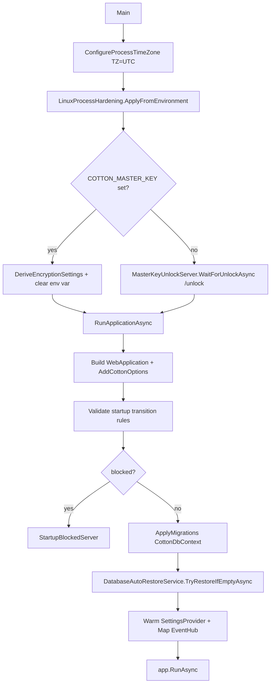
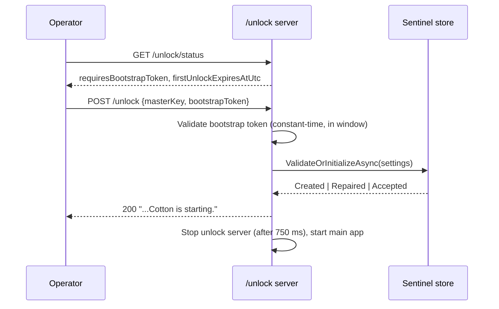

# 27. Deployment & Operations Guide

This is the operator-facing reference for deploying and running Cotton Cloud. It covers prerequisites, the official Docker image and entrypoint, the two master-key strategies, storage backend setup, OIDC, database backup and auto-restore, the container/process hardening signals Cotton self-reports, storage-pressure handling, the first-admin window, demo/public mode, upgrade behavior, and a recommended hardened deployment. Every value, environment variable, and behavior below is verified against source; where the README is aspirational or imprecise it is corrected here with a note. Throughout, settings are marked as either **enforced by code** or **recommended practice** so operators know what Cotton actually does versus what is left to the deployment environment.

## Overview

Cotton ships as a single ASP.NET Core process (`Cotton.Server`) that serves both the REST/SignalR API and the built React UI. It depends on PostgreSQL for metadata and on a storage backend (local filesystem or an S3-compatible object store) for content-addressed chunk blobs. The runtime is .NET 10 (`net10.0`, see `src/Cotton.Server/Cotton.Server.csproj`). The official container is published as `bvdcode/cotton` on Docker Hub and `ghcr.io/bvdcode/cotton` on GitHub Container Registry.

Startup is a two-phase process driven entirely from `src/Cotton.Server/Program.cs`:

1. **Master-key resolution.** Before the main application is built, Cotton resolves the runtime encryption settings either from the `COTTON_MASTER_KEY` environment variable or, if that is absent, from an interactive `/unlock` mini-web-server. The process clock is pinned to UTC and Linux process hardening (`PR_SET_DUMPABLE=0`) is requested *before* key resolution.
2. **Application run.** The full web app is built (`RunApplicationAsync`), startup transition rules are validated, EF migrations are applied, optional auto-restore runs, server settings are warmed, the SignalR hub is mapped, and finally `app.RunAsync()` is awaited.



Note that the hardening call (`LinuxProcessHardening.ApplyFromEnvironment`) happens at the very top of `Main`, before any key material is resolved, so the dump-protection request is in effect by the time the master key is in memory.

## Prerequisites

| Component | Requirement | Source / notes |
| --- | --- | --- |
| .NET runtime | .NET 10 | `src/Cotton.Server/Cotton.Server.csproj` targets `net10.0`; the image base is `mcr.microsoft.com/dotnet/aspnet:10.0`. You do not install .NET separately when using the container. |
| PostgreSQL | A reachable PostgreSQL server | The README quick start uses `postgres:latest`. Cotton creates the `citext` and `hstore` extensions during auto-restore (`DatabaseAutoRestoreService.EnsurePostgresExtensionsAsync`) and applies its own EF migrations on startup. |
| `pg_dump` / `pg_restore` | PostgreSQL client tools matching the server | The image installs `postgresql-client-18` (`src/Cotton.Server/Dockerfile`). Backups use the `pg_dump` custom format (`DumpDatabaseJob` records `DumpFormat: "pg_dump_custom"`). |
| Storage backend | Local filesystem path **or** an S3-compatible endpoint | Selected at runtime from `server_settings.storage_type` (`StorageType.Local = 0` or `StorageType.S3 = 1`), configured in the setup wizard — not via environment variables. |
| Preview tooling | `ffmpeg`/`ffprobe`, `f3d` + `Xvfb` | Bundled in the image. Required only for video/3D previews, not for core storage. |

The image also installs `gosu` (for the non-root drop in the entrypoint) and Mesa/OpenGL libraries (`libosmesa6`, `libgl1`, `libgl1-mesa-dri`, `libegl1`, `libglx-mesa0`) for headless 3D rendering, plus `xauth`.

## Quick start (verified against the README)

The README quick start is accurate. The two key facts to internalize:

- Cotton reads database connection details only from the `COTTON_PG_*` environment variables (`ConfigurationBuilderExtensions.AddCottonOptions`). Defaults when unset are host `localhost`, port `5432`, database `cotton_dev`, user `postgres`, password `postgres`.
- The container listens on port `8080` (the aspnet:10.0 base default; `EXPOSE 8080` in the `Dockerfile`). The `applicationUrl` of `http://localhost:5182` in `src/Cotton.Server/Properties/launchSettings.json` applies only to local `dotnet run`, **not** the container.

```bash
docker run -d --name cotton \
  -p 8080:8080 \
  -v /data/cotton:/app/files \
  -e COTTON_PG_HOST="host.docker.internal" \
  -e COTTON_PG_PORT="5432" \
  -e COTTON_PG_DATABASE="cotton_dev" \
  -e COTTON_PG_USERNAME="postgres" \
  -e COTTON_PG_PASSWORD="postgres" \
  bvdcode/cotton:latest
```

`COTTON_PG_PASSWORD` is consumed once into in-memory configuration and then cleared from both the process and user environment scopes (`ConfigurationBuilderExtensions.AddCottonOptions` sets it to `null` for `EnvironmentVariableTarget.Process` and `EnvironmentVariableTarget.User`). The `/app/files` volume is mandatory and must be persistent: it holds chunk blobs **and** the encrypted master-key sentinel (when the filesystem backend is in use).

### Environment variables

| Variable | Default | Effect | Read by |
| --- | --- | --- | --- |
| `COTTON_PG_HOST` | `localhost` | PostgreSQL host | `ConfigurationBuilderExtensions` |
| `COTTON_PG_PORT` | `5432` | PostgreSQL port (parsed as `ushort`) | `ConfigurationBuilderExtensions` |
| `COTTON_PG_DATABASE` | `cotton_dev` | Database name | `ConfigurationBuilderExtensions` |
| `COTTON_PG_USERNAME` | `postgres` | Database user | `ConfigurationBuilderExtensions` |
| `COTTON_PG_PASSWORD` | `postgres` | Database password (cleared from process + user env after read) | `ConfigurationBuilderExtensions` |
| `COTTON_MASTER_KEY` | unset | 32-character root master key; when set, enables non-interactive boot | `Program.ResolveEncryptionSettingsAsync` |
| `COTTON_RESTORE_DATABASE_IF_EMPTY` | unset (`false`) | Enable startup auto-restore when the DB is empty | `DatabaseAutoRestoreService` |
| `COTTON_PUBLIC_INSTANCE` | unset (`false`) | Mark instance as public/demo | `Constants.IsPublicInstance` |
| `COTTON_PROCESS_HARDENING` | `true` (in image) | Request `PR_SET_DUMPABLE=0` at startup | `LinuxProcessHardening` |
| `COTTON_STORAGE_PATH` | `/app/files` | Storage dir the entrypoint prepares/permission-checks | `docker-entrypoint.sh` only |
| `COTTON_PERMISSION_FIX` | `auto` | `auto` \| `always` \| `never` ownership-repair policy | `docker-entrypoint.sh` |
| `COTTON_RUN_AS` | `app` | Runtime user (name, uid, or `uid:gid`) to drop to | `docker-entrypoint.sh` |
| `DOTNET_EnableDiagnostics` | `0` (in image) | Disable .NET debugger/profiler/EventPipe/dump endpoints | base image / diagnostics check |
| `COMPlus_EnableDiagnostics` | `0` (in image) | Legacy alias of the above | base image / diagnostics check |
| `DOTNET_HOSTBUILDER__RELOADCONFIGONCHANGE` | `false` (in image) | Disable config file watching/reload | base image |
| `AppVersionTracker:ReleaseCheckEnabled` | `true` | Set `false` to disable the GitHub release check | `AppVersionTrackerService` |

`COTTON_STORAGE_PATH` is interpreted **only** by the entrypoint shell script; the .NET `FileSystemStorageBackend` independently resolves its base path as `AppContext.BaseDirectory + "/files"` (`src/Cotton.Storage/Backends/FileSystemStorageBackend.cs`), which is `/app/files` in the container. The runtime backend is constructed via `ActivatorUtilities.CreateInstance` with no explicit base path (`StorageBackendProvider.GetBackend`), so it always uses that default. Keep `COTTON_STORAGE_PATH` aligned with `/app/files` if you override it — they are not wired together in code.

### The official image entrypoint (staged non-root drop)

`src/Cotton.Server/docker-entrypoint.sh` (installed as `/usr/local/bin/cotton-entrypoint`) runs first as root, then drops privileges with `gosu`:

1. Defaults: `COTTON_STORAGE_PATH=/app/files`, `COTTON_PERMISSION_FIX=auto`, `COTTON_RUN_AS=app`.
2. If already non-root (`id -u` != 0) it `exec`s the command immediately — no ownership work.
3. Resolves the target user/uid/gid. An existing user name resolves via `id`; a `uid:gid` string is split; a bare numeric uid uses `${APP_GID:-uid}` as the gid; the special value `app` maps to `${APP_UID:-1654}:${APP_GID:-1654}`. An invalid value exits with code `64`.
4. Creates `$COTTON_STORAGE_PATH/tmp` and, per `COTTON_PERMISSION_FIX`:
   - `auto` — write-test `tmp` as the target user with `gosu`; `chown -R` only if the test fails.
   - `always` — always `chown -R`.
   - `never` — only warn if not writable; never modify ownership.
   - any other value — log an error and exit `64`.
5. `exec gosu "$run_as" "$@"` (default command `dotnet Cotton.Server.dll`).

For a bind mount you pre-own, the README's `chown -R 1654:1654 /data/cotton` plus `COTTON_PERMISSION_FIX=never` avoids the ownership pass entirely. The `Dockerfile` `final` stage also seeds `RUN ... mkdir -p /app/files && chown -R "${APP_UID:-1654}:${APP_UID:-1654}" /app/files`; an in-file comment marks the `1654` fallback as a temporary compatibility bridge for existing root-owned volumes, to be removed after the migration window.

## Master-key strategy

Cotton's root master key derives two process-local secrets through `KeyDerivation.DeriveSubkeyBase64` (`ConfigurationBuilderExtensions.DeriveEncryptionSettings`): a `Pepper` (HKDF label `CottonPepper`) and a `MasterEncryptionKey` (HKDF label `CottonMasterEncryptionKey`), each 32 raw bytes (HKDF over HMAC-SHA256, then Base64-encoded), with `MasterEncryptionKeyId = DefaultMasterKeyId = 1`. The root key **must be exactly 32 characters** (`DefaultKeyLength = 32`); a wrong length throws `InvalidOperationException` on startup (`ValidateRootMasterKey`). This length is a fixed contract — changing it invalidates all derived keys and makes data (including password peppering) unrecoverable.

There are exactly two ways to supply the key:

### Non-interactive: `COTTON_MASTER_KEY`

When the env var is present, `Program.ResolveEncryptionSettingsAsync` derives settings synchronously and then clears the variable from the process and user environment in a `finally` block (`ConfigurationBuilderExtensions.ClearMasterKeyEnvironmentVariable`). The runtime state is recorded as `MasterKeyRuntimeState.FromEnvironment` (`Source = "Environment"`, `EnvironmentVariableWasConfigured = true`).

Trade-off (honest, per README and the security check): Cotton scrubs the variable from its own process, but Docker/orchestrators retain configured env vars in deployment metadata and expose them to `docker exec` sessions. The security diagnostics therefore raise the `master-key-from-environment` warning whenever this mode was used.

### Interactive: `/unlock` + bootstrap token

When `COTTON_MASTER_KEY` is absent, `MasterKeyUnlockServer.WaitForUnlockAsync` starts a minimal web app that serves only the unlock page and static assets. Every API path under `/api/v1` except the unlock endpoints returns `423 Locked` (`LockedApiResponse`). Endpoints:

| Method / Path | Purpose |
| --- | --- |
| `GET /api/v1/unlock/status` | Reports whether a bootstrap token is required and the first-unlock expiry (`requiresBootstrapToken`, `firstUnlockExpiresAtUtc`). |
| `GET /api/v1/unlock/key` | Generates a candidate key: `Convert.ToBase64String(RandomNumberGenerator.GetBytes(24))` (24 bytes → 32 Base64 chars). |
| `POST /api/v1/unlock` | Submits `masterKey` (+ `bootstrapToken` when required), as JSON or form. |

On submit, Cotton derives encryption settings and validates them against the encrypted **master-key sentinel** in storage via `MasterKeySentinelStore.ValidateOrInitializeAsync` (mode `RequireCompatibilityEvidenceForExistingData`). If the sentinel does not yet exist it is created; if it exists, the submitted key must validate against it (or, if the sentinel is unreadable but the key decrypts existing encrypted data, the sentinel is silently repaired). On success the unlock server stops (after a 750 ms delay in `CompleteUnlockAsync`) and the main app boots with the resolved settings; `MasterKeyRuntimeState.FromUnlock` records `Source = "Unlock"` and `EnvironmentVariableWasConfigured = false`.

**Bootstrap token.** A token is required only for the *first* sentinel creation — i.e. when `RequiresBootstrapTokenAsync` returns true: the environment is **not** Development **and** no existing Cotton data is found (`MasterKeyStartupStorage.HasExistingCottonDataAsync`). The token is `Convert.ToHexString(RandomNumberGenerator.GetBytes(16)).ToLowerInvariant()` (32 hex chars), printed as a warning in the container logs at unlock-server startup along with the unlock URL and an expiry timestamp. The window equals `Constants.AdminAutocreateMinutesDelay` = **5 minutes** (`MasterKeyUnlockServer.FirstUnlockWindow = TimeSpan.FromMinutes(...)`). After expiry, first unlock returns `403 Forbidden`; restart to get a fresh token. Token comparison is constant-time (`CryptographicOperations.FixedTimeEquals` after a length check). Later unlocks (sentinel already present) only validate the key and need no token.



Cotton never falls back to a built-in development key. If you lose the key and have no sentinel/backup recovery path, encrypted data is unrecoverable.

### Paranoia Mode (what it actually does)

"Paranoia Mode" is the README's name for the cheap image-baked hardening defaults — there is no single switch. The `Dockerfile` `final` stage sets:

```env
DOTNET_HOSTBUILDER__RELOADCONFIGONCHANGE=false
DOTNET_EnableDiagnostics=0
COMPlus_EnableDiagnostics=0
COTTON_PROCESS_HARDENING=true
```

`COTTON_PROCESS_HARDENING=true` is the only Cotton-specific effect: `LinuxProcessHardening.ApplyFromEnvironment` (invoked at the very top of `Main`) calls `prctl(PR_SET_DUMPABLE, 0)` on Linux. It returns a `ProcessHardeningStatus` (`Requested`, `Applied`, `Error`, `DumpableAfter`) that feeds the security diagnostics. Accepted truthy values are `1`, `true`, `yes`, `on` (case-insensitive). On non-Linux it records the error `"Process dump hardening is only supported on Linux."` and applies nothing. The `DOTNET_EnableDiagnostics`/`COMPlus_EnableDiagnostics=0` pair disables the .NET diagnostics IPC surface (debugger, profiler, EventPipe, dumps). These flags reduce accidental memory exposure; they do **not** hide the in-memory key from code already executing inside the process — a boundary the README states plainly.

## Storage backend setup

The active backend is read from `server_settings.storage_type` and cached (`StorageBackendProvider` + the thread-safe `StorageBackendTypeCache`). It is chosen in the first-run setup wizard, not by environment variable. `StorageBackendTypeCache` exposes `Get`/`TryGet`/`Set`/`Reset`, so a settings change can invalidate the cached choice.

### Filesystem backend

`FileSystemStorageBackend` stores each chunk as a `<fileName>.ctn` file under a two-level shard layout: the storage UID's first two hex chars (`p1`) / next two hex chars (`p2`) / remaining name (`StorageKeyHelper.GetSegments`, which also normalizes/validates the UID as lowercase hex with a 6-char minimum). The README's S3 "segments" terminology refers to this same two-level prefix scheme, applied identically as object-key prefixes on S3 — it is not a configurable namespace.

Writes are atomic and corruption-safe:

- Content is written to a temp file in `<base>/tmp/<fileName>.<guid:N>.tmp`, flushed, then `File.Move(..., overwrite: false)` into the shard directory.
- The final file is marked `ReadOnly | NotContentIndexed` (excludes it from Windows indexing).
- An existing target file ⇒ dedup, the write is skipped before any temp file is created.
- A concurrent-write `IOException` where the file now exists is treated as a benign dedup and the temp file is removed.

`FileSystemStorageBackend` also implements `IStorageCapacityReporter`: `GetCapacitySnapshot()` reports `Backend = "filesystem"`, the resolved root path, and the mounted volume's `TotalSize`/`AvailableFreeSpace` via `DriveInfo` (the longest matching drive root is selected). This feeds the storage-pressure guard (below). Temp files older than the configured TTL are reclaimed by `CleanupTempFiles` via the temp-cleanup job.

### S3-compatible backend

`S3StorageBackend` stores chunks as bucket objects keyed `p1/p2/fileName.ctn`. It implements `IStorageBackendUsesEncryptedConfiguration` (the S3 secret is stored encrypted). Behavior:

- `WriteAsync` calls `ExistsAsync` first and skips redundant uploads (dedup), then buffers to an OS temp file (`Path.GetTempFileName()`) and `PutObject`s it as `application/octet-stream` with chunked encoding disabled (`WithFileBodyCompatibility`).
- `ReadAsync` uses `GetObject` with `ChecksumMode("DISABLED")`.
- `ExistsAsync`/`GetSizeAsync` use `GetObjectMetadata` and treat `NotFound` as absent.
- `ListAllKeysAsync` paginates `ListObjectsV2` (1000 keys/page) and reconstructs UIDs from `.ctn` keys.
- `CleanupTempFiles` is a no-op for S3.
- It does **not** implement `IStorageCapacityReporter`, so the storage-pressure guard treats S3 as unknown-capacity (no 507 from disk-reserve logic; the README confirms S3 is treated as unknown unless the provider exposes a hard limit).

S3 connection settings are read from `server_settings`: `S3EndpointUrl`, `S3Region`, `S3AccessKeyId`, `S3BucketName`, and `S3SecretAccessKeyEncrypted` (entity `CottonServerSettings`, columns `s3_endpoint_url`, `s3_region`, `s3_access_key_id`, `s3_bucket_name`, `s3_secret_access_key_encrypted`). The secret column is annotated `[Encrypted]` and decrypted transparently by the EF value converter when read through the entity:

- **Runtime path** (`S3Provider.GetS3Client`): the provider reads `settings.S3SecretAccessKeyEncrypted` — which EF has already decrypted to plaintext — and passes it straight to `S3CompatibilityFactory.BuildClient`. It does **not** invoke a cipher itself.
- **Startup path** (before EF is available): `MasterKeyStartupStorage` reads `server_settings` with raw SQL and builds a private `StaticS3Provider`, which AES-GCM-decrypts the secret manually with `MasterKeySentinelStore.CreateCipher` (a `StreamCipherFactory`-produced `AesGcmStreamCipher`). A wrong master key surfaces as `"S3 secret access key could not be decrypted with the configured master key."`.

In both paths the client is built via `S3CompatibilityFactory.BuildClient(endpoint, region, accessKeyId, secret)`, which configures `ForcePathStyle = true`, a custom `ServiceURL`, `AuthenticationRegion`, a 5-minute timeout, and `WHEN_REQUIRED` checksum behavior — i.e. it supports custom (non-AWS) S3-compatible endpoints.

When S3 is selected, the master-key sentinel is not written through the filesystem; `MasterKeyStartupStorage.CreateConfiguredBackend` builds the configured backend (filesystem or S3) before validating the sentinel, and because S3 is an `IStorageBackendUsesEncryptedConfiguration` backend the sentinel write is skipped — the master key is instead verified against compatibility evidence in existing encrypted data.

## OIDC setup

OIDC is configured per-provider in the admin UI; see `docs/oidc-setup.md` and the *Authentication & Identity* section for behavior. Operationally:

- The callback path is fixed at `<public-base-url>/api/v1/auth/oidc/callback` — `OidcController` is routed at `Routes.V1.Auth + "/oidc"` with `[HttpGet("callback")]`, and `OidcAuthenticationService.BuildRedirectUri` constructs the URI as `{baseUrl}{Routes.V1.Auth}/oidc/callback`. The provider slug is **not** part of it.
- The base URL comes from `OidcAuthenticationService.ResolvePublicBaseUrl`, which reads `server_settings.public_base_url` (entity `PublicBaseUrl`), trimming a trailing slash. It must be the externally reachable HTTPS origin.
- Behind a reverse proxy, forward `X-Forwarded-Proto` and `X-Forwarded-Host`. `Program.cs` configures `ForwardedHeadersOptions` for exactly these two headers (`ForwardedHeaders.XForwardedProto | ForwardedHeaders.XForwardedHost`) and clears the known-proxy/known-network allow-lists (`KnownIPNetworks.Clear()`, `KnownProxies.Clear()`), so the proxy's forwarded values are honored unconditionally. Put Cotton behind a trusted proxy you control.
- The Issuer URL must omit `/.well-known/openid-configuration`. `openid` scope is required; `openid profile email` is the recommended set. The client secret is `[Encrypted]` in `server_settings` (column `oidc_client_secret_encrypted`, entity `OidcClientSecretEncrypted`).
- Provider options (see the `OidcProvider` entity and *Authentication & Identity*) include enabling sign-in, allowing auto account creation, requiring `email_verified=true`, an allowed-email-domain allow-list, a default role (Admin disallowed as a default), profile-name sync, and avatar import.

## Database backup & auto-restore

Backups are storage-native: PostgreSQL dumps are chunked through Cotton's own storage pipeline (so they are compressed + encrypted like any content) with a manifest and a "latest" pointer.

### Scheduled backups

`DumpDatabaseJob` (`src/Cotton.Server/Jobs/DumpDatabaseJob.cs`) carries `[JobTrigger(days: 7)]`. The `JobTriggerAttribute` defaults are `startNow: true`, `repeatForever: true`, `disallowConcurrentExecution: true`, so the job fires once shortly after startup and then every 7 days. The `Execute` method begins with `await Task.Delay(180_000)` (3 minutes) to let the server stabilize before dumping.

Flow per run:

1. Resolve a backup owner (the lowest-`Id` existing user, `OrderBy(x => x.Id)`); throws `InvalidOperationException` if no users exist.
2. `pg_dump` to a temp file (`<temp>/cotton/db-dumps/db-<yyyyMMdd-HHmmss>-<backupId>.dump`, custom format) via `IPostgresDumpService.DumpToFileAsync`.
3. Chunk the dump at `server_settings.max_chunk_size_bytes`, ingesting each chunk via `IChunkIngestService.UpsertChunkAsync` and recording ordered `BackupChunkInfo`. An empty database still produces one zero-length chunk.
4. Build a `BackupManifest` (`SchemaVersion: 1`) with backup id, elapsed time, `Contains: "postgres_database_dump"`, `DumpFormat: "pg_dump_custom"`, source DB/host/port, hash algorithm, chunk size, dump size, content hash, chunk count, and chunk list; store it content-addressed (storage key = hash of the manifest bytes).
5. Replace the "latest backup" pointer object (`BackupManifestPointer`) — delete then write — at `DatabaseBackupKeyProvider.GetScopedPointerStorageKey()` (derived from the logical key `"database.ctn"` scoped by the master encryption key) so restore discovery finds it.
6. Delete the temp dump in a `finally`.

The manifest, pointer, and listed chunks are protected as live references (so GC will not reclaim them) via `ChunkUsageService` / `DatabaseBackupManifestService` — see the *Storage Lifetime & Garbage Collection* section.

### Manual trigger

Admins can force an immediate backup:

```http
PATCH /api/v1/server/database-backup/trigger
```

`ServerController.TriggerDatabaseBackup` (Admin-only) sends `TriggerDatabaseBackupRequest`, whose handler calls `ISchedulerFactory.TriggerJobAsync<DumpDatabaseJob>()`. Latest-backup metadata is available at `GET /api/v1/server/database-backup/latest` (Admin-only; returns `404` when no backup exists). Admins can likewise force a garbage-collection pass with `PATCH /api/v1/server/gc/trigger` (`ServerController.TriggerGarbageCollector`).

### Auto-restore for empty instances

`DatabaseAutoRestoreService.TryRestoreIfEmptyAsync` runs during startup (`Program.RunApplicationAsync`, after startup transition validation and migrations). It is a no-op unless `COTTON_RESTORE_DATABASE_IF_EMPTY` parses (via `bool.TryParse`) to `true`.

"Empty" means either no rows in `__EFMigrationsHistory`, **or** no rows in both `users` and `server_settings`. When empty, it:

1. Finds the latest backup manifest (`IDatabaseBackupManifestService.TryGetLatestManifestAsync`); skips if none.
2. Rebuilds the dump file from stored chunks in `Order` order, **verifying** the recomputed content hash against `manifest.DumpContentHash` and total bytes against `manifest.DumpSizeBytes` (mismatches throw `InvalidOperationException`).
3. `pg_restore`s the rebuilt dump (`IPostgresDumpService.RestoreFromFileAsync`).
4. Ensures extensions: `CREATE EXTENSION IF NOT EXISTS citext;` and `CREATE EXTENSION IF NOT EXISTS hstore;`, then `ReloadTypesAsync` on the Npgsql connection.
5. Sends a **High**-priority notification to every admin (`UserRole.Admin`) with backup metadata (id, source DB/host/port, created/completed timestamps in the server timezone).
6. Deletes the rebuilt temp dump (`<temp>/cotton/db-restore/restore-<backupId>.dump`) in a `finally`.

> Operator caution: because "empty" can be satisfied by an empty `__EFMigrationsHistory`, leaving `COTTON_RESTORE_DATABASE_IF_EMPTY=true` permanently means a freshly provisioned (but unmigrated) database will auto-restore from the latest backup at startup. This is the intended disaster-recovery behavior; do not enable it casually on a database you intend to migrate fresh.

### Emergency shutdown

`POST /api/v1/server/emergency-shutdown` (Admin-only) sends `EmergencyShutdownRequest`, whose handler calls `Environment.Exit(1)` — an immediate hard process exit. Use it to take an instance down fast (e.g. suspected key compromise); the container/orchestrator restart policy governs what happens next.

## Container / process hardening

The Admin security page (`/admin/security` in the UI) and its backing endpoint expose Cotton's self-assessment:

```http
GET /api/v1/server/security/status
```

This is Admin-only by design (`ServerController.GetSecurityDiagnostics`) — it is an operator check, **not** a healthcheck. `SecurityDiagnosticsService.GetSnapshotAsync` reads process and container signals (`LinuxProcessHardening`, `LinuxContainerSecurity`), admin-2FA counts, master-key source, public-instance flag, .NET diagnostics state, and DB-integrity state, then emits warnings with severities. The score is `max(0, 10 - penalty)` where penalty is `critical=3`, `warning=2`, `info=1` summed across warnings (`CalculateSecurityScore`).

Container detection (`IsContainer`): `DOTNET_RUNNING_IN_CONTAINER=true`, or `/.dockerenv` exists, or `/proc/1/cgroup` mentions `docker`/`kubepods`/`containerd`.

### Warning vectors and remediations

Each row below is a real warning code from `SecurityDiagnosticsService` with the exact condition that raises it and a concrete fix.

| Code | Severity | Raised when | Remediation |
| --- | --- | --- | --- |
| `public-instance` | warning | `COTTON_PUBLIC_INSTANCE` is true | Keep quotas, default content, and abuse monitoring configured; do not run public mode unintentionally. |
| `master-key-from-environment` | warning | `MasterKeyRuntimeState.EnvironmentVariableWasConfigured` (key came from env) | Prefer browser `/unlock`; keep the key in a password manager, not in deployment metadata. |
| `admins-without-2fa` | warning | Any admin lacks `IsTotpEnabled` (`AdminsWithoutTotp > 0`) | Enable TOTP for every admin account. |
| `dotnet-diagnostics-enabled` | warning | Neither `DOTNET_EnableDiagnostics` nor `COMPlus_EnableDiagnostics` equals `0` | Set `DOTNET_EnableDiagnostics=0` (image default). |
| `process-dumpable` | warning | `prctl(PR_GET_DUMPABLE)` != 0 (Linux only) | Set `COTTON_PROCESS_HARDENING=true` (image default) so `PR_SET_DUMPABLE=0` is requested. |
| `sys-ptrace-capability` | **critical** | `CAP_SYS_PTRACE` (cap bit 19) effective in `/proc/self/status` `CapEff` | Drop `SYS_PTRACE`; avoid `--privileged`; use `cap_drop: [ALL]`. |
| `new-privileges-allowed` | warning (container) / info | `NoNewPrivs` == 0 | Add `security_opt: ["no-new-privileges:true"]`. |
| `seccomp-disabled` | warning | `Seccomp` mode == 0 | Keep Docker's default seccomp profile; never `seccomp=unconfined` in prod. |
| `running-as-root` | info | effective uid == 0 (`geteuid`) | Run as a dedicated non-root uid (the image already drops to `app`/1654). |
| `root-filesystem-writable` | info | container `/` mount lacks the `ro` option | `read_only: true` + writable volume only for `/app/files`. |
| `docker-socket-mounted` | **critical** | `docker.sock` mounted/visible in `/proc/self/mountinfo` or on disk | Remove the socket mount — it is effectively host-root from the web process. |
| `host-pid-namespace` | **critical** | `/proc/1/cmdline` looks like host init (`systemd`/`/sbin/init`/`init`) | Remove `pid: host`. |
| `mandatory-access-control-unconfined` | warning | No enforcing AppArmor/SELinux detected (or AppArmor `unconfined`, or SELinux permissive) | Use Docker's default AppArmor, a custom profile, or an enforcing SELinux context. |
| `core-dumps-enabled` | warning | Core soft limit not disabled (`!= 0`) **and** process still dumpable | Set `ulimit core=0` and keep `COTTON_PROCESS_HARDENING=true`. |
| `process-hardening-failed` | warning | Hardening requested but `prctl` failed (`HardeningRequested && !HardeningApplied`) | Investigate the recorded errno; ensure Linux + permitted `prctl`. |
| `db-integrity-unsigned-rows` | **critical** | `UnsignedProtectedRows > 0` (protected rows lack valid integrity signatures) | Restore affected rows from backup or run the required transition version before upgrading. |

The Linux process warnings (`process-dumpable`, `sys-ptrace-capability`, `new-privileges-allowed`, `seccomp-disabled`, `running-as-root`) are only evaluated on Linux. Container-only warnings (`root-filesystem-writable`, `docker-socket-mounted`, `host-pid-namespace`, MAC) are emitted only when `IsContainer()` is true; the core-dump warning is evaluated on any Linux host. `CAP_SYS_PTRACE` is read from the `CapEff` hex mask in `/proc/self/status` by testing bit 19.

### Recommended hardened deployment

The following Compose service is consistent with every check above and aligns with the README's hardening example. Items marked **(recommended)** are enforced by your container runtime, not by Cotton.

```yaml
services:
  cotton:
    image: bvdcode/cotton:latest
    restart: unless-stopped
    ports:
      - "8080:8080"
    read_only: true                       # (recommended) root-filesystem-writable
    cap_drop:
      - ALL                               # (recommended) sys-ptrace-capability
    security_opt:
      - "no-new-privileges:true"          # (recommended) new-privileges-allowed
      # default seccomp + AppArmor are applied by Docker unless overridden
    pids_limit: 256                        # (recommended)
    ulimits:
      core: 0                              # (recommended) core-dumps-enabled
    tmpfs:
      - /tmp                               # writable scratch with read_only rootfs
    volumes:
      - /data/cotton:/app/files            # persistent chunks + sentinel
    environment:
      COTTON_PG_HOST: "postgres"
      COTTON_PG_PORT: "5432"
      COTTON_PG_DATABASE: "cotton"
      COTTON_PG_USERNAME: "cotton"
      COTTON_PG_PASSWORD: "change-me"
      DOTNET_EnableDiagnostics: "0"        # image default; explicit for clarity
      COMPlus_EnableDiagnostics: "0"
      COTTON_PROCESS_HARDENING: "true"     # image default; explicit for clarity
      # Omit COTTON_MASTER_KEY -> unlock via /unlock after restart (best default)
```

With `read_only: true`, give Cotton writable space for its temp work: `/app/files/tmp` lives on the data volume, but the dump/restore code and the S3 upload buffer use the OS temp dir (`Path.GetTempPath()` / `Path.GetTempFileName()`), so mount a writable `tmpfs` at `/tmp`. Do **not** mount the Docker socket, do **not** use `pid: host`, and do **not** disable seccomp. Pre-own the volume (`chown -R 1654:1654 /data/cotton`) and optionally set `COTTON_PERMISSION_FIX=never` so the entrypoint does no ownership pass on a read-only-friendly setup.

> Important boundary (per README): if an attacker can run code inside the Cotton process, these flags cannot hide the in-memory master key from that process. They defend against accidental dumps, diagnostics surfaces, and over-privileged neighbors — not against in-process code execution.

> Note: no `docker-compose.yml` / `compose.yaml` is checked into the repository (the `.dockerignore` at `src/.dockerignore` even excludes `**/docker-compose*`). The Compose snippet above is a template, not a shipped file.

## Storage pressure / capacity reserve (HTTP 507)

`StoragePressureGuard` (`src/Cotton.Server/Services/StoragePressureGuard.cs`) protects the local disk from filling. Before accepting a physical chunk write it reserves capacity against a short-lived cached snapshot from the backend's `IStorageCapacityReporter`. Configuration is `StoragePressureOptions` bound from the `StoragePressure` config section:

| Option | Default | Meaning |
| --- | --- | --- |
| `Enabled` | `true` | Master switch; disabled ⇒ no checks. |
| `MinFreePercent` | `5` | Percentage of total volume to keep free (clamped 0–100). |
| `MinFreeBytes` | `536870912` (512 MiB) | Absolute floor of free bytes. |
| `CheckIntervalSeconds` | `10` (clamped 1–300) | Capacity-snapshot cache TTL. |
| `AdminNotificationCooldownMinutes` | `60` (clamped 1–1440) | Throttle for admin pressure alerts. |

Required free space is `max(MinFreeBytes, ceil(total * MinFreePercent/100))` (`GetRequiredFreeBytes`). The guard reserves incoming bytes against the cached snapshot under a static semaphore, so a burst of concurrent uploads cannot all pass against a stale snapshot; uncommitted reservations are released on `StoragePressureReservation.Dispose`. When a write would breach the reserve it sends a **High**-priority admin notification (once per `AdminNotificationCooldown`) and throws `StoragePressureException`. If the backend is not an `IStorageCapacityReporter`, or the reported total is `<= 0`, the guard simply allows the write.

Endpoints that map `StoragePressureException` (and the WebDAV equivalents) to **HTTP 507 Insufficient Storage**:

| Endpoint | 507 condition | Message |
| --- | --- | --- |
| `POST /api/v1/chunks` (`ChunkController.UploadChunk`) | `StoragePressureException` | "Storage is running out of free space. Uploads are temporarily paused." |
| `POST /api/v1/chunks/raw` (`ChunkController.UploadRawChunk`) | `StoragePressureException` | "Storage is running out of free space. Uploads are temporarily paused." |
| Avatar upload (`UserController`) | `StoragePressureException` | "Storage is running out of free space. Profile avatar uploads are temporarily paused." |
| WebDAV `PUT` (`WebDavController`) | `WebDavPutFileError.StoragePressure` or `.QuotaExceeded` | "Storage is running out of free space" / "Storage quota exceeded" |
| WebDAV `COPY` (`WebDavController`) | `WebDavCopyError.QuotaExceeded` only | "Storage quota exceeded" |

Because the S3 backend is not an `IStorageCapacityReporter`, S3 deployments do not get disk-reserve 507s; capacity must be managed at the bucket/provider level. User-quota 507s (logical quotas, e.g. WebDAV `QuotaExceeded`) are independent of this guard — see the *Quotas* section.

## First-admin creation window

There is no eternal bootstrap backdoor. `Constants.AdminAutocreateMinutesDelay` = **5** minutes. In `AuthController.TryGetNewUserAsync`, when no users exist, the initial admin (`UserRole.Admin`) can be created only while `ApplicationStartupClock.Uptime.TotalMinutes` is within 5 minutes of the main app starting; after that, creation throws a `BadRequestException<User>` instructing the operator to restart the application/container to reopen the window. `ServerController.GetServerInfo` (`GET /api/v1/server/info`) exposes `CanCreateInitialAdmin` (= server has no users) so the UI can show the bootstrap screen. The clock starts when the **main** app starts (after any unlock step), via the `ApplicationStartupClock(DateTimeOffset.UtcNow)` singleton registered in `Program.cs`.

## Demo / public-instance configuration

Setting `COTTON_PUBLIC_INSTANCE=true` flips `Constants.IsPublicInstance` (evaluated once at process start via `bool.TryParse`). Effects observed in code:

- `AuthController.TryGetNewUserAsync` account-creation path: on a public instance, arbitrary credentials create a `UserRole.User` "guest" account, and `DefaultUserContentSeeder.SeedAsync(guest.Id)` copies the configured template into it. (On a non-public instance the same path only allows the time-boxed first admin.)
- On a public instance, `AuthController.GetRequestIpAddress` returns `IPAddress.Loopback` instead of the real client address (so geolocation/abuse signals are neutralized for shared demo accounts).
- `DefaultUserStorageQuotaBytes` (`server_settings.default_user_storage_quota_bytes`) applies a per-user logical quota to new accounts when set; `DefaultUserTemplateNodeId` (`default_user_template_node_id`) selects the template folder copied into each new account.
- The security check raises `public-instance` so operators are reminded to set quotas, default content, and abuse monitoring before internet exposure.
- The README demo flow (`/login?demo=true`) uses per-browser random credentials stored client-side (local storage) rather than a shared `demo/demo` account.

## Upgrade behavior

- **Auto-migrate on startup.** `Program.cs` calls `app.ApplyMigrations<CottonDbContext>()` before serving, so pulling a newer image and restarting applies pending EF migrations automatically. Take a backup (or rely on the backup job) before upgrading.
- **DB-integrity startup transition guard.** Strict releases validate recorded `AppVersion` history before serving normal traffic. A release such as `0.5.0+` can require evidence that a transition release (for example `0.4.33`) already ran; if not, Cotton serves the startup-blocked SPA and `GET /api/v1/startup/status` instead of starting the normal API.
- **App version tracking.** `AppVersionTrackerService` (a hosted `BackgroundService`) records the running version (`AppVersion` rows), warns on downgrades (an unsupported scenario), and — unless disabled via `AppVersionTracker:ReleaseCheckEnabled=false` or the `Testing`/`IntegrationTests` environments — checks `https://api.github.com/repos/bvdcode/cotton/releases/latest` ~45 s after start and notifies admins (Medium priority) when a newer non-draft/non-prerelease release exists. The image build stamps `APP_VERSION` (a `BUILD_VERSION` build arg sourced from GitVersion's SemVer in CI).
- **Image tags.** `:latest` and `:<semver>` are published from `main`; `:dev` from `develop` (see CI under `.github/workflows`). Pin a specific SemVer tag for reproducible upgrades.
- **JWT signing key is regenerated every boot.** `ConfigurationBuilderExtensions.AddCottonOptions` sets `JwtSettings:Key` to a fresh random 32-char string (`StringHelpers.CreateRandomString(DefaultKeyLength)`) on each start (the value in `appsettings.Development.json` is dev-only). Consequence: every restart/upgrade invalidates outstanding access tokens (JWTs), so active users must re-authenticate; refresh tokens persist in the database and clients re-issue access tokens against them.

## Observability

- **Logs.** Default log levels live in `src/Cotton.Server/appsettings.json` (`Default: Information`, `Microsoft.AspNetCore: Warning`, `Microsoft.EntityFrameworkCore.Database.Command: Warning`). `Program.cs` additionally filters DataProtection `XmlKeyManager` to `Error`. Operationally important log lines: the unlock URL + bootstrap token (warnings), backup job start/finish, auto-restore progress, storage-pressure rejections, and version downgrade/update warnings. The container logs to stderr/stdout (standard Kestrel logging).
- **Performance.** A `PerfTracker` singleton plus the `CollectPerformanceJob` (daily) capture metrics; `StoragePipelineProbeService` can run a bounded warmup + measured read/write probe through the configured pipeline when telemetry is enabled, reporting backend type and observed throughput without persisting synthetic giant files.
- **Time.** The process clock is forced to UTC (`Program.ConfigureProcessTimeZone` sets `TZ=UTC` and clears cached timezone data); per-user/server timezone conversion happens at the application layer. Admin-facing timestamps (e.g. restore notifications) use `server_settings.timezone` (`CottonServerSettings.GetTimezoneInfo`, falling back to UTC when unresolvable).

## Background job schedule reference

All jobs use `[JobTrigger(...)]` with the attribute defaults `startNow: true, repeatForever: true, disallowConcurrentExecution: true` (so each runs once near startup, then on the interval).

| Job | Interval | Purpose |
| --- | --- | --- |
| `ComputeManifestHashesJob` | 1 hour | Compute manifest content hashes; flag mismatches. |
| `GeneratePreviewJob` | 15 min | Generate file previews. |
| `GarbageCollectorJob` | 6 hours | Reclaim orphaned chunks (also triggerable via `PATCH /api/v1/server/gc/trigger`). |
| `DownloadTokenRetentionJob` | 1 day | Sweep expired download/share tokens. |
| `RefreshTokenRetentionJob` | 1 day | Sweep expired refresh tokens. |
| `FixMimeTypesJob` | 1 day | Repair MIME types. |
| `CollectPerformanceJob` | 1 day | Collect performance metrics. |
| `BackfillChunkStoredSizeJob` | 1 day | Backfill stored chunk sizes. |
| `ClearTempFolderJob` | 36 hours | Clean storage temp files. |
| `DumpDatabaseJob` | 7 days | Database backup (3-min internal startup delay; triggerable via `PATCH /api/v1/server/database-backup/trigger`). |
| `StorageConsistencyJob` | 30 days | Re-verify stored data against the backend. |

## Verified facts vs. README, and what is not in the repo

- **A Dockerfile and entrypoint DO exist** in the repo at `src/Cotton.Server/Dockerfile` and `src/Cotton.Server/docker-entrypoint.sh`, plus `src/.dockerignore`. There is **no** `docker-compose.yml` / `compose.yaml` checked into the repo. The Compose examples in the README and in this section are templates, not shipped files.
- The image base is `mcr.microsoft.com/dotnet/aspnet:10.0` and the SDK/build stage adds Node.js 26 (the client `.nvmrc` at `src/cotton.client/.nvmrc` = `26`) for the frontend build. Preview tooling (`ffmpeg`, `f3d`, `xvfb`, `xauth`) and `postgresql-client-18` are baked into the base stage.
- SixLabors licensing is build-time only: CI passes a `sixlabors_license` BuildKit secret mounted at `/src/sixlabors.lic` during build/publish, and the publish stage runs `rm -f /app/publish/sixlabors.lic` so it is not present in the published image.
- Default chunk/crypto sizing (`MaxChunkSizeBytes`, `CipherChunkSizeBytes`, `EncryptionThreads`, `CompressionLevel`) is owned at runtime by `server_settings` (entity `CottonServerSettings`, set by the setup wizard). `appsettings.json` ships only logging levels and `AllowedHosts`; there is no `appsettings.Production.json` baked into the image.

## Related sections

See the *Cryptography Engine* and *Master Key & Unlock* sections for key derivation and the sentinel; the *Storage Pipeline & Backends* section for compression/crypto/backend internals; the *Storage Lifetime & Garbage Collection* section for backup-artifact protection and reclaim rules; the *Authentication & Identity* section for OIDC/2FA behavior; the *Database & Migrations* section for the EF model; and the *Background Jobs & Scheduling* section for Quartz internals.
